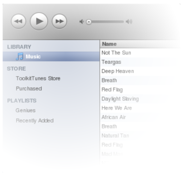
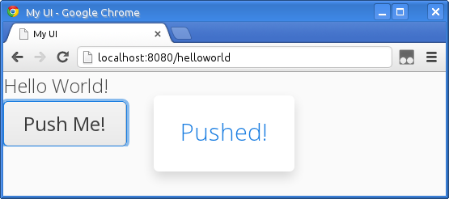

This chapter gives a brief introduction to software development with
Vaadin. We also try to give some insight about the design philosophy
behind Vaadin and its history.

Overview {#intro.overview}
========

Vaadin Framework is a Java web application development framework that is
designed to make creation and maintenance of high quality web-based user
interfaces easy. Vaadin supports two different programming models:
server-side and client-side. The server-driven programming model is the
more powerful one. It lets you forget the web and program user
interfaces much like you would program a desktop application with
conventional Java toolkits such as AWT, Swing, or SWT. But easier.

While traditional web programming is a fun way to spend your time
learning new web technologies, you probably want to be productive and
concentrate on the application logic. The server-side Vaadin framework
takes care of managing the user interface in the browser and the AJAX
communications between the browser and the server. With the Vaadin
approach, you do not need to learn and deal directly with browser
technologies, such as HTML or JavaScript.

? illustrates the basic architectures of web applications made with
Vaadin. The server-side application architecture consists of the
*server-side framework* and a *client-side engine*. The engine runs in
the browser as JavaScript code, rendering the user interface, and
delivering user interaction to the server. The UI logic of an
application runs as a Java Servlet in a Java application server.

As the client-side engine is executed as JavaScript in the browser, no
browser plugins are needed for using applications made with Vaadin. This
gives it an edge over frameworks based on Flash, Java Applets, or other
plugins. Vaadin relies on the support of Google Web Toolkit for a wide
range of browsers, so that the developer does not need to worry about
browser support.

Because HTML, JavaScript, and other browser technologies are essentially
invisible to the application logic, you can think of the web browser as
only a thin client platform. A thin client displays the user interface
and communicates user events to the server at a low level. The control
logic of the user interface runs on a Java-based web server, together
with your business logic. By contrast, a normal client-server
architecture with a dedicated client application would include a lot of
application specific communications between the client and the server.
Essentially removing the user interface tier from the application
architecture makes our approach a very effective one.

Behind the server-driven development model, Vaadin makes the best use of
AJAX (Asynchronous JavaScript and XML, see ? for a description)
techniques that make it possible to create Rich Internet Applications
(RIA) that are as responsive and interactive as desktop applications.

In addition to the server-side Java application development, you can
develop on the client-side by making new widgets in Java, and even pure
client-side applications that run solely in the browser. The Vaadin
client-side framework includes Google Web Toolkit (GWT), which provides
a compiler from Java to the JavaScript that runs in the browser, as well
a full-featured user interface framework. With this approach, Vaadin is
pure Java on both sides. Google Web Toolkit

Vaadin uses a client-side engine for rendering the user interface of a
server-side application in the browser. All the client-server
communications are hidden well under the hood. JavaScript Vaadin is
designed to be extensible, and you can indeed use any 3rd-party widgets
easily, in addition to the component repertoire offered in Vaadin. In
fact, you can find hundreds of add-ons in the Vaadin Directory.

Vaadin allows flexible separation between the appearance, structure, and
interaction logic of the user interface. You can design the layouts
either programmatically or declaratively, at the level of your choosing.
The final appearance is defined in themes in CSS or Sass, as described
in ?.

We hope that this is enough about the basic architecture and features of
Vaadin for now. You can read more about it later in ?, or jump straight
to more practical things in ?.

Example Application Walkthrough {#intro.walkthrough}
===============================

Let us follow the long tradition of first saying "Hello World!" when
learning a new programming framework. First, using the primary
server-side API.

    import com.vaadin.server.VaadinRequest;
    import com.vaadin.ui.Label;
    import com.vaadin.ui.UI;

    @Title("My UI")
    @Theme("valo")
    public class HelloWorld extends UI {
        @Override
        protected void init(VaadinRequest request) {
            // Create the content root layout for the UI
            VerticalLayout content = new VerticalLayout();
            setContent(content);

            // Display the greeting
            content.addComponent(new Label("Hello World!"));

            // Have a clickable button
            content.addComponent(new Button("Push Me!",
                new ClickListener() {
                    @Override
                    public void buttonClick(ClickEvent e) {
                        Notification.show("Pushed!");
                    }
                }));
        }
    }

A Vaadin application has one or more *UI*s that extend the
`com.vaadin.ui.UICLASS` class. A UI is a part of the web page in which
the Vaadin application runs. An application can have multiple UIs in the
same page, especially in portals, or in different windows or tabs. A UI
is associated with a user session, and a session is created for each
user who uses the application. In the context of our Hello World UI, it
is sufficient to know that the underlying session is created when the
user first accesses the application by opening the page, and the init()
method is invoked at that time.

The page title, which is shown in the caption of the browser window or
tab, is defined with an annotation. The example uses a layout component
as the root content of the UI, as that is the case with most Vaadin
applications, which normally have more than one component. It then
creates a new `Label` user interface component, which displays simple
text, and sets the text to "Hello World!". The label is added to the
layout.

The example also shows how to create a button and handle button click
events. Event handling is described in ? and on the practical side in ?.
In addition to listeners, in Java 8 you can handle events with lambda
expressions, which simplifies the handler code significantly.

    content.addComponent(new Button("Push Me!",
        event -> Notification.show("Pushed!")));

The result of the Hello World application, when opened in a browser, is
shown in ?.

To run a program, you need to package it as a web application WAR
package and deploy it to a server, as explained in ?. During
development, you typically deploy to an application server integrated
with the IDE.

Developing a pure client-side application, you could write a Hello World
just as easily, and also in Java:

    public class HelloWorld implements EntryPoint {
        @Override
        public void onModuleLoad() {
            RootPanel.get().add(new Label("Hello, world!"));
        }
    }

We do not set the title here, because it is usually defined in the HTML
page in which the code is executed. The application would be compiled
into JavaScript with the Vaadin Client Compiler (or GWT Compiler). It is
more typical, however, to write client-side widgets, which you can then
use from a server-side Vaadin application. For more information
regarding client-side development, see ?.

Support for the Eclipse IDE
===========================

While Vaadin is not bound to any specific IDE, and you can in fact
easily use it without any IDE altogether, we provide special support for
the Eclipse IDE, which has become the most used environment for Java
development. The support is provided in the Vaadin Plugin for Eclipse,
which helps you in:

-   Creating new Vaadin projects

-   Creating custom themes

-   Creating custom widgets

-   Creating composite components with a visual editor

-   Easily upgrading to a newer version of the Vaadin library

Using the Vaadin Plugin for Eclipse is the recommended way of installing
Vaadin for development. Downloading the installation package that
contains the JARs or defining Vaadin as a Maven dependency is also
possible.

Installing and updating the Eclipse plugin is covered in ? and the
creation of a new Vaadin project using the plugin in ?. See ?, ?, and ?
for instructions on using the different features of the plugin.

Goals and Philosophy {#intro.goals}
====================

Simply put, Vaadin's ambition is to be the best possible tool when it
comes to creating web user interfaces for business applications. It is
easy to adopt, as it is designed to support both entry-level and
advanced programmers, as well as usability experts and graphic
designers.

When designing Vaadin, we have followed the philosophy inscribed in the
following rules.

Because our goals are high, the focus must be clear. Vaadin is designed
for creating web applications. It is not designed for creating websites
or advertisement demos. You may find, for example, JSP/JSF or Flash more
suitable for such purposes.

We have chosen to emphasize robustness, simplicity, and maintainability.
This involves following the well-established best practices in user
interface frameworks and ensuring that our implementation represents an
ideal solution for its purpose without clutter or bloat.

The Web is inherently document-centered and very much bound to the
declarative presentation of user interfaces. While Vaadin allows for
declarative designs of views, layouts, and even entire UIs, the
programmatic approach by building the UIs from Java components frees the
programmer from these limitations. To create highly dynamic views, it is
more natural to create them by programming.

There should not be any limits on what you can do with the framework: if
for some reason the user interface components do not support what you
need to achieve, it must be easy to add new ones to your application.
When you need to create new components, the role of the framework is
critical: it makes it easy to create re-usable components that are easy
to maintain.

Background {#intro.background}
==========

The Vaadin Framework was not written overnight. After working with web
user interfaces since the beginning of the Web, a group of developers
got together in 2000 to form IT Mill. The team had a desire to develop a
new programming paradigm that would support the creation of real user
interfaces for real applications using a real programming language.

The library was originally called Millstone Library. The first version
was used in a large production application that IT Mill designed and
implemented for an international pharmaceutical company. IT Mill made
the application already in the year 2001 and it is still in use. Since
then, the company has produced dozens of large business applications
with the library and it has proven its ability to solve hard problems
easily.

The next generation of the library, IT Mill Toolkit Release 4, was
released in 2006. It introduced an entirely new AJAX-based presentation
engine. This allowed the development of AJAX applications without the
need to worry about communications between the client and the server.

IT Mill Toolkit AJAX IT Mill Toolkit 5, released initially at the end of
2007, took a significant step further into AJAX. The client-side
rendering of the user interface was completely rewritten using GWT, the
Google Web Toolkit. Google Web Toolkit

IT Mill Toolkit 5 introduced many significant improvements both in the
server-side API and in the functionality. Rewriting the Client-Side
Engine with GWT allowed the use of Java both on the client and the
server-side. The transition from JavaScript to GWT made the development
and integration of custom components and customization of existing
components much easier than before, and it also allows easy integration
of existing GWT components. The adoption of GWT on the client-side did
not, by itself, cause any changes in the server-side API, because GWT is
a browser technology that is hidden well behind the API. Also theming
was completely revised in IT Mill Toolkit 5.

The Release 5 was published under the Apache License 2, an unrestrictive
open source license, to create faster expansion of the user base and to
make the formation of a developer community possible.

IT Mill Toolkit was renamed as *Vaadin Framework*, or Vaadin in short,
in spring 2009. Later IT Mill, the company, was also renamed as Vaadin
Ltd. Vaadin means an adult female semi-domesticated mountain reindeer in
Finnish.

With Vaadin 6, the number of developers using the framework exploded.
Together with the release, the Vaadin Plugin for Eclipse was released,
helping the creation of Vaadin projects. The introduction of Vaadin
Directory in early 2010 gave it a further boost, as the number of
available components multiplied almost overnight. Many of the originally
experimental components have since then matured and are now used by
thousands of developers. In 2013, we are seeing tremendous growth in the
ecosystem around Vaadin. The size of the user community, at least if
measured by forum activity, has already gone past the competing
server-side frameworks and even GWT.

Vaadin 7 is a major revision that changes the Vaadin API much more than
Vaadin 6 did. It is certainly more web-oriented than Vaadin 6 was. We
are doing everything we can to help Vaadin rise high in the web
universe. Some of this work is easy and almost routine - fixing bugs and
implementing features. But going higher also requires standing firmer.
That was one of the aims of Vaadin 7 - redesigning the product so that
the new architecture enables Vaadin to reach over many long-standing
challenges. Many of the changes required breaking API compatibility with
Vaadin 6, especially in the client-side, but they are made with a strong
desire to avoid carrying unnecessary legacy burden far into the future.
Vaadin 7 includes a compatibility layer for making adoption of Vaadin 7
in existing applications easier.

Inclusion of the Google Web Toolkit in Vaadin 7 is a significant
development, as it means that we now provide support for GWT as well.
When Google opened the GWT development in summer 2012, Vaadin (the
company) joined the new GWT steering committee. As a member of the
committee, Vaadin can work towards the success of GWT as a foundation of
the Java web development community.
