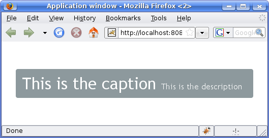

Writing a Server-Side Web Application {#application}
=====================================

This chapter provides the fundamentals of server-side web application
development with Vaadin, concentrating on the basic elements of an
application from a practical point-of-view.

Overview {#application.overview}
========

A server-side Vaadin application runs as a Java Servlet in a servlet
container. The Java Servlet API is, however, hidden behind the
framework. The user interface of the application is implemented as a
*UI* class, which needs to create and manage the user interface
components that make up the user interface. User input is handled with
event listeners, although it is also possible to bind the user interface
components directly to data. The visual style of the application is
defined in themes as CSS or Sass. Icons, other images, and downloadable
files are handled as *resources*, which can be external or served by the
application server or the application itself.

? illustrates the basic architecture of an application made with the
Vaadin Framework, with all the major elements, which are introduced
below and discussed in detail in this chapter.

First of all, a Vaadin application must have one or more UI classes that
extend the abstract `com.vaadin.ui.UICLASS` class and implement the
init() method. A custom theme can be defined as an annotation for the
UI.

    @Theme("hellotheme")
    public class HelloWorld extends UI {
        protected void init(VaadinRequest request) {
            ... initialization code goes here ...
        }
    }

A UI is a viewport to a Vaadin application running in a web page. A web
page can actually have multiple such UIs within it. Such situation is
typical especially with portlets in a portal. An application can run in
multiple browser windows, each having a distinct `UI` instance. The UIs
of an application can be the same UI class or different.

Vaadin framework handles servlet requests internally and associates the
requests with user sessions and a UI state. Because of this, you can
develop Vaadin applications much like you would develop desktop
applications.

The most important task in the initialization is the creation of the
initial user interface. This, and the deployment of a UI as a Java
Servlet in the Servlet container, as described in ?, are the minimal
requirements for an application.

Below is a short overview of the other basic elements of an application
besides UI:

UICLASS

:   A *UI* represents an HTML fragment in which a Vaadin application
    runs in a web page. It typically fills the entire page, but can also
    be just a part of a page. You normally develop a Vaadin application
    by extending the `` class and adding content to it. A UI is
    essentially a viewport connected to a user session of an
    application, and you can have many such views, especially in a
    multi-window application. Normally, when the user opens a new page
    with the URL of the Vaadin UI, a new `UI` (and the associated `Page`
    object) is automatically created for it. All of them share the same
    user session.

    The current UI object can be accessed globally with UI.getCurrent().
    The static method returns the thread-local UI instance for the
    currently processed request(see ?).

Page

:   A `` is associated with a `Page` object that represents the web page
    as well as the browser window in which the UI runs.

    The `Page` object for the currently processed request can be
    accessed globally from a Vaadin application with Page.getCurrent().
    This is equivalent to calling UICLASS.getCurrent().getPage().

Vaadin Session

:   A `VaadinSession` object represents a user session with one or more
    UIs open in the application. A session starts when a user first
    opens a UI of a Vaadin application, and closes when the session
    expires in the server or when it is closed explicitly.

User Interface Components

:   The user interface consists of components that are created by the
    application. They are laid out hierarchically using special *layout
    components*, with a content root layout at the top of the hierarchy.
    User interaction with the components causes *events* related to the
    component, which the application can handle. *Field components* are
    intended for inputting values and can be directly bound to data
    using the Vaadin Data Model. You can make your own user interface
    components through either inheritance or composition. For a thorough
    reference of user interface components, see ?, for layout
    components, see ?, and for compositing components, see ?.

Events and Listeners

:   Vaadin follows an event-driven programming paradigm, in which
    events, and listeners that handle the events, are the basis of
    handling user interaction in an application (although also server
    push is possible as described in ?). ? gave an introduction to
    events and listeners from an architectural point-of-view, while ?
    later in this chapter takes a more practical view.

Resources

:   A user interface can display images or have links to web pages or
    downloadable documents. These are handled as *resources*, which can
    be external or provided by the web server or the application itself.
    ? gives a practical overview of the different types of resources.

Themes

:   The presentation and logic of the user interface are separated.
    While the UI logic is handled as Java code, the presentation is
    defined in *themes* as CSS or SCSS. Vaadin includes some built-in
    themes. User-defined themes can, in addition to style sheets,
    include HTML templates that define custom layouts and other theme
    resources, such as images. Themes are discussed in detail in ?,
    custom layouts in ?, and theme resources in ?.

Data Binding

:   Field components are essentially views to data, represented in the
    *Vaadin Data Model*. Using the data model, the components can get
    their values from and update user input to the data model directly,
    without the need for any control code. A field component is always
    bound to a *property* and a group of fields to an *item* that holds
    the properties. Items can be collected in a *container*, which can
    act as a data source for some components such as tables or lists.
    While all the components have a default data model, they can be
    bound to a user-defined data source. For example, you can bind a
    `Table` component to an SQL query response. For a complete overview
    of data binding in Vaadin, please refer to ?.

Building the UI {#application.architecture}
===============

Vaadin user interfaces are built hierarchically from components, so that
the leaf components are contained within layout components and other
component containers. Building the hierarchy starts from the top (or
bottom - whichever way you like to think about it), from the `UI` class
of the application. You normally set a layout component as the content
of the UI and fill it with other components.

    public class MyHierarchicalUI extends UI {
        @Override
        protected void init(VaadinRequest request) {
            // The root of the component hierarchy
            VerticalLayout content = new VerticalLayout();
            content.setSizeFull(); // Use entire window
            setContent(content);   // Attach to the UI

            // Add some component
            content.addComponent(new Label("Hello!"));

            // Layout inside layout
            HorizontalLayout hor = new HorizontalLayout();
            hor.setSizeFull(); // Use all available space

            // Couple of horizontally laid out components
            Tree tree = new Tree("My Tree",
                    TreeExample.createTreeContent());
            hor.addComponent(tree);

            Table table = new Table("My Table",
                    TableExample.generateContent());
            table.setSizeFull();
            hor.addComponent(table);
            hor.setExpandRatio(table, 1); // Expand to fill

            content.addComponent(hor);
            content.setExpandRatio(hor, 1); // Expand to fill
        }
    }

The component hierarchy could be illustrated with a tree as follows:

    UI
     `-- VerticalLayout
       |-- Label
       `-- HorizontalLayout
         |-- Tree
         `-- Table

The result is shown in ?.

Instead of building the layout in Java, you can also use a declarative
design, as described later in ?. The examples given for the declarative
layouts give exactly the same UI layout as built from the components
above.

The built-in components are described in ? and the layout components in
?.

The example application described above just is, it does not do
anything. User interaction is handled with event listeners, as described
a bit later in ?.

Application Architecture {#application.architecture.architecture}
------------------------

Once your application grows beyond a dozen or so lines, which is usually
quite soon, you need to start considering the application architecture
more closely. You are free to use any object-oriented techniques
available in Java to organize your code in methods, classes, packages,
and libraries. An architecture defines how these modules communicate
together and what sort of dependencies they have between them. It also
defines the scope of the application. The scope of this book, however,
only gives a possibility to mention some of the most common
architectural patterns in Vaadin applications.

The subsequent sections describe some basic application patterns. For
more information about common architectures, see ?, which discusses
layered architectures, the Model-View-Presenter (MVP) pattern, and so
forth. The ? discusses the problem of passing essentially global
references around, a common problem which is also visited in ?.

Compositing Components {#application.architecture.composition}
----------------------

User interfaces typically contain many user interface components in a
layout hierarchy. Vaadin provides many layout components for laying
contained components vertically, horizontally, in a grid, and in many
other ways. You can extend layout components to create composite
components.

    class MyView extends VerticalLayout {
        TextField entry   = new TextField("Enter this");
        Label     display = new Label("See this");
        Button    click   = new Button("Click This");

        public MyView() {
            addComponent(entry);
            addComponent(display);
            addComponent(click);

            // Configure it a bit
            setSizeFull();
            addStyleName("myview");
        }
    }

    // Use it
    Layout myview = new MyView();

This composition pattern is especially supported for creating forms, as
described in ?.

While extending layouts is an easy way to make component composition, it
is a good practice to encapsulate implementation details, such as the
exact layout component used. Otherwise, the users of such a composite
could begin to rely on such implementation details, which would make
changes harder. For this purpose, Vaadin has a special `CustomComponent`
wrapper, which hides the content representation.

    class MyView extends CustomComponent {
        TextField entry   = new TextField("Enter this");
        Label     display = new Label("See this");
        Button    click   = new Button("Click This");

        public MyView() {
            Layout layout = new VerticalLayout();

            layout.addComponent(entry);
            layout.addComponent(display);
            layout.addComponent(click);

            setCompositionRoot(layout);

            setSizeFull();
        }
    }

    // Use it
    MyView myview = new MyView();

For a more detailed description of the `CustomComponent`, see ?. The
Vaadin Plugin for Eclipse also includes a visual editor for composite
components, as described in ?.

View Navigation {#application.architecture.navigation}
---------------

While the most simple applications have just a single *view* (or
*screen*), perhaps most have many. Even in a single view, you often want
to have sub-views, for example to display different content. ?
illustrates a typical navigation between different top-level views of an
application, and a main view with sub-views.

The `Navigator` described in ? is a view manager that provides a
flexible way to navigate between views and sub-views, while managing the
URI fragment in the page URL to allow bookmarking, linking, and going
back in browser history.

Often Vaadin application views are part of something bigger. In such
cases, you may need to integrate the Vaadin applications with the other
website. You can use the embedding techniques described in ?.

Accessing UICLASS, Page, Session, and Service {#application.architecture.accessing}
---------------------------------------------

You can get the UI and the page to which a component is attached to with
getUI() and getPage().

However, the values are `null` until the component is attached to the
UI, and typically, when you need it in constructors, it is not. It is
therefore preferable to access the current UI, page, session, and
service objects from anywhere in the application using the static
getCurrent() methods in the respective ``, `Page`, `VaadinSession`, and
`VaadinService` classes.

    // Set the default locale of the UI
    UI.getCurrent().setLocale(new Locale("en"));

    // Set the page title (window or tab caption)
    Page.getCurrent().setTitle("My Page");

    // Set a session attribute
    VaadinSession.getCurrent().setAttribute("myattrib", "hello");

    // Access the HTTP service parameters
    File baseDir = VaadinService.getCurrent().getBaseDirectory();

You can get the page and the session also from a `UI` with getPage() and
getSession() and the service from `VaadinSession` with getService().

The static methods use the built-in ThreadLocal support in the
classes.The pattern is described in ?.

Designing UIs Declaratively {#application.declarative}
===========================

Declarative definition of composites and even entire UIs makes it easy
for developers and especially graphical designers to work on visual
designs without any coding. Designs can be modified even while the
application is running, as can be the associated themes. A design is a
representation of a component hierarcy, which can be accessed from Java
code to implement dynamic UI logic, as well as data binding.

For example, considering the following layout in Java:

    VerticalLayout vertical = new VerticalLayout ();
    vertical.addComponent(new TextField("Name"));
    vertical.addComponent(new TextField("Street address"));
    vertical.addComponent(new TextField("Postal code"));
    layout.addComponent(vertical);

You could define it declaractively with the following equivalent design:

    <v-vertical-layout>
      <v-text-field caption="Name"/>
      <v-text-field caption="Street address"/>
      <v-text-field caption="Postal code"/>
    </v-vertical-layout>

Declarative designs can be crafted by hand, but are most conveniently
created with the Vaadin Designer.

In the following, we first go through the syntax of the declarative
design files, and then see how to use them in applications by binding
them to data and handling user interaction events.

Declarative Syntax {#application.declarative.syntax}
------------------

A design is an HTML document with custom elements for representing
components and their configuration. A design has a single root component
inside the HTML body element. Enclosing `<html>`, `<head>`, `<body>` are
optional, but necessary if you need to make namespace definitions for
custom components. Other regular HTML elements may not be used in the
file, except inside components that specifically accept HTML content.

In a design, each nested element corresponds to a Vaadin component in a
component tree. Components can have explicitly given IDs to enable
binding them to variables in the Java code, as well as optional
attributes.

    <!DOCTYPE html>
    <html>
      <body>
        <v-vertical-layout size-full>
          <!-- Label with HTML content -->
          <v-label><b>Hello!</b> - How are you?</v-label>

          <v-horizontal-layout size-full :expand>
            <v-tree _id="mytree" caption="My Tree"
                    width-auto height-full/>
            <v-table _id="mytable" caption="My Table"
                     size-full :expand/>
          </v-horizontal-layout>
        </v-vertical-layout>
      </body>
    </html>

The DOCTYPE is not required, neither is the `<html>`, or `<body>`
elements. Nevertheless, there may only be one design root element.

The above design defines the same UI layout as done earlier with Java
code, and illustrated in ?.

Component Elements {#application.declarative.elements}
------------------

HTML elements of the declarative syntax are directly mapped to Vaadin
components according to their Java class names. The tag of a component
element has a namespace prefix separated by a dash. Vaadin core
components, which are defined in the com.vaadin.ui package, have `v-`
prefix. The rest of an element tag is determined from the Java class
name of the component, by making it lower-case, while adding a dash
(`-`) before every previously upper-case letter as a word separator. For
example, `ComboBox` component has declarative element tag
`<v-combo-box>`.

### Component Prefix to Package Mapping {#application.declarative.elements.prefix}

You can use any components in a design: components extending Vaadin
components, composite components, and add-on components. To do so, you
need to define a mapping from an element prefix to the Java package of
the component. The prefix is used as a sort of a namespace.

The mappings are defined in `<meta name="package-mapping"
                    ...>` elements in the HTML head. A `content`
attribute defines a mapping, in notation with a prefix separated from
the corresponding Java package name with a colon, such as
"`my:com.example.myapp`".

For example, consider that you have the following composite class
`com.example.myapp.ExampleComponent`:

    package com.example.myapp;

    public class ExampleComponent extends CustomComponent {
        public ExampleComponent() {
            setCompositionRoot(new Label("I am an example."));
        }
    }

You would make the package prefix mapping and then use the component as
follows:

    <!DOCTYPE html>
    <html>
      <head>
        <meta name="package-mapping"
              content="my:com.example.myapp" />
      </head>

      <body>
        <v-vertical-layout>
          <v-label><b>Hello!</b> - How are you?</v-label>

          <!-- Use it here -->
          <my-example-component/>
        </v-vertical-layout>
      </body>
    </html>

### Inline Content and Data {#application.declarative.elements.inline}

The element content can be used for certain default attributes, such as
a button caption. For example:

    <v-button><b>OK</b></v-button>

Some components, such as selection components, allow defining inline
data within the element. For example:

    <v-native-select>
      <option>Mercury</option>
      <option>Venus</option>
      <option selected>Earth</option>
    </v-native-select>

The declarative syntax of each component type is described in the
JavaDoc API documentation of Vaadin.

Component Attributes {#application.declarative.attributes}
--------------------

### Attribute-to-Property Mapping {#application.declarative.attributes.mapping}

Component properties are directly mapped to the attributes of the HTML
elements according to the names of the properties. Attributes are
written in lower-case letters and dash is used for word separation
instead of upper-case letters in the Java methods, so that
`input-prompt` attribute is equivalent to setInputPrompt().

For example, the *caption* property, which you can set with
setCaption(), is represented as `caption` attribute. You can find the
component properties by the setter methods in the [JavaDoc API
documentation](#) of the component classes.

    <v-text-field caption="Name" input-prompt="Enter Name"/>

### Attribute Values {#application.declarative.attributes.parameters}

Attribute parameters must be enclosed in quotes and the value given as a
string must be convertible to the type of the property (string, integer,
boolean, or enumeration). Object types are not supported.

Some attribute names are given by a shorthand. For example,
`alternateText` property of the `Image` component, which you would set
with setAlternateText(), is given as the `alt` attribute.

Boolean values must be either "`true`" or "`false`". The value can be
omitted, in which case `true` is assumed. For example, the `enabled`
attribute is boolean and has default value "`true`", so `enabled="true"`
and `enabled` and equivalent.

    <v-button caption="OK" enabled="false"/>

### Parent Component Settings {#application.declarative.attributes.parent}

Certain settings, such as a component's alignment in a layout, are not
done in the component itself, but in the layout. Attributes prefixed
with colon (`:`) are passed to the containing component, with the
component as a target parameter. For example, `:expand="1"` given for a
component `c` is equivalent to calling setExpandRatio(c, 1) for the
containing layout.

    <v-vertical-layout size-full>
      <!-- Align right in the containing layout -->
      <v-label width-auto :right>Hello!</v-label>

      <!-- Expands to take up all remaining vertical space -->
      <v-horizontal-layout size-full :expand>
        <!-- Automatic width - shrinks horizontally -->
        <v-tree width-auto height-full/>

        <!-- Expands horizontally to take remaining space -->
        <v-table size-full :expand/>
      </v-horizontal-layout>
    </v-vertical-layout>

Again, compare the above declaration to the Java code given in ?.

Component Identifiers {#application.declarative.identifiers}
---------------------

Components can be identified by either an identifier or a caption. There
are two types of identifiers: page-global and local. This allows
accessing them from Java code and binding them to components, as
described later in ?.

The `id` attribute can be used to define a page-global identifier, which
must be unique within the page. Another design or UI shown
simultaneously in the same page may not have components sharing the same
ID. Using global identifiers is therefore not recommended, except in
special cases where uniqueness is ensured.

The `_id` attribute defines a local identifier used only within the
design. This is the recommended way to identifying components.

    <v-tree _id="mytree" caption="My Tree"/>

Using Designs in Code {#application.declarative.composite}
---------------------

The main use of declarative designs is in building application views,
sub-views, dialogs, and forms through composition. The two main tasks
are filling the designs with application data and handling user
interaction events.

### Binding to a Design Root {#application.declarative.composite.designroot}

You can bind any component container as the root component of a design
with the `@DesignRoot` annotation. The class must match or extend the
class of the root element in the design.

The member variables are automatically initialized from the design
according to the component identifiers (see ?), which must match the
variable names.

For example, the following class could be used to bind the design given
earlier.

    @DesignRoot
    public class MyViewDesign extends VerticalLayout {
        Tree mytree;
        Table mytable;

        public MyViewDesign() {
            Design.read("MyDeclarativeUI.html", this);

            // Show some (example) data
            mytree.setContainerDataSource(
                TreeExample.createTreeContent());
            mytable.setContainerDataSource(
                TableExample.generateContent());

            // Some interaction
            mytree.addItemClickListener(event -> // Java 8
                Notification.show("Selected " +
                    event.getItemId()));
        }
    }

The design root class must match or extend the root element class of the
design. For example, earlier we had `<v-vertical-layout>` element in the
HTML file, which can be bound to a class extending `VerticalLayout`.

### Using a Design {#application.declarative.composite.using}

The fact that a component is defined declaratively is not visible in its
API, so you can create and use such it just like any other component.

For example, to use the previously defined design root component as the
content of the entire UI:

    public class DeclarativeViewUI extends UI {
        @Override
        protected void init(VaadinRequest request) {
            setContent(new MyViewDesign());
        }
    }

### Designs in View Navigation {#application.declarative.composite.viewnavigation}

To use a design in view navigation, as described in ?, you just need to
implement the View interface.

    @DesignRoot
    public class MainView extends VerticalLayout
                          implements View {
        public MainView() {
            Design.read(this);
            ...
        }
        ...
    }

    ...
    // Use the view by precreating it
    navigator.addView(MAINVIEW, new MainView());

See ? for a complete example.

Handling Events with Listeners {#application.events}
==============================

Let us put into practice what we learned of event handling in ?. You can
implement listener interfaces in a regular class, but it brings the
problem with differentiating between different event sources. Using
anonymous class for listeners is recommended in most cases.

Using Anonymous Classes {#application.events.anonymous}
-----------------------

By far the easiest and the most common way to handle events in Java 6
and 7 is to use anonymous local classes. It encapsulates the handling of
events to where the component is defined and does not require cumbering
the managing class with interface implementations. The following example
defines an anonymous class that inherits the `Button.ClickListener`
interface.

    // Have a component that fires click events
    final Button button = new Button("Click Me!");

    // Handle the events with an anonymous class
    button.addClickListener(new Button.ClickListener() {
        public void buttonClick(ClickEvent event) {
            button.setCaption("You made me click!");
        }
    });

Local objects referenced from within an anonymous class, such as the
`Button` object in the above example, must be declared `final`.

Most components allow passing a listener to the constructor, thereby
losing a line or two. However, notice that if accessing the component
that is constructed from an anonymous class, you must use a reference
that is declared before the constructor is executed, for example as a
member variable in the outer class. If it is declared in the same
expression where the constructor is called, it doesn't yet exist. In
such cases, you need to get a reference to the component from the event
object.

    final Button button = new Button("Click It!",
      new Button.ClickListener() {
        @Override
        public void buttonClick(ClickEvent event) {
            event.getButton().setCaption("Done!");
        }
      });

Handling Events in Java 8 {#application.events.java8}
-------------------------

Java 8 introduced lambda expressions, which offer a replacement for
listeners. You can directly use lambda expressions in place of listeners
that have only one method to implement.

For example, in the following, we use a lambda expression to handle
button click events in the constructor:

    layout.addComponent(new Button("Click Me!",
        event -> event.getButton().setCaption("You made click!")));

Java 8 is the future that is already here, and as Vaadin API uses event
listeners extensively, using lambda expressions makes UI code much more
readable.

Directing events to handler methods is easy with method references:

    public class Java8Buttons extends CustomComponent {
        public Java8Buttons() {
            setCompositionRoot(new HorizontalLayout(
                new Button("OK", this::ok),
                new Button("Cancel", this::cancel)));
        }

        public void ok(ClickEvent event) {
            event.getButton().setCaption ("OK!");
        }

        public void cancel(ClickEvent event) {
            event.getButton().setCaption ("Not OK!");
        }
    }

Implementing a Listener in a Regular Class {#application.events.classlistener}
------------------------------------------

The following example follows a typical pattern where you have a
`Button` component and a listener that handles user interaction (clicks)
communicated to the application as events. Here we define a class that
listens to click events.

    public class MyComposite extends CustomComponent
                 implements Button.ClickListener {
        Button button; // Defined here for access

        public MyComposite() {
            Layout layout = new HorizontalLayout();

            // Just a single component in this composition
            button = new Button("Do not push this");
            button.addClickListener(this);
            layout.addComponent(button);

            setCompositionRoot(layout);
        }

        // The listener method implementation
        public void buttonClick(ClickEvent event) {
            button.setCaption("Do not push this again");
        }
    }

Differentiating Between Event Sources {#application.events.differentiation}
-------------------------------------

If an application receives events of the same type from multiple
sources, such as multiple buttons, it has to be able to distinguish
between the sources. If using a regular class listener, distinguishing
between the components can be done by comparing the source of the event
with each of the components. The method for identifying the source
depends on the event type.

    public class TheButtons extends CustomComponent
           implements Button.ClickListener {
        Button onebutton;
        Button toobutton;

        public TheButtons() {
            onebutton = new Button("Button One", this);
            toobutton = new Button("A Button Too", this);

            // Put them in some layout
            Layout root = new HorizontalLayout();
            root.addComponent(onebutton);
            root.addComponent(toobutton);
            setCompositionRoot(root);
        }

        @Override
        public void buttonClick(ClickEvent event) {
            // Differentiate targets by event source
            if (event.getButton() == onebutton)
                onebutton.setCaption ("Pushed one");
            else if (event.getButton() == toobutton)
                toobutton.setCaption ("Pushed too");
        }
    }

Other techniques exist for separating between event sources, such as
using object properties, names, or captions to separate between them.
Using captions or any other visible text is generally discouraged, as it
may create problems for internationalization. Using other symbolic
strings can also be dangerous, because the syntax of such strings is
checked only at runtime.

Images and Other Resources {#application.resources}
==========================

Web applications can display various *resources*, such as images, other
embedded content, or downloadable files, that the browser has to load
from the server. Image resources are typically displayed with the
`Image` component or as component icons. Flash animations can be
displayed with `Flash`, embedded browser frames with `BrowserFrame`, and
other content with the `Embedded` component, as described in ?.
Downloadable files are usually provided by clicking a `Link`.

There are several ways to how such resources can be provided by the web
server. Static resources can be provided without having to ask for them
from the application. For dynamic resources, the user application must
be able to create them dynamically. The resource request interfaces in
Vaadin allow applications to both refer to static resources as well as
dynamically create them. The dynamic creation includes the
`StreamResource` class and the RequestHandler described in ?.

Vaadin also provides low-level facilities for retrieving the URI and
other parameters of a HTTP request. We will first look into how
applications can provide various kinds of resources and then look into
low-level interfaces for handling URIs and parameters to provide
resources and functionalities.

Notice that using request handlers to create "pages" is not normally
meaningful in Vaadin or in AJAX applications generally. Please see ? for
a detailed explanation.

Resource Interfaces and Classes {#application.resources.api}
-------------------------------

The resource classes in Vaadin are grouped under two interfaces: a
generic `Resource` interface and a more specific `ConnectorResource`
interface for resources provided by the servlet.

File Resources {#application.resources.file}
--------------

File resources are files stored anywhere in the file system. As such,
they can not be retrieved by a regular URL from the server, but need to
be requested through the Vaadin servlet. The use of file resources is
typically necessary for persistent user data that is not packaged in the
web application, which would not be persistent over redeployments.

A file object that can be accessed as a file resource is defined with
the standard `java.io.File` class. You can create the file either with
an absolute or relative path, but the base path of the relative path
depends on the installation of the web server. For example, with Apache
Tomcat, the default current directory would be the installation path of
Tomcat.

In the following example, we provide an image resource from a file
stored in the web application. Notice that the image is stored under the
`WEB-INF` folder, which is a special folder that is never accessible
using an URL, unlike the other folders of a web application. This is a
security solution - another would be to store the resource elsewhere in
the file system.

    // Find the application directory
    String basepath = VaadinService.getCurrent()
                      .getBaseDirectory().getAbsolutePath();

    // Image as a file resource
    FileResource resource = new FileResource(new File(basepath +
                            "/WEB-INF/images/image.png"));

    // Show the image in the application
    Image image = new Image("Image from file", resource);

    // Let the user view the file in browser or download it
    Link link = new Link("Link to the image file", resource);

The result, as well as the folder structure where the file is stored
under a regular Eclipse Vaadin project, is shown in ?.

Class Loader Resources {#application.resources.class}
----------------------

The `ClassResource` allows resources to be loaded from the class path
using Java Class Loader. Normally, the relevant class path entry is the
`WEB-INF/classes` folder under the web application, where the Java
compilation should compile the Java classes and copy other files from
the source tree.

The one-line example below loads an image resource from the application
package and displays it in an `Image` component.

    layout.addComponent(new Image(null,
            new ClassResource("smiley.jpg")));

Theme Resources {#application.resources.theme}
---------------

Theme resources of `ThemeResource` class are files, typically images,
included in a theme. A theme is located with the path
`VAADIN/themes/themename` in a web application. The name of a theme
resource is given as the parameter for the constructor, with a path
relative to the theme folder.

    // A theme resource in the current theme ("mytheme")
    // Located in: VAADIN/themes/mytheme/img/themeimage.png
    ThemeResource resource = new ThemeResource("img/themeimage.png");

    // Use the resource
    Image image = new Image("My Theme Image", resource);

The result is shown in ?, also illustrating the folder structure for the
theme resource file in an Eclipse project.

To use theme resources, you must set the theme for the UI. See ? for
more information regarding themes.

Stream Resources {#application.resources.stream}
----------------

Stream resources allow creating dynamic resource content. Charts are
typical examples of dynamic images. To define a stream resource, you
need to implement the `StreamResource.StreamSource` interface and its
getStream() method. The method needs to return an `InputStream` from
which the stream can be read.

The following example demonstrates the creation of a simple image in PNG
image format.

    import java.awt.image.*;

    public class MyImageSource
                 implements StreamResource.StreamSource {
        ByteArrayOutputStream imagebuffer = null;
        int reloads = 0;

        /* We need to implement this method that returns
         * the resource as a stream. */
        public InputStream getStream () {
            /* Create an image and draw something on it. */
            BufferedImage image = new BufferedImage (200, 200,
                                   BufferedImage.TYPE_INT_RGB);
            Graphics drawable = image.getGraphics();
            drawable.setColor(Color.lightGray);
            drawable.fillRect(0,0,200,200);
            drawable.setColor(Color.yellow);
            drawable.fillOval(25,25,150,150);
            drawable.setColor(Color.blue);
            drawable.drawRect(0,0,199,199);
            drawable.setColor(Color.black);
            drawable.drawString("Reloads="+reloads, 75, 100);
            reloads++;

            try {
                /* Write the image to a buffer. */
                imagebuffer = new ByteArrayOutputStream();
                ImageIO.write(image, "png", imagebuffer);

                /* Return a stream from the buffer. */
                return new ByteArrayInputStream(
                             imagebuffer.toByteArray());
            } catch (IOException e) {
                return null;
            }
        }
    }

The content of the generated image is dynamic, as it updates the reloads
counter with every call. The `ImageIO`.write() method writes the image
to an output stream, while we had to return an input stream, so we
stored the image contents to a temporary buffer.

Below we display the image with the `Image` component.

    // Create an instance of our stream source.
    StreamResource.StreamSource imagesource = new MyImageSource ();

    // Create a resource that uses the stream source and give it a name.
    // The constructor will automatically register the resource in
    // the application.
    StreamResource resource =
            new StreamResource(imagesource, "myimage.png");

    // Create an image component that gets its contents
    // from the resource.
    layout.addComponent(new Image("Image title", resource));

The resulting image is shown in ?.

Another way to create dynamic content is a request handler, described in
?.

Handling Errors {#application.errors}
===============

Error Indicator and Message {#application.errors.error-indicator}
---------------------------

All components have a built-in error indicator that is turned on if
validating the component fails, and can be set explicitly with
setComponentError(). Usually, the error indicator is placed right of the
component caption. The error indicator is part of the component caption,
so its placement is usually managed by the layout in which the component
is contained, but some components handle it themselves. Hovering the
mouse pointer over the field displays the error message.

    textfield.setComponentError(new UserError("Bad value"));
    button.setComponentError(new UserError("Bad click"));

The result is shown in ?.

Customizing System Messages {#application.errors.systemmessages}
---------------------------

System messages are notifications that indicate a major invalid state
that usually requires restarting the application. Session timeout is
perhaps the most typical such state.

System messages are strings managed in the `SystemMessages` class.

sessionExpired

:   session expiration session timeout Application servlet session
    expired. A session expires if no server requests are made during the
    session timeout period. The session timeout can be configured with
    the `session-timeout` parameter in `web.xml`, as described in ?.

communicationError

:   An unspecified communication problem between the Vaadin Client-Side
    Engine and the application server. The server may be unavailable or
    there is some other problem.

authenticationError

:   This error occurs if 401 (Unauthorized) response to a request is
    received from the server.

internalError

:   A serious internal problem, possibly indicating a bug in Vaadin
    Client-Side Engine or in some custom client-side code.

outOfSync

:   The client-side state is invalid with respect to server-side state.

cookiesDisabled

:   Informs the user that cookies are disabled in the browser and the
    application does not work without them.

Each message has four properties: a short caption, the actual message, a
URL to which to redirect after displaying the message, and property
indicating whether the notification is enabled.

Additional details may be written (in English) to the debug console
window described in ?.

You can override the default system messages by setting the
SystemMessagesProvider in the `VaadinService`. You need to implement the
getSystemMessages() method, which should return a `SystemMessages`
object. The easiest way to customize the messages is to use a
`CustomizedSystemMessages` object.

You can set the system message provider in the servletInitialized()
method of a custom servlet class, for example as follows:

    getService().setSystemMessagesProvider(
        new SystemMessagesProvider() {
        @Override
        public SystemMessages getSystemMessages(
            SystemMessagesInfo systemMessagesInfo) {
            CustomizedSystemMessages messages =
                    new CustomizedSystemMessages();
            messages.setCommunicationErrorCaption("Comm Err");
            messages.setCommunicationErrorMessage("This is bad.");
            messages.setCommunicationErrorNotificationEnabled(true);
            messages.setCommunicationErrorURL("http://vaadin.com/");
            return messages;
        }
    });

See ? for information about customizing Vaadin servlets.

Handling Uncaught Exceptions {#application.errors.unchecked-exceptions}
----------------------------

Handling events can result in exceptions either in the application logic
or in the framework itself, but some of them may not be caught properly
by the application. Any such exceptions are eventually caught by the
framework. It delegates the exceptions to the `DefaultErrorHandler`,
which displays the error as a component error, that is, with a small red
"!" -sign (depending on the theme). If the user hovers the mouse pointer
over it, the entire backtrace of the exception is shown in a large
tooltip box, as illustrated in ?.

You can customize the default error handling by implementing a custom
ErrorHandler and enabling it with setErrorHandler() in any of the
components in the component hierarchy, including the `UI`, or in the
`VaadinSession` object. You can either implement the ErrorHandler or
extend the `DefaultErrorHandler`. In the following example, we modify
the behavior of the default handler.

    // Here's some code that produces an uncaught exception
    final VerticalLayout layout = new VerticalLayout();
    final Button button = new Button("Click Me!",
        new Button.ClickListener() {
        public void buttonClick(ClickEvent event) {
            ((String)null).length(); // Null-pointer exception
        }
    });
    layout.addComponent(button);

    // Configure the error handler for the UI
    UI.getCurrent().setErrorHandler(new DefaultErrorHandler() {
        @Override
        public void error(com.vaadin.server.ErrorEvent event) {
            // Find the final cause
            String cause = "<b>The click failed because:</b> ";
            for (Throwable t = event.getThrowable(); t != null;
                 t = t.getCause())
                if (t.getCause() == null) // We're at final cause
                    cause += t.getClass().getName() + " ";

            // Display the error message in a custom fashion
            layout.addComponent(new Label(cause, ContentMode.HTML));

            // Do the default error handling (optional)
            doDefault(event);
        }
    });

The above example also demonstrates how to dig up the final cause from
the cause stack.

When extending `DefaultErrorHandler`, you can call doDefault() as was
done above to run the default error handling, such as set the component
error for the component where the exception was thrown. See the source
code of the implementation for more details. You can call
findAbstractComponent(event) to find the component that caused the
error. If the error is not associated with a component, it returns null.

Notifications {#application.notifications}
=============

Notifications are error or information boxes that appear briefly,
typically at the center of the screen. A notification box has a caption
and an optional description and icon. The box stays on the screen either
for a preset time or until the user clicks it. The notification type
defines the default appearance and behaviour of a notification.

There are two ways to create a notification. The easiest is to use a
static shorthand Notification.show() method, which takes the caption of
the notification as a parameter, and an optional description and
notification type, and displays it in the current page.

    Notification.show("This is the caption",
                      "This is the description",
                      Notification.Type.WARNING_MESSAGE);

For more control, you can create a `Notification` object. Different
constructors exist for taking just the caption, and optionally the
description, notification type, and whether HTML is allowed or not.
Notifications are shown in a `Page`, typically the current page.

    new Notification("This is a warning",
        " This is the <i>last</i> warning",
        Notification.TYPE_WARNING_MESSAGE, true)
        .show(Page.getCurrent());

The caption and description are by default written on the same line. If
you want to have a line break between them, use the HTML line break
markup "` `" if HTML is enabled, or "`\n`" if not. HTML is disabled
by default, but can be enabled with setHtmlContentAllowed(true). When
enabled, you can use any HTML markup in the caption and description of a
notification. If it is in any way possible to get the notification
content from user input, you should either disallow HTML or sanitize the
content carefully, as noted in ?.

Notification Type {#application.notifications.type}
-----------------

The notification type defines the overall default style and behaviour of
a notification. If no notification type is given, the "humanized" type
is used as the default. The notification types, listed below, are
defined in the `Notification.Type` class.

`TYPE_HUMANIZED_MESSAGE` 

:   A user-friendly message that does not annoy too much: it does not
    require confirmation by clicking and disappears quickly. It is
    centered and has a neutral gray color.

`TYPE_WARNING_MESSAGE` 

:   Warnings are messages of medium importance. They are displayed with
    colors that are neither neutral nor too distractive. A warning is
    displayed for 1.5 seconds, but the user can click the message box to
    dismiss it. The user can continue to interact with the application
    while the warning is displayed.

`TYPE_ERROR_MESSAGE` 

:   Error messages are notifications that require the highest user
    attention, with alert colors, and they require the user to click the
    message to dismiss it. The error message box does not itself include
    an instruction to click the message, although the close box in the
    upper right corner indicates it visually. Unlike with other
    notifications, the user can not interact with the application while
    the error message is displayed.

`TYPE_TRAY_NOTIFICATION` 

:   Tray notifications are displayed in the "system tray" area, that is,
    in the lower-right corner of the browser view. As they do not
    usually obscure any user interface, they are displayed longer than
    humanized or warning messages, 3 seconds by default. The user can
    continue to interact with the application normally while the tray
    notification is displayed.

Customizing Notifications {#application.notifications.customization}
-------------------------

All of the features of specific notification types can be controlled
with the `Notification` properties. Once configured, you need to show it
in the current page.

    // Notification with default settings for a warning
    Notification notif = new Notification(
        "Warning",
        " Area of reindeer husbandry",
        Notification.TYPE_WARNING_MESSAGE);

    // Customize it
    notif.setDelayMsec(20000);
    notif.setPosition(Position.BOTTOM_RIGHT);
    notif.setStyleName("mystyle");
    notif.setIcon(new ThemeResource("img/reindeer.png"));

    // Show it in the page
    notif.show(Page.getCurrent());

The setPosition() method allows setting the positioning of the
notification. The position can be specified by any of the constants
defined in the `Position` enum.

The setDelayMSec() allows setting the time for how long the notification
is displayed in milliseconds. Parameter value `-1` means that the
message is displayed until the user clicks the message box. It also
prevents interaction with other parts of the application window, which
is the default behaviour for error notifications. It does not, however,
add a close box that the error notification has.

Styling with CSS {#application.notifications.css}
----------------

    .v-Notification {}
      .popupContent {}
        .gwt-HTML {}
          h1 {}
          p  {}

The notification box is a floating `div` element under the `body`
element of the page. It has an overall `v-Notification` style. The
content is wrapped inside an element with `popupContent` style. The
caption is enclosed within an `h1` element and the description in a `p`
element.

To customize it, add a style for the `Notification` object with
setStyleName("mystyle"), and make the settings in the theme, for example
as follows:

    .v-Notification.mystyle {
        background: #FFFF00;
        border: 10px solid #C00000;
        color: black;
    }

The result is shown, with the icon set earlier in the customization
example, in ?.

Application Lifecycle {#application.lifecycle}
=====================

In this section, we look into more technical details of application
deployment, user sessions, and UI instance lifecycle. These details are
not generally needed for writing Vaadin applications, but may be useful
for understanding how they actually work and, especially, in what
circumstances their execution ends.

Deployment {#application.lifecycle.deployment}
----------

Before a Vaadin application can be used, it has to be deployed to a Java
web server, as described in ?. Deploying reads the servlet classes
annotated with the `@WebServlet` annotation (Servlet 3.0) or the
`web.xml` deployment descriptor (Servlet 2.4) in the application to
register servlets for specific URL paths and loads the classes.
Deployment does not yet normally run any code in the application,
although static blocks in classes are executed when they are loaded.

### Undeploying and Redeploying {#application.lifecycle.deployment.redeployment}

Applications are undeployed when the server shuts down, during
redeployment, and when they are explicitly undeployed. Undeploying a
server-side Vaadin application ends its execution, all application
classes are unloaded, and the heap space allocated by the application is
freed for garbage-collection.

If any user sessions are open at this point, the client-side state of
the UIs is left hanging and an Out of Sync error is displayed on the
next server request.

### Redeployment and Serialization {#application.lifecycle.deployment.serialization}

Some servers, such as Tomcat, support *hot deployment*, where the
classes are reloaded while preserving the memory state of the
application. This is done by serializing the application state and then
deserializing it after the classes are reloaded. This is, in fact, done
with the basic Eclipse setup with Tomcat and if a UI is marked as
`@PreserveOnRefresh`, you may actually need to give the
`?restartApplication` URL parameter to force it to restart when you
reload the page. Tools such as JRebel go even further by reloading the
code in place without need for serialization. The server can also
serialize the application state when shutting down and restarting,
thereby preserving sessions over restarts.

Serialization requires that the applications are *serializable*, that
is, all classes implement the Serializable interface. All Vaadin classes
do. If you extend them or implement interfaces, you can provide an
optional serialization key, which is automatically generated by Eclipse
if you use it. Serialization is also used for clustering and cloud
computing, such as with Google App Engine, as described in ?.

Vaadin Servlet, Portlet, and Service {#application.lifecycle.servlet-service}
------------------------------------

The `VaadinServlet`, or `VaadinPortlet` in a portal, receives all server
requests mapped to it by its URL, as defined in the deployment
configuration, and associates them with sessions. The sessions further
associate the requests with particular UIs.

When servicing requests, the Vaadin servlet or portlet handles all tasks
common to both servlets and portlets in a `VaadinService`. It manages
sessions, gives access to the deployment configuration information,
handles system messages, and does various other tasks. Any further
servlet or portlet specific tasks are handled in the corresponding
`VaadinServletService` or `VaadinPortletService`. The service acts as
the primary low-level customization layer for processing requests.

### Customizing Vaadin Servlet {#application.lifecycle.servlet-service.servletcustomization}

Many common configuration tasks need to be done in the servlet class,
which you already have if you are using the `@WebServlet` annotation for
Servlet 3.0 to deploy the application. You can handle most customization
by overriding the servletInitialized() method, where the `VaadinService`
object is available with getService() (it would not be available in a
constructor). You should always call super.servletInitialized() in the
beginning.

    public class MyServlet extends VaadinServlet {
        @Override
        protected void servletInitialized()
                throws ServletException {
            super.servletInitialized();

            ...
        }
    }

To add custom functionality around request handling, you can override
the service() method.

To use the custom servlet class in a Servlet 2.4 project, you need to
define it in the `web.xml` deployment descriptor instead of the regular
`VaadinServlet` class, as described in ?.

### Customizing Vaadin Portlet {#application.lifecycle.servlet-service.portletcustomization}

*To Be Done*

### Customizing Vaadin Service {#application.lifecycle.servlet-service.servicecustomization}

To customize `VaadinService`, you first need to extend the
`VaadinServlet` or -`Portlet` class and override the
createServletService() to create a custom service object.

User Session {#application.lifecycle.session}
------------

session
A user session begins when a user first makes a request to a Vaadin
servlet or portlet by opening the URL for a particular `UI`. All server
requests belonging to a particular UI class are processed by the
`VaadinServlet` or `VaadinPortlet` class. When a new client connects, it
creates a new user session, represented by an instance of
`VaadinSession`. Sessions are tracked using cookies stored in the
browser.

You can obtain the `VaadinSession` of a `UI` with getSession() or
globally with VaadinSession.getCurrent(). It also provides access to the
lower-level session objects, HttpSession and PortletSession, through a
`WrappedSession`. You can also access the deployment configuration
through `VaadinSession`, as described in ?.

A session ends after the last `UI` instance expires or is closed, as
described later.

### Handling Session Initialization and Destruction {#application.lifecycle.session.init}

SessionInitListener
SessionDestroyListener
`VaadinService` You can handle session initialization and destruction by
implementing a SessionInitListener or SessionDestroyListener,
respectively, to the `VaadinService`. servletInitialized()
`VaadinServlet` You can do that best by extending `VaadinServlet` and
overriding the servletInitialized() method, as outlined in ?.

    public class MyServlet extends VaadinServlet
        implements SessionInitListener, SessionDestroyListener {

        @Override
        protected void servletInitialized() throws ServletException {
            super.servletInitialized();
            getService().addSessionInitListener(this);
            getService().addSessionDestroyListener(this);
        }

        @Override
        public void sessionInit(SessionInitEvent event)
                throws ServiceException {
            // Do session start stuff here
        }

        @Override
        public void sessionDestroy(SessionDestroyEvent event) {
            // Do session end stuff here
        }
    }

If using Servlet 2.4, you need to configure the custom servlet class in
the `servlet-class` parameter in the `web.xml` descriptor instead of the
`VaadinServlet`, as described in ?.

Loading a UI {#application.lifecycle.ui}
------------

UI
loading
When a browser first accesses a URL mapped to the servlet of a
particular UI class, the Vaadin servlet generates a loader page. The
page loads the client-side engine (widget set), which in turn loads the
UI in a separate request to the Vaadin servlet.

`UIProvider` `DefaultUIProvider` `BrowserWindowOpener` A `UI` instance
is created when the client-side engine makes its first request. The
servlet creates the UIs using a `UIProvider` registered in the
`VaadinSession` instance. A session has at least a `DefaultUIProvider`
for managing UIs opened by the user. If the application lets the user
open popup windows with a `BrowserWindowOpener`, each of them has a
dedicated special UI provider.

`VaadinRequest` init() Once a new UI is created, its init() method is
called. The method gets the request as a `VaadinRequest`.

The HTML content of the loader page is generated as an HTML DOM object,
which can be customized by implementing a BootstrapListener that
modifies the DOM object. To do so, you need to extend the
`VaadinServlet` and add a SessionInitListener to the service object, as
outlined in ?. You can then add the bootstrap listener to a session with
addBootstrapListener() when the session is initialized.

Loading the widget set is handled in the loader page with functions
defined in a separate `vaadinBootstrap.js` script.

You can also use entirely custom loader code, such as in a static HTML
page, as described in ?.

UIProvider
custom
You can create UI objects dynamically according to their request
parameters, such as the URL path, by defining a custom UIProvider. You
need to add custom UI providers to the session object which calls them.
The providers are chained so that they are requested starting from the
one added last, until one returns a UI (otherwise they return null). You
can add a UI provider to a session most conveniently by implementing a
custom servlet and adding the UI provider to sessions in a
SessionInitListener.

You can find an example of custom UI providers in ?.

UI
preserving on refresh
@PreserveOnRefresh
Reloading a page in the browser normally spawns a new `UI` instance and
the old UI is left hanging, until cleaned up after a while. This can be
undesired as it resets the UI state for the user. To preserve the UI,
you can use the `@PreserveOnRefresh` annotation for the UI class. You
can also use a `UIProvider` with a custom implementation of
isUiPreserved().

    @PreserveOnRefresh
    public class MyUI extends UI {

Adding the [?restartApplication](?restartApplication) parameter in the
URL tells the Vaadin servlet to create a new `UI` instance when loading
the page, thereby overriding the `@PreserveOnRefresh`. This is often
necessary when developing such a UI in Eclipse, when you need to restart
it after redeploying, because Eclipse likes to persist the application
state between redeployments. If you also include a URI fragment, the
parameter should be given before the fragment.

UI Expiration {#application.lifecycle.ui-expiration}
-------------

UI
expiration
`UI` instances are cleaned up if no communication is received from them
after some time. If no other server requests are made, the client-side
sends keep-alive heartbeat requests. A UI is kept alive for as long as
requests or heartbeats are received from it. It expires if three
consecutive heartbeats are missed.

The heartbeats occur at an interval of 5 minutes, which can be changed
with the `heartbeatInterval` parameter of the servlet. You can configure
the parameter in `@VaadinServletConfiguration` or in `web.xml` as
described in ?.

When the UI cleanup happens, a `DetachEvent` is sent to all
`DetachListener`s added to the UI. When the `UI` is detached from the
session, detach() is called for it.

Closing UIs Explicitly {#application.lifecycle.ui-closing}
----------------------

UI
closing
close() UI You can explicitly close a UI with close(). The method marks
the UI to be detached from the session after processing the current
request. Therefore, the method does not invalidate the UI instance
immediately and the response is sent as usual.

Detaching a UI does not close the page or browser window in which the UI
is running and further server request will cause error. Typically, you
either want to close the window, reload it, or redirect it to another
URL. If the page is a regular browser window or tab, browsers generally
do not allow closing them programmatically, but redirection is possible.
You can redirect the window to another URL with setLocation(), as is
done in the examples in ?. You can close popup windows by making
JavaScript close() call for them, as described in ?.

If you close other UI than the one associated with the current request,
they will not be detached at the end of the current request, but after
next request from the particular UI. You can make that occur quicker by
making the UI heartbeat faster or immediately by using server push.

Session Expiration {#application.lifecycle.session-expiration}
------------------

session
expiration
A session is kept alive by server requests caused by user interaction
with the application as well as the heartbeat monitoring of the UIs.
Once all UIs have expired, the session still remains. It is cleaned up
from the server when the session timeout configured in the web
application expires.

closeIdleSessions If there are active UIs in an application, their
heartbeat keeps the session alive indefinitely. You may want to have the
sessions timeout if the user is inactive long enough, which is the
original purpose of the session timeout setting. session timeout
closeIdleSessions If the `closeIdleSessions` parameter of the servlet is
set to `true` in the `web.xml`, as described in ?, the session and all
of its UIs are closed when the timeout specified by the
`session-timeout` parameter of the servlet expires after the last
non-heartbeat request. Once the session is gone, the browser will show
an Out Of Sync error on the next server request. redirection To avoid
the ugly message, you may want to set a redirect URL for the UIs, as
described in ?.

The related configuration parameters are described in ?.

SessionDestroyListener You can handle session expiration on the
server-side with a SessionDestroyListener, as described in ?.

Closing a Session {#application.lifecycle.session-closing}
-----------------

session
closing
close() You can close a session by calling close() on the
`VaadinSession`. It is typically used when logging a user out and the
session and all the UIs belonging to the session should be closed. The
session is closed immediately and any objects related to it are not
available after calling the method.

When closing the session from a UI, you typically want to redirect the
user to another URL. redirection setLocation() PagesetLocation() You can
do the redirect using the setLocation() method in `Page`. This needs to
be done before closing the session, as the UI or page are not available
after that. In the following example, we display a logout button, which
closes the user session.

logout
    public class MyUI extends UI {
        @Override
        protected void init(VaadinRequest request) {
            setContent(new Button("Logout", event -> {// Java 8
                // Redirect this page immediately
                getPage().setLocation("/myapp/logout.html");

                // Close the session
                getSession().close();
            }));

            // Notice quickly if other UIs are closed
            setPollInterval(3000);
        }
    }

This is not enough. When a session is closed from one UI, any other UIs
attached to it are left hanging. When the client-side engine notices
that a UI and the session are gone on the server-side, it displays a
"Session Expired" message and, by default, reloads the UI when the
message is clicked. session expiration redirection system messages You
can customize the message and the redirect URL in the system messages,
as described in ?.

heartbeat UIheartbeat push server push The client-side engine notices
the expiration when user interaction causes a server request to be made
or when the keep-alive heartbeat occurs. To make the UIs detect the
situation faster, you need to make the heart beat faster, as was done in
the example above. You can also use server push to close the other UIs
immediately, as is done in the following example. Access to the UIs must
be synchronized as described in ?.

    @Push
    public class MyPushyUI extends UI {
        @Override
        protected void init(VaadinRequest request) {
            setContent(new Button("Logout", event -> {// Java 8
                for (UI ui: VaadinSession.getCurrent().getUIs())
                    ui.access(() -> {
                        // Redirect from the page
                        ui.getPage().setLocation("/logout.html");
                    });

                getSession().close();
            }));
        }
    }

In the above example, we assume that all UIs in the session have push
enabled and that they should be redirected; popups you might want to
close instead of redirecting. It is not necessary to call close() for
them individually, as we close the entire session afterwards.

Deploying an Application {#application.environment}
========================

Vaadin applications are deployed as *Java web applications*, which can
contain a number of servlets, each of which can be a Vaadin application
or some other servlet, and static resources such as HTML files. Such a
web application is normally packaged as a WAR (Web application ARchive)
file, which can be deployed to a Java application server (or a servlet
container to be exact). A WAR file, which has the `.war` extension, is a
subtype of JAR (Java ARchive), and like a regular JAR, is a
ZIP-compressed file with a special content structure.

For a detailed tutorial on how web applications are packaged, please
refer to any Java book that discusses Java Servlets.

In the Java Servlet parlance, a "web application" means a collection of
Java servlets or portlets, JSP and static HTML pages, and various other
resources that form an application. Such a Java web application is
typically packaged as a WAR package for deployment. Server-side Vaadin
UIs run as servlets within such a Java web application. There exists
also other kinds of web applications. To avoid confusion with the
general meaning of "web application", we often refer to Java web
applications with the slight misnomer "WAR" in this book.

Creating Deployable WAR in Eclipse {#application.environment.war-eclipse}
----------------------------------

To deploy an application to a web server, you need to create a WAR
package. Here we give the instructions for Eclipse.

1.  Select File \> Export and then Web \> WAR File. Or, right-click the
    project in the Project Explorer and select Web \> WAR File.

2.  Select the Web project to export. Enter Destination file name
    (`.war`).

3.  Make any other settings in the dialog, and click Finish.

Web Application Contents {#application.environment.war}
------------------------

The following files are required in a web application in order to run
it.

`WEB-INF/web.xml` (optional with Servlet 3.0)

:   This is the web application descriptor that defines how the
    application is organized, that is, what servlets and such it has.
    You can refer to any Java book about the contents of this file. It
    is not needed if you define the Vaadin servlet with the
    `@WebServlet` annotation in Servlet API 3.0.

`
                            WEB-INF/lib/*.jar
                        `

:   These are the Vaadin libraries and their dependencies. They can be
    found in the installation package or as loaded by a dependency
    management system such as Maven or Ivy.

Your UI classes

:   You must include your UI classes either in a JAR file in
    `WEB-INF/lib` or as classes in `WEB-INF/classes`

Your own theme files (OPTIONAL)

:   If your application uses a special theme (look and feel), you must
    include it in `VAADIN/themes/themename` directory.

Widget sets (OPTIONAL)

:   If your application uses a project-specific widget set, it must be
    compiled in the `VAADIN/widgetset/` directory.

Web Servlet Class {#application.environment.webservlet}
-----------------

When using the Servlet 3.0 API, you normally declare the Vaadin servlet
classes with the `@WebServlet` annotation. The Vaadin UI associated with
the servlet and other Vaadin-specific parameters are declared with a
separate `@VaadinServletConfiguration` annotation.

    @WebServlet(value = "/*",
                asyncSupported = true)
    @VaadinServletConfiguration(
            productionMode = false,
            ui = MyProjectUI.class)
    public class MyProjectServlet extends VaadinServlet {
    }

The Vaadin Plugin for Eclipse creates the servlet class as a static
inner class of the UI class. Normally, you may want to have it as a
separate regular class.

The `value` parameter is the URL pattern for mapping request URLs to the
servlet, as described in ?. The `ui` parameter is the UI class.
Production mode is disabled by default, which enabled on-the-fly theme
compilation, debug window, and other such development features. See the
subsequent sections for details on the different servlet and Vaadin
configuration parameters.

You can also use a `web.xml` deployment descriptor in Servlet 3.0
projects.

Using a `web.xml` Deployment Descriptor {#application.environment.web-xml}
---------------------------------------

A deployment descriptor is an XML file with the name `web.xml` in the
`WEB-INF` sub-directory of a web application. It is a standard component
in Java EE describing how a web application should be deployed. The
descriptor is not required with Servlet API 3.0, where you can also
define servlets with the `@WebServlet` annotation as decribed earlier,
as web fragments, or programmatically. You can use both a `web.xml` and
WebServlet in the same application. Settings in the `web.xml` override
the ones given in annotations.

The following example shows the basic contents of a deployment
descriptor for a Servlet 2.4 application. You simply specify the UI
class with the `UI` parameter for the `com.vaadin.server.VaadinServlet`.
The servlet is then mapped to a URL path in a standard way for Java
Servlets.

    <?xml version="1.0" encoding="UTF-8"?>
    <web-app
      id="WebApp_ID" version="2.4"
      xmlns="http://java.sun.com/xml/ns/j2ee"
      xmlns:xsi="http://www.w3.org/2001/XMLSchema-instance"
      xsi:schemaLocation="http://java.sun.com/xml/ns/j2ee
         http://java.sun.com/xml/ns/j2ee/web-app_2_4.xsd">

      <servlet>
        <servlet-name>myservlet</servlet-name>
        <servlet-class>
            com.vaadin.server.VaadinServlet
        </servlet-class>

        <init-param>
          <param-name>UI</param-name>
          <param-value>com.ex.myprj.MyUI</param-value>
        </init-param>

        <!-- If not using the default widget set-->
        <init-param>
          <param-name>widgetset</param-name>
          <param-value>com.ex.myprj.MyWidgetSet</param-value>
        </init-param>
      </servlet>

      <servlet-mapping>
        <servlet-name>myservlet</servlet-name>
        <url-pattern>/*</url-pattern>
      </servlet-mapping>
    </web-app>

The descriptor defines a servlet with the name `myservlet`. The servlet
class, `com.vaadin.server.VaadinServlet`, is provided by Vaadin
framework and is normally the same for all Vaadin projects. For some
purposes, you may need to use a custom servlet class that extends the
`VaadinServlet`. The class name must include the full package path.

### Servlet API Version {#application.environment.web-xml.servlet}

The descriptor example given above was for Servlet 2.4. For a later
version, such as Servlet 3.0, you should use:

    <web-app
      id="WebApp_ID" version="3.0"
      xmlns="http://java.sun.com/xml/ns/j2ee"
      xmlns:xsi="http://www.w3.org/2001/XMLSchema-instance"
      xsi:schemaLocation="http://java.sun.com/xml/ns/javaee
          http://java.sun.com/xml/ns/javaee/web-app_3_0.xsd">

Servlet 3.0 support is useful for at least server push.

### Widget Set {#application.environment.web-xml.widgetset}

If the UI uses add-on components or custom widgets, it needs a custom
widget set, which can be specified with the `widgetset` parameter for
the servlet. Alternatively, you can defined it with the `@WidgetSet`
annotation for the UI class. The parameter is a class name with the same
path but without the `.gwt.xml` extension as the widget set definition
file. If the parameter is not given, the `com.vaadin.DefaultWidgetSet`
is used, which contains all the widgets for the built-in Vaadin
components.

Unless using the default widget set (which is included in the
`vaadin-client-compiled` JAR), the widget set must be compiled, as
described in ? or ?, and properly deployed with the application.

Servlet Mapping with URL Patterns {#application.environment.servlet-mapping}
---------------------------------

The servlet needs to be mapped to an URL path, which requests it is to
handle.

With `@WebServlet` annotation for the servlet class:

    @WebServlet(value = "/*", asyncSupported = true)

In a `web.xml`:

      <servlet-mapping>
        <servlet-name>myservlet</servlet-name>
        <url-pattern>/*</url-pattern>
      </servlet-mapping>

The URL pattern is defined in the above examples as `/*`. This matches
any URL under the project context. We defined above the project context
as `myproject` so the URL for the page of the UI will be
<http://localhost:8080/myproject/>.

### Mapping Sub-Paths {#application.environment.servlet-mapping.sub-paths}

If an application has multiple UIs or servlets, they have to be given
different paths in the URL, matched by a different URL pattern. Also,
you may need to have statically served content under some path. Having
an URL pattern `/myui/*` would match a URL such as
<http://localhost:8080/myproject/myui/>. Notice that the slash and the
asterisk *must* be included at the end of the pattern. In such case, you
also need to map URLs with `/VAADIN/*` to a servlet (unless you are
serving it statically as noted below).

With a `@WebServlet` annotation for a servlet class, you can define
multiple mappings as a list enclosed in curly braces as follows:

    @WebServlet(value = {"/myui/*", "/VAADIN/*"},
                asyncSupported = true)

In a `web.xml`:

        ...
        <servlet-mapping>
            <servlet-name>myservlet</servlet-name>
            <url-pattern>/myui/*</url-pattern>
        </servlet-mapping>

        <servlet-mapping>
            <servlet-name>myservlet</servlet-name>
            <url-pattern>/VAADIN/*</url-pattern>
        </servlet-mapping>

If you have multiple servlets, you should specify only one `/VAADIN/*`
mapping. It does not matter which servlet you map the pattern to, as
long as it is a Vaadin servlet.

You do not have to provide the above `/VAADIN/*` mapping if you serve
both the widget sets and (custom and default) themes statically in the
`/VAADIN` directory in the web application. The mapping simply allows
serving them dynamically from the Vaadin JAR. Serving them statically is
recommended for production environments as it is faster. If you serve
the content from within the same web application, you may not have the
root pattern `/*` for the Vaadin servlet, as then all the requests would
be mapped to the servlet.

Other Servlet Configuration Parameters {#application.environment.parameters}
--------------------------------------

The servlet class or deployment descriptor can have many parameters and
options that control the execution of a servlet. You can find complete
documentation of the basic servlet parameters in the appropriate [Java
Servlet Specification](#). `@VaadinServletConfiguration` accepts a
number of special parameters, as described below.

In a `web.xml`, you can set most parameters either as a
`<context-param>` for the entire web application, in which case they
apply to all Vaadin servlets, or as an `<init-param>` for an individual
servlet. If both are defined, servlet parameters override context
parameters.

### Production Mode {#application.environment.parameters.production-mode}

By default, Vaadin applications run in *debug mode* (or *development
mode*), which should be used during development. This enables various
debugging features. For production use, you should have the
`productionMode=true` setting in the `@VaadinServletConfiguration`, or
in `web.xml`:

    <context-param>
      <param-name>productionMode</param-name>
      <param-value>true</param-value>
      <description>Vaadin production mode</description>
    </context-param>

The parameter and the debug and production modes are described in more
detail in ?.

### Custom UI Provider {#application.environment.parameters.uiprovider}

Vaadin normally uses the `DefaultUIProvider` for creating `UI` class
instances. If you need to use a custom UI provider, you can define its
class with the `UIProvider` parameter. The provider is registered in the
`VaadinSession`.

In a `web.xml`:

      <servlet>
        ...
        <init-param>
          <param-name>UIProvider</param-name>
          <param-value>com.ex.my.MyUIProvider</param-value>
        </init-param>

The parameter is logically associated with a particular servlet, but can
be defined in the context as well.

### UI Heartbeat {#application.environment.parameters.heartbeat}

Vaadin follows UIs using a heartbeat, as explained in ?. If the user
closes the browser window of a Vaadin application or navigates to
another page, the Client-Side Engine running in the page stops sending
heartbeat to the server, and the server eventually cleans up the `UI`
instance.

The interval of the heartbeat requests can be specified in seconds with
the `heartbeatInterval` parameter either as a context parameter for the
entire web application or an init parameter for the individual servlet.
The default value is 300 seconds (5 minutes).

In a `web.xml`:

    <context-param>
      <param-name>heartbeatInterval</param-name>
      <param-value>300</param-value>
    </context-param>

### Session Timeout After User Inactivity {#application.environment.parameters.session-timeout}

In normal servlet operation, the session timeout defines the allowed
time of inactivity after which the server should clean up the session.
The inactivity is measured from the last server request. Different
servlet containers use varying defaults for timeouts, such as 30 minutes
for Apache Tomcat. You can set the timeout under `<web-app>` with:

In a `web.xml`:

session-timeout
    <session-config>
        <session-timeout>30</session-timeout>
    </session-config>

Out of Sync The session timeout should be longer than the heartbeat
interval or otherwise sessions are closed before the heartbeat can keep
them alive. As the session expiration leaves the UIs in a state where
they assume that the session still exists, this would cause an Out Of
Sync error notification in the browser.

closeIdleSessions
However, having a shorter heartbeat interval than the session timeout,
which is the normal case, prevents the sessions from expiring. If the
`closeIdleSessions` parameter for the servlet is enabled (disabled by
default), Vaadin closes the UIs and the session after the time specified
in the `session-timeout` parameter expires after the last non-heartbeat
request.

In a `web.xml`:

      <servlet>
        ...
        <init-param>
          <param-name>closeIdleSessions</param-name>
          <param-value>true</param-value>
        </init-param>

### Push Mode {#application.environment.parameters.push}

You can enable server push, as described in ?, for a UI either with a
`@Push` annotation for the UI or in the descriptor. The push mode is
defined with a `pushmode` parameter. The `automatic` mode pushes changes
to the browser automatically after *access()* finishes. With `manual`
mode, you need to do the push explicitly with push(). If you use a
Servlet 3.0 compatible server, you also want to enable asynchronous
processing with the `async-supported` parameter.

In a `web.xml`:

    <servlet>
      ...
      <init-param>
        <param-name>pushmode</param-name>
        <param-value>automatic</param-value>
      </init-param>
      <async-supported>true</async-supported>

### Cross-Site Request Forgery Prevention {#application.environment.parameters.xsrf}

Vaadin uses a protection mechanism to prevent malicious cross-site
request forgery (XSRF or CSRF), also called one-click attacks or session
riding, which is a security exploit for executing unauthorized commands
in a web server. This protection is normally enabled. However, it
prevents some forms of testing of Vaadin applications, such as with
JMeter. In such cases, you can disable the protection by setting the
`disable-xsrf-protection` parameter to `true`.

In a `web.xml`:

    <context-param>
      <param-name>disable-xsrf-protection</param-name>
      <param-value>true</param-value>
    </context-param>

Deployment Configuration {#application.environment.configuration}
------------------------

The Vaadin-specific parameters defined in the deployment configuration
are available from the `DeploymentConfiguration` object managed by the
`VaadinSession`.

    DeploymentConfiguration conf =
            getSession().getConfiguration();

    // Heartbeat interval in seconds
    int heartbeatInterval = conf.getHeartbeatInterval();

Parameters defined in the Java Servlet definition, such as the session
timeout, are available from the low-level `HttpSession` or
`PortletSession` object, which are wrapped in a `WrappedSession` in
Vaadin. You can access the low-level session wrapper with getSession()
of the `VaadinSession`.

    WrappedSession session = getSession().getSession();
    int sessionTimeout = session.getMaxInactiveInterval();

You can also access other `HttpSession` and `PortletSession` session
properties through the interface, such as set and read session
attributes that are shared by all servlets belonging to a particular
servlet or portlet session.
