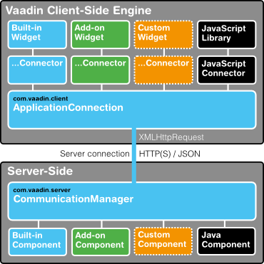

Architecture
============

In ?, we gave a short introduction to the general architecture of
Vaadin. This chapter looks deeper into the architecture at a more
technical level.

Overview {#architecture.overview}
========

Vaadin provides two development models for web applications: for the
client-side (the browser) and for the server-side. The server-driven
development model is the more powerful one, allowing application
development solely on the server-side, by utilizing an AJAX-based Vaadin
Client-Side Engine that renders the user interface in the browser. The
client-side model allows developing widgets and applications in Java,
which are compiled to JavaScript and executed in the browser. The two
models can share their UI widgets, themes, and back-end code and
services, and can be mixed together easily.

? gives a basic illustration of the client-side and server-side
communications, in a running situation where the page with the
client-side code (engine or application) has been initially loaded in
the browser.

Vaadin Framework consists of a *server-side API*, a *client-side API*, a
horde of *user interface components/widgets* on the both sides, *themes*
for controlling the appearance, and a *data model* that allows binding
the server-side components directly to data. For client-side
development, it includes the Vaadin Compiler, which allows compiling
Java to JavaScript.

A server-side Vaadin application runs as a servlet in a Java web server,
serving HTTP requests. The `VaadinServlet` is normally used as the
servlet class. The servlet receives client requests and inteprets them
as events for a particular user session. Events are associated with user
interface components and delivered to the event listeners defined in the
application. If the UI logic makes changes to the server-side user
interface components, the servlet renders them in the web browser by
generating a response. The client-side engine running in the browser
receives the responses and uses them to make any necessary changes to
the page in the browser.

The major parts of the server-driven development architecture and their
function are as follows:

User Interface

:   Vaadin applications provide a user interface for the user to
    interface with the business logic and data of the application. At
    technical level, the UI is realized as a *UI* class that extends
    `com.vaadin.ui.UICLASS`. Its main task is to create the initial user
    interface out of UI components and set up event listeners to handle
    user input. The UI can then be loaded in the browser using an URL,
    or can be embedded to any HTML page. For detailed information about
    implementing a ``, see ?.

    Please note that the term "UI" is used throughout this book to refer
    both to the general UI concept as well as the technical UI class
    concept.

User Interface Components/Widgets

:   component widget field The user interface of a Vaadin application
    consists of components that are created and laid out by the
    application. Each server-side component has a client-side
    counterpart, a "*widget*", by which it is rendered in the browser
    and with which the user interacts. The client-side widgets can also
    be used by client-side applications. The server-side components
    relay these events to the application logic. Field components that
    have a value, which the user can view or edit, can be bound to a
    data source (see below). For a more detailed description of the UI
    component architecture, see ?.

Client-Side Engine

:   Client-Side Engine Google Web Toolkit HTTP The Client-Side Engine of
    Vaadin manages the rendering of the UI in the web browser by
    employing various client-side *widgets*, counterparts of the
    server-side components. It communicates user interaction to the
    server-side, and then again renders the changes in the UI. The
    communications are made using asynchronous HTTP or HTTPS requests.
    See ?.

Vaadin Servlet

:   VaadinServlet Server-side Vaadin applications work on top of the
    Java Servlet API (see ?). The Vaadin servlet, or more exactly the
    `VaadinServlet` class, receives requests from different clients,
    determines which user session they belong to by tracking the
    sessions with cookies, and delegates the requests to their
    corresponding sessions. You can customize the Vaadin servlet by
    extending it.

Themes

:   theme CSS Sass HTML templates Vaadin makes a separation between the
    appearance and component structure of the user interface. While the
    UI logic is handled as Java code, the presentation is defined in
    *themes* as CSS or Sass. Vaadin provides a number of default themes.
    User themes can, in addition to style sheets, include HTML templates
    that define custom layouts and other resources, such as images and
    fonts. Themes are discussed in detail in ?.

Events

:   events Interaction with user interface components creates events,
    which are first processed on the client-side by the widgets, then
    passed all the way through the HTTP server, Vaadin servlet, and the
    user interface components to the event listeners defined in the
    application. See ?.

Server Push

:   server push In addition to the event-driven programming model,
    Vaadin supports server push, where the UI changes are pushed
    directly from the server to the client without a client request or
    an event. This makes it possible to update UIs immediately from
    other threads and other UIs, without having to wait for a request.
    See ?.

Data Binding

:   Data Model Data Binding In addition to the user interface model,
    Vaadin provides a *data model* for binding data presented in field
    components, such as text fields, check boxes and selection
    components, to a data source. Using the data model, the user
    interface components can update the application data directly, often
    without the need for any control code. All the field components in
    Vaadin use this data model internally, but any of them can be bound
    to a separate data source as well. SQL For example, you can bind a
    table component to an SQL query response. For a complete overview of
    the Vaadin Data Model, please refer to ?.

Client-Side Applications

:   In addition to server-side web applications, Vaadin supports
    client-side application modules, which run in the browser.
    Client-side modules can use the same widgets, themes, and back-end
    services as server-side Vaadin applications. They are useful when
    you have a need for highly responsive UI logic, such as for games or
    for serving a large number of clients with possibly stateless
    server-side code, and for various other purposes, such as offering
    an off-line mode for server-side applications. Please see ? for
    further details.

Back-end

:   Vaadin is meant for building user interfaces, and it is recommended
    that other application layers should be kept separate from the UI.
    The business logic can run in the same servlet as the UI code,
    usually separated at least by a Java API, possibly as EJBs, or
    distributed to a remote back-end service. The data storage is
    usually distributed to a database management system, and is
    typically accessed through a persistence solution, such as JPA.

Technological Background {#architecture.technology}
========================

Google Web Toolkit Google Web Toolkit This section provides an
introduction to the various technologies and designs, which Vaadin is
based on. This knowledge is not necessary for using Vaadin, but provides
some background if you need to make low-level extensions to Vaadin.

HTML and JavaScript {#architecture.technology.html}
-------------------

HTML
JavaScript
The World Wide Web, with all its websites and most of the web
applications, is based on the use of the Hypertext Markup Language
(HTML). HTML defines the structure and formatting of web pages, and
allows inclusion of graphics and other resources. It is based on a
hierarchy of elements marked with start and end tags, such as `

                ... 
`. Vaadin uses HTML version 5, although
conservatively, to the extent supported by the major browsers, and their
currently most widely used versions.

DOM JavaScript, on the other hand, is a programming language for
embedding programs in HTML pages. JavaScript programs can manipulate a
HTML page through the Document Object Model (DOM) of the page. They can
also handle user interaction events. The Client-Side Engine of Vaadin
and its client-side widgets do exactly this, although it is actually
programmed in Java, which is compiled to JavaScript with the Vaadin
Client Compiler.

Vaadin largely hides the use of HTML, allowing you to concentrate on the
UI component structure and logic. In server-side development, the UI is
developed in Java using UI components and rendered by the client-side
engine as HTML, but it is possible to use HTML templates for defining
the layout, as well as HTML formatting in many text elements. Also when
developing client-side widgets and UIs, the built-in widgets in the
framework hide most of HTML DOM manipulation.

Styling with CSS and Sass {#architecture.technology.styling}
-------------------------

CSS
Sass
While HTML defines the content and structure of a web page, *Cascading
Style Sheet* (CSS) is a language for defining the visual style, such as
colors, text sizes, and margins. CSS is based on a set of rules that are
matched with the HTML structure by the browser. The properties defined
in the rules determine the visual appearance of the matching HTML
elements.

    /* Define the color of labels in my view */
    .myview .v-label {
      color: blue;
    }

SCSS CSS3 *Sass*, or *Syntactically Awesome Stylesheets*, is an
extension of the CSS language, which allows the use of variables,
nesting, and many other syntactic features that make the use of CSS
easier and clearer. Sass has two alternative formats, SCSS, which is a
superset of the syntax of CSS3, and an older indented syntax, which is
more concise. The Vaadin Sass compiler supports the SCSS syntax.

themes Vaadin handles styling with *themes* defined with CSS or Sass,
and associated images, fonts, and other resources. Vaadin themes are
specifically written in Sass. In development mode, Sass files are
compiled automatically to CSS. For production use, you compile the Sass
files to CSS with the included compiler. The use of themes is documented
in detail in ?, which also gives an introduction to CSS and Sass.

AJAX {#architecture.technology.ajax}
----

AJAX XML JavaScript HTML 5 CSS DOM XMLHttpRequest AJAX, short for
Asynchronous JavaScript and XML, is a technique for developing web
applications with responsive user interaction, similar to traditional
desktop applications. Conventional web applications, be they
JavaScript-enabled or not, can get new page content from the server only
by loading an entire new page. AJAX-enabled pages, on the other hand,
handle the user interaction in JavaScript, send a request to the server
asynchronously (without reloading the page), receive updated content in
the response, and modify the page accordingly. This way, only small
parts of the page data need to be loaded. This goal is archieved by the
use of a certain set of technologies: HTML, CSS, DOM, JavaScript, and
the XMLHttpRequest API in JavaScript. XML is just one way to serialize
data between the client and the server, and in Vaadin it is serialized
with the more efficient JSON.

The asynchronous requests used in AJAX are made possible by the
XMLHttpRequest class in JavaScript. The API feature is available in all
major browsers and is under way to become a W3C standard.

The communication of complex data between the browser and the server
requires some sort of *serialization* (or *marshalling*) of data
objects. The Vaadin servlet and the client-side engine handle the
serialization of shared state objects from the server-side components to
the client-side widgets, as well as serialization of RPC calls between
the widgets and the server-side components.

Google Web Toolkit {#architecture.technology.gwt}
------------------

Google Web Toolkit The client-side framework of Vaadin is based on the
Google Web Toolkit (GWT). Its purpose is to make it possible to develop
web user interfaces that run in the browser easily with Java instead of
JavaScript. Client-side modules are developed with Java and compiled
into JavaScript with the Vaadin Compiler, which is an extension of the
GWT Compiler. The client-side framework also hides much of the HTML DOM
manipulation and enables handling browser events in Java.

GWT is essentially a client-side technology, normally used to develop
user interface logic in the web browser. Pure client-side modules still
need to communicate with a server using RPC calls and by serializing any
data. The server-driven development mode in Vaadin effectively hides all
the client-server communications and allows handling user interaction
logic in a server-side application. This makes the architecture of an
AJAX-based web application much simpler. Nevertheless, Vaadin also
allows developing pure client-side applications, as described in ?.

See ? for a description of how the client-side framework based on GWT is
used in the Client-Side Engine of Vaadin. ? provides information about
the client-side development, and ? about the integration of client-side
widgets with the server-side components.

Java Servlets {#architecture.technology.servlet}
-------------

A Java Servlet is a class that is executed in a Java web server (a
*Servlet container*) to extend the capabilities of the server. In
practice, it is normally a part of a *web application*, which can
contain HTML pages to provide static content, and JavaServer Pages (JSP)
and Java Servlets to provide dynamic content. This is illustrated in ?.

Web applications are usually packaged and deployed to a server as *WAR*
(*Web application ARchive*) files, which are Java JAR packages, which in
turn are ZIP compressed packages. The web application is defined in a
`WEB-INF/web.xml` deployment descriptor, which defines the servlet
classes and also the mappings from request URL paths to the servlets.
This is described in more detail in ?. The class path for the servlets
and their dependencies includes the `WEB-INF/classes` and `WEB-INF/lib`
folders. The `WEB-INF` is a special hidden folder that can not be
accessed by its URL path.

The servlets are Java classes that handle HTTP requests passed to them
by the server through the *Java Servlet API*. They can generate HTML or
other content as a response. JSP pages, on the other hand, are HTML
pages, which allow including Java source code embedded in the pages.
They are actually translated to Java source files by the container and
then compiled to servlets.

The UIs of server-side Vaadin applications run as servlets. They are
wrapped inside a `VaadinServlet` servlet class, which handles session
tracking and other tasks. On the initial request, it returns an HTML
loader page and then mostly JSON responses to synchronize the widgets
and their server-side counterparts. It also serves various resources,
such as themes. The server-side UIs are implemented as classes extending
the `UI` class, as described in ?. The class is given as a parameter to
the Vaadin Servlet in the `web.xml` deployment descriptor.

The Vaadin Client-Side Engine as well as client-side Vaadin applications
are loaded to the browser as static JavaScript files. The client-side
engine, or widget set in technical terms, needs to be located under the
`VAADIN/widgetsets` path in the web application. The precompiled default
widget set is served from the `vaadin-client-compiled` JAR by the Vaadin
Servlet.

Client-Side Engine {#architecture.client-side}
==================

Client-Side Engine The user interface of a server-side Vaadin
application is rendered in the browser by the Vaadin Client-Side Engine.
It is loaded in the browser when the page with the Vaadin UI is opened.
The server-side UI components are rendered using *widgets* (as they are
called in Google Web Toolkit) on the client-side. The client-side engine
is illustrated in ?.

The client-side framework includes two kinds of built-in widgets: GWT
widgets and Vaadin-specific widgets. The two widget collections have
significant overlap, where the Vaadin widgets provide a bit different
features than the GWT widgets. In addition, many add-on widgets and
their server-side counterparts exist, and you can easily download and
install them, as described in ?. You can also develop your own widgets,
as described in ?.

The rendering with widgets, as well as the communication to the
server-side, is handled in the `ApplicationConnection`. Connecting the
widgets with their server-side counterparts is done in *connectors*, and
there is one for each widget that has a server-side counterpart. The
framework handles serialization of component state transparently, and
includes an RPC mechanism between the two sides. Integration of widgets
with their server-side counterpart components is described in ?.

Events and Listeners {#architecture.events}
====================

Vaadin offers an event-driven programming model for handling user
interaction. When a user does something in the user interface, such as
clicks a button or selects an item, the application needs to know about
it. Many Java-based user interface frameworks follow the *Event-Listener
pattern* (also known as the Observer design pattern) to communicate user
input to the application logic. So does Vaadin. The design pattern
involves two kinds of elements: an object that generates ("fires" or
"emits") events and a number of listeners that listen for the events.
When such an event occurs, the object sends a notification about it to
all the listeners. In a typical case, there is only one listener.

Events can serve many kinds of purposes. In Vaadin, the usual purpose of
events is handling user interaction in a user interface. Session
management can require special events, such as time-out, in which case
the event would actually be the lack of user interaction. Time-out is a
special case of timed or scheduled events, where an event occurs at a
specific date and time or when a set time has passed.

To receive events of a particular type, an application must register a
listener object with the event source. The listeners are registered in
the components with an add\*Listener() method (with a method name
specific to the listener).

Most components that have related events define their own event class
and the corresponding listener class. For example, the `Button` has
`Button.ClickEvent` events, which can be listened to through the
`Button.ClickListener` interface.

In the following, we handle button clicks with a listener implemented as
an anonymous class:

    final Button button = new Button("Push it!");

    button.addClickListener(new Button.ClickListener() {
        public void buttonClick(ClickEvent event) {
            button.setCaption("You pushed it!");
        }
    });

? illustrates the case where an application-specific class inherits the
`Button.ClickListener` interface to be able to listen for button click
events. The application must instantiate the listener class and register
it with addClickListener(). It can be an anonymous class, such as the
one above. When an event occurs, an event object is instantiated, in
this case a `Button.ClickEvent`. The event object knows the related UI
component, in this case the `Button`.

In the ancient times of C programming, *callback functions* filled
largely the same need as listeners do now. In object-oriented languages,
we usually only have classes and methods, not functions, so the
application has to give a class interface instead of a callback function
pointer to the framework.

? goes into details of handling events in practice.
