User Interface Components {#components}
=========================

This chapter provides an overview and a detailed description of all
non-layout components in Vaadin.

Overview {#components.overview}
========

Vaadin provides a comprehensive set of user interface components and
allows you to define custom components. ? illustrates the inheritance
hierarchy of the UI component classes and interfaces. Interfaces are
displayed in gray, abstract classes in orange, and regular classes in
blue. An annotated version of the diagram is featured in the *Vaadin
Cheat Sheet*.

`Component` At the top of the interface hierarchy, we have the
`Component` interface. `AbstractComponent` At the top of the class
hierarchy, we have the `AbstractComponent` class. `AbstractField`
`AbstractComponentContainer` It is inherited by two other abstract
classes: `AbstractField`, inherited further by field components, and
`AbstractComponentContainer`, inherited by various container and layout
components. Components that are not bound to a content data model, such
as labels and links, inherit `AbstractComponent` directly.

layout `Layout` The layout of the various components in a window is
controlled, logically, by layout components, just like in conventional
Java UI toolkits for desktop applications. In addition, with the
`CustomLayout` component, you can write a custom layout as an HTML
template that includes the locations of any contained components.
Looking at the inheritance diagram, we can see that layout components
inherit the `AbstractComponentContainer` and the `Layout` interface.
Layout components are described in detail in ?.

`Window` Looking at it from the perspective of an object hierarchy, we
would have a `Window` object, which contains a hierachy of layout
components, which again contain other layout components, field
components, and other visible components.

Sampler JavaDoc You can browse the built-in UI components of Vaadin
library in the Sampler application of the Vaadin Demo. The Sampler shows
a description, JavaDoc documentation, and a code samples for each of the
components.

In addition to the built-in components, many components are available as
add-ons, either from the Vaadin Directory or from independent sources.
Both commercial and free components exist. The installation of add-ons
is described in ?.

> **Note**
>
> ? is included in the Vaadin Cheat Sheet that illustrates the basic
> relationship hierarchy of the user interface components and data
> binding classes and interfaces. You can download it at
> [http://vaadin.com/book](#).
>
> The diagram is also included in the six-page DZone Refcard, which you
> can find at [https://vaadin.com/refcard](#).

Interfaces and Abstractions {#components.interfaces}
===========================

interfaces Vaadin user interface components are built on a skeleton of
interfaces and abstract classes that define and implement the features
common to all components and the basic logic how the component states
are serialized between the server and the client.

This section gives details on the basic component interfaces and
abstractions. The layout and other component container abstractions are
described in ?. The interfaces that define the Vaadin data model are
described in ?.

`Paintable` `VariableOwner` All components also implement the
`Paintable` interface, which is used for serializing ("painting") the
components to the client, and the reverse `VariableOwner` interface,
which is needed for deserializing component state or user interaction
from the client.

`Serializable` In addition to the interfaces defined within the Vaadin
framework, all components implement the `java.io.Serializable` interface
to allow serialization. Serialization is needed in many clustering and
cloud computing solutions.

`Component` Interface {#components.interfaces.component}
---------------------

Component
interface
The `Component` interface is paired with the `AbstractComponent` class,
which implements all the methods defined in the interface.

### Component Tree Management

Components are laid out in the user interface hierarchically. The layout
is managed by layout components, or more generally components that
implement the `ComponentContainer` interface. Such a container is the
parent of the contained components.

The getParent() method allows retrieving the parent component of a
component. While there is a setParent(), you rarely need it as you
usually add components with the addComponent() method of the
`ComponentContainer` interface, which automatically sets the parent.

A component does not know its parent when the component is still being
created, so you can not refer to the parent in the constructor with
getParent().

Attaching a component to an UI triggers a call to its attach() method.
Correspondingly, removing a component from a container triggers calling
the detach() method. If the parent of an added component is already
connected to the UI, the attach() is called immediately from
setParent().


public class AttachExample extends CustomComponent {
    public AttachExample() {
    }

    @Override
    public void attach() {
        super.attach(); // Must call.

        // Now we know who ultimately owns us.
        ClassResource r = new ClassResource("smiley.jpg");
        Image image = new Image("Image:", r);
        setCompositionRoot(image);
    }
}


The attachment logic is implemented in `AbstractComponent`, as described
in ?.

Component
interface
`AbstractComponent` {#components.interfaces.abstractcomponent}
-------------------

AbstractComponent
`AbstractComponent` is the base class for all user interface components.
It is the (only) implementation of the `Component` interface,
implementing all the methods defined in the interface.

`AbstractComponent` has a single abstract method, getTag(), which
returns the serialization identifier of a particular component class. It
needs to be implemented when (and only when) creating entirely new
components. `AbstractComponent` manages much of the serialization of
component states between the client and the server. Creation of new
components and serialization is described in ?.

Common Component Features {#components.features}
=========================

The component base classes and interfaces provide a large number of
features. Let us look at some of the most commonly needed features.
Features not documented here can be found from the Java API Reference.

The interface defines a number of properties, which you can retrieve or
manipulate with the corresponding setters and getters.

Caption {#components.features.caption}
-------

caption property
Component interface
caption
A caption is an explanatory textual label accompanying a user interface
component, usually shown above, left of, or inside the component. The
contents of a caption are automatically quoted, so no raw HTML can be
rendered in a caption.

The caption text can usually be given as the first parameter of a
constructor of a component or with setCaption().

    // New text field with caption "Name"
    TextField name = new TextField("Name");
    layout.addComponent(name);

The caption of a component is, by default, managed and displayed by the
layout component or component container inside which the component is
placed. For example, the `VerticalLayout` component shows the captions
left-aligned above the contained components, while the `FormLayout`
component shows the captions on the left side of the vertically laid
components, with the captions and their associated components
left-aligned in their own columns. The `CustomComponent` does not manage
the caption of its composition root, so if the root component has a
caption, it will not be rendered.

Some components, such as `Button` and `Panel`, manage the caption
themselves and display it inside the component.

Icon (see ?) is closely related to caption and is usually displayed
horizontally before or after it, depending on the component and the
containing layout. Also the required indicator in field components is
usually shown before or after the caption.

An alternative way to implement a caption is to use another component as
the caption, typically a `Label`, a `TextField`, or a `Panel`. A
`Label`, for example, allows highlighting a shortcut key with HTML
markup or to bind the caption to a data source. The `Panel` provides an
easy way to add both a caption and a border around a component.

    .v-caption {}
      .v-captiontext {}
      .v-caption-clearelem {}
      .v-required-field-indicator {}

A caption is be rendered inside an HTML element that has the `v-caption`
CSS style class. The containing layout may enclose a caption inside
other caption-related elements.

Some layouts put the caption text in a `v-captiontext` element. A
`v-caption-clearelem` is used in some layouts to clear a CSS `float`
property in captions. An optional required indicator in field components
is contained in a separate element with `v-required-field-indicator`
style.

Description and Tooltips {#components.features.description}
------------------------

description property
Component interface
description
tooltips
All components (that inherit `AbstractComponent`) have a description
separate from their caption. The description is usually shown as a
tooltip that appears when the mouse pointer hovers over the component
for a short time.

You can set the description with setDescription() and retrieve with
getDescription().

    Button button = new Button("A Button");
    button.setDescription("This is the tooltip");

The tooltip is shown in ?.

A description is rendered as a tooltip in most components.

When a component error has been set with setComponentError(), the error
is usually also displayed in the tooltip, below the description.
Components that are in error state will also display the error
indicator. See ?.

The description is actually not plain text, but you can use HTML tags to
format it. Such a rich text description can contain any HTML elements,
including images.

    button.setDescription(
        "<h2>"+
        "A richtext tooltip</h2>"+
        "<ul>"+
        "  <li>Use rich formatting with HTML</li>"+
        "  <li>Include images from themes</li>"+
        "  <li>etc.</li>"+
        "</ul>");

The result is shown in ?.

Notice that the setter and getter are defined for all fields in the
`Field` interface, not for all components in the `Component` interface.

Enabled {#components.features.enabled}
-------

enabled property
Component interface
enabled
The *enabled* property controls whether the user can actually use the
component. A disabled component is visible, but grayed to indicate the
disabled state.

Components are always enabled by default. You can disable a component
with setEnabled(false).

    Button enabled = new Button("Enabled");
    enabled.setEnabled(true); // The default
    layout.addComponent(enabled);

    Button disabled = new Button("Disabled");
    disabled.setEnabled(false);
    layout.addComponent(disabled);

? shows the enabled and disabled buttons.

A disabled component is automatically put in read-only state. No client
interaction with such a component is sent to the server and, as an
important security feature, the server-side components do not receive
state updates from the client in the read-only state. This feature
exists in all built-in components in Vaadin and is automatically handled
for all `Field` components for the field property value. For custom
widgets, you need to make sure that the read-only state is checked on
the server-side for all safety-critical variables.

Disabled components have the `v-disabled` CSS style in addition to the
component-specific style. To match a component with both the styles, you
have to join the style class names with a dot as done in the example
below.

    .v-textfield.v-disabled {
        border: dotted;
    }

This would make the border of all disabled text fields dotted.

In Valo theme, the opacity of disabled components is specified with the
`$v-disabled-opacity` parameter, as described in ?.

Icon {#components.features.icon}
----

icon property
Component interface
icon
An icon is an explanatory graphical label accompanying a user interface
component, usually shown above, left of, or inside the component. Icon
is closely related to caption (see ?) and is usually displayed
horizontally before or after it, depending on the component and the
containing layout.

The icon of a component can be set with the setIcon() method. The image
is provided as a resource, perhaps most typically a `ThemeResource`.

    // Component with an icon from a custom theme
    TextField name = new TextField("Name");
    name.setIcon(new ThemeResource("icons/user.png"));
    layout.addComponent(name);

    // Component with an icon from another theme ('runo')
    Button ok = new Button("OK");
    ok.setIcon(new ThemeResource("../runo/icons/16/ok.png"));
    layout.addComponent(ok);

The icon of a component is, by default, managed and displayed by the
layout component or component container in which the component is
placed. For example, the `VerticalLayout` component shows the icons
left-aligned above the contained components, while the `FormLayout`
component shows the icons on the left side of the vertically laid
components, with the icons and their associated components left-aligned
in their own columns. The `CustomComponent` does not manage the icon of
its composition root, so if the root component has an icon, it will not
be rendered.

Some components, such as `Button` and `Panel`, manage the icon
themselves and display it inside the component.

In addition to image resources, you can use *font icons*, which are
icons included in special fonts, but which are handled as special
resources. See ? for more details.

An icon will be rendered inside an HTML element that has the `v-icon`
CSS style class. The containing layout may enclose an icon and a caption
inside elements related to the caption, such as `v-caption`.

Locale {#components.features.locale}
------

locale property
in
Component
Component interface
locale
The locale property defines the country and language used in a
component. You can use the locale information in conjunction with an
internationalization scheme to acquire localized resources. Some
components, such as `DateField`, use the locale for component
localization.

You can set the locale of a component (or the application) with
setLocale() as follows:

    // Component for which the locale is meaningful
    InlineDateField date = new InlineDateField("Datum");

    // German language specified with ISO 639-1 language
    // code and ISO 3166-1 alpha-2 country code.
    date.setLocale(new Locale("de", "DE"));

    date.setResolution(Resolution.DAY);
    layout.addComponent(date);

The resulting date field is shown in ?.

getLocale() You can get the locale of a component with getLocale(). If
the locale is undefined for a component, that is, not explicitly set,
the locale of the parent component is used. If none of the parent
components have a locale set, the locale of the UI is used, and if that
is not set, the default system locale is set, as given by
Locale.getDefault().

The getLocale() returns null if the component is not yet attached to the
UI, which is usually the case in most constructors, so it is a bit
awkward to use it for internationalization. You can get the locale in
attach(), as shown in the following example:

    Button cancel = new Button() {
        @Override
        public void attach() {
            super.attach();
            ResourceBundle bundle = ResourceBundle.getBundle(
                MyAppCaptions.class.getName(), getLocale());
            setCaption(bundle.getString(MyAppCaptions.CancelKey));
        }
    };
    layout.addComponent(cancel);

However, it is normally a better practice to use the locale of the
current UI to get the localized resource right when the component is
created.

    // Captions are stored in MyAppCaptions resource bundle
    // and the UI object is known in this context.
    ResourceBundle bundle =
        ResourceBundle.getBundle(MyAppCaptions.class.getName(),
            UI.getCurrent().getLocale());

    // Get a localized resource from the bundle
    Button cancel =
        new Button(bundle.getString(MyAppCaptions.CancelKey));
    layout.addComponent(cancel);

A common task in many applications is selecting a locale. This is done
in the following example with a `ComboBox`, which gets the available
locales in Java.

    // The locale in which we want to have the language
    // selection list
    Locale displayLocale = Locale.ENGLISH;

    // All known locales
    final Locale[] locales = Locale.getAvailableLocales();

    // Allow selecting a language. We are in a constructor of a
    // CustomComponent, so preselecting the current
    // language of the application can not be done before
    // this (and the selection) component are attached to
    // the application.
    final ComboBox select = new ComboBox("Select a language") {
        @Override
        public void attach() {
            super.attach();
            setValue(getLocale());
        }
    };
    for (int i=0; i<locales.length; i++) {
        select.addItem(locales[i]);
        select.setItemCaption(locales[i],
                              locales[i].getDisplayName(displayLocale));

        // Automatically select the current locale
        if (locales[i].equals(getLocale()))
            select.setValue(locales[i]);
    }
    layout.addComponent(select);

    // Locale code of the selected locale
    final Label localeCode = new Label("");
    layout.addComponent(localeCode);

    // A date field which language the selection will change
    final InlineDateField date =
        new InlineDateField("Calendar in the selected language");
    date.setResolution(Resolution.DAY);
    layout.addComponent(date);

    // Handle language selection
    select.addValueChangeListener(new Property.ValueChangeListener() {
        public void valueChange(ValueChangeEvent event) {
            Locale locale = (Locale) select.getValue();
            date.setLocale(locale);
            localeCode.setValue("Locale code: " +
                                locale.getLanguage() + "_" +
                                locale.getCountry());
        }
    });
    select.setImmediate(true);

The user interface is shown in ?.

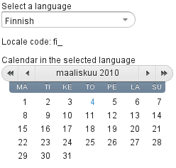

Read-Only {#components.features.readonly}
---------

read-only property
Component interface
read-only
The property defines whether the value of a component can be changed.
The property is mainly applicable to `Field` components, as they have a
value that can be edited by the user.

    TextField readwrite = new TextField("Read-Write");
    readwrite.setValue("You can change this");
    readwrite.setReadOnly(false); // The default
    layout.addComponent(readwrite);

    TextField readonly = new TextField("Read-Only");
    readonly.setValue("You can't touch this!");
    readonly.setReadOnly(true);
    layout.addComponent(readonly);

The resulting read-only text field is shown in ?.

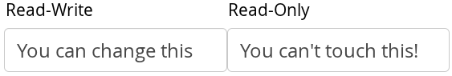

Setting a layout or some other component container as read-only does not
usually make the contained components read-only recursively. This is
different from, for example, the disabled state, which is usually
applied recursively.

Notice that the value of a selection component is the selection, not its
items. A read-only selection component doesn't therefore allow its
selection to be changed, but other changes are possible. For example, if
you have a read-only `Table` in editable mode, its contained fields and
the underlying data model can still be edited, and the user could sort
it or reorder the columns.

Client-side state modifications will not be communicated to the
server-side and, more importantly, server-side field components will not
accept changes to the value of a read-only `Field` component. The latter
is an important security feature, because a malicious user can not
fabricate state changes in a read-only field. This is handled at the
level of `AbstractField` in setValue(), so you can not change the value
programmatically either. Calling setValue() on a read-only field results
in `Property.ReadOnlyException`.

Also notice that while the read-only status applies automatically to the
property value of a field, it does not apply to other component
variables. A read-only component can accept some other variable changes
from the client-side and some of such changes could be acceptable, such
as change in the scroll bar position of a `Table`. Custom widgets should
check the read-only state for variables bound to business data.

Setting a normally editable component to read-only state can change its
appearance to disallow editing the value. In addition to CSS styling,
also the HTML structure can change. For example, `TextField` loses the
edit box and appears much like a `Label`.

A read-only component will have the `v-readonly` style. The following
CSS rule would make the text in all read-only `TextField` components
appear in italic.

    .v-textfield.v-readonly {
        font-style: italic;
    }

Style Name {#components.features.stylename}
----------

style name property
Component interface
style name
The *style name* property defines one or more custom CSS style class
names for the component. The getStyleName() returns the current style
names as a space-separated list. The setStyleName() replaces all the
styles with the given style name or a space-separated list of style
names. You can also add and remove individual style names with
addStylename() and removeStyleName(). A style name must be a valid CSS
style name.

    Label label = new Label("This text has a lot of style");
    label.addStyleName("mystyle");
    layout.addComponent(label);

The style name will appear in the component's HTML element in two forms:
literally as given and prefixed with the component-specific style name.
For example, if you add a style name `mystyle` to a `Button`, the
component would get both `mystyle` and `v-button-mystyle` styles.
Neither form may conflict with built-in style names of Vaadin. For
example, `focus` style would conflict with a built-in style of the same
name, and an `content` style for a `Panel` component would conflict with
the built-in `v-panel-content` style.

The following CSS rule would apply the style to any component that has
the `mystyle` style.

    .mystyle {
        font-family: fantasy;
        font-style:  italic;
        font-size:   25px;
        font-weight: bolder;
        line-height: 30px;
    }

The resulting styled component is shown in ?

Visible {#components.features.visible}
-------

visible property
Component interface
visible
Components can be hidden by setting the *visible* property to *false*.
Also the caption, icon and any other component features are made hidden.
Hidden components are not just invisible, but their content is not
communicated to the browser at all. That is, they are not made invisible
cosmetically with only CSS rules. This feature is important for security
if you have components that contain security-critical information that
must only be shown in specific application states.

    TextField invisible = new TextField("No-see-um");
    invisible.setValue("You can't see this!");
    invisible.setVisible(false);
    layout.addComponent(invisible);

The resulting invisible component is shown in ?.

Beware that invisible beings can leave footprints. The containing layout
cell that holds the invisible component will not go away, but will show
in the layout as extra empty space. Also expand ratios work just like if
the component was visible - it is the layout cell that expands, not the
component.

If you need to make a component only cosmetically invisible, you should
use a custom theme to set it `display: none` style. This is mainly
useful for some special components that have effects even when made
invisible in CSS. If the hidden component has undefined size and is
enclosed in a layout that also has undefined size, the containing layout
will collapse when the component disappears. If you want to have the
component keep its size, you have to make it invisible by setting all
its font and other attributes to be transparent. In such cases, the
invisible content of the component can be made visible easily in the
browser.

A component made invisible with the *visible* property has no particular
CSS style class to indicate that it is hidden. The element does exist
though, but has `display: none` style, which overrides any CSS styling.

Sizing Components {#components.features.sizeable}
-----------------

Sizeable
interface
Vaadin components are sizeable; not in the sense that they were fairly
large or that the number of the components and their features are
sizeable, but in the sense that you can make them fairly large on the
screen if you like, or small or whatever size.

The `Sizeable` interface, shared by all components, provides a number of
manipulation methods and constants for setting the height and width of a
component in absolute or relative units, or for leaving the size
undefined.

The size of a component can be set with setWidth() and setHeight()
methods. The methods take the size as a floating-point value. You need
to give the unit of the measure as the second parameter for the above
methods. The available units are listed in ? below.

    mycomponent.setWidth(100, Sizeable.UNITS_PERCENTAGE);
    mycomponent.setWidth(400, Sizeable.UNITS_PIXELS);

Alternatively, you can speficy the size as a string. The format of such
a string must follow the HTML/CSS standards for specifying measures.

    mycomponent.setWidth("100%");
    mycomponent.setHeight("400px");

The "`100%`" percentage value makes the component take all available
size in the particular direction (see the description of
`Sizeable.UNITS_PERCENTAGE` in the table below). You can also use the
shorthand method setSizeFull() to set the size to 100% in both
directions.

The size can be *undefined* in either or both dimensions, which means
that the component will take the minimum necessary space. Most
components have undefined size by default, but some layouts have full
size in horizontal direction. You can set the height or width as
undefined with `Sizeable.SIZE_UNDEFINED` parameter for setWidth() and
setHeight().

You always need to keep in mind that *a layout with undefined size may
not contain components with defined relative size*, such as "full size".
See ? for details.

The ? lists the available units and their codes defined in the
`Sizeable` interface.

  -------------------- ---- ----------------------------------------------
  `Unit.PIXELS`        px   The *pixel* is the basic hardware-specific
                            measure of one physical display pixel.

  `Unit.POINTS`        pt   The *point* is a typographical unit, which is
                            usually defined as 1/72 inches or about 0.35
                            mm. However, on displays the size can vary
                            significantly depending on display metrics.

  `Unit.PICAS`         pc   The *pica* is a typographical unit, defined as
                            12 points, or 1/7 inches or about 4.233 mm. On
                            displays, the size can vary depending on
                            display metrics.

  `Unit.EM`            em   A unit relative to the used font, the width of
                            the upper-case "M" letter.

  `Unit.EX`            ex   A unit relative to the used font, the height
                            of the lower-case "x" letter.

  `Unit.MM`            mm   A physical length unit, millimeters on the
                            surface of a display device. However, the
                            actual size depends on the display, its
                            metrics in the operating system, and the
                            browser.

  `Unit.CM`            cm   A physical length unit, *centimeters* on the
                            surface of a display device. However, the
                            actual size depends on the display, its
                            metrics in the operating system, and the
                            browser.

  `Unit.INCH`          in   A physical length unit, *inches* on the
                            surface of a display device. However, the
                            actual size depends on the display, its
                            metrics in the operating system, and the
                            browser.

  `Unit.PERCENTAGE`    %    A relative percentage of the available size.
                            For example, for the top-level layout `100%`
                            would be the full width or height of the
                            browser window. The percentage value must be
                            between 0 and 100.
  -------------------- ---- ----------------------------------------------

  : Size Units

If a component inside `HorizontalLayout` or `VerticalLayout` has full
size in the namesake direction of the layout, the component will expand
to take all available space not needed by the other components. See ?
for details.

Managing Input Focus
--------------------

When the user clicks on a component, the component gets the *input
focus*, which is indicated by highlighting according to style
definitions. If the component allows inputting text, the focus and
insertion point are indicated by a cursor. Pressing the Tab key moves
the focus to the component next in the *focus order*.

Focusing is supported by all `Field` components and also by `Upload`.

The focus order or *tab index* of a component is defined as a positive
integer value, which you can set with setTabIndex() and get with
getTabIndex(). The tab index is managed in the context of the page in
which the components are contained. The focus order can therefore jump
between two any lower-level component containers, such as sub-windows or
panels.

The default focus order is determined by the natural hierarchical order
of components in the order in which they were added under their parents.
The default tab index is 0 (zero).

Giving a negative integer as the tab index removes the component from
the focus order entirely.

The component having the focus will have an additional style class with
the `-focus` suffix. For example, a `TextField`, which normally has the
`v-textfield` style, would additionally have the `v-textfield-focus`
style.

For example, the following would make a text field blue when it has
focus.

    .v-textfield-focus {
        background: lightblue;
    }

Field Components {#components.fields}
================

Field
*Fields* are components that have a value that the user can change
through the user interface. ? illustrates the inheritance relationships
and the important interfaces and base classes.

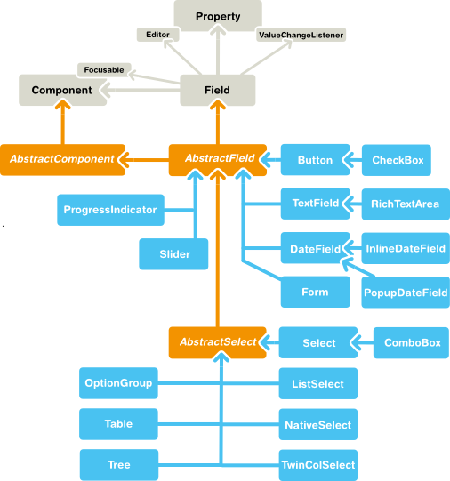

Field components are built upon the framework defined in the `Field`
interface and the `AbstractField` base class. `AbstractField` is the
base class for all field components. In addition to the component
features inherited from `AbstractComponent`, it implements a number of
features defined in `Property`, `Buffered`, `Validatable`, and
`Component.Focusable` interfaces.

The description of the field interfaces and base classes is broken down
in the following sections.

`Field` Interface {#components.fields.field}
-----------------

The `Field` interface inherits the `Component` superinterface and also
the `Property` interface to have a value for the field. `AbstractField`
is the only class implementing the `Field` interface directly. The
relationships are illustrated in ?.

You can set the field value with the setValue() and read with the
getValue() method defined in the `Property` interface. The actual value
type depends on the component.

The `Field` interface defines a number of attributes, which you can
retrieve or manipulate with the corresponding setters and getters.

description

:   All fields have a description. Notice that while this attribute is
    defined in the `Field` component, it is implemented in
    `AbstractField`, which does not directly implement `Field`, but only
    through the `AbstractField` class.

required

:   When enabled, a required indicator (usually the asterisk \*
    character) is displayed on the left, above, or right the field,
    depending on the containing layout and whether the field has a
    caption. If such fields are validated but are empty and the
    requiredError property (see below) is set, an error indicator is
    shown and the component error is set to the text defined with the
    error property. Without validation, the required indicator is merely
    a visual guide.

requiredError

:   Defines the error message to show when a value is required, but none
    is entered. The error message is set as the component error for the
    field and is usually displayed in a tooltip when the mouse pointer
    hovers over the error indicator.

Data Binding and Conversions {#components.fields.databinding}
----------------------------

Fields are strongly coupled with the Vaadin data model. The field value
is handled as a `Property` of the field component, as documented in ?.
Selection fields allow management of the selectable items through the
`Container` interface.

Fields are *editors* for some particular type. For example, `TextField`
allows editing `String` values. When bound to a data source, the
property type of the data model can be something different, say an
`Integer`. *Converters* are used for converting the values between the
representation and the model. They are described in ?.

Handling Field Value Changes {#components.fields.valuechanges}
----------------------------

`Field` inherits `Property.ValueChangeListener` to allow listening for
field value changes and `Property.Editor` to allow editing values.

When the value of a field changes, a `Property.ValueChangeEvent` is
triggered for the field. You should not implement the valueChange()
method in a class inheriting `AbstractField`, as it is already
implemented in `AbstractField`. You should instead implement the method
explicitly by adding the implementing object as a listener.

Field Buffering {#components.fields.buffering}
---------------

Field components implement the Buffered and BufferedValidatable
interfaces. When buffering is enabled for a field with
setBuffered(true), the value is not written to the property data source
before the commit() method is called for the field. Calling commit()
also runs validators added to the field, and if any fail (and the
`invalidCommitted` is disabled), the value is not written.

    form.addComponent(new Button("Commit",
        new Button.ClickListener() {
        @Override
        public void buttonClick(ClickEvent event) {
            try {
                editor.commit();
            } catch (InvalidValueException e) {
                Notification.show(e.getMessage());
            }
        }
    }));

Calling discard() reads the value from the property date source to the
current input.

If the fields are bound in a `FieldGroup` that has buffering enabled,
calling commit() for the group runs validation on all fields in the
group, and if successful, all the field values are written to the item
data source. See ?.

Field Validation {#components.fields.validation}
----------------

The input for a field component can be syntactically or semantically
invalid. Fields implement the Validatable interface, which allows
checking validity of the input with *validators* that implement the
Validator interface. You can add validators to fields with
addValidator().

    TextField field = new TextField("Name");
    field.addValidator(new StringLengthValidator(
        "The name must be 1-10 letters (was {0})",
        1, 10, true));
    layout.addComponent(field);

Failed validation is indicated with the error indicator of the field,
described in ?, unless disabled with setValidationVisible(false).
Hovering mouse on the field displays the error message given as a
parameter for the validator. If validated explicitly with validate(), as
described later, the `InvalidValueException` is thrown if the validation
fails, also carrying the error message. The value `{0}` in the error
message string is replaced with the invalid input value.

Validators validate the property type of the field after a possible
conversion, not the presentation type. For example, an
`IntegerRangeValidator` requires that the value type of the property
data source is `Integer`.

### Built-in Validators {#components.fields.validation.builtin}

Vaadin includes the following built-in validators. The property value
type is indicated.

`BeanValidator`

:   Validates a bean property according to annotations defined in the
    Bean Validation API 1.0 (JSR-303). This validator is usually not
    used explicitly, but they are created implicitly when binding fields
    in a `BeanFieldGroup`. Using bean validation requires an
    implementation library of the API. See ? for details.

`CompositeValidator`

:   Combines validators using logical AND and OR operators.

`DateRangeValidator`: `Date`

:   Checks that the date value is within the range at or between two
    given dates/times.

`DoubleRangeValidator`: `Double`

:   Checks that the double value is at or between two given values.

`EmailValidator`: `String`

:   Checks that the string value is a syntactically valid email address.
    The validated syntax is close to the RFC 822 standard regarding
    email addresses.

`IntegerRangeValidator`: `Integer`

:   Checks that the integer value is at or between two given values.

`NullValidator`

:   Checks that the value is or is not a null value.

`RegexpValidator`: `String`

:   Checks that the value matches with the given regular expression.

`StringLengthValidator`: `String`

:   Checks that the length of the input string is at or between two
    given lengths.

Please see the API documentation for more details.

### Automatic Validation {#components.fields.validation.automatic}

The validators are normally, when `validationVisible` is true for the
field, executed implicitly on the next server request if the input has
changed. If the field is in immediate mode, it (and any other fields
with changed value) are validated immediately when the focus leaves the
field.

    TextField field = new TextField("Name");
    field.addValidator(new StringLengthValidator(
        "The name must be 1-10 letters (was {0})",
        1, 10, true));
    field.setImmediate(true);
    layout.addComponent(field);

### Explicit Validation {#components.fields.validation.explicit}

The validators are executed when the validate() or commit() methods are
called for the field.

    // A field with automatic validation disabled
    final TextField field = new TextField("Name");
    layout.addComponent(field);

    // Define validation as usual
    field.addValidator(new StringLengthValidator(
        "The name must be 1-10 letters (was {0})",
        1, 10, true));

    // Run validation explicitly
    Button validate = new Button("Validate");
    validate.addClickListener(new ClickListener() {
        @Override
        public void buttonClick(ClickEvent event) {
            field.setValidationVisible(false);
            try {
                field.validate();
            } catch (InvalidValueException e) {
                Notification.show(e.getMessage());
                field.setValidationVisible(true);
            }
        }
    });
    layout.addComponent(validate);

### Implementing a Custom Validator {#components.fields.validation.custom}

You can create custom validators by implementing the Validator interface
and implementing its validate() method. If the validation fails, the
method should throw either `InvalidValueException` or
`EmptyValueException`.

    class MyValidator implements Validator {
        @Override
        public void validate(Object value)
                throws InvalidValueException {
            if (!(value instanceof String &&
                    ((String)value).equals("hello")))
                throw new InvalidValueException("You're impolite");
        }
    }

    final TextField field = new TextField("Say hello");
    field.addValidator(new MyValidator());
    field.setImmediate(true);
    layout.addComponent(field);

### Validation in Field Groups {#components.fields.validation.fieldgroup}

If the field is bound to a `FieldGroup`, described in ?, calling
commit() for the group runs the validation for all the fields in the
group, and if successful, writes the input values to the data source.

Selection Components {#components.selection}
====================

Vaadin offers many alternative ways for selecting one or more items. The
core library includes the following selection components, all based on
the `AbstractSelect` class:

`ComboBox` (Section ?)
:   A drop-down list with a text box, where the user can type text to
    find matching items. The component also provides an input prompt and
    the user can enter new items.

`ListSelect` (Section ?)
:   A vertical list box for selecting items in either single or multiple
    selection mode.

`NativeSelect` (Section ?)
:   Provides selection using the native selection component of the
    browser, typically a drop-down list for single selection and a
    multi-line list in multiselect mode. This uses the
    \<select\>
    element in HTML.

`OptionGroup` (Section ?)
:   Shows the items as a vertically arranged group of radio buttons in
    the single selection mode and of check boxes in multiple selection
    mode.

`TwinColSelect` (Section ?)
:   Shows two list boxes side by side where the user can select items
    from a list of available items and move them to a list of selected
    items using control buttons.

In addition, the `Tree`, `Table`, and `TreeTable` components allow
special forms of selection. They also inherit the `AbstractSelect`.

Binding Selection Components to Data {#components.selection.databinding}
------------------------------------

The selection components are strongly coupled with the Vaadin Data
Model, described in ?. The selectable items in all selection components
are objects that implement the `Item` interface. The items are contained
in a `Container`.

All selection components are containers themselves and simply forward
all container operations to the underlying container data source. You
can give the container in the constructor or set it set
setContainerDataSource(). This is further described in ?.

    // Have a container data source of some kind
    IndexedContainer container = new IndexedContainer();
    container.addContainerProperty("name", String.class, null);
    ...

    // Create a selection component bound to the container
    OptionGroup group = new OptionGroup("My Select", container);

If you do not bind a selection component to a container data source, a
default container is used. It is usually either an `IndexedContainer` or
a `HierarchicalContainer`.

The current selection of a selection component is bound to the
`Property` interface, so you can get the current selection as the value
of the selection component. Also selection changes are handled as value
change events, as is described later.

Adding New Items {#components.selection.adding}
----------------

New items are added with the addItem() method defined in the `Container`
interface, described in ?.

    // Create a selection component
    ComboBox select = new ComboBox("My ComboBox");

    // Add items with given item IDs
    select.addItem("Mercury");
    select.addItem("Venus");
    select.addItem("Earth");

The addItem() method creates an empty `Item`, which is identified by its
*item identifier* (IID) object, given as the parameter. This item ID is
by default used also as the caption of the item, as described in more
detail later.

We emphasize that addItem() is a factory method that *takes an item ID,
not the actual item* as the parameter - the item is returned by the
method. The item is of a type that is specific to the container and has
itself little relevance for most selection components, as the properties
of an item may not be used in any way (except in `Table`), only the item
ID.

The item identifier is typically a string, in which case it can be used
as the caption, but can be any object type. We could as well have given
integers for the item identifiers and set the captions explicitly with
setItemCaption(). You could also add an item with the parameterless
addItem(), which returns an automatically generated item ID.

    // Create a selection component
    ComboBox select = new ComboBox("My Select");

    // Add an item with a generated ID
    Object itemId = select.addItem();
    select.setItemCaption(itemId, "The Sun");

    // Select the item
    select.setValue(itemId);

Some container types may support passing the actual data object to the
add method. For example, you can add items to a `BeanItemContainer` with
addBean(). Such implementations can use a separate item ID object, or
the data object itself as the item ID, as is done in addBean(). In the
latter case you can not depend on the default way of acquiring the item
caption; see the description of the different caption modes later.

The next section describes the different options for determining the
item captions.

Item Captions {#components.selection.captions}
-------------

The displayed captions of items in a selection component can be set
explicitly with setItemCaption() or determined from the item IDs or item
properties. The caption determination is defined with the *caption
mode*, any of the modes in the `AbstractSelect.ItemCaptionMode` enum,
which you can set with setItemCaptionMode(). The default mode is
`EXPLICIT_DEFAULTS_ID`, which uses the item identifiers for the
captions, unless given explicitly.

In addition to a caption, an item can have an icon. The icon is set with
setItemIcon().

The caption modes defined in `ItemCaptionMode` are the following:

`EXPLICIT_DEFAULTS_ID`

:   This is the default caption mode and its flexibility allows using it
    in most cases. By default, the item identifier will be used as the
    caption. The identifier object does not necessarily have to be a
    string; the caption is retrieved with toString() method. If the
    caption is specified explicitly with setItemCaption(), it overrides
    the item identifier.

        // Create a selection component
        ComboBox select = new ComboBox("Moons of Mars");
        select.setItemCaptionMode(ItemCaptionMode.EXPLICIT_DEFAULTS_ID);

        // Use the item ID also as the caption of this item
        select.addItem(new Integer(1));

        // Set item caption for this item explicitly
        select.addItem(2); // same as "new Integer(2)"
        select.setItemCaption(2, "Deimos");

`EXPLICIT`

:   Captions must be explicitly specified with setItemCaption(). If they
    are not, the caption will be empty. Such items with empty captions
    will nevertheless be displayed in the selection component as empty
    items. If they have an icon, they will be visible.

`ICON_ONLY`

:   Only icons are shown, captions are hidden.

`ID`

:   String representation of the item identifier object is used as
    caption. This is useful when the identifier is a string, and also
    when the identifier is an complex object that has a string
    representation. For example:

        ComboBox select = new ComboBox("Inner Planets");
        select.setItemCaptionMode(ItemCaptionMode.ID);

        // A class that implements toString()
        class PlanetId extends Object implements Serializable {
            String planetName;

            PlanetId (String name) {
                planetName = name;
            }
            public String toString () {
                return "The Planet " + planetName;
            }
        }

        // Use such objects as item identifiers
        String planets[] = {"Mercury", "Venus", "Earth", "Mars"};
        for (int i=0; i<planets.length; i++)
            select.addItem(new PlanetId(planets[i]));

`INDEX`

:   Index number of item is used as caption. This caption mode is
    applicable only to data sources that implement the
    `Container.Indexed` interface. If the interface is not available,
    the component will throw a `ClassCastException`. The
    `AbstractSelect` itself does not implement this interface, so the
    mode is not usable without a separate data source. An
    `IndexedContainer`, for example, would work.

`ITEM`

:   `String` representation of item, acquired with toString(), is used
    as the caption. This is applicable mainly when using a custom `Item`
    class, which also requires using a custom `Container` that is used
    as a data source for the selection component.

`PROPERTY`

:   Item captions are read from the `String` representation of the
    property with the identifier specified with
    setItemCaptionPropertyId(). This is useful, for example, when you
    have a container that you use as the data source for the selection
    component, and you want to use a specific property for caption.

    In the example below, we bind a selection component to a bean
    container and use a property of the bean as the caption.

        /** A bean with a "name" property. */
        public class Planet implements Serializable {
            int    id;
            String name;

            public Planet(int id, String name) {
                this.id   = id;
                this.name = name;
            }

            ... setters and getters ...
        }

        public void captionproperty(VerticalLayout layout) {
            // Have a bean container to put the beans in
            BeanItemContainer<Planet> container =
                new BeanItemContainer<Planet>(Planet.class);

            // Put some example data in it
            container.addItem(new Planet(1, "Mercury"));
            container.addItem(new Planet(2, "Venus"));
            container.addItem(new Planet(3, "Earth"));
            container.addItem(new Planet(4, "Mars"));

            // Create a selection component bound to the container
            ComboBox select = new ComboBox("Planets", container);

            // Set the caption mode to read the caption directly
            // from the 'name' property of the bean
            select.setItemCaptionMode(ItemCaptionMode.PROPERTY);
            select.setItemCaptionPropertyId("name");

            ...

Getting and Setting Selection {#components.selection.getset}
-----------------------------

A selection component provides the current selection as the property of
the component (with the `Property` interface). The property value is an
item identifier object that identifies the selected item. You can get
the identifier with getValue() of the `Property` interface.

You can select an item with the corresponding setValue() method. In
multiselect mode, the property will be an unmodifiable set of item
identifiers. If no item is selected, the property will be `null` in
single selection mode or an empty collection in multiselect mode.

The `ComboBox` and `NativeSelect` will show empty selection when no
actual item is selected. This is the *null selection item identifier*.
You can set an alternative ID with setNullSelectionItemId(). Setting the
alternative null ID is merely a visual text; the getValue() will still
return `null` value if no item is selected, or an empty set in
multiselect mode.

Handling Selection Changes {#components.selection.valuechange}
--------------------------

The item identifier of the currently selected item will be set as the
property of the selection component. You can access it with the
getValue() method of the `Property` interface of the component. Also,
when handling selection changes with a `Property.ValueChangeListener`,
the `ValueChangeEvent` will have the selected item as the property of
the event, accessible with the getProperty() method.

    // Create a selection component with some items
    ComboBox select = new ComboBox("My Select");
    select.addItems("Io", "Europa", "Ganymedes", "Callisto");

    // Handle selection change
    select.addValueChangeListener(event -> // Java 8
        layout.addComponent(new Label("Selected " +
            event.getProperty().getValue())));

The result of user interaction is shown in ?.

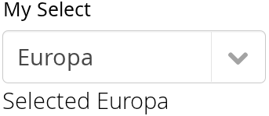

Allowing Adding New Items {#components.selection.newitems}
-------------------------

Some selection components can allow the user to add new items.
Currently, only `ComboBox` allows it, when the user types in a value and
presses Enter. You need to enable the mode with
setNewItemsAllowed(true). Setting the component also in immediate mode
may be necessary, as otherwise the item would not be added immediately
when the user interacts with the component, but after some other
component causes a server request.

    myselect.setNewItemsAllowed(true);
    myselect.setImmediate(true);

The user interface for adding new items depends on the selection
component. The regular `ComboBox` component allows you to simply type
the new item in the combo box and hit Enter to add it.

Adding new items in not possible if the selection component is read-only
or is bound to a `Container` that does not allow adding new items, and
an attempt may result in an exception.

### Handling New Items {#components.selection.newitems.handling}

Adding new items is handled by a NewItemHandler, which gets the item
caption string as parameter for the addNewItem() method. The default
implementation, `DefaultNewItemHandler`, checks for read-only state,
adds the item using the entered caption as the item ID, and if the
selection component gets the captions from a property, copies the
caption to that property. It also selects the item. The default
implementation may not be suitable for all container types, in which
case you need to define a custom handler. For example, a
`BeanItemContainer` expects the items to have the bean object itself as
the ID, not a string.

    // Have a bean container to put the beans in
    final BeanItemContainer<Planet> container =
        new BeanItemContainer<Planet>(Planet.class);

    // Put some example data in it
    container.addItem(new Planet(1, "Mercury"));
    container.addItem(new Planet(2, "Venus"));
    container.addItem(new Planet(3, "Earth"));
    container.addItem(new Planet(4, "Mars"));

    final ComboBox select =
        new ComboBox("Select or Add a Planet", container);
    select.setNullSelectionAllowed(false);

    // Use the name property for item captions
    select.setItemCaptionPropertyId("name");

    // Allow adding new items
    select.setNewItemsAllowed(true);
    select.setImmediate(true);

    // Custom handling for new items
    select.setNewItemHandler(new NewItemHandler() {
        @Override
        public void addNewItem(String newItemCaption) {
            // Create a new bean - can't set all properties
            Planet newPlanet = new Planet(0, newItemCaption);
            container.addBean(newPlanet);

            // Remember to set the selection to the new item
            select.select(newPlanet);

            Notification.show("Added new planet called " +
                              newItemCaption);
        }
    });

Multiple Selection {#components.selection.multiple}
------------------

Some selection components, such as `OptionGroup` and `ListSelect`
support a multiple selection mode, which you can enable with
setMultiSelect(). For `TwinColSelect`, which is especially intended for
multiple selection, it is enabled by default.

    myselect.setMultiSelect(true);

As in single selection mode, the property value of the component
indicates the selection. In multiple selection mode, however, the
property value is a `Collection` of the item IDs of the currently
selected items. You can get and set the property with the getValue() and
setValue() methods as usual.

A change in the selection will trigger a `ValueChangeEvent`, which you
can handle with a `Propery.ValueChangeListener`. As usual, you should
use setImmediate(true) to trigger the event immediately when the user
changes the selection. The following example shows how to handle
selection changes with a listener.

    // A selection component with some items
    ListSelect select = new ListSelect("My Selection");
    select.addItems("Mercury", "Venus", "Earth",
        "Mars", "Jupiter", "Saturn", "Uranus", "Neptune");

    // Multiple selection mode
    select.setMultiSelect(true);

    // Feedback on value changes
    select.addValueChangeListener(
        new Property.ValueChangeListener() {
        public void valueChange(ValueChangeEvent event) {
            // Some feedback
            layout.addComponent(new Label("Selected: " +
                event.getProperty().getValue().toString()));
        }
    });
    select.setImmediate(true);

Item Icons {#components.selection.item-icons}
----------

You can set an icon for each item with setItemIcon(), or define an item
property that provides the icon resource with setItemIconPropertyId(),
in a fashion similar to captions. Notice, however, that icons are not
supported in `NativeSelect`, `TwinColSelect`, and some other selection
components and modes. This is because HTML does not support images
inside the native `select` elements. Icons are also not really visually
applicable.

Component Extensions {#components.extensions}
====================

Components and UIs can have extensions which are attached to the
component dynamically. Especially, many add-ons are extensions.

How a component is extended depends on the extension. Typically, they
have an extend() method that takes the component to be extended as the
parameter.

    TextField tf = new TextField("Hello");
    layout.addComponent(tf);

    // Add a simple extension
    new CapsLockWarning().extend(tf);

    // Add an extension that requires some parameters
    CSValidator validator = new CSValidator();
    validator.setRegExp("[0-9]*");
    validator.setErrorMessage("Must be a number");
    validator.extend(tf);

Development of custom extensions is described in ?.

`Label` {#components.label}
=======

`Label` component displays non-editable text. This text can be used for
short simple labels or for displaying long text, such as paragraphs. The
text can be formatted in HTML or as preformatted text, depending on the
*content mode* of the label.

You can give the label text most conviniently in the constructor, as is
done in the following. Label has 100% default width, so the containing
layout must also have defined width.

    // A container that is 100% wide by default
    VerticalLayout layout = new VerticalLayout();

    Label label = new Label("Labeling can be dangerous");
    layout.addComponent(label);

`Label` implements the Property interface to allow accessing the text
value, so you can get and set the text with getValue() and setValue().

    // Get the label's text to initialize a field
    TextField editor = new TextField(null, // No caption
                                     label.getValue());

    // Change the label's text
    editor.addValueChangeListener(event -> // Java 8
        label.setValue(editor.getValue()));
    editor.setImmediate(true); // Send on Enter

Label also supports data binding to a property data source, as described
later in ?. However, in that case the value can not be set through the
label, as `Label` is not a Property.Editor and is not allowed to write
to a bound property.

Even though `Label` is text and is often used as a caption, it is a
normal component and therefore also has a caption that you can set with
setCaption(). As with most other components, the caption is managed by
the containing layout.

Text Width and Wrapping {#components.label.wrap}
-----------------------

`Label` has 100% default width, so the containing layout must also have
a defined width. If the width of the label's text exceeds the width of
the label, the text will wrap around and continue on the next line. Some
layout components have undefined width by default, such as
`HorizontalLayout`, so you need to pay special care with them.

    // A container with a defined width.
    Panel panel = new Panel("Panel Containing a Label");
    panel.setWidth("300px");

    panel.setContent(
        new Label("This is a Label inside a Panel. There is " +
                  "enough text in the label to make the text " +
                  "wrap when it exceeds the width of the panel."));

As the size of the `Panel` in the above example is fixed and the width
of `Label` is the default 100%, the text in the `Label` will wrap to fit
the panel, as shown in ?.

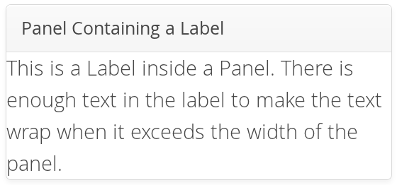

Setting `Label` to undefined width will cause it to not wrap at the end
of the line, as the width of the content defines the width. If placed
inside a layout with defined width, the `Label` will overflow the layout
horizontally and, normally, be truncated.

Content Mode {#components.label.content-mode}
------------

The content of a label is formatted depending on a *content mode*. By
default, the text is assumed to be plain text and any contained
XML-specific characters will be quoted appropriately to allow rendering
the contents of a label in HTML in a web browser. The content mode can
be set in the constructor or with setContentMode(), and can have the
values defined in the `ContentMode` enumeration type in
com.vaadin.shared.ui.label package:

`TEXT`

:   The default content mode where the label contains only plain text.
    All characters are allowed, including the special `<`, `>`, and `&`
    characters in XML or HTML, which are quoted properly in HTML while
    rendering the component. This is the default mode.

`PREFORMATTED`

:   Content mode where the label contains preformatted text. It will be,
    by default, rendered with a fixed-width typewriter font.
    Preformatted text can contain line breaks, written in Java with the
    `\n` escape sequence for a newline character (ASCII 0x0a), or
    tabulator characters written with `\t` (ASCII 0x09).

`HTML`

:   Content mode where the label contains HTML.

    Please note the following security and validity warnings regarding
    the HTML content mode.

> **Warning**
>
> Having `Label` in `HTML` content mode allows pure HTML content. If the
> content comes from user input, you should always carefully sanitize it
> to prevent cross-site scripting (XSS) attacks. Please see ?.
>
> Also, the validity of the HTML content is not checked when rendering
> the component and any errors can result in an error in the browser. If
> the content comes from an uncertain source, you should always validate
> it before displaying it in the component.

The following example demonstrates the use of `Label` in different
modes.

    Label textLabel = new Label(
        "Text where formatting characters, such as \\n, " +
        "and HTML, such as <b>here</b>, are quoted.",
        ContentMode.TEXT);

    Label preLabel = new Label(
        "Preformatted text is shown in an HTML <pre> tag.\n" +
        "Formatting such as\n" +
        "  * newlines\n" +
        "  * whitespace\n" +
        "and such are preserved. HTML tags, \n"+
        "such as <b>bold</b>, are quoted.",
        ContentMode.PREFORMATTED);

    Label htmlLabel = new Label(
        "In HTML mode, all HTML formatting tags, such as \n" +
        "<ul>"+
        "  <li><b>bold</b></li>"+
        "  <li>itemized lists</li>"+
        "  <li>etc.</li>"+
        "</ul> "+
        "are preserved.",
        ContentMode.HTML);

The rendering will look as shown in ?.

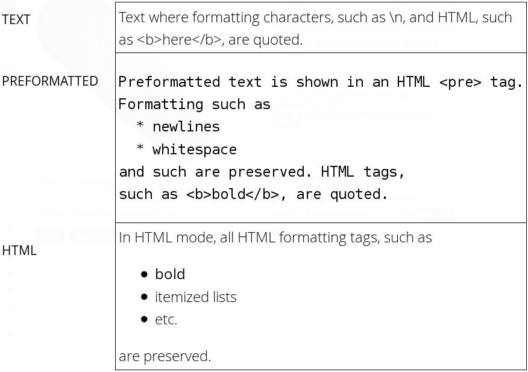

Spacing with a `Label` {#components.label.spacing}
----------------------

You can use a `Label` to create vertical or horizontal space in a
layout. If you need a empty "line" in a vertical layout, having just a
label with empty text is not enough, as it will collapse to zero height.
The same goes for a label with only whitespace as the label text. You
need to use a non-breaking space character, either `&nbsp;` or `&#160;`:

    layout.addComponent(new Label("&nbsp;", ContentMode.HTML));

Using the `ContentMode.PREFORMATTED` mode has the same effect;
preformatted spaces do not collapse in a vertical layout. In a
`HorizontalLayout`, the width of a space character may be unpredictable
if the label font is proportional, so you can use the preformatted mode
to add em-width wide spaces.

If you want a gap that has adjustable width or height, you can use an
empty label if you specify a height or width for it. For example, to
create vertical space in a `VerticalLayout`:

    Label gap = new Label();
    gap.setHeight("1em");
    verticalLayout.addComponent(gap);

You can make a flexible expanding spacer by having a relatively sized
empty label with `100%` height or width and setting the label as
expanding in the layout.

    // A wide component bar
    HorizontalLayout horizontal = new HorizontalLayout();
    horizontal.setWidth("100%");

    // Have a component before the gap (a collapsing cell)
    Button button1 = new Button("I'm on the left");
    horizontal.addComponent(button1);

    // An expanding gap spacer
    Label expandingGap = new Label();
    expandingGap.setWidth("100%");
    horizontal.addComponent(expandingGap);
    horizontal.setExpandRatio(expandingGap, 1.0f);

    // A component after the gap (a collapsing cell)
    Button button2 = new Button("I'm on the right");
    horizontal.addComponent(button2);

Data Binding {#components.label.databinding}
------------

While `Label` is not a field component, it is a Property.Viewer and can
be bound to a property data source, described in ?. You can specify the
data source either in the constructor or by the setPropertyDataSource()
method.

    // Some property
    ObjectProperty<String> property =
        new ObjectProperty<String>("some value");

    // Label that is bound to the property
    Label label = new Label(property);

Further, as `Label` is a Property, you can edit its value with a
property editor, such as a field:

    Label label = new Label("some value");
    TextField editor = new TextField();
    editor.setPropertyDataSource(label);
    editor.setImmediate(true);

However, `Label` is *not* a Property.Editor, so it is read-only when
bound to a data source. Therefore, you can not use setValue() to set the
value of a connected data source through a `Label` nor bind the label to
an editor field, in which case writes would be delegated through the
label.

CSS Style Rules {#components.label.css}
---------------

    .v-label { }
      pre { } /* In PREFORMATTED content mode */

The `Label` component has a `v-label` overall style. In the
`PREFORMATTED` content mode, the text is wrapped inside a `<pre>`
element.

`Link` {#components.link}
======

The `Link` component allows making hyperlinks. References to locations
are represented as resource objects, explained in ?. The `Link` is a
regular HTML hyperlink, that is, an `<a href>` anchor element that is
handled natively by the browser. Unlike when clicking a `Button`,
clicking a `Link` does not cause an event on the server-side.

Links to an arbitrary URL can be made by using an `ExternalResource` as
follows:

    // Textual link
    Link link = new Link("Click Me!",
            new ExternalResource("http://vaadin.com/"));

You can use setIcon() to make image links as follows:

    // Image link
    Link iconic = new Link(null,
            new ExternalResource("http://vaadin.com/"));
    iconic.setIcon(new ThemeResource("img/nicubunu_Chain.png"));

    // Image + caption
    Link combo = new Link("To appease both literal and visual",
            new ExternalResource("http://vaadin.com/"));
    combo.setIcon(new ThemeResource("img/nicubunu_Chain.png"));

The resulting links are shown in ?. You could add a "`display:
            block`" style for the icon element to place the caption
below it.

With the simple constructor used in the above example, the resource is
opened in the current window. Using the constructor that takes the
target window as a parameter, or by setting the target window with
setTargetName(), you can open the resource in another window, such as a
popup browser window/tab. As the target name is an HTML `target` string
managed by the browser, the target can be any window, including windows
not managed by the application itself. You can use the special
underscored target names, such as `_blank` to open the link to a new
browser window or tab.

    // Hyperlink to a given URL
    Link link = new Link("Take me a away to a faraway land",
            new ExternalResource("http://vaadin.com/"));

    // Open the URL in a new window/tab
    link.setTargetName("_blank");

    // Indicate visually that it opens in a new window/tab
    link.setIcon(new ThemeResource("icons/external-link.png"));
    link.addStyleName("icon-after-caption");

Normally, the link icon is before the caption. You can have it right of
the caption by reversing the text direction in the containing element.

    /* Position icon right of the link caption. */
    .icon-after-caption {
        direction: rtl;
    }
    /* Add some padding around the icon. */
    .icon-after-caption .v-icon {
        padding: 0 3px;
    }

The resulting link is shown in ?.

With the `_blank` target, a normal new browser window is opened. If you
wish to open it in a popup window (or tab), you need to give a size for
the window with setTargetWidth() and setTargetHeight(). You can control
the window border style with setTargetBorder(), which takes any of the
defined border styles `TARGET_BORDER_DEFAULT`, `TARGET_BORDER_MINIMAL`,
and `TARGET_BORDER_NONE`. The exact result depends on the browser.

    // Open the URL in a popup
    link.setTargetName("_blank");
    link.setTargetBorder(Link.TARGET_BORDER_NONE);
    link.setTargetHeight(300);
    link.setTargetWidth(400);

In addition to the `Link` component, Vaadin allows alternative ways to
make hyperlinks. The `Button` component has a `Reindeer.BUTTON_LINK`
style name that makes it look like a hyperlink, while handling clicks in
a server-side click listener instead of in the browser. Also, you can
make hyperlinks (or any other HTML) in a `Label` in HTML content mode.

    .v-link { }
      a { }
        .v-icon {}
        span {}

The overall style for the `Link` component is `v-link`. The root element
contains the `<a
                href>` hyperlink anchor. Inside the anchor are the icon,
with `v-icon` style, and the caption in a text span.

Hyperlink anchors have a number of *pseudo-classes* that are active at
different times. An unvisited link has `a:link` class and a visited link
`a:visited`. When the mouse pointer hovers over the link, it will have
`a:hover`, and when the mouse button is being pressed over the link, the
`a:active` class. When combining the pseudo-classes in a selector,
please notice that `a:hover` must come after an `a:link` and
`a:visited`, and `a:active` after the `a:hover`.

`TextField` {#components.textfield}
===========

TextField
`TextField` is one of the most commonly used user interface components.
It is a `Field` component that allows entering textual values using
keyboard.

The following example creates a simple text field:

    // Create a text field
    TextField tf = new TextField("A Field");

    // Put some initial content in it
    tf.setValue("Stuff in the field");

The result is shown in ?.

Value changes are handled with a `Property.ValueChangeListener`, as in
most other fields. The value can be acquired with getValue() directly
from the text field, as is done in the example below, or from the
property reference of the event.

    // Handle changes in the value
    tf.addValueChangeListener(new Property.ValueChangeListener() {
        public void valueChange(ValueChangeEvent event) {
            // Assuming that the value type is a String
            String value = (String) event.getProperty().getValue();

            // Do something with the value
            Notification.show("Value is: " + value);
        }
    });

    // Fire value changes immediately when the field loses focus
    tf.setImmediate(true);

As with other event listeners, you can use lambda expression with one
parameter to handle the events in Java 8.

Much of the API of `TextField` is defined in `AbstractTextField`, which
allows different kinds of text input fields, such as rich text editors,
which do not share all the features of the single-line text fields.

Data Binding {#components.textfield.databinding}
------------

`TextField` edits `String` values, but you can bind it to any property
type that has a proper converter, as described in ?.

    // Have an initial data model. As Double is unmodificable and
    // doesn't support assignment from String, the object is
    // reconstructed in the wrapper when the value is changed.
    Double trouble = 42.0;

    // Wrap it in a property data source
    final ObjectProperty<Double> property =
        new ObjectProperty<Double>(trouble);

    // Create a text field bound to it
    // (StringToDoubleConverter is used automatically)
    TextField tf = new TextField("The Answer", property);
    tf.setImmediate(true);

    // Show that the value is really written back to the
    // data source when edited by user.
    Label feedback = new Label(property);
    feedback.setCaption("The Value");

When you put a `Table` in editable mode or create fields with a
`FieldGroup`, the `DefaultFieldFactory` creates a `TextField` for almost
every property type by default. You often need to make a custom factory
to customize the creation and to set the field tooltip, validation,
formatting, and so on.

See ? for more details on data binding, field factories for `Table` in
?, and ? regarding forms.

Bean Binding
String Length {#components.textfield.length}
-------------

The setMaxLength() method sets the maximum length of the input string so
that the browser prevents the user from entering a longer one. As a
security feature, the input value is automatically truncated on the
server-side, as the maximum length setting could be bypassed on the
client-side. The maximum length property is defined at
`AbstractTextField` level.

Notice that the maximum length setting does not affect the width of the
field. You can set the width with setWidth(), as with other components.
Using *em* widths is recommended to better approximate the proper width
in relation to the size of the used font. There is no standard way in
HTML for setting the width exactly to a number of letters (in a
monospaced font). You can trick your way around this restriction by
putting the text field in an undefined-width `VerticalLayout` together
with an undefined-width `Label` that contains a sample text, and setting
the width of the text field as 100%. The layout will get its width from
the label, and the text field will use that.

Fitting TextField width to fixed input length
Handling Null Values {#components.textfield.nullvalues}
--------------------

Null representation
setNullRepresentation() As with any field, the value of a `TextField`
can be set as `null`. This occurs most commonly when you create a new
field without setting a value for it or bind the field value to a data
source that allows null values. In such case, you might want to show a
special value that stands for the null value. You can set the null
representation with the setNullRepresentation() method. Most typically,
you use an empty string for the null representation, unless you want to
differentiate from a string that is explicitly empty. The default null
representation is "`null`", which essentially warns that you may have
forgotten to initialize your data objects properly.

setNullSettingAllowed() The setNullSettingAllowed() controls whether the
user can actually input a null value by using the null value
representation. If the setting is `false`, which is the default,
inputting the null value representation string sets the value as the
literal value of the string, not null. This default assumption is a
safeguard for data sources that may not allow null values.

    // Have a property with null value
    ObjectProperty<Double> dataModel =
        new ObjectProperty<Double>(new Double(0.0));
    dataModel.setValue(null); // Have to set it null here

    // Create a text field bound to the null data
    TextField tf = new TextField("Field Energy (J)", dataModel);
    tf.setNullRepresentation("-- null-point --");

    // Allow user to input the null value by its representation
    tf.setNullSettingAllowed(true);

The `Label`, which is bound to the value of the `TextField`, displays a
null value as empty. The resulting user interface is shown in ?.

Text Change Events {#components.textfield.textchangeevents}
------------------

Text change events
Often you want to receive a change event immediately when the text field
value changes. The *immediate* mode is not literally immediate, as the
changes are transmitted only after the field loses focus. In the other
extreme, using keyboard events for every keypress would make typing
unbearably slow and also processing the keypresses is too complicated
for most purposes. *Text change events* are transmitted asynchronously
soon after typing and do not block typing while an event is being
processed.

`TextChangeListener` Text change events are received with a
`TextChangeListener`, as is done in the following example that
demonstrates how to create a text length counter:

    // Text field with maximum length
    final TextField tf = new TextField("My Eventful Field");
    tf.setValue("Initial content");
    tf.setMaxLength(20);

    // Counter for input length
    final Label counter = new Label();
    counter.setValue(tf.getValue().length() +
                     " of " + tf.getMaxLength());

    // Display the current length interactively in the counter
    tf.addTextChangeListener(new TextChangeListener() {
        public void textChange(TextChangeEvent event) {
            int len = event.getText().length();
            counter.setValue(len + " of " + tf.getMaxLength());
        }
    });

    // The lazy mode is actually the default
    tf.setTextChangeEventMode(TextChangeEventMode.LAZY);

The result is shown in ?.

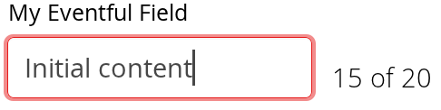

The *text change event mode* defines how quickly the changes are
transmitted to the server and cause a server-side event. Lazier change
events allow sending larger changes in one event if the user is typing
fast, thereby reducing server requests.

`TextChangeEventMode` You can set the text change event mode of a
`TextField` with setTextChangeEventMode(). The allowed modes are defined
in `TextChangeEventMode` enum and are as follows:

`TextChangeEventMode.LAZY` (default)

:   An event is triggered when there is a pause in editing the text. The
    length of the pause can be modified with setInputEventTimeout(). As
    with the `TIMEOUT` mode, a text change event is forced before a
    possible `ValueChangeEvent`, even if the user did not keep a pause
    while entering the text.

    This is the default mode.

`TextChangeEventMode.TIMEOUT`

:   A text change in the user interface causes the event to be
    communicated to the application after a timeout period. If more
    changes are made during this period, the event sent to the
    server-side includes the changes made up to the last change. The
    length of the timeout can be set with setInputEventTimeout().

    If a `ValueChangeEvent` would occur before the timeout period, a
    `TextChangeEvent` is triggered before it, on the condition that the
    text content has changed since the previous `TextChangeEvent`.

`TextChangeEventMode.EAGER`

:   An event is triggered immediately for every change in the text
    content, typically caused by a key press. The requests are separate
    and are processed sequentially one after another. Change events are
    nevertheless communicated asynchronously to the server, so further
    input can be typed while event requests are being processed.

CSS Style Rules {#components.textfield.css}
---------------

    .v-textfield { }

The HTML structure of `TextField` is extremely simple, consisting only
of an element with the `v-textfield` style.

For example, the following custom style uses dashed border:

    .v-textfield-dashing {
        border:     thin dashed;
        background: white; /* Has shading image by default */
    }

The result is shown in ?.

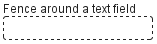

The style name for `TextField` is also used in several components that
contain a text input field, even if the text input is not an actual
`TextField`. This ensures that the style of different text input boxes
is similar.

`TextArea` {#components.textarea}
==========

`TextArea` is a multi-line version of the `TextField` component
described in ?.

The following example creates a simple text area:

    // Create the area
    TextArea area = new TextArea("Big Area");

    // Put some content in it
    area.setValue("A row\n"+
                  "Another row\n"+
                  "Yet another row");

The result is shown in ?.

You can set the number of visible rows with setRows() or use the regular
setHeight() to define the height in other units. If the actual number of
rows exceeds the number, a vertical scrollbar will appear. Setting the
height with setRows() leaves space for a horizontal scrollbar, so the
actual number of visible rows may be one higher if the scrollbar is not
visible.

You can set the width with the regular setWidth() method. Setting the
size with the *em* unit, which is relative to the used font size, is
recommended.

The setWordwrap() sets whether long lines are wrapped (`true` - default)
when the line length reaches the width of the writing area. If the word
wrap is disabled (`false`), a vertical scrollbar will appear instead.
The word wrap is only a visual feature and wrapping a long line does not
insert line break characters in the field value; shortening a wrapped
line will undo the wrapping.

    TextArea area1 = new TextArea("Wrapping");
    area1.setWordwrap(true); // The default
    area1.setValue("A quick brown fox jumps over the lazy dog");

    TextArea area2 = new TextArea("Nonwrapping");
    area2.setWordwrap(false);
    area2.setValue("Victor jagt zw&ouml;lf Boxk&auml;mpfer quer "+
                   "&uuml;ber den Sylter Deich");

The result is shown in ?.

    .v-textarea { }

The HTML structure of `TextArea` is extremely simple, consisting only of
an element with `v-textarea` style.

CSS Styling
`PasswordField` {#components.passwordfield}
===============

The `PasswordField` is a variant of `TextField` that hides the typed
input from visual inspection.

    PasswordField tf = new PasswordField("Keep it secret");

The result is shown in ?.

You should note that the `PasswordField` hides the input only from "over
the shoulder" visual observation. Unless the server connection is
encrypted with a secure connection, such as HTTPS, the input is
transmitted in clear text and may be intercepted by anyone with
low-level access to the network. Also phishing attacks that intercept
the input in the browser may be possible by exploiting JavaScript
execution security holes in the browser.

    .v-textfield { }

The `PasswordField` does not have its own CSS style name but uses the
same `v-textfield` style as the regular `TextField`. See ? for
information on styling it.

CSS Styling
`RichTextArea` {#components.richtextarea}
==============

The `RichTextArea` field allows entering or editing formatted text. The
toolbar provides all basic editing functionalities. The text content of
`RichTextArea` is represented in HTML format. `RichTextArea` inherits
`TextField` and does not add any API functionality over it. You can add
new functionality by extending the client-side components
`VRichTextArea` and `VRichTextToolbar`.

As with `TextField`, the textual content of the rich text area is the
`Property` of the field and can be set with setValue() and read with
getValue().

    // Create a rich text area
    final RichTextArea rtarea = new RichTextArea();
    rtarea.setCaption("My Rich Text Area");

    // Set initial content as HTML
    rtarea.setValue("<h1>Hello</h1>\n" +
        "
This rich text area contains some text.
");

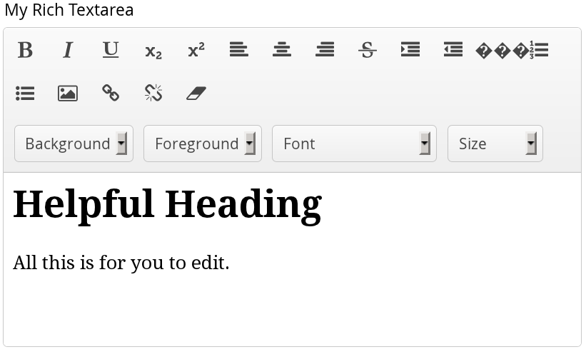

Above, we used context-specific tags such as `<h1>` in the initial HTML
content. The rich text area component does not allow creating such tags,
only formatting tags, but it does preserve them unless the user edits
them away. Any non-visible whitespace such as the new line character
(`\n`) are removed from the content. For example, the value set above
will be as follows when read from the field with getValue():

    <h1>Hello</h1> 
This rich text area contains some text.

> **Warning**
>
> The user input from a `RichTextArea` is transmitted as HTML from the
> browser to server-side and is not sanitized. As the entire purpose of
> the `RichTextArea` component is to allow input of formatted text, you
> can not sanitize it just by removing all HTML tags. Also many
> attributes, such as `style`, should pass through the sanitization.
>
> See ? for more details on Cross-Site scripting vulnerabilities and
> sanitization of user input.

The rich text area is one of the few components in Vaadin that contain
textual labels. The selection boxes in the toolbar are in English and
currently can not be localized in any other way than by inheriting or
reimplementing the client-side `VRichTextToolbar` widget. The buttons
can be localized simply with CSS by downloading a copy of the toolbar
background image, editing it, and replacing the default toolbar. The
toolbar is a single image file from which the individual button icons
are picked, so the order of the icons is different from the rendered.
The image file depends on the client-side implementation of the toolbar.

    .v-richtextarea-richtextexample .gwt-ToggleButton
    .gwt-Image {
      background-image: url(img/richtextarea-toolbar-fi.png)
                        !important;
    }

    .v-richtextarea { }
    .v-richtextarea .gwt-RichTextToolbar { }
    .v-richtextarea .gwt-RichTextArea { }

The rich text area consists of two main parts: the toolbar with overall
style `.gwt-RichTextToolbar` and the editor area with style
`.gwt-RichTextArea`. The editor area obviously contains all the elements
and their styles that the HTML content contains. The toolbar contains
buttons and drop-down list boxes with the following respective style
names:

    .gwt-ToggleButton { }
    .gwt-ListBox { }

Date and Time Input with `DateField` {#components.datefield}
====================================

The `DateField` component provides the means to display and input date
and time. The field comes in two variations: `PopupDateField`, with a
numeric input box and a popup calendar view, and `InlineDateField`, with
the calendar view always visible. The `DateField` base class defaults to
the popup variation.

The example below illustrates the use of the `DateField` baseclass,
which is equivalent to the `PopupDateField`. We set the initial time of
the date field to current time by using the default constructor of the
`java.util.Date` class.

    // Create a DateField with the default style
    DateField date = new DateField();

    // Set the date and time to present
    date.setValue(new Date());

The result is shown in ?.

`PopupDateField` {#components.datefield.popupdatefield}
----------------

The `PopupDateField` provides date input using a text box for the date
and time. As the `DateField` defaults to this component, the use is
exactly the same as described earlier. Clicking the handle right of the
date opens a popup view for selecting the year, month, and day, as well
as time. Also the Down key opens the popup. Once opened, the user can
navigate the calendar using the cursor keys.

The date and time selected from the popup are displayed in the text box
according to the default date and time format of the current locale, or
as specified with setDateFormat(). The same format definitions are used
for parsing user input.

The date and time are normally displayed according to the default format
for the current locale (see ?). You can specify a custom format with
setDateFormat(). It takes a format string that follows the format of the
`SimpleDateFormat` in Java.

    // Display only year, month, and day in ISO format
    date.setDateFormat("yyyy-MM-dd");

The result is shown in ?.

The same format specification is also used for parsing user-input date
and time, as described later.

A user can easily input a malformed or otherwise invalid date or time.
`DateField` has two validation layers: first on the client-side and then
on the server-side.

The validity of the entered date is first validated on the client-side,
immediately when the input box loses focus. If the date format is
invalid, the `v-datefield-parseerror` style is set. Whether this causes
a visible indication of a problem depends on the theme. The built-in
`reindeer` theme does not shown any indication by default, making
server-side handling of the problem more convenient.

    .mydate.v-datefield-parseerror .v-textfield {
        background: pink;
    }

The setLenient(true) setting enables relaxed interpretation of dates, so
that invalid dates, such as February 30th or March 0th, are wrapped to
the next or previous month, for example.

The server-side validation phase occurs when the date value is sent to
the server. If the date field is set in immediate state, it occurs
immediately after the field loses focus. Once this is done and if the
status is still invalid, an error indicator is displayed beside the
component. Hovering the mouse pointer over the indicator shows the error
message.

You can handle the errors by overriding the handleUnparsableDateString()
method. The method gets the user input as a string parameter and can
provide a custom parsing mechanism, as shown in the following example.

    // Create a date field with a custom parsing and a
    // custom error message for invalid format
    PopupDateField date = new PopupDateField("My Date") {
        @Override
        protected Date handleUnparsableDateString(String dateString)
        throws Property.ConversionException {
            // Try custom parsing
            String fields[] = dateString.split("/");
            if (fields.length >= 3) {
                try {
                    int year  = Integer.parseInt(fields[0]);
                    int month = Integer.parseInt(fields[1])-1;
                    int day   = Integer.parseInt(fields[2]);
                    GregorianCalendar c =
                        new GregorianCalendar(year, month, day);
                    return c.getTime();
                } catch (NumberFormatException e) {
                    throw new Property.
                        ConversionException("Not a number");
                }
            }

            // Bad date
            throw new Property.
                ConversionException("Your date needs two slashes");
        }
    };

    // Display only year, month, and day in slash-delimited format
    date.setDateFormat("yyyy/MM/dd");

    // Don't be too tight about the validity of dates
    // on the client-side
    date.setLenient(true);

The handler method must either return a parsed `Date` object or throw a
`ConversionException`. Returning `null` will set the field value to
`null` and clear the input box.

In addition to customized parsing, overriding the handler method for
unparseable input is useful for internationalization and other
customization of the error message. You can also use it for another way
for reporting the errors, as is done in the example below:

    // Create a date field with a custom error message for invalid format
    PopupDateField date = new PopupDateField("My Date") {
        @Override
        protected Date handleUnparsableDateString(String dateString)
        throws Property.ConversionException {
            // Have a notification for the error
            Notification.show(
                    "Your date needs two slashes",
                    Notification.TYPE_WARNING_MESSAGE);

            // A failure must always also throw an exception
            throw new Property.ConversionException("Bad date");
        }
    };

If the input is invalid, you should always throw the exception;
returning a `null` value would make the input field empty, which is
probably undesired.

Like other fields that have a text box, `PopupDateField` allows an input
prompt that is visible until the user has input a value. You can set the
prompt with setInputPrompt.

    PopupDateField date = new PopupDateField();

    // Set the prompt
    date.setInputPrompt("Select a date");

    // Set width explicitly to accommodate the prompt
    date.setWidth("10em");

The date field doesn't automatically scale to accommodate the prompt, so
you need to set it explicitly with setWidth().

The input prompt is not available in the `DateField` superclass.

    .v-datefield, v-datefield-popupcalendar {}
      .v-textfield, v-datefield-textfield {}
      .v-datefield-button {}

The top-level element of `DateField` and all its variants have
`v-datefield` style. The base class and the `PopupDateField` also have
the `v-datefield-popupcalendar` style.

In addition, the top-level element has a style that indicates the
resolution, with `v-datefield-` basename and an extension, which is one
of `full`, `day`, `month`, or `year`. The `-full` style is enabled when
the resolution is smaller than a day. These styles are used mainly for
controlling the appearance of the popup calendar.

The text box has `v-textfield` and `v-datefield-textfield` styles, and
the calendar button `v-datefield-button`.

Once opened, the calendar popup has the following styles at the top
level:

    .v-datefield-popup {}
      .v-popupcontent {}
        .v-datefield-calendarpanel {}

The top-level element of the floating popup calendar has
`.v-datefield-popup` style. Observe that the popup frame is outside the
HTML structure of the component, hence it is not enclosed in the
`v-datefield` element and does not include any custom styles. The
content in the `v-datefield-calendarpanel` is the same as in
`InlineDateField`, as described in ?.

`InlineDateField` {#components.datefield.calendar}
-----------------

The `InlineDateField` provides a date picker component with a month
view. The user can navigate months and years by clicking the appropriate
arrows. Unlike with the popup variant, the month view is always visible
in the inline field.

    // Create a DateField with the default style
    InlineDateField date = new InlineDateField();

    // Set the date and time to present
    date.setValue(new java.util.Date());

The result is shown in ?.

The user can also navigate the calendar using the cursor keys.

    .v-datefield {}
      .v-datefield-calendarpanel {}
        .v-datefield-calendarpanel-header {}
          .v-datefield-calendarpanel-prevyear {}
          .v-datefield-calendarpanel-prevmonth {}
          .v-datefield-calendarpanel-month {}
          .v-datefield-calendarpanel-nextmonth {}
          .v-datefield-calendarpanel-nextyear {}
        .v-datefield-calendarpanel-body {}
          .v-datefield-calendarpanel-weekdays,
          .v-datefield-calendarpanel-weeknumbers {}
            .v-first {}
            .v-last {}
          .v-datefield-calendarpanel-weeknumber {}
          .v-datefield-calendarpanel-day {}
        .v-datefield-calendarpanel-time {}
          .v-datefield-time {}
            .v-select {}
            .v-label {}

The top-level element has the `v-datefield` style. In addition, the
top-level element has a style name that indicates the resolution of the
calendar, with `v-datefield-` basename and an extension, which is one of
`full`, `day`, `month`, or `year`. The `-full` style is enabled when the
resolution is smaller than a day.

The `v-datefield-calendarpanel-weeknumbers` and
`v-datefield-calendarpanel-weeknumber` styles are enabled when the week
numbers are enabled. The former controls the appearance of the weekday
header and the latter the actual week numbers.

The other style names should be self-explanatory. For weekdays, the
`v-first` and `v-last` styles allow making rounded endings for the
weekday bar.

Date and Time Resolution {#components.datefield.resolution}
------------------------

In addition to display a calendar with dates, `DateField` can also
display the time in hours and minutes, or just the month or year. The
visibility of the input components is controlled by *time resolution*,
which you can set with setResolution(). The method takes as its
parameters the lowest visible component, `DateField.Resolution.DAY` for
just dates and `DateField.Resolution.MIN` for dates with time in hours
and minutes. Please see the API Reference for the complete list of
resolution parameters.

DateField Locale {#components.datefield.locale}
----------------

The date and time are displayed according to the locale of the user, as
reported by the browser. You can set a custom locale with the
setLocale() method of `AbstractComponent`, as described in ?. Only
Gregorian calendar is supported.

`Button` {#components.button}
========

The `Button` component is normally used for initiating some action, such
as finalizing input in forms. When the user clicks a button, a
`Button.ClickEvent` is fired, which can be handled with a
Button.ClickListener in the buttonClick() method.

You can handle button clicks with an anonymous class as follows:

    Button button = new Button("Do not press this button");

    button.addClickListener(new Button.ClickListener() {
        public void buttonClick(ClickEvent event) {
            Notification.show("Do not press this button again");
        }
    });

The result is shown in ?. The listener can also be given in the
constructor, which is often perhaps simpler.

If you handle several buttons in the same listener, you can
differentiate between them either by comparing the `Button` object
reference returned by the getButton() method of `Button.ClickEvent` to a
kept reference. For a detailed description of these patterns together
with some examples, please see ?.

    .v-button { }
      .v-button-wrap { }
        .v-button-caption { }

A button has an overall `v-button` style. The caption has
`v-button-caption` style. There is also an intermediate wrap element,
which may help in styling in some cases.

Some built-in themes contain a small style, which you can enable by
adding `Reindeer.BUTTON_SMALL`, etc. The `BaseTheme` also has a
`BUTTON_LINK` style, which makes the button look like a hyperlink.

`CheckBox` {#components.checkbox}
==========

`CheckBox` is a two-state selection component that can be either checked
or unchecked. The caption of the check box will be placed right of the
actual check box. Vaadin provides two ways to create check boxes:
individual check boxes with the `CheckBox` component described in this
section and check box groups with the `OptionGroup` component in
multiple selection mode, as described in ?.

Clicking on a check box will change its state. The state is a `Boolean`
property that you can set with the setValue() method and obtain with the
getValue() method of the `Property` interface. Changing the value of a
check box will cause a `ValueChangeEvent`, which can be handled by a
`ValueChangeListener`.

    CheckBox checkbox1 = new CheckBox("Box with no Check");
    CheckBox checkbox2 = new CheckBox("Box with a Check");

    checkbox2.setValue(true);

    checkbox1.addValueChangeListener(event -> // Java 8
        checkbox2.setValue(! checkbox1.getValue()));

    checkbox2.addValueChangeListener(event -> // Java 8
        checkbox1.setValue(! checkbox2.getValue()));

The result is shown in ?.

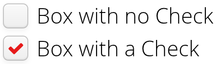

For an example on the use of check boxes in a table, see ?.

    .v-checkbox { }
      .v-checkbox > input { }
      .v-checkbox > label { }

The top-level element of a `CheckBox` has the `v-checkbox` style. It
contains two sub-elements: the actual check box `input` element and the
`label` element. If you want to have the label on the left, you can
change the positions with "`direction:
                rtl`" for the top element.

`ComboBox` {#components.combobox}
==========

`ComboBox` is a selection component allows selecting an item from a
drop-down list. The component also has a text field area, which allows
entering search text by which the items shown in the drop-down list are
filtered. Common selection component features are described in ?.

`ComboBox` supports adding new items when the user presses Enter, as
described in ?.

Filtered Selection {#components.combobox.filtering}
------------------

`ComboBox` allows filtering the items available for selection in the
drop-down list by the text entered in the input box.

Pressing Enter will complete the item in the input box. Pressing Up- and
Down-arrows can be used for selecting an item from the drop-down list.
The drop-down list is paged and clicking on the scroll buttons will
change to the next or previous page. The list selection can also be done
with the arrow keys on the keyboard. The shown items are loaded from the
server as needed, so the number of items held in the component can be
quite large. The number of matching items is displayed by the drop-down
list.

Filtering is enabled by setting a *filtering mode* with
setFilteringMode().

    cb.setFilteringMode(FilteringMode.CONTAINS);

The modes defined in the `FilteringMode` enum are as follows:

`CONTAINS`

:   Matches any item that contains the string given in the text field
    part of the component.

`STARTSWITH`

:   Matches only items that begin with the given string.

`OFF` (default)

:   Filtering is by default off and all items are shown all the time.

The above example uses the containment filter that matches to all items
containing the input string. As shown in ? below, when we type some text
in the input area, the drop-down list will show all the matching items.

    .v-filterselect { }
      .v-filterselect-input { }
      .v-filterselect-button { }

    // Under v-overlay-container
    .v-filterselect-suggestpopup { }
      .popupContent { }
        .v-filterselect-prevpage,
          .v-filterselect-prevpage-off { }
        .v-filterselect-suggestmenu { }
          .gwt-MenuItem { }
        .v-filterselect-nextpage,
          .v-filterselect-nextpage-off { }
        .v-filterselect-status { }

In its default state, only the input field of the `ComboBox` component
is visible. The entire component is enclosed in `v-filterselect` style
(a legacy remnant), the input field has `v-filterselect-input` style and
the button in the right end that opens and closes the drop-down result
list has `v-filterselect-button` style.

The drop-down result list has an overall `v-filterselect-suggestpopup`
style. It contains the list of suggestions with
`v-filterselect-suggestmenu` style. When there are more items that fit
in the menu, navigation buttons with `v-filterselect-prevpage` and
`v-filterselect-nextpage` styles are shown. When they are not shown, the
elements have `-off` suffix. The status bar in the bottom that shows the
paging status has `v-filterselect-status` style.

`ListSelect` {#components.listselect}
============

The `ListSelect` component is list box that shows the selectable items
in a vertical list. If the number of items exceeds the height of the
component, a scrollbar is shown. The component allows both single and
multiple selection modes, which you can set with setMultiSelect(). It is
visually identical in both modes.

    // Create the selection component
    ListSelect select = new ListSelect("The List");

    // Add some items (here by the item ID as the caption)
    select.addItems("Mercury", "Venus", "Earth", ...);

    select.setNullSelectionAllowed(false);

    // Show 5 items and a scrollbar if there are more
    select.setRows(5);

The number of visible items is set with setRows().

Common selection component features are described in ?.

    .v-select {}
      .v-select-select {}
        option {}

The component has an overall `v-select` style. The native `<select>`
element has `v-select-select` style. The items are represented as
`<option>` elements.

`NativeSelect` {#components.nativeselect}
==============

`NativeSelect` is a drop-down selection component implemented with the
native selection input of web browsers, using the HTML `<select>`
element.

    // Create the selection component
    NativeSelect select = new NativeSelect("Native Selection");

    // Add some items
    select.addItems("Mercury", "Venus", ...);

The setColumns() allows setting the width of the list as "columns",
which is a measure that depends on the browser.

Common selection component features are described in ?.

    .v-select {}
      .v-select-select {}

The component has a `v-select` overall style. The native `select`
element has `v-select-select` style.

`OptionGroup` {#components.optiongroup}
=============

`OptionGroup` is a selection component that allows selection from a
group of radio buttons in single selection mode. In multiple selection
mode, the items show up as check boxes. The common selection component
features are described in ?.

Option group is by default in single selection mode. Multiple selection
is enabled with setMultiSelect().

    // A single-select radio button group
    OptionGroup single = new OptionGroup("Single Selection");
    single.addItems("Single", "Sola", "Yksi");

    // A multi-select check box group
    OptionGroup multi = new OptionGroup("Multiple Selection");
    multi.setMultiSelect(true);
    multi.addItems("Many", "Muchos", "Monta");

? shows the `OptionGroup` in both single and multiple selection mode.

You can also create check boxes individually using the `CheckBox` class,
as described in ?. The advantages of the `OptionGroup` component are
that as it maintains the individual check box objects, you can get an
array of the currently selected items easily, and that you can easily
change the appearance of a single component.

Disabling Items {#components.optiongroup.disabling}
---------------

You can disable individual items in an `OptionGroup` with
setItemEnabled(). The user can not select or deselect disabled items in
multi-select mode, but in single-select mode the use can change the
selection from a disabled to an enabled item. The selections can be
changed programmatically regardless of whether an item is enabled or
disabled. You can find out whether an item is enabled with
isItemEnabled().

The setItemEnabled() identifies the item to be disabled by its item ID.

    // Have an option group with some items
    OptionGroup group = new OptionGroup("My Disabled Group");
    group.addItems("One", "Two", "Three");

    // Disable one item by its item ID
    group.setItemEnabled("Two", false);

The item IDs are also used for the captions in this example. The result
is shown in ?.

Setting an item as disabled turns on the `v-disabled` style for it.

    .v-select-optiongroup {}
      .v-select-option.v-checkbox {}
      .v-select-option.v-radiobutton {}

The `v-select-optiongroup` is the overall style for the component. Each
check box will have the `v-checkbox` style, borrowed from the `CheckBox`
component, and each radio button the `v-radiobutton` style. Both the
radio buttons and check boxes will also have the `v-select-option` style
that allows styling regardless of the option type. Disabled items have
additionally the `v-disabled` style.

The options are normally laid out vertically. You can use horizontal
layout by setting `display: inline-block` for the options. The `nowrap`
setting for the overall element prevents wrapping if there is not enough
horizontal space in the layout, or if the horizontal width is undefined.

    /* Lay the options horizontally */
    .v-select-optiongroup-horizontal .v-select-option {
        display: inline-block;
    }

    /* Avoid wrapping if the layout is too tight */
    .v-select-optiongroup-horizontal {
        white-space: nowrap;
    }

    /* Some extra spacing is needed */
    .v-select-optiongroup-horizontal
      .v-select-option.v-radiobutton {
        padding-right: 10px;
    }

Use of the above rules requires setting a custom `horizontal` style name
for the component. The result is shown in ?.

`TwinColSelect` {#components.twincolselect}
===============

The `TwinColSelect` field provides a multiple selection component that
shows two lists side by side, with the left column containing unselected
items and the right column the selected items. The user can select items
from the list on the left and click on the "\>\>" button to move them to
the list on the right. Items can be deselected by selecting them in the
right list and clicking on the "\<\<" button.

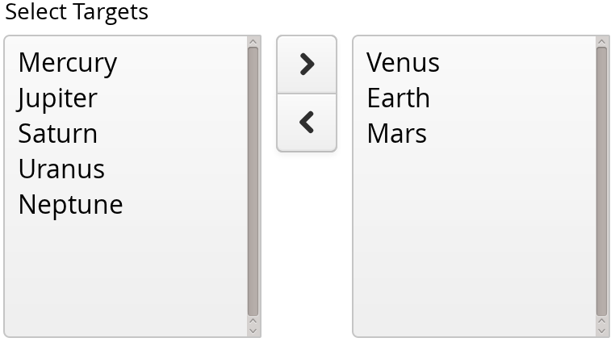

`TwinColSelect` is always in multi-select mode, so its property value is
always a collection of the item IDs of the selected items, that is, the
items in the right column.

The selection columns can have their own captions, separate from the
overall component caption, which is managed by the containing layout.
You can set the column captions with setLeftColumnCaption() and
setRightColumnCaption().

    TwinColSelect select = new TwinColSelect("Select Targets");

    // Put some items in the select
    select.addItems("Mercury", "Venus", "Earth", "Mars",
            "Jupiter", "Saturn", "Uranus", "Neptune");

    // Few items, so we can set rows to match item count
    select.setRows(select.size());

    // Preselect a few items by creating a set
    select.setValue(new HashSet<String>(
        Arrays.asList("Venus", "Earth", "Mars")));

    // Handle value changes
    select.addValueChangeListener(event -> // Java 8
        layout.addComponent(new Label("Selected: " +
                event.getProperty().getValue())));

The resulting component is shown in ?.

The setRows() method sets the height of the component by the number of
visible items in the selection boxes. Setting the height with
setHeight() to a defined value overrides the rows setting.

Common selection component features are described in ?.

    .v-select-twincol {}
      .v-select-twincol-options-caption {}
      .v-select-twincol-selections-caption {}
      .v-select-twincol-options {}
      .v-select-twincol-buttons {}
        .v-button {}
          .v-button-wrap {}
            .v-button-caption {}
        .v-select-twincol-deco {}
      .v-select-twincol-selections {}

The `TwinColSelect` component has an overall `v-select-twincol` style.
If set, the left and right column captions have
`v-select-twincol-options-caption` and
`v-select-twincol-options-caption` style names, respectively. The left
box, which displays the unselected items, has
`v-select-twincol-options-caption` style and the right box, which
displays the selected items, has `v-select-twincol-options-selections`
style. Between them is the button area, which has overall
`v-select-twincol-buttons` style; the actual buttons reuse the styles
for the `Button` component. Between the buttons is a divider element
with `v-select-twincol-deco` style.

`Table` {#components.table}
=======

Table
The `Table` component is intended for presenting tabular data organized
in rows and columns. The `Table` is one of the most versatile components
in Vaadin. Table cells can include text or arbitrary UI components. You
can easily implement editing of the table data, for example clicking on
a cell could change it to a text field for editing.

The data contained in a `Table` is managed using the Data Model of
Vaadin (see ?), through the `Container` interface of the `Table`. This
makes it possible to bind a table directly to a data source, such as a
database query. Only the visible part of the table is loaded into the
browser and moving the visible window with the scrollbar loads content
from the server. While the data is being loaded, a tooltip will be
displayed that shows the current range and total number of items in the
table. The rows of the table are *items* in the container and the
columns are *properties*. Each table row (item) is identified with an
*item identifier* (IID), and each column (property) with a *property
identifier* (PID).

When creating a table, you first need to define columns with
addContainerProperty(). This method comes in two flavors. The simpler
one takes the property ID of the column and uses it also as the caption
of the column. The more complex one allows differing PID and header for
the column. This may make, for example, internationalization of table
headers easier, because if a PID is internationalized, the
internationalization has to be used everywhere where the PID is used.
The complex form of the method also allows defining an icon for the
column from a resource. The "default value" parameter is used when new
properties (columns) are added to the table, to fill in the missing
values. (This default has no meaning in the usual case, such as below,
where we add items after defining the properties.)

    Table table = new Table("The Brightest Stars");

    // Define two columns for the built-in container
    table.addContainerProperty("Name", String.class, null);
    table.addContainerProperty("Mag",  Float.class, null);

    // Add a row the hard way
    Object newItemId = table.addItem();
    Item row1 = table.getItem(newItemId);
    row1.getItemProperty("Name").setValue("Sirius");
    row1.getItemProperty("Mag").setValue(-1.46f);

    // Add a few other rows using shorthand addItem()
    table.addItem(new Object[]{"Canopus",        -0.72f}, 2);
    table.addItem(new Object[]{"Arcturus",       -0.04f}, 3);
    table.addItem(new Object[]{"Alpha Centauri", -0.01f}, 4);

    // Show exactly the currently contained rows (items)
    table.setPageLength(table.size());

In this example, we used an increasing `Integer` object as the Item
Identifier, given as the second parameter to addItem(). The actual rows
are given simply as object arrays, in the same order in which the
properties were added. The objects must be of the correct class, as
defined in the addContainerProperty() calls.

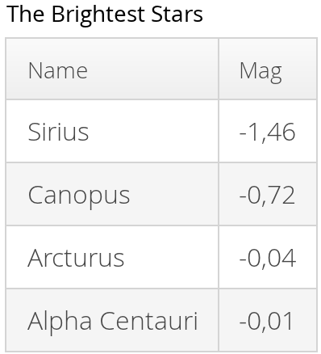

Scalability of the `Table` is largely dictated by the container. The
default `IndexedContainer` is relatively heavy and can cause scalability
problems, for example, when updating the values. Use of an optimized
application-specific container is recommended. Table does not have a
limit for the number of items and is just as fast with hundreds of
thousands of items as with just a few. With the current implementation
of scrolling, there is a limit of around 500 000 rows, depending on the
browser and the pixel height of rows.

Common selection component features are described in ?.

Selecting Items in a Table {#components.table.selecting}
--------------------------

The `Table` allows selecting one or more items by clicking them with the
mouse. When the user selects an item, the IID of the item will be set as
the property of the table and a `ValueChangeEvent` is triggered. To
enable selection, you need to set the table *selectable*. You will also
need to set it as *immediate* in most cases, as we do below, because
without it, the change in the property will not be communicated
immediately to the server.

The following example shows how to enable the selection of items in a
`Table` and how to handle `ValueChangeEvent` events that are caused by
changes in selection. You need to handle the event with the
valueChange() method of the `Property.ValueChangeListener` interface.

    // Allow selecting items from the table.
    table.setSelectable(true);

    // Send changes in selection immediately to server.
    table.setImmediate(true);

    // Shows feedback from selection.
    final Label current = new Label("Selected: -");

    // Handle selection change.
    table.addValueChangeListener(new Property.ValueChangeListener() {
        public void valueChange(ValueChangeEvent event) {
            current.setValue("Selected: " + table.getValue());
        }
    });

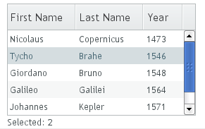

If the user clicks on an already selected item, the selection will
deselected and the table property will have `null` value. You can
disable this behaviour by setting setNullSelectionAllowed(false) for the
table.

The selection is the value of the table's property, so you can get it
with getValue(). You can get it also from a reference to the table
itself. In single selection mode, the value is the item identifier of
the selected item or `null` if no item is selected. In multiple
selection mode (see below), the value is a `Set` of item identifiers.
Notice that the set is unmodifiable, so you can not simply change it to
change the selection.

A table can also be in *multiselect* mode, where a user can select
multiple items by clicking them with left mouse button while holding the
Ctrl key (or Meta key) pressed. If Ctrl is not held, clicking an item
will select it and other selected items are deselected. The user can
select a range by selecting an item, holding the Shift key pressed, and
clicking another item, in which case all the items between the two are
also selected. Multiple ranges can be selected by first selecting a
range, then selecting an item while holding Ctrl, and then selecting
another item with both Ctrl and Shift pressed.

The multiselect mode is enabled with the setMultiSelect() method of the
`AbstractSelect` superclass of `Table`. Setting table in multiselect
mode does not implicitly set it as *selectable*, so it must be set
separately.

The setMultiSelectMode() property affects the control of multiple
selection: `MultiSelectMode.DEFAULT` is the default behaviour, which
requires holding the Ctrl (or Meta) key pressed while selecting items,
while in `MultiSelectMode.SIMPLE` holding the Ctrl key is not needed. In
the simple mode, items can only be deselected by clicking them.

Table Features {#components.table.features}
--------------

### Page Length and Scrollbar

The default style for `Table` provides a table with a scrollbar. The
scrollbar is located at the right side of the table and becomes visible
when the number of items in the table exceeds the page length, that is,
the number of visible items. You can set the page length with
setPageLength().

Setting the page length to zero makes all the rows in a table visible,
no matter how many rows there are. Notice that this also effectively
disables buffering, as all the entire table is loaded to the browser at
once. Using such tables to generate reports does not scale up very well,
as there is some inevitable overhead in rendering a table with Ajax. For
very large reports, generating HTML directly is a more scalable
solution.

### Resizing Columns {#components.table.features.resizing}

You can set the width of a column programmatically from the server-side
with setColumnWidth(). The column is identified by the property ID and
the width is given in pixels.

The user can resize table columns by dragging the resize handle between
two columns. Resizing a table column causes a `ColumnResizeEvent`, which
you can handle with a `Table.ColumnResizeListener`. The table must be
set in immediate mode if you want to receive the resize events
immediately, which is typical.

    table.addColumnResizeListener(new Table.ColumnResizeListener(){
        public void columnResize(ColumnResizeEvent event) {
            // Get the new width of the resized column
            int width = event.getCurrentWidth();

            // Get the property ID of the resized column
            String column = (String) event.getPropertyId();

            // Do something with the information
            table.setColumnFooter(column, String.valueOf(width) + "px");
        }
    });

    // Must be immediate to send the resize events immediately
    table.setImmediate(true);

See ? for a result after the columns of a table has been resized.

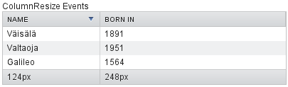

### Reordering Columns {#components.table.features.reordering}

If setColumnReorderingAllowed(true) is set, the user can reorder table
columns by dragging them with the mouse from the column header,

### Collapsing Columns {#components.table.features.collapsing}

When setColumnCollapsingAllowed(true) is set, the right side of the
table header shows a drop-down list that allows selecting which columns
are shown. Collapsing columns is different than hiding columns with
setVisibleColumns(), which hides the columns completely so that they can
not be made visible (uncollapsed) from the user interface.

You can collapse columns programmatically with setColumnCollapsed().
Collapsing must be enabled before collapsing columns with the method or
it will throw an `IllegalAccessException`.

    // Allow the user to collapse and uncollapse columns
    table.setColumnCollapsingAllowed(true);

    // Collapse this column programmatically
    try {
        table.setColumnCollapsed("born", true);
    } catch (IllegalAccessException e) {
        // Can't occur - collapsing was allowed above
        System.err.println("Something horrible occurred");
    }

    // Give enough width for the table to accommodate the
    // initially collapsed column later
    table.setWidth("250px");

See ?.

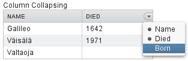

If the table has undefined width, it minimizes its width to fit the
width of the visible columns. If some columns are initially collapsed,
the width of the table may not be enough to accomodate them later, which
will result in an ugly horizontal scrollbar. You should consider giving
the table enough width to accomodate columns uncollapsed by the user.

### Components Inside a Table {#components.table.features.components}

The cells of a `Table` can contain any user interface components, not
just strings. If the rows are higher than the row height defined in the
default theme, you have to define the proper row height in a custom
theme.

When handling events for components inside a `Table`, such as for the
`Button` in the example below, you usually need to know the item the
component belongs to. Components do not themselves know about the table
or the specific item in which a component is contained. Therefore, the
handling method must use some other means for finding out the Item ID of
the item. There are a few possibilities. Usually the easiest way is to
use the setData() method to attach an arbitrary object to a component.
You can subclass the component and include the identity information
there. You can also simply search the entire table for the item with the
component, although that solution may not be so scalable.

The example below includes table rows with a `Label` in HTML content
mode, a multiline `TextField`, a `CheckBox`, and a `Button` that shows
as a link.

    // Create a table and add a style to allow setting the row height in theme.
    final Table table = new Table();
    table.addStyleName("components-inside");

    /* Define the names and data types of columns.
     * The "default value" parameter is meaningless here. */
    table.addContainerProperty("Sum",            Label.class,     null);
    table.addContainerProperty("Is Transferred", CheckBox.class,  null);
    table.addContainerProperty("Comments",       TextField.class, null);
    table.addContainerProperty("Details",        Button.class,    null);

    /* Add a few items in the table. */
    for (int i=0; i<100; i++) {
        // Create the fields for the current table row
        Label sumField = new Label(String.format(
                       "Sum is <b>$%04.2f</b> <i>(VAT incl.)</i>",
                       new Object[] {new Double(Math.random()*1000)}),
                                   ContentMode.HTML);
        CheckBox transferredField = new CheckBox("is transferred");

        // Multiline text field. This required modifying the
        // height of the table row.
        TextField commentsField = new TextField();
        commentsField.setRows(3);

        // The Table item identifier for the row.
        Integer itemId = new Integer(i);

        // Create a button and handle its click. A Button does not
        // know the item it is contained in, so we have to store the
        // item ID as user-defined data.
        Button detailsField = new Button("show details");
        detailsField.setData(itemId);
        detailsField.addClickListener(new Button.ClickListener() {
            public void buttonClick(ClickEvent event) {
                // Get the item identifier from the user-defined data.
                Integer iid = (Integer)event.getButton().getData();
                Notification.show("Link " +
                                  iid.intValue() + " clicked.");
            }
        });
        detailsField.addStyleName("link");

        // Create the table row.
        table.addItem(new Object[] {sumField, transferredField,
                                    commentsField, detailsField},
                      itemId);
    }

    // Show just three rows because they are so high.
    table.setPageLength(3);

The row height has to be set higher than the default with a style rule
such as the following:

    /* Table rows contain three-row TextField components. */
    .v-table-components-inside .v-table-cell-content {
        height: 54px;
    }

The table will look as shown in ?.

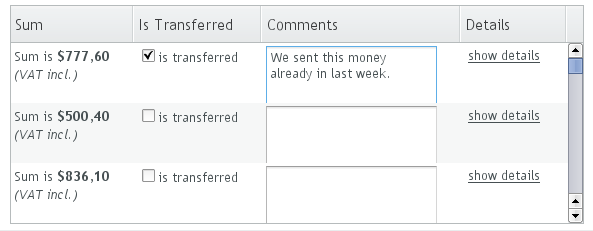

### Iterating Over a Table {#components.table.features.iterating}

As the items in a `Table` are not indexed, iterating over the items has
to be done using an iterator. The getItemIds() method of the `Container`
interface of `Table` returns a `Collection` of item identifiers over
which you can iterate using an `Iterator`. For an example about
iterating over a `Table`, please see ?. Notice that you may not modify
the `Table` during iteration, that is, add or remove items. Changing the
data is allowed.

### Filtering Table Contents {#components.table.features.filtering}

A table can be filtered if its container data source implements the
`Filterable` interface, as the default `IndexedContainer` does. See ?.
ContainerFilterable

Editing the Values in a Table {#components.table.editing}
-----------------------------

Normally, a `Table` simply displays the items and their fields as text.
If you want to allow the user to edit the values, you can either put
them inside components as we did earlier or simply call
setEditable(true), in which case the cells are automatically turned into
editable fields.

Let us begin with a regular table with a some columns with usual Java
types, namely a `Date`, `Boolean`, and a `String`.

    // Create a table. It is by default not editable.
    final Table table = new Table();

    // Define the names and data types of columns.
    table.addContainerProperty("Date",     Date.class,  null);
    table.addContainerProperty("Work",     Boolean.class, null);
    table.addContainerProperty("Comments", String.class,  null);

    // Add a few items in the table.
    for (int i=0; i<100; i++) {
        Calendar calendar = new GregorianCalendar(2008,0,1);
        calendar.add(Calendar.DAY_OF_YEAR, i);

        // Create the table row.
        table.addItem(new Object[] {calendar.getTime(),
                                    new Boolean(false),
                                    ""},
                      new Integer(i)); // Item identifier
    }

    table.setPageLength(8);
    layout.addComponent(table);

You could put the table in editable mode right away if you need to.
We'll continue the example by adding a mechanism to switch the `Table`
from and to the editable mode.

    final CheckBox switchEditable = new CheckBox("Editable");
    switchEditable.addValueChangeListener(
            new Property.ValueChangeListener() {
        public void valueChange(ValueChangeEvent event) {
            table.setEditable(((Boolean)event.getProperty()
                                 .getValue()).booleanValue());
        }
    });
    switchEditable.setImmediate(true);
    layout.addComponent(switchEditable);

Now, when you check to checkbox, the components in the table turn into
editable fields, as shown in ?.

### Field Factories

The field components that allow editing the values of particular types
in a table are defined in a field factory that implements the
`TableFieldFactory` interface. The default implementation is
`DefaultFieldFactory`, which offers the following crude mappings:

  Property Type   Mapped to Field Class
  --------------- ------------------------------------------------------------------------------------------------------------------------------------------------------------------------------------------------------------------------------------------
  `Date`          A `DateField`.
  `Boolean`       A `CheckBox`.
  `Item`          A `Form` (deprecated in Vaadin 7). The fields of the form are automatically created from the item's properties using a `FormFieldFactory`. The normal use for this property type is inside a `Form` and is less useful inside a `Table`.
  *other*         A `TextField`. The text field manages conversions from the basic types, if possible.

  : Type to Field Mappings in `DefaultFieldFactory`

Field factories are covered with more detail in ?. You could just
implement the `TableFieldFactory` interface, but we recommend that you
extend the `DefaultFieldFactory` according to your needs. In the default
implementation, the mappings are defined in the
createFieldByPropertyType() method (you might want to look at the source
code) both for tables and forms.

### Navigation in Editable Mode

In the editable mode, the editor fields can have focus. Pressing Tab
moves the focus to next column or, at the last column, to the first
column of the next item. Respectively, pressing Shift+Tab moves the focus backward. If the focus
is in the last column of the last visible item, the pressing Tab moves
the focus outside the table. Moving backward from the first column of
the first item moves the focus to the table itself. Some updates to the
table, such as changing the headers or footers or regenerating a column,
can move the focus from an editor component to the table itself.

The default behaviour may be undesirable in many cases. For example, the
focus also goes through any read-only editor fields and can move out of
the table inappropriately. You can provide better navigation is to use
event handler for shortcut keys such as Tab, Arrow Up, Arrow Down, and
Enter.

    // Keyboard navigation
    class KbdHandler implements Handler {
        Action tab_next = new ShortcutAction("Tab",
                ShortcutAction.KeyCode.TAB, null);
        Action tab_prev = new ShortcutAction("Shift+Tab",
                ShortcutAction.KeyCode.TAB,
                new int[] {ShortcutAction.ModifierKey.SHIFT});
        Action cur_down = new ShortcutAction("Down",
                ShortcutAction.KeyCode.ARROW_DOWN, null);
        Action cur_up   = new ShortcutAction("Up",
                ShortcutAction.KeyCode.ARROW_UP,   null);
        Action enter   = new ShortcutAction("Enter",
                ShortcutAction.KeyCode.ENTER,      null);
        public Action[] getActions(Object target, Object sender) {
            return new Action[] {tab_next, tab_prev, cur_down,
                                 cur_up, enter};
        }

        public void handleAction(Action action, Object sender,
                                 Object target) {
            if (target instanceof TextField) {
                // Move according to keypress
                int itemid = (Integer) ((TextField) target).getData();
                if (action == tab_next || action == cur_down)
                    itemid++;
                else if (action == tab_prev || action == cur_up)
                    itemid--;
                // On enter, just stay where you were. If we did
                // not catch the enter action, the focus would be
                // moved to wrong place.

                if (itemid >= 0 && itemid < table.size()) {
                    TextField newTF = valueFields.get(itemid);
                    if (newTF != null)
                        newTF.focus();
                }
            }
        }
    }

    // Panel that handles keyboard navigation
    Panel navigator = new Panel();
    navigator.addStyleName(Reindeer.PANEL_LIGHT);
    navigator.addComponent(table);
    navigator.addActionHandler(new KbdHandler());

The main issue in implementing keyboard navigation in an editable table
is that the editor fields do not know the table they are in. To find the
parent table, you can either look up in the component container
hierarchy or simply store a reference to the table with setData() in the
field component. The other issue is that you can not acquire a reference
to an editor field from the `Table` component. One solution is to use
some external collection, such as a `HashMap`, to map item IDs to the
editor fields.

    // Can't access the editable components from the table so
    // must store the information
    final HashMap<Integer,TextField> valueFields =
        new HashMap<Integer,TextField>();

The map has to be filled in a `TableFieldFactory`, such as in the
following. You also need to set the reference to the table there and you
can also set the initial focus there.

    table.setTableFieldFactory(new TableFieldFactory () {
        public Field createField(Container container, Object itemId,
                Object propertyId, Component uiContext) {
            TextField field = new TextField((String) propertyId);

            // User can only edit the numeric column
            if ("Source of Fear".equals(propertyId))
                field.setReadOnly(true);
            else { // The numeric column
                // The field needs to know the item it is in
                field.setData(itemId);

                // Remember the field
                valueFields.put((Integer) itemId, field);

                // Focus the first editable value
                if (((Integer)itemId) == 0)
                    field.focus();
            }
            return field;
        }
    });

The issues are complicated by the fact that the editor fields are not
generated for the entire table, but only for a cache window that
includes the visible items and some items above and below it. For
example, if the beginning of a big scrollable table is visible, the
editor component for the last item does not exist. This issue is
relevant mostly if you want to have wrap-around navigation that jumps
from the last to first item and vice versa.

Column Headers and Footers {#components.table.headersfooters}
--------------------------

`Table` supports both column headers and footers; the headers are
enabled by default.

### Headers {#components.table.headersfooters.headers}

The table header displays the column headers at the top of the table.
You can use the column headers to reorder or resize the columns, as
described earlier. By default, the header of a column is the property ID
of the column, unless given explicitly with setColumnHeader().

    // Define the properties
    table.addContainerProperty("lastname", String.class, null);
    table.addContainerProperty("born", Integer.class, null);
    table.addContainerProperty("died", Integer.class, null);

    // Set nicer header names
    table.setColumnHeader("lastname", "Name");
    table.setColumnHeader("born", "Born");
    table.setColumnHeader("died", "Died");

The text of the column headers and the visibility of the header depends
on the *column header mode*. The header is visible by default, but you
can disable it with
setColumnHeaderMode(Table.COLUMN\_HEADER\_MODE\_HIDDEN).

### Footers {#components.table.headersfooters.footers}

The table footer can be useful for displaying sums or averages of values
in a column, and so on. The footer is not visible by default; you can
enable it with setFooterVisible(true). Unlike in the header, the column
headers are empty by default. You can set their value with
setColumnFooter(). The columns are identified by their property ID.

The following example shows how to calculate average of the values in a
column:



// Have a table with a numeric column
Table table = new Table("Custom Table Footer");
table.addContainerProperty("Name", String.class, null);
table.addContainerProperty("Died At Age", Integer.class, null);

// Insert some data
Object people[][] = {{"Galileo",  77},
                     {"Monnier",  83},
                     {"Vaisala",  79},
                     {"Oterma",   86}};
for (int i=0; i<people.length; i++)
    table.addItem(people[i], new Integer(i));

// Calculate the average of the numeric column
double avgAge = 0;
for (int i=0; i<people.length; i++)
    avgAge += (Integer) people[i][1];
avgAge /= people.length;

// Set the footers
table.setFooterVisible(true);
table.setColumnFooter("Name", "Average");
table.setColumnFooter("Died At Age", String.valueOf(avgAge));

// Adjust the table height a bit
table.setPageLength(table.size());


The resulting table is shown in ?.

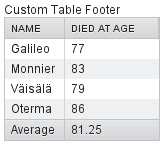

### Handling Mouse Clicks on Headers and Footers

Normally, when the user clicks a column header, the table will be sorted
by the column, assuming that the data source is `Sortable` and sorting
is not disabled. In some cases, you might want some other functionality
when the user clicks the column header, such as selecting the column in
some way.

Clicks in the header cause a `HeaderClickEvent`, which you can handle
with a `Table.HeaderClickListener`. Click events on the table header
(and footer) are, like button clicks, sent immediately to server, so
there is no need to set setImmediate().


// Handle the header clicks
table.addHeaderClickListener(new Table.HeaderClickListener() {
    public void headerClick(HeaderClickEvent event) {
        String column = (String) event.getPropertyId();
        Notification.show("Clicked " + column +
                "with " + event.getButtonName());
    }
});

// Disable the default sorting behavior
table.setSortDisabled(true);



Setting a click handler does not automatically disable the sorting
behavior of the header; you need to disable it explicitly with
setSortDisabled(true). Header click events are not sent when the user
clicks the column resize handlers to drag them.

The `HeaderClickEvent` object provides the identity of the clicked
column with getPropertyId(). The getButton() reports the mouse button
with which the click was made: `BUTTON_LEFT`, `BUTTON_RIGHT`, or
`BUTTON_MIDDLE`. The getButtonName() a human-readable button name in
English: "`left`", "`right`", or "`middle`". The isShiftKey(),
isCtrlKey(), etc., methods indicate if the Shift, Ctrl, Alt or other
modifier keys were pressed during the click.

Clicks in the footer cause a `FooterClickEvent`, which you can handle
with a `Table.FooterClickListener`. Footers do not have any default
click behavior, like the sorting in the header. Otherwise, handling
clicks in the footer is equivalent to handling clicks in the header.

Generated Table Columns {#components.table.columngenerator}
-----------------------

You might want to have a column that has values calculated from other
columns. Or you might want to format table columns in some way, for
example if you have columns that display currencies. The
`ColumnGenerator` interface allows defining custom generators for such
columns.

You add new generated columns to a `Table` with addGeneratedColumn(). It
takes the column identifier as its parameters. Usually you want to have
a more user-friendly and possibly internationalized column header. You
can set the header and a possible icon by calling addContainerProperty()
*before* adding the generated column.



// Define table columns.
table.addContainerProperty(
    "date",     Date.class,   null, "Date",         null, null);
table.addContainerProperty(
    "quantity", Double.class, null, "Quantity (l)", null, null);
table.addContainerProperty(
    "price",    Double.class, null, "Price (e/l)",  null, null);
table.addContainerProperty(
    "total",    Double.class, null, "Total (e)",    null, null);

// Define the generated columns and their generators.
table.addGeneratedColumn("date",
                         new DateColumnGenerator());
table.addGeneratedColumn("quantity",
                         new ValueColumnGenerator("%.2f l"));
table.addGeneratedColumn("price",
                         new PriceColumnGenerator());
table.addGeneratedColumn("total",
                         new ValueColumnGenerator("%.2f e"));



Notice that the addGeneratedColumn() always places the generated columns
as the last column, even if you defined some other order previously. You
will have to set the proper order with setVisibleColumns().



table.setVisibleColumns("date", "quantity", "price", "total");



The generators are objects that implement the `Table.ColumnGenerator`
interface and its generateCell() method. The method gets the identity of
the item and column as its parameters, in addition to the table object.
It has to return a component object.

The following example defines a generator for formatting `Double` valued
fields according to a format string (as in `java.util.Formatter`).



/** Formats the value in a column containing Double objects. */
class ValueColumnGenerator implements Table.ColumnGenerator {
    String format; /* Format string for the Double values. */

    /**
     * Creates double value column formatter with the given
     * format string.
     */
    public ValueColumnGenerator(String format) {
        this.format = format;
    }

    /**
     * Generates the cell containing the Double value.
     * The column is irrelevant in this use case.
     */
    public Component generateCell(Table source, Object itemId,
                                  Object columnId) {
        // Get the object stored in the cell as a property
        Property prop =
            source.getItem(itemId).getItemProperty(columnId);
        if (prop.getType().equals(Double.class)) {
            Label label = new Label(String.format(format,
                    new Object[] { (Double) prop.getValue() }));

            // Set styles for the column: one indicating that it's
            // a value and a more specific one with the column
            // name in it. This assumes that the column name
            // is proper for CSS.
            label.addStyleName("column-type-value");
            label.addStyleName("column-" + (String) columnId);
            return label;
        }
        return null;
    }
}



The generator is called for all the visible (or more accurately cached)
items in a table. If the user scrolls the table to another position in
the table, the columns of the new visible rows are generated
dynamically. The columns in the visible (cached) rows are also generated
always when an item has a value change. It is therefore usually safe to
calculate the value of generated cells from the values of different rows
(items).

When you set a table as `editable`, regular fields will change to
editing fields. When the user changes the values in the fields, the
generated columns will be updated automatically. Putting a table with
generated columns in editable mode has a few quirks. The editable mode
of `Table` does not affect generated columns. You have two alternatives:
either you generate the editing fields in the generator or, in case of
formatter generators, remove the generator in the editable mode. The
example below uses the latter approach.



// Have a check box that allows the user
// to make the quantity and total columns editable.
final CheckBox editable = new CheckBox(
    "Edit the input values - calculated columns are regenerated");

editable.setImmediate(true);
editable.addClickListener(new ClickListener() {
    public void buttonClick(ClickEvent event) {
        table.setEditable(editable.booleanValue());

        // The columns may not be generated when we want to
        // have them editable.
        if (editable.booleanValue()) {
            table.removeGeneratedColumn("quantity");
            table.removeGeneratedColumn("total");
        } else { // Not editable
            // Show the formatted values.
            table.addGeneratedColumn("quantity",
                new ValueColumnGenerator("%.2f l"));
            table.addGeneratedColumn("total",
                new ValueColumnGenerator("%.2f e"));
        }
        // The visible columns are affected by removal
        // and addition of generated columns so we have
        // to redefine them.
        table.setVisibleColumns("date", "quantity",
                 "price", "total", "consumption", "dailycost");
    }
});



You will also have to set the editing fields in `immediate` mode to have
the update occur immediately when an edit field loses the focus. You can
set the fields in `immediate` mode with the a custom
`TableFieldFactory`, such as the one given below, that just extends the
default implementation to set the mode:



public class ImmediateFieldFactory extends DefaultFieldFactory {
    public Field createField(Container container,
                             Object itemId,
                             Object propertyId,
                             Component uiContext) {
        // Let the DefaultFieldFactory create the fields...
        Field field = super.createField(container, itemId,
                                        propertyId, uiContext);

        // ...and just set them as immediate.
        ((AbstractField)field).setImmediate(true);

        return field;
    }
}
...
table.setTableFieldFactory(new ImmediateFieldFactory());



If you generate the editing fields with the column generator, you avoid
having to use such a field factory, but of course have to generate the
fields for both normal and editable modes.

? shows a table with columns calculated (blue) and simply formatted
(black) with column generators.

Formatting Table Columns {#components.table.columnformatting}
------------------------

The displayed values of properties shown in a table are normally
formatted using the toString() method of each property. Customizing the
format of a column can be done in several ways:

-   Using
    ColumnGenerator
    to generate a second column that is formatted. The original column
    needs to be set invisible. See
    .
-   Using a
    PropertyFormatter
    as a proxy between the table and the data property. This also
    normally requires using an mediate container in the table.
-   Overriding the default
    formatPropertyValue()
    in
    Table
    .

As using a `PropertyFormatter` is generally much more awkward than
overriding the formatPropertyValue(), its use is not described here.

You can override formatPropertyValue() as is done in the following
example:



// Create a table that overrides the default
// property (column) format
final Table table = new Table("Formatted Table") {
    @Override
    protected String formatPropertyValue(Object rowId,
            Object colId, Property property) {
        // Format by property type
        if (property.getType() == Date.class) {
            SimpleDateFormat df =
                new SimpleDateFormat("yyyy-MM-dd hh:mm:ss");
            return df.format((Date)property.getValue());
        }

        return super.formatPropertyValue(rowId, colId, property);
    }
};

// The table has some columns
table.addContainerProperty("Time", Date.class, null);

... Fill the table with data ...



You can also distinguish between columns by the `colId` parameter, which
is the property ID of the column. `DecimalFormat` is useful for
formatting decimal values.



... in formatPropertyValue() ...
} else if ("Value".equals(pid)) {
    // Format a decimal value for a specific locale
    DecimalFormat df = new DecimalFormat("#.00",
            new DecimalFormatSymbols(locale));
    return df.format((Double) property.getValue());
}
...
table.addContainerProperty("Value", Double.class, null);



A table with the formatted date and decimal value columns is shown in ?.

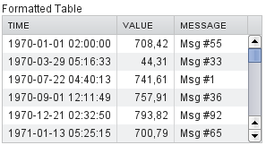

You can use CSS for further styling of table rows, columns, and
individual cells by using a `CellStyleGenerator`. It is described in ?.

CSS Style Rules {#components.table.css}
---------------

Styling the overall style of a `Table` can be done with the following
CSS rules.

    .v-table {}
      .v-table-header-wrap {}
        .v-table-header {}
          .v-table-header-cell {}
            .v-table-resizer {} /* Column resizer handle. */
            .v-table-caption-container {}
      .v-table-body {}
        .v-table-row-spacer {}
        .v-table-table {}
          .v-table-row {}
            .v-table-cell-content {}

Notice that some of the widths and heights in a table are calculated
dynamically and can not be set in CSS.

### Setting Individual Cell Styles

The `Table.CellStyleGenerator` interface allows you to set the CSS style
for each individual cell in a table. You need to implement the
getStyle(), which gets the row (item) and column (property) identifiers
as parameters and can return a style name for the cell. The returned
style name will be concatenated to prefix "`v-table-cell-content-`".

The getStyle() is called also for each row, so that the `propertyId`
parameter is `null`. This allows setting a row style.

Alternatively, you can use a `Table.ColumnGenerator` (see ?) to generate
the actual UI components of the cells and add style names to them.



Table table = new Table("Table with Cell Styles");
table.addStyleName("checkerboard");

// Add some columns in the table. In this example, the property
// IDs of the container are integers so we can determine the
// column number easily.
table.addContainerProperty("0", String.class, null, "", null, null);
for (int i=0; i<8; i++)
    table.addContainerProperty(""+(i+1), String.class, null,
                         String.valueOf((char) (65+i)), null, null);

// Add some items in the table.
table.addItem(new Object[]{
    "1", "R", "N", "B", "Q", "K", "B", "N", "R"}, new Integer(0));
table.addItem(new Object[]{
    "2", "P", "P", "P", "P", "P", "P", "P", "P"}, new Integer(1));
for (int i=2; i<6; i++)
    table.addItem(new Object[]{String.valueOf(i+1),
                 "", "", "", "", "", "", "", ""}, new Integer(i));
table.addItem(new Object[]{
    "7", "P", "P", "P", "P", "P", "P", "P", "P"}, new Integer(6));
table.addItem(new Object[]{
    "8", "R", "N", "B", "Q", "K", "B", "N", "R"}, new Integer(7));
table.setPageLength(8);

// Set cell style generator
table.setCellStyleGenerator(new Table.CellStyleGenerator() {
    public String getStyle(Object itemId, Object propertyId) {
        // Row style setting, not relevant in this example.
        if (propertyId == null)
            return "green"; // Will not actually be visible

        int row = ((Integer)itemId).intValue();
        int col = Integer.parseInt((String)propertyId);

        // The first column.
        if (col == 0)
            return "rowheader";

        // Other cells.
        if ((row+col)%2 == 0)
            return "black";
        else
            return "white";
    }
});



You can then style the cells, for example, as follows:



/* Center the text in header. */
.v-table-header-cell {
    text-align: center;
}

/* Basic style for all cells. */
.v-table-checkerboard .v-table-cell-content {
    text-align: center;
    vertical-align: middle;
    padding-top: 12px;
    width: 20px;
    height: 28px;
}

/* Style specifically for the row header cells. */
.v-table-cell-content-rowheader {
    background: #E7EDF3
     url(../default/table/img/header-bg.png) repeat-x scroll 0 0;
}

/* Style specifically for the "white" cells. */
.v-table-cell-content-white {
    background: white;
    color: black;
}

/* Style specifically for the "black" cells. */
.v-table-cell-content-black {
    background: black;
    color: white;
}



The table will look as shown in ?.

`Tree` {#components.tree}
======

The `Tree` component allows a natural way to represent data that has
hierarchical relationships, such as filesystems or message threads. The
`Tree` component in Vaadin works much like the tree components of most
modern desktop user interface toolkits, for example in directory
browsing.

The typical use of the `Tree` component is for displaying a hierachical
menu, like a menu on the left side of the screen, as in ?, or for
displaying filesystems or other hierarchical datasets. The `menu` style
makes the appearance of the tree more suitable for this purpose.



final Object[][] planets = new Object[][]{
        new Object[]{"Mercury"},
        new Object[]{"Venus"},
        new Object[]{"Earth", "The Moon"},
        new Object[]{"Mars", "Phobos", "Deimos"},
        new Object[]{"Jupiter", "Io", "Europa", "Ganymedes",
                                "Callisto"},
        new Object[]{"Saturn",  "Titan", "Tethys", "Dione",
                                "Rhea", "Iapetus"},
        new Object[]{"Uranus",  "Miranda", "Ariel", "Umbriel",
                                "Titania", "Oberon"},
        new Object[]{"Neptune", "Triton", "Proteus", "Nereid",
                                "Larissa"}};

Tree tree = new Tree("The Planets and Major Moons");

/* Add planets as root items in the tree. */
for (int i=0; i<planets.length; i++) {
    String planet = (String) (planets[i][0]);
    tree.addItem(planet);

    if (planets[i].length == 1) {
        // The planet has no moons so make it a leaf.
        tree.setChildrenAllowed(planet, false);
    } else {
        // Add children (moons) under the planets.
        for (int j=1; j<planets[i].length; j++) {
            String moon = (String) planets[i][j];

            // Add the item as a regular item.
            tree.addItem(moon);

            // Set it to be a child.
            tree.setParent(moon, planet);

            // Make the moons look like leaves.
            tree.setChildrenAllowed(moon, false);
        }

        // Expand the subtree.
        tree.expandItemsRecursively(planet);
    }
}

main.addComponent(tree);



? below shows the tree from the code example in a practical situation.

You can read or set the currently selected item by the value property of
the `Tree` component, that is, with getValue() and setValue(). When the
user clicks an item on a tree, the tree will receive an
`ValueChangeEvent`, which you can catch with a `ValueChangeListener`. To
receive the event immediately after the click, you need to set the tree
as `setImmediate(true)`.

The `Tree` component uses `Container` data sources much like the `Table`
component, with the addition that it also utilizes hierarchy information
maintained by a `HierarchicalContainer`. The contained items can be of
any item type supported by the container. The default container and its
addItem() assume that the items are strings and the string value is used
as the item ID.

`Grid` {#components.grid}
======

Grid
`Grid` is many things, and perhaps the most versatile and powerful
component in Vaadin. Like `Table`, it allows presenting and editing
tabular data, but escapes many of `Table`'s limitations. Efficient lazy
loading of data while scrolling greatly improves performance. Grid is
scalable, mobile friendly, and extensible.

Overview {#components.grid.overview}
--------

`Grid` is for displaying and editing tabular data laid out in rows and
columns. At the top, a *header* can be shown, and a *footer* at the
bottom. In addition to plain text, the header and footer can contain
HTML and components. Having components in the header allows implementing
filtering easily. The grid data can be sorted by clicking on a column
header; shift-clicking a column header enables secondary sorting
criteria.

The data area can be scrolled both vertically and horizontally. The
leftmost columns can be frozen, so that they are never scrolled out of
the view. The data is loaded lazily from the server, so that only the
visible data is loaded. The smart lazy loading functionality gives
excellent user experience even with low bandwidth, such as mobile
devices.

The grid data can be edited with a row-based editor after
double-clicking a row. The fields are generated with a field factory, or
set explicitly, and bound to data with a field group.

Grid is fully themeable with CSS and style names can be set for all grid
elements. For data rows and cells, the styles can be generated with a
row or cell style generator.

Finally, `Grid` is designed to be extensible and used just as well for
client-side development - its GWT API is nearly identical to the
server-side API, including data binding.

### Differences to Table {#components.grid.overview.table}

In addition to core features listed above, `Grid` has the following
API-level differences to `Table`:

-   Grid is not a
    Container
    itself, even though it can be bound to a container data source.
    Consequently, columns are defined differently, and so forth.
-   Rows can be added with
    addRow()
    shorthand (during initialization) instead of
    addItem()
    .
-   Use
    setHeightByRows()
    and
    setHeightMode()
    instead of
    setPageLength()
    to set the height in number of rows.
-   Grid does not extend
    AbstractSelect
    and is not a field, but has its own selection API.
    addSelectionListener()
    is called to define a
    SelectionListener
    . The listener also receives a collection of deselected items.
-   Grid does not support having all cells in editable mode, it only
    supports row-based editing, with a row mini-editor that allows
    saving or discarding the changes.
-   Grid has no generated columns. Instead, the container data source
    can be wrapped around a
    GeneratedPropertyContainer
    .
-   No column icons; you can implement them in a column with an
    ImageRenderer
    .
-   Components can not be shown in Grid cells; instead the much more
    efficient renderers can be used for the most common cases, and row
    editor for editing values.
-   No support for drag and drop currently.

In addition, Grid has the following visual changes:

-   Multiple selection is indicated with check boxes in addition to
    highlighting.

Binding to Data {#components.grid.data}
---------------

`Grid` is normally used by binding it to a container data source,
described in ?. The container must implement Container.Indexed
interface. By default, it is bound to an `IndexedContainer`; Grid offers
some shorthand methods to operate on the default container, as described
later.

You can set the container in the constructor or with
setContainerDataSource().

For example, if you have a collection of beans, you could wrap them in a
Vaadin `BeanItemContainer`, and bind to a `Grid` as follows



// Have some data
Collection<Person> people = Lists.newArrayList(
    new Person("Nicolaus Copernicus", 1543),
    new Person("Galileo Galilei", 1564),
    new Person("Johannes Kepler", 1571));

// Have a container of some type to contain the data
BeanItemContainer<Person> container =
    new BeanItemContainer<Person>(Person.class, people);

// Create a grid bound to the container
Grid grid = new Grid(container);
grid.setColumnOrder("name", "born");
layout.addComponent(grid);



### Default Data Source and Shorthands {#components.grid.basic.manual}

Sometimes, when you have just a few fixed items that you want to
display, you can define the grid columns and add data rows manually.
`Grid` is by default bound to a `IndexedContainer`. You can define new
columns (container properties) with addColumn() and then add rows
(items) with addRow(). The types in the row data must match the defined
column types.

For example:



// Create a grid
Grid grid = new Grid();

// Define some columns
grid.addColumn("name", String.class);
grid.addColumn("born", Integer.class);

// Add some data rows
grid.addRow("Nicolaus Copernicus", 1543);
grid.addRow("Galileo Galilei", 1564);
grid.addRow("Johannes Kepler", 1571);

layout.addComponent(grid);



Or, if you have the data in an array:



// Have some data
Object[][] people = {{"Nicolaus Copernicus", 1543},
                     {"Galileo Galilei", 1564},
                     {"Johannes Kepler", 1571}};
for (Object[] person: people)
    grid.addRow(person);
    


Note that you can not use addRow() to add items if the container is
read-only or has read-only columns, such as generated columns.

Handling Selection Changes {#components.grid.selection}
--------------------------

Selection in `Grid` is handled a bit differently from other selection
components, as it is not an `AbstractSelect`. Grid supports both single
and multiple selection, defined by the *selection mode*. Selection
events can be handled with a SelectionListener.

### Selection Mode {#components.grid.selection.mode}

A `Grid` can be set to be in `SINGLE` (default), `MULTI`, or `NONE`
selection mode, defined in the `Grid.SelectionMode` enum.



// Use single-selection mode (default)
grid.setSelectionMode(SelectionMode.SINGLE);



Empty (null) selection is allowed in multi-selection mode, but not in
single selection.

### Handling Selection {#components.grid.selection.single}

Changes in the selection can be handled with a SelectionListener. You
need to implement the select() method, which gets a `SelectionEvent` as
parameter. In addition to selection, you can handle clicks on rows or
cells with a ItemClickListener.

You can get the new selection either from the selection event or the
grid itself.

For example, assuming that you have bound the grid to a
BeanItemContainer, as we did in the data binding example earlier, you
can do as follows:



grid.addSelectionListener(e -> { // Java 8
    // Get the item of the selected row
    BeanItem<Person> item =
        container.getItem(grid.getSelectedRow());

    // Use the item somehow
    Notification.show("Selected " +
                      item.getBean().getName());
});



The current selection can be obtained from the `Grid` object by
getSelectedRow() or getSelectedRows(), which return one (in
single-selection mode) or all (in multi-selection mode) selected items.

### Multiple Selection {#components.grid.selection.multi}

In the multiple selection mode, a user can select multiple items by
clicking on the checkboxes in the leftmost column.

The currently selected rows can be set with setSelectedRows() by a
collection of item IDs, and read with getSelectedRows().



// Grid in multi-selection mode
Grid grid = new Grid(exampleDataSource());
grid.setSelectionMode(SelectionMode.MULTI);

// Allow deleting the selected items
Button deleteSelected = new Button("Delete Selected", e -> {
    // Delete all selected data items
    for (Object itemId: grid.getSelectedRows())
        grid.getContainerDataSource().removeItem(itemId);

    // Disable after deleting
    e.getButton().setEnabled(false);
});
deleteSelected.setEnabled(false); // Enable later



Changes in the selection can be handled with a SelectionListener. The
selection event object provides getAdded() and getRemove() to allow
determining the differences in the selection change. When `Grid` is in
immediate mode, the difference is one item, but in non-immediate mode
can be more.



// Handle selection changes
grid.addSelectionListener(selection -> { // Java 8
    Notification.show(selection.getAdded().size() +
                      " items added, " +
                      selection.getRemoved().size() +
                      " removed.");

    // Allow deleting only if there's any selected
    deleteSelected.setEnabled(
         grid.getSelectedRows().size() > 0);
});



### Focus and Clicks {#components.grid.selection.clicks}

In addition to selecting rows, you can focus individual cells. The focus
can be moved with arrow keys and, if editing is enabled, pressing Enter
opens the editor. Pressing Tab or Shift+Tab moves the focus to another component,
as usual.

With mouse, you can focus a cell by clicking on it. The clicks can be
handled with an ItemClickListener. The `ItemClickEvent` object contains
various information, most importantly the ID of the clicked row and
column.



grid.addItemClickListener(event -> // Java 8
    Notification.show("Value: " +
        container.getContainerProperty(event.getItemId(),
            event.getPropertyId()).getValue().toString()));



The clicked grid cell is also automatically focused.

The focus indication is themed so that the focused cell has a visible
focus indicator style by default, while the row doesn't. You can enable
row focus, as well as disable cell focus, in a custom theme. See ?.

Configuring Columns {#components.grid.columns}
-------------------

Columns are normally defined in the container data source. The
addColumn() method can be used to add columns to a container that
supports it, such as the default `IndexedContainer`.

Column configuration is defined in `Grid.Column` objects, which can be
obtained from the grid with getColumn() by the column (property) ID.


Grid.Column bornColumn = grid.getColumn("born");
bornColumn.setHeaderCaption("Born");



In the following, we describe the basic column configuration.

### Column Order {#components.grid.columns.order}

You can set the order of columns with setColumnOrder() for the grid.
Columns that are not given for the method are placed after the specified
columns in their natural order.



grid.setColumnOrder("firstname", "lastname", "born",
                    "birthplace", "died");


Note that the method can not be used for hiding columns. As noted in ?,
`Grid` does not currently support hiding them. Instead, you need to
remove or hide columns in the container; at least
`GeneratedPropertyContainer` allows hiding columns with
removeContainerProperty(), as described in ?.

### Column Captions {#components.grid.columns.captions}

Column captions are displayed in the grid header. The default captions
are generated automatically from the property ID. You can set the header
caption explicitly through the column object with setHeaderCaption().



Grid.Column bornColumn = grid.getColumn("born");
bornColumn.setHeaderCaption("Born");



This is equivalent to setting it with setText() for the header cell; the
`HeaderCell` also allows setting the caption in HTML or as a component,
as well as styling it, as described later in ?.

### Column Widths {#components.grid.columns.width}

Columns have by default undefined width, which causes automatic sizing
based on the widths of the displayed data. You can set column widths
explicitly by pixel value with setWidth(), or relatively using expand
ratios with setExpandRatio().

When using expand ratios, the columns with a non-zero expand ratio use
the extra space remaining from other columns, in proportion to the
defined ratios.

You can specify minimum and maximum widths for the expanding columns
with setMinimumWidth() and setMaximumWidth(), respectively.

### Frozen Columns {#components.grid.columns.frozen}

You can set the number of columns to be frozen with
setFrozenColumnCount(), so that they are not scrolled off when scrolling
horizontally.



grid.setFrozenColumnCount(2);



Setting the count to `0` disables frozen data columns; setting it to
`-1` also disables the selection column in multi-selection mode.

Generating and Hiding Columns {#components.grid.generatedcolumns}
-----------------------------

Columns with values computed from other columns or in some other way can
be generated with a container or data model that generates the property
values. The `GeneratedPropertyContainer` can be used for this purpose.
It wraps around any indexed container to extend its properties with
read-only generated properties. The generated properties can have same
IDs as the original ones, thereby replacing them with formatted or
converted values. See ? for a detailed description of using it.

`GeneratedPropertyContainer` also allows hiding columns with
removeContainerProperty().

Generated columns are read-only, so you can not add grid rows with
addRow(). In editable mode, editor fields are not generated for
generated columns.

Note that, while `GeneratedPropertyContainer` implements
Container.Sortable, the wrapped container might not, and also sorting on
the generated properties requires special handling. In such cases,
generated properties or the entire container might not actually be
sortable.

Column Renderers {#components.grid.renderer}
----------------

A *renderer* is a feature that draws the client-side representation of a
data value. This allows having images, HTML, and buttons in grid cells.

Renderers implement the Renderer interface. You set the column renderer
in the `Grid.Column` object as follows:



grid.addColumn("born", Integer.class);
...
Grid.Column bornColumn = grid.getColumn("born");
bornColumn.setRenderer(new NumberRenderer("born in %d AD"));



Renderers require a specific data type for the column. To convert to a
property type to a type required by a renderer, you can pass an optional
Converter to setRenderer(), as described later in this section. A
converter can also be used to (pre)format the property values. The
converter is run on the server-side, before sending the values to the
client-side to be rendered with the renderer.

The following renderers are available, as defined in the server-side
com.vaadin.ui.renderer package:

`ButtonRenderer`

:   Renders the data value as the caption of a button. A
    RendererClickListener can be given to handle the button clicks.

:   Typically, a button renderer is used to display buttons for
    operating on a data item, such as edit, view, delete, etc. It is not
    meaningful to store the button captions in the data source, rather
    you want to generate them, and they are usually all identical.



BeanItemContainer<Person> people =
    new BeanItemContainer<>(Person.class);

people.addBean(new Person("Nicolaus Copernicus", 1473));
people.addBean(new Person("Galileo Galilei", 1564));
people.addBean(new Person("Johannes Kepler", 1571));

// Generate button caption column
GeneratedPropertyContainer gpc =
    new GeneratedPropertyContainer(people);
gpc.addGeneratedProperty("delete",
    new PropertyValueGenerator<String>() {

    @Override
    public String getValue(Item item, Object itemId,
                           Object propertyId) {
        return "Delete"; // The caption
    }

    @Override
    public Class<String> getType() {
        return String.class;
    }
});

// Create a grid
Grid grid = new Grid(gpc);

// Render a button that deletes the data row (item)
grid.getColumn("delete")
    .setRenderer(new ButtonRenderer(e -> // Java 8
    grid.getContainerDataSource()
        .removeItem(e.getItemId())));



`ImageRenderer`

:   Renders the cell as an image. The column type must be a Resource, as
    described in ?; only `ThemeResource` and `ExternalResource` are
    currently supported for images in `Grid`.



: grid.addColumn("picture", Resource.class)
      .setRenderer(new ImageRenderer());
...
// Add some data rows
grid.addRow(new ThemeResource("img/copernicus-128px.jpg"),
            "Nicolaus Copernicus", 1543);
grid.addRow(new ThemeResource("img/galileo-128px.jpg"),
            "Galileo Galilei", 1564);



    Instead of creating the resource objects explicitly, as was done
    above, you could generate them dynamically from file name strings
    using a Converter for the column.



// Define some columns
grid.addColumn("picture", String.class); // Filename
grid.addColumn("name", String.class);

// Set the image renderer
grid.getColumn("picture").setRenderer(new ImageRenderer(),
    new Converter<Resource, String>() {
        @Override
        public String convertToModel(Resource value,
            Class<? extends String> targetType, Locale l)
            throws Converter.ConversionException {
            return "not needed";
        }

        @Override
        public Resource convertToPresentation(String value,
            Class<? extends Resource> targetType, Locale l)
            throws Converter.ConversionException {
            return new ThemeResource("img/" + value);
        }

        @Override
        public Class<String> getModelType() {
            return String.class;
        }

        @Override
        public Class<Resource> getPresentationType() {
            return Resource.class;
        }
});

// Add some data rows
grid.addRow("copernicus-128px.jpg", "Nicolaus Copernicus");
grid.addRow("galileo-128px.jpg", "Galileo Galilei");
grid.addRow("kepler-128px.jpg", "Johannes Kepler");



    You also need to define the row heights so that the images fit
    there. You can set it in the theme for all data cells or for the
    column containing the images.

    For the latter way, first define a CSS style name for grid and the
    column:



grid.setStyleName("gridwithpics128px");
grid.setCellStyleGenerator(cell ->
    "picture".equals(cell.getPropertyId())?
        "imagecol" : null);


    Then, define the style in CSS (Sass):

        .gridwithpics128px .imagecol {
            height: 128px;
            background: black;
            text-align: center;
        }

`DateRenderer`

:   Formats a column with a `Date` type using string formatter. The
    format string is same as for String.format() in Java API. The date
    is passed in the parameter index 1, which can be omitted if there is
    only one format specifier, such as "`%tF`".



:   Grid.Column bornColumn = grid.getColumn("born");
        bornColumn.setRenderer(
            new DateRenderer("%1$tB %1$te, %1$tY",
                             Locale.ENGLISH));

    Optionally, a locale can be given. Otherwise, the default locale (in
    the component tree) is used.



`HTMLRenderer`

:   Renders the cell as HTML. This allows formatting cell content, as
    well as using HTML features such as hyperlinks.

:   First, set the renderer in the `Grid.Column` object:


grid.addColumn("link", String.class)
    .setRenderer(new HtmlRenderer());



    Then, in the grid data, give the cell content:



        grid.addRow("Nicolaus Copernicus", 1543,
                    "<a href='http://en.wikipedia.org/wiki/" +
                    "Nicolaus_Copernicus' target='_top'>info</a>");



    You could also use a PropertyFormatter or a generated column to
    generate the HTML for the links.

`NumberRenderer`

:   Formats column values with a numeric type extending `Number`:
    `Integer`, `Double`, etc. The format can be specified either by the
    subclasses of `java.text.NumberFormat`, namely `DecimalFormat` and
    `ChoiceFormat`, or by String.format().

:   For example:



// Define some columns
grid.addColumn("name", String.class);
grid.addColumn("born", Integer.class);
grid.addColumn("sletters", Integer.class);
grid.addColumn("rating", Double.class);

// Use decimal format
grid.getColumn("born").setRenderer(new NumberRenderer(
    new DecimalFormat("in #### AD")));

// Use textual formatting on numeric ranges
grid.getColumn("sletters").setRenderer(new NumberRenderer(
    new ChoiceFormat("0#none|1#one|2#multiple")));

// Use String.format() formatting
grid.getColumn("rating").setRenderer(new NumberRenderer(
    "%02.4f", Locale.ENGLISH));

// Add some data rows
grid.addRow("Nicolaus Copernicus", 1473, 2, 0.4);
grid.addRow("Galileo Galilei",     1564, 0, 4.2);
grid.addRow("Johannes Kepler",     1571, 1, 2.3);



`ProgressBarRenderer`

:   Renders a progress bar in a column with a `Double` type. The value
    must be between 0.0 and 1.0.

:   For example:



// Define some columns
grid.addColumn("name", String.class);
grid.addColumn("rating", Double.class)
    .setRenderer(new ProgressBarRenderer());

// Add some data rows
grid.addRow("Nicolaus Copernicus", 0.1);
grid.addRow("Galileo Galilei",     0.42);
grid.addRow("Johannes Kepler",     1.0);



`TextRenderer`

:   Displays plain text as is. Any HTML markup is quoted.

### Custom Renderers {#components.grid.renderer.custom}

Renderers are component extensions that require a client-side
counterpart. See ? for information on implementing custom renderers.

### Converting for Rendering {#components.grid.renderer.converter}

Optionally, you can give a Converter in the setRenderer(), or define it
for the column, to convert the data value to an intermediary
representation that is rendered by the renderer. For example, when using
an `ImageRenderer`, you could the image file name in the data column,
which the converter would convert to a resource, which would then be
rendered by the renderer.

In the following example, we use a converter to format URL paths to
complete HTML hyperlinks with `HTMLRenderer`:



// Have a column for hyperlink paths to Wikipedia
grid.addColumn("link", String.class);

Grid.Column linkColumn = grid.getColumn("link");
linkColumn.setRenderer(new HtmlRenderer(),
                       new Converter<String,String>(){
    @Override
    public String convertToModel(String value,
        Class<? extends String> targetType, Locale locale)
        throws Converter.ConversionException {
        return "not implemented";
    }

    @Override
    public String convertToPresentation(String value,
        Class<? extends String> targetType, Locale locale)
        throws Converter.ConversionException {
        return "<a href='http://en.wikipedia.org/wiki/" +
                value + "' target='_blank'>more info</a>";
    }

    @Override
    public Class<String> getModelType() {
        return String.class;
    }

    @Override
    public Class<String> getPresentationType() {
        return String.class;
    }
});

// Data with a hyperlink path in the third column
grid.addRow("Nicolaus Copernicus", 1473,
            "Nicolaus_Copernicus");
...


A `GeneratedPropertyContainer` could be used for much the same purpose.

Header and Footer {#components.grid.headerfooter}
-----------------

A grid by default has a header, which displays column names, and can
have a footer. Both can have multiple rows and neighbouring header row
cells can be joined to feature column groups.

### Adding and Removing Header and Footer Rows {#components.grid.headerfooter.adding}

A new header row is added with prependHeaderRow(), which adds it at the
top of the header, appendHeaderRow(), which adds it at the bottom of the
header, or with addHeaderRowAt(), which inserts it at the specified
0-base index. All of the methods return a `HeaderRow` object, which you
can use to work on the header further.



// Group headers by joining the cells
HeaderRow groupingHeader = grid.prependHeaderRow();
...

// Create a header row to hold column filters
HeaderRow filterRow = grid.appendHeaderRow();
...



Similarly, you can add footer rows with appendFooterRow(),
prependFooterRow(), and addFooterRowAt().

### Joining Header and Footer Cells {#components.grid.headerfooter.joining}

You can join two or more header or footer cells with the join() method.
For header cells, the intention is usually to create column grouping,
while for footer cells, you typically calculate sums or averates.



// Group headers by joining the cells
HeaderRow groupingHeader = grid.prependHeaderRow();
HeaderCell namesCell = groupingHeader.join(
    groupingHeader.getCell("firstname"),
    groupingHeader.getCell("lastname"));
HeaderCell yearsCell = groupingHeader.join(
    groupingHeader.getCell("born"),
    groupingHeader.getCell("died"),
    groupingHeader.getCell("lived"));



### Text and HTML Content {#components.grid.headerfooter.content}

You can set the header caption with setText(), in which case any HTML
formatting characters are quoted to ensure security.



HeaderRow mainHeader = grid.getDefaultHeaderRow();
mainHeader.getCell("firstname").setText("First Name");
mainHeader.getCell("lastname").setText("Last Name");
mainHeader.getCell("born").setText("Born In");
mainHeader.getCell("died").setText("Died In");
mainHeader.getCell("lived").setText("Lived For");



To use raw HTML in the captions, you can use setHTML().




namesCell.setHtml("<b>Names</b>");
yearsCell.setHtml("<b>Years</b>");


### Components in Header or Footer {#components.grid.headerfooter.components}

You can set a component in a header or footer cell with setComponent().
Often, this feature is used to allow filtering, as described in ?, which
also gives an example of the use.

Filtering {#components.grid.filtering}
---------

The ability to include components in the grid header can be used to
create filters for the grid data. Filtering is done in the container
data source, so the container must be of type that implements
Container.Filterable.

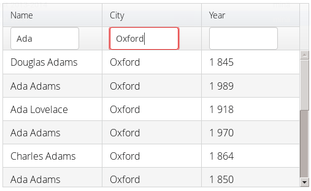

The filtering illustrated in ? can be created as follows:



// Have a filterable container
IndexedContainer container = exampleDataSource();

// Create a grid bound to it
Grid grid = new Grid(container);
grid.setSelectionMode(SelectionMode.NONE);
grid.setWidth("500px");
grid.setHeight("300px");

// Create a header row to hold column filters
HeaderRow filterRow = grid.appendHeaderRow();

// Set up a filter for all columns
for (Object pid: grid.getContainerDataSource()
                     .getContainerPropertyIds()) {
    HeaderCell cell = filterRow.getCell(pid);

    // Have an input field to use for filter
    TextField filterField = new TextField();
    filterField.setColumns(8);

    // Update filter When the filter input is changed
    filterField.addTextChangeListener(change -> {
        // Can't modify filters so need to replace
        container.removeContainerFilters(pid);

        // (Re)create the filter if necessary
        if (! change.getText().isEmpty())
            container.addContainerFilter(
                new SimpleStringFilter(pid,
                    change.getText(), true, false));
    });
    cell.setComponent(filterField);
}



Sorting {#components.grid.sorting}
-------

A user can sort the data in a grid on a column by clicking the column
header. Clicking another time on the current sort column reverses the
sort direction. Clicking on other column headers while keeping the Shift
key pressed adds a secondary or more sort criteria.

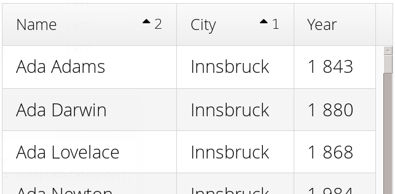

Defining sort criteria programmatically can be done with the various
alternatives of the sort() method. You can sort on a specific column
with sort(Object propertyId), which defaults to ascending sorting order,
or sort(Object propertyId, SortDirection direction), which allows
specifying the sort direction.

    grid.sort("name", SortDirection.DESCENDING);

To sort on multiple columns, you need to use the fluid sort API with
sort(Sort), which allows chaining sorting rules. Sorting rules are
created with the static by() method, which defines the primary sort
column, and then(), which can be used to specify any secondary sort
columns. They default to ascending sort order, but the sort direction
can be given with an optional parameter.

    // Sort first by city and then by name
    grid.sort(Sort.by("city", SortDirection.ASCENDING)
                  .then("name", SortDirection.DESCENDING));

The container data source must support sorting. At least, it must
implement Container.Sortable. Note that when using
`GeneratedPropertyContainer`, as described in ?, even though the
container implements the interface, the wrapped container must also
support it. Also, the generated properties are not normally sortable,
but require special handling to enable sorting.

Editing {#components.grid.editing}
-------

Grid supports line-based editing, where double-clicking a row opens the
row editor. In the editor, the input fields can be edited, as well as
navigated with Tab and Shift+Tab keys. The
editor has a Save button that commits the data item to the container
data source and closes the editor. If validation fails, an error is
displayed and the user can correct the inputs. A Cancel button discards
the changes and exits the editor.

To enable editing, you need to call setEditorEnabled(true) for the grid.

    Grid grid = new Grid(GridExample.exampleDataSource());
    grid.setEditorEnabled(true);

A row under editing is illustrated in ?.

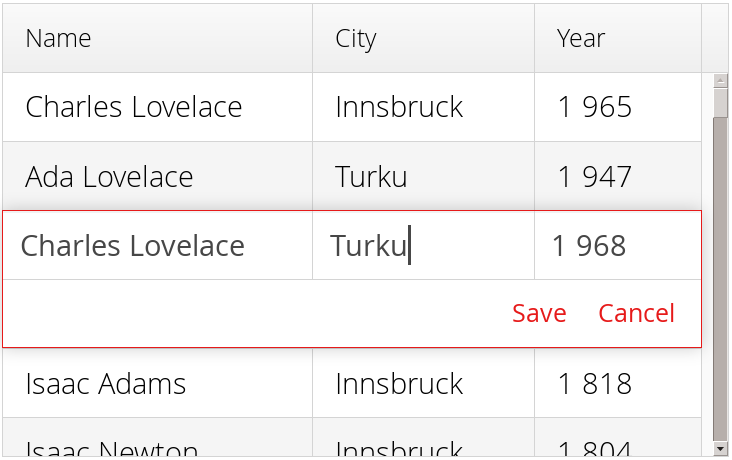

The editor fields are by default generated with a FieldFactory and bound
to the container data source with a `FieldGroup`, which also handles
tasks such as validation, as explained later.

### Customizing Editor Fields {#components.grid.editing.editorfields}

Te editor fields are normally created by the field factory of the
editor's field group, which creates the fields according to the data
types of their respective columns. To customize the editor fields of
specific properties, such as to style them or to set up validation, you
can provide them with setEditorField() in the respective columns.

Setting an editor field to `null` disables editing for the column.

In the following example, we configure a field with validation and
styling:

    TextField nameEditor = new TextField();

    // Custom CSS style
    nameEditor.addStyleName("nameeditor");

    // Custom validation
    nameEditor.addValidator(new RegexpValidator(
        "^\\p{Alpha}+ \\p{Alpha}+$",
        "Need first and last name"));

    grid.getColumn("name").setEditorField(nameEditor);

### Customizing Editor Buttons {#components.grid.editing.captions}

The editor has two buttons: Save and Cancel. You can set their captions
with setEditorSaveCaption() and setEditorCancelCaption(), respectively.

In the following example, we demonstrate one way to translate the
captions:

    // Captions are stored in a resource bundle
    ResourceBundle bundle = ResourceBundle.getBundle(
        MyAppCaptions.class.getName(),
        Locale.forLanguageTag("fi")); // Finnish

    // Localize the editor button captions
    grid.setEditorSaveCaption(
        bundle.getString(MyAppCaptions.SaveKey));
    grid.setEditorCancelCaption(
        bundle.getString(MyAppCaptions.CancelKey));

### Binding to Data with a Field Group {#components.grid.editing.fieldgroup}

Data binding to the item under editing is handled with a `FieldGroup`,
which you need to set with setEditorFieldGroup. This is mostly useful
when using special-purpose field groups, such as `BeanFieldGroup` to
enable bean validation.

For example, assuming that we want to enable bean validation for a bean
such as the following:

    public class Person implements Serializable {
        @NotNull
        @Size(min=2, max=10)
        private String name;

        @Min(1)
        @Max(130)
        private int age;
        ...]

We can now use a `BeanFieldGroup` in the `Grid` as follows:

    Grid grid = new Grid(exampleBeanDataSource());
    grid.setColumnOrder("name", "age");
    grid.setEditorEnabled(true);

    // Enable bean validation for the data
    grid.setEditorFieldGroup(
        new BeanFieldGroup<Person>(Person.class));

    // Have some extra validation in a field
    TextField nameEditor = new TextField();
    nameEditor.addValidator(new RegexpValidator(
        "^\\p{Alpha}+ \\p{Alpha}+$",
        "Need first and last name"));
    grid.setEditorField("name", nameEditor);

To use bean validation as in the example above, you need to include an
implementation of the Bean Validation API in the classpath, as described
in ?.

### Handling Validation Errors {#components.grid.editing.validation}

The input fields are validated when the save button is clicked. The
default error handler displays error indicators in the invalid fields,
as well as the first error in the editor.

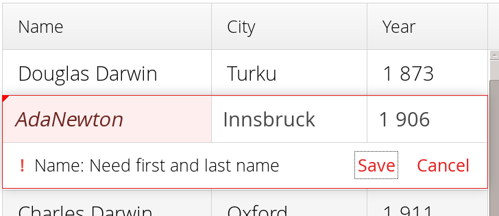

You can modify the error handling by implementing a custom
EditorErrorHandler or by extending the `DefaultEditorErrorHandler`.

###  {#components.grid.editing.fieldfactory}

The fields are generated by the `FieldFactory` of the field group; you
can also set it with setEditorFieldFactory(). Alternatively, you can
create the editor fields explicitly with setEditorField().

Programmatic Scrolling {#components.grid.scrolling}
----------------------

You can scroll to first item with scrollToStart(), to end with
scrollToEnd(), or to a specific row with scrollTo().

Generating Row or Cell Styles {#components.grid.stylegeneration}
-----------------------------

You can style entire rows with a RowStyleGenerator or individual cells
with a CellStyleGenerator.

### Generating Row Styles {#components.grid.stylegeneration.row}

You set a RowStyleGenerator to a grid with setRowStyleGenerator(). The
getStyle() method gets a `RowReference`, which contains various
information about the row and a reference to the grid, and should return
a style name or `null` if no style is generated.

For example, to add a style names to rows having certain values in one
column, you can style them as follows:

    grid.setRowStyleGenerator(rowRef -> {// Java 8
        if (! ((Boolean) rowRef.getItem()
                               .getItemProperty("alive")
                               .getValue()).booleanValue())
            return "grayed";
        else
            return null;
    });

You could then style the rows with CSS as follows:

    .v-grid-row.grayed {
        color: gray;
    }

### Generating Cell Styles {#components.grid.stylegeneration.cell}

You set a CellStyleGenerator to a grid with setCellStyleGenerator(). The
getStyle() method gets a `CellReference`, which contains various
information about the cell and a reference to the grid, and should
return a style name or `null` if no style is generated.

For example, to add a style name to a specific column, you can match on
the property ID of the column as follows:

    grid.setCellStyleGenerator(cellRef -> // Java 8
        "born".equals(cellRef.getPropertyId())?
            "rightalign" : null);

You could then style the cells with a CSS rule as follows:

    .v-grid-cell.rightalign {
        text-align: right;
    }

Styling with CSS {#components.grid.css}
----------------

    .v-grid {
      .v-grid-scroller, .v-grid-scroller-horizontal { }
      .v-grid-tablewrapper {
        .v-grid-header {
          .v-grid-row {
            .v-grid-cell, .frozen, .v-grid-cell-focused { }
          }
        }
        .v-grid-body {
          .v-grid-row,
          .v-grid-row-stripe,
          .v-grid-row-has-data {
            .v-grid-cell, .frozen, .v-grid-cell-focused { }
          }
        }
        .v-grid-footer {
          .v-grid-row {
            .v-grid-cell, .frozen, .v-grid-cell-focused { }
          }
        }
      }
      .v-grid-header-deco { }
      .v-grid-footer-deco { }
      .v-grid-horizontal-scrollbar-deco { }
      .v-grid-editor {
        .v-grid-editor-cells { }
        .v-grid-editor-footer {
          .v-grid-editor-message { }
          .v-grid-editor-buttons {
            .v-grid-editor-save { }
            .v-grid-editor-cancel { }
          }
        }
      }
    }

A `Grid` has an overall `v-grid` style. The actual grid has three parts:
a header, a body, and a footer. The scrollbar is a custom element with
`v-grid-scroller` style. In addition, there are some decoration
elements.

Grid cells, whether thay are in the header, body, or footer, have a
basic `v-grid-cell` style. Cells in a frozen column additionally have a
`frozen` style. Rows have `v-grid-row` style, and every other row has
additionally a `v-grid-row-stripe` style.

The focused row has additionally `v-grid-row-focused` style and focused
cell `v-grid-cell-focused`. By default, cell focus is visible, with the
border stylable with `$v-grid-cell-focused-border` parameter in Sass.
Row focus has no visible styling, but can be made visible with the
`$v-grid-row-focused-background-color` parameter or with a custom style
rule.

In editing mode, a `v-grid-editor` overlay is placed on the row under
editing. In addition to the editor field cells, it has an error message
element, as well as the buttons.

`MenuBar` {#components.menubar}
=========

The `MenuBar` component allows creating horizontal dropdown menus, much
like the main menu in desktop applications.

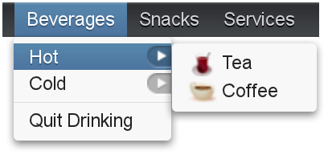

The actual menu bar component is first created as follows:

    MenuBar menubar = new MenuBar();
    main.addComponent(menubar);

You insert the top-level menu items to the `MenuBar` object with the
addItem() method. It takes a string label, an icon resource, and a
command as its parameters. The icon and command are not required and can
be `null`. The addItem() method returns a `MenuBar.MenuItem` object,
which you can use to add sub-menu items. The `MenuItem` has an identical
addItem() method.

For example (the command is explained later):

    // A top-level menu item that opens a submenu
    MenuItem drinks = barmenu.addItem("Beverages", null, null);

    // Submenu item with a sub-submenu
    MenuItem hots = drinks.addItem("Hot", null, null);
    hots.addItem("Tea",
        new ThemeResource("icons/tea-16px.png"),    mycommand);
    hots.addItem("Coffee",
        new ThemeResource("icons/coffee-16px.png"), mycommand);

    // Another submenu item with a sub-submenu
    MenuItem colds = drinks.addItem("Cold", null, null);
    colds.addItem("Milk",      null, mycommand);
    colds.addItem("Weissbier", null, mycommand);

    // Another top-level item
    MenuItem snacks = barmenu.addItem("Snacks", null, null);
    snacks.addItem("Weisswurst", null, mycommand);
    snacks.addItem("Bratwurst",  null, mycommand);
    snacks.addItem("Currywurst", null, mycommand);

    // Yet another top-level item
    MenuItem servs = barmenu.addItem("Services", null, null);
    servs.addItem("Car Service", null, mycommand);

Menu selection is handled by executing a *command* when the user selects
an item from the menu. A command is a call-back class that implements
the `MenuBar.Command` interface.

    // A feedback component
    final Label selection = new Label("-");
    main.addComponent(selection);

    // Define a common menu command for all the menu items.
    MenuBar.Command mycommand = new MenuBar.Command() {
        public void menuSelected(MenuItem selectedItem) {
            selection.setValue("Ordered a " +
                               selectedItem.getText() +
                               " from menu.");
        }  
    };

Menu items have properties such as a caption, icon, enabled, visible,
and description (tooltip). The meaning of these is the same as for
components.

Submenus are created by adding sub-items to an item with addItem() or
addItemBefore().

The *command* property is a `MenuBar.Command` that is called when the
particular menu item is selected. The menuSelected() callback gets the
clicked menu item as its parameter.

Menus can have *separators*, which are defined before or after an item
with addSeparatorBefore() or addSeparator() on the item, respectively.

    MenuItem drinks = barmenu.addItem("Beverages", null, null);
    ...

    // A sub-menu item after a separator
    drinks.addSeparator();
    drinks.addItem("Quit Drinking", null, null);

Enabling *checkable* on an menu item with setCheckable() allows the user
to switch between checked and unchecked state by clicking on the item.
You can set the checked state with setChecked(). Note that if such an
item has a command, the checked state is not flipped automatically, but
you need to do it explicitly.

Menu items have various other properties as well, see the API
documentation for more details.

    .v-menubar { }
      .v-menubar-submenu { }
        .v-menubar-menuitem { }
          .v-menubar-menuitem-caption { }
        .v-menubar-menuitem-selected { }
        .v-menubar-submenu-indicator { }

The menu bar has the overall style name `.v-menubar`. Each menu item has
`.v-menubar-menuitem` style normally and additionally
`.v-menubar-selected` when the item is selected, that is, when the mouse
pointer hovers over it. The item caption is inside a
`v-menubar-menuitem-caption`. In the top-level menu bar, the items are
directly under the component element.

Submenus are floating `v-menubar-submenu` elements outside the menu bar
element. Therefore, you should not try to match on the component element
for the submenu popups. In submenus, any further submenu levels are
indicated with a `v-menubar-submenu-indicator`.

You can set the CSS style name for the menu items with setStyleName(),
just like for components. The style name will be prepended with
`v-menubar-menuitem-`. As `MenuBar` does not indicate the previous
selection in any way, you can do that by highlighting the previously
selected item. However, beware that the `selected` style for menu items,
that is, `v-menubar-menuitem-selected`, is reserved for mouse-hover
indication.

    MenuBar barmenu = new MenuBar();
    barmenu.addStyleName("mybarmenu");
    layout.addComponent(barmenu);

    // A feedback component
    final Label selection = new Label("-");
    layout.addComponent(selection);

    // Define a common menu command for all the menu items
    MenuBar.Command mycommand = new MenuBar.Command() {
        MenuItem previous = null;

        public void menuSelected(MenuItem selectedItem) {
            selection.setValue("Ordered a " +
                    selectedItem.getText() +
                    " from menu.");

            if (previous != null)
                previous.setStyleName(null);
            selectedItem.setStyleName("highlight");
            previous = selectedItem;
        }  
    };

    // Put some items in the menu
    barmenu.addItem("Beverages", null, mycommand);
    barmenu.addItem("Snacks", null, mycommand);
    barmenu.addItem("Services", null, mycommand);

You could then style the highlighting in CSS as follows:

    .mybarmenu .v-menubar-menuitem-highlight {
        background: #000040; /* Dark blue */
    }

`Upload` {#components.upload}
========

The `Upload` component allows a user to upload files to the server. It
displays a file name entry box, a file selection button, and an upload
submit button. The user can either write the filename in the text area
or click the Browse button to select a file. After the file is selected,
the user sends the file by clicking the upload submit button.

Uploading requires a receiver that implements Upload.Receiver to provide
an output stream to which the upload is written by the server.

    Upload upload = new Upload("Upload it here", receiver);

You can set the text of the upload button with setButtonCaption(). Note
that it is difficult to change the caption or look of the Browse button.
This is a security feature of web browsers. The language of the Browse
button is determined by the browser, so if you wish to have the language
of the `Upload` component consistent, you will have to use the same
language in your application.

    upload.setButtonCaption("Upload Now");

You can also hide the upload button with
`.v-upload .v-button {display: none}` in theme, have custom logic for
starting the upload, and call startUpload() to start it. If the upload
component has setImmediate(true) enabled, uploading starts immediately
after choosing the file.

The uploaded files are typically stored as files in a file system, in a
database, or as temporary objects in memory. The upload component writes
the received data to an `java.io.OutputStream` so you have plenty of
freedom in how you can process the upload content.

To use the `Upload` component, you need to implement the
`Upload.Receiver` interface. The receiveUpload() method of the receiver
is called when the user clicks the submit button. The method must return
an `OutputStream`. To do this, it typically creates a file or a memory
buffer to which the stream is written. The method gets the file name and
MIME type of the file, as reported by the browser.

While uploading, the upload progress can be monitored with an
Upload.ProgressListener. The updateProgress() method gets the number of
read bytes and the content length as parameters. The content length is
reported by the browser, is not reliable, and may be -1 if unknown. It
is therefore recommended to follow the upload progress and check the
allowed size in a progress listener. Upload can be terminated by calling
interruptUpload() on the upload component. You may want to use a
`ProgressBar` to visualize the progress, and in indeterminate mode if
the content length is not known.

When an upload is finished, successfully or unsuccessfully, the `Upload`
component will emit the `Upload.FinishedEvent` event, which you can
handle with an `Upload.FinishedListener` added to the upload component.
The event object will include the file name, MIME type, and final length
of the file. More specific `Upload.FailedEvent` and
`Upload.SucceededEvent` events will be called in the cases where the
upload failed or succeeded, respectively.

The following example uploads images to `/tmp/uploads` directory in
(UNIX) filesystem (the directory must exist or the upload fails). The
component displays the uploaded image in an `Image` component.

    // Show uploaded file in this placeholder
    final Embedded image = new Embedded("Uploaded Image");
    image.setVisible(false);

    // Implement both receiver that saves upload in a file and
    // listener for successful upload
    class ImageUploader implements Receiver, SucceededListener {
        public File file;

        public OutputStream receiveUpload(String filename,
                                          String mimeType) {
            // Create upload stream
            FileOutputStream fos = null; // Stream to write to
            try {
                // Open the file for writing.
                file = new File("/tmp/uploads/" + filename);
                fos = new FileOutputStream(file);
            } catch (final java.io.FileNotFoundException e) {
                new Notification("Could not open file ",
                                 e.getMessage(),
                                 Notification.Type.ERROR_MESSAGE)
                    .show(Page.getCurrent());
                return null;
            }
            return fos; // Return the output stream to write to
        }

        public void uploadSucceeded(SucceededEvent event) {
            // Show the uploaded file in the image viewer
            image.setVisible(true);
            image.setSource(new FileResource(file));
        }
    };
    ImageUploader receiver = new ImageUploader();

    // Create the upload with a caption and set receiver later
    Upload upload = new Upload("Upload Image Here", receiver);
    upload.setButtonCaption("Start Upload");
    upload.addSucceededListener(receiver);

    // Put the components in a panel
    Panel panel = new Panel("Cool Image Storage");
    Layout panelContent = new VerticalLayout();
    panelContent.addComponents(upload, image);
    panel.setContent(panelContent);

Note that the example does not check the type of the uploaded files in
any way, which will cause an error if the content is anything else but
an image. The program also assumes that the MIME type of the file is
resolved correctly based on the file name extension. After uploading an
image, the component will look as shown in ?.

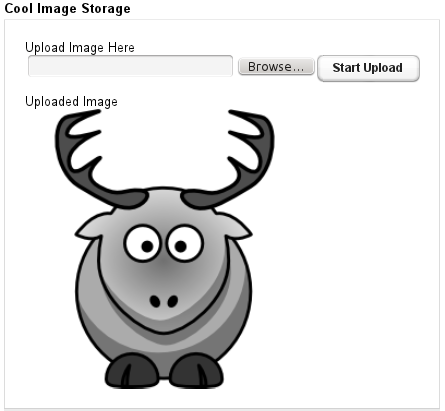

    .v-upload { }
      .gwt-FileUpload { }
      .v-button { }
        .v-button-wrap { }
          .v-button-caption { }

The `Upload` component has an overall `v-upload` style. The upload
button has the same structure and style as a regular `Button` component.

`ProgressBar` {#components.progressbar}
=============

The `ProgressBar` component allows displaying the progress of a task
graphically. The progress is specified as a floating-point value between
0.0 and 1.0.

To display upload progress with the `Upload` component, you can update
the progress bar in a ProgressListener.

When the position of a progress bar is done in a background thread, the
change is not shown in the browser immediately. You need to use either
polling or server push to update the browser. You can enable polling
with setPollInterval() in the current UI instance. See ? for
instructions about using server push. Whichever method you use to update
the UI, it is important to lock the user session by modifying the
progress bar value inside access() call, as illustrated in the following
example and described in ?.

    final ProgressBar bar = new ProgressBar(0.0f);
    layout.addComponent(bar);

    layout.addComponent(new Button("Increase",
        new ClickListener() {
        @Override
        public void buttonClick(ClickEvent event) {
            float current = bar.getValue();
            if (current < 1.0f)
                bar.setValue(current + 0.10f);
        }
    }));

In the indeterminate mode, a non-progressive indicator is displayed
continuously. The indeterminate indicator is a circular wheel in the
built-in themes. The progress value has no meaning in the indeterminate
mode.

    ProgressBar bar = new ProgressBar();
    bar.setIndeterminate(true);

The progress indicator is often used to display the progress of a heavy
server-side computation task, often running in a background thread. The
UI, including the progress bar, can be updated either with polling or by
using server push. When doing so, you must ensure thread-safety, most
easily by updating the UI inside a UI.access() call in a Runnable, as
described in ?.

In the following example, we create a thread in the server to do some
"heavy work" and use polling to update the UI. All the thread needs to
do is to set the value of the progress bar with setValue() and the
current progress is displayed automatically when the browser polls the
server.

    HorizontalLayout barbar = new HorizontalLayout();
    layout.addComponent(barbar);

    // Create the indicator, disabled until progress is started
    final ProgressBar progress = new ProgressBar(new Float(0.0));
    progress.setEnabled(false);
    barbar.addComponent(progress);

    final Label status = new Label("not running");
    barbar.addComponent(status);

    // A button to start progress
    final Button button = new Button("Click to start");
    layout.addComponent(button);

    // A thread to do some work
    class WorkThread extends Thread {
        // Volatile because read in another thread in access()
        volatile double current = 0.0;

        @Override
        public void run() {
            // Count up until 1.0 is reached
            while (current < 1.0) {
                current += 0.01;

                // Do some "heavy work"
                try {
                    sleep(50); // Sleep for 50 milliseconds
                } catch (InterruptedException e) {}

                // Update the UI thread-safely
                UI.getCurrent().access(new Runnable() {
                    @Override
                    public void run() {
                        progress.setValue(new Float(current));
                        if (current < 1.0)
                            status.setValue("" +
                                ((int)(current*100)) + "% done");
                        else
                            status.setValue("all done");
                    }
                });
            }

            // Show the "all done" for a while
            try {
                sleep(2000); // Sleep for 2 seconds
            } catch (InterruptedException e) {}

            // Update the UI thread-safely
            UI.getCurrent().access(new Runnable() {
                @Override
                public void run() {
                    // Restore the state to initial
                    progress.setValue(new Float(0.0));
                    progress.setEnabled(false);

                    // Stop polling
                    UI.getCurrent().setPollInterval(-1);

                    button.setEnabled(true);
                    status.setValue("not running");
                }
            });
        }
    }

    // Clicking the button creates and runs a work thread
    button.addClickListener(new Button.ClickListener() {
        public void buttonClick(ClickEvent event) {
            final WorkThread thread = new WorkThread();
            thread.start();

            // Enable polling and set frequency to 0.5 seconds
            UI.getCurrent().setPollInterval(500);

            // Disable the button until the work is done
            progress.setEnabled(true);
            button.setEnabled(false);

            status.setValue("running...");
        }
    });

The example is illustrated in ?.

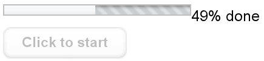

    .v-progressbar, v-progressbar-indeterminate {}
      .v-progressbar-wrapper {}
        .v-progressbar-indicator {}

The progress bar has a `v-progressbar` base style. The animation is the
background of the element with `v-progressbar-wrapper` style, by default
an animated GIF image. The progress is an element with
`v-progressbar-indicator` style inside the wrapper, and therefore
displayed on top of it. When the progress element grows, it covers more
and more of the animated background.

In the indeterminate mode, the top element also has the
`v-progressbar-indeterminate` style. The built-in themes simply display
the animated GIF in the top element and have the inner elements
disabled.

`Slider` {#components.slider}
========

The `Slider` is a vertical or horizontal bar that allows setting a
numeric value within a defined range by dragging a bar handle with the
mouse. The value is shown when dragging the handle.

`Slider` has a number of different constructors that take a combination
of the caption, *minimum* and *maximum* value, *resolution*, and the
*orientation* of the slider.

    // Create a vertical slider
    final Slider vertslider = new Slider(1, 100);
    vertslider.setOrientation(SliderOrientation.VERTICAL);

*min*

:   Minimum value of the slider range. The default is 0.0.

*max*

:   Maximum value of the slider range. The default is 100.0.

*resolution*

:   The number of digits after the decimal point. The default is 0.

*orientation*

:   The orientation can be either horizontal
    (`SliderOrientation.HORIZONTAL`) or vertical
    (`SliderOrientation.VERTICAL`). The default is horizontal.

As the `Slider` is a field component, you can handle value changes with
a `ValueChangeListener`. The value of the `Slider` field is a `Double`
object.

    // Shows the value of the vertical slider
    final Label vertvalue = new Label();
    vertvalue.setSizeUndefined();

    // Handle changes in slider value.
    vertslider.addValueChangeListener(
        new Property.ValueChangeListener() {
        public void valueChange(ValueChangeEvent event) {
            double value = (Double) vertslider.getValue();

            // Use the value
            box.setHeight((float) value, Sizeable.UNITS_PERCENTAGE);
            vertvalue.setValue(String.valueOf(value));
        }
    });

    // The slider has to be immediate to send the changes
    // immediately after the user drags the handle.
    vertslider.setImmediate(true);

You can set the value with the setValue() method defined in `Slider`
that takes the value as a native double value. The setter can throw a
`ValueOutOfBoundsException`, which you must handle.

    // Set the initial value. This has to be set after the
    // listener is added if we want the listener to handle
    // also this value change.
    try {
        vertslider.setValue(50.0);
    } catch (ValueOutOfBoundsException e) {
    }

Alternatively, you can use the regular setValue(Object), which does not
do bounds checking.

? shows both vertical (from the code examples) and horizontal sliders
that control the size of a box. The slider values are displayed also in
separate labels.

    .v-slider {}
    .v-slider-base {}
    .v-slider-handle {}

The enclosing style for the `Slider` is `v-slider`. The slider bar has
style `v-slider-base`. Even though the handle is higher (for horizontal
slider) or wider (for vertical slider) than the bar, the handle element
is nevertheless contained within the slider bar element. The appearance
of the handle comes from a background image defined in the *background*
CSS property.

`Calendar` {#components.calendar}
==========

The `Calendar` component allows organizing and displaying calendar
events. The main features of the calendar include:

-   Monthly, weekly, and daily views
-   Two types of events: all-day events and events with a time range
-   Add events directly, from a
    Container
    , or with an event provider
-   Control the range of the visible dates
-   Selecting and editing date or time range by dragging
-   Drag and drop events to calendar
-   Support for localization and timezones

User interaction with the calendar elements, such as date and week
captions as well as events, is handled with event listeners. Also
date/time range selections, event dragging, and event resizing can be
listened by the server. The weekly view has navigation buttons to
navigate forward and backward in time. These actions are also listened
by the server. Custom navigation can be implemented using event
handlers, as described in ?.

The data source of a calendar can be practically anything, as its events
are queried dynamically by the component. You can bind the calendar to a
Vaadin container, or to any other data source by implementing an *event
provider*.

The `Calendar` has undefined size by default and you usually want to
give it a fixed or relative size, for example as follows.

    Calendar cal = new Calendar("My Calendar");
    cal.setWidth("600px");
    cal.setHeight("300px");

After creating the calendar, you need to set a time range for it, which
also controls the view mode, and set up the data source for calendar
events.

Date Range and View Mode {#components.calendar.daterange}
------------------------

The Vaadin Calendar has two types of views that are shown depending on
the date range of the calendar. The *weekly view* displays a week by
default. It can show anything between one to seven days a week, and is
also used as a single-day view. The view mode is determined from the
*date range* of the calendar, defined by a start and an end date.
Calendar will be shown in a *monthly view* when the date range is over
than one week (seven days) long. The date range is always calculated in
an accuracy of one millisecond.

The monthly view, shown in ?, can easily be used to control all types of
events, but it is best suited for events that last for one or more days.
You can drag the events to move them. In the figure, you can see two
longer events that are highlighted with a blue and green background
color. Other markings are shorter day events that last less than a 24
hours. These events can not be moved by dragging in the monthly view.

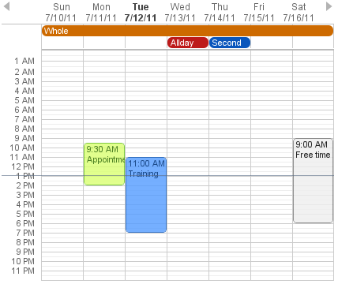

In ?, you can see four normal day events and also all-day events at the
top of the time line grid.

In the following, we set the calendar to show only one day, which is the
current day.

    cal.setStartDate(new Date());
    cal.setEndDate(new Date());

Notice that although the range we set above is actually zero time long,
the calendar still renders the time from 00:00 to 23:59. This is normal,
as the Vaadin Calendar is guaranteed to render at least the date range
provided, but may expand it. This behaviour is important to notice when
we implement our own event providers.

Calendar Events {#components.calendar.events}
---------------

All occurrences in a calendar are represented as *events*. You have
three ways to manage the calendar events:

-   Add events directly to the
    Calendar
    object using the
    addEvent()
-   Use a
    Container
    as a data source
-   Use the
    event provider
    mechanism

You can add events with addEvent() and remove them with the
removeEvent(). These methods will use the underlying event provider to
write the modifications to the data source.

### Event Interfaces and Providers {#components.calendar.events.types}

Events are handled though the CalendarEvent interface. The concrete
class of the event depends on the specific `CalendarEventProvider` used
in the calendar.

By default, `Calendar` uses a `BasicEventProvider` to provide events,
which uses `BasicEvent` instances.

Calendar does not depend on any particular data source implementation.
Events are queried by the `Calendar` from the provider that just has to
implement the CalendarEventProvider interface. It is up to the event
provider that `Calendar` gets the correct events.

You can bind any Vaadin `Container` to a calendar, in which case a
`ContainerEventProvider` is used transparently. The container must be
ordered by start date and time of the events. See ? for basic
information about containers.

### Event Types {#components.calendar.events.details}

A calendar event requires a start time and an end time. These are the
only mandatory properties. In addition, an event can also be set as an
all-day event by setting the `all-day` property of the event. You can
also set the `description` of an event, which is displayed as a tooltip
in the user interface.

If the `all-day` field of the event is `true`, then the event is always
rendered as an all-day event. In the monthly view, this means that no
start time is displayed in the user interface and the event has an
colored background. In the weekly view, all-day events are displayed in
the upper part of the screen, and rendered similarly to the monthly
view. In addition, when the time range of an event is 24 hours or
longer, it is rendered as an all-day event in the monthly view.

When the time range of an event is equal or less than 24 hours, with the
accuracy of one millisecond, the event is considered as a normal day
event. Normal event has a start and end times that may be on different
days.

### Basic Events {#components.calendar.events.basic}

The easiest way to add and manage events in a calendar is to use the
*basic event* management API. Calendar uses by default a
`BasicEventProvider`, which keeps the events in memory in an internal
reprensetation.

For example, the following adds a two-hour event starting from the
current time. The standard Java `GregorianCalendar` provides various
ways to manipulate date and time.

    // Add a two-hour event
    GregorianCalendar start = new GregorianCalendar();
    GregorianCalendar end   = new GregorianCalendar();
    end.add(java.util.Calendar.HOUR, 2);
    calendar.addEvent(new BasicEvent("Calendar study",
            "Learning how to use Vaadin Calendar",
            start.getTime(), end.getTime()));

This adds a new event that lasts for 3 hours. As the BasicEventProvider
and BasicEvent implement some optional event interfaces provided by the
calendar package, there is no need to refresh the calendar. Just create
events, set their properties and add them to the Event Provider.

Getting Events from a Container {#components.calendar.container}
-------------------------------

You can use any Vaadin Container that implements the Indexed interface
as the data source for calendar events. The `Calendar` will listen to
change events from the container as well as write changes to the
container. You can attach a container to a `Calendar` with
setContainerDataSource().

In the following example, we bind a `BeanItemContainer` that contains
built-in `BasicEvent` events to a calendar.

    // Create the calendar
    Calendar calendar = new Calendar("Bound Calendar");

    // Use a container of built-in BasicEvents
    final BeanItemContainer<BasicEvent> container =
        new BeanItemContainer<BasicEvent>(BasicEvent.class);

    // Create a meeting in the container
    container.addBean(new BasicEvent("The Event", "Single Event",
                new GregorianCalendar(2012,1,14,12,00).getTime(),
                new GregorianCalendar(2012,1,14,14,00).getTime()));

    // The container must be ordered by the start time. You
    // have to sort the BIC every time after you have added
    // or modified events.
    container.sort(new Object[]{"start"}, new boolean[]{true});

    calendar.setContainerDataSource(container, "caption",
        "description", "start", "end", "styleName");

The container must either use the default property IDs for event data,
as defined in the CalendarEvent interface, or provide them as parameters
for the setContainerDataSource() method, as we did in the example above.

### Keeping the Container Ordered {#components.calendar.container.sorting}

The events in the container *must* be kept ordered by their start
date/time. Failing to do so may and will result in the events not
showing in the calendar properly.

Ordering depends on the container. With some containers, such as
`BeanItemContainer`, you have to sort the container explicitly every
time after you have added or modified events, usually with the sort()
method, as we did in the example above. Some container, such as
`JPAContainer`, keep the in container automatically order if you provide
a sorting rule.

For example, you could order a `JPAContainer` by the following rule,
assuming that the start date/time is held in the `startDate` property:

    // The container must be ordered by start date. For JPAContainer
    // we can just set up sorting once and it will stay ordered.
    container.sort(new String[]{"startDate"}, new boolean[]{true});

### Delegation of Event Management {#components.calendar.container.customization}

Setting a container as the calendar data source with
setContainerDataSource() automatically switches to
`ContainerEventProvider`. You can manipulate the event data through the
API in `Calendar` and the user can move and resize event through the
user interface. The event provider delegates all such calendar
operations to the container.

If you add events through the `Calendar` API, notice that you may be
unable to create events of the type held in the container or adding them
requires some container-specific operations. In such case, you may need
to customize the addEvent() method.

For example, `JPAContainer` requires adding new items with addEntity().
You could first add the entity to the container or entity manager
directly and then pass it to the addEvent(). That does not, however,
work if the entity class does not implement CalendarEvent. This is
actually the case always if the property names differ from the ones
defined in the interface. You could handle creating the underlying
entity objects in the addEvent() as follows:

    // Create a JPAContainer
    final JPAContainer<MyCalendarEvent> container =
        JPAContainerFactory.make(MyCalendarEvent.class,
                                 "book-examples");

    // Customize the event provider for adding events
    // as entities
    ContainerEventProvider cep =
            new ContainerEventProvider(container) {
        @Override
        public void addEvent(CalendarEvent event) {
            MyCalendarEvent entity = new MyCalendarEvent(
                event.getCaption(), event.getDescription(),
                event.getStart(), event.getEnd(),
                event.getStyleName());
            container.addEntity(entity);
        }
    }

    // Set the container as the data source
    calendar.setEventProvider(cep);

    // Now we can add events to the database through the calendar
    BasicEvent event = new BasicEvent("The Event", "Single Event",
        new GregorianCalendar(2012,1,15,12,00).getTime(),
        new GregorianCalendar(2012,1,15,14,00).getTime());
    calendar.addEvent(event);

Implementing an Event Provider {#components.calendar.eventprovider}
------------------------------

If the two simple ways of storing and managing events for a calendar are
not enough, you may need to implement a custom event provider. It is the
most flexible way of providing events. You need to attach the event
provider to the `Calendar` using the setEventProvider() method.

Event queries are done by asking the event provider for all the events
between two given dates. The range of these dates is guaranteed to be at
least as long as the start and end dates set for the component. The
component can, however, ask for a longer range to ensure correct
rendering. In particular, all start dates are expanded to the start of
the day, and all end dates are expanded to the end of the day.

### Custom Events {#components.calendar.eventprovider.customevents}

An event provider could use the built-in `BasicEvent`, but it is usually
more proper to define a custom event type that is bound directly to the
data source. Custom events may be useful for some other purposes as
well, such as when you need to add extra information to an event or
customize how it is acquired.

Custom events must implement the CalendarEvent interface or extend an
existing event class. The built-in `BasicEvent` class should serve as a
good example of implementing simple events. It keeps the data in member
variables.

    public class BasicEvent
           implements CalendarEventEditor, EventChangeNotifier {
       ...

       public String getCaption() {
            return caption;
        }

        public String getDescription() {
            return description;
        }

        public Date getEnd() {
            return end;
        }

        public Date getStart() {
            return start;
        }

        public String getStyleName() {
            return styleName;
        }

        public boolean isAllDay() {
            return isAllDay;
        }

        public void setCaption(String caption) {
            this.caption = caption;
            fireEventChange();
        }

        public void setDescription(String description) {
            this.description = description;
            fireEventChange();
        }

        public void setEnd(Date end) {
            this.end = end;
            fireEventChange();
        }

        public void setStart(Date start) {
            this.start = start;
            fireEventChange();
        }

        public void setStyleName(String styleName) {
            this.styleName = styleName;
            fireEventChange();
        }

        public void setAllDay(boolean isAllDay) {
            this.isAllDay = isAllDay;
            fireEventChange();
        }

        public void addEventChangeListener(
                EventChangeListener listener) {
            ...
        }

        public void removeListener(EventChangeListener listener) {
            ...
        }

        protected void fireEventChange() {...}
    }

You may have noticed that there was some additional code in the
`BasicEvent` that was not in the CalendarEvent interface. Namely
`BasicEvent` also implements two additional interfaces:

CalendarEditor

:   This interface defines setters for all the fields, and is required
    for some of the default handlers to work.

EventChangeNotifier

:   This interface adds the possibility to listen for changes in the
    event, and enables the `Calendar` to render the changes immediately.

The start time and end time are mandatory, but caption, description, and
style name are not. The style name is used as a part of the CSS class
name for the HTML DOM element of the event.

In addition to the basic event interfaces, you can enhance the
functionality of your event and event provider classes by using the
`EventChange` and `EventSetChange` events. They let the `Calendar`
component to know about changes in events and update itself accordingly.
The `BasicEvent` and `BasicEventProvider` examples given earlier include
a simple implementation of these interfaces.

### Implementing the Event Provider {#components.calendar.eventprovider.eventprovider}

An event provider needs to implement the CalendarEventProvider
interface. It has only one method to be implemented. Whenever the
calendar is painted, getEvents(Date, Date) method is called and it must
return a list of events between the given start and end time.

The following example implementation returns only one example event. The
event starts from the current time and is five hours long.

    public class MyEventProvider implements CalendarEventProvider{
        public List<Event> getEvents(Date startDate, Date endDate){
            List<Event> events = new ArrayList<Event>();
            GregorianCalendar cal = new GregorianCalendar();
            cal.setTime(new Date());

            Date start = cal.getTime();
            cal.add(GregorianCalendar.HOUR, 5);
            Date end = cal.getTime();
            BasicEvent event = new BasicEvent();
            event.setCaption("My Event");
            event.setDescription("My Event Description");
            event.setStart(start);
            event.setEnd(end);
            events.add(event);

            return events;
        }
    }

It is important to notice that the `Calendar` may query for dates beyond
the range defined by start date and end date. Particularly, it may
expand the date range to make sure the user interface is rendered
correctly.

Styling a Calendar {#components.calendar.appearance}
------------------

Configuring the appearance of the Vaadin Calendar component is one of
the basic tasks. At the least, you need to consider its sizing in your
user interface. You also quite probably want to use some color or colors
for events.

### Sizing {#components.calendar.appearance.sizing}

The Calendar supports component sizing as usual for defined (fixed or
relative) sizes. When using an undefined size for the calendar, all the
sizes come from CSS. In addition, when the height is undefined, a
scrollbar is displayed in the weekly view to better fit the cells to the
user interface.

Below is a list of style rules that define the size of a Calendar with
undefined size (these are the defaults):

    .v-calendar-month-sizedheight .v-calendar-month-day {
        height: 100px;
    }

    .v-calendar-month-sizedwidth .v-calendar-month-day {
        width: 100px;
    }

    .v-calendar-header-month-Hsized .v-calendar-header-day {
        width: 101px;
    }

    /* for IE */
    .v-ie6 .v-calendar-header-month-Hsized .v-calendar-header-day {
        width: 104px;
    }

    /* for others */
    .v-calendar-header-month-Hsized td:first-child {
        padding-left: 21px;
    }

    .v-calendar-header-day-Hsized {
        width: 200px;
    }

    .v-calendar-week-numbers-Vsized .v-calendar-week-number {
        height: 100px;
        line-height: 100px;
    }

    .v-calendar-week-wrapper-Vsized {
        height: 400px;
        overflow-x: hidden !important;
    }

    .v-calendar-times-Vsized .v-calendar-time {
        height: 38px;
    }

    .v-calendar-times-Hsized .v-calendar-time {
        width: 42px;
    }

    .v-calendar-day-times-Vsized .v-slot,.v-calendar-day-times-Vsized .v-slot-even {
        height: 18px;
    }

    .v-calendar-day-times-Hsized, .v-calendar-day-times-Hsized .v-slot,.v-calendar-day-times-Hsized .v-slot-even {
        width: 200px;
    }

### Event Style {#components.calendar.appearance.event-style}

Events can be styled with CSS by setting them a *style name suffix*. The
suffix is retrieved with the getStyleName() method in CalendarEvent. If
you use `BasicEvent` events, you can set the suffix with setStyleName().

    BasicEvent event = new BasicEvent("Wednesday Wonder", ... );
    event.setStyleName("mycolor");
    calendar.addEvent(event);

Suffix `mycolor` would create `v-calendar-event-mycolor` class for
regular events and `v-calendar-event-mycolor-add-day` for all-day
events. You could style the events with the following rules:

    .v-calendar .v-calendar-event-mycolor {}
    .v-calendar .v-calendar-event-mycolor-all-day {}
    .v-calendar .v-calendar-event-mycolor .v-calendar-event-caption {}
    .v-calendar .v-calendar-event-mycolor .v-calendar-event-content {}

Visible Hours and Days {#components.calendar.visible-hours-days}
----------------------

As we saw in ?, you can set the range of dates that are shown by the
Calendar. But what if you wanted to show the entire month but hide the
weekends? Or show only hours from 8 to 16 in the weekly view? The
setVisibleDays() and setVisibleHours() methods allow you to do that.

    calendar.setVisibleDays(1,5);   // Monday to Friday
    calendar.setVisibleHours(0,15); // Midnight until 4 pm

After the above settings, only weekdays from Monday to Friday would be
shown. And when the calendar is in the weekly view, only the time range
from 00:00 to 16:00 would be shown.

Note that the excluded times are never shown so you should take care
when setting the date range. If the date range contains only dates /
times that are excluded, nothing will be displayed. Also note that even
if a date is not rendered because these settings, the event provider may
still be queried for events for that date.

Drag and Drop {#components.calendar.drag-and-drop}
-------------

Vaadin Calendar can act as a drop target for drag and drop, described in
?. With the functionality, the user could drag events, for example, from
a table to a calendar.

To support dropping, a `Calendar` must have a drop handler. When the
drop handler is set, the days in the monthly view and the time slots in
the weekly view can receive drops. Other locations, such as day names in
the weekly view, can not currently receive drops.

Calendar uses its own implementation of TargetDetails:
`CalendarTargetdetails`. It holds information about the the drop
location, which in the context of `Calendar` means the date and time.
The drop target location can be retrieved via the getDropTime() method.
If the drop is done in the monthly view, the returned date does not have
exact time information. If the drop happened in the weekly view, the
returned date also contains the start time of the slot.

Below is a short example of creating a drop handler and using the drop
information to create a new event:

    private Calendar createDDCalendar() {
      Calendar calendar = new Calendar();
      calendar.setDropHandler(new DropHandler() {
        public void drop(DragAndDropEvent event) {
          CalendarTargetDetails details =
                  (CalendarTargetDetails) event.getTargetDetails();

          TableTransferable transferable =
                  (TableTransferable) event.getTransferable();

          createEvent(details, transferable);
          removeTableRow(transferable);
        }

        public AcceptCriterion getAcceptCriterion() {
          return AcceptAll.get();
        }

      });

      return calendar;
    }

    protected void createEvent(CalendarTargetDetails details,
      TableTransferable transferable) {
      Date dropTime = details.getDropTime();
      java.util.Calendar timeCalendar = details.getTargetCalendar()
                                        .getInternalCalendar();
      timeCalendar.setTime(dropTime);
      timeCalendar.add(java.util.Calendar.MINUTE, 120);
      Date endTime = timeCalendar.getTime();

      Item draggedItem = transferable.getSourceComponent().
                                getItem(transferable.getItemId());

      String eventType = (String)draggedItem.
                                getItemProperty("type").getValue();

      String eventDescription = "Attending: "
                 + getParticipantString(
                     (String[]) draggedItem.
                       getItemProperty("participants").getValue());

      BasicEvent newEvent = new BasicEvent();
      newEvent.setAllDay(!details.hasDropTime());
      newEvent.setCaption(eventType);
      newEvent.setDescription(eventDescription);
      newEvent.setStart(dropTime);
      newEvent.setEnd(endTime);

      BasicEventProvider ep = (BasicEventProvider) details
                           .getTargetCalendar().getEventProvider();
      ep.addEvent(newEvent);
    }

Using the Context Menu {#components.calendar.contextmenu}
----------------------

Vaadin Calendar allows the use of context menu (mouse right-click) to
manage events. As in other context menus in Vaadin, the menu items are
handled in Vaadin as *actions* by an *action handler*. To enable a
context menu, you have to implement a Vaadin Action.Handler and add it
to the calendar with addActionHandler().

An action handler must implement two methods: getActions() and
handleAction(). The getActions() is called for each day displayed in the
calendar view. It should return a list of allowed actions for that day,
that is, the items of the context menu. The `target` parameter is the
context of the click - a `CalendarDateRange` that spans over the day.
The `sender` is the `Calendar` object.

The handleActions() receives the target context in the `target`. If the
context menu was opened on an event, the target is the Event object,
otherwise it is a `CalendarDateRange`.

Localization and Formatting {#components.calendar.localization}
---------------------------

### Setting the Locale and Time Zone {#components.calendar.localization.locale}

Month and weekday names are shown in the language of the locale setting
of the `Calendar`. The translations are acquired from the standard Java
locale data. By default, `Calendar` uses the system default locale for
its internal calendar, but you can change it with setLocale(Locale
locale). Setting the locale will update also other location specific
date and time settings, such as the first day of the week, time zone,
and time format. However, time zone and time format can be overridden by
settings in the `Calendar`.

For example, the following would set the language to US English:

    cal.setLocale(Locale.US);

The locale defines the default time zone. You can change it with the
setTimeZone() method, which takes a `java.util.TimeZone` object as its
parameter. Setting timezone to null will reset timezone to the locale
default.

For example, the following would set the Finnish time zone, which is EET

    cal.setTimeZone(TimeZone.getTimeZone("Europe/Helsinki"));

### Time and Date Caption Format {#components.calendar.localization.datecaption}

The time may be shown either in 24 or 12 hour format. The default format
is defined by the locale, but you can change it with the setTimeFormat()
method. Giving a `null` setting will reset the time format to the locale
default.

    cal.setTimeFormat(TimeFormat.Format12H);

You can change the format of the date captions in the week view with the
setWeeklyCaptionFormat(String dateFormatPattern) method. The date format
pattern should follow the format of the standard Java
`java.text.SimpleDateFormat` class.

For example:

    cal.setWeeklyCaptionFormat("dd-MM-yyyy");

Customizing the Calendar {#components.calendar.customizing}
------------------------

In this section, we give a tutorial for how to make various basic
customizations of the Vaadin Calendar. The event provider and styling
was described earlier, so now we concentrate on other features of the
Calendar API.

### Overview of Handlers {#components.calendar.customizing.overview}

Most of the handlers related to calendar events have sensible default
handlers. These are found in the com.vaadin.ui.handler package. The
default handlers and their functionalities are described below.

-   BasicBackwardHandler
    . Handles clicking the back-button of the weekly view so that the
    viewed month is changed to the previous one.
-   BasicForwardHandler
    . Handles clicking the forward-button of the weekly view so that the
    viewed month is changed to the next one.
-   BasicWeekClickHandler
    . Handles clicking the week numbers int the monthly view so that the
    viewable date range is changed to the clicked week.
-   BasicDateClickHandler
    . Handles clicking the dates on both the monthly view and the weekly
    view. Changes the viewable date range so that only the clicked day
    is visible.
-   BasicEventMoveHandler
    . Handles moving the events in both monthly view and the weekly
    view. Events can be moved and their start and end dates are changed
    correctly, but only if the event implements
    CalendarEventEditor
    (implemented by
    BasicEvent
    ).
-   BasicEventResizeHandler
    . Handles resizing the events in the weekly view. Events can be
    resized and their start and end dates are changed correctly, but
    only if the event implements
    CalendarEventEditor
    (implemented by the
    BasicEvent
    ).

All of these handlers are automatically set when creating a new
`Calendar`. If you wish to disable some of the default functionality,
you can simply set the corresponding handler to `null`. This will
prevent the functionality from ever appearing on the user interface. For
example, if you set the `EventMoveHandler` to `null`, the user will be
unable to move events in the browser.

### Creating a Calendar {#components.calendar.customizing.creating}

Let us first create a new `Calendar` instance. Here we use our own event
provider, the `MyEventProvider` described in ?.

    Calendar cal = new Calendar(new MyEventProvider());

This initializes the Calendar. To customize the viewable date range, we
must set a start and end date to it.

There is only one visible event in the timeline, starting from the
current time. That is what our event provider passes to the client.

It would be nice to also be able to control the navigation forward and
backward. The default navigation is provided by the default handlers,
but perhaps we want to restrict the users so they can only navigate
dates in the current year. Maybe we also want to pose some other
restrictions to the clicking week numbers and dates.

These restrictions and other custom logic can be defined with custom
handlers. You can find the handlers in the
com.vaadin.addon.calendar.ui.handler package and they can be easily
extended. Note that if you don not want to extend the default handlers,
you are free to implement your own. The interfaces are described in
CalendarComponentEvents.

Backward and Forward Navigation {#components.calendar.navigation}
-------------------------------

Vaadin Calendar has only limited built-in navigation support. The weekly
view has navigation buttons in the top left and top right corners.

You can handle backward and forward navigation with a BackwardListener
and ForwardListener.

    cal.setHandler(new BasicBackwardHandler() {
      protected void setDates(BackwardEvent event,
                              Date start, Date end) {

          java.util.Calendar calendar = event.getComponent()
                                        .getInternalCalendar();
          if (isThisYear(calendar, end)
               && isThisYear(calendar, start)) {
            super.setDates(event, start, end);
          }
      }});

The forward navigation handler can be implemented in the same way. The
example handler restricts the dates to the current year.

Date Click Handling {#components.calendar.dateclick}
-------------------

By default, clicking a date either in month or week view switches to
single-day view. The date click event is handled by a DateClickHandler.

The following example handles click events so that when the user clicks
the date header in the weekly view, it will switch to single-day view,
and in the single-day view switch back to the weekly view.

    cal.setHandler(new BasicDateClickHandler() {
      public void dateClick(DateClickEvent event) {
        Calendar cal = event.getComponent();
        long currentCalDateRange = cal.getEndDate().getTime()
                                   - cal.getStartDate().getTime();

        if (currentCalDateRange < VCalendar.DAYINMILLIS) {
          // Change the date range to the current week
          cal.setStartDate(cal.getFirstDateForWeek(event.getDate()));
          cal.setEndDate(cal.getLastDateForWeek(event.getDate()));

        } else {
          // Default behaviour, change date range to one day
          super.dateClick(event);
        }
      }
    });

Handling Week Clicks {#components.calendar.weekclick}
--------------------

The monthly view displays week numbers for each week row on the left
side of the date grid. The week number are clickable and you can handle
the click events by setting a WeekClickHandler for the `Calendar`
object. The default handler changes the date range to be the clicked
week.

In the following example, we add a week click handler that changes the
date range of the calendar to one week only if the start and end dates
of the week are in the current month.

    cal.setHandler(new BasicWeekClickHandler() {
        protected void setDates(WeekClick event,
                              Date start, Date end) {
            java.util.Calendar calendar = event.getComponent()
                                      .getInternalCalendar();
            if (isThisMonth(calendar, start)
                && isThisMonth(calendar,  end)) {
                super.setDates(event, start, end);
            }
        }
    });

Handling Event Clicks {#components.calendar.eventclick}
---------------------

The calendar events in all views are are clickable. There is no default
handler. Just like the date and week click handlers, event click
handling is enabled by setting an EventClickHandler for the `Calendar`
object.

You can get hold of the clicked event by the getCalendarEvent() method
in the `EventClick` object passed to the handler, as shown in the
following example.

    cal.setHandler(new EventClickHandler() {
        public void eventClick(EventClick event) {
            BasicEvent e = (BasicEvent) event.getCalendarEvent();

            // Do something with it
            new Notification("Event clicked: " + e.getCaption(),
                e.getDescription()).show(Page.getCurrent());
        }
    });

Event Dragging {#components.calendar.eventdrag}
--------------

The user can drag an event to change its position in time. The default
handler sets the start and end time of the event accordingly. You can do
many things with a custom move handler, such as restrict moving events.

In the following example, we add a EventMoveHandler to a `Calendar`. The
event handler updates the new position to the datasource, but only if
the new dates are in the current month. This requires making some
changes to the event provider class.

    cal.setHandler(new BasicEventMoveHandler() {
      private java.util.Calendar javaCalendar;

      public void eventMove(MoveEvent event) {
        javaCalendar = event.getComponent().getInternalCalendar();
        super.eventMove(event);
      }

      protected void setDates(CalendarEventEditor event,
                              Date start, Date end) {
        if (isThisMonth(javaCalendar, start)
            && isThisMonth(javaCalendar, end)) {
          super.setDates(event, start, end);
        }
      }
    });

For the above example to work, the example event provider presented
earlier needs to be changed slightly so that it doesn't always create a
new event when getEvents() is called.

    public static class MyEventProvider
                  implements CalendarEventProvider {
      private List<CalendarEvent> events =
            new ArrayList<CalendarEvent>();

      public MyEventProvider() {
        events = new ArrayList<CalendarEvent>();
        GregorianCalendar cal = new GregorianCalendar();
        cal.setTime(new Date());

        Date start = cal.getTime();
        cal.add(GregorianCalendar.HOUR, 5);
        Date end = cal.getTime();
        BasicEvent event = new BasicEvent();
        event.setCaption("My Event");
        event.setDescription("My Event Description");
        event.setStart(start);
        event.setEnd(end);
        events.add(event);
      }

      public void addEvent(CalendarEvent BasicEvent) {
        events.add(BasicEvent);
      }

      public List<CalendarEvent> getEvents(Date startDate,
                                           Date endDate) {
        return events;
      }
    }

After these changes, the user can move events around as earlier, but
dropping an event, the start and end dates are checked by the server.
Note that as the server-side must move the event in order for it to
render to the place it was dropped. The server can also reject moves by
not doing anything when the event is received.

Handling Drag Selection {#components.calendar.dragselection}
-----------------------

Drag selection works both in the monthly and weekly views. To listen for
drag selection, you can add a RangeSelectListener to the `Calendar`.
There is no default handler for range select.

In the code example below, we create an new event when any date range is
selected. Drag selection opens a window where the user is asked for a
caption for the new event. After confirming, the new event is be passed
to the event provider and calendar is updated. Note that as our example
event provider and event classes do not implement the event change
interface, we must refresh the `Calendar` manually after changing the
events.

    cal.setHandler(new RangeSelectHandler() {
      public void rangeSelect(RangeSelectEvent event) {
        BasicEvent calendarEvent = new BasicEvent();
        calendarEvent.setStart(event.getStart());
        calendarEvent.setEnd(event.getEnd());

        // Create popup window and add a form in it.
        VerticalLayout layout = new VerticalLayout();
        layout.setMargin(true);
        layout.setSpacing(true);

        final Window w = new Window(null, layout);
        ...

        // Wrap the calendar event to a BeanItem
        // and pass it to the form
        final BeanItem<CalendarEvent> item =
                             new BeanItem<CalendarEvent>(myEvent);

        final Form form = new Form();
        form.setItemDataSource(item);
        ...

        layout.addComponent(form);

        HorizontalLayout buttons = new HorizontalLayout();
        buttons.setSpacing(true);
        buttons.addComponent(new Button("OK", new ClickListener() {

            public void buttonClick(ClickEvent event) {
                form.commit();

                // Update event provider's data source
                provider.addEvent(item.getBean());

                UI.getCurrent().removeWindow(w);
            }
        }));

        ...
      }
    });

Resizing Events {#components.calendar.eventresizing}
---------------

The user can resize an event by dragging from both ends to change its
start or end time. This offers a convenient way to change event times
without the need to type anything. The default resize handler sets the
start and end time of the event according to the resize.

In the example below, we set a custom handler for resize events. The
handler prevents any event to be resized over 12 hours in length. Note
that this does not prevent the user from resizing an event over 12 hours
in the client. The resize will just be corrected by the server.

    cal.setHandler(new BasicEventResizeHandler() {
      private static final long twelveHoursInMs = 12*60*60*1000;

      protected void setDates(CalendarEventEditor event,
                              Date start, Date end) {
        long eventLength = end.getTime() - start.getTime();
        if (eventLength <= twelveHoursInMs) {
          super.setDates(event, start, end);
        }
      }
    });

Composition with `CustomComponent` {#components.customcomponent}
==================================

The ease of making new user interface components is one of the core
features of Vaadin. Typically, you simply combine existing built-in
components to produce composite components. In many applications, such
composite components make up the majority of the user interface.

As described earlier in ?, you have two basic ways to create a
composite - either by using a layout component or the `CustomComponent`,
which typically wraps around a layout component. The benefit of wrapping
a layout composite in `CustomComponent` is mainly encapsulation - hiding
the implementation details of the composition. Otherwise, a user of the
composite might rely on the internal implementation details, such as the
layout class.

To create a composite, you need to inherit the `CustomComponent` and set
the *composition root* component in the constructor. The composition
root is typically a layout component that contains other components.

For example:

    class MyComposite extends CustomComponent {
        public MyComposite(String message) {
            // A layout structure used for composition
            Panel panel = new Panel("My Custom Component");
            panel.setContent(new VerticalLayout());

            // Compose from multiple components
            Label label = new Label(message);
            label.setSizeUndefined(); // Shrink
            panel.addComponent(label);
            panel.addComponent(new Button("Ok"));

            // Set the size as undefined at all levels
            panel.getContent().setSizeUndefined();
            panel.setSizeUndefined();
            setSizeUndefined();

            // The composition root MUST be set
            setCompositionRoot(panel);
        }
    }

Take note of the sizing when trying to make a customcomponent that
shrinks to fit the contained components. You have to set the size as
undefined at all levels; the sizing of the composite component and the
composition root are separate.

You can use the component as follows:

    MyComposite mycomposite = new MyComposite("Hello");

The rendered component is shown in ?.

You can also inherit any other components, such as layouts, to attain
similar composition. Google Web Toolkit Even further, you can create
entirely new low-level components, by integrating pure client-side
components or by extending the client-side functionality of built-in
components. Development of new components is covered in ?.

Composite Fields with `CustomField` {#components.customfield}
===================================

The `CustomField` is a way to create composite components like with
`CustomComponent`, except that it implements the Field interface and
inherit `AbstractField`, described in ?. A field allows editing a
property value in the Vaadin data model, and can be bound to data with
field groups, as described in ?. The field values are buffered and can
be validated with validators.

A composite field class must implement the getType() and initContent()
methods. The latter should return the content composite of the field. It
is typically a layout component, but can be any component.

It is also possible to override validate(), setInternalValue(),
commit(), setPropertyDataSource, isEmpty() and other methods to
implement different functionalities in the field. Methods overriding
setInternalValue() should call the superclass method.

Embedded Resources {#components.embedded}
==================

You can embed images in Vaadin UIs with the `Image` component, Adobe
Flash graphics with `Flash`, and other web content with `BrowserFrame`.
There is also a generic `Embedded` component for embedding other object
types. The embedded content is referenced as *resources*, as described
in ?.

The following example displays an image as a class resource loaded with
the class loader:

    Image image = new Image("Yes, logo:",
        new ClassResource("vaadin-logo.png"));
    main.addComponent(image);

The caption can be given as null to disable it. An empty string displays
an empty caption which takes a bit space. The caption is managed by the
containing layout.

You can set an altenative text for an embedded resource with
setAlternateText(), which can be shown if images are disabled in the
browser for some reason. The text can be used for accessibility
purposes, such as for text-to-speech generation.

Embedded `Image` {#components.embedded.image}
----------------

The `Image` component allows embedding an image resource in a Vaadin UI.

    // Serve the image from the theme
    Resource res = new ThemeResource("img/myimage.png");

    // Display the image without caption
    Image image = new Image(null, res);
    layout.addComponent(image);

The `Image` component has by default undefined size in both directions,
so it will automatically fit the size of the embedded image. scroll bars
If you want scrolling with scroll bars, you can put the image inside a
`Panel` that has a defined size to enable scrolling, as described in ?.
You can also put it inside some other component container and set the
`overflow:
                auto` CSS property for the container element in a theme
to enable automatic scrollbars. overflow CSS property

### Generating and Reloading Images {#components.embedded.image.generated}

You can also generate the image content dynamically using a
`StreamResource`, as described in ?, or with a `RequestHandler`.

If the image changes, the browser needs to reload it. Simply updating
the stream resource is not enough. Because of how caching is handled in
some browsers, you can cause a reload easiest by renaming the filename
of the resource with a unique name, such as one including a timestamp.
You should set cache time to zero with setCacheTime() for the resource
object when you create it.

    // Create the stream resource with some initial filename
    StreamResource imageResource =
        new StreamResource(imageSource, "initial-filename.png");

    // Instruct browser not to cache the image
    imageResource.setCacheTime(0);

    // Display the image
    Image image = new Image(null, imageResource);

When refreshing, you also need to call markAsDirty() for the `Image`
object.

    // This needs to be done, but is not sufficient
    image.markAsDirty();

    // Generate a filename with a timestamp
    SimpleDateFormat df = new SimpleDateFormat("yyyyMMddHHmmssSSS");
    String filename = "myfilename-" + df.format(new Date()) + ".png";

    // Replace the filename in the resource
    imageResource.setFilename(makeImageFilename());

Adobe `Flash` Graphics {#components.embedded.flash}
----------------------

The `Flash` component allows embedding Adobe Flash animations in Vaadin
UIs.

    Flash flash = new Flash(null,
        new ThemeResource("img/vaadin_spin.swf"));
    layout.addComponent(flash);

You can set Flash parameters with setParameter(), which takes a
parameter's name and value as strings. You can also set the `codeBase`,
`archive`, and `standBy` attributes for the Flash object element in
HTML.

`BrowserFrame` {#components.embedded.browserframe}
--------------

The `BrowserFrame` allows embedding web content inside an HTML
\<iframe\> element. You can refer to an external URL with
`ExternalResource`.

As the `BrowserFrame` has undefined size by default, it is critical that
you define a meaningful size for it, either fixed or relative.

    BrowserFrame browser = new BrowserFrame("Browser",
        new ExternalResource("http://demo.vaadin.com/sampler/"));
    browser.setWidth("600px");
    browser.setHeight("400px");
    layout.addComponent(browser);

Notice that web pages can prevent embedding them in an \<iframe\>.

Generic `Embedded` Objects {#components.embedded.embedded}
--------------------------

The generic `Embedded` component allows embedding all sorts of objects,
such as SVG graphics, Java applets, and PDF documents, in addition to
the images, Flash graphics, and browser frames which you can embed with
the specialized components.

For example, to display a Flash animation:

    // A resource reference to some object
    Resource res = new ThemeResource("img/vaadin_spin.swf");

    // Display the object
    Embedded object = new Embedded("My Object", res);
    layout.addComponent(object);

Or an SVG image:

    // A resource reference to some object
    Resource res = new ThemeResource("img/reindeer.svg");

    // Display the object
    Embedded object = new Embedded("My SVG", res);
    object.setMimeType("image/svg+xml"); // Unnecessary
    layout.addComponent(object);

The MIME type of the objects is usually detected automatically from the
filename extension with the `FileTypeResolver` utility in Vaadin. If
not, you can set it explicitly with setMimeType(), as was done in the
example above (where it was actually unnecessary).

Some embeddable object types may require special support in the browser.
You should make sure that there is a proper fallback mechanism if the
browser does not support the embedded type.
