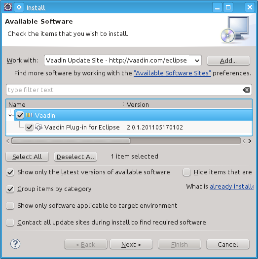

Getting Started with Vaadin {#getting-started}
===========================

This chapter gives practical instructions for installing the recommended
toolchain, the Vaadin libraries and its dependencies, and creating a new
Vaadin project.

Overview {#getting-started.overview}
========

You can develop Vaadin applications in essentially any development
environment that has the Java SDK and a Java Servlet container. Vaadin
has special support for the Eclipse and NetBeans IDEs, but community
support exists also for IntelliJ IDEA. You can use it with any Java IDE
or no IDE at all.

Managing Vaadin and other Java libraries can get tedious to do manually,
so using a build system that manages dependencies automatically is
adviced. Vaadin is distributed in the Maven central repository, and can
be used with any build or dependency management system that can access
Maven repository, such as Ivy or Gradle, in addition to Maven.

Vaadin has a multitude of installation options for different IDEs,
dependency managers, and you can also install it from an installation
package:

-   With the Eclipse IDE, use the Vaadin Plugin for Eclipse, as
    described in
-   With the Vaadin plugin for NetBeans IDE (
    ) or IntelliJ IDEA
-   With Maven, Ivy, Gradle, or other Maven-compatible dependency
    manager, under Eclipse, NetBeans, IDEA, or using command-line, as
    described in
-   From installation package without dependency management, as
    described in

Setting up the Development Environment {#getting-started.environment}
======================================

This section guides you step-by-step in setting up a reference
development environment. Vaadin supports a wide variety of tools, so you
can use any IDE for writing the code, almost any Java web server for
deploying the application, most web browsers for using it, and any
operating system platform supported by Java.

In this example, we use the following toolchain:

-   Windows, Linux, or Mac OS X
-   Oracle Java SE 8
    (Java 6 or newer is required)
-   Eclipse IDE for Java EE Developers
-   Apache Tomcat 8.0 (Core)
-   Mozilla Firefox
    browser
-   Firebug
    debug tool (optional)
-   Vaadin Framework

The above reference toolchain is a good choice of tools, but you can use
almost any tools you are comfortable with.

We recommend using Java 8 for Vaadin development, but you need to make
sure that your entire toolchain supports it. A server supporting Servlet
3.0 is recommended. It is required for using Vaadin CDI, for which also
a CDI container is required, a standard feature in Java EE 6 or newer
servers. Server push can benefit from using communication modes, such as
WebSocket, enabled by features in some latest servers. For Java EE
containers, at least Wildfly, Glassfish, and Apache TomEE Web Profile
are recommended.

? illustrates the development toolchain. You develop your application as
an Eclipse project. The project must include, in addition to your source
code, the Vaadin libraries. It can also include project-specific themes.

You need to compile and deploy a project to a web container before you
can use it. You can deploy a project through the Web Tools Platform
(WTP) for Eclipse (included in the Eclipse EE package), which allows
automatic deployment of web applications from Eclipse. You can also
deploy a project manually, by creating a web application archive (WAR)
and deploying it to the web container.

Installing Java SDK {#getting-started.environment.java}
-------------------

Java SDK is required by Vaadin and also by the Eclipse IDE. Vaadin is
compatible with Java 1.6 and later editions. Java EE 7 is required for
proper server push support with WebSockets.

### Windows {#getting-started.environment.java.windows}

1.  Download Oracle Java SE 8.0 from
    [http://www.oracle.com/technetwork/java/javase/downloads/index.html](#)

2.  Install the Java SDK by running the installer. The default options
    are fine.

### Linux / UNIX {#getting-started.environment.linux}

Most Linux systems either have JDK preinstalled or allow installing it
through a package management system. Notice however that they have
OpenJDK as the default Java implementation. While it is known to have
worked with Vaadin and possibly also with the development toolchain, we
do not especially support it.

Regarding OS X, notice that JDK 1.6 or newer is included in OS X 10.6
and newer.

Otherwise:

1.  Download Oracle Java SE 8.0 from
    [http://www.oracle.com/technetwork/java/javase/downloads/](#)

2.  Decompress it under a suitable base directory, such as `/opt`. For
    example, for Java SDK, enter (either as root or with `sudo` in
    Linux):

        # cd /opt
        # sh (path-to-installation-package)/jdk-8u20-linux-x64.bin

    and follow the instructions in the installer.

3.  Set up the `JAVA_HOME` environment variable to point to the Java
    installation directory. Also, include the `$JAVA_HOME/bin` in the
    `PATH`. How you do that varies by the UNIX variant. For example, in
    Linux and using the Bash shell, you would add lines such as the
    following to the `.bashrc` or `.profile` script in your home
    directory:

        export JAVA_HOME=/opt/jdk1.8.0_20
        export PATH=$PATH:$HOME/bin:$JAVA_HOME/bin

    You could also make the setting system-wide in a file such as
    `/etc/bash.bashrc`, `/etc/profile`, or an equivalent file. If you
    install Apache Ant or Maven, you may also want to set up those in
    the path.

    Settings done in a `bashrc` file require that you open a new shell
    window. Settings done in a `profile` file require that you log in
    into the system. You can, of course, also give the commands in the
    current shell.

Installing Eclipse IDE {#getting-started.environment.eclipse}
----------------------

### Windows

1.  Download the Eclipse IDE for Java EE Developers from
    [http://www.eclipse.org/downloads/](#)

2.  Decompress the Eclipse IDE package to a suitable directory. You are
    free to select any directory and to use any ZIP decompressor, but in
    this example we decompress the ZIP file by just double-clicking it
    and selecting "Extract all files" task from Windows compressed
    folder task. In our installation example, we use `C:\dev` as the
    target directory.

Eclipse is now installed in `C:\dev\eclipse` and can be started from
there (by double clicking eclipse.exe).

### Linux / OS X / UNIX

We recommend that you install Eclipse manually in Linux and other UNIX
variants as follows.

1.  Download Eclipse IDE for Java EE Developers from
    [http://www.eclipse.org/downloads/](#)

2.  Decompress the Eclipse package into a suitable base directory. It is
    important to make sure that there is no old Eclipse installation in
    the target directory. Installing a new version on top of an old one
    probably renders Eclipse unusable.

3.  Eclipse should normally be installed as a regular user, as this
    makes installation of plugins easier. Eclipse also stores some user
    settings in the installation directory. To install the package,
    enter:

        $ tar zxf (path-to-installation-package)/eclipse-jee-ganymede-SR2-linux-gtk.tar.gz

    This will extract the package to a subdirectory with the name
    `eclipse`.

4.  If you wish to enable starting Eclipse from command-line, you need
    to add the Eclipse installation directory to your system or user
    PATH, or make a symbolic link or script to point to the executable.

An alternative to the above procedure would be to use an Eclipse version
available through the package management system of your operating
system. It is, however, *not recommended*, because you will need write
access to the Eclipse installation directory to install Eclipse plugins,
and you may face incompatibility issues with Eclipse plugins installed
by the package management of the operating system.

Installing Apache Tomcat {#getting-started.environment.tomcat}
------------------------

Apache Tomcat is a lightweight Java web server suitable for both
development and production. There are many ways to install it, but here
we simply decompress the installation package.

*Apache Tomcat should be installed with user permissions.* During
development, you will be running Eclipse or some other IDE with user
permissions, but deploying web applications to a Tomcat server that is
installed system-wide requires administrator or root permissions.

1.  Download the installation package:

    Apache Tomcat 8.0 (Core Binary Distribution) from
    <http://tomcat.apache.org/>

2.  Decompress Apache Tomcat package to a suitable target directory,
    such as `C:\dev` (Windows) or `/opt` (Linux or Mac OS X). The Apache
    Tomcat home directory will be `C:\dev\apache-tomcat-8.0.x` or
    `/opt/apache-tomcat-8.0.x`, respectively.

Firefox and Firebug {#getting-started.environment.firefox}
-------------------

Vaadin supports many web browsers and you can use any of them for
development. If you plan to create a custom theme, customized layouts,
or create new components, we recommend that you use either Firefox
together with Firebug or Google Chrome, which has built-in developer
tools similar to Firebug.

### Using Firebug with Vaadin {#getting-started.environment.firefox.firebug}

After installing Firefox, use it to open
[http://www.getfirebug.com/](#). Follow the instructions on the site to
install the latest stable version of Firebug available for the browser.
You may need to allow Firefox to install the plugin by clicking the
yellow warning bar at the top of the browser window.

After Firebug is installed, it can be enabled at any time from the
Firefox toolbar. ? shows Firebug in action.

The most important feature in Firebug is inspecting HTML elements.
Right-click on an element and select Inspect Element with Firebug to
inspect it. In addition to HTML tree, it also shows the CSS rules
matching the element, which you can use for building themes. You can
even edit the CSS styles live, to experiment with styling.

Overview of Vaadin Libraries {#getting-started.libraries}
============================

Vaadin comes as a set of library JARs, of which some are optional or
alternative ones, depending on whether you are developing server-side or
client-side applications, whether you use add-on components, or use CSS
or Sass themes.

`vaadin-server-VERSION.VAADIN.jar`

:   The main library for developing server-side Vaadin applications, as
    described in ?. It requires the `vaadin-shared` and the
    `vaadin-themes` libraries. You can use the prebuilt
    `vaadin-client-compiled` for server-side development, unless you
    need add-on components or custom widgets.

`vaadin-shared-VERSION.VAADIN.jar`

:   A shared library for server-side and client-side development. It is
    always needed.

`vaadin-client-VERSION.VAADIN.jar`

:   The client-side Vaadin framework, including the basic GWT API and
    Vaadin-specific widgets and other additions. It is required when
    using the `vaadin-client-compiler` to compile client-side modules.
    It is not needed if you just use the server-side framework with the
    precompiled Client-Side Engine. You should not deploy it with a web
    application.

`vaadin-client-compiler-VERSION.VAADIN.jar`

:   The Vaadin Client Compiler is a Java-to-JavaScript compiler that
    allows building client-side modules, such as the Client-Side Engine
    (widget set) required for server-side applications. The compiler is
    needed, for example, for compiling add-on components to the
    application widget set, as described in ?. For detailed information
    regarding the compiler, see ?. Note that you should not deploy this
    library with a web application.

`vaadin-client-compiled-VERSION.VAADIN.jar`

:   A precompiled Vaadin Client-Side Engine (widget set) that includes
    all the basic built-in widgets in Vaadin. This library is not needed
    if you compile the application widget set with the Vaadin Client
    Compiler.

`vaadin-themes-VERSION.VAADIN.jar`

:   Vaadin built-in themes both as SCSS source files and precompiled CSS
    files. The library is required both for basic use with CSS themes
    and for compiling custom Sass themes.

`vaadin-sass-compiler-1.x.x.jar`

:   The Vaadin Sass Compiler compiles Sass themes to CSS, as described
    in ?. It requires the `vaadin-themes-VERSION.VAADIN.jar` library,
    which contains the Sass sources for the built-in themes. The library
    needs to be included in deployment in development mode to allow
    on-the-fly compilation of themes, but it is not needed in production
    deployment, when the themes are compiled before deployment.

Some of the libraries depend on each other as well as on the dependency
libraries provided in the `lib` folder of the installation package,
especially the `lib/vaadin-shared-deps.jar`.

The different ways to install the libraries are described in the
subsequent sections.

Note that the `vaadin-client-compiler` and `vaadin-client` JARs should
not be deployed with the web application by including them in
`WEB-INF/lib`. Some other libraries, such as `vaadin-sass-compiler`, are
not needed in production deployment.

Installing Vaadin Plugin for Eclipse {#getting-started.eclipse}
====================================

If you are using the Eclipse IDE, using the Vaadin Plugin for Eclipse
helps greatly. Notice that you can also create Vaadin projects as Maven
projects in Eclipse.

The plugin includes:

-   *Wizards* for creating new Vaadin-based projects, themes, and
    client-side widgets and widget sets.

-   A *visual editor* for creating composite user interface components
    in a WYSIWYG fashion. With full round-trip support from source code
    to visual model and back, the editor integrates seamlessly with your
    development process.

Installing the IvyDE Plugin {#getting-started.eclipse.ivyde}
---------------------------

The Vaadin Plugin for Eclipse requires the Apache IvyDE plugin, which
needs to be installed manually in Eclipse before the Vaadin plugin.

1.  Select Help \> Install New
    Software....

2.  Add the IvyDE update site by clicking the Add... button.

    Enter a name such as "Apache Ivy Update Site" and the URL of the
    update site:

        http://www.apache.org/dist/ant/ivyde/updatesite

    Then click OK. The update site should now appear in the Available
    Software window.

3.  Select the new "Apache Ivy Update Site" from the Work with list.

4.  Select the Apache Ivy, Apache Ivy Ant Tasks, and Apache IvyDE
    plugins.

    

    The Apache IvyDE Resolve Visualizer is optional, and would require
    additional dependency plugins to be installed.

    Then, click Next.

5.  Review the installation details and click Next.

6.  Accept or unaccept the license. Finally, click Finish.

7.  Eclipse may warn about unsigned content. If you feel safe, click OK.

8.  After the plugin is installed, Eclipse will ask to restart itself.
    You can proceed to install the Vaadin plugin before the restart, as
    described in the following section, so you can answer Apply Changes
    Now.

Installing the Vaadin Plugin {#getting-started.eclipse.vaadin-plugin}
----------------------------

You can install the plugin as follows:

1.  Select Help \> Install New
    Software....

2.  Add the Vaadin plugin update site by clicking Add... button.

    

    Enter a name such as "Vaadin Update Site" and the URL of the update
    site: <http://vaadin.com/eclipse>. If you want or need to use the
    latest unstable plugin, which is usually more compatible with
    development and beta releases of Vaadin, you can use
    <http://vaadin.com/eclipse/experimental> and give it a distinctive
    name such as "Vaadin Experimental Site". Then click OK. The Vaadin
    site should now appear in the Available Software window.

3.  Currently, if using the stable plugin, the
    Group items by category
    should be enabled. If using the experimental plugin, it should be
    disabled. This may change in future.
4.  Select all the Vaadin plugins in the tree.

    

    Then, click Next.

5.  Review the installation details and click Next.

6.  Accept or unaccept the license. Finally, click Finish.

7.  After the plugin is installed, Eclipse will ask to restart itself.
    Click Restart.

If you use the visual editor, Eclipse must have the internal browser
enabled. Most operating system distributions include a suitable browser
engine, but if not, you may need to install one as described in ?.

More installation instructions for the Eclipse plugin can be found at
[http://vaadin.com/eclipse](#).

Updating the Plugins {#getting-started.eclipse.update}
--------------------

If you have automatic updates enabled in Eclipse (see Window \> Preferences \> Install/Update \> Automatic
Updates), the Vaadin plugin will be updated automatically along
with other plugins. Otherwise, you can update the Vaadin plugin manually
as follows:

1.  Select Help \> Check for Updates.
    Eclipse will contact the update sites of the installed software.

2.  After the updates are installed, Eclipse will ask to restart itself.
    Click Restart.

Notice that updating the Vaadin plugin updates only the plugin and *not*
the Vaadin libraries, which are project specific. See below for
instructions for updating the libraries.

Updating the Vaadin Libraries {#getting-started.eclipse.libraryupdate}
-----------------------------

Updating the Vaadin plugin does not update Vaadin libraries. The
libraries are project specific, as a different version might be required
for different projects, so you have to update them separately for each
project.

1.  Open the `ivy.xml` in an editor Eclipse.

2.  Edit the entity definition at the beginning of the file to set the
    Vaadin version.

        <!ENTITY vaadin.version "7.3.1">

    You can specify either a fixed version number, as shown in the above
    example, or a dynamic revision tag such as `latest.release`. You can
    find more information about the dependency declarations in Ivy
    documentation.

3.  Right-click the project and select Ivy \>
    Resolve.

    Updating the libraries can take several minutes. You can see the
    progress in the Eclipse status bar. You can get more details about
    the progress by clicking the indicator.

4.  If you have compiled the widget set for your project, recompile it
    by clicking the Compile Vaadin widgets button in Eclipse toolbar.

5.  Stop the integrated Tomcat (or other server) in Eclipse, clear its
    caches by right-clicking the server and selecting Clean as well as
    Clean Tomcat Work Directory, and restart it.

If you experience problems after updating the libraries, you can try
clearing the Ivy resolution caches by right-clicking the project and
selecting Ivy \> Clean all caches. Then,
do the Ivy \> Resolve and other tasks
again.

Creating and Running a Project with Eclipse {#getting-started.first-project}
===========================================

This section gives instructions for creating a new Eclipse project using
the Vaadin Plugin. The task will include the following steps:

1.  Create a new project

2.  Write the source code

3.  Configure and start Tomcat (or some other web server)

4.  Open a web browser to use the web application

We also show how you can debug the application in the debug mode in
Eclipse.

This walkthrough assumes that you have already installed the Vaadin
Plugin for Eclipse and set up your development environment, as
instructed in ?.

Creating the Project {#getting-started.first-project.creation}
--------------------

Let us create the first application project with the tools installed in
the previous section. First, launch Eclipse and follow the following
steps:

1.  Start creating a new project by selecting from the menu
    File
    New
    Project...
    .
2.  In the New Project window that opens, select Vaadin \> Vaadin 7 Project and click Next.

    

3.  In the Vaadin Project step, you need to set the basic web project
    settings. You need to give at least the *project name* and the
    runtime; the default values should be good for the other settings.

    

    Project name

    :   Give the project a name. The name should be a valid identifier
        usable cross-platform as a filename and inside a URL, so using
        only lower-case alphanumerics, underscore, and minus sign is
        recommended.

    Use default location

    :   Define the directory under which the project is created. The
        default is under your workspace folder, and you should normally
        leave it as it is. You may need to set the directory, for
        example, if you are creating an Eclipse project on top of a
        version-controlled source tree.

    Target runtime

    :   Define the application server to use for deploying the
        application. The server that you have installed, for example
        Apache Tomcat, should be selected automatically. If not, click
        New to configure a new server under Eclipse.

    Configuration

    :   Select the configuration to use; you should normally use the
        default configuration for the application server. If you need to
        modify the project facets, click Modify. The recommended Servlet
        3.0 configuration uses the @WebServlet deployment, while Servlet
        2.4 uses the old `web.xml` deployment.

    Deployment configuration

    :   This setting defines the environment to which the application
        will be deployed, to generate the appropriate project directory
        layout and configuration files. The choises are:

        -   Servlet
            (default)
        -   Google App Engine Servlet
        -   Generic Portlet (Portlet 2.0)

        The further steps in the New Project Wizard depend on the
        selected deployment configuration; the steps listed in this
        section are for the default servlet configuration. See ? and ?
        for instructions regarding the use of Vaadin in the alternative
        environments.

    Vaadin version

    :   Select the Vaadin version to use. The drop-down list shows, by
        default, the latest available version of Vaadin. The selection
        includes nightly `SNAPSHOT` builds, if you want to keep up with
        the absolutely latest unstable versions.

        You can change the version later in the `ivy.xml`.

    Create TestBench test

    :   When enabled, the application stub will include a test case for
        testing the UI with Vaadin TestBench, as described in ?. Vaadin
        TestBench API library will be included in `ivy.xml` as a
        dependency. Vaadin version 7.3 or later is required to create
        the stub.

    You can click Finish here to use the defaults for the rest of the
    settings, or click Next.

4.  The settings in the Web Module step define the basic web application
    (WAR) deployment settings and the structure of the web application
    project. All the settings are pre-filled, and you should normally
    accept them as they are.

    

    Context Root

    :   The context root (of the application) identifies the application
        in the URL used for accessing it. For example, if the project
        has a `myproject` context and a single UI at the context root,
        the URL would be <http://example.com/myproject>. The wizard will
        suggest the project name given in the first step as the context
        name. You can change the context root later in the Eclipse
        project properties.

    Content Directory

    :   The directory containing all the content to be included in the
        web application (WAR) that is deployed to the web server. The
        directory is relative to the root directory of the project.

    You can just accept the defaults and click Next.

5.  The Vaadin project step page has various Vaadin-specific application
    settings. If you are trying out Vaadin for the first time, you
    should not need to change anything. You can set most of the settings
    afterwards, except the creation of the portlet configuration.

    

    Create project template

    :   Make the wizard create an UI class stub.

    Application Name

    :   A name for the application UI, shown in the title bar of the
        browser window.

    Base package name

    :   The name of the Java package under which the UI class of the
        application is to be placed.

    Application/UI class name

    :   The name of the UI class for the application, in which the user
        interface is developed.

    Portlet version

    :   When a portlet version is selected (only Portlet 2.0 is
        supported), the wizard will create the files needed for running
        the application in a portal. See ? for more information on
        portlets.

    Finally, click Finish to create the project.

Exploring the Project {#getting-started.first-project.exploring}
---------------------

After the New Project wizard exits, it has done all the work for you: an
UI class skeleton has been written to `src` directory and the
`WebContent/WEB-INF/web.xml` contains a deployment descriptor. The
project hierarchy shown in the Project Explorer is shown in ?.

The Vaadin libraries and other dependencies are managed by Ivy. Notice
that the libraries are not stored under the project folder, even though
they are listed in the Java Resources \>
Libraries \> ivy.xml virtual folder.

### The UI Class {#getting-started.first-project.exploring.ui}

The UI class created by the plugin contains the following code:

    package com.example.myproject;

    import com.vaadin.ui.UI;
    ...

    @SuppressWarnings("serial")
    @Theme("myproject")
    public class MyprojectUI extends UI {

        @WebServlet(value = "/*", asyncSupported = true)
        @VaadinServletConfiguration(
                productionMode = false,
                ui = MyprojectUI.class)
        public static class Servlet extends VaadinServlet {
        }

        @Override
        protected void init(VaadinRequest request) {
            final VerticalLayout layout = new VerticalLayout();
            layout.setMargin(true);
            setContent(layout);

            Button button = new Button("Click Me");
            button.addClickListener(new Button.ClickListener() {
                public void buttonClick(ClickEvent event) {
                    layout.addComponent(
                        new Label("Thank you for clicking"));
                }
            });
            layout.addComponent(button);
        }
    }

In a Servlet 3.0 project, the deployment is configured with servlet
class and a `@WebServlet` annotation. The stub includes the servlet
class as a static inner class. You may want to refactor it to a separate
normal class.

In a Servlet 2.3 project, you would have a `web.xml` deployment
descriptor.

For a more detailed treatment of the deployment, see ?.

Coding Tips for Eclipse {#getting-started.first-project.coding}
-----------------------

One of the most useful features in Eclipse is *code completion*.
Pressing Ctrl+Space in the editor will
display a popup list of possible class name and method name completions,
as shown in ?, depending on the context of the cursor position.

To add an `import` statement for a class, such as `Button`, simply press
Ctrl+Shift+O or click the red error
indicator on the left side of the editor window. If the class is
available in multiple packages, a list of the alternatives is displayed,
as shown in ?. For server-side development, you should normally use the
classes under the com.vaadin.ui or com.vaadin.server packages. You can
not use client-side classes (under com.vaadin.client) or GWT classes for
server-side development.

Setting Up and Starting the Web Server {#getting-started.first-project.server}
--------------------------------------

Eclipse IDE for Java EE Developers has the Web Standard Tools package
installed, which supports control of various web servers and automatic
deployment of web content to the server when changes are made to a
project.

Make sure that Tomcat was installed with user permissions. Configuration
of the web server in Eclipse will fail if the user does not have write
permissions to the configuration and deployment directories under the
Tomcat installation directory.

Follow the following steps.

1.  Switch to the
    Servers
    tab in the lower panel in Eclipse. List of servers should be empty
    after Eclipse is installed. Right-click on the empty area in the
    panel and select
    New
    Server
    .
    

2.  Select
    Apache
    Tomcat v7.0 Server
    and set
    Server's host name
    as
    localhost
    , which should be the default. If you have only one Tomcat
    installed,
    Server runtime
    has only one choice. Click
    Next
    .
    

3.  Add your project to the server by selecting it on the left and
    clicking
    Add
    to add it to the configured projects on the right. Click
    Finish
    .
    

4.  The server and the project are now installed in Eclipse and are
    shown in the
    Servers
    tab. To start the server, right-click on the server and select
    Debug
    . To start the server in non-debug mode, select
    Start
    .
    

5.  The server starts and the WebContent directory of the project is
    published to the server on
    http://localhost:8080/myproject/
    .
    

Running and Debugging {#getting-started.first-project.run}
---------------------

Starting your application is as easy as selecting myproject from the
Project Explorer and then Run \> Debug As \>
Debug on Server. Eclipse then opens the application in built-in
web browser.

You can insert break points in the Java code by double-clicking on the
left margin bar of the source code window. For example, if you insert a
breakpoint in the buttonClick() method and click the What is the time?
button, Eclipse will ask to switch to the Debug perspective. Debug
perspective will show where the execution stopped at the breakpoint. You
can examine and change the state of the application. To continue
execution, select Resume from Run menu.

Above, we described how to debug a server-side application. Debugging
client-side applications and widgets is described in ?.

Using Vaadin with Maven {#getting-started.maven}
=======================

Maven
creating a project
Maven is a commonly used build and dependency management system. The
Vaadin core library and all Vaadin add-ons are available through Maven.
You can use a Maven with a front-end from Eclipse or NetBeans, or by
using the command-line as described in this section.

In addition to regular Maven, you can use any Maven-compatible build or
dependency management system, such as Ivy or Gradle. For Gradle, see the
[Gradle Vaadin Plugin](#). Vaadin Plugin for Eclipse uses Ivy for
resolving dependencies in Vaadin projects, and it should provide you
with the basic Ivy configuration.

Working from Command-Line {#getting-started.maven.command-line}
-------------------------

You can create a new Maven project with the following command (given in
one line):

    $ mvn archetype:generate
       -DarchetypeGroupId=com.vaadin
       -DarchetypeArtifactId=vaadin-archetype-application
       -DarchetypeVersion=
       -DgroupId=your.company
       -DartifactId=project-name
       -Dversion=1.0
       -Dpackaging=war

The parameters are as follows:

`archetypeGroupId`

:   The group ID of the archetype is `com.vaadin` for Vaadin archetypes.

`archetypeArtifactId`

:   The archetype ID. Vaadin 7 currently supports
    `vaadin-archetype-application` archetype for server-side
    applications and `vaadin-archetype-widget` for client-side widget
    development projects.

`archetypeVersion`

:   Version of the archetype to use. This should be `LATEST` for normal
    Vaadin releases. For prerelease versions it should be the exact
    version number, such as `7.3.1`.

`groupId`

:   A Maven group ID for your project. It is normally your organization
    domain name in reverse order, such as [com.example](com.example).
    The group ID is also used as a prefix for the Java package in the
    sources, so it should be Java compatible - only alphanumerics and an
    underscore.

`artifactId`

:   Identifier of the artifact, that is, your project. The identifier
    may contain alphanumerics, minus, and underscore. It is appended to
    the group ID to obtain the Java package name for the sources. For
    example, if the group ID is [com.example](com.example) and artifact
    ID is [myproject](myproject), the project sources would be placed in
    [com.example.myproject](com.example.myproject) package.

`version`

:   Initial version number of your application. The number must obey the
    Maven version numbering format.

`packaging`

:   How will the project be packaged. It is normally `war`.

Creating a project can take a while as Maven fetches all the
dependencies. The created project structure is shown in ?.

Compiling and Running the Application {#getting-started.maven.compiling}
-------------------------------------

Maven
compiling
Before the application can be deployed, it must be compiled and packaged
as a WAR package. You can do this with the `package` goal as follows:

    $ mvn package

The location of the resulting WAR package should be displayed in the
command output. You can then deploy it to your favorite application
server.

The easiest way to run Vaadin applications with Maven is to use the
light-weight Jetty web server. After compiling the package, all you need
to do is type:

    $ mvn jetty:run

The special goal starts the Jetty server in port 8080 and deploys the
application. You can then open it in a web browser at
<http://localhost:8080/project-name>.

Using Add-ons and Custom Widget Sets {#getting-started.maven.addons}
------------------------------------

Maven
using add-ons
If you use Vaadin add-ons that include a widget set or make your custom
widgets, you need to enable widget set compilation in the POM. The
required configuration is described in ?.

Creating a Project with NetBeans IDE {#getting-started.netbeans}
====================================

The easiest way to develop Vaadin application with the NetBeans IDE is
to use the Vaadin Plugin for NetBeans. It allows you to create new
Vaadin projects easily and provides many features for working on a
project. You can download the plugin at
[http://plugins.netbeans.org/plugin/50531/vaadin-plug-in-for-netbeans](#).
The download page contains a link to a plugin features overview in
NetBeans Wiki.

Without the plugin, you can most easily create a Vaadin project as a
Maven project using a Vaadin archetype. You can also create a Vaadin
project as a regular web application project, but it requires many
manual steps to install all the Vaadin libraries, create the UI class,
configure the servlet, create theme, and so on.

Maven Project from a Vaadin Archetype {#getting-started.netbeans.maven}
-------------------------------------

Creating a Maven project with a Vaadin archetype creates an application
skeleton with a UI class and project theme, defines the `web.xml`
deployment descriptor, and also retrieves the latest Vaadin library
automatically.

1.  Select File \> New Project.

2.  Select Maven \> Project from
    Archetype and click Next.

3.  Find `vaadin-archetype-application`, select it, and click Next.

4.  In the Name and Location step, enter Project Name, which is
    recommended to be only lower-case alphabetics, as it is used also as
    a suggestion for the Java package name of the project. Modify the
    other parameters for your project and click Finish.

    

Creating the project can take a while as Maven loads all the needed
dependencies. Once created, you can run it by right-clicking on the
project in the Projects view and selecting Run. In the Select deployment
server window that opens, select Glassfish or Apache Tomcat, and click
OK. If all goes well, NetBeans starts the server in port 8080 and,
depending on your system configuration, launches the default browser to
display the web application. If not, you can open it manually, for
example, at <http://localhost:8080/myproject>. The project name is used
by default as the context path of the application.

Creating a Project with IntelliJ IDEA {#getting-started.idea}
=====================================

The Ultimate Edition of IntelliJ IDEA includes support for creating
Vaadin applications and running or debugging them in an integrated
application server. With the Community Edition, you can create a Vaadin
application most easily with a Maven archetype and deploy it to a server
with a Maven run/debug configuration.

For more information, see the article "[Creating a simple Web
application and deploying it to Tomcat](#)" in the IntelliJ IDEA
Encyclopedia wiki.

Configuring an Application Server {#getting-started.idea.server}
---------------------------------

To run the application during development in the Ultimate Edition of
IntelliJ IDEA, you first need to install and configure an application
server that is integrated with the IDE. The edition includes integration
with many commonly used application servers.

In the following, we configure Apache Tomcat:

1.  Download and extract Tomcat installation package to a local
    directory, as instructed in ?.

2.  Select Configure \> Settings.

3.  Select IDE Settings \> Application
    Servers.

4.  Select + \> Tomcat Server to add a
    Tomcat server, or any of the other supported servers. A
    WebSocket-enabled server, such as Glassfish or TomEE, is required
    for server push.

5.  In the Tomcat Server dialog, specify the home directory for the
    server.

    

    Click OK.

6.  Review the application server settings page to check that it is OK.

    

    Then, click OK.

Creating a Vaadin Web Application Project {#getting-started.idea.project}
-----------------------------------------

In the welcome page, do the following:

1.  Download and exctract the Vaadin installation package to a local
    folder, as instructed in ?.

2.  Select New Project

3.  In the New Project window, select Java

4.  Enter a Project name and Project location, and select the Java SDK
    to be used for the project. Vaadin requires at least Java 6. If you
    have not configured a Java SDK previously, you can configure it
    here.

    

    Click Next.

5.  Select Web Application \> Vaadin to
    add Vaadin technology to the project.

6.  Select Vaadin Version and Distribution installation path. You
    probably also want an application stub, so select Create sample
    application and give a name for the generated UI class.

    

    Do *not* click Finish yet.

7.  Select Application Server in the same window. Set it as an
    integrated server that you have configured in IntelliJ IDEA, as
    described previously in ?.

    

8.  Click Finish.

The project is created with the UI class stub and a `web.xml` deployment
descriptor.

The wizard does not currently create a servlet class automatically, and
uses Servlet 2.4 compatible deployment with a `web.xml` deployment
descriptor.

### Deploying the Project {#getting-started.idea.project.running}

To deploy the application to the integrated web server, right-click the
`index.jsp` file in the project and select Run
'index.jsp'. This starts the integrated server, if it was not
already running, and launches the default browser with the application
page.

Creating a Maven Project {#getting-started.idea.maven}
------------------------

You can choose to create a Maven project in IntelliJ IDEA. This is the
recommended way when using the Community Edition. You will not have the
application server integration, but can deploy the application to an
application server using a run/debug configuration.

1.  Select New Project

2.  In the New Project window, select Maven

3.  Enter a project name, location, and the Java SDK to be used for the
    project. Vaadin requires at least Java 6. Click Next.

    

4.  Give a Maven GroupID, ArtifactID, and a Version for the project, or
    use the defaults.

    

5.  Check Create from archetype

6.  If the Vaadin archetype is not in the list, click Add archetype,
    enter GroupId `com.vaadin`, ArtifactId
    `vaadin-archetype-application`, and Version `LATEST` (or a specific
    version number).

    

    Click OK in the dialog.

7.  Select the `com.vaadin:vaadin-archetype-application`.

    

    Click Next.

8.  Review the general Maven settings and settings for the new project.
    You may need to override the settings, especially if you are
    creating a Maven project for the first time. Click Finish.

    

Creating the Maven project takes some time as Maven fetches the
dependencies. Once done, the project is created and the Maven POM is
opened in the editor.

### Compiling the Project {#getting-started.idea.maven.compiling}

To compile a Vaadin application using Maven, you can define a run/debug
configuration to execute a goal such as `package` to build the
deployable WAR package. It will also compile the widget set and theme,
if necessary. See ? for more details.

Compilation is included in the following instructions for deploying the
application.

### Deploying to a Server {#getting-started.idea.maven.deploying}

There exists Maven plugins for deploying to various application servers.
For example, to deploy to Apache Tomcat, you can to configure the
`tomcat-maven-plugin` and then execute the `tomcat:deploy` goal. See the
documentation of the plugin that you use for more details. If no Maven
plugin exists for a particular server, you can always use some
lower-level method to deploy the application, such as running an Ant
task.

In the following, we create a run/debug configuration to build, deploy,
and launch a Vaadin Maven application on the light-weight Jetty web
server.

1.  Select Run \> Edit Configurations.

2.  Select + \> Maven to create a new
    Maven run/debug configuration.

3.  Enter a Name for the run configuration. For the Command line, enter
    "`package jetty:run` to first compile and package the project, and
    then launch Jetty to run it.

    

    Click OK.

4.  Select the run configuration in the toolbar and click the Run button
    beside it.

    

Compiling the project takes some time on the first time, as it compiles
the widget set and theme. Once the run console pane informs that Jetty
Server has been started, you can open the browser at the default URL
<http://localhost:8080/>.

Vaadin Installation Package {#getting-started.package}
===========================

While the recommended way to install Vaadin is to use the Eclipse
plugin, one of the other IDE plugins, or a dependency management system,
such as Maven, Vaadin is also available as a ZIP distribution package.

You can download the newest Vaadin installation package from the
download page at [http://vaadin.com/download/](#). Please use a ZIP
decompression utility available in your operating system to extract the
files from the ZIP package.

Package Contents {#getting-started.package.contents}
----------------

`README.TXT`

:   This Readme file gives simple instructions for installing Vaadin in
    your project.

`release-notes.html`

:   The Release Notes contain information about the new features in the
    particular release, give upgrade instructions, describe
    compatibility, etc. Please open the HTML file with a web browser.

`license.html`

:   Apache License version 2.0. Please open the HTML file with a web
    browser.

`lib` folder

:   All dependency libraries required by Vaadin are contained within the
    `lib` folder.

`*.jar`

:   Vaadin libraries, as described in ?.

Installing the Libraries {#getting-started.package.install}
------------------------

You can install the Vaadin ZIP package in a few simple steps:

1.  Copy the JAR files at the package root folder to the `WEB-APP/lib`
    web library folder in the project. Some of the libraries are
    optional, as explained in ?.

2.  Also copy the dependency JAR files at the `lib` folder to the
    `WEB-APP/lib` web library folder in the project.

The location of the `WEB-APP/lib` folder depends on the project
organization, which depends on the development environment.

-   In Eclipse Dynamic Web Application projects:
    `WebContent/WEB-INF/lib`.

-   In Maven projects: `src/main/webapp/WEB-INF/lib`.

Using Vaadin with Scala {#getting-started.scala}
=======================

You can use Vaadin with any JVM compatible language, such as Scala or
Groovy. There are, however, some caveats related to libraries and
project set-up. In the following, we give instructions for creating a
Scala UI in Eclipse, with the Scala IDE for Eclipse and the Vaadin
Plugin for Eclipse.

1.  Install the [Scala IDE for Eclipse](#), either from an Eclipse
    update site or as a bundled Eclipse distribution.

2.  Open an existing Vaadin Java project or create a new one as outlined
    in ?. You can delete the UI class created by the wizard.

3.  Switch to the Scala perspective by clicking the perspective in the
    upper-right corner of the Eclipse window.

4.  Right-click on the project folder in Project Explorer and select
    Configure \> Add Scala Nature.

5.  The web application needs `scala-library.jar` in its class path. If
    using Scala IDE, you can copy it from somewhere under your Eclipse
    installation to the class path of the web application, that is,
    either to the `WebContent/WEB-INF/lib` folder in the project or to
    the library path of the application server. If copying outside
    Eclipse to a project, refresh the project by selecting it and
    pressing F5.

    You could also get it with an Ivy or Maven dependency, just make
    sure that the version is same as what the Scala IDE uses.

You should now be able to create a Scala UI class, such as the
following:

    @Theme("mytheme")
    class MyScalaUI extends UI {
      override def init(request: VaadinRequest) = {
        val content: VerticalLayout = new VerticalLayout
        setContent(content)

        val label: Label = new Label("Hello, world!")
        content addComponent label

        // Handle user interaction
        content addComponent new Button("Click Me!",
          new ClickListener {
            override def buttonClick(event: ClickEvent) =
              Notification.show("The time is " + new Date)
          })
      }
    }

Eclipse and Scala IDE should be able to import the Vaadin classes
automatically when you press Ctrl+Shift+O.

You need to define the Scala UI class either in a servlet class (in
Servlet 3.0 project) or in a `web.xml` deployment descriptor, just like
described in ? for Java UIs.

The [Scaladin add-on](#) enables a more Scala-like API for Vaadin. A
Vaadin 7 compatible version is under development.
