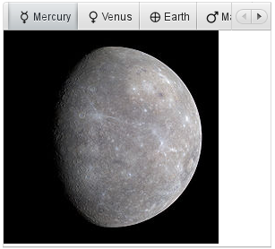
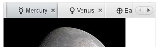
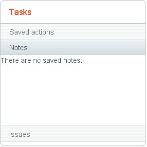
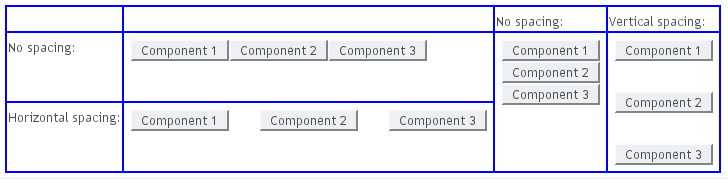

Managing Layout {#layout}
===============

Every since the ancient xeroxians invented graphical user interfaces,
programmers have wanted to make GUI programming ever easier for
themselves. Solutions started simple. When GUIs appeared on PC desktops,
practically all screens were of the VGA type and fixed into 640x480
size. Mac or X Window System on UNIX were not much different. Everyone
was so happy with such awesome graphics resolutions that they never
thought that an application would have to work on a radically different
screen size. At worst, screens could only grow, they thought, giving
more space for more windows. In the 80s, the idea of having a computer
screen in your pocket was simply not realistic. Hence, the GUI APIs
allowed placing UI components using screen coordinates. Visual Basic and
some other systems provided an easy way for the designer to drag and
drop components on a fixed-sized window. One would have thought that at
least translators would have complained about the awkwardness of such a
solution, but apparently they were not, as non-engineers, heard or at
least cared about. At best, engineers could throw at them a resource
editor that would allow them to resize the UI components by hand. Such
was the spirit back then.

After the web was born, layout design was doomed to change for ever. At
first, layout didn't matter much, as everyone was happy with plain
headings, paragraphs, and a few hyperlinks here and there. Designers of
HTML wanted the pages to run on any screen size. The screen size was
actually not pixels but rows and columns of characters, as the baby web
was really just hyper*text*, not graphics. That was soon to be changed.
The first GUI-based browser, NCSA Mosaic, launched a revolution that
culminated in Netscape Navigator. Suddenly, people who had previously
been doing advertisement brochures started writing HTML. This meant that
layout design had to be easy not just for programmers, but also allow
the graphics designer to do his or her job without having to know a
thing about programming. The W3C committee designing web standards came
up with the CSS (Cascading Style Sheet) specification, which allowed
trivial separation of appearance from content. Later versions of HTML
followed, XHTML and HTML 5 appeared, as did countless other standards.

Page description and markup languages are a wonderful solution for
static presentations, such as books and most web pages. Real
applications, however, need to have more control. They need to be able
to change the state of user interface components and even their layout
on the run. This creates a need to separate the presentation from
content on exactly the right level.

Thanks to the attack of graphics designers, desktop applications were,
when it comes to appearance, far behind web design. Sun Microsystems had
come in 1995 with a new programming language, Java, for writing
cross-platform desktop applications. Java's original graphical user
interface toolkit, AWT (Abstract Windowing Toolkit), was designed to
work on multiple operating systems as well as embedded in web browsers.
One of the special aspects of AWT was the layout manager, which allowed
user interface components to be flexible, growing and shrinking as
needed. This made it possible for the user to resize the windows of an
application flexibly and also served the needs of localization, as text
strings were not limited to some fixed size in pixels. It became even
possible to resize the pixel size of fonts, and the rest of the layout
adapted to the new size.

Layout management of Vaadin is a direct successor of the web-based
concept for separation of content and appearance and of the Java AWT
solution for binding the layout and user interface components into
objects in programs. Vaadin layout components allow you to position your
UI components on the screen in a hierarchical fashion, much like in
conventional Java UI toolkits such as AWT, Swing, or SWT. In addition,
you can approach the layout from the direction of the web with the
`CustomLayout` component, which you can use to write your layout as a
template in HTML that provides locations of any contained components.
The `AbsoluteLayout` allows the old-style pixel-position based
layouting, but it also supports percentual values, which makes it usable
for scalable layouts. It is also useful as an area on which the user can
position items with drag and drop.

The moral of the story is that, because Vaadin is intended for web
applications, appearance is of high importance. The solutions have to be
the best of both worlds and satisfy artists of both kind: code and
graphics. On the API side, the layout is controlled by UI components,
particularly the layout components. On the visual side, it is controlled
by themes. Themes can contain any HTML, Sass, CSS, and JavaScript that
you or your web artists create to make people feel good about your
software.

Overview {#layout.overview}
========

The user interface components in Vaadin can roughly be divided in two
groups: components that the user can interact with and layout components
for placing the other components to specific places in the user
interface. The layout components are identical in their purpose to
layout managers in regular desktop frameworks for Java and you can use
plain Java to accomplish sophisticated component layouting.

You start by creating a content layout for the UI and then add other
layout components hierarchically, and finally the interaction components
as the leaves of the component tree.

    // Set the root layout for the UI
    VerticalLayout content = new VerticalLayout();
    setContent(content);

    // Add the topmost component.
    content.addComponent(new Label("The Ultimate Cat Finder"));

    // Add a horizontal layout for the bottom part.
    HorizontalLayout bottom = new HorizontalLayout();
    content.addComponent(bottom);

    bottom.addComponent(new Tree("Major Planets and Their Moons"));
    bottom.addComponent(new Panel());
    ...

Or in the declarative format:

    <v-vertical-layout>
      <v-label>The Ultimate Cat Finder</v-label>

      <v-horizontal-layout>
        <v-tree caption="Major Planets and Their Moons"/>
        <v-panel/>
      </v-horizontal-layout>
    </v-vertical-layout>

You will usually need to tune the layout components a bit by setting
sizes, expansion ratios, alignments, spacings, and so on. The general
settings are described in ?.

Layouts are coupled with themes that specify various layout features,
such as backgrounds, borders, text alignment, and so on. Definition and
use of themes is described in ?.

You can see a finished version of the above example in ?.

UI, Window, and Panel Content {#layout.root-layout}
=============================

The `UI`, `Window`, and `Panel` all have a single content component,
which you need to set with setContent(). The content is usually a layout
component, although any component is allowed.

    Panel panel = new Panel("This is a Panel");
    VerticalLayout panelContent = new VerticalLayout();
    panelContent.addComponent(new Label("Hello!"));
    panel.setContent(panelContent);

    // Set the panel as the content of the UI
    setContent(panel);

The size of the content is the default size of the particular layout
component, for example, a `VerticalLayout` has 100% width and undefined
height by default (this coincides with the defaults for `Panel` and
`Label`). If such a layout with undefined height grows higher than the
browser window, it will flow out of the view and scrollbars will appear.
In many applications, you want to use the full area of the browser view.
Setting the components contained inside the content layout to full size
is not enough, and would actually lead to an invalid state if the height
of the content layout is undefined.

    // First set the root content for the UI
    VerticalLayout content = new VerticalLayout();
    setContent(content);

    // Set the content size to full width and height
    content.setSizeFull();

    // Add a title area on top of the screen. This takes
    // just the vertical space it needs.
    content.addComponent(new Label("My Application"));

    // Add a menu-view area that takes rest of vertical space
    HorizontalLayout menuview = new HorizontalLayout();
    menuview.setSizeFull();
    content.addComponent(menuview);

See ? for more information about setting layout sizes.

`VerticalLayout` and `HorizontalLayout` {#layout.orderedlayout}
=======================================

`VerticalLayout` and `HorizontalLayout` are ordered layouts for laying
components out either vertically or horizontally, respectively. They
both extend from `AbstractOrderedLayout`, together with the
`FormLayout`. These are the two most important layout components in
Vaadin, and typically you have a `VerticalLayout` as the root content of
a UI.

`VerticalLayout` has 100% default width and undefined height, so it
fills the containing layout (or UI) horizontally, and fits its content
vertically. `HorizontalLayout` has undefined size in both dimensions.

Typical use of the layouts goes as follows:

    VerticalLayout vertical = new VerticalLayout ();
    vertical.addComponent(new TextField("Name"));
    vertical.addComponent(new TextField("Street address"));
    vertical.addComponent(new TextField("Postal code"));
    layout.addComponent(vertical);

The component captions are placed above the component, so the layout
will look as follows:

Using `HorizontalLayout` gives the following layout:

Properties or Attributes {#layout.orderedlayout.properties}
------------------------

Ordered layouts have the following properties:

  ---------- -----------------------
  Property   Declarative Attribute
  ---------- -----------------------

  : Properties and Declarative Attributes

Spacing in Ordered Layouts {#layout.orderedlayout.spacing}
--------------------------

The ordered layouts can have spacing between the horizontal or vertical
cells. The spacing can be enabled with setSpacing(true) or declaratively
with the `spacing` attribute.

The spacing as a default height or width, which can be customized in
CSS. You need to set the height or width for spacing elements with
`v-spacing` style. You also need to specify an enclosing rule element in
a CSS selector, such as `v-verticallayout` for a `VerticalLayout` or
`v-horizontallayout` for a `HorizontalLayout`. You can also use
`v-vertical` and `v-horizontal` for all vertically or horizontally
ordered layouts, such as `FormLayout`.

For example, the following sets the amount of spacing for all
`VerticalLayout`s, as well as `FormLayout`, in the UI:

    .v-vertical > .v-spacing {
        height: 30px;
    }

Or for `HorizontalLayout`:

    .v-horizontal > .v-spacing {
        width: 50px;
    }

Sizing Contained Components {#layout.orderedlayout.sizing}
---------------------------

The components contained within an ordered layout can be laid out in a
number of different ways depending on how you specify their height or
width in the primary direction of the layout component.

? above gives a summary of the sizing options for a `HorizontalLayout`.
The figure is broken down in the following subsections.

If a `VerticalLayout` has undefined height or `HorizontalLayout`
undefined width, the layout will shrink to fit the contained components
so that there is no extra space between them.

    HorizontalLayout fittingLayout = new HorizontalLayout();
    fittingLayout.setWidth(Sizeable.SIZE_UNDEFINED, 0); // Default
    fittingLayout.addComponent(new Button("Small"));
    fittingLayout.addComponent(new Button("Medium-sized"));
    fittingLayout.addComponent(new Button("Quite a big component"));
    parentLayout.addComponent(fittingLayout);

The both layouts actually have undefined height by default and
`HorizontalLayout` has also undefined width, while `VerticalLayout` has
100% relative width.

If such a vertical layout with undefined height continues below the
bottom of a window (a `Window` object), the window will pop up a
vertical scroll bar on the right side of the window area. This way, you
get a "web page". The same applies to `Panel`.

> **Warning**
>
> If a layout has undefined size and a contained component has, say,
> 100% size, the component would fill the space given by the layout,
> while the layout would shrink to fit the space taken by the component,
> which would be a paradox. This requirement holds for height and width
> separately. The debug window allows detecting such invalid cases; see
> ?.

An exception to the above rule is a case where you have a layout with
undefined size that contains a component with a fixed or undefined size
together with one or more components with relative size. In this case,
the contained component with fixed (or undefined) size in a sense
defines the size of the containing layout, removing the paradox. That
size is then used for the relatively sized components.

The technique can be used to define the width of a `VerticalLayout` or
the height of a `HorizontalLayout`.

    // Vertical layout would normally have 100% width
    VerticalLayout vertical = new VerticalLayout();
            
    // Shrink to fit the width of contained components
    vertical.setWidth(Sizeable.SIZE_UNDEFINED, 0);
            
    // Label has normally 100% width, but we set it as
    // undefined so that it will take only the needed space
    Label label =
        new Label("\u2190 The VerticalLayout shrinks to fit "+
                  "the width of this Label \u2192");
    label.setWidth(Sizeable.SIZE_UNDEFINED, 0);
    vertical.addComponent(label);
            
    // Button has undefined width by default
    Button butt = new Button("\u2190 This Button takes 100% "+
                             "of the width \u2192");
    butt.setWidth("100%");
    vertical.addComponent(butt);

If you set a `HorizontalLayout` to a defined size horizontally or a
`VerticalLayout` vertically, and there is space left over from the
contained components, the extra space is distributed equally between the
component cells. The components are aligned within these cells according
to their alignment setting, top left by default, as in the example
below.

    fixedLayout.setWidth("400px");

Using percentual sizes for components contained in a layout requires
answering the question, "Percentage of what?" There is no sensible
default answer for this question in the current implementation of the
layouts, so in practice, you may not define "100%" size alone.

Often, you want to have one component that takes all the available space
left over from other components. You need to set its size as 100% and
set it as *expanding* with setExpandRatio(). The second parameter for
the method is an expansion ratio, which is relevant if there are more
than one expanding component, but its value is irrelevant for a single
expanding component.

    HorizontalLayout layout = new HorizontalLayout();
    layout.setWidth("400px");

    // These buttons take the minimum size.
    layout.addComponent(new Button("Small"));
    layout.addComponent(new Button("Medium-sized"));

    // This button will expand.
    Button expandButton = new Button("Expanding component");

    // Use 100% of the expansion cell's width.
    expandButton.setWidth("100%");

    // The component must be added to layout before setting the ratio.
    layout.addComponent(expandButton);

    // Set the component's cell to expand.
    layout.setExpandRatio(expandButton, 1.0f);

    parentLayout.addComponent(layout);

In the declarative format, you need to specify the `:expand` attribute
in the child components. The attribute defaults to expand ratio 1.

Notice that you can not call setExpandRatio() before you have added the
component to the layout, because it can not operate on an component that
it doesn't yet have.

If you specify an expand ratio for multiple components, they will all
try to use the available space according to the ratio.

    HorizontalLayout layout = new HorizontalLayout();
    layout.setWidth("400px");

    // Create three equally expanding components.
    String[] captions = { "Small", "Medium-sized",
                          "Quite a big component" };
    for (int i = 1; i <= 3; i++) {
        Button button = new Button(captions[i-1]);
        button.setWidth("100%");
        layout.addComponent(button);

        // Have uniform 1:1:1 expand ratio.
        layout.setExpandRatio(button, 1.0f);
    }

As the example used the same ratio for all components, the ones with
more content may have the content cut. Below, we use differing ratios:

    // Expand ratios for the components are 1:2:3.
    layout.setExpandRatio(button, i * 1.0f);

If the size of the expanding components is defined as a percentage
(typically "100%"), the ratio is calculated from the *overall* space
available for the relatively sized components. For example, if you have
a 100 pixels wide layout with two cells with 1.0 and 4.0 respective
expansion ratios, and both the components in the layout are set as
setWidth("100%"), the cells will have respective widths of 20 and 80
pixels, regardless of the minimum size of the components.

However, if the size of the contained components is undefined or fixed,
the expansion ratio is of the *excess* available space. In this case, it
is the excess space that expands, not the components.

    for (int i = 1; i <= 3; i++) {
        // Button with undefined size.
        Button button = new Button(captions[i - 1]);
        
        layout4.addComponent(button);

        // Expand ratios are 1:2:3.
        layout4.setExpandRatio(button, i * 1.0f);
    }

It is not meaningful to combine expanding components with percentually
defined size and components with fixed or undefined size. Such
combination can lead to a very unexpected size for the percentually
sized components.

A percentual size of a component defines the size of the component
*within its cell*. Usually, you use "100%", but a smaller percentage or
a fixed size (smaller than the cell size) will leave an empty space in
the cell and align the component within the cell according to its
alignment setting, top left by default.

    HorizontalLayout layout50 = new HorizontalLayout();
    layout50.setWidth("400px");

    String[] captions1 = { "Small 50%", "Medium 50%",
                           "Quite a big 50%" };
    for (int i = 1; i <= 3; i++) {
        Button button = new Button(captions1[i-1]);
        button.setWidth("50%");
        layout50.addComponent(button);

        // Expand ratios for the components are 1:2:3.
        layout50.setExpandRatio(button, i * 1.0f);
    }
    parentLayout.addComponent(layout50);

`GridLayout` {#layout.gridlayout}
============

`GridLayout` container lays components out on a grid, defined by the
number of columns and rows. The columns and rows of the grid serve as
coordinates that are used for laying out components on the grid. Each
component can use multiple cells from the grid, defined as an area
(x1,y1,x2,y2), although they typically take up only a single grid cell.

The grid layout maintains a cursor for adding components in
left-to-right, top-to-bottom order. If the cursor goes past the
bottom-right corner, it will automatically extend the grid downwards by
adding a new row.

The following example demonstrates the use of `GridLayout`. The
addComponent takes a component and optional coordinates. The coordinates
can be given for a single cell or for an area in x,y (column,row) order.
The coordinate values have a base value of 0. If coordinates are not
given, the cursor will be used.

    // Create a 4 by 4 grid layout.
    GridLayout grid = new GridLayout(4, 4);
    grid.addStyleName("example-gridlayout");

    // Fill out the first row using the cursor.
    grid.addComponent(new Button("R/C 1"));
    for (int i = 0; i < 3; i++) {
        grid.addComponent(new Button("Col " + (grid.getCursorX() + 1)));
    }

    // Fill out the first column using coordinates.
    for (int i = 1; i < 4; i++) {
        grid.addComponent(new Button("Row " + i), 0, i);
    }

    // Add some components of various shapes.
    grid.addComponent(new Button("3x1 button"), 1, 1, 3, 1);
    grid.addComponent(new Label("1x2 cell"), 1, 2, 1, 3);
    InlineDateField date = new InlineDateField("A 2x2 date field");
    date.setResolution(DateField.RESOLUTION_DAY);
    grid.addComponent(date, 2, 2, 3, 3);

The resulting layout will look as follows. The borders have been made
visible to illustrate the layout cells.

A component to be placed on the grid must not overlap with existing
components. A conflict causes throwing a `GridLayout.OverlapsException`.

Sizing Grid Cells
-----------------

You can define the size of both a grid layout and its components in
either fixed or percentual units, or leave the size undefined
altogether, as described in ?. ? gives an introduction to sizing of
layouts.

The size of the `GridLayout` component is undefined by default, so it
will shrink to fit the size of the components placed inside it. In most
cases, especially if you set a defined size for the layout but do not
set the contained components to full size, there will be some unused
space. The position of the non-full components within the grid cells
will be determined by their *alignment*. See ? for details on how to
align the components inside the cells.

The components contained within a `GridLayout` layout can be laid out in
a number of different ways depending on how you specify their height or
width. The layout options are similar to `HorizontalLayout` and
`VerticalLayout`, as described in ?.

> **Warning**
>
> If a layout has undefined size and a contained component has, say,
> 100% size, the component would fill the space given by the layout,
> while the layout would shrink to fit the space taken by the component,
> which is a paradox. This requirement holds for height and width
> separately. The debug mode allows detecting such invalid cases; see ?.

Often, you want to have one or more rows or columns that take all the
available space left over from non-expanding rows or columns. You need
to set the rows or columns as *expanding* with setRowExpandRatio() and
setColumnExpandRatio(). The first parameter for these methods is the
index of the row or column to set as expanding. The second parameter for
the methods is an expansion ratio, which is relevant if there are more
than one expanding row or column, but its value is irrelevant if there
is only one. With multiple expanding rows or columns, the ratio
parameter sets the relative portion how much a specific row/column will
take in relation with the other expanding rows/columns.

    GridLayout grid = new GridLayout(3,2);

    // Layout containing relatively sized components must have
    // a defined size, here is fixed size.
    grid.setWidth("600px");
    grid.setHeight("200px");

    // Add some content
    String labels [] = {
            "Shrinking column Shrinking row",
            "Expanding column (1:) Shrinking row",
            "Expanding column (5:) Shrinking row",
            "Shrinking column Expanding row",
            "Expanding column (1:) Expanding row",
            "Expanding column (5:) Expanding row"
    };
    for (int i=0; i<labels.length; i++) {
        Label label = new Label(labels[i], ContentMode.HTML);
        label.setWidth(null); // Set width as undefined
        grid.addComponent(label);
    }

    // Set different expansion ratios for the two columns
    grid.setColumnExpandRatio(1, 1);
    grid.setColumnExpandRatio(2, 5);

    // Set the bottom row to expand
    grid.setRowExpandRatio(1, 1);

    // Align and size the labels.
    for (int col=0; col<grid.getColumns(); col++) {
        for (int row=0; row<grid.getRows(); row++) {
            Component c = grid.getComponent(col, row);
            grid.setComponentAlignment(c, Alignment.TOP_CENTER);
            
            // Make the labels high to illustrate the empty
            // horizontal space.
            if (col != 0 || row != 0)
                c.setHeight("100%");
        }
    }

If the size of the contained components is undefined or fixed, the
expansion ratio is of the *excess* space, as in ? (excess horizontal
space is shown in white). However, if the size of the all the contained
components in the expanding rows or columns is defined as a percentage,
the ratio is calculated from the *overall* space available for the
percentually sized components. For example, if we had a 100 pixels wide
grid layout with two columns with 1.0 and 4.0 respective expansion
ratios, and all the components in the grid were set as setWidth("100%"),
the columns would have respective widths of 20 and 80 pixels, regardless
of the minimum size of their contained components.

    .v-gridlayout {}
    .v-gridlayout-margin {}

The `v-gridlayout` is the root element of the `GridLayout` component.
The `v-gridlayout-margin` is a simple element inside it that allows
setting a padding between the outer element and the cells.

For styling the individual grid cells, you should style the components
inserted in the cells. The implementation structure of the grid can
change, so depending on it, as is done in the example below, is not
generally recommended. Normally, if you want to have, for example, a
different color for a certain cell, just make set the component inside
it setSizeFull(), and add a style name for it. Sometimes you may need to
use a layout component between a cell and its actual component just for
styling.

The following example shows how to make the grid borders visible, as in
?.

    .v-gridlayout-gridexpandratio {
        background: blue; /* Creates a "border" around the grid. */
        margin:     10px; /* Empty space around the layout. */
    }

    /* Add padding through which the background color shows. */
    .v-gridlayout-gridexpandratio .v-gridlayout-margin {
        padding: 2px;     
    }

    /* Add cell borders and make the cell backgrounds white.
     * Warning: This depends heavily on the HTML structure. */
    .v-gridlayout-gridexpandratio > div > div > div {
        padding:    2px;   /* Layout background will show through. */
        background: white; /* The cells will be colored white. */
    }

    /* Components inside the layout are a safe way to style cells. */
    .v-gridlayout-gridexpandratio .v-label {
        text-align: left;
        background: #ffffc0; /* Pale yellow */
    }

You should beware of `margin`, `padding`, and `border` settings in CSS
as they can mess up the layout. The dimensions of layouts are calculated
in the Client-Side Engine of Vaadin and some settings can interfere with
these calculations. For more information, on margins and spacing, see ?
and ?

`FormLayout` {#layout.formlayout}
============

`FormLayout` lays the components and their captions out in two columns,
with optional indicators for required fields and errors that can be
shown for each field. The field captions can have an icon in addition to
the text. `FormLayout` is an ordered layout and much like
`VerticalLayout`. For description of margins, spacing, and other
features in ordered layouts, see ?.

The following example shows typical use of `FormLayout` in a form:

    // A FormLayout used outside the context of a Form
    FormLayout fl = new FormLayout();

    // Make the FormLayout shrink to its contents 
    fl.setSizeUndefined();

    TextField tf = new TextField("A Field");
    fl.addComponent(tf);

    // Mark the first field as required
    tf.setRequired(true);
    tf.setRequiredError("The Field may not be empty.");

    TextField tf2 = new TextField("Another Field");
    fl.addComponent(tf2);

    // Set the second field straing to error state with a message.
    tf2.setComponentError(
        new UserError("This is the error indicator of a Field."));

The resulting layout will look as follows. The error message shows in a
tooptip when you hover the mouse pointer over the error indicator.

    .v-formlayout {}
    .v-formlayout .v-caption {}

    /* Columns in a field row. */
    .v-formlayout-contentcell {} /* Field content. */
    .v-formlayout-captioncell {} /* Field caption. */
    .v-formlayout-errorcell {}   /* Field error indicator. */

    /* Overall style of field rows. */
    .v-formlayout-row {}
    .v-formlayout-firstrow {}
    .v-formlayout-lastrow {}

    /* Required field indicator. */
    .v-formlayout .v-required-field-indicator {}
    .v-formlayout-captioncell .v-caption
            .v-required-field-indicator {}

    /* Error indicator. */
    .v-formlayout-cell .v-errorindicator {}
    .v-formlayout-error-indicator .v-errorindicator {}

The top-level element of `FormLayout` has the `v-formlayout` style. The
layout is tabular with three columns: the caption column, the error
indicator column, and the field column. These can be styled with
`v-formlayout-captioncell`, `v-formlayout-errorcell`, and
`v-formlayout-contentcell`, respectively. While the error indicator is
shown as a dedicated column, the indicator for required fields is
currently shown as a part of the caption column.

For information on setting margins and spacing, see also ? and ?.

`Panel` {#layout.panel}
=======

`Panel` is a single-component container with a frame around the content.
It has an optional caption and an icon which are handled by the panel
itself, not its containing layout. The panel itself does not manage the
caption of its contained component. You need to set the content with
setContent().

`Panel` has 100% width and undefined height by default. This corresponds
with the default sizing of `VerticalLayout`, which is perhaps most
commonly used as the content of a `Panel`. If the width or height of a
panel is undefined, the content must have a corresponding undefined or
fixed size in the same direction to avoid a sizing paradox.

    Panel panel = new Panel("Astronomy Panel");
    panel.addStyleName("mypanelexample");
    panel.setSizeUndefined(); // Shrink to fit content
    layout.addComponent(panel);
            
    // Create the content
    FormLayout content = new FormLayout();
    content.addStyleName("mypanelcontent");
    content.addComponent(new TextField("Participant"));
    content.addComponent(new TextField("Organization"));
    content.setSizeUndefined(); // Shrink to fit
    content.setMargin(true);
    panel.setContent(content);

The resulting layout is shown in ?.

Scrolling the Panel Content {#layout.panel.scrolling}
---------------------------

scroll bars
Normally, if a panel has undefined size in a direction, as it has by
default vertically, it will fit the size of the content and grow as the
content grows. However, if it has a fixed or percentual size and its
content becomes too big to fit in the content area, a scroll bar will
appear for the particular direction. Scroll bars in a `Panel` are
handled natively by the browser with the `overflow: auto` property in
CSS. overflow CSS property

In the following example, we have a 300 pixels wide and very high
`Image` component as the panel content.

    // Display an image stored in theme
    Image image = new Image(null,
        new ThemeResource("img/Ripley_Scroll-300px.jpg"));
            
    // To enable scrollbars, the size of the panel content
    // must not be relative to the panel size
    image.setSizeUndefined(); // Actually the default

    // The panel will give it scrollbars.
    Panel panel = new Panel("Scroll");
    panel.setWidth("300px");
    panel.setHeight("300px");
    panel.setContent(image);

    layout.addComponent(panel);

The result is shown in ?. Notice that also the horizontal scrollbar has
appeared even though the panel has the same width as the content (300
pixels) - the 300px width for the panel includes the panel border and
vertical scrollbar.

Scrollable
`Panel` implements the Scrollable interface to allow programmatic
scrolling. You can set the scroll position in pixels with setScrollTop()
and setScrollLeft(). You can also get the scroll position set
previously, but scrolling the panel in the browser does not update the
scroll position to the server-side.

    .v-panel {}
    .v-panel-caption {}
    .v-panel-nocaption {}
    .v-panel-content {}
    .v-panel-deco {}

The entire panel has `v-panel` style. A panel consists of three parts:
the caption, content, and bottom decorations (shadow). These can be
styled with `v-panel-caption`, `v-panel-content`, and `v-panel-deco`,
respectively. If the panel has no caption, the caption element will have
the style `v-panel-nocaption`.

The built-in `light` style in the Reindeer and Runo themes has no
borders or border decorations for the `Panel`. You can use the
`Reindeer.PANEL_LIGHT` and `Runo.PANEL_LIGHT` constants to add the style
to a panel. Other themes may also provide the light and other styles for
`Panel` as well.

Sub-Windows {#layout.sub-window}
===========

*Sub-windows* are floating panels within a native browser window. Unlike
native browser windows, sub-windows are managed by the client-side
runtime of Vaadin using HTML features. Vaadin allows opening, closing,
resizing, maximizing and restoring sub-windows, as well as scrolling the
window content.

Sub-windows are typically used for Dialog Windows and Multiple Document
Interface applications. Sub-windows are by default not modal; you can
set them modal as described in ?.

Opening and Closing Sub-Windows {#layout.sub-window.openclose}
-------------------------------

You can open a new sub-window by creating a new `Window` object and
adding it to the UI with addWindow(), typically in some event listener.
A sub-window needs a content component, which is typically a layout.

In the following, we display a sub-window immediately when a UI opens:

    public static class SubWindowUI extends UI {
        @Override
        protected void init(VaadinRequest request) {
            // Some other UI content
            setContent(new Label("Here's my UI"));
            
            // Create a sub-window and set the content
            Window subWindow = new Window("Sub-window");
            VerticalLayout subContent = new VerticalLayout();
            subContent.setMargin(true);
            subWindow.setContent(subContent);
            
            // Put some components in it
            subContent.addComponent(new Label("Meatball sub"));
            subContent.addComponent(new Button("Awlright"));
            
            // Center it in the browser window
            subWindow.center();
            
            // Open it in the UI
            addWindow(subWindow);
        }
    }

The result was shown in ?. Sub-windows by default have undefined size in
both dimensions, so they will shrink to fit the content.

The user can close a sub-window by clicking the close button in the
upper-right corner of the window. The button is controlled by the
*closable* property, so you can disable it with setClosable(false).

You close a sub-window also programmatically by calling the close() for
the sub-window, typically in a click listener for an OK or Cancel
button. You can also call removeWindow() for the current `UI`.

### Sub-Window Management {#layout.sub-window.openclose.example}

Usually, you would extend the `Window` class for your specific
sub-window as follows:

    // Define a sub-window by inheritance
    class MySub extends Window {
        public MySub() {
            super("Subs on Sale"); // Set window caption
            center();

            // Some basic content for the window
            VerticalLayout content = new VerticalLayout();
            content.addComponent(new Label("Just say it's OK!"));
            content.setMargin(true);
            setContent(content);
            
            // Disable the close button
            setClosable(false);

            // Trivial logic for closing the sub-window
            Button ok = new Button("OK");
            ok.addClickListener(new ClickListener() {
                public void buttonClick(ClickEvent event) {
                    close(); // Close the sub-window
                }
            });
            content.addComponent(ok);
        }
    }

You could open the window as follows:

    // Some UI logic to open the sub-window
    final Button open = new Button("Open Sub-Window");
    open.addClickListener(new ClickListener() {
        public void buttonClick(ClickEvent event) {
            MySub sub = new MySub();
            
            // Add it to the root component
            UI.getCurrent().addWindow(sub);
        }
    });

Window Positioning {#layout.sub-window.position}
------------------

When created, a sub-window will have an undefined default size and
position. You can specify the size of a window with setHeight() and
setWidth() methods. You can set the position of the window with
setPositionX() and setPositionY() methods.

    // Create a new sub-window
    mywindow = new Window("My Dialog");

    // Set window size.
    mywindow.setHeight("200px");
    mywindow.setWidth("400px");

    // Set window position.
    mywindow.setPositionX(200);
    mywindow.setPositionY(50);

    UI.getCurrent().addWindow(mywindow);

Scrolling Sub-Window Content {#layout.sub-window.scrolling}
----------------------------

scroll bars
If a sub-window has a fixed or percentual size and its content becomes
too big to fit in the content area, a scroll bar will appear for the
particular direction. On the other hand, if the sub-window has undefined
size in the direction, it will fit the size of the content and never get
a scroll bar. Scroll bars in sub-windows are handled with regular HTML
features, namely `overflow: auto` property in CSS. overflow

Scrollable As `Window` extends `Panel`, windows are also Scrollable.
Note that the interface defines *programmatic scrolling*, not scrolling
by the user. Please see ?.

Modal Sub-Windows {#layout.sub-window.modal}
-----------------

A modal window is a sub-window that prevents interaction with the other
UI. Dialog windows, as illustrated in ?, are typical cases of modal
windows. The advantage of modal windows is limiting the scope of user
interaction to a sub-task, so changes in application state are more
limited. The disadvantage of modal windows is that they can restrict
workflow too much.

You can make a sub-window modal with setModal(true).

Depending on the theme, the parent window may be grayed when the modal
window is open.

> **Warning**
>
> Modality of child windows is purely a client-side feature and can be
> circumvented with client-side attack code. You should not trust in the
> modality of child windows in security-critical situations such as
> login windows.

`HorizontalSplitPanel` and `VerticalSplitPanel` {#layout.splitpanel}
===============================================

HorizontalSplitPanel
VerticalSplitPanel
`HorizontalSplitPanel` and `VerticalSplitPanel` are a two-component
containers that divide the available space into two areas to accomodate
the two components. `HorizontalSplitPanel` makes the split horizontally
with a vertical splitter bar, and `VerticalSplitPanel` vertically with a
horizontal splitter bar. The user can drag the bar to adjust its
position.

You can set the two components with the setFirstComponent() and
setSecondComponent() methods, or with the regular addComponent() method.

    // Have a panel to put stuff in
    Panel panel = new Panel("Split Panels Inside This Panel");

    // Have a horizontal split panel as its content
    HorizontalSplitPanel hsplit = new HorizontalSplitPanel();
    panel.setContent(hsplit);

    // Put a component in the left panel
    Tree tree = new Tree("Menu", TreeExample.createTreeContent());
    hsplit.setFirstComponent(tree);

    // Put a vertical split panel in the right panel
    VerticalSplitPanel vsplit = new VerticalSplitPanel();
    hsplit.setSecondComponent(vsplit);

    // Put other components in the right panel
    vsplit.addComponent(new Label("Here's the upper panel"));
    vsplit.addComponent(new Label("Here's the lower panel"));

The result is shown in ?. Observe that the tree is cut horizontally as
it can not fit in the layout. If its height exceeds the height of the
panel, a vertical scroll bar will appear automatically. If horizontal
scroll bar is necessary, you could put the content in a `Panel`, which
can have scroll bars in both directions.

You can set the split position with setSplitPosition(). It accepts any
units defined in the `Sizeable` interface, with percentual size relative
to the size of the component.

    // Have a horizontal split panel
    HorizontalSplitPanel hsplit = new HorizontalSplitPanel();
    hsplit.setFirstComponent(new Label("75% wide panel"));
    hsplit.setSecondComponent(new Label("25% wide panel"));

    // Set the position of the splitter as percentage
    hsplit.setSplitPosition(75, Sizeable.UNITS_PERCENTAGE);

Another version of the setSplitPosition() method allows leaving out the
unit, using the same unit as previously. The method also has versions
take take a boolean parameter, `reverse`, which allows defining the size
of the right or bottom panel instead of the left or top panel.

The split bar allows the user to adjust the split position by dragging
the bar with mouse. To lock the split bar, use setLocked(true). When
locked, the move handle in the middle of the bar is disabled.

    // Lock the splitter
    hsplit.setLocked(true);

Setting the split position programmatically and locking the split bar is
illustrated in ?.

Notice that the size of a split panel must not be undefined in the split
direction.

    /* For a horizontal SplitPanel. */
    .v-splitpanel-horizontal {}
    .v-splitpanel-hsplitter {}
    .v-splitpanel-hsplitter-locked {}

    /* For a vertical SplitPanel. */
    .v-splitpanel-vertical {}
    .v-splitpanel-vsplitter {}
    .v-splitpanel-vsplitter-locked {}

    /* The two container panels. */
    .v-splitpanel-first-container {}  /* Top or left panel. */
    .v-splitpanel-second-container {} /* Bottom or right panel. */

The entire split panel has the style `v-splitpanel-horizontal` or
`v-splitpanel-vertical`, depending on the panel direction. The split bar
or *splitter* between the two content panels has either the
`...-splitter` or `...-splitter-locked` style, depending on whether its
position is locked or not.

`TabSheet` {#layout.tabsheet}
==========

The `TabSheet` is a multicomponent container that allows switching
between the components with "tabs". The tabs are organized as a tab bar
at the top of the tab sheet. Clicking on a tab opens its contained
component in the main display area of the layout. If there are more tabs
than fit in the tab bar, navigation buttons will appear.

Adding Tabs {#layout.tabsheet.adding}
-----------

You add new tabs to a tab sheet with the addTab() method. The simple
version of the method takes as its parameter the root component of the
tab. You can use the root component to retrieve its corresponding `Tab`
object. Typically, you put a layout component as the root component.

You can also give the caption and the icon as parameters for the
addTab() method. The following example demonstrates the creation of a
simple tab sheet, where each tab shows a different `Label` component.
The tabs have an icon, which are (in this example) loaded as Java class
loader resources from the application.

    TabSheet tabsheet = new TabSheet();
    layout.addComponent(tabsheet);

    // Create the first tab
    VerticalLayout tab1 = new VerticalLayout();
    tab1.addComponent(new Embedded(null,
            new ThemeResource("img/planets/Mercury.jpg")));
    tabsheet.addTab(tab1, "Mercury",
            new ThemeResource("img/planets/Mercury_symbol.png"));

    // This tab gets its caption from the component caption
    VerticalLayout tab2 = new VerticalLayout();
    tab2.addComponent(new Embedded(null,
            new ThemeResource("img/planets/Venus.jpg")));
    tab2.setCaption("Venus");
    tabsheet.addTab(tab2).setIcon(
            new ThemeResource("img/planets/Venus_symbol.png"));
    ...

Tab Objects {#layout.tabsheet.tab}
-----------

Each tab in a tab sheet is represented as a `Tab` object, which manages
the tab caption, icon, and attributes such as hidden and visible. You
can set the caption with setCaption() and the icon with setIcon(). If
the component added with addTab() has a caption or icon, it is used as
the default for the `Tab` object. However, changing the attributes of
the root component later does not affect the tab, but you must make the
setting through the `Tab` object. The addTab() returns the new `Tab`
object, so you can easily set an attribute using the reference.

    // Set an attribute using the returned reference
    tabsheet.addTab(myTab).setCaption("My Tab");

### Disabling and Hiding Tabs {#layout.tabsheet.tab.disabling}

A tab can be disabled by setting setEnabled(false) for the `Tab` object,
thereby disallowing selecting it.

A tab can be made invisible by setting setVisible(false) for the `Tab`
object. The hideTabs() method allows hiding the tab bar entirely. This
can be useful in tabbed document interfaces (TDI) when there is only one
tab.

Tab Change Events {#layout.tabsheet.events}
-----------------

Clicking on a tab selects it. This fires a
`TabSheet.SelectedTabChangeEvent`, which you can handle by implementing
the `TabSheet.SelectedTabChangeListener` interface. You can access the
tabsheet of the event with getTabSheet(), and find the new selected tab
with getSelectedTab().

You can programmatically select a tab with setSelectedTab(), which also
fires the `SelectedTabChangeEvent` (beware of recursive events).
Reselecting the currently selected tab does not fire the event.

Notice that when the first tab is added, it is selected and the change
event is fired, so if you want to catch that, you need to add your
listener before adding any tabs.

### Creating Tab Content Dynamically {#layout.tabsheet.events.dynamic}

In the following example, we create the tabs as empty content layouts,
and add the tab content dynamically when a tab is selected:

    TabSheet tabsheet = new TabSheet();

    // Create tab content dynamically when tab is selected
    tabsheet.addSelectedTabChangeListener(
            new TabSheet.SelectedTabChangeListener() {
        public void selectedTabChange(SelectedTabChangeEvent event) {
            // Find the tabsheet
            TabSheet tabsheet = event.getTabSheet();
            
            // Find the tab (here we know it's a layout)
            Layout tab = (Layout) tabsheet.getSelectedTab();

            // Get the tab caption from the tab object
            String caption = tabsheet.getTab(tab).getCaption();
            
            // Fill the tab content
            tab.removeAllComponents();
            tab.addComponent(new Image(null,
                new ThemeResource("img/planets/"+caption+".jpg")));
        }
    });
            
    // Have some tabs
    String[] tabs = {"Mercury", "Venus", "Earth", "Mars"};
    for (String caption: tabs)
        tabsheet.addTab(new VerticalLayout(), caption,
            new ThemeResource("img/planets/"+caption+"_symbol.png"));

Enabling and Handling Closing Tabs {#layout.tabsheet.closing}
----------------------------------

You can enable a close button for individual tabs with the `closable`
property in the `TabSheet.Tab` objects.

    // Enable closing the tab
    tabsheet.getTab(tabComponent).setClosable(true);

### Handling Tab Close Events {#layout.tabsheet.closing.handling}

You can handle closing tabs by implementing a custom
`TabSheet.CloseHandler`. The default implementation simply calls
removeTab() for the tab to be closed, but you can prevent the close by
not calling it. This allows, for example, opening a dialog window to
confirm the close.

    tabsheet.setCloseHandler(new CloseHandler() {
        @Override
        public void onTabClose(TabSheet tabsheet,
                               Component tabContent) {
            Tab tab = tabsheet.getTab(tabContent);
            Notification.show("Closing " + tab.getCaption());
            
            // We need to close it explicitly in the handler
            tabsheet.removeTab(tab);
        }
    });

    .v-tabsheet {}
    .v-tabsheet-tabs {}
    .v-tabsheet-content {}
    .v-tabsheet-deco {}
    .v-tabsheet-tabcontainer {}
    .v-tabsheet-tabsheetpanel {}
    .v-tabsheet-hidetabs {}

    .v-tabsheet-scroller {}
    .v-tabsheet-scrollerPrev {}
    .v-tabsheet-scrollerNext {}
    .v-tabsheet-scrollerPrev-disabled{}
    .v-tabsheet-scrollerNext-disabled{}

    .v-tabsheet-tabitem {}
    .v-tabsheet-tabitem-selected {}
    .v-tabsheet-tabitemcell {}
    .v-tabsheet-tabitemcell-first {}

    .v-tabsheet-tabs td {}
    .v-tabsheet-spacertd {}

The entire tabsheet has the `v-tabsheet` style. A tabsheet consists of
three main parts: the tabs on the top, the main content pane, and
decorations around the tabsheet.

The tabs area at the top can be styled with `v-tabsheet-tabs`,
`v-tabsheet-tabcontainer` and `v-tabsheet-tabitem*`.

The style `v-tabsheet-spacertd` is used for any empty space after the
tabs. If the tabsheet has too little space to show all tabs, scroller
buttons enable browsing the full tab list. These use the styles
`v-tabsheet-scroller*`.

The content area where the tab contents are shown can be styled with
`v-tabsheet-content`, and the surrounding decoration with
`v-tabsheet-deco`.

`Accordion` {#layout.accordion}
===========

`Accordion` is a multicomponent container similar to `TabSheet`, except
that the "tabs" are arranged vertically. Clicking on a tab opens its
contained component in the space between the tab and the next one. You
can use an `Accordion` identically to a `TabSheet`, which it actually
inherits. See ? for more information.

The following example shows how you can create a simple accordion. As
the `Accordion` is rather naked alone, we put it inside a Panel that
acts as its caption and provides it a border.

    // Create the Accordion.
    Accordion accordion = new Accordion();

    // Have it take all space available in the layout.
    accordion.setSizeFull();

    // Some components to put in the Accordion.
    Label l1 = new Label("There are no previously saved actions.");
    Label l2 = new Label("There are no saved notes.");
    Label l3 = new Label("There are currently no issues.");

    // Add the components as tabs in the Accordion.
    accordion.addTab(l1, "Saved actions", null);
    accordion.addTab(l2, "Notes", null);
    accordion.addTab(l3, "Issues", null);

    // A container for the Accordion.
    Panel panel = new Panel("Tasks");
    panel.setWidth("300px");
    panel.setHeight("300px");
    panel.setContent(accordion);

    // Trim its layout to allow the Accordion take all space.
    panel.getLayout().setSizeFull();
    panel.getLayout().setMargin(false);

? shows what the example would look like with the default theme.

    .v-accordion {}
    .v-accordion-item {}
    .v-accordion-item-open {}
    .v-accordion-item-first {}
    .v-accordion-item-caption {}
    .v-accordion-item-caption .v-caption {}
    .v-accordion-item-content {}

The top-level element of `Accordion` has the `v-accordion` style. An
`Accordion` consists of a sequence of item elements, each of which has a
caption element (the tab) and a content area element.

The selected item (tab) has also the `v-accordion-open` style. The
content area is not shown for the closed items.

`AbsoluteLayout` {#layout.absolutelayout}
================

`AbsoluteLayout` allows placing components in arbitrary positions in the
layout area. The positions are specified in the addComponent() method
with horizontal and vertical coordinates relative to an edge of the
layout area. The positions can include a third depth dimension, the
*z-index*, which specifies which components are displayed in front and
which behind other components.

The positions are specified by a CSS absolute position string, using the
`left`, `right`, `top`, `bottom`, and `z-index` properties known from
CSS. In the following example, we have a 300 by 150 pixels large layout
and position a text field 50 pixels from both the left and the top edge:

    // A 400x250 pixels size layout
    AbsoluteLayout layout = new AbsoluteLayout();
    layout.setWidth("400px");
    layout.setHeight("250px");
            
    // A component with coordinates for its top-left corner
    TextField text = new TextField("Somewhere someplace");
    layout.addComponent(text, "left: 50px; top: 50px;");

The `left` and `top` specify the distance from the left and top edge,
respectively. The `right` and `bottom` specify the distances from the
right and top edge.

    // At the top-left corner
    Button button = new Button( "left: 0px; top: 0px;");
    layout.addComponent(button, "left: 0px; top: 0px;");

    // At the bottom-right corner
    Button buttCorner = new Button( "right: 0px; bottom: 0px;");
    layout.addComponent(buttCorner, "right: 0px; bottom: 0px;");

    // Relative to the bottom-right corner
    Button buttBrRelative = new Button( "right: 50px; bottom: 50px;");
    layout.addComponent(buttBrRelative, "right: 50px; bottom: 50px;");

    // On the bottom, relative to the left side
    Button buttBottom = new Button( "left: 50px; bottom: 0px;");
    layout.addComponent(buttBottom, "left: 50px; bottom: 0px;");

    // On the right side, up from the bottom
    Button buttRight = new Button( "right: 0px; bottom: 100px;");
    layout.addComponent(buttRight, "right: 0px; bottom: 100px;");

The result of the above code examples is shown in ?.

In the above examples, we had components of undefined size and specified
the positions of components by a single pair of coordinates. The other
possibility is to specify an area and let the component fill the area by
specifying a proportinal size for the component, such as "`100%`".
Normally, you use setSizeFull() to take the entire area given by the
layout.

    // Specify an area that a component should fill
    Panel panel = new Panel("A Panel filling an area");
    panel.setSizeFull(); // Fill the entire given area
    layout.addComponent(panel, "left: 25px; right: 50px; "+
                               "top: 100px; bottom: 50px;");

The result is shown in ?

You can also use proportional coordinates to specify the coordinates:

    // A panel that takes 30% to 90% horizontally and
    // 20% to 80% vertically
    Panel panel = new Panel("A Panel");
    panel.setSizeFull(); // Fill the specified area
    layout.addComponent(panel, "left: 30%; right: 10%;" +
                               "top: 20%; bottom: 20%;");

The result is shown in ?

Drag and drop is very useful for moving the components contained in an
`AbsoluteLayout`. Check out the example in ?.

    .v-absolutelayout {}
    .v-absolutelayout-wrapper {}

The `AbsoluteLayout` component has `v-absolutelayout` root style. Each
component in the layout is contained within an element that has the
`v-absolutelayout-wrapper`. The component captions are outside the
wrapper elements, in a separate element with the usual `v-caption`
style.

`CssLayout` {#layout.csslayout}
===========

`CssLayout` allows strong control over styling of the components
contained inside the layout. The components are contained in a simple
DOM structure consisting of `
` elements. By default, the contained
components are laid out horizontally and wrap naturally when they reach
the width of the layout, but you can control this and most other
behaviour with CSS. You can also inject custom CSS for each contained
component. As `CssLayout` has a very simple DOM structure and no dynamic
rendering logic, relying purely on the built-in rendering logic of the
browsers, it is the fastest of the layout components.

The basic use of `CssLayout` is just like with any other layout
component:

    CssLayout layout = new CssLayout();
            
    // Component with a layout-managed caption and icon
    TextField tf = new TextField("A TextField");
    tf.setIcon(new ThemeResource("icons/user.png"));
    layout.addComponent(tf);

    // Labels are 100% wide by default so must unset width
    Label label = new Label("A Label");
    label.setWidth(Sizeable.SIZE_UNDEFINED, 0);
    layout.addComponent(label);
            
    layout.addComponent(new Button("A Button"));

The result is shown in ?. Notice that the default spacing and alignment
of the layout is quite crude and CSS styling is nearly always needed.

The `display` attribute of `CssLayout` is `inline-block` by default, so
the components are laid out horizontally following another. `CssLayout`
has 100% width by default. If the components reach the width of the
layout, they are wrapped to the next "line" just as text would be. If
you add a component with 100% width, it will take an entire line by
wrapping before and after the component.

CSS Injection {#layout.csslayout.injection}
-------------

Overriding the getCss() method allows injecting custom CSS for each
component. The CSS returned by the method is inserted in the `style`
attribute of the `
` element of the component, so it will override
any style definitions made in CSS files.

    CssLayout layout = new CssLayout() {
        @Override
        protected String getCss(Component c) {
            if (c instanceof Label) {
                // Color the boxes with random colors
                int rgb = (int) (Math.random()*(1<<24));
                return "background: #" + Integer.toHexString(rgb);
            }
            return null;
        }
    };
    layout.setWidth("400px"); // Causes to wrap the contents

    // Add boxes of various sizes
    for (int i=0; i<40; i++) {
        Label box = new Label("&nbsp;", ContentMode.HTML);
        box.addStyleName("flowbox");
        box.setWidth((float) Math.random()*50,
                     Sizeable.UNITS_PIXELS);
        box.setHeight((float) Math.random()*50,
                      Sizeable.UNITS_PIXELS);
        layout.addComponent(box);
    }

The style name added to the components allows making common styling in a
CSS file:

    .v-label-flowbox {
      border: thin black solid;
    }

? shows the rendered result.

Browser Compatibility {#layout.csslayout.compatibility}
---------------------

The stregth of the `CssLayout` is also its weakness. Much of the logic
behind the other layout components is there to give nice default
behaviour and to handle the differences in different browsers. Some
browsers, no need to say which, are notoriously incompatible with the
CSS standards, so they require a lot of custom CSS. You may need to make
use of the browser-specific style classes in the root element of the
application. Some features in the other layouts are not even solvable in
pure CSS, at least in all browsers.

    .v-csslayout {}
    .v-csslayout-margin {}
    .v-csslayout-container {}

The `CssLayout` component has `v-csslayout` root style. The margin
element with `v-csslayout-margin` style is always enabled. The
components are contained in an element with `v-csslayout-container`
style.

For example, we could style the basic `CssLayout` example shown earlier
as follows:

    /* Have the caption right of the text box, bottom-aligned */
    .csslayoutexample .mylayout .v-csslayout-container {
        direction: rtl;
        line-height: 24px;
        vertical-align: bottom;
    }

    /* Have some space before and after the caption */
    .csslayoutexample .mylayout .v-csslayout-container .v-caption {
        padding-left:  3px;
        padding-right: 10px;
    }

The example would now be rendered as shown in ?.

Captions and icons that are managed by the layout are contained in an
element with `v-caption` style. These caption elements are contained
flat at the same level as the actual component elements. This may cause
problems with wrapping in `inline-block` mode, as wrapping can occur
between the caption and its corresponding component element just as well
as between components. Such use case is therefore not feasible.

Layout Formatting {#layout.settings}
=================

While the formatting of layouts is mainly done with style sheets, just
as with other components, style sheets are not ideal or even possible to
use in some situations. For example, CSS does not allow defining the
spacing of table cells, which is done with the `cellspacing` attribute
in HTML.

Moreover, as many layout sizes are calculated dynamically in the
Client-Side Engine of Vaadin, some CSS settings can fail altogether.

Layout Size {#layout.settings.size}
-----------

The size of a layout component can be specified with the setWidth() and
setHeight() methods defined in the `Sizeable` interface, just like for
any component. It can also be undefined, in which case the layout
shrinks to fit the component(s) inside it. ? gives details on the
interface.

Many layout components take 100% width by default, while they have the
height undefined.

The sizes of components inside a layout can also be defined as a
percentage of the space available in the layout, for example with
setWidth("100%"); or with the (most commonly used method) setFullSize()
that sets 100% size in both directions. If you use a percentage in a
`HorizontalLayout`, `VerticalLayout`, or `GridLayout`, you will also
have to set the component as *expanding*, as noted below.

> **Warning**
>
> *A layout that contains components with percentual size must have a
> defined size*!
>
> If a layout has undefined size and a contained component has, say,
> 100% size, the component will try to fill the space given by the
> layout, while the layout will shrink to fit the space taken by the
> component, which is a paradox. This requirement holds for height and
> width separately. The debug mode allows detecting such invalid cases;
> see ?.

For example:

    // This takes 100% width but has undefined height.
    VerticalLayout layout = new VerticalLayout();

    // A button that takes all the space available in the layout.
    Button button = new Button("100%x100% button");
    button.setSizeFull();
    layout.addComponent(button);

    // We must set the layout to a defined height vertically, in
    // this case 100% of its parent layout, which also must
    // not have undefined size.
    layout.setHeight("100%");

If you have a layout with undefined height, such as `VerticalLayout`, in
a `UI`, `Window`, or `Panel`, and put enough content in it so that it
extends outside the bottom of the view area, scrollbars will appear. If
you want your application to use all the browser view, nothing more or
less, you should use setFullSize() for the root layout.

    // Create the UI content
    VerticalLayout content = new VerticalLayout();

    // Use entire view area
    content.setSizeFull();

    setContent(content);

Expanding Components {#layout.settings.size.expanding}
--------------------

If you set a `HorizontalLayout` to a defined size horizontally or a
`VerticalLayout` vertically, and there is space left over from the
contained components, the extra space is distributed equally between the
component cells. The components are aligned within these cells,
according to their alignment setting, top left by default, as in the
example below.

Often, you don't want such empty space, but want one or more components
to take all the leftover space. You need to set such a component to 100%
size and use setExpandRatio(). If there is just one such expanding
component in the layout, the ratio parameter is irrelevant.

If you set multiple components as expanding, the expand ratio dictates
how large proportion of the available space (overall or excess depending
on whether the components are sized as a percentage or not) each
component takes. In the example below, the buttons have 1:2:3 ratio for
the expansion.

`GridLayout` has corresponding method for both of its directions,
setRowExpandRatio() and setColumnExpandRatio().

Expansion is dealt in detail in the documentation of the layout
components that support it. See ? and ? for details on components with
relative sizes.

Layout Cell Alignment {#layout.settings.alignment}
---------------------

Alignment
setComponentAlignment()
You can set the alignment of the component inside a specific layout cell
with the setComponentAlignment() method. The method takes as its
parameters the component contained in the cell to be formatted, and the
horizontal and vertical alignment.

? illustrates the alignment of components within a `GridLayout`.

The easiest way to set alignments is to use the constants defined in the
`Alignment` class. Let us look how the buttons in the top row of the
above `GridLayout` are aligned with constants:

    // Create a grid layout
    final GridLayout grid = new GridLayout(3, 3);

    grid.setWidth(400, Sizeable.UNITS_PIXELS);
    grid.setHeight(200, Sizeable.UNITS_PIXELS);

    Button topleft = new Button("Top Left");
    grid.addComponent(topleft, 0, 0);
    grid.setComponentAlignment(topleft, Alignment.TOP_LEFT);

    Button topcenter = new Button("Top Center");
    grid.addComponent(topcenter, 1, 0);
    grid.setComponentAlignment(topcenter, Alignment.TOP_CENTER);

    Button topright = new Button("Top Right");
    grid.addComponent(topright, 2, 0);
    grid.setComponentAlignment(topright, Alignment.TOP_RIGHT);
    ...

The following table lists all the `Alignment` constants by their
respective locations:

  --------------- ----------------- ----------------
  `TOP_LEFT`      `TOP_CENTER`      `TOP_RIGHT`
  `MIDDLE_LEFT`   `MIDDLE_CENTER`   `MIDDLE_RIGHT`
  `BOTTOM_LEFT`   `BOTTOM_CENTER`   `BOTTOM_RIGHT`
  --------------- ----------------- ----------------

  : Alignment Constants

Another way to specify the alignments is to create an `Alignment` object
and specify the horizontal and vertical alignment with separate
constants. You can specify either of the directions, in which case the
other alignment direction is not modified, or both with a bitmask
operation between the two directions.

    Button middleleft = new Button("Middle Left");
    grid.addComponent(middleleft, 0, 1);
    grid.setComponentAlignment(middleleft,
              new Alignment(Bits.ALIGNMENT_VERTICAL_CENTER | 
                            Bits.ALIGNMENT_LEFT));

    Button middlecenter = new Button("Middle Center");
    grid.addComponent(middlecenter, 1, 1);
    grid.setComponentAlignment(middlecenter,
              new Alignment(Bits.ALIGNMENT_VERTICAL_CENTER |
                            Bits.ALIGNMENT_HORIZONTAL_CENTER));

    Button middleright = new Button("Middle Right");
    grid.addComponent(middleright, 2, 1);
    grid.setComponentAlignment(middleright,
              new Alignment(Bits.ALIGNMENT_VERTICAL_CENTER |
                            Bits.ALIGNMENT_RIGHT));

Obviously, you may combine only one vertical bitmask with one horizontal
bitmask, though you may leave either one out. The following table lists
the available alignment bitmask constants:

  ------------------------------------ -----------------------
  Horizontal                           `Bits.ALIGNMENT_LEFT`
  `Bits.ALIGNMENT_HORIZONTAL_CENTER`
  `Bits.ALIGNMENT_RIGHT`
  Vertical                             `Bits.ALIGNMENT_TOP`
  `Bits.ALIGNMENT_VERTICAL_CENTER`
  `Bits.ALIGNMENT_BOTTOM`
  ------------------------------------ -----------------------

  : Alignment Bitmasks

You can determine the current alignment of a component with
getComponentAlignment(), which returns an `Alignment` object. The class
provides a number of getter methods for decoding the alignment, which
you can also get as a bitmask value.

### Size of Aligned Components {#layout.settings.alignment.size}

You can only align a component that is smaller than its containing cell
in the direction of alignment. If a component has 100% width, as many
components have by default, horizontal alignment does not have any
effect. For example, `Label` is 100% wide by default and can not
therefore be horizontally aligned as such. The problem can be hard to
notice, as the text inside a `Label` is left-aligned.

You usually need to set either a fixed size, undefined size, or less
than a 100% relative size for the component to be aligned - a size that
is smaller than the containing layout has.

For example, assuming that a `Label` has short content that is less wide
than the containing `VerticalLayout`, you could center it as follows:

    VerticalLayout layout = new VerticalLayout(); // 100% default width
    Label label = new Label("Hello"); // 100% default width
    label.setSizeUndefined();
    layout.addComponent(label);
    layout.setComponentAlignment(label, Alignment.MIDDLE_CENTER);

If you set the size as undefined and the component itself contains
components, make sure that the contained components also have either
undefined or fixed size. For example, if you set the size of a `Form` as
undefined, its containing layout `FormLayout` has 100% default width,
which you also need to set as undefined. But then, any components inside
the `FormLayout` must have either undefined or fixed size.

Layout Cell Spacing {#layout.settings.spacing}
-------------------

The `VerticalLayout`, `HorizontalLayout`, and `GridLayout` layouts offer
a setSpacing() method to enable spacing between the cells of the layout.

For example:

    VerticalLayout layout = new VerticalLayout();
    layout.setSpacing(true);
    layout.addComponent(new Button("Component 1"));
    layout.addComponent(new Button("Component 2"));
    layout.addComponent(new Button("Component 3"));

The effect of spacing in `VerticalLayout` and `HorizontalLayout` is
illustrated in ?.

The exact amount of spacing is defined in CSS. If the default is not
suitable, you can customize it in a custom theme.

In the Valo theme, you can specify the spacing with the
`$v-layout-spacing-vertical` and `$v-layout-spacing-horizontal`
parameters, as described in ?. The spacing defaults to the
`$v-unit-size` measure.

When adjusting spacing in other themes, you should note that it is
implemented in a bit different ways in different layouts. In the ordered
layouts, it is done with spacer elements, while in the `GridLayout` it
has special handling. Please see the sections on the individual
components for more details.

Layout Margins {#layout.settings.margins}
--------------

Most layout components do not have any margin around them by default.
The ordered layouts, as well as `GridLayout`, support enabling a margin
with setMargin(). This enables CSS classes for each margin in the HTML
element of the layout component.

In the Valo theme, the margin sizes default to `$v-unit-size`. You can
customize them with `$v-layout-margin-top`, `right`, `bottom`, and
`left`. See ? for a description of the parameters.

To customize the default margins in other themes, you can define each
margin with the `padding` property in CSS. You may want to have a custom
CSS class for the layout component to enable specific customization of
the margins, as is done in the following with the `mymargins` class:

    .mymargins.v-margin-left   {padding-left:   10px;}
    .mymargins.v-margin-right  {padding-right:  20px;}
    .mymargins.v-margin-top    {padding-top:    40px;}
    .mymargins.v-margin-bottom {padding-bottom: 80px;}

You can enable only specific margins by passing a `MarginInfo` to the
setMargin(). The margins are specified in clockwise order for top,
right, bottom, and left margin. The following would enable the left and
right margins:

    layout.setMargin(new MarginInfo(false, true, false, true));

The resulting margins are shown in ? below. The two ways produce
identical margins.

Custom Layouts {#layout.customlayout}
==============

While it is possible to create almost any typical layout with the
standard layout components, it is sometimes best to separate the layout
completely from code. With the `CustomLayout` component, you can write
your layout as a template in HTML that provides locations of any
contained components. The layout template is included in a theme. This
separation allows the layout to be designed separately from code, for
example using WYSIWYG web designer tools such as Adobe Dreamweaver.

A template is a HTML file located under `layouts` folder under a theme
folder under the `WebContent/VAADIN/themes/` folder, for example,
`WebContent/VAADIN/themes/themename/layouts/mylayout.html`. (Notice that
the root path `WebContent/VAADIN/themes/` for themes is fixed.) A
template can also be provided dynamically from an `InputStream`, as
explained below. A template includes `
` elements with a `location`
attribute that defines the location identifier. All custom layout
HTML-files must be saved using UTF-8 character encoding.

    <table width="100%" height="100%">
      <tr height="100%">
        <td>
          <table align="center">
            <tr>
              <td align="right">User&nbsp;name:</td>
              <td>

</td>
            </tr>
            <tr>
              <td align="right">Password:</td>
              <td>

</td>
            </tr>
          </table>
        </td>
      </tr>
      <tr>
        <td align="right" colspan="2">
          

        </td>
      </tr>
    </table>

The client-side engine of Vaadin will replace contents of the location
elements with the components. The components are bound to the location
elements by the location identifier given to addComponent(), as shown in
the example below.

    // Have a Panel where to put the custom layout.
    Panel panel = new Panel("Login");
    panel.setSizeUndefined();
    main.addComponent(panel);

    // Create custom layout from "layoutname.html" template.
    CustomLayout custom = new CustomLayout("layoutname");
    custom.addStyleName("customlayoutexample");

    // Use it as the layout of the Panel.
    panel.setContent(custom);

    // Create a few components and bind them to the location tags
    // in the custom layout.
    TextField username = new TextField();
    custom.addComponent(username, "username");

    TextField password = new TextField();
    custom.addComponent(password, "password");

    Button ok = new Button("Login");
    custom.addComponent(ok, "okbutton");

The resulting layout is shown below in ?.

You can use addComponent() also to replace an existing component in the
location given in the second parameter.

In addition to a static template file, you can provide a template
dynamically with the `CustomLayout` constructor that accepts an
`InputStream` as the template source. For example:

    new CustomLayout(new ByteArrayInputStream("<b>Template</b>".getBytes()));

or

    new CustomLayout(new FileInputStream(file));
