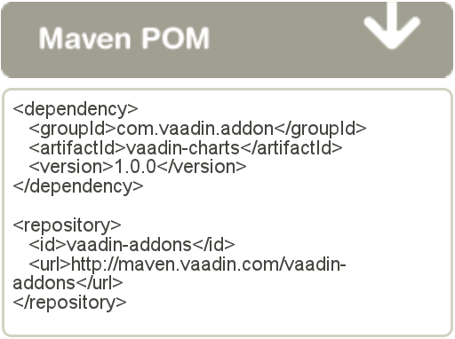
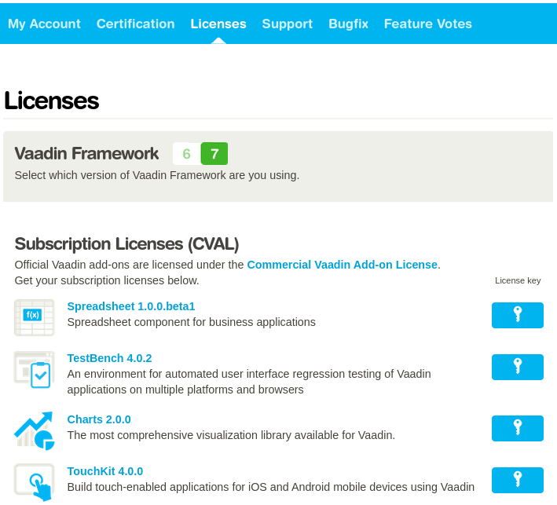
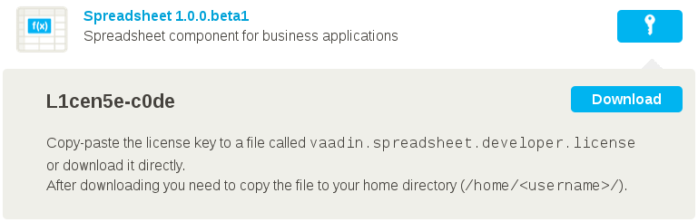

This chapter describes the installation of add-on components, themes,
containers, and other tools from the Vaadin Directory and the use of
commercial add-ons offered by Vaadin.

Overview {#addons.overview}
========

In addition to the components, layouts, themes, and data sources built
in into the core Vaadin library, many others are available as add-ons.
[Vaadin Directory](#) provides a rich collection of add-ons for Vaadin,
and you may find others from independent sources. Add-ons are also one
way to share your own components between projects.

Installation of add-ons from Vaadin Directory is simple, just adding an
Ivy or Maven dependency, or downloading the JAR package and and dropping
it in the web library folder of the project. Most add-ons include a
widget set, which you need to compile, but it's usually just a click of
a button or a single command.

After trying out an add-on, you can give some feedback to the author of
the add-on by rating the add-on with one to five stars and optionally
leaving a comment. Most add-ons also have a discussion forum thread for
user feedback and questions.

Add-ons available from Vaadin Directory are distributed under different
licenses, of which some are commercial. While the add-ons can be
downloaded directly, you should note their license and other terms and
conditions. Many are offered under a dual licensing agreement so that
they can be used in open source projects for free, and many have a trial
period for closed-source development. Commercial Vaadin add-ons
distributed under the CVAL license require installing a license key as
instructed in ?.

Downloading Add-ons from Vaadin Directory {#addons.downloading}
=========================================

If you are not using Maven or a Maven-compatible dependency manager such
as Ivy, or want to manage for your libraries manually, you can download
add-on packages from the details page of an add-on in Vaadin Directory.

1.  Select the version; some add-ons have several versions available.
    The latest is shown by default, but you can choose another the
    version to download from the dropdown menu in the header of the
    details page.

2.  Click Download Now and save the JAR or Zip file on your computer.

3.  If the add-on is packaged in a Zip package, unzip the package and
    follow any instructions provided inside the package. Typically, you
    just need to copy a JAR file to your web project under the
    `WEB-INF/lib` directory.

    Note that some add-ons may require other libraries. You can resolve
    such dependencies manually, but we recommend using a dependency
    manager such as Ivy or Maven in your project.

4.  Update and recompile your project. In Eclipse, select the project
    and press F5.

5.  You may need to compile the client-side implementations of the
    add-on components, that is, a *widget set*. This is the case for
    majority of add-ons, except for pure server-side, theme, or data
    binding add-ons. Compiling the widget set depends on the build
    environment. See ?, or later in this chapter for instructions for
    compiling the widget set with Eclipse and Maven.

6.  Update the project in your development web server and possibly
    restart the server.

Compiling Widget Sets with an Ant Script {#addons.downloading.ant}
----------------------------------------

If you need to compile the widget set with an Ant script, you can find a
script template package at the [Vaadin download page](#). You can copy
the files in the package to your project and, once configured, use it by
running Ant in the directory.

If you are using an IDE such as Eclipse, *always* remember to refresh
the project to synchronize it with the filesystem after compiling the
widget set outside the IDE.

Installing Add-ons in Eclipse with Ivy {#addons.eclipse}
======================================

The Vaadin Plugin for Eclipse uses Apache Ivy to resolve dependencies.
The dependencies should be listed in the `ivy.xml` file in the project
root. The Vaadin Directory allows dowloading add-ons from a Maven
repository, which can be accessed also by Ivy.

You can also use Ivy to resolve dependencies in an Ant script.

1.  Open the add-on page in Vaadin Directory.

2.  Select the version. The latest is shown by default, but you can
    choose another the version from the dropdown menu in the header of
    the add-on details page.

3.  Click the Maven/Ivy to display the Ivy dependency declaration, as
    illustrated in Figure ?. If the add-on is available with multiple
    licenses, you will be prompted to select a license for the
    dependency.

    

4.  Open the `ivysettings.xml` in your Eclipse project either in the XML
    or Ivy Editor (either double-click the file or right-click it and
    select Open With \> Ivy Editor).

    Check that the settings file has the `<ibiblio>` entry given in the
    Directory page. It should be, if the file was created by the Vaadin
    project wizard in Eclipse. If not, copy it there.

        <chain name="default">
          ...
          <ibiblio name="vaadin-addons"
                   usepoms="true"
                   m2compatible="true"
                   root="http://maven.vaadin.com/vaadin-addons"/>
          ...
        </chain>

    If you get Vaadin addons from another repository, such as the local
    repository if you have compiled them yourself, you need to define a
    resolver for the repository in the settings file.

5.  Open the `ivy.xml` in your Eclipse project and copy the Ivy
    dependency to inside the `dependencies` element. It should be as
    follows:

        <dependencies>
            ...
            <dependency org="com.vaadin.addon"
                        name="vaadin-charts"
                        rev="1.0.0"/>
        </dependencies>

    You can specify either a fixed version number or a dynamic revision
    tag, such as `latest.release`. You can find more information about
    the [dependency declarations](#) in Ivy documentation.

    If the `ivy.xml` does not have a
    `<configurations defaultconfmapping="default->default">` defined,
    you also need to have `conf="default->default"` in the dependency to
    resolve transient dependencies correctly.

    IvyIDE immediately resolves the dependencies when you save the file.

6.  Compile the add-on widget set by clicking the Compile Vaadin widgets
    button in the toolbar.

    

If you experience problems with Ivy, first check all the dependency
parameters. IvyDE can sometimes cause unexpected problems. You can clear
the Ivy dependency cache by right-clicking the project and selecting
Ivy \> Clean all caches. To refresh Ivy
configuration, select Ivy \> Refresh. To
try resolving again Ivy, select Ivy \>
Resolve.

Using Add-ons in a Maven Project {#addons.maven}
================================

Maven
using add-ons
To use add-ons in a Maven project, you simply have to add them as
dependencies in the project POM. Most add-ons include a widget set,
which are compiled to the project widget set.

Creating, compiling, and packaging a Vaadin project with Maven was
described in ?.

Adding a Dependency {#addons.maven.dependency}
-------------------

Vaadin Directory provides a Maven repository for all the add-ons in the
Directory.

1.  Open the add-on page in Vaadin Directory.

2.  Select the version. The latest is shown by default, but you can
    choose another the version from the dropdown menu in the header of
    the add-on details page.

3.  Click the Maven/Ivy to display the Maven dependency declaration, as
    illustrated in Figure ?. If the add-on is available with multiple
    licenses, you will be prompted to select a license for the
    dependency.

    

4.  Copy the `dependency` declaration to the `pom.xml` file in your
    project, under the `dependencies` element.

          ...
          <dependencies>
            ...
            <dependency>
              <groupId>com.vaadin.addon</groupId>
              <artifactId>vaadin-charts</artifactId>
              <version>1.0.0</version>
            </dependency>
          </dependencies>

    You can use an exact version number, as is done in the example
    above, or `LATEST` to always use the latest version of the add-on.

    The POM excerpt given in Directory includes also a repository
    definition, but if you have used the `vaadin-archetype-application`
    to create your project, it already includes the definition.

5.  Compile the widget set as described in the following section.

Compiling the Project Widget Set {#addons.maven.compiling}
--------------------------------

If you have used the `vaadin-archetype-application` to create the
project, the `pom.xml` includes all necessary declarations to compile
the widget set. The widget set compilation occurs in standard Maven
build phase, such as with `package` or `install` goal.

    $ mvn package

Then, just deploy the WAR to your application server.

### Recompiling the Widget Set {#addons.maven.compiling.recompiling}

The Vaadin plugin for Maven tries to avoid recompiling the widget set
unless necessary, which sometimes means that it is not compiled even
when it should. Running the `clean` goal usually helps, but causes a
full recompilation. You can compile the widget set manually by running
the `vaadin:compile` goal.

    $ mvn vaadin:compile

Note that this does not update the project widget set by searching new
widget sets from the class path. It must be updated if you add or remove
add-ons, for example. You can do that by running the
`vaadin:update-widgetset` goal in the project directory.

    $ mvn vaadin:update-widgetset
    ...
    [INFO] auto discovered modules [your.company.gwt.ProjectNameWidgetSet]
    [INFO] Updating widgetset your.company.gwt.ProjectNameWidgetSet
    [ERROR] 27.10.2011 19:22:34 com.vaadin.terminal.gwt.widgetsetutils.ClassPathExplorer getAvailableWidgetSets
    [ERROR] INFO: Widgetsets found from classpath:
    ...

Do not mind the "ERROR" labels, they are just an issue with the Vaadin
Plugin for Maven.

After running the update, you need to run the `vaadin:compile` goal to
actually compile the widget set.

Enabling Widget Set Compilation {#addons.maven.widgetset}
-------------------------------

If you are not using a POM created with the proper Vaadin archetype, you
may need to enable widget set compilation manually. The simplest way to
do that is to copy the definitions from a POM created with the
archetype. Specifically, you need to copy the `plugin` definitions. You
also need the Vaadin dependencies.

You need to create an empty widget set definition file, which the widget
set compilation will populate with widget sets found from the class
path. Create a `src/main/java/com/example/AppWidgetSet.gwt.xml` file (in
the project package) with an empty `<module>` element as follows:

    <module>
    </module>

If you have previously used the default widget set in the project, you
need to enable the project widget set in the `web.xml` deployment
descriptor. Edit the `src/main/webapp/WEB-INF/web.xml` file and add or
modify the `widgetset` parameter for the servlet as follows.

    <servlet>
      ...
      <init-param>
        <description>Widget Set to Use</description>
        <param-name>widgetset</param-name>
        <param-value>com.example.AppWidgetSet</param-value>
      </init-param>
    </servlet>

The parameter is the class name of the widget set, that is, without the
`.gwt.xml` extension and with the Java dot notation for class names that
include the package name.

Installing Commercial Vaadin Add-on Licence {#addons.cval}
===========================================

The commercial Vaadin add-ons require installing a license key before
using them. The license keys are development licenses and checked during
widget set compilation, or in Vaadin TestBench when executing tests, so
you do not need them when deploying the application.

Obtaining License Keys {#addons.cval.obtaining}
----------------------

You can purchase add-ons or obtain a free trial key from the Vaadin
website. You need to register in the website to obtain a key.

You can get license keys from [vaadin.com/pro/licenses](#), where you
can navigate by selecting in the Vaadin website My Account \> Licenses or directly Licenses if you are a Pro Tools subscriber.

Click on a license key to obtain the purchased or trial key.

Installing License Key in License File {#addons.cval.installing}
--------------------------------------

To install the license key in a development workstation, you can copy
and paste it verbatim to a file in your home directory.

License for each product has a separate license file as follows:

Vaadin Charts
:   .vaadin.charts.developer.license

Vaadin Spreadsheet
:   .vaadin.spreadsheet.developer.license

Vaadin TestBench
:   .vaadin.testbench.developer.license

Vaadin TouchKit
:   .vaadin.touchkit.developer.license

For example, in Linux and OS X:

    $ echo "L1cen5e-c0de" > ~/.vaadin.<product>.developer.license

Passing License Key as System Property {#addons.cval.systemproperty}
--------------------------------------

You can also pass the key as a system property to the widget set
compiler, usually with a `-D` option. For example, on the command-line:

    $ java -Dvaadin.<product>.developer.license=L1cen5e-c0de ...

See [the CVAL license key installation instructions](#) for more
details.

### Passing License Key in Different Environments {#addons.cval.systemproperty.environments}

How you actually pass the parameter to the widget set compiler depends
on the development environment and the build system that you use to
compile the widget set. Below are listed a few typical environments:

Eclipse IDE

:   To install the license key for all projects, select Window \> Preferences and navigate to the
    Java \> Installed JREs section.
    Select the JRE version that you use for the application and click
    Edit. In the Default VM arguments, give the `-D` expression as shown
    above.

Apache Ant

:   If compiling the project with Apache Ant, you could set the key in
    the Ant script as follows:

        <sysproperty key="vaadin.<product>.developer.license"
                     value="L1cen5e-c0de"/>

    However, you should never store license keys in a source repository,
    so if the Ant script is stored in a source repository, you should
    pass the license key to Ant as a property that you then use in the
    script for the value argument of the `<sysproperty>` as follows:

        <sysproperty key="vaadin.<product>.developer.license"
            value="${vaadin.<product>.developer.license}"/>

    When invoking Ant from the command-line, you can pass the property
    with a `-D` parameter to Ant.

Apache Maven

:   If building the project with Apache Maven, you can pass the license
    key with a `-D` parameter to Maven:

        $ mvn -Dvaadin.<product>.developer.license=L1cen5e-c0de package

Continuous Integration Systems

:   In CIS systems, you can pass the license key to build runners as a
    system property in the build configuration. However, this only
    passes it to a runner. As described above, Ant does not pass it to
    sub-processes implicitly, so you need to forward it explicitly as
    described earlier.

Troubleshooting {#addons.troubleshooting}
===============

If you experience problems with using add-ons, you can try the
following:

-   Check the `.gwt.xml` descriptor file under the the project root
    package. For example, if the project root package is
    `com.example.myproject`, the widget set definition file is typically
    at `com/example/project/AppWidgetset.gwt.xml`. The location is not
    fixed and it can be elsewhere, as long as references to it match.
    See ? for details on the contents of the client-side module
    descriptor, which is used to define a widget set.

-   Check the `WEB-INF/web.xml` deployment descriptor and see that the
    servlet for your UI has a widget set parameter, such as the
    following:

        <init-param>
          <description>UI widgetset</description>
          <param-name>widgetset</param-name>
          <param-value>com.example.project.AppWidgetSet</param-value>
        </init-param>

    Check that the widget set class corresponds with the `.gwt.xml` file
    in the source tree.

-   See the `VAADIN/widgetsets` directory and check that the widget set
    appears there. You can remove it and recompile the widget set to see
    that the compilation works properly.

-   Use the Net tab in Firebug to check that the widget set (and theme)
    is loaded properly.

-   Use the [?debug](?debug) parameter for the application to open the
    debug window and check if there is any version conflict between the
    widget set and the Vaadin library, or the themes. See ? for details.

-   Refresh and recompile the project. In Eclipse, select the project
    and press F5, stop the server, clean the server temporary
    directories, and restart it.

-   Check the Error Log view in Eclipse (or in the IDE you use).
