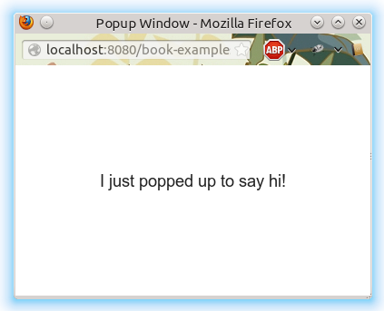
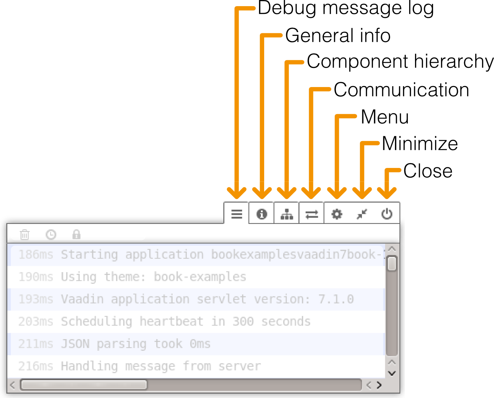
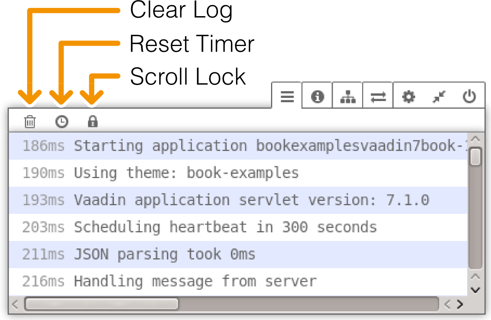
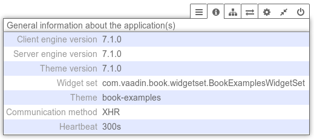
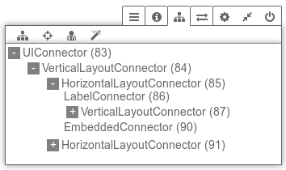
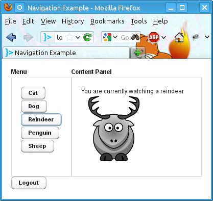
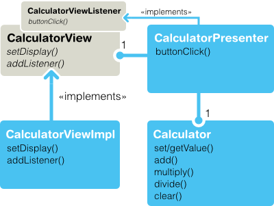
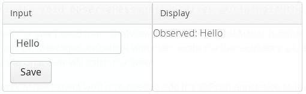

This chapter covers various features and topics often needed in
applications.

Handling Browser Windows {#advanced.windows}
========================

The UI of a Vaadin application runs in a web page displayed in a browser
window or tab. An application can be used from multiple UIs in different
windows or tabs, either opened by the user using an URL or by the Vaadin
application.

In addition to native browser windows, Vaadin has a `Window` component,
which is a floating panel or *sub-window* inside a page, as described in
?.

-   Native popup windows
    . An application can open popup windows for sub-tasks.
-   Page-based browsing
    . The application can allow the user to open certain content to
    different windows. For example, in a messaging application, it can
    be useful to open different messages to different windows so that
    the user can browse through them while writing a new message.
-   Bookmarking
    . Bookmarks in the web browser can provide an entry-point to some
    content provided by an application.
-   Embedding UIs
    . UIs can be embedded in web pages, thus making it possible to
    provide different views to an application from different pages or
    even from the same page, while keeping the same session. See
    .

Use of multiple windows in an application may require defining and
providing different UIs for the different windows. The UIs of an
application share the same user session, that is, the `VaadinSession`
object, as described in ?. Each UI is identified by a URL that is used
to access it, which makes it possible to bookmark application UIs. UI
instances can even be created dynamically based on the URLs or other
request parameters, such as browser information, as described in ?.

Because of the special nature of AJAX applications, use of multiple
windows uses require some caveats.

Opening Popup Windows {#advanced.windows.popup}
---------------------

popup windows
windows
popup
Popup windows are native browser windows or tabs opened by user
interaction with an existing window. Due to browser security reasons, it
is made incovenient for a web page to open popup windows using
JavaScript commands. At the least, the browser will ask for a permission
to open the popup, if it is possible at all. This limitation can be
circumvented by letting the browser open the new window or tab directly
by its URL when the user clicks some target. This is realized in Vaadin
with the `BrowserWindowOpener` component extension, which causes the
browser to open a window or tab when the component is clicked.

### The Popup Window UI {#advanced.windows.popup.ui}

A popup Window displays an `UI`. The UI of a popup window is defined
just like a main UI in a Vaadin application, and it can have a theme,
title, and so forth.

For example:

    @Theme("book-examples")
    public static class MyPopupUI extends UI {
        @Override
        protected void init(VaadinRequest request) {
            getPage().setTitle("Popup Window");
            
            // Have some content for it
            VerticalLayout content = new VerticalLayout();
            Label label =
                new Label("I just popped up to say hi!");
            label.setSizeUndefined();
            content.addComponent(label);
            content.setComponentAlignment(label,
                Alignment.MIDDLE_CENTER);
            content.setSizeFull();
            setContent(content);
        }
    }

### Popping It Up {#advanced.windows.popup.popping}

A popup window is opened using the `BrowserWindowOpener` extension,
which you can attach to any component. The constructor of the extension
takes the class object of the UI class to be opened as a parameter.

You can configure the features of the popup window with setFeatures().
It takes as its parameter a comma-separated list of window features, as
defined in the HTML specification.

`status`=`0|1`
:   Whether the status bar at the bottom of the window should be
    enabled.

````

:   

`scrollbars`
:   Enables scrollbars in the window if the document area is bigger than
    the view area of the window.

`resizable`
:   Allows the user to resize the browser window (no effect for tabs).

`menubar`
:   Enables the browser menu bar.

`location`
:   Enables the location bar.

`toolbar`
:   Enables the browser toolbar.

`height`=`value`
:   Specifies the height of the window in pixels.

`width`=`value`
:   Specifies the width of the window in pixels.

For example:

    // Create an opener extension
    BrowserWindowOpener opener =
        new BrowserWindowOpener(MyPopupUI.class);
    opener.setFeatures("height=200,width=300,resizable");

    // Attach it to a button
    Button button = new Button("Pop It Up");
    opener.extend(button);

The resulting popup window, which appears when the button is clicked, is
shown in ?.



### Popup Window Name (Target) {#advanced.windows.popup.target}

The target name is one of the default HTML target names (`_new`,
`_blank`, `_top`, etc.) or a custom target name. How the window is
exactly opened depends on the browser. Browsers that support tabbed
browsing can open the window in another tab, depending on the browser
settings.

### URL and Session {#advanced.windows.popup.url}

The URL path for a popup window UI is by default determined from the UI
class name, by prefixig it with "`popup/`". For example, for the example
UI giver earlier, the URL would be
`/book-examples/book/popup/MyPopupUI`.

Closing Popup Windows {#advanced.windows.popup-closing}
---------------------

Besides closing popup windows from a native window close button, you can
close them programmatically by calling the JavaScript close() method as
follows.

    public class MyPopup extends UI {
        @Override
        protected void init(VaadinRequest request) {
            setContent(new Button("Close Window", event -> {// Java 8
                // Close the popup
                JavaScript.eval("close()");

                // Detach the UI from the session
                getUI().close();
            }));
        }
    }

Embedding UIs in Web Pages {#advanced.embedding}
==========================

Many web sites are not all Vaadin, but Vaadin UIs are used only for
specific functionalities. In practice, many web applications are a
mixture of dynamic web pages, such as JSP, and Vaadin UIs embedded in
such pages.

Embedding Vaadin UIs in web pages is easy and there are several
different ways to embed them. One is to have a `<div>` placeholder for
the UI and load the Vaadin Client-Side Engine with some simple
JavaScript code. Another method is even easier, which is to simply use
the `<iframe>` element. Both of these methods have advantages and
disadvantages. One disadvantage of the `<iframe>` method is that the
size of the `<iframe>` element is not flexible according to the content
while the `<div>` method allows such flexibility. The following sections
look closer into these two embedding methods.

Embedding Inside a `div` Element {#advanced.embedding.div}
--------------------------------

You can embed one or more Vaadin UIs inside a web page with a method
that is equivalent to loading the initial page content from the Vaadin
servlet in a non-embedded UI. Normally, the `VaadinServlet` generates an
initial page that contains the correct parameters for the specific UI.
You can easily configure it to load multiple Vaadin UIs in the same
page. They can have different widget sets and different themes.

Embedding an UI requires the following basic tasks:

-   Set up the page header
-   Include a GWT history frame in the page
-   Call the
    vaadinBootstrap.js
    file
-   Define the
    \<div\>
    element for the UI
-   Configure and initialize the UI

Notice that you can view the loader page for the UI easily by opening
the UI in a web browser and viewing the HTML source code of the page.
You could just copy and paste the embedding code from the page, but some
modifications and additional settings are required, mainly related to
the URLs that have to be made relative to the page instead of the
servlet URL.

*The DIV embedding API is about to change soon after printing this book
edition. A tutorial that describes the feature should be made available
at the Vaadin website.*

### The Head Matter {#advanced.embedding.div.head}

The HTML page in which the Vaadin UI is embedded should be a valid HTML
5 document. The content of the head element is largely up to you. The
character encoding must be UTF-8. Some meta declarations are necessary
for compatibility. You can also set the page favicon in the head
element.

    <!DOCTYPE html>
    <html>
      <head>
        <meta http-equiv="Content-Type"
              content="text/html; charset=UTF-8" />
        <meta http-equiv="X-UA-Compatible"
              content="IE=9;chrome=1" />

        <title>This is my Embedding Page</title>
      
        <!-- Set up the favicon from the Vaadin theme -->
        <link rel="shortcut icon" type="image/vnd.microsoft.icon"
              href="/VAADIN/themes/reindeer/favicon.ico" />
        <link rel="icon" type="image/vnd.microsoft.icon"
                 href="/VAADIN/themes/reindeer/favicon.ico" /> 
      </head>

### The Body Matter {#advanced.embedding.div.body}

The page content must include some Vaadin-related definitions before you
can embed Vaadin UIs in it.

The `vaadinBootstrap.js` script makes definitions for starting up the
UI. It must be called before initializing the UI. The source path must
be relative to the path of the embedding page.

    <body>
      <script type="text/javascript"
              src="./VAADIN/vaadinBootstrap.js"></script>

The bootstrap script is served by the Vaadin servlet from inside the
`vaadin-server` JAR.

Vaadin, or more precisely GWT, requires an invisible history frame,
which is used for tracking the page or fragment history in the browser.

      <iframe tabindex="-1" id="__gwt_historyFrame"
              style="position: absolute; width: 0; height: 0;
                     border: 0; overflow: hidden"
              src="javascript:false"></iframe>

### UI Placeholder Element {#advanced.embedding.div.div}

A Vaadin UI is embedded in a placeholder `<div>` element. It should have
the following features:

-   The
    \<div\>
    element must have an
    id
    attribute, which must be a unique ID in the page, normally something
    that identifies the servlet of the UI uniquely.
-   It must have at least the
    v-app
    style class.
-   it should have a nested
    \<div\>
    element with
    v-app-loading
    style class. This is a placeholder for the loading indicator that is
    displayed while the UI is being loaded.
-   It should also contain a
    \<noscript\>
    element that is shown if the browser does not support JavaScript or
    it has been disabled. The content of the element should instruct the
    use to enable JavaScript in the browser.

The placeholder element can include style settings, typically a width
and height. If the sizes are not defined, the UI will have an undefined
size in the particular dimension, which must be in accordance with the
sizing of the UI components.

For example:

    <div style="width: 300px; border: 2px solid green;"
         id="helloworldui" class="v-app">
      <div class="v-app-loading"></div>
      <noscript>You have to enable javascript in your browser to
                use an application built with Vaadin.</noscript>
    </div>

### Initializing the UI {#advanced.embedding.div.init}

The UI is loaded by calling the `initApplication()` method for the
`vaadin` object defined in the bootstrap script. Before calling it, you
should check that the bootstrap script was loaded properly.

    <script type="text/javascript">//<![CDATA[
      if (!window.vaadin)
          alert("Failed to load the bootstrap JavaScript:"+
                "VAADIN/vaadinBootstrap.js");

The `initApplication()` takes two parameters. The first parameter is the
UI identifier, exactly as given as the `id` attribute of the placeholder
element. The second parameter is an associative map that contains
parameters for the UI.

The map must contain the following items:

`browserDetailsUrl`

:   This should be the URL path (relative to the embedding page) to the
    Vaadin servlet of the UI. It is used by the bootstrap to communicate
    browser details. A trailing slash may be needed in some cases.

    Notice that this parameter is not included in the loader page
    generated by the servlet, because in that case, it can default to
    the current URL.

`serviceUrl`

:   This is used for server requests after initial loading and should be
    same as for `browserDetailsUrl`. The two parameters are redundant
    and either may be removed in future.

`widgetset`
:   This should be the exact class name of the widget set for the UI,
    that is, without the
    .gwt.xml
    file name extension. If the UI has no custom widget set, you can use
    the
    com.vaadin.DefaultWidgetSet
    .

`theme`
:   Name of the theme, such as one of the built-in themes (
    reindeer
    ,
    runo
    , or
    chameleon
    ) or a custom theme. It must exist under the
    VAADIN/themes
    folder.

`versionInfo`
:   This parameter is itself an associative map that can contain two
    parameters:
    vaadinVersion
    contains the version number of the Vaadin version used by the
    application. The
    applicationVersion
    parameter contains the version of the particular application. The
    contained parameters are optional, but the
    versionInfo
    parameter itself is not.

`vaadinDir`
:   Relative path to the
    VAADIN
    directory. It is relative to the URL of the embedding page.

`heartbeatInterval`
:   The
    hearbeatInterval
    parameter defines the frequency of the keep-alive hearbeat for the
    UI in seconds, as described in
    .

`debug`
:   The parameter defines whether the debug window, as described in
    , is enabled.

`standalone`
:   This parameter should be
    false
    when embedding.
    The parameter defines whether the UI is rendered on its own in the
    browser window or in some context. A standalone UI may do things
    that might interfere with other parts of the page, such as change
    the page title and request focus when it is loaded. When embedding,
    the UI is not standalone.

`authErrMsg`, `comErrMsg`, and `sessExpMsg`
:   These three parameters define the client-side error messages for
    authentication error, communication error, and session expiration,
    respectively. The parameters are associative maps themselves and
    must contain two key-value pairs:
    message
    , which should contain the error text in HTML, and
    caption
    , which should be the error caption.

For example:

      vaadin.initApplication("helloworldui", {
          "browserDetailsUrl": "helloworld/",
          "serviceUrl": "helloworld/",
          "widgetset": "com.example.MyWidgetSet",
          "theme": "mytheme",
          "versionInfo": {"vaadinVersion": "7.0.0"},
          "vaadinDir": "VAADIN/",
          "heartbeatInterval": 300,
          "debug": true,
          "standalone": false,
          "authErrMsg": {
              "message": "Take note of any unsaved data, "+
                         "and <u>click here<\/u> to continue.",
              "caption": "Authentication problem"
          },
          "comErrMsg": {
              "message": "Take note of any unsaved data, "+
                         "and <u>click here<\/u> to continue.",
              "caption": "Communication problem"
          },
          "sessExpMsg": {
              "message": "Take note of any unsaved data, "+
                         "and <u>click here<\/u> to continue.",
              "caption": "Session Expired"
          }
      });//]]>
    </script>

Notice that many of the parameters are normally deployment parameters,
specified in the deployment descriptor, as described in ?.

### Summary of Div Embedding {#advanced.embedding.div.summary}

Below is a complete example of embedding an UI in a `<div>` element.

    <?xml version="1.0" encoding="UTF-8" ?>
    <!DOCTYPE html>
    <html>
    <head>
      <meta http-equiv="Content-Type"
            content="text/html; charset=UTF-8" />
      <meta http-equiv="X-UA-Compatible"
            content="IE=9;chrome=1" />

      <title>Embedding a Vaadin Application in HTML Page</title>
      
      <!-- Set up the favicon from the Vaadin theme -->
      <link rel="shortcut icon" type="image/vnd.microsoft.icon"
            href="/VAADIN/themes/reindeer/favicon.ico" />
      <link rel="icon" type="image/vnd.microsoft.icon"
               href="/VAADIN/themes/reindeer/favicon.ico" /> 
    </head>

    <body>
      <!-- Loads the Vaadin widget set, etc. -->
      <script type="text/javascript"
              src="VAADIN/vaadinBootstrap.js"></script>

      <!-- GWT requires an invisible history frame. It is   -->
      <!-- needed for page/fragment history in the browser. -->
      <iframe tabindex="-1" id="__gwt_historyFrame"
              style="position: absolute; width: 0; height: 0;
                     border: 0; overflow: hidden"
              src="javascript:false"></iframe>  

      <h1>Embedding a Vaadin UI</h1>
        
      <p>This is a static web page that contains an embedded Vaadin
         application. It's here:</p>

      <!-- So here comes the div element in which the Vaadin -->
      <!-- application is embedded.                          -->
      <div style="width: 300px; border: 2px solid green;"
           id="helloworld" class="v-app">

        <!-- Optional placeholder for the loading indicator -->
        <div class=" v-app-loading"></div>

        <!-- Alternative fallback text -->
        <noscript>You have to enable javascript in your browser to
                  use an application built with Vaadin.</noscript>
      </div>
      
      <script type="text/javascript">//<![CDATA[
        if (!window.vaadin)
            alert("Failed to load the bootstrap JavaScript: "+
                  "VAADIN/vaadinBootstrap.js");

        /* The UI Configuration */
        vaadin.initApplication("helloworld", {
            "browserDetailsUrl": "helloworld/",
            "serviceUrl": "helloworld/",
            "widgetset": "com.example.MyWidgetSet",
            "theme": "mytheme",
            "versionInfo": {"vaadinVersion": "7.0.0"},
            "vaadinDir": "VAADIN/",
            "heartbeatInterval": 300,
            "debug": true,
            "standalone": false,
            "authErrMsg": {
                "message": "Take note of any unsaved data, "+
                           "and <u>click here<\/u> to continue.",
                "caption": "Authentication problem"
            },
            "comErrMsg": {
                "message": "Take note of any unsaved data, "+
                           "and <u>click here<\/u> to continue.",
                "caption": "Communication problem"
            },
            "sessExpMsg": {
                "message": "Take note of any unsaved data, "+
                           "and <u>click here<\/u> to continue.",
                "caption": "Session Expired"
            }
        });//]] >
      </script>
      
      <p>Please view the page source to see how embedding works.</p>
    </body>
    </html>

Embedding Inside an `iframe` Element {#advanced.embedding.iframe}
------------------------------------

Embedding a Vaadin UI inside an `<iframe>` element is even easier than
the method described above, as it does not require definition of any
Vaadin specific definitions.

You can embed an UI with an element such as the following:

    <iframe src="/myapp/myui"></iframe>

The `<iframe>` elements have several downsides for embedding. One is
that their size of is not flexible depending on the content of the
frame, but the content must be flexible to accommodate in the frame. You
can set the size of an `<iframe>` element with `height` and `width`
attributes. Other issues arise from themeing and communication with the
frame content and the rest of the page.

Below is a complete example of using the `<iframe>` to embed two
applications in a web page.

    <!DOCTYPE html>
    <html>
      <head>
        <title>Embedding in IFrame</title>
      </head>

      <body style="background: #d0ffd0;">
        <h1>This is a HTML page</h1>
        <p>Below are two Vaadin applications embedded inside
           a table:</p>

        <table align="center" border="3">
          <tr>
            <th>The Calculator</th>
            <th>The Color Picker</th>
          </tr>
          <tr valign="top">
            <td>
              <iframe src="/vaadin-examples/Calc" height="200"
                      width="150" frameborder="0"></iframe>
            </td>
            <td>
              <iframe src="/vaadin-examples/colorpicker"
                      height="330" width="400"
                      frameborder="0"></iframe>
            </td>
          </tr>
        </table>
      </body>
    </html>

The page will look as shown in ? below.


You can embed almost anything in an iframe, which essentially acts as a
browser window. However, this creates various problems. The iframe must
have a fixed size, inheritance of CSS from the embedding page is not
possible, and neither is interaction with JavaScript, which makes
mashups impossible, and so on. Even bookmarking with URI fragments will
not work.

Note also that websites can forbid iframe embedding by specifying an
`X-Frame-Options: SAMEORIGIN` header in the HTTP response.

Cross-Site Embedding with the Vaadin XS Add-on {#advanced.embedding.xs}
----------------------------------------------

*The XS add-on is currently not available for Vaadin 7.*

In the previous sections, we described the two basic methods for
embedding Vaadin applications: in a `<div>` element and in an
`<iframe>`. One problem with div embedding is that it does not work
between different Internet domains, which is a problem if you want to
have your website running in one server and your Vaadin application in
another. The security model in browsers effectively prevents such
cross-site embedding of Ajax applications by enforcing the *same origin
policy* for XmlHttpRequest calls, even if the server is running in the
same domain but different port. While iframe is more permissive,
allowing embedding almost anything in anywhere, it has many
disadvantanges, as described earlier.

The Vaadin XS (Cross-Site) add-on works around the limitation in div
embedding by using JSONP-style communication instead of the standard
XmlHttpRequests.

Embedding is done simply with:

      <script src="http://demo.vaadin.com/xsembed/getEmbedJs"
              type="text/javascript"></script>

This includes an automatically generated embedding script in the page,
thereby making embedding effortless.

This assumes that the main layout of the application has undefined
height. If the height is 100%, you have to wrap it inside an element
with a defined height. For example:

     <div style="height: 500px;">
      <script src="http://demo.vaadin.com/xsembed/getEmbedJs"
              type="text/javascript"></script>
    </div>

It is possible to restrict where the application can be embedded by
using a whitelist. The add-on also encrypts the client-server
communication, which is more important for embedded applications than
usual.

You can get the Vaadin XS add-on from Vaadin Directory. It is provided
as a Zip package. Download and extract the installation package to a
local folder. Instructions for installation and further information is
given in the `README.html` file in the package.

Some restrictions apply. You can have only one embedded application in
one page. Also, some third-party libraries may interfere with the
communication. Other notes are given in the README.

Debug Mode and Window {#advanced.debug}
=====================

Vaadin applications can be run in two modes: *debug mode* and
*production mode*. The debug mode, which is on by default, enables a
number of built-in debug features for Vaadin developers:

-   Debug Window
-   Display debug information in the Debug Window and server console
-   On-the-fly compilation of Sass themes

Enabling the Debug Mode {#advanced.debug.mode}
-----------------------

The debug mode is enabled and production mode disabled by default in the
UI templates created with the Eclipse plugin or the Maven archetypes.
The debug mode can be enabled by giving a `productionMode=false`
parameter to the Vaadin servlet configuration:

    @VaadinServletConfiguration(
                productionMode = false,
                ui = MyprojectUI.class)

Or with a context parameter in the `web.xml` deployment descriptor:

    <context-param>
      <description>Vaadin production mode</description>
      <param-name>productionMode</param-name>
      <param-value>false</param-value>
    </context-param>

Enabling the production mode disables the debug features, thereby
preventing users from easily inspecting the inner workings of the
application from the browser.

Opening the Debug Window {#advanced.debug.open}
------------------------

Running an application in the debug mode enables the client-side Debug
Window in the browser. You can open the Debug Window by adding
"[?debug](?debug)" parameter to the URL of the UI, for example,
<http://localhost:8080/myapp/?debug>. The Debug Window has buttons for
controlling the debugging features and a scrollable log of debug
messages.



The functionalities are described in detail in the subsequent sections.
You can move the window by dragging it from the title bar and resize it
from the corners. The Minimize button minimizes the debug window in the
corner of the browser window, and the Close button closes it.

If you use the Firebug plugin for Firefox or the Developer Tools console
in Chrome, the log messages will also be printed to the Firebug console.
In such a case, you may want to enable client-side debugging without
showing the Debug Window with "[?debug=quiet](?debug=quiet)" in the URL.
In the quiet debug mode, log messages will only be printed to the
console of the browser debugger.

Debug Message Log {#advanced.debug.log}
-----------------

The debug message log displays client-side debug messages, with time
counter in milliseconds. The control buttons allow you to clear the log,
reset the timer, and lock scrolling.



### Logging to Debug Window {#advanced.debug.log.custom}

You can take advantage of the debug mode when developing client-side
components, by using the standard Java `Logger` to write messages to the
log. The messages will be written to the debug window and Firebug
console. No messages are written if the debug window is not open or if
the application is running in production mode.

General Information {#advanced.debug.info}
-------------------

The General information about the application(s) tab displays various
information about the UI, such as version numbers of the client and
servlet engine, and the theme. If they do not match, you may need to
compile the widget set or theme.



Inspecting Component Hierarchy {#advanced.debug.hierarchy}
------------------------------

The Component Hierarchy tab has several sub-modes that allow debugging
the component tree in various ways.

### Connector Hierarchy Tree {#advanced.debug.hierarchy.tree}

The Show the connector hierarchy tree button displays the client-side
connector hierarchy. As explained in ?, client-side widgets are managed
by connectors that handle communication with the server-side component
counterparts. The connector hierarchy therefore corresponds with the
server-side component tree, but the client-side widget tree and HTML DOM
tree have more complexity.



Clicking on a connector highlights the widget in the UI.

### Inspecting a Component {#advanced.debug.hierarchy.inspect}

The Select a component in the page to inspect it button lets you select
a component in the UI by clicking it and display its client-side
properties.

To view the HTML structure and CSS styles in more detail, you can use
Firebug in Firefox, or the Developer Tools in Chrome, as described in ?.
Firefox also has a built-in feature for inspecting HTML and CSS.

### Analyzing Layout Problems {#advanced.debug.hierarchy.analyze}

The Check layouts for potential problems button analyzes the currently
visible UI and makes a report of possible layout related problems. All
detected layout problems are displayed in the log and also printed to
the console.


Clicking on a reported problem highlights the component with the problem
in the UI.

The most common layout problem is caused by placing a component that has
a relative size inside a container (layout) that has undefined size in
the particular direction (height or width). For example, adding a
`Button` with 100% width inside a `VerticalLayout` with undefined width.
In such a case, the error would look as shown in ?.

`CustomLayout` components can not be analyzed in the same way as other
layouts. For custom layouts, the button analyzes all contained
relative-sized components and checks if any relative dimension is
calculated to zero so that the component will be invisible. The error
log will display a warning for each of these invisible components. It
would not be meaningful to emphasize the component itself as it is not
visible, so when you select such an error, the parent layout of the
component is emphasized if possible.

### Displaying Used Connectors {#advanced.debug.hierarchy.used}

The last button, Show used connectors and how to optimize widget set,
displays a list of all currently visible connectors. It also generates a
connector bundle loader factory, which you can use to optimize the
widget set so that it only contains the widgets actually used in the UI.
Note, however, that it only lists the connectors visible in the current
UI state, and you usually have more connectors than that.

Communication Log {#advanced.debug.communication}
-----------------

The Communication tab displays all server requests. You can unfold the
requests to view defails, such as the connectors involved. Clicking on a
connector highlights the corresponding element in the UI.

You can use Firebug or Developer Tools in Firefox or Chrome,
respectively, to get more detailed information about the requests and
responses.

Debug Modes {#advanced.debug.devmodes}
-----------

The Menu tab in the window opens a sub-menu to select various settings.
Here you can also launch the GWT SuperDevMode, as described in ?.

Request Handlers {#advanced.requesthandler}
================

Request handlers are useful for catching request parameters or
generating dynamic content, such as HTML, images, PDF, or other content.
You can provide HTTP content also with stream resources, as described in
?. The stream resources, however, are only usable from within a Vaadin
application, such as in an `Image` component. Request handlers allow
responding to HTTP requests made with the application URL, including GET
or POST parameters. You could also use a separate servlet to generate
dynamic content, but a request handler is associated with the user
session and it can easily access data associated with the session and
the user.

To handle requests, you need to implement the RequestHandler interface.
The handleRequest() method gets the session, request, and response
objects as parameters.

If the handler writes a response, it must return `true`. This stops
running other possible request handlers. Otherwise, it should return
`false` so that another handler could return a response. Eventually, if
no other handler writes a response, a UI will be created and
initialized.

In the following example, we catch requests for a sub-path in the URL
for the servlet and write a plain text response. The servlet path
consists of the context path and the servlet (sub-)path. Any additional
path is passed to the request handler in the `pathInfo` of the request.
For example, if the full path is `/myapp/myui/rhexample`, the path info
will be `/rhexample`. Also, request parameters are available.

    // A request handler for generating some content
    VaadinSession.getCurrent().addRequestHandler(
            new RequestHandler() {
        @Override
        public boolean handleRequest(VaadinSession session,
                                     VaadinRequest request,
                                     VaadinResponse response)
                throws IOException {
            if ("/rhexample".equals(request.getPathInfo())) {
                // Generate a plain text document
                response.setContentType("text/plain");
                response.getWriter().append(
                   "Here's some dynamically generated content.\n");
                response.getWriter().format(Locale.ENGLISH,
                   "Time: %Tc\n", new Date());
                
                // Use shared session data
                response.getWriter().format("Session data: %s\n",
                    session.getAttribute("mydata"));
                
                return true; // We wrote a response
            } else
                return false; // No response was written
        }
    });

A request handler can be used by embedding it in a page or opening a new
page with a link or a button. In the following example, we pass some
data to the handler through a session attribute.

    // Input some shared data in the session
    TextField dataInput = new TextField("Some data");
    dataInput.addValueChangeListener(event ->
        VaadinSession.getCurrent().setAttribute("mydata",
            event.getProperty().getValue()));
    dataInput.setValue("Here's some");

    // Determine the base bath for the servlet
    String servletPath = VaadinServlet.getCurrent()
            .getServletContext().getContextPath()
            + "/book"; // Servlet

    // Display the page in a pop-up window
    Link open = new Link("Click to Show the Page",
        new ExternalResource(servletPath + "/rhexample"),
        "_blank", 500, 350, BorderStyle.DEFAULT);

    layout.addComponents(dataInput, open);

Shortcut Keys {#advanced.shortcuts}
=============

Vaadin provides simple ways for defining shortcut keys for field
components and a default button, and a lower-level generic shortcut key
binding API based on actions.

Shortcut Keys for Default Buttons {#advanced.shortcuts.defaultbutton}
---------------------------------

You can add or set a *click shortcut* to a button to set it as "default"
button; pressing the defined key, typically Enter, in any component in
the window causes a click event for the button.

You can define a click shortcut with the setClickShortcut() shorthand
method:

    // Have an OK button and set it as the default button
    Button ok = new Button("OK");
    ok.setClickShortcut(KeyCode.ENTER);
    ok.addStyleName(Reindeer.BUTTON_DEFAULT);

The `BUTTON_DEFAULT` style name highlights a button to show the default
button status; usually with a bolder font than usual, depending on the
theme. The result can be seen in ?.


Field Focus Shortcuts {#advanced.shortcuts.focus}
---------------------

You can define a shortcut key that sets the focus to a field component
(any component that inherits `AbstractField`) by adding a
`FocusShortcut` as a shortcut listener to the field. .

The constructor of the `FocusShortcut` takes the field component as its
first parameter, followed by the key code, and an optional list of
modifier keys, as listed in ?.

    // A field with Alt+N bound to it
    TextField name = new TextField("Name (Alt+N)");
    name.addShortcutListener(
            new AbstractField.FocusShortcut(name, KeyCode.N,
                                            ModifierKey.ALT));
    layout.addComponent(name);

You can also specify the shortcut by a shorthand notation, where the
shortcut key is indicated with an ampersand (`&`).

    // A field with Alt+A bound to it, using shorthand notation
    TextField address = new TextField("Address (Alt+A)");
    address.addShortcutListener(
            new AbstractField.FocusShortcut(address, "&Address"));

This is especially useful for internationalization, so that you can
determine the shortcut key from the localized string.

Generic Shortcut Actions {#advanced.shortcuts.actions}
------------------------

Shortcut keys can be defined as *actions* using the `ShortcutAction`
class. It extends the generic `Action` class that is used for example in
`Tree` and `Table` for context menus. Currently, the only classes that
accept `ShortcutAction`s are `Window` and `Panel`.

To handle key presses, you need to define an action handler by
implementing the `Handler` interface. The interface has two methods that
you need to implement: getActions() and handleAction().

The getActions() method must return an array of `Action` objects for the
component, specified with the second parameter for the method, the
`sender` of an action. For a keyboard shortcut, you use a
`ShortcutAction`. The implementation of the method could be following:

``` {.java}
// Have the unmodified Enter key cause an event
Action action_ok = new ShortcutAction("Default key",
        ShortcutAction.KeyCode.ENTER, null);

// Have the C key modified with Alt cause an event
Action action_cancel = new ShortcutAction("Alt+C",
        ShortcutAction.KeyCode.C,
        new int[] { ShortcutAction.ModifierKey.ALT });

Action[] actions = new Action[] {action_cancel, action_ok};

public Action[] getActions(Object target, Object sender) {
    if (sender == myPanel)
        return actions;

    return null;
}
```

The returned `Action` array may be static or you can create it
dynamically for different senders according to your needs.

The constructor of `ShortcutAction` takes a symbolic caption for the
action; this is largely irrelevant for shortcut actions in their current
implementation, but might be used later if implementors use them both in
menus and as shortcut actions. The second parameter is the key code and
the third a list of modifier keys, which are listed in ?.

The following example demonstrates the definition of a default button
for a user interface, as well as a normal shortcut key, <span
class="keycombo">Alt+C</span> for clicking the Cancel button.

``` {.java}
public class DefaultButtonExample extends CustomComponent
                                  implements Handler {
    // Define and create user interface components
    Panel panel = new Panel("Login");
    FormLayout formlayout = new FormLayout();
    TextField username = new TextField("Username");
    TextField password = new TextField("Password");
    HorizontalLayout buttons = new HorizontalLayout();

    // Create buttons and define their listener methods.
    Button ok = new Button("OK", this, "okHandler");
    Button cancel = new Button("Cancel", this, "cancelHandler");

    // Have the unmodified Enter key cause an event
    Action action_ok = new ShortcutAction("Default key",
            ShortcutAction.KeyCode.ENTER, null);

    // Have the C key modified with Alt cause an event
    Action action_cancel = new ShortcutAction("Alt+C",
            ShortcutAction.KeyCode.C,
            new int[] { ShortcutAction.ModifierKey.ALT });

    public DefaultButtonExample() {
        // Set up the user interface
        setCompositionRoot(panel);
        panel.addComponent(formlayout);
        formlayout.addComponent(username);
        formlayout.addComponent(password);
        formlayout.addComponent(buttons);
        buttons.addComponent(ok);
        buttons.addComponent(cancel);

        // Set focus to username
        username.focus();

        // Set this object as the action handler
        panel.addActionHandler(this);
    }

    /**
     * Retrieve actions for a specific component. This method
     * will be called for each object that has a handler; in
     * this example just for login panel. The returned action
     * list might as well be static list.
     */
    public Action[] getActions(Object target, Object sender) {
        System.out.println("getActions()");
        return new Action[] { action_ok, action_cancel };
    }

    /**
     * Handle actions received from keyboard. This simply directs
     * the actions to the same listener methods that are called
     * with ButtonClick events.
     */
    public void handleAction(Action action, Object sender,
                             Object target) {
        if (action == action_ok) {
            okHandler();
        }
        if (action == action_cancel) {
            cancelHandler();
        }
    }

    public void okHandler() {
        // Do something: report the click
        formlayout.addComponent(new Label("OK clicked. "
                + "User=" + username.getValue() + ", password="
                + password.getValue()));
    }

    public void cancelHandler() {
        // Do something: report the click
        formlayout.addComponent(new Label("Cancel clicked. User="
                + username.getValue() + ", password="
                + password.getValue()));
    }
}
```

Notice that the keyboard actions can currently be attached only to
`Panel`s and `Window`s. This can cause problems if you have components
that require a certain key. For example, multi-line `TextField` requires
the Enter key. There is currently no way to filter the shortcut actions
out while the focus is inside some specific component, so you need to
avoid such conflicts.

Supported Key Codes and Modifier Keys {#advanced.shortcuts.keycodes}
-------------------------------------

The shortcut key definitions require a key code to identify the pressed
key and modifier keys, such as Shift, Alt, or Ctrl, to specify a key
combination.

The key codes are defined in the `ShortcutAction.KeyCode` interface and
are:

Keys `A` to `Z`
:   Normal letter keys

`F1` to `F12`

:   Function keys

`BACKSPACE`, `DELETE`, `ENTER`, `ESCAPE`, `INSERT`, `TAB`

:   Control keys

`NUM0` to `NUM9`

:   Number pad keys

`ARROW_DOWN`, `ARROW_UP`, `ARROW_LEFT`, `ARROW_RIGHT`

:   Arrow keys

`HOME`, `END`, `PAGE_UP`, `PAGE_DOWN`

:   Other movement keys

Modifier keys are defined in `ShortcutAction.ModifierKey` and are:

`ModifierKey.ALT`
:   Alt key

`ModifierKey.CTRL`
:   Ctrl key

`ModifierKey.SHIFT`
:   Shift key

All constructors and methods accepting modifier keys take them as a
variable argument list following the key code, separated with commas.
For example, the following defines a <span
class="keycombo">Ctrl+Shift+N</span> key combination for a shortcut.

    TextField name = new TextField("Name (Ctrl+Shift+N)");
    name.addShortcutListener(
            new AbstractField.FocusShortcut(name, KeyCode.N,
                                            ModifierKey.CTRL,
                                            ModifierKey.SHIFT));

### Supported Key Combinations

The actual possible key combinations vary greatly between browsers, as
most browsers have a number of built-in shortcut keys, which can not be
used in web applications. For example, Mozilla Firefox allows binding
almost any key combination, while Opera does not even allow binding Alt
shortcuts. Other browsers are generally in between these two. Also, the
operating system can reserve some key combinations and some computer
manufacturers define their own system key combinations.

Printing {#advanced.printing}
========

printing
Vaadin does not have any special support for printing. There are two
basic ways to print - in a printer controlled by the application server
or by the user from the web browser. Printing in the application server
is largely independent of the UI, you just have to take care that
printing commands do not block server requests, possibly by running the
print commands in another thread.

print() JavaScript print() For client-side printing, most browsers
support printing the web page. You can either print the current or a
special print page that you open. The page can be styled for printing
with special CSS rules, and you can hide unwanted elements. You can also
print other than Vaadin UI content, such as HTML or PDF.

Printing the Browser Window {#advanced.printing.browserwindow}
---------------------------

Vaadin does not have special support for launching the printing in
browser, but you can easily use the JavaScript print() method that opens
the print window of the browser.

JavaScript
execute()
    Button print = new Button("Print This Page");
    print.addClickListener(new Button.ClickListener() {
        public void buttonClick(ClickEvent event) {
            // Print the current page
            JavaScript.getCurrent().execute("print();");
        }
    });

The button in the above example would print the current page, including
the button itself. You can hide such elements in CSS, as well as
otherwise style the page for printing. Style definitions for printing
are defined inside a `@media print {}` block in CSS.

Opening a Print Window {#advanced.printing.opening}
----------------------

You can open a browser window with a special UI for print content and
automatically launch printing the content.

    public static class PrintUI extends UI {
        @Override
        protected void init(VaadinRequest request) {
            // Have some content to print
            setContent(new Label(
                "<h1>Here's some dynamic content</h1>\n" +
                "<p>This is to be printed.</p>",
                ContentMode.HTML));
            
            // Print automatically when the window opens
            JavaScript.getCurrent().execute(
                "setTimeout(function() {" +
                "  print(); self.close();}, 0);");
        }
    }
    ...

    // Create an opener extension
    BrowserWindowOpener opener =
            new BrowserWindowOpener(PrintUI.class);
    opener.setFeatures("height=200,width=400,resizable");
        
    // A button to open the printer-friendly page.
    Button print = new Button("Click to Print");
    opener.extend(print);

How the browser opens the window, as an actual (popup) window or just a
tab, depends on the browser. After printing, we automatically close the
window with JavaScript close() call.

Printing PDF {#advanced.printing.pdf}
------------

PDF To print content as PDF, you need to provide the downloadable
content as a static or a dynamic resource, such as a `StreamResource`.

You can let the user open the resource using a `Link` component, or some
other component with a `PopupWindowOpener` extension. When such a link
or opener is clicked, the browser opens the PDF in the browser, in an
external viewer (such as Adobe Reader), or lets the user save the
document.

It is crucial to notice that clicking a `Link` or a `PopupWindowOpener`
is a client-side operation. If you get the content of the dynamic PDF
from the same UI state, you can not have the link or opener enabled, as
then clicking it would not get the current UI content. Instead, you have
to create the resource object before the link or opener are clicked.
This usually requires a two-step operation, or having the print
operation available in another view.

    // A user interface for a (trivial) data model from which
    // the PDF is generated.
    final TextField name = new TextField("Name");
    name.setValue("Slartibartfast");

    // This has to be clicked first to create the stream resource
    final Button ok = new Button("OK");

    // This actually opens the stream resource
    final Button print = new Button("Open PDF");
    print.setEnabled(false);

    ok.addClickListener(new ClickListener() {
        @Override
        public void buttonClick(ClickEvent event) {
            // Create the PDF source and pass the data model to it
            StreamSource source =
                new MyPdfSource((String) name.getValue());
            
            // Create the stream resource and give it a file name
            String filename = "pdf_printing_example.pdf";
            StreamResource resource =
                    new StreamResource(source, filename);
            
            // These settings are not usually necessary. MIME type
            // is detected automatically from the file name, but
            // setting it explicitly may be necessary if the file
            // suffix is not ".pdf".
            resource.setMIMEType("application/pdf");
            resource.getStream().setParameter(
                    "Content-Disposition",
                    "attachment; filename="+filename);

            // Extend the print button with an opener
            // for the PDF resource
            BrowserWindowOpener opener =
                    new BrowserWindowOpener(resource);
            opener.extend(print);
          
            name.setEnabled(false);
            ok.setEnabled(false);
            print.setEnabled(true);
        }
    });

    layout.addComponent(name);
    layout.addComponent(ok);
    layout.addComponent(print);

Google App Engine Integration {#advanced.gae}
=============================

*This section is not yet fully updated to Vaadin 7.*

Vaadin includes support to run Vaadin applications in the Google App
Engine (GAE). The most essential requirement for GAE is the ability to
serialize the application state. Vaadin applications are serializable
through the `java.io.Serializable` interface.

To run as a GAE application, an application must use `GAEVaadinServlet`
instead of `VaadinServlet`, and of course implement the
`java.io.Serializable` interface for all persistent classes. You also
need to enable session support in `appengine-web.xml` with:

    <sessions-enabled>true</sessions-enabled>

The Vaadin Project wizard can create the configuration files needed for
GAE deployment. See ?. When the Google App Engine deployment
configuration is selected, the wizard will create the project structure
following the GAE Servlet convention instead of the regular Servlet
convention. The main differences are:

-   Source directory:
    src/main/java
-   Output directory:
    war/WEB-INF/classes
-   Content directory:
    war

Running Vaadin applications in Google App Engine has the following rules
and limitations:

-   Avoid using the session for storage, usual App Engine limitations
    apply (no synchronization, that is, it is unreliable).

-   Vaadin uses memcache for mutex, the key is of the form
    `_vmutex<sessionid>`.

-   The Vaadin `WebApplicationContext` class is serialized separately
    into memcache and datastore; the memcache key is `_vac<sessionid>`
    and the datastore entity kind is `_vac` with identifiers of the type
    `_vac<sessionid>`.

-   *Do not* update the application state when serving an
    `ConnectorResource` (such as `ClassResource`.getStream()).

-   *Avoid* (or be very careful when) updating application state in a
    `TransactionListener` - it is called even when the application is
    not locked and won't be serialized (such as with
    `ConnectorResource`), and changes can therefore be lost (it should
    be safe to update things that can be safely discarded later, that
    is, valid only for the current request).

-   The application remains locked during uploads - a progress bar is
    not possible.

Common Security Issues {#advanced.security}
======================

Sanitizing User Input to Prevent Cross-Site Scripting {#advanced.security.sanitizing}
-----------------------------------------------------

You can put raw HTML content in many components, such as the `Label` and
`CustomLayout`, as well as in tooltips and notifications. In such cases,
you should make sure that if the content has any possibility to come
from user input, you must make sure that the content is safe before
displaying it. Otherwise, a malicious user can easily make a [cross-site
scripting attack](#) by injecting offensive JavaScript code in such
components. See other sources for more information about cross-site
scripting.

Offensive code can easily be injected with `<script>` markup or in tag
attributes as events, such as `onLoad`. Cross-site scripting
vulnerabilities are browser dependent, depending on the situations in
which different browsers execute scripting markup.

Therefore, if the content created by one user is shown to other users,
the content must be sanitized. There is no generic way to sanitize user
input, as different applications can allow different kinds of input.
Pruning (X)HTML tags out is somewhat simple, but some applications may
need to allow (X)HTML content. It is therefore the responsibility of the
application to sanitize the input.

Character encoding can make sanitization more difficult, as offensive
tags can be encoded so that they are not recognized by a sanitizer. This
can be done, for example, with HTML character entities and with
variable-width encodings such as UTF-8 or various CJK encodings, by
abusing multiple representations of a character. Most trivially, you
could input `<` and `>` with `&lt;` and `&gt;`, respectively. The input
could also be malformed and the sanitizer must be able to interpret it
exactly as the browser would, and different browsers can interpret
malformed HTML and variable-width character encodings differently.

Notice that the problem applies also to user input from a `RichTextArea`
is transmitted as HTML from the browser to server-side and is not
sanitized. As the entire purpose of the `RichTextArea` component is to
allow input of formatted text, you can not just remove all HTML tags.
Also many attributes, such as `style`, should pass through the
sanitization.

Navigating in an Application {#advanced.navigator}
============================

Plain Vaadin applications do not have normal web page navigation as they
usually run on a single page, as all Ajax applications do. Quite
commonly, however, applications have different views between which the
user should be able to navigate. The `Navigator` in Vaadin can be used
for most cases of navigation. Views managed by the navigator
automatically get a distinct URI fragment, which can be used to be able
to bookmark the views and their states and to go back and forward in the
browser history.

Setting Up for Navigation {#advanced.navigator.navigating}
-------------------------

The `Navigator` class manages a collection of *views* that implement the
View interface. The views can be either registered beforehand or
acquired from a *view provider*. When registering, the views must have a
name identifier and be added to a navigator with addView(). You can
register new views at any point. Once registered, you can navigate to
them with navigateTo().

`Navigator` manages navigation in a component container, which can be
either a ComponentContainer (most layouts) or a SingleComponentContainer
(`UI`, `Panel`, or `Window`). The component container is managed through
a ViewDisplay. Two view displays are defined:
`ComponentContainerViewDisplay` and
`SingleComponentContainerViewDisplay`, for the respective component
container types. Normally, you can let the navigator create the view
display internally, as we do in the example below, but you can also
create it yourself to customize it.

Let us consider the following UI with two views: start and main. Here,
we define their names with enums to be typesafe. We manage the
navigation with the UI class itself, which is a
SingleComponentContainer.

    public class NavigatorUI extends UI {
        Navigator navigator;
        protected static final String MAINVIEW = "main";

        @Override
        protected void init(VaadinRequest request) {
            getPage().setTitle("Navigation Example");
            
            // Create a navigator to control the views
            navigator = new Navigator(this, this);
            
            // Create and register the views
            navigator.addView("", new StartView());
            navigator.addView(MAINVIEW, new MainView());
        }
    }

The `Navigator` automatically sets the URI fragment of the application
URL. It also registers a URIFragmentChangedListener in the page (see ?)
to show the view identified by the URI fragment if entered or navigated
to in the browser. This also enables browser navigation history in the
application.

### View Providers {#advanced.navigator.navigating.viewprovider}

You can create new views dynamically using a *view provider* that
implements the ViewProvider interface. A provider is registered in
`Navigator` with addProvider().

The ClassBasedViewProvider is a view provider that can dynamically
create new instances of a specified view class based on the view name.

The StaticViewProvider returns an existing view instance based on the
view name. The addView() in `Navigator` is actually just a shorthand for
creating a static view provider for each registered view.

### View Change Listeners {#advanced.navigator.navigating.viewchangelistener}

You can handle view changes also by implementing a ViewChangeListener
and adding it to a `Navigator`. When a view change occurs, a listener
receives a `ViewChangeEvent` object, which has references to the old and
the activated view, the name of the activated view, as well as the
fragment parameters.

Implementing a View {#advanced.navigator.view}
-------------------

Views can be any objects that implement the View interface. When the
navigateTo() is called for the navigator, or the application is opened
with the URI fragment associated with the view, the navigator switches
to the view and calls its enter() method.

To continue with the example, consider the following simple start view
that just lets the user to navigate to the main view. It only pops up a
notification when the user navigates to it and displays the navigation
button.

    /** A start view for navigating to the main view */
    public class StartView extends VerticalLayout implements View {
        public StartView() {
            setSizeFull();

            Button button = new Button("Go to Main View",
                    new Button.ClickListener() {
                @Override
                public void buttonClick(ClickEvent event) {
                    navigator.navigateTo(MAINVIEW);
                }
            });
            addComponent(button);
            setComponentAlignment(button, Alignment.MIDDLE_CENTER);
        }        
            
        @Override
        public void enter(ViewChangeEvent event) {
            Notification.show("Welcome to the Animal Farm");
        }
    }

You can initialize the view content in the constructor, as was done in
the example above, or in the enter() method. The advantage with the
latter method is that the view is attached to the view container as well
as to the UI at that time, which is not the case in the constructor.

Handling URI Fragment Path {#advanced.navigator.urifragment}
--------------------------

URI fragment part of a URL is the part after a hash `#` character. Is
used for within-UI URLs, because it is the only part of the URL that can
be changed with JavaScript from within a page without reloading the
page. The URLs with URI fragments can be used for hyperlinking and
bookmarking, as well as browser history, just like any other URLs. In
addition, an exclamation mark `#!` after the hash marks that the page is
a stateful AJAX page, which can be crawled by search engines. Crawling
requires that the application also responds to special URLs to get the
searchable content. URI fragments are managed by `Page`, which provides
a low-level API.

URI fragments can be used with `Navigator` in two ways: for navigating
to a view and to a state within a view. The URI fragment accepted by
navigateTo() can have the view name at the root, followed by fragment
parameters after a slash ("`/`"). These parameters are passed to the
enter() method in the View.

In the following example, we implement within-view navigation. Here we
use the following declarative design for the view:

    <v-vertical-layout size-full>
      <v-horizontal-layout size-full :expand>
        <v-panel caption="List of Equals" height-full width-auto>
          <v-vertical-layout _id="menuContent" width-auto margin/>
        </v-panel>

        <v-panel _id="equalPanel" caption="An Equal" size-full :expand/>
      </v-horizontal-layout>

      <v-button _id="logout">Logout</v-button>
    </v-vertical-layout>

The view's logic code would be as follows:

    /** Main view with a menu (with declarative layout design) */
    @DesignRoot
    public class MainView extends VerticalLayout implements View {
        // Menu navigation button listener
        class ButtonListener implements Button.ClickListener {
            String menuitem;
            public ButtonListener(String menuitem) {
                this.menuitem = menuitem;
            }

            @Override
            public void buttonClick(ClickEvent event) {
                // Navigate to a specific state
                navigator.navigateTo(MAINVIEW + "/" + menuitem);
            }
        }
        
        VerticalLayout menuContent;
        Panel equalPanel;
        Button logout;

        public MainView() {
            Design.read(this);

            menuContent.addComponent(new Button("Pig",
                      new ButtonListener("pig")));
            menuContent.addComponent(new Button("Cat",
                      new ButtonListener("cat")));
            menuContent.addComponent(new Button("Dog",      
                      new ButtonListener("dog")));
            menuContent.addComponent(new Button("Reindeer",
                      new ButtonListener("reindeer")));
            menuContent.addComponent(new Button("Penguin",
                      new ButtonListener("penguin")));
            menuContent.addComponent(new Button("Sheep",
                      new ButtonListener("sheep")));

            // Allow going back to the start
            logout.addClickListener(event -> // Java 8
                navigator.navigateTo(""));
        }        
        
        @DesignRoot
        class AnimalViewer extends VerticalLayout {
            Label watching;
            Embedded pic;
            Label back;
            
            public AnimalViewer(String animal) {
                Design.read(this);
                
                watching.setValue("You are currently watching a " +
                                  animal);
                pic.setSource(new ThemeResource(
                    "img/" + animal + "-128px.png"));
                back.setValue("and " + animal +
                    " is watching you back");
            }
        }

        @Override
        public void enter(ViewChangeEvent event) {
            if (event.getParameters() == null
                || event.getParameters().isEmpty()) {
                equalPanel.setContent(
                    new Label("Nothing to see here, " +
                              "just pass along."));
                return;
            } else
                equalPanel.setContent(new AnimalViewer(
                    event.getParameters()));
        }
    }

The animal sub-view would have the following declarative design:

    <v-vertical-layout size-full>
      <v-label _id="watching" size-auto :middle :center/>
      <v-embedded _id="pic" :middle :center :expand/>
      <v-label _id="back" size-auto :middle :center/>
    </v-vertical-layout>

The main view is shown in ?. At this point, the URL would be
`http://localhost:8080/myapp#!main/reindeer`.



Advanced Application Architectures {#advanced.architecture}
==================================

In this section, we continue from the basic application architectures
described in ? and discuss some of the more advanced patterns that are
often used in Vaadin applications.

Layered Architectures {#advanced.architecture.layering}
---------------------

Layered architectures, where each layer has a clearly distinct
responsibility, are probably the most common architectures. Typically,
applications follow at least a three-layer architecture:

-   User interface (or presentation) layer
-   Domain layer
-   Data store layer

Such an architecture starts from a *domain model*, which defines the
data model and the "business logic" of the application, typically as
beans or POJOs. A user interface is built on top of the domain model, in
our context with the Vaadin Framework. The Vaadin user interface could
be bound directly to the data model through the Vaadin Data Model,
described in ?. Beneath the domain model lies a data store, such as a
relational database. The dependencies between the layers are restricted
so that a higher layer may depend on a lower one, but never the other
way around.


An *application layer* (or *service layer*) is often distinguished from
the domain layer, offering the domain logic as a service, which can be
used by the user interface layer, as well as for other uses. In Java EE
development, Enterprise JavaBeans (EJBs) are typically used for building
this layer.

An *infrastructure layer* (or *data access layer*) is often
distinguished from the data store layer, with a purpose to abstract the
data store. For example, it could involve a persistence solution such as
JPA and an EJB container. This layer becomes relevant with Vaadin when
binding Vaadin components to data with the JPAContainer, as described in
?.

Model-View-Presenter Pattern {#advanced.architecture.mvp}
----------------------------

The Model-View-Presenter (MVP) pattern is one of the most common
patterns in developing large applications with Vaadin. It is similar to
the older Model-View-Controller (MVC) pattern, which is not as
meaningful in Vaadin development. Instead of an implementation-aware
controller, there is an implementation-agnostic presenter that operates
the view through an interface. The view does not interact directly with
the model. This isolates the view implementation better than in MVC and
allows easier unit testing of the presenter and model.



? illustrates the MVP pattern with a simple calculator. The domain model
is realized in the `Calculator` class, which includes a data model and
some model logic operations. The `CalculatorViewImpl` is a Vaadin
implementation of the view, defined in the CalculatorView interface. The
`CalculatorPresenter` handles the user interface logic. User interaction
events received in the view are translated into
implementation-independent events for the presenter to handle (the view
implementation could also just call the presenter).

Let us first look how the model and view are bound together by the
presenter in the following example:

    // Create the model and the Vaadin view implementation
    CalculatorModel    model = new CalculatorModel();
    CalculatorViewImpl view  = new CalculatorViewImpl();
        
    // The presenter binds the model and view together
    new CalculatorPresenter(model, view);
        
    // The view implementation is a Vaadin component
    layout.addComponent(view);

You could add the view anywhere in a Vaadin application, as it is a
composite component.

### The Model {#advanced.architecture.mvp.model}

Our business model is quite simple, with one value and a number of
operations for manipulating it.

    /** The model **/
    class CalculatorModel {
        private double value = 0.0;
        
        public void clear() {
            value = 0.0;
        }

        public void add(double arg) {
            value += arg;
        }

        public void multiply(double arg) {
            value *= arg;
        }

        public void divide(double arg) {
            if (arg != 0.0)
                value /= arg;
        }
        
        public double getValue() {
            return value;
        }
        
        public void setValue(double value) {
            this.value = value;
        }
    }

### The View {#advanced.architecture.mvp.view}

The purpose of the view in MVP is to display data and receive user
interaction. It relays the user interaction to the presenter in an
fashion that is independent of the view implementation, that is, no
Vaadin events. It is defined as a UI framework interface that can have
multiple implementations.

    interface CalculatorView {
        public void setDisplay(double value);

        interface CalculatorViewListener {
            void buttonClick(char operation);
        }
        public void addListener(CalculatorViewListener listener);
    }

The are design alternatives for the view. It could receive the listener
in its constructor, or it could just know the presenter. Here, we
forward button clicks as an implementation-independent event.

As we are using Vaadin, we make a Vaadin implementation of the interface
as follows:

    class CalculatorViewImpl extends CustomComponent
            implements CalculatorView, ClickListener {
        private Label display = new Label("0.0");

        public CalculatorViewImpl() {
            GridLayout layout  = new GridLayout(4, 5);

            // Create a result label that spans over all
            // the 4 columns in the first row
            layout.addComponent(display, 0, 0, 3, 0);
        
            // The operations for the calculator in the order
            // they appear on the screen (left to right, top
            // to bottom)
            String[] operations = new String[] {
                "7", "8", "9", "/", "4", "5", "6",
                "*", "1", "2", "3", "-", "0", "=", "C", "+" };

            // Add buttons and have them send click events
            // to this class
            for (String caption: operations)
                layout.addComponent(new Button(caption, this));

            setCompositionRoot(layout);
        }
        
        public void setDisplay(double value) {
            display.setValue(Double.toString(value));
        }

        /* Only the presenter registers one listener... */
        List<CalculatorViewListener> listeners =
                new ArrayList<CalculatorViewListener>();

        public void addListener(CalculatorViewListener listener) {
            listeners.add(listener);
        }

        /** Relay button clicks to the presenter with an
         *  implementation-independent event */
        @Override
        public void buttonClick(ClickEvent event) {
            for (CalculatorViewListener listener: listeners)
                listener.buttonClick(event.getButton()
                                     .getCaption().charAt(0));
        }
    }

### The Presenter {#advanced.architecture.mvp.presenter}

The presenter in MVP is a middle-man that handles all user interaction
logic, but in an implementation-independent way, so that it doesn't
actually know anything about Vaadin. It shows data in the view and
receives user interaction back from it.

    class CalculatorPresenter
            implements CalculatorView.CalculatorViewListener {
        CalculatorModel model;
        CalculatorView  view;

        private double current = 0.0;
        private char   lastOperationRequested = 'C';
        
        public CalculatorPresenter(CalculatorModel model,
                                   CalculatorView  view) {
            this.model = model;
            this.view  = view;
            
            view.setDisplay(current);            
            view.addListener(this);
        }

        @Override
        public void buttonClick(char operation) {
            // Handle digit input
            if ('0' <= operation && operation <= '9') {
                current = current * 10
                        + Double.parseDouble("" + operation);
                view.setDisplay(current);
                return;
            }

            // Execute the previously input operation
            switch (lastOperationRequested) {
            case '+':
                model.add(current);
                break;
            case '-':
                model.add(-current);
                break;
            case '/':
                model.divide(current);
                break;
            case '*':
                model.multiply(current);
                break;
            case 'C':
                model.setValue(current);
                break;
            } // '=' is implicit

            lastOperationRequested = operation;

            current = 0.0;
            if (operation == 'C')
                model.clear();
            view.setDisplay(model.getValue());
        }
    }

In the above example, we held some state information in the presenter.
Alternatively, we could have had an intermediate controller between the
presenter and the model to handle the low-level button logic.

Managing URI Fragments {#advanced.urifu}
======================

A major issue in AJAX applications is that as they run in a single web
page, bookmarking the application URL (or more generally the *URI*) can
only bookmark the application, not an application state. This is a
problem for many applications, such as product catalogs and discussion
forums, in which it would be good to provide links to specific products
or messages. Consequently, as browsers remember the browsing history by
URI, the history and the Back button do not normally work. The solution
is to use the *fragment identifier* part of the URI, which is separated
from the primary part (address + path + optional query parameters) of
the URI with the hash (\#) character. For example:

    http://example.com/path#myfragment

The exact syntax of the fragment identifier part is defined in RFC 3986
(Internet standard STD 66) that defines the URI syntax. A fragment may
only contain the regular URI *path characters* (see the standard) and
additionally the slash and the question mark.

Vaadin offers two ways to enable the use of URI fragments: the
high-level `Navigator` utility described in ? and the low-level API
described here.

Setting the URI Fragment {#advanced.urifu.setting}
------------------------

You can set the current fragment identifier with the setUriFragment()
method in the `Page` object.

    Page.getCurrent().setUriFragment("mars");

Setting the URI fragment causes an UriFragmentChangeEvent, which is
processed in the same server request. As with UI rendering, the URI
fragment is changed in the browser after the currently processed server
request returns the response.

Prefixing the fragment identifier with an exclamation mark enables the
web crawler support described in ?.

Reading the URI Fragment {#advanced.urifu.reading}
------------------------

The current URI fragment can be acquired with the getUriFragment()
method from the current `Page` object. The fragment is known when the
init() method of the UI is called.

    // Read initial URI fragment to create UI content
    String fragment = getPage().getUriFragment();
    enter(fragment);

To enable reusing the same code when the URI fragment is changed, as
described next, it is usually best to build the relevant part of the UI
in a separate method. In the above example, we called an enter() method,
in a way that is similar to handling view changes with `Navigator`.

Listening for URI Fragment Changes {#advanced.urifu.listening}
----------------------------------

After the UI has been initialized, changes in the URI fragment can be
handled with a UriFragmentChangeListener. The listeners are called when
the URI fragment changes, but not when the UI is initialized, where the
current fragment is available from the page object as described earlier.

For example, we could define the listener as follows in the init()
method of a UI class:

    public class MyUI extends UI {
        @Override
        protected void init(VaadinRequest request) {
            getPage().addUriFragmentChangedListener(
                   new UriFragmentChangedListener() {
               public void uriFragmentChanged(
                       UriFragmentChangedEvent source) {
                   enter(source.getUriFragment());
                }
            });

            // Read the initial URI fragment
            enter(getPage().getUriFragment());
        }

        void enter(String fragment) {
            ... initialize the UI ...
        }
    }

? shows an application that allows specifying the menu selection with a
URI fragment and correspondingly sets the fragment when the user selects
a menu item.


Supporting Web Crawling {#advanced.urifu.crawling}
-----------------------

Stateful AJAX applications can not normally be crawled by a search
engine, as they run in a single page and a crawler can not navigate the
states even if URI fragments are enabled. The Google search engine and
crawler [support a convention](#) where the fragment identifiers are
prefixed with exclamation mark, such as `#!myfragment`. The servlet
needs to have a separate searchable content page accessible with the
same URL, but with a `_escaped_fragment_` parameter. For example, for
`/myapp/myui#!myfragment` it would be
`/myapp/myui?_escaped_fragment_=myfragment`.

You can provide the crawl content by overriding the service() method in
a custom servlet class. For regular requests, you should call the super
implementation in the `VaadinServlet` class.

    public class MyCustomServlet extends VaadinServlet
        @Override
        protected void service(HttpServletRequest request,
                               HttpServletResponse response)
                throws ServletException, IOException {
            String fragment = request
                .getParameter("_escaped_fragment_");
            if (fragment != null) {
                response.setContentType("text/html");
                Writer writer = response.getWriter();
                writer.append("<html><body>"+
                    "<p>Here is some crawlable "+
                    "content about " + fragment + "</p>");
                
                // A list of all crawlable pages
                String items[] = {"mercury", "venus",
                                  "earth", "mars"};
                writer.append("<p>Index of all content:</p><ul>");
                for (String item: items) {
                    String url = request.getContextPath() +
                        request.getServletPath() +
                        request.getPathInfo() + "#!" + item;
                    writer.append("<li><a href='" + url + "'>" +
                                  item + "</a></li>");
                }
                writer.append("</ul></body>");
            } else
                super.service(request, response);
        }
    }

The crawlable content does not need to be human readable. It can provide
an index of links to other application states, as we did in the example
above. The links should use the "`#!`" notation, but can not be relative
to avoid having the `_escaped_fragment_` parameter.

You need to use the custom servlet class in the `web.xml` deployment
descriptor instead of the normal `VaadinServlet` class, as described in
?.

Drag and Drop {#advanced.dragndrop}
=============

Drag and Drop
Dragging an object from one location to another by grabbing it with
mouse, holding the mouse button pressed, and then releasing the button
to "drop" it to the other location is a common way to move, copy, or
associate objects. For example, most operating systems allow dragging
and dropping files between folders or dragging a document on a program
to open it. In Vaadin, it is possible to drag and drop components and
parts of certain components.

Dragged objects, or *transferables*, are essentially data objects. You
can drag and drop rows in `Table` and nodes in `Tree` components, either
within or between the components. You can also drag entire components by
wrapping them inside `DragAndDropWrapper`.

Dragging starts from a *drag source*, which defines the transferable.
Transferables implement the `Transferable` interfaces. For trees and
tables, which are bound to `Container` data sources, a node or row
transferable is a reference to an `Item` in the Vaadin Data Model.
Dragged components are referenced with a `WrapperTransferable`. Starting
dragging does not require any client-server communication, you only need
to enable dragging. All drag and drop logic occurs in two operations:
determining (*accepting*) where dropping is allowed and actually
dropping. Drops can be done on a *drop target*, which implements the
`DropTarget` interface. Three components implement the interface:
`Tree`, `Table`, and `DragAndDropWrapper`. These accept and drop
operations need to be provided in a *drop handler*. Essentially all you
need to do to enable drag and drop is to enable dragging in the drag
source and implement the getAcceptCriterion() and drop() methods in the
`DropHandler` interface.

The client-server architecture of Vaadin causes special requirements for
the drag and drop functionality. The logic for determining where a
dragged object can be dropped, that is, *accepting* a drop, should
normally be done on the client-side, in the browser. Server
communications are too slow to have much of such logic on the
server-side. The drag and drop feature therefore offers a number of ways
to avoid the server communications to ensure a good user experience.

Handling Drops {#advanced.dragndrop.drophandler}
--------------

Most of the user-defined drag and drop logic occurs in a *drop handler*,
which is provided by implementing the drop() method in the `DropHandler`
interface. A closely related definition is the drop accept criterion,
which is defined in the getAcceptCriterion() method in the same
interface. It is described in ? later.

The drop() method gets a `DragAndDropEvent` as its parameters. The event
object provides references to two important object: `Transferable` and
`TargetDetails`.

A `Transferable` contains a reference to the object (component or data
item) that is being dragged. A tree or table item is represented as a
`TreeTransferable` or `TableTransferable` object, which carries the item
identifier of the dragged tree or table item. These special
transferables, which are bound to some data in a container, are
`DataBoundTransferable`. Dragged components are represented as
`WrapperTransferable` objects, as the components are wrapped in a
`DragAndDropWrapper`.

The `TargetDetails` object provides information about the exact location
where the transferable object is being dropped. The exact class of the
details object depends on the drop target and you need to cast it to the
proper subclass to get more detailed information. If the target is
selection component, essentially a tree or a table, the
`AbstractSelectTargetDetails` object tells the item on which the drop is
being made. For trees, the `TreeTargetDetails` gives some more details.
For wrapped components, the information is provided in a
`WrapperDropDetails` object. In addition to the target item or
component, the details objects provide a *drop location*. For selection
components, the location can be obtained with the getDropLocation() and
for wrapped components with verticalDropLocation() and
horizontalDropLocation(). The locations are specified as either
`VerticalDropLocation` or `HorizontalDropLocation` objects. The drop
location objects specify whether the transferable is being dropped
above, below, or directly on (at the middle of) a component or item.

Dropping on a `Tree`, `Table`, and a wrapped component is explained
further in the following sections.

Dropping Items On a `Tree` {#advanced.dragndrop.treedrop}
--------------------------

You can drag items from, to, or within a `Tree`. Making tree a drag
source requires simply setting the drag mode with setDragMode(). `Tree`
currently supports only one drag mode, `TreeDragMode.NODE`, which allows
dragging single tree nodes. While dragging, the dragged node is
referenced with a `TreeTransferable` object, which is a
`DataBoundTransferable`. The tree node is identified by the item ID of
the container item.

When a transferable is dropped on a tree, the drop location is stored in
a `TreeTargetDetails` object, which identifies the target location by
item ID of the tree node on which the drop is made. You can get the item
ID with getItemIdOver() method in `AbstractSelectTargetDetails`, which
the `TreeTargetDetails` inherits. A drop can occur directly on or above
or below a node; the exact location is a `VerticalDropLocation`, which
you can get with the getDropLocation() method.

In the example below, we have a `Tree` and we allow reordering the tree
items by drag and drop.

    final Tree tree = new Tree("Inventory");
    tree.setContainerDataSource(TreeExample.createTreeContent());
    layout.addComponent(tree);
            
    // Expand all items
    for (Iterator<?> it = tree.rootItemIds().iterator(); it.hasNext();)
        tree.expandItemsRecursively(it.next());
            
    // Set the tree in drag source mode
    tree.setDragMode(TreeDragMode.NODE);
            
    // Allow the tree to receive drag drops and handle them
    tree.setDropHandler(new DropHandler() {
        public AcceptCriterion getAcceptCriterion() {
            return AcceptAll.get();
        }

        public void drop(DragAndDropEvent event) {
            // Wrapper for the object that is dragged
            Transferable t = event.getTransferable();
            
            // Make sure the drag source is the same tree
            if (t.getSourceComponent() != tree)
                return;
            
            TreeTargetDetails target = (TreeTargetDetails)
                event.getTargetDetails();

            // Get ids of the dragged item and the target item
            Object sourceItemId = t.getData("itemId");
            Object targetItemId = target.getItemIdOver();

            // On which side of the target the item was dropped 
            VerticalDropLocation location = target.getDropLocation();
            
            HierarchicalContainer container = (HierarchicalContainer)
            tree.getContainerDataSource();

            // Drop right on an item -> make it a child
            if (location == VerticalDropLocation.MIDDLE)
                tree.setParent(sourceItemId, targetItemId);

            // Drop at the top of a subtree -> make it previous
            else if (location == VerticalDropLocation.TOP) {
                Object parentId = container.getParent(targetItemId);
                container.setParent(sourceItemId, parentId);
                container.moveAfterSibling(sourceItemId, targetItemId);
                container.moveAfterSibling(targetItemId, sourceItemId);
            }
            
            // Drop below another item -> make it next 
            else if (location == VerticalDropLocation.BOTTOM) {
                Object parentId = container.getParent(targetItemId);
                container.setParent(sourceItemId, parentId);
                container.moveAfterSibling(sourceItemId, targetItemId);
            }
        }
    });

### Accept Criteria for Trees

`Tree` defines some specialized accept criteria for trees.

`TargetInSubtree` (client-side)
:   Accepts if the target item is in the specified sub-tree. The
    sub-tree is specified by the item ID of the root of the sub-tree in
    the constructor. The second constructor includes a depth parameter,
    which specifies how deep from the given root node are drops
    accepted. Value
    -1
    means infinite, that is, the entire sub-tree, and is therefore the
    same as the simpler constructor.

`TargetItemAllowsChildren` (client-side)
:   Accepts a drop if the tree has
    setChildrenAllowed()
    enabled for the target item. The criterion does not require
    parameters, so the class is a singleton and can be acquired with
    Tree.TargetItemAllowsChildren.get()
    . For example, the following composite criterion accepts drops only
    on nodes that allow children, but between all nodes:
        return new Or (Tree.TargetItemAllowsChildren.get(), new Not(VerticalLocationIs.MIDDLE));

`TreeDropCriterion` (server-side)
:   Accepts drops on only some items, which as specified by a set of
    item IDs. You must extend the abstract class and implement the
    getAllowedItemIds()
    to return the set. While the criterion is server-side, it is
    lazy-loading, so that the list of accepted target nodes is loaded
    only once from the server for each drag operation. See
    for an example.

In addition, the accept criteria defined in `AbstractSelect` are
available for a `Tree`, as listed in ?.

Dropping Items On a `Table` {#advanced.dragndrop.tabledrop}
---------------------------

You can drag items from, to, or within a `Table`. Making table a drag
source requires simply setting the drag mode with setDragMode(). `Table`
supports dragging both single rows, with `TableDragMode.ROW`, and
multiple rows, with `TableDragMode.MULTIROW`. While dragging, the
dragged node or nodes are referenced with a `TreeTransferable` object,
which is a `DataBoundTransferable`. Tree nodes are identified by the
item IDs of the container items.

When a transferable is dropped on a table, the drop location is stored
in a `AbstractSelectTargetDetails` object, which identifies the target
row by its item ID. You can get the item ID with getItemIdOver() method.
A drop can occur directly on or above or below a row; the exact location
is a `VerticalDropLocation`, which you can get with the
getDropLocation() method from the details object.

### Accept Criteria for Tables

`Table` defines one specialized accept criterion for tables.

`TableDropCriterion` (server-side)
:   Accepts drops only on (or above or below) items that are specified
    by a set of item IDs. You must extend the abstract class and
    implement the
    getAllowedItemIds()
    to return the set. While the criterion is server-side, it is
    lazy-loading, so that the list of accepted target items is loaded
    only once from the server for each drag operation.

Accepting Drops {#advanced.dragndrop.acceptcriteria}
---------------

Drag and Drop
Accept Criteria
You can not drop the objects you are dragging around just anywhere.
Before a drop is possible, the specific drop location on which the mouse
hovers must be *accepted*. Hovering a dragged object over an accepted
location displays an *accept indicator*, which allows the user to
position the drop properly. As such checks have to be done all the time
when the mouse pointer moves around the drop targets, it is not feasible
to send the accept requests to the server-side, so drops on a target are
normally accepted by a client-side *accept criterion*.

A drop handler must define the criterion on the objects which it accepts
to be dropped on the target. The criterion needs to be provided in the
`getAcceptCriterion()` method of the `DropHandler` interface. A
criterion is represented in an `AcceptCriterion` object, which can be a
composite of multiple criteria that are evaluated using logical
operations. There are two basic types of criteria: *client-side* and
*server-side criteria*. The various built-in criteria allow accepting
drops based on the identity of the source and target components, and on
the *data flavor* of the dragged objects.

To allow dropping any transferable objects, you can return a universal
accept criterion, which you can get with AcceptAll.get().

    tree.setDropHandler(new DropHandler() {
        public AcceptCriterion getAcceptCriterion() {
            return AcceptAll.get();
        }
        ...

### Client-Side Criteria

The *client-side criteria*, which inherit the `ClientSideCriterion`, are
verified on the client-side, so server requests are not needed for
verifying whether each component on which the mouse pointer hovers would
accept a certain object.

The following client-side criteria are define in
com.vaadin.event.dd.acceptcriterion:

`AcceptAll`
:   Accepts all transferables and targets.

`And`
:   Performs the logical AND operation on two or more client-side
    criteria; accepts the transferable if all the given sub-criteria
    accept it.

`ContainsDataFlavour`
:   The transferable must contain the defined data flavour.

`Not`
:   Performs the logical NOT operation on a client-side criterion;
    accepts the transferable if and only if the sub-criterion does not
    accept it.

`Or`
:   Performs the logical OR operation on two or more client-side
    criteria; accepts the transferable if any of the given sub-criteria
    accepts it.

`SourceIs`
:   Accepts all transferables from any of the given source components

`SourceIsTarget`
:   Accepts the transferable only if the source component is the same as
    the target. This criterion is useful for ensuring that items are
    dragged only within a tree or a table, and not from outside it.

`TargetDetailIs`
:   Accepts any transferable if the target detail, such as the item of a
    tree node or table row, is of the given data flavor and has the
    given value.

In addition, target components such as `Tree` and `Table` define some
component-specific client-side accept criteria. See ? for more details.

`AbstractSelect` defines the following criteria for all selection
components, including `Tree` and `Table`.

`AcceptItem`
:   Accepts only specific items from a specific selection component. The
    selection component, which must inherit
    AbstractSelect
    , is given as the first parameter for the constructor. It is
    followed by a list of allowed item identifiers in the drag source.

`AcceptItem.ALL`
:   Accepts all transferables as long as they are items.

`TargetItemIs`
:   Accepts all drops on the specified target items. The constructor
    requires the target component (
    AbstractSelect
    ) followed by a list of allowed item identifiers.

`VerticalLocationIs.MIDDLE`, `TOP`, and `BOTTOM`
:   The three static criteria accepts drops on, above, or below an item.
    For example, you could accept drops only in between items with the
    following:
        public AcceptCriterion getAcceptCriterion() {
            return new Not(VerticalLocationIs.MIDDLE);
        }

### Server-Side Criteria

The *server-side criteria* are verified on the server-side with the
accept() method of the `ServerSideCriterion` class. This allows fully
programmable logic for accepting drops, but the negative side is that it
causes a very large amount of server requests. A request is made for
every target position on which the pointer hovers. This problem is eased
in many cases by the component-specific lazy loading criteria
`TableDropCriterion` and `TreeDropCriterion`. They do the server visit
once for each drag and drop operation and return all accepted rows or
nodes for current `Transferable` at once.

The accept() method gets the drag event as a parameter so it can perform
its logic much like in drop().

    public AcceptCriterion getAcceptCriterion() {
        // Server-side accept criterion that allows drops on any other
        // location except on nodes that may not have children
        ServerSideCriterion criterion = new ServerSideCriterion() {
            public boolean accept(DragAndDropEvent dragEvent) {
                TreeTargetDetails target = (TreeTargetDetails)
                    dragEvent.getTargetDetails();

                // The tree item on which the load hovers
                Object targetItemId = target.getItemIdOver();

                // On which side of the target the item is hovered
                VerticalDropLocation location = target.getDropLocation();
                if (location == VerticalDropLocation.MIDDLE)
                    if (! tree.areChildrenAllowed(targetItemId))
                        return false; // Not accepted

                return true; // Accept everything else
            }
        };
        return criterion;
    }

The server-side criteria base class `ServerSideCriterion` provides a
generic accept() method. The more specific `TableDropCriterion` and
`TreeDropCriterion` are conveniency extensions that allow definiting
allowed drop targets as a set of items. They also provide some
optimization by lazy loading, which reduces server communications
significantly.

    public AcceptCriterion getAcceptCriterion() {
        // Server-side accept criterion that allows drops on any
        // other tree node except on node that may not have children
        TreeDropCriterion criterion = new TreeDropCriterion() {
            @Override
            protected Set<Object> getAllowedItemIds(
                    DragAndDropEvent dragEvent, Tree tree) {
                HashSet<Object> allowed = new HashSet<Object>();
                for (Iterator<Object> i =
                       tree.getItemIds().iterator(); i.hasNext();) {
                    Object itemId = i.next();
                    if (tree.hasChildren(itemId))
                        allowed.add(itemId);
                }
                return allowed;
            }
        };
        return criterion;
    }

### Accept Indicators

When a dragged object hovers on a drop target, an *accept indicator* is
displayed to show whether or not the location is accepted. For `MIDDLE`
location, the indicator is a box around the target (tree node, table
row, or component). For vertical drop locations, the accepted locations
are shown as horizontal lines, and for horizontal drop locations as
vertical lines.

For `DragAndDropWrapper` drop targets, you can disable the accept
indicators or *drag hints* with the `no-vertical-drag-hints`,
`no-horizontal-drag-hints`, and `no-box-drag-hints` styles. You need to
add the styles to the *layout that contains* the wrapper, not to the
wrapper itself.

    // Have a wrapper
    DragAndDropWrapper wrapper = new DragAndDropWrapper(c);
    layout.addComponent(wrapper);

    // Disable the hints
    layout.addStyleName("no-vertical-drag-hints");
    layout.addStyleName("no-horizontal-drag-hints");
    layout.addStyleName("no-box-drag-hints");

Dragging Components
-------------------

Dragging a component requires wrapping the source component within a
`DragAndDropWrapper`. You can then allow dragging by putting the wrapper
(and the component) in drag mode with setDragStartMode(). The method
supports two drag modes: `DragStartMode.WRAPPER` and
`DragStartMode.COMPONENT`, which defines whether the entire wrapper is
shown as the drag image while dragging or just the wrapped component.

    // Have a component to drag
    final Button button = new Button("An Absolute Button");

    // Put the component in a D&D wrapper and allow dragging it
    final DragAndDropWrapper buttonWrap = new DragAndDropWrapper(button);
    buttonWrap.setDragStartMode(DragStartMode.COMPONENT);

    // Set the wrapper to wrap tightly around the component
    buttonWrap.setSizeUndefined();
            
    // Add the wrapper, not the component, to the layout
    layout.addComponent(buttonWrap, "left: 50px; top: 50px;");

The default height of `DragAndDropWrapper` is undefined, but the default
width is 100%. If you want to ensure that the wrapper fits tightly
around the wrapped component, you should call setSizeUndefined() for the
wrapper. Doing so, you should make sure that the wrapped component does
not have a relative size, which would cause a paradox.

Dragged components are referenced in the `WrapperTransferable`. You can
get the reference to the dragged component with getDraggedComponent().
The method will return `null` if the transferable is not a component.
Also HTML 5 drags (see later) are held in wrapper transferables.

Dropping on a Component {#advanced.dragndrop.drop-on-component}
-----------------------

Drops on a component are enabled by wrapping the component in a
`DragAndDropWrapper`. The wrapper is an ordinary component; the
constructor takes the wrapped component as a parameter. You just need to
define the `DropHandler` for the wrapper with setDropHandler().

In the following example, we allow moving components in an absolute
layout. Details on the drop handler are given later.

    // A layout that allows moving its contained components
    // by dragging and dropping them
    final AbsoluteLayout absLayout = new AbsoluteLayout();
    absLayout.setWidth("100%");
    absLayout.setHeight("400px");

    ... put some (wrapped) components in the layout ...

    // Wrap the layout to allow handling drops
    DragAndDropWrapper layoutWrapper =
            new DragAndDropWrapper(absLayout);

    // Handle moving components within the AbsoluteLayout
    layoutWrapper.setDropHandler(new DropHandler() {
        public AcceptCriterion getAcceptCriterion() {
            return AcceptAll.get();
        }
        
        public void drop(DragAndDropEvent event) {
            ...        
        }
    });

### Target Details for Wrapped Components

The drop handler receives the drop target details in a
`WrapperTargetDetails` object, which implements the `TargetDetails`
interface.

    public void drop(DragAndDropEvent event) {
        WrapperTransferable t =
            (WrapperTransferable) event.getTransferable();
        WrapperTargetDetails details =
            (WrapperTargetDetails) event.getTargetDetails();

The wrapper target details include a `MouseEventDetails` object, which
you can get with getMouseEvent(). You can use it to get the mouse
coordinates for the position where the mouse button was released and the
drag ended. Similarly, you can find out the drag start position from the
transferable object (if it is a `WrapperTransferable`) with
getMouseDownEvent().

    // Calculate the drag coordinate difference
    int xChange = details.getMouseEvent().getClientX()
                  - t.getMouseDownEvent().getClientX();
    int yChange = details.getMouseEvent().getClientY()
                  - t.getMouseDownEvent().getClientY();

    // Move the component in the absolute layout
    ComponentPosition pos =
        absLayout.getPosition(t.getSourceComponent());
    pos.setLeftValue(pos.getLeftValue() + xChange);
    pos.setTopValue(pos.getTopValue() + yChange);

You can get the absolute x and y coordinates of the target wrapper with
getAbsoluteLeft() and getAbsoluteTop(), which allows you to translate
the absolute mouse coordinates to coordinates relative to the wrapper.
Notice that the coordinates are really the position of the wrapper, not
the wrapped component; the wrapper reserves some space for the accept
indicators.

The verticalDropLocation() and horizontalDropLocation() return the more
detailed drop location in the target.

Dragging Files from Outside the Browser
---------------------------------------

The `DragAndDropWrapper` allows dragging files from outside the browser
and dropping them on a component wrapped in the wrapper. Dropped files
are automatically uploaded to the application and can be acquired from
the wrapper with getFiles(). The files are represented as `Html5File`
objects as defined in the inner class. You can define an upload
`Receiver` to receive the content of a file to an `OutputStream`.

Dragging and dropping files to browser is supported in HTML 5 and
requires a compatible browser, such as Mozilla Firefox 3.6 or newer.

Logging {#advanced.logging}
=======

You can do logging in Vaadin application using the standard
java.util.logging facilities. Configuring logging is as easy as putting
a file named `logging.properties` in the default package of your Vaadin
application (`src` in an Eclipse project or `src/main/java` or
`src/main/resources` in a Maven project). This file is read by the
`Logger` class when a new instance of it is initialize.

For logging Vaadin applications deployed in Apache Tomcat, you do not
need to do anything special to log to the same place as Tomcat itself.
If you need to write the Vaadin application related messages elsewhere,
just add a custom `logging.properties` file to the default package of
your Vaadin application.

If you would like to pipe the log messages through another logging
solution, see ? below.

Liferay mutes logging through java.util.logging by default. In order to
enable logging, you need to add a `logging.properties` file of your own
to the default package of your Vaadin application. This file should
define at least one destination where to save the log messages.

You can also log through SLF4J, which is used in and bundled with
Liferay. Follow the instructions in ?.

Log4j
SLF4J
Piping output from java.util.logging to Log4j is easy with SLF4J
([http://slf4j.org/](#)). The basic way to go about this is to add the
SLF4J JAR file as well as the `jul-to-slf4j.jar` file, which implements
the bridge from java.util.logging, to SLF4J. You will also need to add a
third logging implementation JAR file, that is,
`slf4j-log4j12-x.x.x.jar`, to log the actual messages using Log4j. For
more info on this, please visit the SLF4J site.

In order to get the java.util.logging to SLF4J bridge installed, you
need to add the following snippet of code to your `UI` class at the very
top:

      static {
        SLF4JBridgeHandler.install();
      }

This will make sure that the bridge handler is installed and working
before Vaadin starts to process any logging calls.

> **Warning**
>
> This can seriously impact on the cost of disabled logging statements
> (60-fold increase) and a measurable impact on enabled log statements
> (20% overall increase). However, Vaadin doesn't log very much, so the
> effect on performance will be negligible.

You can do logging with a simple pattern where you register a static
logger instance in each class that needs logging, and use this logger
wherever logging is needed in the class. For example:

    public class MyClass {
      private final static Logger logger =
              Logger.getLogger(MyClass.class.getName());
      
      public void myMethod() {
        try {
          // do something that might fail
        } catch (Exception e) {
          logger.log(Level.SEVERE, "FAILED CATASTROPHICALLY!", e);
        } 
      }
    }

static memory leak PermGen Having a `static` logger instance for each
class needing logging saves a bit of memory and time compared to having
a logger for every logging class instance. However, it could cause the
application to leak PermGen memory with some application servers when
redeploying the application. The problem is that the `Logger` may
maintain hard references to its instances. As the `Logger` class is
loaded with a classloader shared between different web applications,
references to classes loaded with a per-application classloader would
prevent garbage-collecting the classes after redeploying, hence leaking
memory. As the size of the PermGen memory where class object are stored
is fixed, the leakage will lead to a server crash after many
redeployments. The issue depends on the way how the server manages
classloaders, on the hardness of the back-references, and may also be
different between Java 6 and 7. So, if you experience PermGen issues, or
want to play it on the safe side, you should consider using non-static
`Logger` instances.

JavaScript Interaction {#advanced.javascript}
======================

Vaadin supports two-direction JavaScript calls from and to the
server-side. This allows interfacing with JavaScript code without
writing client-side integration code.

Calling JavaScript {#advanced.javascript.calling}
------------------

You can make JavaScript calls from the server-side with the execute()
method in the `JavaScript` class. You can get a `JavaScript` instance
from the current `Page` object with getJavaScript().

    // Execute JavaScript in the currently processed page
    Page.getCurrent().getJavaScript().execute("alert('Hello')");

The `JavaScript` class itself has a static shorthand method getCurrent()
to get the instance for the currently processed page.

    // Shorthand
    JavaScript.getCurrent().execute("alert('Hello')");

The JavaScript is executed after the server request that is currently
processed returns. If multiple JavaScript calls are made during the
processing of the request, they are all executed sequentially after the
request is done. Hence, the JavaScript execution does not pause the
execution of the server-side application and you can not return values
from the JavaScript.

Handling JavaScript Function Callbacks {#advanced.javascript.callback}
--------------------------------------

You can make calls with JavaScript from the client-side to the
server-side. This requires that you register JavaScript call-back
methods from the server-side. You need to implement and register a
`JavaScriptFunction` with addFunction() in the current `JavaScript`
object. A function requires a name, with an optional package path, which
are given to the addFunction(). You only need to implement the call()
method to handle calls from the client-side JavaScript.

    JavaScript.getCurrent().addFunction("com.example.foo.myfunc",
                                        new JavaScriptFunction() {
        @Override
        public void call(JsonArray arguments) {
            Notification.show("Received call");
        }
    });

    Link link = new Link("Send Message", new ExternalResource(
            "javascript:com.example.foo.myfunc()"));

Parameters passed to the JavaScript method on the client-side are
provided in a `JSONArray` passed to the call() method. The parameter
values can be acquired with the get() method by the index of the
parameter, or any of the type-casting getters. The getter must match the
type of the passed parameter, or an exception is thrown.

    JavaScript.getCurrent().addFunction("com.example.foo.myfunc",
                                        new JavaScriptFunction() {
        @Override
        public void call(JsonArray arguments) {
            try {
                String message = arguments.getString(0);
                int    value   = arguments.getInt(1);
                Notification.show("Message: " + message +
                                  ", value: " + value);
            } catch (Exception e) {
                Notification.show("Error: " + e.getMessage());
            }
        }
    });
            
    Link link = new Link("Send Message", new ExternalResource(
      "javascript:com.example.foo.myfunc(prompt('Message'), 42)"));

The function callback mechanism is the same as the RPC mechanism used
with JavaScript component integration, as described in ?.

Accessing Session-Global Data {#advanced.global}
=============================

*This section is mostly up-to-date with Vaadin 7, but has some
information which still needs to be updated.*

Applications typically need to access some objects from practically all
user interface code, such as a user object, a business data model, or a
database connection. This data is typically initialized and managed in
the UI class of the application, or in the session or servlet.

For example, you could hold it in the UI class as follows:

    class MyUI extends UI {
        UserData userData;

        public void init() {
            userData = new UserData();
        }

        public UserData getUserData() {
            return userData;
        }
    }

Vaadin offers two ways to access the UI object: with getUI() method from
any component and the global UI.getCurrent() method.

The getUI() works as follows:

    data = ((MyUI)component.getUI()).getUserData();

This does not, however work in many cases, because it requires that the
components are attached to the UI. That is not the case most of the time
when the UI is still being built, such as in constructors.

    class MyComponent extends CustomComponent {
        public MyComponent() {
            // This fails with NullPointerException
            Label label = new Label("Country: " +
                getApplication().getLocale().getCountry());

            setCompositionRoot(label);
        }
    }

The global access methods for the currently served servlet, session, and
UI allow an easy way to access the data:

    data = ((MyUI) UI.getCurrent()).getUserData();

The basic problem in accessing session-global data is that the getUI()
method works only after the component has been attached to the
application. Before that, it returns `null`. This is the case in
constructors of components, such as a `CustomComponent`:

Using a static variable or a singleton implemented with such to give a
global access to user session data is not possible, because static
variables are global in the entire web application, not just the user
session. This can be handy for communicating data between the concurrent
sessions, but creates a problem within a session.

The data would be shared by all users and be reinitialized every time a
new user opens the application.

To get the application object or any other global data, you have the
following solutions:

-   Pass a reference to the global data as a parameter

-   Initialize components in attach() method

-   Initialize components in the enter() method of the navigation view
    (if using navigation)

-   Store a reference to global data using the *ThreadLocal Pattern*

Each solution is described in the following sections.

Passing References Around {#advanced.global.passing}
-------------------------

You can pass references to objects as parameters. This is the normal way
in object-oriented programming.

    class MyApplication extends Application {
        UserData userData;

        public void init() {
            Window mainWindow = new Window("My Window");
            setMainWindow(mainWindow);

            userData = new UserData();
            
            mainWindow.addComponent(new MyComponent(this));
        }

        public UserData getUserData() {
            return userData;
        }
    }

    class MyComponent extends CustomComponent {
        public MyComponent(MyApplication app) {
            Label label = new Label("Name: " +
                app.getUserData().getName());

            setCompositionRoot(label);
        }
    }

If you need the reference in other methods, you either have to pass it
again as a parameter or store it in a member variable.

The problem with this solution is that practically all constructors in
the application need to get a reference to the application object, and
passing it further around in the classes is another hard task.

Overriding attach() {#advanced.global.attach}
-------------------

The attach() method is called when the component is attached to the
application component through containment hierarchy. The
getApplication() method always works.

    class MyComponent extends CustomComponent {
        public MyComponent() {
            // Must set a dummy root in constructor
            setCompositionRoot(new Label(""));
        }

        @Override
        public void attach() {    
            Label label = new Label("Name: " +
                ((MyApplication)component.getApplication())
                    .getUserData().getName());

            setCompositionRoot(label);
        }
    }

While this solution works, it is slightly messy. You may need to do some
initialization in the constructor, but any construction requiring the
global data must be done in the attach() method. Especially,
`CustomComponent` requires that the setCompositionRoot() method is
called in the constructor. If you can't create the actual composition
root component in the constructor, you need to use a temporary dummy
root, as is done in the example above.

Using getApplication() also needs casting if you want to use methods
defined in your application class.

ThreadLocal Pattern {#advanced.global.threadlocal}
-------------------

ThreadLocal pattern
Vaadin uses the ThreadLocal pattern for allowing global access to the
``, and `Page` objects of the currently processed server request with a
static getCurrent() method in all the respective classes. This section
explains why the pattern is used in Vaadin and how it works. You may
also need to reimplement the pattern for some purpose.

The ThreadLocal pattern gives a solution to the global access problem by
solving two sub-problems of static variables.

As the first problem, assume that the servlet container processes
requests for many users (sessions) sequentially. If a static variable is
set in a request belonging one user, it could be read or re-set by the
next incoming request belonging to another user. This can be solved by
setting the global reference at the beginning of each HTTP request to
point to data of the current user, as illustrated in Figure ?.


The second problem is that servlet containers typically do thread
pooling with multiple worker threads that process requests. Therefore,
setting a static reference would change it in all threads running
concurrently, possibly just when another thread is processing a request
for another user. The solution is to store the reference in a
thread-local variable instead of a static. You can do so by using the
`ThreadLocal` class in Java for the switch reference.


Server Push {#advanced.push}
===========

When you need to update a UI from another UI, possibly of another user,
or from a background thread running in the server, you usually want to
have the update show immediately, not when the browser happens to make
the next server request. For this purpose, you can use *server push*
that sends the data to the browser immediately. Push is based on a
client-server connection, usually a WebSocket connection, that the
client establishes and the server can then use to send updates to the
client.

The server-client communication is done by default with a WebSocket
connection if the browser and the server support it. If not, Vaadin will
fall back to a method supported by the browser. Vaadin Push uses a
custom build of the [Atmosphere framework](#) for client-server
communication.

Installing the Push Support {#advanced.push.installation}
---------------------------

The server push support in Vaadin requires the separate Vaadin Push
library. It is included in the installation package as
`vaadin-push.jar`.

### Retrieving with Ivy {#advanced.push.installation.ivy}

With Ivy, you can get it with the following declaration in the
`ivy.xml`:

    <dependency org="com.vaadin" name="vaadin-push"
                rev="&vaadin.version;" conf="default->default"/>

In some servers, you may need to exlude a `sl4j` dependency as follows:

    <dependency org="com.vaadin" name="vaadin-push"
                rev="&vaadin.version;" conf="default->default">
        <exclude org="org.slf4j" name="slf4j-api"/>
    </dependency>

Pay note that the Atmosphere library is a bundle, so if you retrieve the
libraries with Ant, for example, you need to retrieve
`type="jar,bundle"`.

### Retrieving with Maven {#advanced.push.installation.maven}

In Maven, you can get the push library with the following dependency in
the POM:

    <dependency>
        <groupId>com.vaadin</groupId>
        <artifactId>vaadin-push</artifactId>
        <version>${vaadin.version}</version>
    </dependency>

Enabling Push for a UI {#advanced.push.enabling}
----------------------

To enable server push, you need to define the push mode either in the
deployment descriptor or with the `@Push` annotation for the UI.

### Push Modes {#advanced.push.enabling.pushmode}

You can use server push in two modes: `automatic` and `manual`. The
automatic mode pushes changes to the browser automatically after
access() finishes. With the manual mode, you can do the push explicitly
with push(), which allows more flexibility.

### The `@Push` annotation {#advanced.push.enabling.pushmode}

You can enable server push for a UI with the `@Push` annotation as
follows. It defaults to automatic mode (`PushMode.AUTOMATIC`).

    @Push
    public class PushyUI extends UI {

To enable manual mode, you need to give the `PushMode.MANUAL` parameter
as follows:

    @Push(PushMode.MANUAL)
    public class PushyUI extends UI {

### Servlet Configuration {#advanced.push.enabling.servlet}

You can enable the server push and define the push mode also in the
servlet configuration with the `pushmode` parameter for the servlet in
the `web.xml` deployment descriptor. If you use a Servlet 3.0 compatible
server, you also want to enable asynchronous processing with the
`async-supported` parameter. Note the use of Servlet 3.0 schema in the
deployment descriptor.

    <?xml version="1.0" encoding="UTF-8"?>
    <web-app
      id="WebApp_ID" version="3.0"
      xmlns="http://java.sun.com/xml/ns/javaee"
      xmlns:xsi="http://www.w3.org/2001/XMLSchema-instance" 
      xsi:schemaLocation="http://java.sun.com/xml/ns/javaee
          http://java.sun.com/xml/ns/javaee/web-app_3_0.xsd">
      <servlet>
        <servlet-name>Pushy UI</servlet-name>
        <servlet-class>
            com.vaadin.server.VaadinServlet</servlet-class>

        <init-param>
            <param-name>UI</param-name>
            <param-value>com.example.my.PushyUI</param-value>
        </init-param>

        <!-- Enable server push -->
        <init-param>
          <param-name>pushmode</param-name>
          <param-value>automatic</param-value>
        </init-param>
        <async-supported>true</async-supported>
      </servlet>
    </web-app>

Accessing UI from Another Thread {#advanced.push.running}
--------------------------------

Making changes to a `UI` object from another thread and pushing them to
the browser requires locking the user session when accessing the UI.
Otherwise, the UI update done from another thread could conflict with a
regular event-driven update and cause either data corruption or
deadlocks. Because of this, you may only access an UI using the access()
method, which locks the session to prevent conflicts. It takes a
Runnable which it executes as its parameter.

For example:

    ui.access(new Runnable() {
        @Override
        public void run() {
            series.add(new DataSeriesItem(x, y));
        }
    });

In Java 8, where a parameterless lambda expression creates a runnable,
you could simply write:

    ui.access(() ->
            series.add(new DataSeriesItem(x, y)));

If the push mode is `manual`, you need to push the pending UI changes to
the browser explicitly with the push() method.

    ui.access(new Runnable() {
        @Override
        public void run() {
            series.add(new DataSeriesItem(x, y));
            ui.push();
        }
    });

Below is a complete example of a case where we make UI changes from
another thread.

    public class PushyUI extends UI {
        Chart chart = new Chart(ChartType.AREASPLINE);
        DataSeries series = new DataSeries();
        
        @Override
        protected void init(VaadinRequest request) {
            chart.setSizeFull();
            setContent(chart);
            
            // Prepare the data display
            Configuration conf = chart.getConfiguration();
            conf.setTitle("Hot New Data");
            conf.setSeries(series);
            
            // Start the data feed thread
            new FeederThread().start();
        }
        
        class FeederThread extends Thread {
            int count = 0;
            
            @Override
            public void run() {
                try {
                    // Update the data for a while
                    while (count < 100) {
                        Thread.sleep(1000);
                    
                        access(new Runnable() {
                            @Override
                            public void run() {
                                double y = Math.random();
                                series.add(
                                    new DataSeriesItem(count++, y),
                                    true, count > 10);
                            }
                        });
                    }

                    // Inform that we have stopped running
                    access(new Runnable() {
                        @Override
                        public void run() {
                            setContent(new Label("Done!"));
                        }
                    });
                } catch (InterruptedException e) {
                    e.printStackTrace();
                }
            }
        }
    }

When sharing data between UIs or user sessions, you need to consider the
message-passing mechanism more carefully, as explained next.

Broadcasting to Other Users {#advanced.push.pusharound}
---------------------------

Broadcasting messages to be pushed to UIs in other user sessions
requires having some sort of message-passing mechanism that sends the
messages to all UIs that register as recipients. As processing server
requests for different UIs is done concurrently in different threads of
the application server, locking the threads properly is very important
to avoid deadlock situations.

### The Broadcaster {#advanced.push.pusharound.broadcaster}

The standard pattern for sending messages to other users is to use a
*broadcaster* singleton that registers the UIs and broadcasts messages
to them safely. To avoid deadlocks, it is recommended that the messages
should be sent through a message queue in a separate thread. Using a
Java `ExecutorService` running in a single thread is usually the easiest
and safest way.

    public class Broadcaster implements Serializable {
        static ExecutorService executorService =
            Executors.newSingleThreadExecutor();

        public interface BroadcastListener {
            void receiveBroadcast(String message);
        }
        
        private static LinkedList<BroadcastListener> listeners =
            new LinkedList<BroadcastListener>();
        
        public static synchronized void register(
                BroadcastListener listener) {
            listeners.add(listener);
        }
        
        public static synchronized void unregister(
                BroadcastListener listener) {
            listeners.remove(listener);
        }
        
        public static synchronized void broadcast(
                final String message) {
            for (final BroadcastListener listener: listeners)
                executorService.execute(new Runnable() {
                    @Override
                    public void run() {
                        listener.receiveBroadcast(message);
                    }
                });
        }
    }

In Java 8, you could use lambda expressions for the listeners instead of
the interface, and a parameterless expression to create the runnable:

    for (final Consumer<String> listener: listeners)
        executorService.execute(() ->
                listener.accept(message));

### Receiving Broadcasts {#advanced.push.pusharound.receiving}

The receivers need to implement the receiver interface and register to
the broadcaster to receive the broadcasts. A listener should be
unregistered when the UI expires. When updating the UI in a receiver, it
should be done safely as described earlier, by executing the update
through the access() method of the UI.

    @Push
    public class PushAroundUI extends UI
           implements Broadcaster.BroadcastListener {
        
        VerticalLayout messages = new VerticalLayout();

        @Override
        protected void init(VaadinRequest request) {
            ... build the UI ...
            
            // Register to receive broadcasts
            Broadcaster.register(this);
        }

        // Must also unregister when the UI expires    
        @Override
        public void detach() {
            Broadcaster.unregister(this);
            super.detach();
        }

        @Override
        public void receiveBroadcast(final String message) {
            // Must lock the session to execute logic safely
            access(new Runnable() {
                @Override
                public void run() {
                    // Show it somehow
                    messages.addComponent(new Label(message));
                }
            });
        }
    }

### Sending Broadcasts {#advanced.push.pusharound.sending}

To send broadcasts with a broadcaster singleton, such as the one
described above, you would only need to call the broadcast() method as
follows.

    final TextField input = new TextField();
    sendBar.addComponent(input);

    Button send = new Button("Send");
    send.addClickListener(new ClickListener() {
        @Override
        public void buttonClick(ClickEvent event) {
            // Broadcast the message
            Broadcaster.broadcast(input.getValue());
            
            input.setValue("");
        }
    });

Vaadin CDI Add-on {#advanced.cdi}
=================

Contexts and Dependency Injection
CDI
Vaadin CDI Add-on
Vaadin CDI add-on makes it easier to use contexts and dependency
injection (CDI) in Vaadin applications. CDI is a Java EE feature
especially targeted for web applications, which have well-defined
contextual scopes, such as sessions, views, requests, and so forth. The
lifecycle of objects, such as beans, can be managed by binding their
lifecycles to such contexts. Vaadin CDI enables these features with two
additional kinds of Vaadin-specific contextual scopes: UIs and
navigation views.

To learn more about Vaadin CDI, the [Vaadin CDI Tutorial](#) gives a
hands-on introduction. The source code of the CDI Tutorial demo is
available for browsing or cloning at
[https://github.com/vaadin-samples/cdi-tutorial](#).

CDI Overview {#advanced.cdi.cdi}
------------

Contexts and dependency injection, defined in the JSR-299 standard, is a
Java EE feature that, through a set of services, helps in improving
application architecture by decoupling the management of service object
lifecycles from client objects using them. The lifecycle of objects
stored in a CDI container is defined by a context. The managed objects
or beans are accessed using dependency injection.

CDI builds on the Java concept of beans, but with somewhat different
definition and requirements.

Regarding general CDI topics, such as use of qualifiers, interceptors,
decorators, event notifications, and other CDI features, we refer you to
CDI documentation.

-   [Introduction to CDI](#). Pete Muir and Mark Struberg, JAXenter.

-   [Weld - CDI Reference Implementation](#)

-   [CDI Specification](#)

-   [Vaadin CDI Tutorial](#)

### Dependency Injection {#advanced.cdi.cdi.injection}

*Dependency injection* is a way to pass dependencies (service objects)
to dependent objects (clients) by injecting them in member variables or
initializer parameters, instead of managing the lifecycle in the clients
or passing them explicitly as parameters. In CDI, injection of a service
object to a client is specified by the `@Inject` annotation.

For example, if we have a UI view that depends on user data, we could
inject the data in the client as follows:

    public class MainView extends CustomComponent implements View {
        @Inject
        User user;

        ...
        @Override
        public void enter(ViewChangeEvent event) {
            greeting.setValue("Hello, " + user.getName());
        }
    }

In addition to injecting managed beans with the annotation, you can
query for them from the bean manager.

### Contexts and Scopes {#advanced.cdi.cdi.contexts}

*Contexts* in CDI are services that manage the lifecycle of objects and
handle their injection. Generally speaking, a context is a situation in
which an instance is used with a unique identity. Such objects are
essentially "singletons" in the context. While conventional singletons
are application-wide, objects managed by a CDI container can be
"singletons" in a more narrow *scope*: a user session, a particular UI
instance associated with the session, a view within the UI, or even just
a single request. Such a context defines the lifecycle of the object:
its creation, use, and finally its destruction.

As a very typical example in a web application, you would have a user
data object associated with a user session.

    @SessionScoped
    public class User {
        private String name;

        public void setName(String name) {this.name = name;}
        public String getName() {return name;}
    }

Now, when you need to refer to the user, you can use CDI injection to
inject the session-scoped "singleton" to a member variable or a
constructor parameter.

    public class MainView extends CustomComponent implements View {
        @Inject
        User user;

        ...

        @Override
        public void enter(ViewChangeEvent event) {
            greeting.setValue("Hello, " + user.getName());
        }
    }

Installing Vaadin CDI Add-on {#advanced.cdi.installation}
----------------------------

Vaadin CDI requires a Java EE 7 compatible servlet container, such as
Glassfish or Apache TomEE Web Profile, as mentioned for the reference
toolchain in ?.

To install the Vaadin CDI add-on, either define it as an Ivy or Maven
dependency or download it from the Vaadin Directory add-on page at
[vaadin.com/directory\#addon/vaadin-cdi](#). See ? for general
instructions for installing and using Vaadin add-ons.

The Ivy dependency is as follows:

        <dependency org="com.vaadin" name="vaadin-cdi"
                    rev="latest.release"/>

The Maven dependency is as follows:

        <dependency>
            <groupId>com.vaadin</groupId>
            <artifactId>vaadin-cdi</artifactId>
            <version>LATEST</version>
        </dependency>

Preparing Application for CDI {#advanced.cdi.peparing}
-----------------------------

A Vaadin application that uses CDI must have a file named `beans.xml` in
the `WEB-INF` directory. The file can be completely empty (it has
content only in certain limited situations), but it must be present.

The application should not have a servlet extending `VaadinServlet`, as
Vaadin servlet has its own `VaadinCDIServlet` that is deployed
automatically. If you need multiple servlets or need to customize the
Vaadin CDI servlet, see ?.

Injecting a UI with `@CDIUI` {#advanced.cdi.cdiui}
----------------------------

@CDIUI
Vaadin CDI offers an easier way to instantiate UIs and to define the URL
mapping for them than the usual ways described in ?. To define a UI
class that should be instantiated for a given URL, you simply need to
annotate the class with `@CDIUI`. It takes an optional URL path as
parameter.

    @CDIUI("myniceui")
    @Theme("valo")
    public class MyNiceUI extends UI {
        ...

Giving empty UI path maps the UI to the root of the application context.

    @CDIUI("")

If the optional UI path is not given, the path is determined
automatically from the class name by removing a possible "-UI" suffix in
the class name, making it lower-case, and for capitalized letters, a
hyphen is added. For example, a UI with class name `MyNiceUI` would have
path `my-nice`. The URL consists of the server address, application
context, and the UI path. For example, when running a Vaadin application
in a development workstation, you would have URL such as
<http://localhost:8080/myproject/my-nice>.

UI path mappings are reported in the server log during deployment.

See ? for how to handle servlet URL mapping of CDI UIs when working with
multiple servlets in the same web application.

Scopes {#advanced.cdi.scopes}
------

CDI
scopes
As in programming languages, where a variable name refers to a unique
object within the scope of the variable, a CDI scope is a context in
which an object has unique identity. In CDI, objects to be injected are
identified by their type and any qualifiers they may have. The scope can
be defined as an annotation to the service class as follows:

    @SessionScoped
    public class User {
        ...

CDI defines a number of scopes. Note that the standard CDI scopes are
defined under the javax.enterprise.context package and Vaadin CDI scopes
under com.vaadin.cdi, while JSF scopes are defined in javax.faces.bean.

### UI Scope {#advanced.cdi.scopes.ui}

UI-scoped beans are uniquely identified within a UI instance, that is, a
browser window or tab.

Vaadin CDI provides two annotations for the UI scope, differing in how
they enable proxies, as explained later.

`@UIScoped` (com.vaadin.cdi)
:   @UIScoped
    Injection with this annotation will create a direct reference to the
    bean rather than a proxy. There are some limitations when not using
    proxies. Circular references (injecting A to B and B to A) will not
    work, and neither do CDI interceptors and decorators.

`@NormalUIScoped` (com.vaadin.cdi)

:   As `@UIScoped`, but injecting with this annotation creates a proxy
    for the contextual instance rather than provides the contextual
    instance itself.

Defining a CDI view (annotated with `@CDIView` as described later) as
`@UIScoped` makes the view retain the same instance when the user
navigates away and back to the view.

### View Scopes {#advanced.cdi.scopes.view}

The lifecycle of a view-scoped bean starts when the user navigates to a
view referring to the object and ends when the user navigates out of the
view (or when the UI is closed or expires).

Vaadin CDI provides two annotations for the view scope, differing in how
they enable proxies, as explained later.

`@ViewScoped` (com.vaadin.cdi)

:   Injection with this annotation will create a direct reference to the
    bean rather than a proxy. There are some limitations when not using
    proxies. Circular references (injecting A to B and B to A) will not
    work, and neither do CDI interceptors and decorators.

`@NormalViewScoped` (com.vaadin.cdi)

:   As `@NormalScoped`, except that injecting with this annotation will
    create a proxy for the contextual instance rather than provide the
    contextual instance itself. See the explanation of proxies below.

### Standard CDI Scopes {#advanced.cdi.scopes.cdi}

`@ApplicationScoped`
:   @ApplicationScoped
    Application-scoped beans are shared by all servlets in the web
    application, and are essentially equal to singletons. Note that
    referencing application-scoped beans is not thread-safe and access
    must be synchronized.

`@SessionScoped`
:   @SessionScoped
    The lifecycle and visibility of session-scoped beans is bound to a
    HTTP or user session, which in Vaadin applications is associated
    with the `VaadinSession` (see ?). This is a very typical scope to
    store user data, as is done in many examples in this section, or
    database connections. The lifecycle of session-scoped beans starts
    when a user opens the page for a UI in the browser, and ends when
    the session expires after the last UI in the session is closed.

### Proxies vs Direct References {#advanced.cdi.scopes.proxies}

CDI uses proxy objects to enable many of the CDI features, by hooking
into message-passing from client to service beans. Under the hood, a
proxy is an instance of an automatically generated class that extends
the proxied bean type, so communicating through a proxy occurs
transparently, as it has the same polymorphic type as the actual bean.
Whether proxying is enabled or not is defined in the scope: CDI scopes
are either *normal scopes*, which can be proxied, or *pseudoscopes*,
which use direct references to injected beans.

The proxying mechanism creates some requirements for injecting objects
in normal scope:

-   The objects may not be primitive types or arrays

-   The bean class must not be final

-   The bean class must not have final methods

Beans annotated with `@UIScoped` or `@ViewScoped` use a pseudoscope, and
are therefore injected with direct references to the bean instances,
while `@NormalUIScoped` and `@NormalViewScoped` beans will use a proxy
for communicating with the beans.

When using proxies, be aware that it is not guaranteed that the
hashCode() or equals() will match when comparing a proxy to its
underlying instance. It is imperative to be aware of this when, for
example, adding proxies to a Collection.

You should avoid using normal scopes with Vaadin components, as proxies
may not work correctly within the Vaadin framework. If Vaadin CDI plugin
detects such use, it displays a warning such as the following:

    INFO: The following Vaadin components are injected
    into normal scoped contexts:
       @NormalUIScoped       org.example.User
    This approach uses proxy objects and has not been
    extensively tested with the framework. Please report
    any unexpected behavior. Switching to a pseudo-scoped
    context may also resolve potential issues.

Both proxied and direct scopes have the same underlying scope, so it is
possible to get both a proxy and a direct reference to the same object
by using the two annotations.

Deploying CDI UIs and Servlets {#advanced.cdi.deployment}
------------------------------

Vaadin CDI hooks into Vaadin framework by using a special
`VaadinCDIServlet`. As described earlier, you do not need to map an URL
path to a UI, as it is handled by Vaadin CDI. However, in the following,
we go through some cases where you need to customize the servlet or use
CDI with non-CDI servlets and UIs in a web application.

### Defining Servlet Root with `@URLMapping` {#advanced.cdi.deployment.urlmapping}

CDI UIs are managed by a CDI servlet (`VaadinCDIServlet`), which is by
default mapped to the root of the application context. For example, if
the name of a CDI UI is "`my-cdi`" and application context is
`/myproject`, the UI would by default have URL "`/myproject/my-cdi`". If
you do not want to have the servlet mapped to context root, you can use
the `@URLMapping` annotation to map all CDI UIs to a sub-path. The
annotation must be given to only one CDI UI, usually the one with the
default ("") path.

For example, if we have a root UI and another:

    @CDIUI("") // At CDI servlet root
    @URLMapping("mycdiuis") // Define CDI Servlet root
    public class MyCDIRootUI extends UI {...}

    @CDIUI("another")
    public class AnotherUI extends UI {...}

These two UIs would have URLs [/myproject/mycdiuis](/myproject/mycdiuis)
and [/myproject/mycdiuis/another](/myproject/mycdiuis/another),
respectively.

You can also map the CDI servlet to another URL in servlet definition in
`web.xml`, as described the following.

### Mixing With Other Servlets {#advanced.cdi.servlets.mixing}

The `VaadinCDIServlet` is normally used as the default servlet, but if
you have other servlets in the application, such as for non-CDI UIs, you
need to define the CDI servlet explicitly in the `web.xml`. You can map
the servlet to any URL path, but perhaps typically, you define it as the
default servlet as follows, and map the other servlets to other URL
paths:

    <web-app>
      ...

      <servlet>
        <servlet-name>Default</servlet-name>
        <servlet-class>
          com.vaadin.cdi.internal.VaadinCDIServlet
        </servlet-class>
      </servlet>

      <servlet-mapping>
        <servlet-name>Default</servlet-name>
        <url-pattern>/*</url-pattern>
      </servlet-mapping>

      <servlet-mapping>
        <servlet-name>Default</servlet-name>
        <url-pattern>/VAADIN/*</url-pattern>
      </servlet-mapping>
    </web-app>

### Custom Servlets {#advanced.cdi.servlets.custom}

When customizing the Vaadin servlet, as outlined in ?, you simply need
to extend `com.vaadin.cdi.internal.VaadinCDIServlet` instead of
`com.vaadin.servlet.VaadinServlet`.

The custom servlet must not have `@WebServlet` annotation or
`@VaadinServletConfiguration`, as you would normally with a Vaadin
servlet, as described in ?.

View Navigation {#advanced.cdi.navigation}
---------------

Vaadin CDI extends the navigation framework in Vaadin, described in ?.
It manages CDI views with a special view provider and enables view
scoping.

### Preparing the UI {#advanced.cdi.navigation.ui}

You can define navigation for any single-component container, as
described in ?, but typically you set up navigation for the entire UI
content. To use Vaadin CDI views, you need to inject a `CDIViewProvider`
in the UI and add it as a provider for the navigator.

    @CDIUI("mycdiui")
    public class MyCDIUI extends UI {
        @Inject
        CDIViewProvider viewProvider;
        
        @Override
        protected void init(VaadinRequest request) {
            Navigator navigator = new Navigator(this, this);
            navigator.addProvider(viewProvider);

            // Navigate to start view
            navigator.navigateTo("");
        }
    }

### The View {#advanced.cdi.navigation.view}

A view managed by Vaadin CDI only needs to have the `@CDIView`
annotation.

    @CDIView("main")
    public class MainView extends CustomComponent implements View {
        ...

The annotation can have the following optional paramers:

value (optional)

:   Specifies the view name by which it can be accessed programmatically
    and by the URI fragment.

        @CDIView("main")

    If other optional parameters are given, the value must be given by
    the named `value` parameter.

    If the view name is not given, it is derived from the class name by
    removing a possible "View" suffix, making it lower case, and using a
    dash ("-") to separate words originally denoted by capital letters.
    Thereby, a view class such as `MyFunnyView` would have name
    "`my-funny`".

supportsParameters

:   Specifies whether view parameters can be passed to the view as a
    suffix to the name in the navigation state, that is, in the form of
    `viewname+viewparameters`. The view name is merely a prefix and
    there is no separator nor format for the parameters, but those are
    left for the view to handle. The parameter support mode is disabled
    by default.

        @CDIView(value="myview", supportsParameters=true)

    You could then navigate to the state with a URI fragment such as
    `#!myview/someparameter` or programmatically with:

        getUI().getNavigator().navigateTo("myview/someparameter");

    The enter() method of the view gets the URI fragment as parameter as
    is and can interpret it in any application-defined way.

    Note that in this mode, matching a navigation state to a view is
    done by the prefix of the fragment! Thereby, no other views may
    start with the name of the view as prefix. For example, if the view
    name is "`main`", you must not have a view named "`maintenance`".

uis

:   If the application has multiple UIs that use `CDIViewProvider`, you
    can use this parameter to specify which UIs can show the view.

        @CDIView(value="myview", uis={MyCDIUI.class})

    If the list contains `UI.class`, the view is available to all UIs.

        @CDIView(value="myview", uis={UI.class})

In the following, we have a login view that accesses a session-scoped
user object. Here, we use a constant to define the view name, so that we
can use the constant when navigating to it.

    @CDIView(LoginView.VIEWNAME)
    public class LoginView extends CustomComponent
                           implements View {
        public final static String VIEWNAME = "";
        
        // Here we inject to the constructor and actually do
        // not store the injected object to use it later
        @Inject
        public LoginView(User user) {
            VerticalLayout layout = new VerticalLayout();
            
            // An input field for editing injected data
            BeanItem<User> item = new BeanItem<User>(user);
            TextField username = new TextField("User name",
                    item.getItemProperty("name"));
            username.setNullRepresentation("");
            layout.addComponent(username);

            // Login button (authentication omitted) / Java 8
            layout.addComponent(new Button("Login", e ->
                getUI().getNavigator().
                    navigateTo(MainView.VIEWNAME)));
            
            setCompositionRoot(layout);
        }
        
        @Override
        public void enter(ViewChangeEvent event) {}
    }

You could now navigate to the view from any other view in the UI with:

    getUI().getNavigator().navigateTo(LoginView.VIEWNAME);

CDI Events {#advanced.cdi.events}
----------

CDI
events
CDI events can be used for many purposes in Vaadin applications, such as
passing messages between different parts of a view, between views,
between UIs, or between users. Some cases require special consideration,
such as when communicating between UIs and how injected components
should be scoped.

### Observing Events {#advanced.cdi.events.intro}

Let us consider a case where changes in one part of the UI (or view)
require updating other parts of the UI. This is typical in master-detail
views, for updating the master view after editing details, or when
handling input from a sub-window. While you can handle such a situation
with a custom call-back listener, CDI event mechanism simplifies the
task.

Let us consider the following simple UI containing two panels. The input
panel will send events, which are received by other parts of the UI, in
this case a display panel. The panels need to be injected to enable CDI
event passing in them.

    @CDIUI("cdievents")
    @Theme("valo")
    public class CDIEventUI extends UI {
        @Inject
        InputPanel inputPanel;

        @Inject
        DisplayPanel displayPanel;

        @Override
        protected void init(VaadinRequest request) {
            Layout content =
                new HorizontalLayout(inputPanel, displayPanel);
            setContent(content);
        }
    }

Now, let us look closer at the sending panel. To send messages, it needs
to inject a `javax.enterprise.event.Event` object. As we are injecting
the event to a component class, we need to specify the full package name
to avoid confusion with Vaadin `Component.Event`.

    class InputPanel extends Panel {
        @Inject
        private javax.enterprise.event.Event<MyEvent> event;

        public InputPanel() {
            super("Input");

            TextField editor = new TextField();
            Button save = new Button("Save", e -> // Java 8
                event.fire(new MyEvent(editor.getValue())));

            setContent(new VerticalLayout(editor, save));
        }
    }

Firing an event is done with the fire() method on the injected event
object. In our example, the event is as follows:

    public class MyEvent implements Serializable {
        private String text;
        
        public MyEvent(String text) {
            this.text = text;
        }
        
        public String getName() {
            return text;
        }
    }

The event is received by any method (in an injected object) marked by
`@Observes` annotation for the event parameter to observe the event
type.

    @UIScoped
    class DisplayPanel extends Panel {
        Label display = new Label("-nothing to display-");

        public DisplayPanel() {
            super("Display");
            setContent(display);
        }
        
        void myEventObserver(@Observes MyEvent event) {
            display.setValue("Observed: " + event.getName());
        }
    }

Such a component that observes events from other components must be
scoped to the UI or view, as otherwise it will be request-scoped and a
new instance is created for receiving each event.

The UI with interaction is shown in ?.



Any injection qualifiers defined for the event object in the sender are
matched in the observers, which feature we will use later to avoid
receiving unwanted events.

### Communicating Between UIs {#advanced.cdi.events.broadcasting}

broadcasting
CDI events are not propagated to inactive contexts, and only the context
of the currently processed UI is active. Further, as explained in ?,
other Vaadin UIs may not be accessed without proper synchronization, as
their requests are processed concurrently in different server threads.
Therefore, you need to pass the events through an application-scoped
messaging service and synchronize the access to other UIs by using the
access() method.

In ? we looked into how to pass messages to all other UIs using a
broadcasting service. In that example, we used static variables and
methods to store references and to access the service. With CDI, we can
let the context manage its lifecycle, access it by injection, and pass
messages by CDI events. By scoping the messaging service to application,
we essentially make it a singleton.

    @ApplicationScoped
    public class CDIBroadcaster implements Serializable {

As we can not let CDI deliver the messages, the messaging service needs
to keep book of the messaging clients (UIs) waiting to receive messages.

        private Collection<UI> uis = new HashSet<UI>();
        
        public synchronized void register(UI listener) {
            uis.add(listener);
        }
        
        public synchronized void unregister(UI listener) {
            uis.remove(listener);
        }

The main logic of the messaging service is to observe messages and fire
them in the recipient UIs. As we are broadcasting to all UIs here, we
again use an executor service to execute the code. To lock on the
session when accessing the UIs, we use the access() method.

        // Inject event to be fired
        @Inject
        private javax.enterprise.event.Event<BroadcastMessage>
                messageEvent;

        ExecutorService executorService =
            Executors.newSingleThreadExecutor();

        // Observe messages (only from clients)
        @SuppressWarnings("unused")
        private synchronized void observeMessage(
                @Observes @OriginalSender
                final BroadcastMessage message) {
            for (final UI listener: uis)
                executorService.execute(() ->
                    listener.access(()->
                        messageEvent.fire(message)));
        }
    }

Here we use a `@OriginalSender` qualifier to receive events only from a
client (original sender), not from the messaging service itself, which
would cause an infinite event loop. The qualifier is defined as follows:

CDI
qualifiers
    @Qualifier
    @Retention(RUNTIME)
    @Target({PARAMETER, FIELD})
    public @interface OriginalSender {}

The message type is a simple POJO as follows:

    public class BroadcastMessage {
        private String text;
        private Object sender; // For checking if sent by self

        ... constructor, getters, and setters ...
    }

Let us take a look at the UI class, which manages both the messaging
service and the client components. The UI just needs to register itself
in the messaging service and build the UI, including the UI components
doing messaging. We could, of course, do that also at view level.

@Push
    @CDIUI("cdichat")
    @Push
    public class CDIChatUI extends UI {
        @Inject
        CDIBroadcaster broadcaster;
        
        @Inject
        ChatBox chatbox;

        @Override
        protected void init(VaadinRequest request) {
            setContent(chatbox);
            
            // Register to receive broadcasts
            broadcaster.register(this);
        }

        // Must also unregister when the UI expires or is closed    
        @Override
        public void detach() {
            broadcaster.unregister(this);
            super.detach();
        }
    }

Now for an actual messaging client, we look at the chat box component.
Most of the UI code is omitted from the example. As noted earlier, the
component receiving events must be scoped to the UI, to avoid creation
of invalid instances.

@UIScoped
    @UIScoped
    class ChatBox extends CustomComponent {
        VerticalLayout messages = new VerticalLayout();
        
        public ChatBox(CDIChatUI cdiChatUI) {
            ... build the composite ...

            TextField input = new TextField();

            Button send = new Button("Send", e -> { // Java 8
                // Broadcast the input
                broadcast(input.getValue());
                addMessage(input.getValue()); // Add to self
            });
            ...
        }
        
        @Inject
        @OriginalSender
        private javax.enterprise.event.Event<BroadcastMessage>
            messageEvent;
        
        // Sends a message
        private void broadcast(String msg) {
            messageEvent.fire(new BroadcastMessage(msg, this));
        }

        // Receives messages
        @SuppressWarnings("unused")
        private void observeMessage(
                @Observes BroadcastMessage event) {
            if (event.getSender() != this)
                addMessage(event.getText());
        }

        private void addMessage(String msg) {
            messages.addComponent(new Label(msg));
        }
    }

CDI
qualifiers
Note that the client object is completely unaware of the fact that the
messages are delivered through a messaging service; we have successfully
decoupled the messaging logic required by Vaadin UIs from the component.
Only the requirement for using the event qualifier remains (notice that
its use is not checked at compile time).
