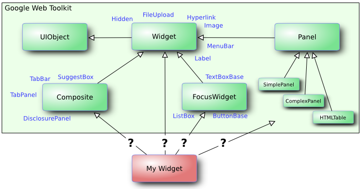

This chapter gives an overview of the Vaadin client-side framework, its
architecture, and development tools.

Overview {#clientside.overview}
========

As noted in the introduction, Vaadin supports two development models:
server-side and client-side. Client-side Vaadin code is executed in the
web browser as JavaScript code. The code is written in Java, like all
Vaadin code, and then compiled to JavaScript with the *Vaadin Client
Compiler*. You can develop client-side widgets and integrate them with
server-side counterpart components to allow using them in server-side
Vaadin applications. That is how the components in the server-side
framework and in most add-ons are done. Alternatively, you can create
pure client-side GWT applications, which you can simply load in the
browser from an HTML page and use even without server-side connectivity.

The client-side framework is based on the Google Web Toolkit (GWT), with
added features and bug fixes. Vaadin is compatible with GWT to the
extent of the basic GWT feature set. Vaadin Ltd is a member of the GWT
Steering Committee, working on the future direction of GWT together with
Google and other supporters of GWT.

> **Note**
>
> widget, definition Google Web Toolkit uses the term *widget* for user
> interface components. In this book, we use the term widget to refer to
> client-side components, while using the term *component* in a general
> sense and also in the special sense for server-side components.

The main idea in server-side Vaadin development is to render the
server-side components in the browser with the Client-Side Engine. The
engine is essentially a set of widgets paired with *connectors* that
serialize their state and events with the server-side counterpart
components. The client-side engine is technically called a *widget set*,
to describe the fact that it mostly consists of widgets and that widget
sets can be combined, as described later.

Installing the Client-Side Development Environment {#clientside.installing}
==================================================

The installation of the client-side development libraries is described
in ?. You especially need the `vaadin-client` library, which contains
the client-side Java API, and `vaadin-client-compiler`, which contains
the Vaadin Client Compiler for compiling Java to JavaScript.

Client-Side Module Descriptor {#clientside.module}
=============================

Client-side Vaadin modules, such as the Vaadin Client-Side Engine
(widget set) or pure client-side applications, that are to be compiled
to JavaScript, are defined in a *module descriptor* (`.gwt.xml`) file.

When defining a widget set to build the Vaadin client-side engine, the
only necessary task is to inherit a base widget set. If you are
developing a regular widget set, you should normally inherit the
`DefaultWidgetSet`.

    <?xml version="1.0" encoding="UTF-8"?>
    <!DOCTYPE module PUBLIC
      "-//Google Inc.//DTD Google Web Toolkit 1.7.0//EN"
      "http://google-web-toolkit.googlecode.com/svn/tags/1.7.0/distro-source/core/src/gwt-module.dtd">

    <module>
        <!-- Inherit the default widget set -->
        <inherits name="com.vaadin.DefaultWidgetSet" />
    </module>

If you are developing a pure client-side application, you should instead
inherit `com.vaadin.Vaadin`, as described in ?. In that case, the module
descriptor also needs an entry-point.

If you are using the Eclipse IDE, the New Vaadin Widget wizard will
automatically create the GWT module descriptor. See ? for detailed
instructions.

Specifying a Stylesheet {#clientside.module.stylesheet}
-----------------------

A client-side module can include CSS stylesheets. When the module is
compiled, these stylesheets are copied to the output target. In the
module descriptor, define a `stylesheet` element.

For example, if you are developing a custom widget and want to have a
default stylesheet for it, you could define it as follows:

    <stylesheet src="mywidget/styles.css"/>

The specified path is relative to the *public* folder under the folder
of the module descriptor.

Limiting Compilation Targets {#gwt.module.compilation-limiting}
----------------------------

Compiling widget sets takes considerable time. You can reduce the
compilation time significantly by compiling the widget sets only for
your browser, which is useful during development. You can do this by
setting the `user.agent` property in the module descriptor.

    <set-property name="user.agent" value="gecko1_8"/>

The `value` attribute should match your browser. The browsers supported
by GWT depend on the GWT version, below is a list of browser identifiers
supported by GWT.

  -------------------------------------------------------------------------
  Identifier         Name
  ------------------ ------------------------------------------------------
  ie6                Internet Explorer 6

  ie8                Internet Explorer 8

  gecko1\_8          Mozilla Firefox 1.5 and later

  safari             Apple Safari and other Webkit-based browsers including
                     Google Chrome

  opera              Opera

  ie9                Internet Explorer 9
  -------------------------------------------------------------------------

  : GWT User Agents

For more information about the GWT Module XML Format, please see Google
Web Toolkit Developer Guide.

Compiling a Client-Side Module {#clientside.compiling}
==============================

A client-side module, either a widget set or a pure client-side module,
needs to be compiled to JavaScript using the Vaadin Client Compiler.
During development, the Development Mode makes the compilation
automatically when you reload the page, provided that the module has
been initially compiled once with the compiler.

As most Vaadin add-ons include widgets, widget set compilation is
usually needed when using add-ons. In that case, the widget sets from
different add-ons are compiled into a *project widget set*, as described
in ?.

Vaadin Compiler Overview {#clientside.compiling.overview}
------------------------

The Vaadin Client Compiler compiles Java to JavaScript. It is provided
as the `vaadin-client-compiler` JAR, which you can execute with the
`-jar` parameter for the Java runtime. It requires the `vaadin-client`
JAR, which contains the Vaadin client-side framework.

The compiler compiles a *client module*, which can be either a pure
client-side module or a Vaadin widget set, that is, the Vaadin
Client-Side Engine that includes the widgets used in the application.
The client module is defined with a module descriptor, which was
described in ?.

The compiler writes the compilation result to a target folder that will
include the compiled JavaScript with any static resources included in
the module.

Compiling in Eclipse {#clientside.compiling.eclipse}
--------------------

When the Vaadin Plugin is installed in Eclipse, you can simply click the
Compile Vaadin widgets button in the toolbar. It will compile the widget
set it finds from the project. If the project has multiple widget sets,
such as one for custom widgets and another one for the project, you need
to select the module descriptor of the widget set to compile before
clicking the button.

The compilation with Vaadin Plugin for Eclipse currently requires that
the module descriptor has suffix `Widgetset.gwt.xml`, although you can
use it to compile also other client-side modules than widget sets. The
result is written under `WebContent/VAADIN/widgetsets` folder.

Compiling with Ant {#clientside.compiling.ant}
------------------

You can find a script template for compiling widget sets with Ant and
Ivy at the [Vaadin download page](#). You can copy the build script to
your project and, once configured, run it with Ant.

Compiling with Maven {#clientside.compiling.maven}
--------------------

You can compile the widget set with the `vaadin:compile` goal as
follows:

    $ mvn vaadin:compile

Creating a Custom Widget {#clientside.widget}
========================

Creating a new Vaadin component usually begins from making a client-side
widget, which is later integrated with a server-side counterpart to
enable server-side development. In addition, you can also choose to make
pure client-side widgets, a possibility which we also describe later in
this section.

A Basic Widget {#clientside.widget.simple}
--------------

All widgets extend the `Widget` class or some of its subclasses. You can
extend any core GWT or supplementary Vaadin widgets. Perhaps typically,
an abstraction such as `Composite`. The basic GWT widget component
hierarchy is illustrated in ?. Please see the GWT API documentation for
a complete description of the widget classes.

For example, we could extend the `Label` widget to display some custom
text.

    package com.example.myapp.client;

    import com.google.gwt.user.client.ui.Label;

    public class MyWidget extends Label {
        public static final String CLASSNAME = "mywidget";

        public MyWidget() {
            setStyleName(CLASSNAME);
            setText("This is MyWidget");
        }
    }

The above example is largely what the Eclipse plugin generates as a
widget stub. It is a good practice to set a distinctive style class for
the widget, to allow styling it with CSS.

The client-side source code *must* be contained in a `client` package
under the package of the descriptor file, which is covered later.

Using the Widget {#clientside.widget.using}
----------------

You can use a custom widget just like you would use any widget, possibly
integrating it with a server-side component, or in pure client-side
modules such as the following:

    public class MyEntryPoint implements EntryPoint {
        @Override
        public void onModuleLoad() {
            // Use the custom widget
            final MyWidget mywidget = new MyWidget();
            RootPanel.get().add(mywidget);
        }
    }

Debugging Client-Side Code {#clientside.debugging}
==========================

Vaadin currently includes SuperDevMode for debugging client-side code
right in the browser.

The predecessor of SuperDevMode, the GWT Development Mode, no longer
works in recent versions of Firefox and Chrome, because of certain API
changes in the browsers. There exists workarounds on some platforms, but
for the sake of simplicity, we recommend using the SuperDevMode.

Launching Development Mode {#clientside.debugging.devmode}
--------------------------

The Development Mode launches the application in the browser, compiles
the client-side module (or widget set) when the page is loaded, and
allows debugging the client-side code in Eclipse. You can launch the
Development Mode by running the `com.google.gwt.dev.DevMode` class. It
requires some parameters, as described later.

The Vaadin Plugin for Eclipse can create a launch configuration for the
Development Mode. In the Vaadin section of project properties, click the
Create development mode launch button. This creates a new launch
configuration in the project. You can edit the launch configuration in
Run \> Run Configurations.

    -noserver -war WebContent/VAADIN/widgetsets com.example.myproject.widgetset.MyWidgetSet -startupUrl http://localhost:8080/myproject -bindAddress 127.0.0.1

The parameters are as follows:

`-noserver`
:   Normally, the Development Mode launches its own Jetty server for
    hosting the content. If you are developing the application under an
    IDE that deploys it to a server, such as Eclipse, you can disable
    the Development Mode server with this option.

`-war`
:   Specifies path to the location where the JavaScript is to be
    compiled. When developing a pure client-side module, this could be
    the
    WebContent
    (in Eclipse) or some other folder under it. When compiling widget
    sets, it must be
    WebContent/VAADIN/widgetsets
    .

`-startupUrl`
:   Specifies the address of the loader page for the application. For
    server-side Vaadin applications, this should be the path to the
    Vaadin application servlet, as defined in the deployment. For pure
    client-side widgets, it should be the page where the application is
    included.

`-bindAddress`
:   This is the IP address of the host in which the Development Mode
    runs. For debugging on the development workstation, it can be just
    127.0.0.1
    . Setting it as the proper IP address of the host enables remote
    debugging.

Launching SuperDevMode {#clientside.debugging.superdevmode}
----------------------

The SuperDevMode is much like the old Development Mode, except that it
does not require a browser plugin. Compilation from Java to JavaScript
is done incrementally, reducing the compilation time significantly. It
also allows debugging JavaScript and even Java right in the browser
(currently only supported in Chrome).

You can enable SuperDevMode as follows:

1.  You need to set a redirect property in the `.gwt.xml` module
    descriptor as follows:

        <set-configuration-property name="devModeRedirectEnabled" value="true" />

    In addition, you need the `xsiframe` linker. It is included in the
    `com.vaadin.DefaultWidgetSet` as well as in the `com.vaadin.Vaadin`
    module. Otherwise, you need to include it with:

        <add-linker name="xsiframe" />

2.  Compile the module (that is, the widget set), for example by
    clicking the button in Eclipse.
3.  If you are using Eclipse, create a launch configuration for the
    SuperDevMode by clicking the Create SuperDevMode launch in the
    Vaadin section of the project properties.

    1.  The main class to execute should be
        com.google.gwt.dev.codeserver.CodeServer
        .
    2.  The application takes the fully-qualified class name of the
        module (or widget set) as parameter, for example,
        com.example.myproject.widgetset.MyprojectWidgetset
        .
    3.  Add project sources to the class path of the launch if they are
        not in the project class path.

The above configuration only needs to be done once to enable the
SuperDevMode. After that, you can launch the mode as follows:

1.  Run the SuperDevMode Code Server with the launch configuration that
    you created above. This perfoms the initial compilation of your
    module or widget set.
2.  Launch the servlet container for your application, for example,
    Tomcat.
3.  Open your browser with the application URL and add
    ?superdevmode
    parameter to the URL (see the notice below if you are not extending
    DefaultWidgetSet
    ). This recompiles the code, after which the page is reloaded with
    the SuperDevMode. You can also use the
    ?debug
    parameter and then click the
    SDev
    button in the debug console.

If you make changes to the client-side code and refresh the page in the
browser, the client-side is recompiled and you see the results
immediately.

The Step 3 above assumes that you extend `DefaultWidgetSet` in your
module. If that is not the case, you need to add the following at the
start of the onModuleLoad() method of the module:

    if (SuperDevMode.enableBasedOnParameter()) { return; }

Alternatively, you can use the bookmarklets provided by the code server.
Go to <http://localhost:9876/> and drag the bookmarklets "Dev Mode On"
and "Dev Mode Off" to the bookmarks bar

Debugging Java Code in Chrome {#clientside.debugging.chrome}
-----------------------------

Chrome supports source maps, which allow debugging Java source code from
which the JavaScript was compiled.

Open the Chrome Inspector by right-clicking and selecting Inspect
Element. Click the settings icon in the lower corner of the window and
check the Scripts \> Enable source maps
option. Refresh the page with the Inspector open, and you will see Java
code instead of JavaScript in the scripts tab.
