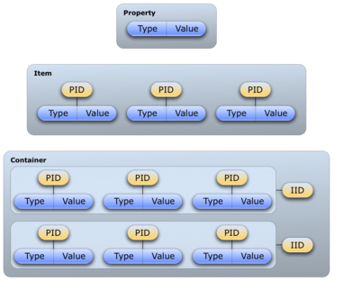

Vaadin Data Model
This chapter describes the Vaadin Data Model and shows how you can use
it to bind components directly to data sources, such as database
queries.

Overview {#datamodel.overview}
========

The Vaadin Data Model is one of the core concepts of the library. To
allow the view (user interface components) to access the data model of
an application directly, we have introduced a standard data interface.

The model allows binding user interface components directly to the data
that they display and possibly allow to edit. There are three nested
levels of hierarchy in the data model: *property*, *item*, and
*container*. Using a spreadsheet application as an analogy, these would
correspond to a cell, a row, and a table, respectively.

The Data Model is realized as a set of interfaces in the
`com.vaadin.data` package. The package contains the `Property`, `Item`,
and `Container` interfaces, along with a number of more specialized
interfaces and classes.

Notice that the Data Model does not define data representation, but only
interfaces. This leaves the representation fully to the implementation
of the containers. The representation can be almost anything, such as a
plain old Java object (POJO) structure, a filesystem, or a database
query.

The Data Model is used heavily in the core user interface components of
Vaadin, especially the field components, that is, components that
implement the `Field` interface or more typically extend
`AbstractField`, which defines many common features. A key feature of
all the built-in field components is that they can either maintain their
data by themselves or be bound to an external data source. The value of
a field is always available through the `Property` interface. As more
than one component can be bound to the same data source, it is easy to
implement various viewer-editor patterns.

The relationships of the various interfaces are shown in ?; the value
change event and listener interfaces are shown only for the `Property`
interface, while the notifier interfaces are omitted altogether.

The Data Model has many important and useful features, such as support
for change notification. Especially containers have many helper
interfaces, including ones that allow indexing, ordering, sorting, and
filtering the data. Also `Field` components provide a number of features
involving the data model, such as buffering, validation, and lazy
loading.

Vaadin provides a number of built-in implementations of the data model
interfaces. The built-in implementations are used as the default data
models in many field components.

In addition to the built-in implementations, many data model
implementations, such as containers, are available as add-ons, either
from the Vaadin Directory or from independent sources. Both commercial
and free implementations exist. The JPAContainer, described in ?, is the
most often used conmmercial container add-on. The installation of
add-ons is described in ?. Notice that unlike with most regular add-on
components, you do not need to compile a widget set for add-ons that
include just data model implementations.

Properties {#datamodel.properties}
==========

The Property interface is the base of the Vaadin Data Model. It provides
a standardized API for a single data value object that can be read (get)
and written (set). A property is always typed, but can optionally
support data type conversions. The type of a property can be any Java
class. Optionally, properties can provide value change events for
following their changes.

You can set the value of a property with setValue() and read with
getValue().

In the following, we set and read the property value from a `TextField`
component, which implements the Property interface to allow accessing
the field value.

    final TextField tf = new TextField("Name");
            
    // Set the value
    tf.setValue("The text field value");
            
    // When the field value is edited by the user
    tf.addValueChangeListener(
        new Property.ValueChangeListener() {
        public void valueChange(ValueChangeEvent event) {
            // Do something with the new value
            layout.addComponent(new Label(tf.getValue()));
        }
    });

Changes in the property value usually fire a `ValueChangeEvent`, which
can be handled with a `ValueChangeListener`. The event object provides
reference to the property with getProperty(). Note that its getValue()
method returns the value with `Object` type, so you need to cast it to
the proper type.

Properties are in themselves unnamed. They are collected in *items*,
which associate the properties with names: the *Property Identifiers* or
*PID*s. Items can be further contained in containers and are identified
with *Item Identifiers* or *IID*s. In the spreadsheet analogy, *Property
Identifiers* would correspond to column names and *Item Identifiers* to
row names. The identifiers can be arbitrary objects, but must implement
the equals(Object) and hashCode() methods so that they can be used in
any standard Java `Collection`.

The `Property` interface can be utilized either by implementing the
interface or by using some of the built-in property implementations.
Vaadin includes a `Property` interface implementation for arbitrary
function pairs and bean properties, with the `MethodProperty` class, and
for simple object properties, with the `ObjectProperty` class, as
described later.

In addition to the simple components, selection components provide their
current selection as the property value. In single selection mode, the
property is a single item identifier, while in multiple selection mode
it is a set of item identifiers. See the documentation of the selection
components for further details.

Components that can be bound to a property have an internal default data
source object, typically a `ObjectProperty`, which is described later.
As all such components are viewers or editors, also described later, so
you can rebind a component to any data source with
setPropertyDataSource().

Property Viewers and Editors {#datamodel.properties.viewers}
----------------------------

The most important function of the `Property` as well as of the other
data model interfaces is to connect classes implementing the interface
directly to editor and viewer classes. This means connecting a data
source (model) to a user interface component (views) to allow editing or
viewing the data model.

A property can be bound to a component implementing the `Viewer`
interface with setPropertyDataSource().

    // Have a data model
    ObjectProperty property =
        new ObjectProperty("Hello", String.class);
            
    // Have a component that implements Viewer
    Label viewer = new Label();
            
    // Bind it to the data
    viewer.setPropertyDataSource(property);

You can use the same method in the `Editor` interface to bind a
component that allows editing a particular property type to a property.

    // Have a data model
    ObjectProperty property =
        new ObjectProperty("Hello", String.class);
            
    // Have a component that implements Viewer
    TextField editor = new TextField("Edit Greeting");
            
    // Bind it to the data
    editor.setPropertyDataSource(property);

As all field components implement the `Property` interface, you can bind
any component implementing the `Viewer` interface to any field, assuming
that the viewer is able the view the object type of the field.
Continuing from the above example, we can bind a `Label` to the
`TextField` value:

    Label viewer = new Label();
    viewer.setPropertyDataSource(editor);

    // The value shown in the viewer is updated immediately
    // after editing the value in the editor (once it
    // loses the focus)
    editor.setImmediate(true);

If a field has validators, as described in ?, the validators are
executed before writing the value to the property data source, or by
calling the validate() or commit() for the field.

`ObjectProperty` Implementation {#datamodel.properties.objectproperty}
-------------------------------

The `ObjectProperty` class is a simple implementation of the `Property`
interface that allows storing an arbitrary Java object.

    // Have a component that implements Viewer interface
    final TextField tf = new TextField("Name");
            
    // Have a data model with some data
    String myObject = "Hello";
            
    // Wrap it in an ObjectProperty
    ObjectProperty property =
        new ObjectProperty(myObject, String.class);
            
    // Bind the property to the component
    tf.setPropertyDataSource(property);

Converting Between Property Type and Representation {#datamodel.properties.converter}
---------------------------------------------------

Fields allow editing a certain type, such as a `String` or `Date`. The
bound property, on the other hand, could have some entirely different
type. Conversion between a representation edited by the field and the
model defined in the property is handler with a converter that
implements the Converter interface.

Most common type conversions, such as between string and integer, are
handled by the default converters. They are created in a converter
factory global in the application.

### Basic Use of Converters {#datamodel.properties.converter.basic}

The setConverter(Converter) method sets the converter for a field. The
method is defined in `AbstractField`.

    // Have an integer property
    final ObjectProperty<Integer> property =
            new ObjectProperty<Integer>(42); 
            
    // Create a TextField, which edits Strings
    final TextField tf = new TextField("Name");

    // Use a converter between String and Integer
    tf.setConverter(new StringToIntegerConverter());

    // And bind the field
    tf.setPropertyDataSource(property);

The built-in converters are the following:

  Converter                            Representation         Model
  ------------------------------------ ---------------------- -------------
  `StringToIntegerConverter`           `String`               `Integer`
  `StringToDoubleConverter`            `String`               `Double`
  `StringToNumberConverter`            `String`               `Number`
  `StringToBooleanConverter`           `String`               `Boolean`
  `StringToDateConverter`              `String`               `Date`
  `DateToLongConverter`                `Date`                 `Long`

  : Built-in Converters

In addition, there is a `ReverseConverter` that takes a converter as a
parameter and reverses the conversion direction.

If a converter already exists for a type, the setConverter(Class)
retrieves the converter for the given type from the converter factory,
and then sets it for the field. This method is used implicitly when
binding field to a property data source.

### Implementing a Converter {#datamodel.properties.converter.custom}

A conversion always occurs between a *representation type*, edited by
the field component, and a *model type*, that is, the type of the
property data source. Converters implement the Converter interface
defined in the com.vaadin.data.util.converter package.

For example, let us assume that we have a simple `Complex` type for
storing complex values.

    public class ComplexConverter
           implements Converter<String, Complex> {
        @Override
        public Complex convertToModel(String value, Locale locale)
                throws ConversionException {
            String parts[] =
                value.replaceAll("[\\(\\)]", "").split(",");
            if (parts.length != 2)
                throw new ConversionException(
                        "Unable to parse String to Complex");
            return new Complex(Double.parseDouble(parts[0]),
                               Double.parseDouble(parts[1]));
        }

        @Override
        public String convertToPresentation(Complex value,
                                            Locale locale)
                throws ConversionException {
            return "("+value.getReal()+","+value.getImag()+")";
        }

        @Override
        public Class<Complex> getModelType() {
            return Complex.class;
        }

        @Override
        public Class<String> getPresentationType() {
            return String.class;
        }
    }

The conversion methods get the locale for the conversion as a parameter.

### Converter Factory {#datamodel.properties.converter.converterfactory}

If a field does not directly allow editing a property type, a default
converter is attempted to create using an application-global converter
factory. If you define your own converters that you wish to include in
the converter factory, you need to implement one yourself. While you
could implement the ConverterFactory interface, it is usually easier to
just extend `DefaultConverterFactory`.

    class MyConverterFactory extends DefaultConverterFactory {
        @Override
        public <PRESENTATION, MODEL> Converter<PRESENTATION, MODEL>
                createConverter(Class<PRESENTATION> presentationType,
                                Class<MODEL> modelType) {
            // Handle one particular type conversion
            if (String.class == presentationType &&
                Complex.class == modelType)
                return (Converter<PRESENTATION, MODEL>)
                       new ComplexConverter();

            // Default to the supertype
            return super.createConverter(presentationType,
                                         modelType);
        }
    }

    // Use the factory globally in the application
    Application.getCurrentApplication().setConverterFactory(
            new MyConverterFactory());

Implementing the `Property` Interface {#datamodel.properties.implementing}
-------------------------------------

Implementation of the `Property` interface requires defining setters and
getters for the value and the *read-only* mode. Only a getter is needed
for the property type, as the type is often fixed in property
implementations.

The following example shows a simple implementation of the `Property`
interface:

    class MyProperty implements Property {
        Integer data     = 0;
        boolean readOnly = false;
        
        // Return the data type of the model
        public Class<?> getType() {
            return Integer.class;
        }

        public Object getValue() {
            return data;
        }
        
        // Override the default implementation in Object
        @Override
        public String toString() {
            return Integer.toHexString(data);
        }

        public boolean isReadOnly() {
            return readOnly;
        }

        public void setReadOnly(boolean newStatus) {
            readOnly = newStatus;
        }

        public void setValue(Object newValue)
                throws ReadOnlyException, ConversionException {
            if (readOnly)
                throw new ReadOnlyException();
                
            // Already the same type as the internal representation
            if (newValue instanceof Integer)
                data = (Integer) newValue;
            
            // Conversion from a string is required
            else if (newValue instanceof String)
                try {
                    data = Integer.parseInt((String) newValue, 16);
                } catch (NumberFormatException e) {
                    throw new ConversionException();
                }
            else
                 // Don't know how to convert any other types
                throw new ConversionException();

            // Reverse decode the hexadecimal value
        }
    }
            
    // Instantiate the property and set its data
    MyProperty property = new MyProperty();
    property.setValue(42);
            
    // Bind it to a component
    final TextField tf = new TextField("Name", property);

The components get the displayed value by the toString() method, so it
is necessary to override it. To allow editing the value, value returned
in the toString() must be in a format that is accepted by the setValue()
method, unless the property is read-only. The toString() can perform any
type conversion necessary to make the internal type a string, and the
setValue() must be able to make a reverse conversion.

The implementation example does not notify about changes in the property
value or in the read-only mode. You should normally also implement at
least the `Property.ValueChangeNotifier` and
`Property.ReadOnlyStatusChangeNotifier`. See the `ObjectProperty` class
for an example of the implementation.

Holding properties in Items {#datamodel.items}
===========================

The `Item` interface provides access to a set of named properties. Each
property is identified by a *property identifier* (PID) and a reference
to such a property can be queried from an `Item` with getItemProperty()
using the identifier.

Examples on the use of items include rows in a `Table`, with the
properties corresponding to table columns, nodes in a `Tree`, and the
the data bound to a `Form`, with item's properties bound to individual
form fields.

Items are generally equivalent to objects in the object-oriented model,
but with the exception that they are configurable and provide an event
handling mechanism. The simplest way to utilize `Item` interface is to
use existing implementations. Provided utility classes include a
configurable property set (`PropertysetItem`) and a bean-to-item adapter
(`BeanItem`). Also, a `Form` implements the interface and can therefore
be used directly as an item.

In addition to being used indirectly by many user interface components,
items provide the basic data model underlying the `Form` component. In
simple cases, forms can even be generated automatically from items. The
properties of the item correspond to the fields of the form.

The `Item` interface defines inner interfaces for maintaining the item
property set and listening changes made to it. `PropertySetChangeEvent`
events can be emitted by a class implementing the
`PropertySetChangeNotifier` interface. They can be received through the
`PropertySetChangeListener` interface.

The `PropertysetItem` Implementation {#datamodel.items.propertysetitem}
------------------------------------

The `PropertysetItem` is a generic implementation of the `Item`
interface that allows storing properties. The properties are added with
addItemProperty(), which takes a name and the property as parameters.

The following example demonstrates a typical case of collecting
`ObjectProperty` properties in an item:

    PropertysetItem item = new PropertysetItem();
    item.addItemProperty("name", new ObjectProperty("Zaphod"));
    item.addItemProperty("age", new ObjectProperty(42));
            
    // Bind it to a component
    Form form = new Form();
    form.setItemDataSource(item);

Wrapping a Bean in a `BeanItem` {#datamodel.items.beanitem}
-------------------------------

The `BeanItem` implementation of the `Item` interface is a wrapper for
Java Bean objects. In fact, only the setters and getters are required
while serialization and other bean features are not, so you can wrap
almost any POJOs with minimal requirements.

    // Here is a bean (or more exactly a POJO)
    class Person {
        String name;
        int    age;
        
        public String getName() {
            return name;
        }
        
        public void setName(String name) {
            this.name = name;
        }
        
        public Integer getAge() {
            return age;
        }
        
        public void setAge(Integer age) {
            this.age = age.intValue();
        }
    }

    // Create an instance of the bean
    Person bean = new Person();
            
    // Wrap it in a BeanItem
    BeanItem<Person> item = new BeanItem<Person>(bean);
            
    // Bind it to a component
    Form form = new Form();
    form.setItemDataSource(item);

You can use the getBean() method to get a reference to the underlying
bean.

### Nested Beans {#datamodel.items.beanitem.nested}

You may often have composite classes where one class "has a" another
class. For example, consider the following `Planet` class which "has a"
discoverer:

    // Here is a bean with two nested beans
    public class Planet implements Serializable {
        String name;
        Person discoverer;
        
        public Planet(String name, Person discoverer) {
            this.name = name;
            this.discoverer = discoverer;
        }

        ... getters and setters ...
    }

    ...
    // Create an instance of the bean
    Planet planet = new Planet("Uranus",
                        new Person("William Herschel", 1738));

When shown in a `Form`, for example, you would want to list the
properties of the nested bean along the properties of the composite
bean. You can do that by binding the properties of the nested bean
individually with a `MethodProperty` or `NestedMethodProperty`. You
should usually hide the nested bean from binding as a property by
listing only the bound properties in the constructor.

    // Wrap it in a BeanItem and hide the nested bean property
    BeanItem<Planet> item = new BeanItem<Planet>(planet,
            new String[]{"name"});
        
    // Bind the nested properties.
    // Use NestedMethodProperty to bind using dot notation.
    item.addItemProperty("discoverername",
        new NestedMethodProperty(planet, "discoverer.name"));
        
    // The other way is to use regular MethodProperty.
    item.addItemProperty("discovererborn",
         new MethodProperty<Person>(planet.getDiscoverer(),
                                    "born"));

The difference is that `NestedMethodProperty` does not access the nested
bean immediately but only when accessing the property values, while when
using `MethodProperty` the nested bean is accessed when creating the
method property. The difference is only significant if the nested bean
can be null or be changed later.

You can use such a bean item for example in a `Form` as follows:

    // Bind it to a component
    Form form = new Form();
    form.setItemDataSource(item);
        
    // Nicer captions
    form.getField("discoverername").setCaption("Discoverer");
    form.getField("discovererborn").setCaption("Born");

The `BeanContainer` and `BeanItemContainer` allow easy definition of
nested bean properties with addNestedContainerProperty(), as described
in ?.

Creating Forms by Binding Fields to Items {#datamodel.itembinding}
=========================================

*Because of pressing release schedules to get this edition to your
hands, we were unable to completely update this chapter. Some form
handling is still under work, especially form validation.*

Most applications in existence have forms of some sort. Forms contain
fields, which you want to bind to a data source, an item in the Vaadin
data model. `FieldGroup` provides an easy way to bind fields to the
properties of an item. You can use it by first creating a layout with
some fields, and then call it to bind the fields to the data source. You
can also let the `FieldGroup` create the fields using a field factory.
It can also handle commits. Notice that `FieldGroup` is not a user
interface component, so you can not add it to a layout.

Simple Binding {#datamodel.itembinding.simple}
--------------

Let us start with a data model that has an item with a couple of
properties. The item could be any item type, as described earlier.

    // Have an item
    PropertysetItem item = new PropertysetItem();
    item.addItemProperty("name", new ObjectProperty<String>("Zaphod"));
    item.addItemProperty("age", new ObjectProperty<Integer>(42));

Next, you would design a form for editing the data. The `FormLayout` (?
is ideal for forms, but you could use any other layout as well.

    // Have some layout and create the fields
    FormLayout form = new FormLayout();

    TextField nameField = new TextField("Name");
    form.addComponent(nameField);

    TextField ageField = new TextField("Age");
    form.addComponent(ageField);

Then, we can bind the fields to the data as follows:

    // Now create the binder and bind the fields
    FieldGroup binder = new FieldGroup(item);
    binder.bind(nameField, "name");
    binder.bind(ageField, "age");

The above way of binding is not different from simply calling
setPropertyDataSource() for the fields. It does, however, register the
fields in the field group, which for example enables buffering or
validation of the fields using the field group, as described in ?.

Next, we consider more practical uses for a `FieldGroup`.

Using a FieldFactory to Build and Bind Fields {#datamodel.itembinding.fieldfactory}
---------------------------------------------

Using the buildAndBind() methods, `FieldGroup` can create fields for you
using a FieldGroupFieldFactory, but you still have to add them to the
correct position in your layout.

    // Have some layout
    FormLayout form = new FormLayout();
            
    // Now create a binder that can also create the fields
    // using the default field factory
    FieldGroup binder = new FieldGroup(item);
    form.addComponent(binder.buildAndBind("Name", "name"));
    form.addComponent(binder.buildAndBind("Age", "age"));

Binding Member Fields {#datamodel.itembinding.formclass}
---------------------

The bindMemberFields() method in `FieldGroup` uses reflection to bind
the properties of an item to field components that are member variables
of a class. Hence, if you implement a form as a class with the fields
stored as member variables, you can use this method to bind them
super-easy.

The item properties are mapped to the members by the property ID and the
name of the member variable. If you want to map a property with a
different ID to a member, you can use the `@PropertyId` annotation for
the member, with the property ID as the parameter.

For example:

    // Have an item
    PropertysetItem item = new PropertysetItem();
    item.addItemProperty("name", new ObjectProperty<String>("Zaphod"));
    item.addItemProperty("age", new ObjectProperty<Integer>(42));

    // Define a form as a class that extends some layout
    class MyForm extends FormLayout {
        // Member that will bind to the "name" property
        TextField name = new TextField("Name");
        
        // Member that will bind to the "age" property 
        @PropertyId("age")
        TextField ageField = new TextField("Age");
        
        public MyForm() {
            // Customize the layout a bit
            setSpacing(true);
            
            // Add the fields
            addComponent(name);
            addComponent(ageField);
        }
    }
            
    // Create one
    MyForm form = new MyForm();
            
    // Now create a binder that can also creates the fields
    // using the default field factory
    FieldGroup binder = new FieldGroup(item);
    binder.bindMemberFields(form);

    // And the form can be used in an higher-level layout
    layout.addComponent(form);

### Encapsulating in `CustomComponent` {#datamodel.itembinding.formclass.customcomponent}

Using a `CustomComponent` can be better for hiding the implementation
details than extending a layout. Also, the use of the `FieldGroup` can
be encapsulated in the form class.

Consider the following as an alternative for the form implementation
presented earlier:

    // A form component that allows editing an item
    class MyForm extends CustomComponent {
        // Member that will bind to the "name" property
        TextField name = new TextField("Name");
        
        // Member that will bind to the "age" property 
        @PropertyId("age")
        TextField ageField = new TextField("Age");
        
        public MyForm(Item item) {
            FormLayout layout = new FormLayout();
            layout.addComponent(name);
            layout.addComponent(ageField);
            
            // Now use a binder to bind the members
            FieldGroup binder = new FieldGroup(item);
            binder.bindMemberFields(this);

            setCompositionRoot(layout);
        }
    }
            
    // And the form can be used as a component
    layout.addComponent(new MyForm(item));

Buffering Forms {#datamodel.itembinding.buffering}
---------------

Just like for individual fields, as described in ?, a `FieldGroup` can
handle buffering the form content so that it is written to the item data
source only when commit() is called for the group. It runs validation
for all fields in the group and writes their values to the item data
source only if all fields pass the validation. Edits can be discarded,
so that the field values are reloaded from the data source, by calling
discard(). Buffering is enabled by default, but can be disabled by
calling setBuffered(false) for the `FieldGroup`.

    // Have an item of some sort
    final PropertysetItem item = new PropertysetItem();
    item.addItemProperty("name", new ObjectProperty<String>("Q"));
    item.addItemProperty("age",  new ObjectProperty<Integer>(42));

    // Have some layout and create the fields
    Panel form = new Panel("Buffered Form");
    form.setContent(new FormLayout());

    // Build and bind the fields using the default field factory
    final FieldGroup binder = new FieldGroup(item);
    form.addComponent(binder.buildAndBind("Name", "name"));
    form.addComponent(binder.buildAndBind("Age",  "age"));

    // Enable buffering (actually enabled by default)
    binder.setBuffered(true);
            
    // A button to commit the buffer
    form.addComponent(new Button("OK", new ClickListener() {
        @Override
        public void buttonClick(ClickEvent event) {
            try {
                binder.commit();
                Notification.show("Thanks!");
            } catch (CommitException e) {
                Notification.show("You fail!");
            }
        }
    }));

    // A button to discard the buffer
    form.addComponent(new Button("Discard", new ClickListener() {
        @Override
        public void buttonClick(ClickEvent event) {
            binder.discard();
            Notification.show("Discarded!");
        }
    }));

Binding Fields to a Bean {#datamodel.itembinding.beans}
------------------------

The `BeanFieldGroup` makes it easier to bind fields to a bean. It also
handles binding to nested beans properties. The build a field bound to a
nested bean property, identify the property with dot notation. For
example, if a `Person` bean has a `address` property with an `Address`
type, which in turn has a `street` property, you could build a field
bound to the property with buildAndBind("Street", "address.street").

The input to fields bound to a bean can be validated using the Java Bean
Validation API, as described in ?. The `BeanFieldGroup` automatically
adds a `BeanValidator` to every field if a bean validation
implementation is included in the classpath.

Bean Validation {#datamodel.itembinding.beanvalidation}
---------------

Vaadin allows using the Java Bean Validation API 1.0 (JSR-303) for
validating input from fields bound to bean properties before the values
are committed to the bean. The validation is done based on annotations
on the bean properties, which are used for creating the actual
validators automatically. See ? for general information about
validation.

Using bean validation requires an implementation of the Bean Validation
API, such as Hibernate Validator (`hibernate-validator-4.2.0.Final.jar`
or later) or Apache Bean Validation. The implementation JAR must be
included in the project classpath when using the bean validation, or
otherwise an internal error is thrown.

Bean validation is especially useful when persisting entity beans with
the Vaadin JPAContainer, described in ?.

### Annotations {#datamodel.itembinding.beanvalidation.annotations}

The validation constraints are defined as annotations. For example,
consider the following bean:

    // Here is a bean
    public class Person implements Serializable {
        @NotNull
        @javax.validation.constraints.Size(min=2, max=10)
        String name;
        
        @Min(1)
        @Max(130)
        int age;
        
        // ... setters and getters ...
    }

For a complete list of allowed constraints for different data types,
please see the [Bean Validation API documentation](#).

### Validating the Beans {#datamodel.itembinding.beanvalidation.validating}

Validating a bean is done with a `BeanValidator`, which you initialize
with the name of the bean property it should validate and add it the the
editor field.

In the following example, we validate a single unbuffered field:

    Person bean = new Person("Mung bean", 100);
    BeanItem<Person> item = new BeanItem<Person> (bean);
        
    // Create an editor bound to a bean field
    TextField firstName = new TextField("First Name",
            item.getItemProperty("name"));
        
    // Add the bean validator
    firstName.addValidator(new BeanValidator(Person.class, "name"));
        
    firstName.setImmediate(true);
    layout.addComponent(firstName);

In this case, the validation is done immediately after focus leaves the
field. You could do the same for the other field as well.

Bean validators are automatically created when using a `BeanFieldGroup`.

    // Have a bean
    Person bean = new Person("Mung bean", 100);
            
    // Form for editing the bean
    final BeanFieldGroup<Person> binder =
            new BeanFieldGroup<Person>(Person.class);
    binder.setItemDataSource(bean);
    layout.addComponent(binder.buildAndBind("Name", "name"));
    layout.addComponent(binder.buildAndBind("Age", "age"));

    // Buffer the form content
    binder.setBuffered(true);
    layout.addComponent(new Button("OK", new ClickListener() {
        @Override
        public void buttonClick(ClickEvent event) {
            try {
                binder.commit();
            } catch (CommitException e) {
            }
        }
    }));

### Locale Setting for Bean Validation {#datamodel.itembinding.beanvalidation.locale}

The validation error messages are defined in the bean validation
implementation, in a `ValidationMessages.properties` file. The message
is shown in the language specified with the locale setting for the form.
The default language is English, but for example Hibernate Validator
contains translations of the messages for a number of languages. If
other languages are needed, you need to provide a translation of the
properties file.

Collecting Items in Containers {#datamodel.container}
==============================

Container
The `Container` interface is the highest containment level of the Vaadin
data model, for containing items (rows) which in turn contain properties
(columns). Containers can therefore represent tabular data, which can be
viewed in a `Table` or some other selection component, as well as
hierarchical data.

The items contained in a container are identified by an *item
identifier* or *IID*, and the properties by a *property identifier* or
*PID*.

Basic Use of Containers {#datamodel.container.intro}
-----------------------

The basic use of containers involves creating one, adding items to it,
and binding it as a container data source of a component.

### Default Containers and Delegation {#datamodel.container.intro.default}

Before saying anything about creation of containers, it should be noted
that all components that can be bound to a container data source are by
default bound to a default container. For example, `Table` is bound to a
`IndexedContainer`, `Tree` to a `HierarchicalContainer`, and so forth.

All of the user interface components using containers also implement the
relevant container interfaces themselves, so that the access to the
underlying data source is delegated through the component.

    // Create a table with one column
    Table table = new Table("My Table");
    table.addContainerProperty("col1", String.class, null);

    // Access items and properties through the component
    table.addItem("row1"); // Create item by explicit ID
    Item item1 = table.getItem("row1");
    Property property1 = item1.getItemProperty("col1");
    property1.setValue("some given value");

    // Equivalent access through the container
    Container container = table.getContainerDataSource();
    container.addItem("row2");
    Item item2 = container.getItem("row2");
    Property property2 = item2.getItemProperty("col1");
    property2.setValue("another given value");

### Creating and Binding a Container {#datamodel.container.intro.creating}

A container is created and bound to a component as follows:

    // Create a container of some type
    Container container = new IndexedContainer();

    // Initialize the container as required by the container type
    container.addContainerProperty("name", String.class, "none");
    container.addContainerProperty("volume", Double.class, 0.0);

    ... add items ...

    // Bind it to a component
    Table table = new Table("My Table");
    table.setContainerDataSource(container);

Most components that can be bound to a container allow passing it also
in the constructor, in addition to using setContainerDataSource().
Creation of the container depends on its type. For some containers, such
as the `IndexedContainer`, you need to define the contained properties
(columns) as was done above, while some others determine them otherwise.
The definition of a property with addContainerProperty() requires a
unique property ID, type, and a default value. You can also give `null`.

Vaadin has a several built-in in-memory container implementations, such
as `IndexedContainer` and `BeanItemContainer`, which are easy to use for
setting up nonpersistent data storages. For persistent data, either the
built-in `SQLContainer` or the `JPAContainer` add-on container can be
used.

### Adding Items and Accessing Properties {#datamodel.container.intro.adding}

Items can be added to a container with the addItem() method. The
parameterless version of the method automatically generates the item ID.

    // Create an item
    Object itemId = container.addItem();

Properties can be requested from container by first requesting an item
with getItem() and then getting the properties from the item with
getItemProperty().

    // Get the item object
    Item item = container.getItem(itemId);

    // Access a property in the item
    Property<String> nameProperty =
            item.getItemProperty("name");

    // Do something with the property
    nameProperty.setValue("box");

You can also get a property directly by the item and property ids with
getContainerProperty().

    container.getContainerProperty(itemId, "volume").setValue(5.0);

### Adding Items by Given ID {#datamodel.container.intro.givenid}

Some containers, such as `IndexedContainer` and `HierarchicalContainer`,
allow adding items by a given ID, which can be any `Object`.

    Item item = container.addItem("agivenid");
    item.getItemProperty("name").setValue("barrel");
    Item.getItemProperty("volume").setValue(119.2);

Notice that the actual item *is not* given as a parameter to the method,
only its ID, as the interface assumes that the container itself creates
all the items it contains. Some container implementations can provide
methods to add externally created items, and they can even assume that
the item ID object is also the item itself. Lazy containers might not
create the item immediately, but lazily when it is accessed by its ID.

Container Subinterfaces {#datamodel.container.inner}
-----------------------

The `Container` interface contains inner interfaces that container
implementations can implement to fulfill different features required by
components that present container data.

Container.Filterable

:   Filterable containers allow filtering the contained items by
    filters, as described in ?.

Container.Hierarchical

:   Hierarchical containers allow representing hierarchical
    relationships between items and are required by the `Tree` and
    `TreeTable` components. The `HierarchicalContainer` is a built-in
    in-memory container for hierarchical data, and is used as the
    default container for the tree components. The `FilesystemContainer`
    provides access to browsing the content of a file system. Also
    `JPAContainer` is hierarchical, as described in ?.

Container.Indexed

:   An indexed container allows accessing items by an index number, not
    just their item ID. This feature is required by some components,
    especially `Table`, which needs to provide lazy access to large
    containers. The `IndexedContainer` is a basic in-memory
    implementation, as described in ?.

Container.Ordered

:   An ordered container allows traversing the items in successive order
    in either direction. Most built-in containers are ordered.

Container.SimpleFilterable

:   This interface enables filtering a container by string matching with
    addContainerFilter(). The filtering is done by either searching the
    given string anywhere in a property value, or as its prefix.

Container.Sortable

:   A sortable container is required by some components that allow
    sorting the content, such as `Table`, where the user can click a
    column header to sort the table by the column. Some other
    components, such as `Calendar`, may require that the content is
    sorted to be able to display it properly. Depending on the
    implementation, sorting can be done only when the sort() method is
    called, or the container is automatically kept in order according to
    the last call of the method.

See the API documentation for a detailed description of the interfaces.

`IndexedContainer` {#datamodel.container.indexedcontainer}
------------------

The `IndexedContainer` is an in-memory container that implements the
Indexed interface to allow referencing the items by an index.
`IndexedContainer` is used as the default container in most selection
components in Vaadin.

The properties need to be defined with addContainerProperty(), which
takes the property ID, type, and a default value. This must be done
before any items are added to the container.

    // Create the container
    IndexedContainer container = new IndexedContainer();
            
    // Define the properties (columns)
    container.addContainerProperty("name", String.class, "noname");
    container.addContainerProperty("volume", Double.class, -1.0d);

    // Add some items
    Object content[][] = { {"jar", 2.0}, {"bottle", 0.75},
                          {"can", 1.5} }; 
    for (Object[] row: content) {
        Item newItem = container.getItem(container.addItem());
        newItem.getItemProperty("name").setValue(row[0]);
        newItem.getItemProperty("volume").setValue(row[1]);
    }

New items are added with addItem(), which returns the item ID of the new
item, or by giving the item ID as a parameter as was described earlier.
Note that the `Table` component, which has `IndexedContainer` as its
default container, has a conveniency addItem() method that allows adding
items as object vectors containing the property values.

The container implements the Container.Indexed feature to allow
accessing the item IDs by their index number, with getIdByIndex(), etc.
The feature is required mainly for internal purposes of some components,
such as `Table`, which uses it to enable lazy transmission of table data
to the client-side.

`BeanContainer` {#datamodel.container.beancontainer}
---------------

The `BeanContainer` is an in-memory container for JavaBean objects. Each
contained bean is wrapped inside a `BeanItem` wrapper. The item
properties are determined automatically by inspecting the getter and
setter methods of the class. This requires that the bean class has
public visibility, local classes for example are not allowed. Only beans
of the same type can be added to the container.

The generic has two parameters: a bean type and an item identifier type.
The item identifiers can be obtained by defining a custom resolver,
using a specific item property for the IDs, or by giving item IDs
explicitly. As such, it is more general than the `BeanItemContainer`,
which uses the bean object itself as the item identifier, making the use
usually simpler. Managing the item IDs makes `BeanContainer` more
complex to use, but it is necessary in some cases where the equals() or
hashCode() methods have been reimplemented in the bean.

    // Here is a JavaBean
    public class Bean implements Serializable {
        String name;
        double energy; // Energy content in kJ/100g
        
        public Bean(String name, double energy) {
            this.name   = name;
            this.energy = energy;
        }
        
        public String getName() {
            return name;
        }
        
        public void setName(String name) {
            this.name = name;
        }
        
        public double getEnergy() {
            return energy;
        }
        
        public void setEnergy(double energy) {
            this.energy = energy;
        }
    }

    void basic(VerticalLayout layout) {
        // Create a container for such beans with
        // strings as item IDs.
        BeanContainer<String, Bean> beans =
            new BeanContainer<String, Bean>(Bean.class);
        
        // Use the name property as the item ID of the bean
        beans.setBeanIdProperty("name");

        // Add some beans to it
        beans.addBean(new Bean("Mung bean",   1452.0));
        beans.addBean(new Bean("Chickpea",    686.0));
        beans.addBean(new Bean("Lentil",      1477.0));
        beans.addBean(new Bean("Common bean", 129.0));
        beans.addBean(new Bean("Soybean",     1866.0));

        // Bind a table to it
        Table table = new Table("Beans of All Sorts", beans);
        layout.addComponent(table);
    }

To use explicit item IDs, use the methods addItem(Object, Object),
addItemAfter(Object, Object, Object), and addItemAt(int, Object,
Object).

It is not possible to add additional properties to the container, except
properties in a nested bean.

### Nested Properties {#datamodel.container.beancontainer.nestedproperties}

nested bean properties
If you have a nested bean with an 1:1 relationship inside a bean type
contained in a `BeanContainer` or `BeanItemContainer`, you can add its
properties to the container by specifying them with
addNestedContainerProperty(). The feature is defined at the level of
`AbstractBeanContainer`. addNestedContainerProperty()

As with the bean in a bean container, also a nested bean must have
public visibility or otherwise an access exception is thrown. An
intermediate reference from a bean in the bean container to a nested
bean may have a null value.

For example, let us assume that we have the following two beans with the
first one nested inside the second one.

    /** Bean to be nested */
    public class EqCoord implements Serializable {
        double rightAscension; /* In angle hours */
        double declination;    /* In degrees     */

        ... setters and getters for the properties ...
    }

    /** Bean referencing a nested bean */
    public class Star implements Serializable {
        String  name;
        EqCoord equatorial; /* Nested bean */

        ... setters and getters for the properties ...
    }

After creating the container, you can declare the nested properties by
specifying their property identifiers with the
addNestedContainerProperty() in dot notation.

    // Create a container for beans
    BeanItemContainer<Star> stars =
        new BeanItemContainer<Star>(Star.class);

    // Declare the nested properties to be used in the container
    stars.addNestedContainerProperty("equatorial.rightAscension");
    stars.addNestedContainerProperty("equatorial.declination");

    // Add some items
    stars.addBean(new Star("Sirius",  new EqCoord(6.75, 16.71611)));
    stars.addBean(new Star("Polaris", new EqCoord(2.52, 89.26417)));

    // Here the nested bean reference is null
    stars.addBean(new Star("Vega", null));

If you bind such a container to a `Table`, you probably also need to set
the column headers. Notice that the entire nested bean itself is still a
property in the container and would be displayed in its own column. The
toString() method is used for obtaining the displayed value, which is by
default an object reference. You normally do not want this, so you can
hide the column with setVisibleColumns(). setVisibleColumns()

    // Put them in a table
    Table table = new Table("Stars", stars);
    table.setColumnHeader("equatorial.rightAscension", "RA");
    table.setColumnHeader("equatorial.declination",    "Decl");
    table.setPageLength(table.size());

    // Have to set explicitly to hide the "equatorial" property
    table.setVisibleColumns("name",
        "equatorial.rightAscension", "equatorial.declination");

The resulting table is shown in ?.

The bean binding in `AbstractBeanContainer` normally uses the
`MethodProperty` implementation of the `Property` interface to access
the bean properties using the setter and getter methods. For nested
properties, the `NestedMethodProperty` implementation is used.
`MethodProperty` `NestedMethodProperty`

### Defining a Bean ID Resolver {#datamodel.container.beancontainer.idresolver}

If a bean ID resolver is set using setBeanIdResolver() or
setBeanIdProperty(), the methods addBean(), addBeanAfter(), addBeanAt()
and addAll() can be used to add items to the container. If one of these
methods is called, the resolver is used to generate an identifier for
the item (must not return `null`).

Note that explicit item identifiers can also be used when a resolver has
been set by calling the addItem\*() methods - the resolver is only used
when adding beans using the addBean\*() or addAll(Collection) methods.

`BeanItemContainer` {#datamodel.container.beanitemcontainer}
-------------------

`BeanItemContainer` is a container for JavaBean objects where each bean
is wrapped inside a `BeanItem` wrapper. The item properties are
determined automatically by inspecting the getter and setter methods of
the class. This requires that the bean class has public visibility,
local classes for example are not allowed. Only beans of the same type
can be added to the container.

`BeanItemContainer` is a specialized version of the `BeanContainer`
described in ?. It uses the bean itself as the item identifier, which
makes it a bit easier to use than `BeanContainer` in many cases. The
latter is, however, needed if the bean has reimplemented the equals() or
hashCode() methods.

Let us revisit the example given in ? using the `BeanItemContainer`.

    // Create a container for the beans
    BeanItemContainer<Bean> beans =
        new BeanItemContainer<Bean>(Bean.class);
        
    // Add some beans to it
    beans.addBean(new Bean("Mung bean",   1452.0));
    beans.addBean(new Bean("Chickpea",    686.0));
    beans.addBean(new Bean("Lentil",      1477.0));
    beans.addBean(new Bean("Common bean", 129.0));
    beans.addBean(new Bean("Soybean",     1866.0));

    // Bind a table to it
    Table table = new Table("Beans of All Sorts", beans);

It is not possible to add additional properties to a
`BeanItemContainer`, except properties in a nested bean, as described in
?. nested bean properties

Iterating Over a Container
--------------------------

As the items in a `Container` are not necessarily indexed, iterating
over the items has to be done using an `Iterator`. The getItemIds()
method of `Container` returns a `Collection` of item identifiers over
which you can iterate. The following example demonstrates a typical case
where you iterate over the values of check boxes in a column of a
`Table` component. The context of the example is the example used in ?.

    // Collect the results of the iteration into this string.
    String items = "";

    // Iterate over the item identifiers of the table.
    for (Iterator i = table.getItemIds().iterator(); i.hasNext();) {
        // Get the current item identifier, which is an integer.
        int iid = (Integer) i.next();
        
        // Now get the actual item from the table.
        Item item = table.getItem(iid);
        
        // And now we can get to the actual checkbox object.
        Button button = (Button)
                (item.getItemProperty("ismember").getValue());
        
        // If the checkbox is selected.
        if ((Boolean)button.getValue() == true) {
            // Do something with the selected item; collect the
            // first names in a string.
            items += item.getItemProperty("First Name")
                         .getValue() + " ";
        }
    }

    // Do something with the results; display the selected items.
    layout.addComponent (new Label("Selected items: " + items));

Notice that the getItemIds() returns an *unmodifiable collection*, so
the `Container` may not be modified during iteration. You can not, for
example, remove items from the `Container` during iteration. The
modification includes modification in another thread. If the `Container`
is modified during iteration, a `ConcurrentModificationException` is
thrown and the iterator may be left in an undefined state.

`GeneratedPropertyContainer` {#datamodel.container.gpc}
----------------------------

`GeneratedPropertyContainer` is a container wrapper that allows defining
generated values for properties (columns). The generated properties can
shadow properties with the same IDs in the wrapped container. Removing a
property from the wrapper hides it.

The container is especially useful with `Grid`, which does not support
generated columns or hiding columns like `Table` does.

### Wrapping a Container {#datamodel.container.gpc.wrapping}

A container to be wrapped must be a Container.Indexed. It can optionally
also implement Container.Sortable or Container.Filterable to enable
sorting and filtering the container, respectively.

For example, let us consider the following container with some regular
columns:

    IndexedContainer container = new IndexedContainer();
    container.addContainerProperty("firstname", String.class, null);
    container.addContainerProperty("lastname", String.class, null);
    container.addContainerProperty("born", Integer.class, null);
    container.addContainerProperty("died", Integer.class, null);

    // Wrap it
    GeneratedPropertyContainer gpcontainer =
        new GeneratedPropertyContainer(container);

### `GeneratedPropertyContainer` {#datamodel.container.gpc.properties}

Now, you can add generated properties in the container with
addGeneratedProperty() by specifying a property ID and a
PropertyValueGenerator. The method takes the ID of the generated
property as first parameter; you can use a same ID as in the wrapped
container to shadow its properties.

You need to implement getType(), which must return the class object of
the value type of the property, and getValue(), which returns the
property value for the given item. The item ID and the property ID of
the generated property are also given in case they are needed. You can
access other properties of the item to compute the property value.

    gpcontainer.addGeneratedProperty("lived",
        new PropertyValueGenerator<Integer>() {
        @Override
        public Integer getValue(Item item, Object itemId,
                                Object propertyId) {
            int born = (Integer)
                       item.getItemProperty("born").getValue();
            int died = (Integer)
                       item.getItemProperty("died").getValue();
            return Integer.valueOf(died - born);
        }

        @Override
        public Class<Integer> getType() {
            return Integer.class;
        }
    });

You can access other items in the container, also their generated
properties, although you should beware of accidental recursion.

### Using `GeneratedPropertyContainer` {#datamodel.container.gpc.using}

Finally, you need to bind the `GeneratedPropertyContainer` to the
component instead of the wrapped container.

    Grid grid = new Grid(gpcontainer);

When using `GeneratedPropertyContainer` in `Grid`, notice that generated
columns are read-only, so you can not add grid rows with addRow(). In
editable mode, editor fields are not generated for generated columns.

### Sorting {#datamodel.container.gpc.sorting}

Even though the `GeneratedPropertyContainer` implements
Container.Sortable, the wrapped container must also support it or
otherwise sorting is disabled. Also, the generated properties are not
normally sortable, but require special handling to enable sorting.

`Filterable` Containers {#datamodel.container.filtered}
-----------------------

Container
Filterable
Filter
(in
Container
)
Containers that implement the `Container.Filterable` interface can be
filtered. For example, the built-in `IndexedContainer` and the bean item
containers implement it. Filtering is typically used for filtering the
content of a `Table`. `IndexedContainer` `Table`

Filters implement the `Filter` interface and you add them to a
filterable container with the addContainerFilter() method. Container
items that pass the filter condition are kept and shown in the
filterable component. addContainerFilter()

    Filter filter = new SimpleStringFilter("name",
            "Douglas", true, false);
    table.addContainerFilter(filter);

If multiple filters are added to a container, they are evaluated using
the logical AND operator so that only items that are passed by all the
filters are kept.

### Atomic and Composite Filters {#datamodel.container.filtered.composite}

Filters can be classified as *atomic* and *composite*. Atomic filters,
such as `SimpleStringFilter`, define a single condition, usually for a
specific container property. Composite filters make filtering decisions
based on the result of one or more other filters. The built-in composite
filters implement the logical operators AND, OR, or NOT.

For example, the following composite filter would filter out items where
the `name` property contains the name "Douglas" somewhere *or* where the
`age` property has value less than 42. The properties must have `String`
and `Integer` types, respectively.

    filter = new Or(new SimpleStringFilter("name",
            "Douglas", true, false),
            new Compare.Less("age", 42));

### Built-In Filter Types {#datamodel.container.filtered.builtin}

The built-in filter types are the following:

`SimpleStringFilter`
:   SimpleStringFilter
    Passes items where the specified property, that must be of `String`
    type, contains the given `filterString` as a substring. If
    `ignoreCase` is `true`, the search is case insensitive. If the
    `onlyMatchPrefix` is `true`, the substring may only be in the
    beginning of the string, otherwise it may be elsewhere as well.

`IsNull`
:   IsNull
    (filter)
    Passes items where the specified property has null value. For
    in-memory filtering, a simple `==` check is performed. For other
    containers, the comparison implementation is container dependent,
    but should correspond to the in-memory null check.

`Equal`, `Greater`, `Less`, `GreaterOrEqual`, and `LessOrEqual`
:   Equal
    (filter)
    Greater
    (filter)
    Less
    (filter)
    GreaterOrEqual
    (filter)
    LessOrEqual
    (filter)
    The comparison filter implementations compare the specified property
    value to the given constant and pass items for which the comparison
    result is true. The comparison operators are included in the
    abstract `Compare` class.

    For the `Equal` filter, the equals() method for the property is used
    in built-in in-memory containers. In other types of containers, the
    comparison is container dependent and may use, for example, database
    comparison operations.

    For the other filters, the property value type must implement the
    `Comparable` interface to work with the built-in in-memory
    containers. Again for the other types of containers, the comparison
    is container dependent.

`And` and `Or`
:   And
    (filter)
    Or
    (filter)
    These logical operator filters are composite filters that combine
    multiple other filters.

`Not`
:   Not
    (filter)
    The logical unary operator filter negates which items are passed by
    the filter given as the parameter.

### Implementing Custom Filters {#datamodel.container.filtered.custom}

A custom filter needs to implement the `Container.Filter` interface.

A filter can use a single or multiple properties for the filtering
logic. The properties used by the filter must be returned with the
appliesToProperty() method. If the filter applies to a user-defined
property or properties, it is customary to give the properties as the
first argument for the constructor of the filter.

    class MyCustomFilter implements Container.Filter {
        protected String propertyId;
        protected String regex;
        
        public MyCustomFilter(String propertyId, String regex) {
            this.propertyId = propertyId;
            this.regex      = regex;
        }

        /** Tells if this filter works on the given property. */
        @Override
        public boolean appliesToProperty(Object propertyId) {
            return propertyId != null &&
                   propertyId.equals(this.propertyId);
        }

The actual filtering logic is done in the passesFilter() method, which
simply returns `true` if the item should pass the filter and `false` if
it should be filtered out.

        /** Apply the filter on an item to check if it passes. */
        @Override
        public boolean passesFilter(Object itemId, Item item)
                throws UnsupportedOperationException {
            // Acquire the relevant property from the item object
            Property p = item.getItemProperty(propertyId);
            
            // Should always check validity
            if (p == null || !p.getType().equals(String.class))
                return false;
            String value = (String) p.getValue();
            
            // The actual filter logic
            return value.matches(regex);
        }
    }

You can use such a custom filter just like any other:

    c.addContainerFilter(
        new MyCustomFilter("Name", (String) tf.getValue()));
