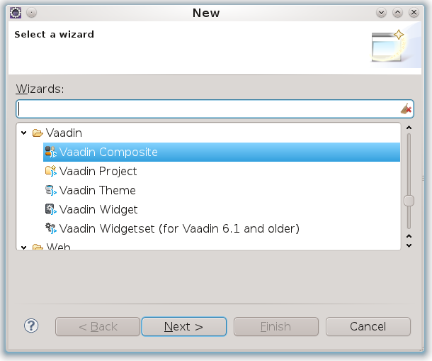
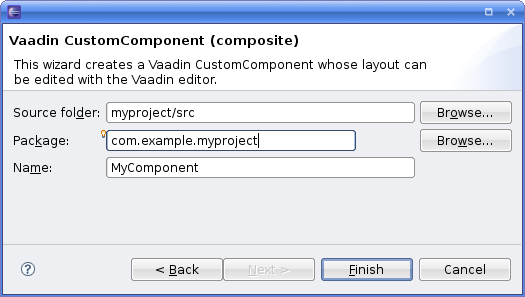
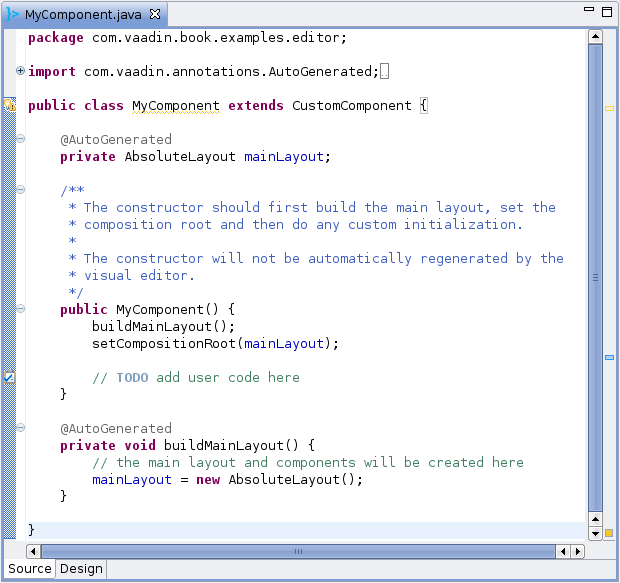
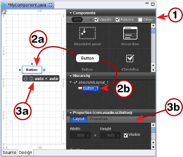
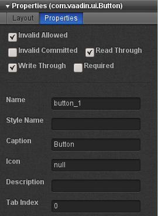
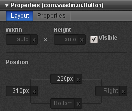

Vaadin Plugin for Eclipse
visual editor
CustomComponent
This chapter provides instructions for developing the graphical user
interface of Vaadin components with the Vaadin Plugin for the Eclipse
IDE.

Overview {#eclipse.overview}
========

The visual editor feature in the Vaadin Plugin for Eclipse allows you to
design the user interface of an entire application or of specific
composite components. The plugin generates the actual Java code, which
is designed to be reusable, so you can design the basic layout of the
user interface with the visual editor and build the user interaction
logic on top of the generated code. You can use inheritance and
composition to modify the components further.

The editor works with classes that extend the `CustomComponent` class,
which is the basic technique in Vaadin for creating composite
components. Component composition is described in ?. Any
`CustomComponent` will not do for the visual editor; you need to create
a new one as instructed below.

You can use a composite component just as you would use any Vaadin
component. However, the composite as well as its root layout, which is
an `AbsoluteLayout`, are full size (100% wide and high) by default. A
component with full size (expand-to-fit layout) may not normally be
inside a layout with undefined size (shrink-to-fit content). For
example, if you put a composite in a `VerticalLayout`, which has
undefined height by default, you have to set the layout explicitly to
have a defined height, either fixed or full (100%) height.

    public class MyUI extends UI {
        @Override
        protected void init(VaadinRequest request) {
            // Create the content root layout for the UI
            VerticalLayout content = new VerticalLayout();
            setContent(content);

            // Needed because the composites are full size
            content.setSizeFull();

            MyComposite myComposite = new MyComposite();
            content.addComponent(myComposite);
        }
    }

You could also set the size of the root layout of the composite to a
fixed height (in component properties in the visual editor). The
important thing to notice is that an `AbsoluteLayout` may never have
undefined size.

The visual editor is currently included in the Vaadin Plugin for
Eclipse. For its installation, see ?.

The editor runs in an internal browser in Eclipse. The actual browser
engine used depends on the operating system. Using the internal browser
must be enabled in Window \> Preferences \>
General \> Web Browsers.

In Ubuntu 12.04 and some other versions, no embedded browser engine is
installed in the system by default. You can use at least Firefox
XULRunner and WebKit. You can install WebKit as follows:

    $ sudo apt-get install libwebkitgtk-1.0-0

Then, restart Eclipse and check that the internal browser is enabled.

Creating a New Composite {#eclipse.composite-new}
========================

If the Vaadin Plugin is installed in Eclipse, you can create a new
composite component as follows.

1.  Select File \> New \> Other... in
    the main menu or right-click the Project Explorer and select New \> Other... to open the New window.

2.  In the first, Select a wizard step, select Vaadin \> Vaadin Composite and click Next.

    

3.  The Source folder is the root source directory where the new
    component will be created. This is by default the default source
    directory of your project.

    

    Enter the Java Package under which the new component class should be
    created or select it by clicking the Browse button. Also enter the
    class Name of the new component.

    Finally, click Finish to create the component.

A newly created composite component is opened in the Design window, as
shown in ?.

You can observe that a component that you can edit with the visual
editor has two tabs at the bottom of the view: Source and Design. These
tabs allow switching between the source view and the visual design view.

If you later open the source file for editing, the Source and Design
tabs should appear below the source editor. If they do not, right-click
the file in the Project Explorer and select Open With.

Using The Visual Editor {#eclipse.editor}
=======================

The visual editor view consists of, on the left side, an *editing area*
that displays the current layout and, on the right side, a *control
panel* that contains a *component list* for selecting new components to
add, the current *component tree*, and a *component property panel*.

Adding New Components
---------------------

Adding new components to the user interface is done as follows by
dragging them from the component list to either the editing area or to
the component tree. If you drag the components to the tree,

1.  Select which components are shown in the component list by entering
    a search string or by expanding the filters and selecting only the
    desired component categories.
2.  Drag a component from the component list to either:

    1.  Editing area, where you can easily move and resize the
        component. Dragging a component onto a layout component will add
        it in it and you can also position components within a layout by
        dragging them.
    2.  Component tree. Remember that you can only add components under
        a layout component or other component container.

3.  Edit the component properties

    1.  In the editing area, you can move and resize the components, and
        set their alignment in the containing layout.
    2.  In the property panel, you can set the component name, size,
        position and other properties.

You can delete a component by right-clicking it in the component tree
and selecting Remove. The context menu
also allows copying and pasting components.

A composite component created by the plugin must have a `AbsoluteLayout`
as its root layout. While it is suitable for the visual editor, absolute
layouts are rarely used otherwise in Vaadin applications. If you want to
use another root layout, you can add another layout inside the
`mainLayout` and set that as the root with setCompositionRoot() in the
source view. It will be used as the root when the component is actually
used in an application.

Setting Component Properties {#eclipse.editor.component-properties}
----------------------------

The property setting sub-panel of the control panel allows setting
component properties. The panel has two tabs: Layout and Properties,
where the latter defines the various basic properties.

### Basic Properties {#eclipse.editor.component-properties.basic}

The top section of the property panel, shown in ?, allows setting basic
component properties. The panel also includes properties such as field
properties for field components.

The properties are as follows:

Name

:   The name of the component, which is used for the reference to the
    component, so it must obey Java notation for variable names.

Style Name

:   A space-separated list of CSS style class names for the component.
    See ? for information on component styles in themes.

Caption

:   The caption of a component is usually displayed above the component.
    Some components, such as `Button`, display the caption inside the
    component. For `Label` text, you should set the value of the label
    instead of the caption, which should be left empty.

Description (tooltip)

:   The description is usually displayed as a tooltip when the mouse
    pointer hovers over the component for a while. Some components, such
    as `Form` have their own way of displaying the description.

Icon

:   The icon of a component is usually displayed above the component,
    left of the caption. Some components, such as `Button`, display the
    icon inside the component.

Content Type

:   Some components allow different content types, such as `Label`,
    which allow formatting either as TEXT, HTML, and PREFORMATTED.

Value

:   The component value. The value type and how it is displayed by the
    component varies between different component types and each value
    type has its own editor. The editor opens by clicking on the ...
    button.

Most of the basic component properties are defined in the `Component`
interface; see ? for further details.

### Layout Properties

The size of a component is determined by its width and height, which you
can give in the two edit boxes in the control panel. You can use any
unit specifiers for components, as described in ?. Emptying a size box
will make the size "automatic", which means setting the size as
*undefined*. In the generated code, the undefined value will be
expressed as "`-1px`".

Setting width of "`100px`" and *auto* (undefined or empty) height would
result in the following generated settings for a button:

    // myButton
    myButton = new Button();
    ...
    myButton.setHeight("-1px");
    myButton.setWidth("100px");
    ...

? shows the control panel area for the size and position.

The generated code for the example would be:

    // myButton
    myButton = new Button();
    myButton.setWidth("-1px");
    myButton.setHeight("-1px");
    myButton.setImmediate(true);
    myButton.setCaption("My Button");
    mainLayout.addComponent(myButton,
                            "top:243.0px;left:152.0px;");

The position is given as a CSS position in the second parameter for
addComponent(). The values "`-1px`" for width and height will make the
button to be sized automatically to the minimum size required by the
caption.

When editing the position of a component inside an `AbsoluteLayout`, the
editor will display vertical and horizontal guides, which you can use to
set the position of the component. See ? for more information about
editing absolute layouts.

The ZIndex setting controls the "Z coordinate" of the components, that
is, which component will overlay which when they overlap. Value `-1`
means automatic, in which case the components added to the layout later
will be on top.

Editing an `AbsoluteLayout` {#eclipse.editor.absolutelayout}
---------------------------

The visual editor has interactive support for the `AbsoluteLayout`
component that allows positioning components exactly at specified
coordinates. You can position the components using guides that control
the position attributes, shown in the control panel on the right. The
position values are measured in pixels from the corresponding edge; the
vertical and horizontal rulers show the distances from the top and left
edge.

? shows three components, a `Label`, a `Table`, and a `Button`, inside
an `AbsoluteLayout`.

Position attributes that are empty are *automatic* and can be either
zero (at the edge) or dynamic to make it shrink to fit the size of the
component, depending on the component. Guides are shown also for the
automatic position attributes and move automatically; in ? the right and
bottom edges of the `Button` are automatic.

Moving an automatic guide manually makes the guide and the corresponding
the position attribute non-automatic. To make a manually set attribute
automatic, empty it in the control panel. ? shows a `Label` component
with all the four edges set manually. Notice that if an automatic
position is 0, the guide is at the edge of the ruler.

Structure of a Visually Editable Component {#eclipse.structure}
==========================================

A component created by the wizard and later managed by the visual editor
has a very specific structure that allows you to insert your user
interface logic in the component while keeping a minimal amount of code
off-limits. You need to know what you can edit yourself and what exactly
is managed by the editor. The managed member variables and methods are
marked with the `AutoGenerated` annotation, as you can see later.

A visually editable component consists of:

-   Member variables containing sub-component references

-   Sub-component builder methods

-   The constructor

The structure of a composite component is hierarchical, a nested
hierarchy of layout components containing other layout components as
well as regular components. The root layout of the component tree, or
the *composition root* of the `CustomComponent`, is named `mainLayout`.
See ? for a detailed description of the structure of custom (composite)
components.

Sub-Component References {#eclipse.structure.references}
------------------------

The `CustomComponent` class will include a reference to each contained
component as a member variable. The most important of these is the
`mainLayout` reference to the composition root layout. Such
automatically generated member variables are marked with the
`@AutoGenerated` annotation. They are managed by the editor, so you
should not edit them manually, unless you know what you are doing.

A composite component with an `AbsoluteLayout` as the composition root,
containing a `Button` and a `Table` would have the references as
follows:

    public class MyComponent extends CustomComponent {

        @AutoGenerated
        private AbsoluteLayout mainLayout;
        @AutoGenerated
        private Button myButton;
        @AutoGenerated
        private Table myTable;
        ...

The names of the member variables are defined in the component
properties panel of the visual editor, in the Component name field, as
described in ?. While you can change the name of any other components,
the name of the root layout is always `mainLayout`. It is fixed because
the editor does not make changes to the constructor, as noted in ?. You
can, however, change the type of the root layout, which is an
`AbsoluteLayout` by default.

Certain typically static components, such as the `Label` label
component, will not have a reference as a member variable. See the
description of the builder methods below for details.

Sub-Component Builders {#eclipse.structure.builders}
----------------------

Every managed layout component will have a builder method that creates
the layout and all its contained components. The builder puts references
to the created components in their corresponding member variables, and
it also returns a reference to the created layout component.

Below is an example of an initial main layout:

    @AutoGenerated
    private AbsoluteLayout buildMainLayout() {
        // common part: create layout
        mainLayout = new AbsoluteLayout();
        
        // top-level component properties
        setHeight("100.0%");
        setWidth("100.0%");
        
        return mainLayout;
    }

Notice that while the builder methods return a reference to the created
component, they also write the reference directly to the member
variable. The returned reference might not be used by the generated code
at all (in the constructor or in the builder methods), but you can use
it for your purposes.

The builder of the main layout is called in the constructor, as
explained in ?. When you have a layout with nested layout components,
the builders of each layout will call the appropriate builder methods of
their contained layouts to create their contents.

The Constructor {#eclipse.structure.constructor}
---------------

When you create a new composite component using the wizard, it will
create a constructor for the component and fill its basic content.

        public MyComponent() {
            buildMainLayout();
            setCompositionRoot(mainLayout);

            // TODO add user code here
        }

The most important thing to do in the constructor is to set the
composition root of the `CustomComponent` with the setCompositionRoot()
(see ? for more details on the composition root). The generated
constructor first builds the root layout of the composite component with
buildMainLayout() and then uses the `mainLayout` reference.

The editor will not change the constructor afterwards, so you can safely
change it as you want. The editor does not allow changing the member
variable holding a reference to the root layout, so it is always named
`mainLayout`.
