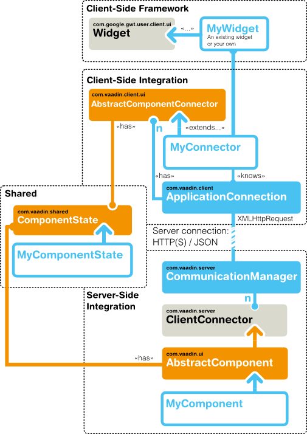
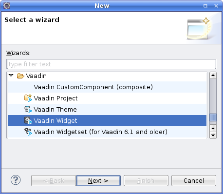
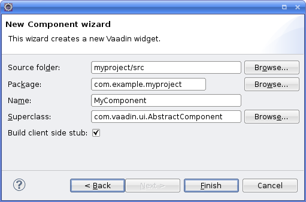
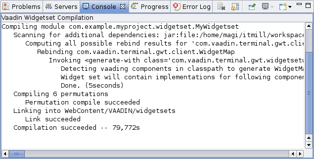
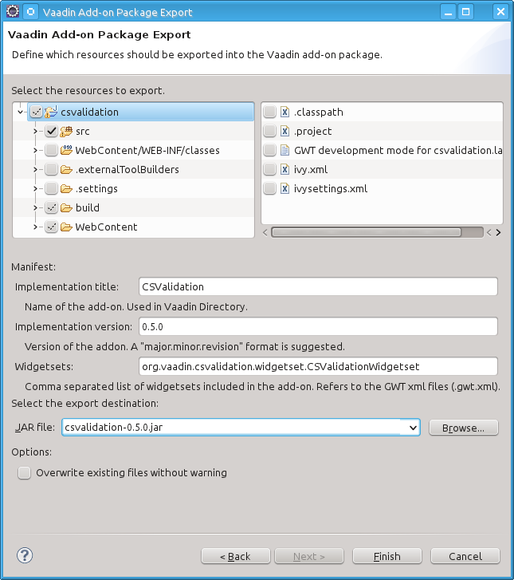
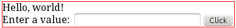

Google Web Toolkit
widgets
widgets
This chapter describes how you can integrate client-side widgets or
JavaScript components with a server-side component. The client-side
implementations of all standard server-side components in Vaadin use the
same client-side interfaces and patterns.

Overview {#gwt.overview}
========

Vaadin components consist of two parts: a server-side and a client-side
component. The latter are also called *widgets* in Google Web Toolkit
(GWT) parlance. A Vaadin application uses the API of the server-side
component, which is rendered as a client-side widget in the browser. As
on the server-side, the client-side widgets form a hierarchy of layout
widgets and regular widgets as the leaves.

The communication between a client-side widget and a server-side
component is managed with a *connector* that handles syncronizing the
widget state and events to and from the server-side. connector

When rendering the user interface, a client-side connector and a widget
are created for each server-side component. The mapping from a component
to a connector is defined in the connector class with a `@Connect`
annotation, and the widget is created by the connector class. @Connect

The state of a server-side component is synchronized automatically to
the client-side widget using a *shared state* object. A shared state
object implements the ComponentState interface and it is used both in
the server-side and the client-side component. On the client-side, a
connector always has access to its state instance, as well to the state
of its parent component state and the states of its children. state
object `ComponentState`

The state sharing assumes that state is defined with standard Java
types, such as primitive and boxed primitive types, `String`, arrays,
and certain collections (`List`, `Set`, and `Map`) of the supported
types. Also the Vaadin `Connector` and some special internal types can
be shared.

In addition to state, both server- and client-side can make remote
procedure calls (RPC) to the other side. RPC is used foremost for event
notifications. For example, when a client-side connector of a button
receives a click, it sends the event to the server-side using RPC.

Widget set compilation, as described in ?, requires using a special
project structure, where the client-side classes are located under a
`client` package under the package of the module descriptor. Any static
resources, such as stylesheets and images, should be located under a
`public` folder (not Java package). The source for the server-side
component may be located anywhere, except not in the client-side
package.

The basic project structure is illustrated in ?.

The Eclipse wizard, described in ?, creates a widget integration
skeleton with the above structure.

In addition to the GWT widget integration, Vaadin offers a simplified
way to integrate pure JavaScript components. The JavaScript connector
code is published from the server-side. As the JavaScript integration
does not involve GWT programming, no widget set compilation is needed.
JavaScript

Starting It Simple With Eclipse {#gwt.eclipse}
===============================

Eclipse
widget development
Let us first take the easy way and create a simple component with
Eclipse. While you can develop new widgets with any IDE or even without,
you may find Eclipse and the Vaadin Plugin for it useful, as it
automates all the basic routines of widget development, most importantly
the creation of new widgets.

Creating a Widget {#gwt.eclipse.widget}
-----------------

1.  Right-click the project in the Project Explorer and select New \> Other....

2.  In the wizard selection, select Vaadin \>
    Vaadin Widget and click Next.

    

3.  In the New Component Wizard, make the following settings.

    

    Source folder

    :   The root folder of the entire source tree. The default value is
        the default source tree of your project, and you should normally
        leave it unchanged unless you have a different project
        structure.

    Package

    :   The parent package under which the new server-side component
        should be created. If the project does not already have a widget
        set, one is created under this package in the widgetset
        subpackage. The subpackage will contain the `.gwt.xml`
        descriptor that defines the widget set and the new widget stub
        under the widgetset.client subpackage.

    Name

    :   The class name of the new *server-side component*. The name of
        the client-side widget stub will be the same but with
        "-`Widget`" suffix, for example, `MyComponentWidget`. You can
        rename the classes afterwards.

    Superclass

    :   The superclass of the server-side component. It is
        `AbstractComponent` by default, but
        `com.vaadin.ui.AbstractField` or `com.vaadin.ui.AbstractSelect`
        are other commonly used superclasses. If you are extending an
        existing component, you should select it as the superclass. You
        can easily change the superclass later.

    Template

    :   Select which template to use. The default is Full fledged, which
        creates the server-side component, the client-side widget, the
        connector, a shared state object, and an RPC object. The
        Connector only leaves the shared state and RPC objects out.

    Finally, click Finish to create the new component.

The wizard will:

-   Create a server-side component stub in the base package

-   If the project does not already have a widget set, the wizard
    creates a GWT module descriptor file (`.gwt.xml`) in the base
    package and modifies the servlet class or the `web.xml` deployment
    descriptor to specify the widget set class name parameter for the
    application

-   Create a client-side widget stub (along with the connector and
    shared state and RPC stubs) in the `client.componentname` package
    under the base package

The structure of the server-side component and the client-side widget,
and the serialization of component state between them, is explained in
the subsequent sections of this chapter.

To compile the widget set, click the Compile widget set button in the
Eclipse toolbar. See ? for details. After the compilation finishes, you
should be able to run your application as before, but using the new
widget set. The compilation result is written under the
`WebContent/VAADIN/widgetsets` folder. When you need to recompile the
widget set in Eclipse, see ?. For detailed information on compiling
widget sets, see ?.

The following setting is inserted in the `web.xml` deployment descriptor
to enable the widget set:

    <init-param>
        <description>Application widgetset</description>
        <param-name>widgetset</param-name>
        <param-value>com.example.myproject.widgetset.MyprojectApplicationWidgetset</param-value>
    </init-param>

You can refactor the package structure if you find need for it, but GWT
compiler requires that the client-side code *must* always be stored
under a package named "`client`" or a package defined with a `source`
element in the widget set descriptor.

Compiling the Widget Set {#gwt.eclipse.compiling}
------------------------

After you edit a widget, you need to compile the widget set. The Vaadin
Plugin for Eclipse automatically suggests to compile the widget set in
various situations, such as when you save a client-side source file. If
this gets annoying, you can disable the automatic recompilation in the
Vaadin category in project settings, by selecting the Suspend automatic
widgetset builds option.

You can compile the widget set manually by clicking the Compile
widgetset button in the Eclipse toolbar, shown in ?, while the project
is open and selected. If the project has multiple widget set definition
files, you need to select the one to compile in the Project Explorer.

The compilation progress is shown in the Console panel in Eclipse,
illustrated in ?. You should note especially the list of widget sets
found in the class path.

The compilation output is written under the
`WebContent/VAADIN/widgetsets` folder, in a widget set specific folder.

You can speed up the compilation significantly by compiling the widget
set only for your browser during development. The generated `.gwt.xml`
descriptor stub includes a disabled element that specifies the target
browser. See ? for more details on setting the `user-agent` property.

For more information on compiling widget sets, see ?. Should you compile
a widget set outside Eclipse, you need to refresh the project by
selecting it in Project Explorer and pressing F5.

Creating a Server-Side Component {#gwt.server-side}
================================

Typical server-side Vaadin applications use server-side components that
are rendered on the client-side using their counterpart widgets. A
server-side component must manage state synchronization between the
widget on the client-side, in addition to any server-side logic.

Basic Server-Side Component {#gwt.server-side.basic}
---------------------------

The component state is usually managed by a *shared state*, described
later in ?.

    public class MyComponent extends AbstractComponent {
        public MyComponent() {
            getState().setText("This is MyComponent");
        }

        @Override
        protected MyComponentState getState() {
            return (MyComponentState) super.getState();
        }
    }

Integrating the Two Sides with a Connector {#gwt.connector}
==========================================

A client-side widget is integrated with a server-side component with a
*connector*. A connector is a client-side class that communicates
changes to the widget state and events to the server-side.

A connector normally gets the state of the server-side component by the
*shared state*, described later in ?.

A Basic Connector {#gwt.connector.basic}
-----------------

The basic tasks of a connector is to hook up to the widget and handle
events from user interaction and changes received from the server. A
connector also has a number of routine infrastructure methods which need
to be implemented.

    @Connect(MyComponent.class)
    public class MyComponentConnector
            extends AbstractComponentConnector {

        @Override
        public MyComponentWidget getWidget() {
            return (MyComponentWidget) super.getWidget();
        }

        @Override
        public MyComponentState getState() {
            return (MyComponentState) super.getState();
        }

        @Override
        public void onStateChanged(StateChangeEvent stateChangeEvent)
        {
            super.onStateChanged(stateChangeEvent);
            
            // Do something useful
            final String text = getState().text;
            getWidget().setText(text);
        }
    }

Here, we handled state change with the crude onStateChanged() method
that is called when any of the state properties is changed. A finer and
simpler handling is achieved by using the `@OnStateChange` annotation on
a handler method for each property, or by `@DelegateToWidget` on a
shared state property, as described later in ?.

Communication with the Server-Side {#gwt.connector.communication}
----------------------------------

The main task of a connector is to communicate user interaction with the
widget to the server-side and receive state changes from the server-side
and relay them to the widget.

Server-to-client communication is normally done using a *shared state*,
as described in ?, as well as RPC calls. The serialization of the state
data is handled completely transparently. Once the client-side engine
receives the changes from the server, it reacts to them by creating and
notifying connectors that in turn manage widgets. This is described in ?
in more detail.

For client-to-server communication, a connector can make remote
procedure calls (RPC) to the server-side. Also, the server-side
component can make RPC calls to the connector. For a thorough
description of the RPC mechanism, refer to ?.

Shared State {#gwt.shared-state}
============

The basic communication from a server-side component to its the
client-side widget counterpart is handled using a *shared state*. The
shared state is serialized transparently. It should be considered
read-only on the client-side, as it is not serialized back to the
server-side.

A shared state object simply needs to extend the `ComponentState`. The
member variables should normally be declared as public.

    public class MyComponentState extends ComponentState {
        public String text;
    }

A shared state should never contain any logic. If the members have
private visibility for some reason, you can also use public setters and
getters, in which case the property must not be public.

The shared-state classes are used by both server- and client-side
classes, but widget set compilation requires that they must be located
in a client-side source package. The default location is under a
`client` package under the package of the `.gwt.xml` descriptor. If you
wish to organize the shared classes separately from other client-side
code, you can define separate client-side source packages for pure
client-side classes and any shared classes. In addition to shared state
classes, shared classes could include enumerations and other classes
needed by shared-state or RPC communication.

For example, you could have the following definitions in the `.gwt.xml`
descriptor:

        <source path="client" />
        <source path="shared" />

The paths are relative to the package containing the descriptor.

Accessing Shared State on Server-Side {#gwt.shared-state.component}
-------------------------------------

A server-side component can access the shared state with the getState()
method. It is required that you override the base implementation with
one that returns the shared state object cast to the proper type, as
follows:

    @Override
    public MyComponentState getState() {
        return (MyComponentState) super.getState();
    }

You can then use the getState() to access the shared state object with
the proper type.

    public MyComponent() {
        getState().setText("This is the initial state");
        ....
    }

Handing Shared State in a Connector {#gwt.shared-state.connector}
-----------------------------------

A connector can access a shared state with the getState() method. The
access should be read-only. It is required that you override the base
implementation with one that returns the proper shared state type, as
follows:

    @Override
    public MyComponentState getState() {
        return (MyComponentState) super.getState();
    }

State changes made on the server-side are communicated transparently to
the client-side. When a state change occurs, the onStateChanged() method
in the connector is called. You should should always call the superclass
method before anything else to handle changes to common component
properties.

    @Override
    public void onStateChanged(StateChangeEvent stateChangeEvent) {
        super.onStateChanged(stateChangeEvent);
            
        // Copy the state properties to the widget properties
        final String text = getState().getText();
        getWidget().setText(text);
    }

The crude onStateChanged() method is called when any of the state
properties is changed, allowing you to have even complex logic in how
you manipulate the widget according to the state changes. In most cases,
however, you can handle the property changes more easily and also more
efficiently by using instead the `@OnStateChange` annotation on the
handler methods for each property, as described next in ?, or by
delegating the property value directly to the widget, as described in ?.

The processing phases of state changes are described in more detail in
?.

Handling Property State Changes with `@OnStateChange` {#gwt.shared-state.onstatechange}
-----------------------------------------------------

The `@OnStateChange` annotation can be used to mark a connector method
that handles state change on a particular property, given as parameter
for the annotation. In addition to higher clarity, this avoids handling
all property changes if a state change occurs in only one or some of
them. However, if a state change can occur in multiple properties, you
can only use this technique if the properties do not have interaction
that prevents handling them separately in arbitrary order.

We can replace the onStateChange() method in the earlier connector
example with the following:

    @OnStateChange("text")
    void updateText() {
        getWidget().setText(getState().text);
    }

If the shared state property and the widget property have same name and
do not require any type conversion, as is the case in the above example,
you could simplify this even further by using the `@DelegateToWidget`
annotation for the shared state property, as described in ?.

Delegating State Properties to Widget {#gwt.shared-state.delegatetowidget}
-------------------------------------

The `@DelegateToWidget` annotation for a shared state property defines
automatic delegation of the property value to the corresponding widget
property of the same name and type, by calling the respective setter for
the property in the widget.

    public class MyComponentState extends AbstractComponentState {
        @DelegateToWidget
        public String text;
    }

This is equivalent to handling the state change in the connector, as
done in the example in ?.

If you want to delegate a shared state property to a widget property of
another name, you can give the property name as a string parameter for
the annotation.

    public class MyComponentState extends AbstractComponentState {
        @DelegateToWidget("description")
        public String text;
    }

Referring to Components in Shared State {#gwt.shared-state.referring}
---------------------------------------

While you can pass any regular Java objects through a shared state,
referring to another component requires special handling because on the
server-side you can only refer to a server-side component, while on the
client-side you only have widgets. References to components can be made
by referring to their connectors (all server-side components implement
the Connector interface).

    public class MyComponentState extends ComponentState {
        public Connector otherComponent;
    }

You could then access the component on the server-side as follows:

    public class MyComponent {
        public void MyComponent(Component otherComponent) {
            getState().otherComponent = otherComponent;
        }

        public Component getOtherComponent() {
            return (Component)getState().otherComponent;
        }

        // And the cast method
        @Override
        public MyComponentState getState() {
            return (MyComponentState) super.getState();
        }
    }

On the client-side, you should cast it in a similar fashion to a
`ComponentConnector`, or possibly to the specific connector type if it
is known.

Sharing Resources {#gwt.shared-state.resource}
-----------------

Resources, which commonly are references to icons or other images, are
another case of objects that require special handling. A Resource object
exists only on the server-side and on the client-side you have an URL to
the resource. You need to use the setResource() and getResource() on the
server-side to access a resource, which is serialized to the client-side
separately.

Let us begin with the server-side API:

    public class MyComponent extends AbstractComponent {
        ...

        public void setMyIcon(Resource myIcon) {
            setResource("myIcon", myIcon);
        }

        public Resource getMyIcon() {
            return getResource("myIcon");
        }
    }

On the client-side, you can then get the URL of the resource with
getResourceUrl().

    @Override
    public void onStateChanged(StateChangeEvent stateChangeEvent) {
        super.onStateChanged(stateChangeEvent);
        ...
        
        // Get the resource URL for the icon
        getWidget().setMyIcon(getResourceUrl("myIcon"));
    }

The widget could then use the URL, for example, as follows:

    public class MyWidget extends Label {
        ...
        
        Element imgElement = null;
        
        public void setMyIcon(String url) {
            if (imgElement == null) {
                imgElement = DOM.createImg();
                getElement().appendChild(imgElement);
            }
            
            DOM.setElementAttribute(imgElement, "src", url);
        }
    }

RPC Calls Between Client- and Server-Side {#gwt.rpc}
=========================================

Vaadin supports making Remote Procedure Calls (RPC) between a
server-side component and its client-side widget counterpart. RPC calls
are normally used for communicating stateless events, such as button
clicks or other user interaction, in contrast to changing the shared
state. Either party can make an RPC call to the other side. When a
client-side widget makes a call, a server request is made. Calls made
from the server-side to the client-side are communicated in the response
of the server request during which the call was made.

If you use Eclipse and enable the "Full-Fledged" widget in the New
Vaadin Widget wizard, it automatically creates a component with an RPC
stub.

RPC Calls to the Server-Side {#gwt.rpc.server-side}
----------------------------

RPC calls from the client-side to the server-side are made through an
RPC interface that extends the ServerRpc interface. A server RPC
interface simply defines any methods that can be called through the
interface.

For example:

    public interface MyComponentServerRpc extends ServerRpc {
        public void clicked(String buttonName);
    }

The above example defines a single clicks() RPC call, which takes a
`MouseEventDetails` object as the parameter.

You can pass the most common standard Java types, such as primitive and
boxed primitive types, `String`, and arrays and some collections
(`List`, `Set`, and `Map`) of the supported types. Also the Vaadin
`Connector` and some special internal types can be passed.

An RPC method must return void - the widget set compiler should complain
if it doesn't.

### Making a Call {#gwt.rpc.server-side.calling}

Before making a call, you need to instantiate the server RPC object with
RpcProxy.create(). After that, you can make calls through the server RPC
interface that you defined, for example as follows:

    @Connect(MyComponent.class)
    public class MyComponentConnector
           extends AbstractComponentConnector {

        public MyComponentConnector() {
            getWidget().addClickHandler(new ClickHandler() {
                public void onClick(ClickEvent event) {
                    final MouseEventDetails mouseDetails =
                         MouseEventDetailsBuilder
                             .buildMouseEventDetails(
                                     event.getNativeEvent(),
                                     getWidget().getElement());
                    MyComponentServerRpc rpc =
                        getRpcProxy(MyComponentServerRpc.class);

                    // Make the call
                    rpc.clicked(mouseDetails.getButtonName());
                }
            });
        }
    }

### Handling a Call {#gwt.rpc.server-side.handling}

RPC calls are handled in a server-side implementation of the server RPC
interface. The call and its parameters are serialized and passed to the
server in an RPC request transparently.

    public class MyComponent extends AbstractComponent {
        private MyComponentServerRpc rpc =
        new MyComponentServerRpc() {
            private int clickCount = 0;
            
            public void clicked(String buttonName) {
                Notification.show("Clicked " + buttonName);
            }
        };

        public MyComponent() {
            ...
            registerRpc(rpc);
        }
    }

Component and UICLASS Extensions {#gwt.extension}
================================

Adding features to existing components by extending them by inheritance
creates a problem when you want to combine such features. For example,
one add-on could add spell-check to a `TextField`, while another could
add client-side validation. Combining such add-on features would be
difficult if not impossible. You might also want to add a feature to
several or even to all components, but extending all of them by
inheritance is not really an option. Vaadin includes a component plug-in
mechanism for these purposes. Such plug-ins are simply called
*extensions*.

Also a UI can be extended in a similar fashion. In fact, some Vaadin
features such as the JavaScript execution are UI extensions.

Implementing an extension requires defining a server-side extension
class and a client-side connector. An extension can have a shared state
with the connector and use RPC, just like a component could.

Server-Side Extension API {#gwt.extension.server-side}
-------------------------

The server-side API for an extension consists of class that extends (in
the Java sense) the `AbstractExtension` class. It typically has an
*extend()* method, a constructor, or a static helper method that takes
the extended component or UI as a parameter and passes it to
*super.extend()*.

For example, let us have a trivial example with an extension that takes
no special parameters, and illustrates the three alternative APIs:

    public class CapsLockWarning extends AbstractExtension {
        // You could pass it in the constructor
        public CapsLockWarning(PasswordField field) {
            super.extend(field);
        }

        // Or in an extend() method
        public void extend(PasswordField field) {
            super.extend(field);
        }

        // Or with a static helper
        public static addTo(PasswordField field) {
            new CapsLockWarning().extend(field);
        }
    }

The extension could then be added to a component as follows:

    PasswordField password = new PasswordField("Give it");

    // Use the constructor
    new CapsLockWarning(password);

    // ... or with the extend() method
    new CapsLockWarning().extend(password);

    // ... or with the static helper
    CapsLockWarning.addTo(password);

    layout.addComponent(password);

Adding a feature in such a "reverse" way is a bit unusual in the Vaadin
API, but allows type safety for extensions, as the method can limit the
target type to which the extension can be applied, and whether it is a
regular component or a UI.

Extension Connectors {#gwt.extension.connector}
--------------------

An extension does not have a corresponding widget on the client-side,
but only an extension connector that extends the
`AbstractExtensionConnector` class. The server-side extension class is
specified with a `@Connect` annotation, just like in component
connectors.

An extension connector needs to implement the extend() method, which
allows hooking to the extended component. The normal extension mechanism
is to modify the extended component as needed and add event handlers to
it to handle user interaction. An extension connector can share a state
with the server-side extension as well as make RPC calls, just like with
components.

In the following example, we implement a "Caps Lock warning" extension.
It listens for changes in Caps Lock state and displays a floating
warning element over the extended component if the Caps Lock is on.

    @Connect(CapsLockWarning.class)
    public class CapsLockWarningConnector
            extends AbstractExtensionConnector {

        @Override
        protected void extend(ServerConnector target) {
            // Get the extended widget
            final Widget pw =
                    ((ComponentConnector) target).getWidget();

            // Preparations for the added feature
            final VOverlay warning = new VOverlay();
            warning.setOwner(pw);
            warning.add(new HTML("Caps Lock is enabled!"));

            // Add an event handler
            pw.addDomHandler(new KeyPressHandler() {
                public void onKeyPress(KeyPressEvent event) {
                    if (isEnabled() && isCapsLockOn(event)) {
                        warning.showRelativeTo(passwordWidget);
                    } else {
                        warning.hide();
                    }
                }
            }, KeyPressEvent.getType());
        }

        private boolean isCapsLockOn(KeyPressEvent e) {
            return e.isShiftKeyDown() ^
                   Character.isUpperCase(e.getCharCode());
        }
    }

The extend() method gets the connector of the extended component as the
parameter, in the above example a `PasswordFieldConnector`. It can
access the widget with the getWidget().

An extension connector needs to be included in a widget set. The class
must therefore be defined under the `client` package of a widget set,
just like with component connectors.

Styling a Widget {#gwt.styling}
================

To make your widget look stylish, you need to style it. There are two
basic ways to define CSS styles for a component: in the widget sources
and in a theme. A default style should be defined in the widget sources,
and different themes can then modify the style.

Determining the CSS Class {#gwt.styling.class}
-------------------------

The CSS class of a widget element is normally defined in the widget
class and set with setStyleName(). A widget should set the styles for
its sub-elements as it desires.

For example, you could style a composite widget with an overall style
and with separate styles for the sub-widgets as follows:

    public class MyPickerWidget extends ComplexPanel {
        public static final String CLASSNAME = "mypicker";

        private final TextBox textBox = new TextBox();
        private final PushButton button = new PushButton("...");

        public MyPickerWidget() {
            setElement(Document.get().createDivElement());
            setStylePrimaryName(CLASSNAME);

            textBox.setStylePrimaryName(CLASSNAME + "-field");
            button.setStylePrimaryName(CLASSNAME + "-button");

            add(textBox, getElement());
            add(button, getElement());

            button.addClickHandler(new ClickHandler() {
                public void onClick(ClickEvent event) {
                  Window.alert("Calendar picker not yet supported!");
                }
            });
        }
    }

In addition, all Vaadin components get the `v-widget` class. If it
extends an existing Vaadin or GWT widget, it will inherit CSS classes
from that as well.

Default Stylesheet {#gwt.styling.default}
------------------

A client-side module, which is normally a widget set, can include
stylesheets. They must be placed under the `public` folder under the
folder of the widget set, a described in ?.

For example, you could style the widget described above as follows:

    .mypicker {
        white-space: nowrap;
    }

    .mypicker-button {
        display: inline-block;
        border: 1px solid black;
        padding: 3px;
        width: 15px;
        text-align: center;
    }

Notice that some size settings may require more complex handling and
calculating the sizes dynamically.

Component Containers {#gwt.componentcontainer}
====================

Component containers, such as layout components, are a special group of
components that require some consideration. In addition to handling
state, they need to manage communicating the hierarchy of their
contained components to the other side.

The easiest way to implement a component container is extend the
`AbstractComponentContainer`, which handles the synchronization of the
container server-side components to the client-side.

Advanced Client-Side Topics {#gwt.advanced}
===========================

In the following, we mention some topics that you may encounter when
integrating widgets.

Client-Side Processing Phases {#gwt.advanced.phases}
-----------------------------

Vaadin's client-side engine reacts to changes from the server in a
number of phases, the order of which can be relevant for a connector.
The processing occurs in the handleUIDLMessage() method in
`ApplicationConnection`, but the logic can be quite overwhelming, so we
describe the phases in the following summary.

1.  Any dependencies defined by using `@JavaScript` or `@StyleSheet` on
    the server-side class are loaded. Processing does not continue until
    the browser confirms that they have been loaded.

2.  New connectors are instantiated and init() is run for each
    Connector.

3.  State objects are updated, but no state change event is fired yet.

4.  The connector hierarchy is updated, but no hierarchy change event is
    fired yet. setParent() and setChildren() are run in this phase.

5.  Hierarchy change events are fired. This means that all state objects
    and the entire hierarchy are already up to date when this happens.
    The DOM hierarchy should in theory be up to date after all hierarchy
    events have been handled, although there are some built-in
    components that for various reasons do not always live up to this
    promise.

6.  Captions are updated, causing updateCaption() to be invoked on
    layouts as needed.

7.  `@DelegateToWidget` is handled for all changed state objects using
    the annotation.

8.  State change events are fired for all changed state objects.

9.  updateFromUIDL() is called for legacy connectors.

10. All RPC methods received from the server are invoked.

11. Connectors that are no longer included in the hierarchy are
    unregistered. This calls onUnregister() on the Connector.

12. The layout phase starts, first checking the sizes and positions of
    all elements, and then notifying any ElementResizeListeners, as well
    as calling the appropriate layout method for the connectors that
    implement either `SimpleManagedLayout` or `DirectionalManagedLayout`
    interface.

Creating Add-ons {#gwt.addons}
================

add-ons
creating
Add-ons are the most convenient way to reuse Vaadin code, either
commercially or free. Vaadin Directory serves as the store for the
add-ons. You can distribute add-ons both as JAR libraries and Zip
packages.

Creating a typical add-on package involves the following tasks:

-   Compile server-side classes
-   Compile JavaDoc (optional)
-   Build the JAR

    -   Include Vaadin add-on manifest
    -   Include the compiled server-side classes
    -   Include the compiled JavaDoc (optional)
    -   Include sources of client-side classes for widget set
        compilation (optional)
    -   Include any JavaScript dependency libraries (optional)
    -   Exclude any test or demo code in the project

The exact contents depend on the add-on type. Component add-ons often
include a widget set, but not always, such as JavaScript components or
pure server-side components. You can also have data container and theme
add-ons, as well as various tools.

It is common to distribute the JavaDoc in a separate JAR, but you can
also include it in the same JAR.

Exporting Add-on in Eclipse {#gwt.addons.export}
---------------------------

If you use the Vaadin Plugin for Eclipse for your add-on project, you
can simply export the add-on from Eclipse.

1.  Select the project and then File \>
    Export from the menu

2.  In the export wizard that opens, select Vaadin \> Vaadin Add-on Package, and click
    Next

3.  In the Select the resources to export panel, select the content that
    should be included in the add-on package. In general, you should
    include sources in `src` folder (at least for the client-side
    package), compiled server-side classes, themes in
    `WebContent/VAADIN/themes`. These are all included automatically.
    You probably want to leave out any demo or example code.

    

    If you are submitting the add-on to Vaadin Directory, the
    Implementation title should be exactly the name of the add-on in
    Directory. The name may contain spaces and most other letters.
    Notice that *it is not possible to change the name later*.

    The Implementation version is the version of your add-on. Typically
    experimental or beta releases start from 0.1.0, and stable releases
    from 1.0.0.

    The Widgetsets field should list the widget sets included in the
    add-on, separated by commas. The widget sets should be listed by
    their class name, that is, without the `.gwt.xml` extension.

    The JAR file is the file name of the exported JAR file. It should
    normally include the version number of the add-on. You should follow
    the Maven format for the name, such as `myaddon-1.0.0.jar`.

    Finally, click Finish.

Building Add-on with Ant {#gwt.addons.ant}
------------------------

Building an add-on with Ant is similar to building Vaadin applications.
Vaadin libraries and other dependencies are retrieved and included in
the classpath using Apache Ivy.

In the following, we assume the same structure as in the Eclipse project
example. Let us put the build script in the `build` folder under the
project. We begin the Ant script as follows:

    <?xml version="1.0"?>

    <project xmlns:ivy="antlib:org.apache.ivy.ant"
             name="My Own add-on"
             basedir=".."
             default="package-jar">

The namespace declaration is all you need to do to enable Ivy in Ant 1.6
and later. For earlier Ant versions, please see the Ivy documentation.

### Configuration and Initialization {#gwt.addons.ant.configuration}

In the example script, we organize most settings in a `configure` target
and then initialize the build in `init` target.

    <target name="configure">
        <!-- Where project source files are located -->
        <property name="src-location" value="src" />
            
        <!-- Name of the widget set. -->
        <property name="widgetset" value="com.example.myaddon.widgetset.MyAddonWidgetset"/>

        <!-- Addon version -->
        <property name="version" value="0.1.0"/>
        
        <!-- Compilation result directory -->
        <property name="result-dir" value="build/result"/>
        
        <!-- The target name of the built add-on JAR -->
        <property name="target-jar"
            value="${result-dir}/myaddon-${version}.jar"/>
    </target>

    <target name="init" depends="configure">
        <!-- Construct and check classpath -->
        <path id="compile.classpath">
            <pathelement path="build/classes" />
            <pathelement path="${src-location}" />
            <fileset dir="${result-dir}/lib">
                <include name="*.jar"/>
            </fileset>
        </path>

        <mkdir dir="${result-dir}"/>
    </target>

You will need to make some configuration also in the `package-jar`
target in addition to the `configure` target.

### Compiling the Server-Side {#gwt.addons.ant.compiling}

Compiling the add-on requires the Vaadin libraries and any dependencies.
We use Apache Ivy for resolving the dependencies and retrieving the
library JARs.

    <!-- Retrieve dependencies with Ivy -->
    <target name="resolve" depends="init">
        <ivy:retrieve
            pattern="${result-dir}/lib/[artifact].[ext]"/>
    </target>

The `pattern` attribute for the `<retrieve>` task specifies where the
dependencies are stored, in the above case in the `build/result/lib`
directory.

Compiling the server-side classes is then straight-forward:

    <!-- Compile server-side -->
    <target name="compile-server-side"
            depends="init, resolve">
        <delete dir="${result-dir}/classes"/>
        <mkdir dir="${result-dir}/classes"/>

        <javac srcdir="${src-location}"
               destdir="${result-dir}/classes">
            <classpath>
                <path refid="compile.classpath"/>
            </classpath>
        </javac>
    </target>

### Compiling the JavaDoc {#gwt.addons.ant.javadoc}

You may want to include API documentation for the add-on in the same or
in a different JAR file. You can do it as follows, using the
configuration we defined earlier. You may want to exclude the
client-side classes and any test and demo classes from the JavaDoc, as
is done in this example, if they are in the same source tree.

    <!-- Compile JavaDoc -->
    <target name="compile-javadoc" depends="init">
        <delete dir="${result-dir}/javadoc"/>
        <mkdir dir="${result-dir}/javadoc"/>

        <javadoc destdir="${result-dir}/javadoc">
            <sourcefiles>
                <fileset dir="${src-location}" id="src">
                    <include name="**/*.java"/>
                    
                    <!-- Excluded stuff from the package -->
                    <exclude name="**/client/**/*"/>
                    <exclude name="**/demo/**/*"/>
                    <exclude name="**/MyDemoUI.java"/>
                </fileset>
            </sourcefiles>
            <classpath>
                <path refid="compile.classpath"/>
            </classpath>
        </javadoc>
    </target>

### Packaging the JAR {#gwt.addons.ant.package}

An add-on JAR typically includes the following:

-   Vaadin add-on manifest
-   The compiled server-side classes
-   The compiled JavaDoc (optional)
-   Sources of client-side classes (optional)
-   Any JavaScript dependency libraries (optional)

Let us begin crafting the target. The JAR requires the compiled
server-side classes and the optional API documentation.

    <!-- Build the JAR -->
    <target name="package-jar"
            depends="compile-server-side, compile-javadoc">
        <jar jarfile="${target-jar}" compress="true">

First, you need to include a manifest that defines basic information
about the add-on. The implementation title must be the exact title of
the add-on, as shown in the Vaadin Directory title. The vendor is you.
The manifest also includes the license title and file reference for the
add-on.

    <!-- Manifest required by Vaadin Directory -->
    <manifest>
        <attribute name="Vaadin-Package-Version"
                   value="1" />
        <attribute name="Vaadin-Widgetsets"
                   value="${widgetset}" />
        <attribute name="Implementation-Title"
                   value="My Own Addon" />
        <attribute name="Implementation-Version"
                   value="${version}" />
        <attribute name="Implementation-Vendor"
                   value="Me Myself" />
        <attribute name="Vaadin-License-Title"
                   value="Apache2" />
        <attribute name="Vaadin-License-File"
            value="http://www.apache.org/licenses/LICENSE-2.0" />
    </manifest>

The rest of the `package-jar` target goes as follows. As was done in the
JavaDoc compilation, you also need to exclude any test or demo code in
the project here. You need to modify at least the emphasized parts for
your project.

            <!-- Include built server-side classes -->
            <fileset dir="build/result/classes">
                <patternset>
                    <include name="com/example/myaddon/**/*"/>
                    <exclude name="**/client/**/*"/>
                    <exclude name="**/demo/**/*"/>
                    <exclude name="**/test/**/*"/>
                    <exclude name="**/MyDemoUI*"/>
                </patternset>
            </fileset>
        
            <!-- Include widget set sources -->
            <fileset dir="src">
                <patternset>
                    <include name="com/exaple/myaddon/**/*"/>
                </patternset>
            </fileset>
        
            <!-- Include JavaDoc in the JAR -->
            <fileset dir="${result-dir}/javadoc"
                     includes="**/*"/>
        </jar>
    </target>

You should now be ready to run the build script with Ant.

Migrating from Vaadin 6 {#gwt.vaadin-6-migration}
=======================

Vaadin 6 Migration
add-ons
The client-side architecture was redesigned almost entirely in Vaadin 7.
In Vaadin 6, state synchronization was done explicitly by serializing
and deserializing the state on the server- and client-side. In Vaadin 7,
the serialization is handled automatically by the framework using state
objects.

In Vaadin 6, a server-side component serialized its state to the
client-side using the Paintable interface in the client-side and
deserialized the state through the VariableOwner interface. In Vaadin 7,
these are done through the ClientConnector interface.

On the client-side, a widget deserialized its state through the
Paintable interface and sent state changes through the
ApplicationConnection object. In Vaadin 7, these are replaced with the
ServerConnector.

In addition to state synchronization, Vaadin 7 has an RPC mechanism that
can be used for communicating events. They are especially useful for
events that are not associated with a state change, such as a button
click.

The framework ensures that the connector hierarchy and states are
up-to-date when listeners are called.

Quick (and Dirty) Migration {#gwt.vaadin-6-migration.quick}
---------------------------

Vaadin 7 has a compatibility layer that allows quick conversion of a
widget.

1.  Create a connector class, such as `MyConnector`, that extends
    `LegacyConnector`. Implement the getWidget() method.

2.  Move the `@ClientWidget(MyWidget.class)` from the server-side
    component, say `MyComponent`, to the `MyConnector` class and make it
    `@Connect(MyComponent.class)`.

3.  Have the server-side component implement the LegacyComponent
    interface to enable compatibility handling.

4.  Remove any calls to `super.paintContent()`

5.  Update any imports on the client-side

Integrating JavaScript Components and Extensions {#gwt.javascript}
================================================

JavaScript integration
Vaadin allows simplified integration of pure JavaScript components, as
well as component and UI extensions. The JavaScript connector code is
published from the server-side. As the JavaScript integration does not
involve GWT programming, no widget set compilation is needed.

Example JavaScript Library {#gwt.javascript.example}
--------------------------

There are many kinds of component libraries for JavaScript. In the
following, we present a simple library that provides one object-oriented
JavaScript component. We use this example later to show how to integrate
it with a server-side Vaadin component.

The example library includes a single `MyComponent` component, defined
in `mylibrary.js`.

    // Define the namespace
    var mylibrary = mylibrary || {};

    mylibrary.MyComponent = function (element) {
        element.innerHTML =
            "
Hello, world!
" +
            "
Enter a value: " +
            "<input type='text' name='value'/>" +
            "<input type='button' value='Click'/>" +
            "
";

        // Style it
        element.style.border = "thin solid red";
        element.style.display = "inline-block";

        // Getter and setter for the value property
        this.getValue = function () {
            return element.
                getElementsByTagName("input")[0].value;
        };
        this.setValue = function (value) {
            element.getElementsByTagName("input")[0].value =
                value;
        };

        // Default implementation of the click handler
        this.click = function () {
            alert("Error: Must implement click() method");
        };

        // Set up button click
        var button = element.getElementsByTagName("input")[1];
        var self = this; // Can't use this inside the function
        button.onclick = function () {
            self.click();
        };
    };

When used in an HTML page, the library would be included with the
following definition:

    

You could then use it anywhere in the HTML document as follows:

    <!-- Placeholder for the component -->    
    

        
    <!-- Create the component and bind it to the placeholder -->
    

You could interact with the component with JavaScript for example as
follows:

    <a href="javascript:foo.setValue('New value')">Click here</a>

A Server-Side API for a JavaScript Component {#gwt.javascript.server-side}
--------------------------------------------

To begin integrating such a JavaScript component, you would need to
sketch a bit how it would be used from a server-side Vaadin application.
The component should support writing the value as well as listening for
changes to it.

    final MyComponent mycomponent = new MyComponent();

    // Set the value from server-side
    mycomponent.setValue("Server-side value");

    // Process a value input by the user from the client-side
    mycomponent.addValueChangeListener(
            new MyComponent.ValueChangeListener() {
        @Override
        public void valueChange() {
            Notification.show("Value: " + mycomponent.getValue());
        }
    });

    layout.addComponent(mycomponent);

### Basic Server-Side Component {#gwt.javascript.server-side.component}

A JavaScript component extends the `AbstractJavaScriptComponent`, which
handles the shared state and RPC for the component.

    package com.vaadin.book.examples.client.js;

    @JavaScript({"mylibrary.js", "mycomponent-connector.js"})
    public class MyComponent extends AbstractJavaScriptComponent {
        public interface ValueChangeListener extends Serializable {
            void valueChange();
        }
        ArrayList<ValueChangeListener> listeners =
                new ArrayList<ValueChangeListener>();
        public void addValueChangeListener(
                       ValueChangeListener listener) {
            listeners.add(listener);
        }
        
        public void setValue(String value) {
            getState().value = value;
        }
        
        public String getValue() {
            return getState().value;
        }

        @Override
        protected MyComponentState getState() {
            return (MyComponentState) super.getState();
        }
    }

Notice later when creating the JavaScript connector that its name must
match the package name of this server-side class.

The shared state of the component is as follows:

    public class MyComponentState extends JavaScriptComponentState {
        public String value;
    }

If the member variables are private, you need to have public setters and
getters for them, which you can use in the component.

Defining a JavaScript Connector {#gwt.javascript.connector}
-------------------------------

A JavaScript connector is a function that initializes the JavaScript
component and handles communication between the server-side and the
JavaScript code.

A connector is defined as a connector initializer function that is added
to the `window` object. The name of the function must match the
server-side class name, with the full package path. Instead of the Java
dot notation for the package name, underscores need to be used as
separators.

The Vaadin client-side framework adds a number of methods to the
connector function. The this.getElement() method returns the HTML DOM
element of the component. The this.getState() returns a shared state
object with the current state as synchronized from the server-side.

    window.com_vaadin_book_examples_client_js_MyComponent =
    function() {
        // Create the component
        var mycomponent =
            new mylibrary.MyComponent(this.getElement());
        
        // Handle changes from the server-side
        this.onStateChange = function() {
            mycomponent.setValue(this.getState().value);
        };

        // Pass user interaction to the server-side
        var self = this;
        mycomponent.click = function() {
            self.onClick(mycomponent.getValue());
        };
    };

In the above example, we pass user interaction using the JavaScript RPC
mechanism, as described in the next section.

RPC from JavaScript to Server-Side {#gwt.javascript.rpc}
----------------------------------

User interaction with the JavaScript component has to be passed to the
server-side using an RPC (Remote Procedure Call) mechanism. The
JavaScript RPC mechanism is almost equal to regular client-side widgets,
as described in ?.

### Handling RPC Calls on the Server-Side {#gwt.javascript.rpc.handling}

Let us begin with the RPC function registration on the server-side. RPC
calls are handled on the server-side in function handlers that implement
the JavaScriptFunction interface. A server-side function handler is
registered with the addFunction() method in
`AbstractJavaScriptComponent`. The server-side registration actually
defines a JavaScript method that is available in the client-side
connector object.

Continuing from the server-side `MyComponent` example we defined
earlier, we add a constructor to it that registers the function.

    public MyComponent() {
        addFunction("onClick", new JavaScriptFunction() {
            @Override
            public void call(JsonArray arguments) {
                getState().setValue(arguments.getString(0));
                for (ValueChangeListener listener: listeners)
                    listener.valueChange();
            }
        });
    }

### Making an RPC Call from JavaScript {#gwt.javascript.rpc.calling}

An RPC call is made simply by calling the RPC method in the connector.
In the constructor function of the JavaScript connector, you could write
as follows (the complete connector code was given earlier):

    window.com_vaadin_book_examples_gwt_js_MyComponent =
        function() {
            ...
            var connector = this;
            mycomponent.click = function() {
                connector.onClick(mycomponent.getValue());
            };
        };

Here, the `mycomponent.click` is a function in the example JavaScript
library, as described in ?. The onClick() is the method we defined on
the server-side. We pass a simple string parameter in the call.

You can pass anything that is valid in JSON notation in the parameters.
