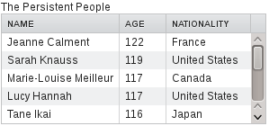

JPAContainer
This chapter describes the use of the Vaadin JPAContainer add-on.

Overview {#jpacontainer.overview}
========

Vaadin JPAContainer add-on makes it possible to bind user interface
components to a database easily using the Java Persistence API (JPA). It
is an implementation of the Container interface described in ?. It
supports a typical three-layer application architecture with an
intermediate *domain model* between the user interface and the data
access layer.

The role of Java Persistence API is to handle persisting the domain
model in the database. The database is typically a relational database.
Vaadin JPAContainer binds the user interface components to the domain
model and handles database access with JPA transparently.

JPA is really just an API definition and has many alternative
implementations. Vaadin JPAContainer supports especially EclipseLink,
which is the reference implementation of JPA, and Hibernate. Any other
compliant implementation should work just as well. The architecture of
an application using JPAContainer is shown in ?.

Vaadin JPAContainer also plays together with the Vaadin support for Java
Bean Validation (JSR 303).

Java Persistence API (JPA) is an API for object-relational mapping (ORM)
of Java objects to a relational database. In JPA and entity-relationship
modeling in general, a Java class is considered an *entity*. Class (or
entity) instances correspond with a row in a database table and member
variables of a class with columns. Entities can also have relationships
with other entities.

The object-relational mapping is illustrated in ? with two entities with
a one-to-many relationship.

The entity relationships are declared with metadata. With Vaadin
JPAContainer, you provide the metadata with annotations in the entity
classes. The JPA implementation uses reflection to read the annotations
and defines a database model automatically from the class definitions.
Definition of the domain model and the annotations are described in ?.

The main interface in JPA is the EntityManager, which allows making
different kinds of queries either with the Java Persistence Query
Language (JPQL), native SQL, or the Criteria API in JPA 2.0. You can
always use the interface directly as well, using Vaadin JPAContainer
only for binding the data to the user interface.

Vaadin JPAContainer supports JPA 2.0 (JSR 317). It is available under
the Apache License 2.0.

The `JPAContainer` is an implementation of the Vaadin Container
interface that you can bind to user interface components such as
`Table`, `ComboBox`, etc.

The data access to the persistent entities is handled with a *entity
provider*, as defined in the EntityProvider interface. JPAContainer
provides a number of different entity providers for different use cases
and optimizations. The built-in providers are described in ?.

`JPAContainer` is by default *unbuffered*, so that any entity property
changes are written immediately to the database when you call setValue()
for a property, or when a user edits a bound field. A container can be
set as *buffered*, so that changes are written on calling commit().
Buffering can be done both at item level, such as when updating item
property values, or at container level, such as when adding or deleting
items. Only *batchable* containers, that is, containers with a batchable
entity provider, can be buffered. Note that buffering is recommended for
situations where two users could update the same entity simultaneously,
and when this would be a problem. In an unbuffered container, the entity
is refreshed before writing an update, so the last write wins and a
conflicting simultaneous update written before it is lost. A buffered
container throws an `OptimisticLockException` when two users edit the
same item (an unbuffered container never throws it), thereby allowing to
handle the situation with application logic.

In addition to this chapter in the book, the installation package
includes the following documentation about JPAContainer:

-   API Documentation

-   JPAContainer Tutorial

-   JPAContainer AddressBook Demo

-   JPAContainer Demo

Installing {#jpacontainer.installation}
==========

Vaadin JPAContainer can be installed either as an installation package,
downloaded from the Vaadin Directory, or as a Maven dependency. You can
also create a new JPAContainer-enabled Vaadin project using a Maven
archetype.

Downloading the Package {#jpacontainer.installation.download}
-----------------------

Vaadin JPAContainer is available for download from the [Vaadin
Directory](#). Please see ? for basic instructions for downloading from
Directory. The download page also gives the dependency declaration
needed for retrieving the library with Maven.

JPAContainer is a purely server-side component, so it does not include a
widget set that you would need to compile.

Installation Package Content {#jpacontainer.installation.package}
----------------------------

Once extracted to a local folder, the contents of the installation
directory are as follows:

`README`

:   A readme file describing the package contents.

`LICENSE`

:   The full license text for the library.

`vaadin-jpacontainer-3.x.x.jar`

:   The actual Vaadin JPAContainer library.

`vaadin-jpacontainer-3.x.x-sources.jar`

:   Source JAR for the library. You can use it for example in Eclipse by
    associating the JavaDoc JAR with the JPAContainer JAR in the build
    path settings of your project.

`jpacontainer-tutorial.pdf`

:   The tutorial in PDF format.

`jpacontainer-tutorial-html`

:   The tutorial in HTML format.

`jpacontainer-addressbook-demo`

:   The JPAContainer AddressBook Demo project covered in this tutorial.
    You can compile and package the application as a WAR with "`mvn`
    `package`" or launch it in the Jetty web browser with "`mvn`
    `jetty:run`". You can also import the demo project in Eclipse.

Downloading with Maven {#jpacontainer.installation.maven}
----------------------

The [download page in Vaadin Directory](#) gives the dependency
declaration needed for retrieving the Vaadin JPAContainer library with
Maven.

    <dependency>
       <groupId>com.vaadin.addon</groupId>
       <artifactId>jpacontainer-addon</artifactId>
       <version>3.1.0</version>
    </dependency>

Use the `LATEST` version tag to automatically download the latest stable
release or use a specific version number as done above.

See ? for detailed instructions for using a Vaadin add-on with Maven.

### Using the Maven Archetype {#jpacontainer.installation.maven.archetype}

If you wish to create a new JPAContainer-enabled Vaadin project with
Maven, you can use the `vaadin-archetype-jpacontainer` archetype. Please
see ? for details on creating a Vaadin project with a Maven archetype.

Including Libraries in Your Project {#jpacontainer.installation.libraries}
-----------------------------------

The Vaadin JPAContainer JAR must be included in the library folder of
the web application. It is located in `WEB-INF/lib` path in a web
application. In a normal Eclipse web projects the path is
`WebContent/WEB-INF/lib`. In Maven projects the JARs are automatically
included in the folder, as long as the dependencies are defined
correctly.

You will need the following JARs:

-   Vaadin Framework Library

-   Vaadin JPAContainer

-   Java Persistence API 2.0 (javax.persistence package)

-   JPA implementation (EclipseLink, Hibernate, ...)

-   Database driver or embedded engine (H2, HSQLDB, MySQL, PostgreSQL,
    ...)

If you use Eclipse, the Vaadin Framework library is automatically
downloaded and updated by the Vaadin Plugin for Eclipse.

To use bean validation, you need an implementation of the Bean
Validation, such as Hibernate Validator.

Persistence Configuration {#jpacontainer.installation.configuration}
-------------------------

Persistence configuration is done in a `persistence.xml` file. In a
regular Eclipse project, it should be located in
`WebContent/WEB-INF/classes/META-INF`. In a Maven project, it should be
in `src/main/resources/META-INF`. The configuration includes the
following:

-   The persistence unit

-   The persistence provider

-   The database driver and connection

-   Logging

The `persistence.xml` file is packaged as
`WEB-INF/classes/META-INF/persistence.xml` in the WAR. This is done
automatically in a Maven build at the package phase.

### Persistence XML Schema {#jpacontainer.installation.configuration.schema}

The beginning of a `persistence.xml` file defines the used schema and
namespaces:

    <?xml version="1.0" encoding="UTF-8"?>
    <persistence
        xmlns="http://java.sun.com/xml/ns/persistence"
        xmlns:xsi="http://www.w3.org/2001/XMLSchema-instance"
        xsi:schemaLocation="
          http://java.sun.com/xml/ns/persistence
          http://java.sun.com/xml/ns/persistence/persistence_2_0.xsd"
        version="2.0">

### Defining the Persistence Unit {#jpacontainer.installation.configuration.unit}

The root element of the persistence definition is persistence-unit. The
name of the persistence unit is needed for creating `JPAContainer`
instances from a `JPAContainerFactory`, as described in ? or when
creating a JPA entity manager.

    <persistence-unit name="addressbook">

Persistence provider is the JPA provider implementation used. For
example, the JPAContainer AddressBook demo uses the EclipseLink JPA,
which is defined as follows:

    <provider>
        org.eclipse.persistence.jpa.PersistenceProvider
    </provider>

The persistent classes need to be listed with a `<class>` element.
Alternatively, you can allow including unlisted classes for persistence
by overriding the `exclude-unlisted-classes` default as follows:

    <exclude-unlisted-classes>false</exclude-unlisted-classes>

JPA provider specific parameters are given under the `properties`
element.

    <properties>
       ...

In the following section we give parameters for the EclipseLink JPA and
H2 database used in the JPAContainer AddressBook Demo. Please refer to
the documentation of the JPA provider you use for a complete reference
of parameters.

### Database Connection {#jpacontainer.installation.configuration.database}

EclipseLink allows using JDBC for database connection. For example, if
we use the the H2 database, we define its driver here as follows:

    <property name="eclipselink.jdbc.platform"
     value="org.eclipse.persistence.platform.database.H2Platform"/>
    <property name="eclipselink.jdbc.driver"
              value="org.h2.Driver" />

Database connection is specified with a URL. For example, using an
embedded H2 database stored in the home directory it would be as
follows:

    <property name="eclipselink.jdbc.url"
              value="jdbc:h2:~/my-app-h2db"/>

A hint: when using an embedded H2 database while developing a Vaadin
application in Eclipse, you may want to add `;FILE_LOCK=NO` to the URL
to avoid locking issues when redeploying.

We can just use the default user name and password for the H2 database:

    <property name="eclipselink.jdbc.user" value="sa"/>
    <property name="eclipselink.jdbc.password" value="sa"/>

### Logging Configuration {#jpacontainer.installation.configuration.logging}

JPA implementations as well as database engines like to produce logs and
they should be configured in the persistence configuration. For example,
if using EclipseLink JPA, you can get log that includes all SQL
statements with the `FINE` logging level:

    <property name="eclipselink.logging.level" 
              value="FINE" />

### Other Settings {#jpacontainer.installation.configuration.other}

The rest is some Data Definition Language settings for EclipseLink.
During development, when we use generated example data, we want
EclipseLink to drop tables before trying to create them. In production
environments, you should use `create-tables`.

    <property name="eclipselink.ddl-generation" 
              value="drop-and-create-tables" />

And there is no need to generate SQL files, just execute them directly
to the database.

    <property name="eclipselink.ddl-generation.output-mode"
              value="database"/>
          </properties>
     </persistence-unit>
    </persistence>

Troubleshooting {#jpacontainer.installation.troubleshooting}
---------------

Below are some typical errors that you might get when using JPA. These
are not specific to JPAContainer.

`javax.persistence.PersistenceException`: No Persistence provider for EntityManager

:   The most typical cases for this error are that the persistence unit
    name is wrong in the source code or in the `persistence.xml` file,
    or that the `persistence.xml` is at a wrong place or has some other
    problem. Make sure that the persistence unit name matches and the
    `persistence.xml` is in `WEB-INF/classes/META-INF` folder in the
    deployment.

`java.lang.IllegalArgumentException`: The class is not an entity

:   The class is missing from the set of persistent entities. If the
    `persistence.xml` does not have `exclude-unlisted-classes` defined
    as `false`, the persistent entity classes should be listed with
    `<class>` elements.

Defining a Domain Model {#jpacontainer.domain-model}
=======================

Developing a persistent application begins with defining a domain model.
A domain model consists of a number of entities (classes) and
relationships between them.

? illustrates a simple domain model as a UML class diagram. It has two
entities: `Country` and `Person`. They have a "country has persons"
relationship. This is a *one-to-many relationship* with one country
having many persons, each of which belongs to just one country.

Realized in Java, the classes are as follows:

    public class Country {
        private Long   id;
        private String name;
        private Set<Person> persons;

        ... setters and getters ...
    }

    public class Person {
        private Long    id;
        private String  name;
        private Integer age;
        private Country country;

        ... setters and getters ...
    }

You should make the classes proper beans by defining a default
constructor and implementing the Serializable interface. A default
constructor is required by the JPA entity manager for instantiating
entities. Having the classes serializable is not required but often
useful for other reasons.

After you have a basic domain model, you need to define the entity
relationship metadata by annotating the classes.

Persistence Metadata {#jpacontainer.domain-model.annotation}
--------------------

The entity relationships are defined with metadata. The metadata can be
defined in an XML metadata file or with Java annotations defined in the
javax.persistence package. With Vaadin JPAContainer, you need to provide
the metadata as annotations.

For example, if we look at the Person class in the JPAContainer
AddressBook Demo, we define various database-related metadata for the
member variables of a class:

    @Entity
    public class Person {
        @Id
        @GeneratedValue(strategy = GenerationType.AUTO)
        private Long    id;

        private String  name;
        private Integer age;

        @ManyToOne
        private Country country;

The JPA implementation uses reflection to read the annotations and
defines a database model automatically from the class definitions.

Let us look at some of the basic JPA metadata annotations. The
annotations are defined in the javax.persistence package. Please refer
to JPA reference documentation for the complete list of possible
annotations.

### Annotation: `@Entity` {#jpacontainer.domain-model.metadata.entity}

Each class that is enabled as a persistent entity must have the
`@Entity` annotation.

    @Entity
    public class Country {

### Annotation: `@Id` {#jpacontainer.domain-model.annotation.id}

Entities must have an identifier that is used as the primary key for the
table. It is used for various purposes in database queries, most
commonly for joining tables.

    @Id
    @GeneratedValue(strategy = GenerationType.AUTO)
    private Long id;

The identifier is generated automatically in the database. The strategy
for generating the identifier is defined with the `@GeneratedValue`
annotation. Any generation type should work.

### Annotation: `@OneToOne` {#jpacontainer.domain-model.annotation.onetoone}

The `@OneToOne` annotation describes a one-to-one relationship where
each entity of one type is associated with exactly one entity of another
type. For example, the postal address of a person could be given as
such.

    @OneToOne
    private Address address;

When using the JPAContainer `FieldFactory` to automatically create
fields for a form, the `@OneToOne` relationship generates a nested
`Form` to edit the data. See ? for more details.

### Annotation: `@Embedded` {#jpacontainer.domain-model.annotation.embedded}

Just as with the `@OneToOne` annotation, `@Embedded` describes a
one-to-one relationship, but says that the referenced entity should be
stored as columns in the same table as the referencing entity.

    @Embedded
    private Address address;

The referenced entity class must have `@Embeddable` annotation.

The JPAContainer `FieldFactory` generates a nested `Form` for
`@Embedded`, just as with `@OneToOne`.

### Annotation: `@OneToMany` {#jpacontainer.domain-model.annotation.onetomany}

The `Country` entity in the domain model has a *one-to-many*
relationship with the `Person` entity ("country has persons"). This
relationship is represented with the `@OneToMany` annotation. The
`mappedBy` parameter names the corresponding back-reference in the
`Person` entity.

    @OneToMany(mappedBy = "country")
    private Set<Person> persons;

When using the JPAContainer `FieldFactory` to automatically create
fields for a form, the `@OneToMany` relationship generates a
`MasterDetailEditor` for editing the items. See ? for more details.

### Annotation: `@ElementCollection` {#jpacontainer.domain-model.annotation.elementcollection}

The `@ElementCollection` annotation can be used for one-to-many
relationships to a collection of basic values such as `String` or
`Integer`, or to entities annotated as `@Embeddable`. The referenced
entities are stored in a separate table defined with a
`@CollectionTable` annotation.

    @ElementCollection
    @CollectionTable(
        name="OLDPEOPLE",
        joinColumns=@JoinColumn(name="COUNTRY_ID"))
    private Set<Person> persons;

JPAContainer `FieldFactory` generates a `MasterDetailEditor` for the
`@ElementCollection` relationship, just as with `@OneToMany`.

### Annotation: `@ManyToOne` {#jpacontainer.domain-model.annotation.manytoone}

Many people can live in the same country. This would be represented with
the `@ManyToOne` annotation in the `Person` class.

    @ManyToOne
    private Country country;

JPAContainer `FieldFactory` generates a `NativeSelect` for selecting an
item from the collection. You can do so yourself as well in a custom
field factory. Doing so you need to pay notice not to confuse the
container between the referenced entity and its ID, which could even
result in insertion of false entities in the database in some cases. You
can handle conversion between an entity and the entity ID using the
`SingleSelectConverter` as follows:

    @Override
    public <T extends Field> T createField(Class<?> dataType,
                                           Class<T> fieldType) {
        if (dataType == Country.class) {
           JPAContainer<Country> countries =
               JPAContainerFactory.make(Country.class, "mypunit");
           ComboBox cb = new ComboBox(null, countries);
           cb.setConverter(new SingleSelectConverter<Country>(cb));
           return (T) cb;
        }
        return super.createField(dataType, fieldType);
    }

The JPAContainer `FieldFactory` uses the translator internally, so using
it also avoids the problem.

### Annotation: `@Transient` {#jpacontainer.domain-model.annotation.transient}

JPA assumes that all entity properties are persisted. Properties that
should not be persisted should be marked as transient with the
`@Transient` annotation.

    @Transient
    private Boolean superDepartment;
    ...
    @Transient
    public String getHierarchicalName() {
    ...

Basic Use of JPAContainer {#jpacontainer.usage}
=========================

Vaadin JPAContainer offers a highly flexible API that makes things easy
in simple cases while allowing extensive flexibility in demanding cases.
To begin with, it is a `Container`, as described in ?.

In this section, we look how to create and use `JPAContainer` instances.
We assume that you have defined a domain model with JPA annotations, as
described in the previous section.

Creating `JPAContainer` with `JPAContainerFactory` {#jpacontainer.usage.jpacontainerfactory}
--------------------------------------------------

The `JPAContainerFactory` is the easy way to create `JPAContainer`s. It
provides a set of *make...()* factory methods for most cases that you
will likely meet. Each factory method uses a different type of entity
provider, which are described in ?.

The factory methods take the class type of the entity class as the first
parameter. The second parameter is either a persistence unit name
(persistence context) or an `EntityManager` instance.

    // Create a persistent person container
    JPAContainer<Person> persons =
        JPAContainerFactory.make(Person.class, "book-examples");

    // You can add entities to the container as well
    persons.addEntity(new Person("Marie-Louise Meilleur", 117));

    // Set up sorting if the natural order is not appropriate
    persons.sort(new String[]{"age", "name"},
                 new boolean[]{false, false});

    // Bind it to a component
    Table personTable = new Table("The Persistent People", persons);
    personTable.setVisibleColumns("id","name","age");
    layout.addComponent(personTable);

It's that easy. In fact, if you run the above code multiple times,
you'll be annoyed by getting a new set of persons for each run - that's
how persistent the container is. The basic make() uses a
`CachedMutableLocalEntityProvider`, which allows modifying the container
and its entities, as we do above by adding new entities.

When using just the persistence unit name, the factory creates an
instance of `EntityManagerFactory` for the persistence unit and uses it
to build entity managers. You can also create the entity managers
yourself, as described later.

The entity providers associated with the different factory methods are
as follows:

  ------------------------- -------------------------------------
  make()                    `CachingMutableLocalEntityProvider`
  makeReadOnly()            `CachingLocalEntityProvider`
  makeBatchable()           `BatchableLocalEntityProvider`
  makeNonCached()           `MutableLocalEntityProvider`
  makeNonCachedReadOnly()   `LocalEntityProvider`
  ------------------------- -------------------------------------

  : `JPAContainerFactory` Methods

`JPAContainerFactory` holds a cache of entity manager factories for the
different persistence units, making sure that any entity manager factory
is created only once, as it is a heavy operation. You can access the
cache to get a new entity manager with the
createEntityManagerForPersistenceUnit() method.

    // Get an entity manager
    EntityManager em = JPAContainerFactory.
        createEntityManagerForPersistenceUnit("book-examples");

    // Do a query
    em.getTransaction().begin();
    em.createQuery("DELETE FROM Person p").executeUpdate();
    em.persist(new Person("Jeanne Calment", 122));
    em.persist(new Person("Sarah Knauss", 119));
    em.persist(new Person("Lucy Hannah", 117));
    em.getTransaction().commit();

    ...

Notice that if you use update the persistent data with an entity manager
outside a `JPAContainer` bound to the data, you need to refresh the
container as described in ?.

### Creating `JPAContainer` Manually {#jpacontainer.usage.jpacontainerfactory.thehardway}

While it is normally easiest to use a `JPAContainerFactory` to create
`JPAContainer` instances, you may need to create them manually. It is
necessary, for example, when you need to use a custom entity provider or
extend `JPAContainer`.

First, we need to create an entity manager and then the entity provider,
which we bind to a `JPAContainer`.

    // We need a factory to create entity manager
    EntityManagerFactory emf =
        Persistence.createEntityManagerFactory("book-examples");

    // We need an entity manager to create entity provider
    EntityManager em = emf.createEntityManager();

    // We need an entity provider to create a container        
    CachingMutableLocalEntityProvider<Person> entityProvider =
        new CachingMutableLocalEntityProvider<Person>(Person.class,
                                                      em);

    // And there we have it
    JPAContainer<Person> persons =
            new JPAContainer<Person> (Person.class);
    persons.setEntityProvider(entityProvider);

You could save the first step by asking the entity manager from the
`JPAContainerFactory`.

Creating and Accessing Entities {#jpacontainer.usage.entitites}
-------------------------------

JPAContainer integrates with the JPA entity manager, which you would
normally use to create and access entities with JPA. You can use the
entity manager for any purposes you may have, and then `JPAContainer` to
bind entities to user interface components such as `Table`, `Tree`, any
selection components, or a `Form`.

You can add new entities to a `JPAContainer` with the addEntity()
method. It returns the item ID of the new entity.

    Country france = new Country("France");
    Object itemId = countries.addEntity(france);

The item ID used by `JPAContainer` is the value of the ID property
(column) defined with the `@Id` annotation. In our `Country` entity, it
would have `Long` type. It is generated by the entity manager when the
entity is persisted and set with the setter for the ID proeprty.

Notice that the addEntity() method does *not* attach the entity instance
given as the parameter. Instead, it creates a new instance. If you need
to use the entity for some purpose, you need to get the actual managed
entity from the container. You can get it with the item ID returned by
addEntity().

    // Create a new entity and add it to a container
    Country france = new Country("France");
    Object itemId = countries.addEntity(france);

    // Get the managed entity
    france = countries.getItem(itemId).getEntity();

    // Use the managed entity in entity references
    persons.addEntity(new Person("Jeanne Calment", 122, france));

### Entity Items {#jpacontainer.usage.entitites.items}

The getItem() method is defined in the normal Vaadin Container
interface. It returns an `EntityItem`, which is a wrapper over the
actual entity object. You can get the entity object with getEntity().

An `EntityItem` can have a number of states: persistent, modified,
dirty, and deleted. The dirty and deleted states are meaningful when
using *container buffering*, while the modified state is meaningful when
using *item buffering*. Both levels of buffering can be used together -
user input is first written to the item buffer, then to the entity
instance, and finally to the database.

The isPersistent() method tells if the item is actually persistent, that
is, fetched from a persistent storage, or if it is just a transient
entity created and buffered by the container.

The isModified() method checks whether the `EntityItem` has changes that
are not yet committed to the entity instance. It is only relevant if the
item buffering is enabled with setBuffered(true) for the item.

The isDirty() method checks whether the entity object has been modified
after it was fetched from the entity provider. The dirty state is
possible only when buffering is enabled for the container.

The isDeleted() method checks whether the item has been marked for
deletion with removeItem() in a buffered container.

### Refreshing JPAContainer {#jpacontainer.usage.entitites.refreshing}

In cases where you change `JPAContainer` items outside the container,
for example by through an EntityManager, or when they change in the
database, you need to refresh the container.

The EntityContainer interface implemented by `JPAContainer` provides two
methods to refresh a container. The refresh() discards all container
caches and buffers and refreshes all loaded items in the container. All
changes made to items provided by the container are discarded. The
refreshItem() refreshes a single item.

Nested Properties {#jpacontainer.usage.nested-properties}
-----------------

If you have a one-to-one or many-to-one relationship, you can define the
properties of the referenced entity as *nested* in a `JPAContainer`.
This way, you can access the properties directly through the container
of the first entity type as if they were its properties. The interface
is the same as with `BeanContainer` described in ?. You just need to add
each nested property with addNestedContainerProperty() using
dot-separated path to the property.

    // Have a persistent container
    JPAContainer<Person> persons =
        JPAContainerFactory.make(Person.class, "book-examples");

    // Add a nested property to a many-to-one property
    persons.addNestedContainerProperty("country.name");
            
    // Show the persons in a table, except the "country" column,
    // which is an object - show the nested property instead
    Table personTable = new Table("The Persistent People", persons);
    personTable.setVisibleColumns("name", "age", "country.name");

    // Have a nicer caption for the country.name column
    personTable.setColumnHeader("country.name", "Nationality");

The result is shown in ?. Notice that the `country` property in the
container remains after adding the nested property, so we had to make
that column invisible. Alternatively, we could have redefined the
toString() method in the country object to show the name instead of an
object reference.

You can use the `*` wildcard to add all properties in a nested item, for
example, "`country.*`".

Hierarchical Container {#jpacontainer.usage.hierarchical}
----------------------

`JPAContainer` implements the Container.Hierarchical interface and can
be bound to hierarchical components such as a `Tree` or `TreeTable`. The
feature requires that the hierarchy is represented with a *parent*
property that refers to the parent item. At database level, this would
be a column with IDs.

The representation would be as follows:

    @Entity
    public class CelestialBody implements Serializable {
        @Id
        @GeneratedValue(strategy = GenerationType.IDENTITY)
        private Long    id;
        
        private String  name;

        @ManyToOne
        private CelestialBody parent;
        ...
    } ...

    // Create some entities
    CelestialBody sun     = new CelestialBody("The Sun", null);
    CelestialBody mercury = new CelestialBody("Mercury", sun);
    CelestialBody venus   = new CelestialBody("Venus", sun); 
    CelestialBody earth   = new CelestialBody("Earth", sun);
    CelestialBody moon    = new CelestialBody("The Moon", earth);
    CelestialBody mars    = new CelestialBody("Mars", sun);
    ...

You set up a `JPAContainer` to have hierarchy by calling
setParentProperty() with the name of the property that refers to the
parent. Coincidentally, it is named "`parent`" in the example:

    // Create the container
    JPAContainer<CelestialBody> bodies =
        JPAContainerFactory.make(CelestialBody.class, "my-unit");

    // Set it up for hierarchical representation
    bodies.setParentProperty("parent");

    // Bind it to a hierarhical component
    Tree tree = new Tree("Celestial Bodies", bodies);
    tree.setItemCaptionMode(Tree.ITEM_CAPTION_MODE_PROPERTY);
    tree.setItemCaptionPropertyId("name");

You can use the rootItemIds() to acquire the item IDs of the root
elements with no parent.

    // Expand the tree
    for (Object rootId: bodies.rootItemIds())
        tree.expandItemsRecursively(rootId);

### Unsupported Hierarchical Features {#jpacontainer.usage.hierarchical.unsupported}

Using setParent() in the container to define parenthood is not
supported.

Also, the current implementation does not support
*setChildrenAllowed()*, which controls whether the user can expand a
node by clicking a toggle. The toggle is by default visible for all
nodes, even if they have no children. The method is not supported
because it would require storing the information outside the entities.
You can override areChildrenAllowed() to implement the functionality
using a custom logic.

    // Customize JPAContainer to define the logic for
    // displaying the node expansion indicator
    JPAContainer<CelestialBody> bodies =
            new JPAContainer<CelestialBody>(CelestialBody.class) {
        @Override
        public boolean areChildrenAllowed(Object itemId) {
            // Some simple logic
            return getChildren(itemId).size() > 0;
        }
    };
    bodies.setEntityProvider(
        new CachingLocalEntityProvider<CelestialBody>(
            CelestialBody.class, em));

Entity Providers {#jpacontainer.entityprovider}
================

Entity providers provide access to entities persisted in a data store.
They are essentially wrappers over a JPA entity manager with
optimizations and other features important when binding persistent data
to a user interface.

The choice and use of entity providers is largely invisible if you
create your `JPAContainer` instances with the `JPAContainerFactory`,
which hides such details.

JPAContainer entity providers can be customized, which is necessary for
some purposes. Entity providers can be Enterprise JavaBeans (EJBs),
which is useful when you use them in a Java EE application server.

Built-In Entity Providers {#jpacontainer.entityprovider.built-in}
-------------------------

JPAContainer includes various kinds of built-in entity providers:
caching and non-caching, read-write and read-only, and batchable.

*Caching* is useful for performance, but takes some memory for the cache
and makes the provider stateful. *Batching*, that is, running updates in
larger batches, can also enhance performance and be used together with
caching. It is stateless, but doing updates is a bit more complex than
otherwise.

Using a *read-only* container is preferable if read-write capability is
not needed.

All built-in providers are *local* in the sense that they provide access
to entities using a local JPA entity manager.

The `CachingMutableLocalEntityProvider` is usually recommended as the
first choise for read-write access and `CachingLocalEntityProvider` for
read-only access.

### `LocalEntityProvider`

A read-only, lazy loading entity provider that does not perform caching
and reads its data directly from an entity manager.

You can create the provider with makeNonCachedReadOnly() method in
`JPAContainerFactory`.

### `MutableLocalEntityProvider`

Extends `LocalEntityProvider` with write support. All changes are
directly sent to the entity manager.

Transactions can be handled either internally by the provider, which is
the default, or by the container. In the latter case, you can extend the
class and annotate it, for example, as described in ?.

The provider can notify about updates to entities through the
EntityProviderChangeNotifier interface.

### `BatchableLocalEntityProvider`

A simple non-caching implementation of the BatchableEntityProvider
interface. It extends `MutableLocalEntityProvider` and simply passes
itself to the batchUpdate() callback method. This will work properly if
the entities do not contain any references to other entities that are
managed by the same container.

### `CachingLocalEntityProvider`

A read-only, lazy loading entity provider that caches both entities and
query results for different filter/sortBy combinations. When the cache
gets full, the oldest entries in the cache are removed. The maximum
number of entities and entity IDs to cache for each filter/sortBy
combination can be configured in the provider. The cache can also be
manually flushed. When the cache grows full, the oldest items are
removed.

You can create the provider with makeReadOnly() method in
`JPAContainerFactory`.

### `CachingMutableLocalEntityProvider`

Just like `CachingLocalEntityProvider`, but with read-write access. For
read access, caching works just like in the read-only provider. When an
entity is added or updated, the cache is flushed in order to make sure
the added or updated entity shows up correctly when using filters and/or
sorting. When an entity is removed, only the filter/sortBy-caches that
actually contain the item are flushed.

This is perhaps the most commonly entity provider that you should
consider using for most tasks. You can create it with the make() method
in `JPAContainerFactory`.

### `CachingBatchableLocalEntityProvider`

This provider supports making updates in *batches*. You need to
implement a BatchUpdateCallback that does all the updates and execute
the batch by calling batchUpdate() on the provider.

The provider is an extension of the `CachingMutableLocalEntityProvider`
that implements the BatchableEntityProvider interface. This will work
properly if the entities do not contain any references to other entities
that are managed by the same container.

You can create the provider with makeBatchable() method in
`JPAContainerFactory`.

Using JNDI Entity Providers in JEE6 Environment {#jpacontainer.entityprovider.jndi}
-----------------------------------------------

JPAContainer 2.0 introduced a new set of entity providers specifically
for working in a `JEE6` environment. In a JEE environment, you should
use an entity manager provided by the application server and, usually,
`JTA` transactions instead of transactions provided by JPA. Entity
providers in com.vaadin.addon.jpacontainer.provider.jndijta package work
mostly the same way as the normal providers discussed earlier, but use
JNDI lookups to get reference to an EntityManager and to a JTA
transaction.

The JNDI providers work with almost no special configuration at all. The
`JPAContainerFactory` has factory methods for creating various JNDI
provider types. The only thing that you commonly need to do is to expose
the EntityManager to a JNDI address. By default, the JNDI providers look
for the EntityManager from "<java:comp/env/persistence/em>". This can be
done with the following snippet in `web.xml` or with similar
configuration with annotations.

    <persistence-context-ref>
      <persistence-context-ref-name>
        persistence/em
      </persistence-context-ref-name>
      <persistence-unit-name>MYPU</persistence-unit-name>
    </persistence-context-ref>

The "`MYPU`" is the identifier of your persistence unit defined in your
`persistence.xml` file.

If you choose to annotate your servlets (instead of using the `web.xml`
file as described above), you can simply add the following annotation to
your servlet.

    @PersistenceContext(name="persistence/em",unitName="MYPU")

If you wish to use another address for the persistence context, you can
define them with the setJndiAddresses() method. You can also define the
location for the JTA `UserTransaction`, but that should be always
accessible from "<java:comp/UserTransaction>" by the JEE6 specification.

Entity Providers as Enterprise Beans {#jpacontainer.entityprovider.ejb}
------------------------------------

Entity providers can be Enterprise JavaBeans (EJB). This may be useful
if you use JPAContainer in a Java EE application server. In such case,
you need to implement a custom entity provider that allows the server to
inject the entity manager.

For example, if you need to use Java Transaction API (JTA) for JPA
transactions, you can implement such entity provider as follows. Just
extend a built-in entity provider of your choise and annotate the entity
manager member as `@PersistenceContext`. Entity providers can be either
stateless or stateful session beans. If you extend a caching entity
provider, it has to be stateful.

    @Stateless
    @TransactionManagement
    public class MyEntityProviderBean extends
        MutableLocalEntityProvider<MyEntity> {

        @PersistenceContext
        private EntityManager em;

        protected LocalEntityProviderBean() {
            super(MyEntity.class);
            setTransactionsHandledByProvider(false);
        }

        @Override
        @TransactionAttribute(TransactionAttributeType.REQUIRED)
        protected void runInTransaction(Runnable operation) {
            super.runInTransaction(operation);
        }

        @PostConstruct
        public void init() {
            setEntityManager(em);
            /*
             * The entity manager is transaction-scoped, which means
             * that the entities will be automatically detached when
             * the transaction is closed. Therefore, we do not need
             * to explicitly detach them.
             */
            setEntitiesDetached(false);
        }
    }

If you have more than one EJB provider, you might want to create an
abstract super class of the above and only define the entity type in
implementations. You can implement an entity provider as a managed bean
in Spring Framefork the same way.

Filtering `JPAContainer` {#jpacontainer.filtering}
========================

Normally, a `JPAContainer` contains all instances of a particular entity
type in the persistence context. Hence, it is equivalent to a database
table or query. Just like with database queries, you often want to
narrow the results down. `JPAContainer` implements the Filterable
interface in Vaadin containers, described in ?. All filtering is done at
the database level with queries, not in the container.

For example, let us filter all the people older than 117:

    Filter filter = new Compare.Greater("age", 117);
    persons.addContainerFilter(filter);

This would create a JPQL query somewhat as follows:

    SELECT id FROM Person WHERE (AGE > 117)

The filtering implementation uses the JPA 2.0 Criteria API
transparently. As the filtering is done at the database-level, custom
filters that use the Filterable API do not work.

When using Hibernate, note that it does not support implicit joins. See
? for more details.

Querying with the Criteria API {#jpacontainer.filtering.criteria-api}
==============================

When the Filterable API is not enough and you need to have more control,
you can make queries directly with the JPA Criteria API. You may also
need to customize sorting or joins, or otherwise modify the query in
some way. To do so, you need to implement a QueryModifierDelegate that
the JPAContainer entity provider calls when making a query. The easiest
way to do this is to extend `DefaultQueryModifierDelegate`, which has
empty implementations of all the methods so that you can only override
the ones you need.

The entity provider calls specific QueryModifierDelegate methods at
different stages while making a query. The stages are:

1.  Start building a query

2.  Add "`ORDER BY`" expression

3.  Add "`WHERE`" expression (filter)

4.  Finish building a query

Methods where you can modify the query are called before and after each
stage as listed in the following table:

  ----------------------
  queryWillBeBuilt()
  orderByWillBeAdded()
  orderByWasAdded()
  filtersWillBeAdded()
  filtersWereAdded()
  queryHasBeenBuilt()
  ----------------------

  : `QueryModifierDelegate` Methods

All the methods get two parameters. The CriteriaBuilder is a builder
that you can use to build queries. The CriteriaQuery is the query being
built.

You can use the getRoots().iterator().next() in CriteriaQuery to get the
"root" that is queried, for example, the `PERSON` table, etc.

Filtering the Query {#jpacontainer.filtering.criteria-api.filters}
-------------------

Let us consider a case where we modify the query for a `Person`
container so that it includes only people over 116. This trivial example
is identical to the one given earlier using the `Filterable` interface.

    persons.getEntityProvider().setQueryModifierDelegate(
            new DefaultQueryModifierDelegate () {
        @Override
        public void filtersWillBeAdded(
                CriteriaBuilder criteriaBuilder,
                CriteriaQuery<?> query,
                List<Predicate> predicates) {
            Root<?> fromPerson = query.getRoots().iterator().next();

            // Add a "WHERE age > 116" expression
            Path<Integer> age = fromPerson.<Integer>get("age");
            predicates.add(criteriaBuilder.gt(age, 116));
        }
    });

Compatibility {#jpacontainer.filtering.criteria-api.compatibility}
-------------

When building queries, you should consider the capabilities of the
different JPA implementations. Regarding Hibernate, see ?.

Automatic Form Generation {#jpacontainer.fieldfactory}
=========================

The JPAContainer `FieldFactory` is an implementation of the
FormFieldFactory and TableFieldFactory interfaces that can generate
fields based on JPA annotations in a POJO. It goes further than the
`DefaultFieldFactory`, which only creates simple fields for the basic
data types. This way, you can easily create forms to input entities or
enable editing in tables.

The generated defaults are as follows:

  Annotation                           Class Mapping
  ------------------------------------ ----------------------------------
  `@ManyToOne`                         `NativeSelect`
  `@OneToOne`, `@Embedded`             Nested `Form`
  `@OneToMany`, `@ElementCollection`   `MasterDetailEditor` (see below)
  `@ManyToMany`                        Selectable `Table`

The field factory is recusive, so that you can edit a complex object
tree with one form.

Configuring the Field Factory {#jpacontainer.fieldfactory.configuring}
-----------------------------

The `FieldFactory` is highly configurable with various configuration
settings and by extending.

The setMultiSelectType() and setSingleSelectType() allow you to specify
a selection component that is used instead of the default for a field
with `@ManyToMany` and `@ManyToOne` annotation, respectively. The first
parameter is the class type of the field, and the second parameter is
the class type of a selection component. It must be a sub-class of
`AbstractSelect`.

The setVisibleProperties() controls which properties (fields) are
visible in generated forms, subforms, and tables. The first paramater is
the class type for which the setting should be made, followed by the IDs
of the visible properties.

The configuration should be done before binding the form to a data
source as that is when the field generation is done.

Further configuration must be done by extending the many protected
methods. Please see the API documentation for the complete list.

Using the Field Factory {#jpacontainer.fieldfactory.using}
-----------------------

The most basic use case for the JPAContainer `FieldFactory` is with a
`Form` bound to a container item:

    // Have a persistent container
    final JPAContainer<Country> countries =
        JPAContainerFactory.make(Country.class, "book-examples");

    // For selecting an item to edit
    final ComboBox countrySelect =
        new ComboBox("Select a Country", countries);
    countrySelect.setItemCaptionMode(Select.ITEM_CAPTION_MODE_PROPERTY);
    countrySelect.setItemCaptionPropertyId("name");

    // Country Editor
    final Form  countryForm  = new Form();
    countryForm.setCaption("Country Editor");
    countryForm.addStyleName("bordered"); // Custom style
    countryForm.setWidth("420px");
    countryForm.setBuffered(true);
    countryForm.setEnabled(false);

    // When an item is selected from the list...
    countrySelect.addValueChangeListener(new ValueChangeListener(){
        @Override
        public void valueChange(ValueChangeEvent event) {
            // Get the item to edit in the form
            Item countryItem =
                countries.getItem(event.getProperty().getValue());
            
            // Use a JPAContainer field factory
            //  - no configuration is needed here
            final FieldFactory fieldFactory = new FieldFactory();
            countryForm.setFormFieldFactory(fieldFactory);

            // Edit the item in the form
            countryForm.setItemDataSource(countryItem);
            countryForm.setEnabled(true);
            
            // Handle saves on the form
            final Button save = new Button("Save");
            countryForm.getFooter().removeAllComponents();
            countryForm.getFooter().addComponent(save);
            save.addClickListener(new ClickListener() {
                @Override
                public void buttonClick(ClickEvent event) {
                    try {
                        countryForm.commit();
                        countryForm.setEnabled(false);
                    } catch (InvalidValueException e) {
                    }
                }
            });
        }
    });
    countrySelect.setImmediate(true);
    countrySelect.setNullSelectionAllowed(false);

This would create a form shown in ?.

If you use Hibernate, you also need to pass an
`EntityManagerPerRequestHelper`, either for the constructor or with
setEntityManagerPerRequestHelper(), as described in ?.

Master-Detail Editor {#jpacontainer.fieldfactory.masterdetaileditor}
--------------------

The `MasterDetailEditor` is a field component that allows editing an
item property that has one-to-many relationship. The item can be a row
in a table or bound to a form. It displays the referenced collection as
an editable `Table` and allows adding and removing items in it.

You can use the `MasterDetailEditor` manually, or perhaps more commonly
use a JPAContainer `FieldFactory` to create it automatically. As shown
in the example in ?, the factory creates a `MasterDetailEditor` for all
properties with a `@OneToMany` or an `@ElementCollection` annotation.

Using JPAContainer with Hibernate {#jpacontainer.hibernate}
=================================

Hibernate needs special handling in some cases.

Lazy loading {#jpacontainer.hibernate.lazyloading}
------------

In order for lazy loading to work automatically, an entity must be
attached to an entity manager. Unfortunately, Hibernate can not keep
entity managers for long without problems. To work around the problem,
you need to use a special lazy loading delegate for Hibernate.

JPAContainer entity providers handle lazy loading in delegates defined
by the LazyLoadingDelegate interface. The default implementation for
Hibernate is defined in `HibernateLazyLoadingDelegate`. You can
instantiate one and use it in an entity provider with
setLazyLoadingDelegate().

The default implementation works so that whenever a lazy property is
accessed through the Vaadin Property interface, the value is retrieved
with a separate (JPA Criteria API) query using the currently active
entity manager. The value is then manually attached to the entity
instance, which is detached from the entity manager. If this default
implementation is not good enough, you may need to make your own
implementation.

The EntityManager-Per-Request pattern {#jpacontainer.hibernate.em-per-request}
-------------------------------------

One issue with Hibernate is that it is designed for short-lived
sessions, but the lifetime of an entity manager is normally roughly that
of a user session. The problem is that if an error occurs in a session
or an entity manager, the manager becomes unuseable. This causes big
problems with long-lived sessions that would work fine with EclipseLink.

The recommended solution is to use the *EntityManager-per-Request*
pattern. It is highly recommended always when using Hibernate.

An entity manager can only be open during the request-response cycle of
the Vaadin servlet, so that one is created at the beginning of the
request and closed at the end.

### Storing an Entity Manager {#jpacontainer.hibernate.em-per-request.provider}

You first need to implement an EntityManagerProvider that returns a
stored EntityManager with getEntityManager(). The entity manager must be
stored in a `ThreadLocal` variable.

    public class LazyHibernateEntityManagerProvider
           implements EntityManagerProvider {
        private static ThreadLocal<EntityManager>
            entityManagerThreadLocal =
                new ThreadLocal<EntityManager>();

        @Override
        public EntityManager getEntityManager() {
            return entityManagerThreadLocal.get();
        }

        public static void setCurrentEntityManager(
                                   EntityManager em) {
            entityManagerThreadLocal.set(em);
        }
    }

You need to create and store the per-request instance at the beginning
of each request with setCurrentEntityManager() and clear it at the end
by setting it as `null`.

### Creating Entity Managers in a Servlet Filter {#jpacontainer.hibernate.em-per-request.provider}

You can create the entity managers for each request either by extending
`VaadinServlet` and overriding the service() method or by implementing a
servlet filter. In the following, we describe how to implement a servlet
filter to do the task, but overriding the servlet could be even easier.

    public class LazyHibernateServletFilter
           implements Filter {

        private EntityManagerFactory entityManagerFactory;

        @Override
        public void init(FilterConfig filterConfig)
                throws ServletException {
            entityManagerFactory = Persistence
                .createEntityManagerFactory("lazyhibernate");
        }

        @Override
        public void doFilter(ServletRequest servletRequest,
                             ServletResponse servletResponse,
                             FilterChain filterChain)
                throws IOException, ServletException {
            try {
                // Create and set the entity manager
                LazyHibernateEntityManagerProvider
                    .setCurrentEntityManager(
                        entityManagerFactory
                            .createEntityManager());

                // Handle the request
                filterChain.doFilter(servletRequest,
                                     servletResponse);
            } finally {
                // Reset the entity manager
                LazyHibernateEntityManagerProvider
                        .setCurrentEntityManager(null);
            }
        }

        @Override
        public void destroy() {
            entityManagerFactory = null;
        }
    }

You need to define the servlet filter in the `web.xml` deployment
descriptor as follows:

    <filter>
        <filter-name>LazyHibernateServletFilter</filter-name>
        <filter-class>com.example.LazyHibernateServletFilter</filter-class>
    </filter>
    <filter-mapping>
        <filter-name>LazyHibernateServletFilter</filter-name>
        <url-pattern>/*</url-pattern>
    </filter-mapping>

The `url-pattern` must match the pattern for your Vaadin servlet.

Joins in Hibernate vs EclipseLink {#jpacontainer.hibernate.joins}
---------------------------------

EclipseLink supports implicit joins, while Hibernate requires explicit
joins. In SQL terms, an explicit join is a "`FROM a INNER JOIN b
                ON a.bid = b.id`" expression, while an implicit join is
done in a WHERE clause, such as: "`FROM a,b WHERE a.bid = b.id`".

In a JPAContainer filter with EclipseLink, an implicit join would have
form:

    new Equal("skills.skill", s)

In Hibernate you would need to use `JoinFilter` for the explicit join:

    new JoinFilter("skills", new Equal("skill", s))
