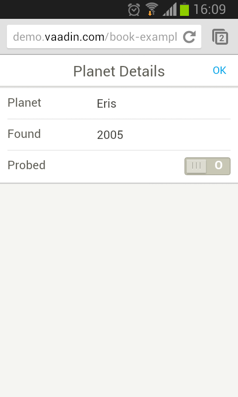
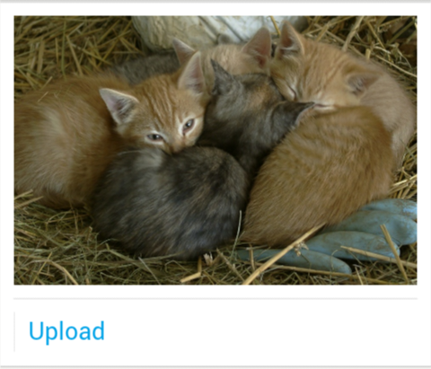
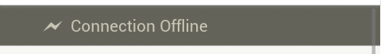

TouchKit
This chapter describes how to create mobile applications using the
Vaadin TouchKit.

Overview {#mobile.overview}
========

Web browsing is becoming ever increasingly mobile and web applications
need to satisfy users with both desktop computers and mobile devices,
such as phones and tablets. While the mobile browsers can show the pages
just like in regular browsers, the screen size, finger accuracy, and
mobile browser features need to be considered to make the experience
more pleasant. Vaadin TouchKit gives the power of Vaadin for creating
mobile user interfaces that complement the regular web user interfaces
of your applications. Just like the purpose of the Vaadin Framework is
to make desktop-like web applications, the purpose of TouchKit is to
allow creation of web applications that give the look and feel of native
mobile applications.

Creating a mobile UI is much like creating a regular Vaadin UI. You can
use all the regular Vaadin components and add-ons available from Vaadin
Directory, but most importantly, you can use the special TouchKit
components that are optimized for mobile devices.

    @Theme("mobiletheme")
    @Widgetset("com.example.myapp.MyAppWidgetSet")
    @Title("My Mobile App")
    public class SimplePhoneUI extends UI {
        @Override
        protected void init(VaadinRequest request) {
            // Define a view
            class MyView extends NavigationView {
                public MyView() {
                    super("Planet Details");

                    CssLayout content = new CssLayout();
                    setContent(content);

                    VerticalComponentGroup group =
                            new VerticalComponentGroup();
                    content.addComponent(group);

                    group.addComponent(new TextField("Planet"));
                    group.addComponent(new NumberField("Found"));
                    group.addComponent(new Switch("Probed"));

                    setRightComponent(new Button("OK"));
                }
            }

            // Use it as the content root
            setContent(new MyView());
        }
        ...
    }

The above example omits the definition of the servlet class, does not
have any UI logic yet, and you would normally implement some views, etc.
The resulting UI is shown in ?.

TouchKit supports many special mobile browser features, such as
geolocation, context-specific input fields, and home screen launching.
On iOS, special features such as splash screen and web app mode are
supported.

In addition to developing regular server-side UIs, TouchKit allows a
special *offline mode*, which is a client-side Vaadin UI that is stored
in the browser cache and switched to automatically when the network
connection is not available, either when starting the application or
while using it. For more information, see ?.

In this chapter, we first consider some special aspects of mobile
browsing. Then, we look how to create a project that uses TouchKit.
TouchKit offers a number of specialized mobile components, which are
described in a dedicated section. We treat phone and tablet applications
separately, and discuss testing briefly.

The Parking Demo showcases the most important TouchKit features for a
mobile location-based business application. The app itself is for
helping parking enforcement officers write parking tickets on the
streets. It uses geolocation, image acquisition from the camera of the
mobile device, map navigation, data visualization with Vaadin Charts,
and dynamic UIs with responsive layouts. You can try it out at
[http://demo.vaadin.com/parking](#). See ? for instructions for
importing the project in Eclipse. The [source code is available and
browseable at Github](#).

Mobile Mail is another demo application, which shows how to implement
browsing of deep category trees and make forms. You can try it out at
[http://demo.vaadin.com/mobilemail](#). You can [browse the source
code](#) of the demo at Github.

Some of the examples given in this chapter can be seen in action at
[demo.vaadin.com/touchkit-sampler](#). You can browse the source code at
the [source repository](#) or clone it with Git.

Vaadin TouchKit is a commercial product licensed under a dual-licensing
scheme. The AGPL license allows open-source development, while the CVAL
license needs to be purchased for closed-source use, including web
deployments and internal use. Commercial licenses can be purchased from
Vaadin Directory, where you can also find the license details and
download Vaadin TouchKit.

Considerations Regarding Mobile Browsing {#mobile.considerations}
========================================

When developing web applications that support mobile browsing, you need
to consider various issues that are different from non-mobile use.
TouchKit is designed to help with these issues.

Mobile Human Interface {#mobile.considerations.mobile-hi}
----------------------

Mobile devices use very different human interfaces than regular
computers. For example, the screen can be rotated easily to switch
between portrait and landscape views. This does not just change the
dimensions of the display, but also affects how to arrange components
for the best user experience. In addition to TouchKit, responsive
layouts help in allowing flexible layouts, as described in ?.

The user interface is used with a finger instead of a mouse, so there
are no features such as "right-finger-button". When using a mouse you
can click double-click or right-click, but on a touch device, you are
using interactions such as tap and "long tap". Finger gestures also play
a large role, such as using a vertical swipe gesture for scrolling
instead of a scroll bar. Some browsers also allow using two- or
multiple-finger gestures.

There is normally no physical keyboard, but an on-screen keyboard, which
can change depending on the context. You also need to ensure that it
does not hide the input field to which the user is trying to enter data
when it pops up. This should be handled by the browser, but is among the
issues that requires special testing.

Bandwidth and Performance {#mobile.considerations.bandwidth}
-------------------------

Mobile Internet connections are often significantly slower than with
fixed lines. With a low-end mobile connection, such as 384 kbps, just
loading the Vaadin client-side engine can take several seconds. This can
be helped by compiling a widget set that includes only the widgets for
the used components, as described in ?, by compiling the theme into the
widget set, and so forth.

Even with mobile broadband, the latency can be significant factor,
especially with highly interactive rich applications. The latency is
usually almost unnoticeable in fixed lines, typically less than 100 ms,
while mobile Edge connections typically have latency around 500 ms, and
sometimes much higher during hiccups. You may need to limit the use of
the immediate mode, text change events, and polling. The latency
compensation in some components, such as `NavigationManager`, allows
view change animations to occur while the server request to display the
result is being made.

Further, the choice of components affects performance. TouchKit
components are designed to be light-weight. Of the other Vaadin
components, some are more light-weight than others. Especially, most
other layout components have a more deeper DOM structure and are slower
to render than the light-weight `CssLayout`. TouchKit also includes
special styling for `CssLayout`.

Mobile Features {#mobile.considerations.features}
---------------

Phones and tablets have many integrated features that are often
available in the browser interface as well. Location-awareness is one of
the most recent features. And of course, you can also make phone calls.

Compatibility {#mobile.considerations.compatibility}
-------------

The mobile browsing field is currently evolving at a quick pace and the
special conventions introduced by leading manufacturers may, in the next
few years, stabilize as new web standards. The browser support in
TouchKit originally concentrated on WebKit, which appears to be emerging
as the leading mobile browser core. In addition to Apple's products,
also the default browser in Android uses WebKit as the layout engine.
Yet they have differences, as the Android's JavaScript engine, which is
highly relevant for Vaadin, is the Google Chrome's V8 engine. As of
TouchKit 4, Internet Explorer on Windows Phone is also supported.

For the list of devices supported by the latest TouchKit version, see
the [TouchKit product page](#) at the Vaadin site.

Vaadin TouchKit aims to follow the quickly evolving APIs of these major
platforms, with the assumption that other browsers will follow their
lead in standardization. Other platforms will be supported if they rise
in popularity.

### Back Button {#mobile.considerations.compatibility.backbutton}

Some mobile devices, especially Android and Windows Phone devices, have
a dedicated back button, while iOS devices in particular do not.
TouchKit does not provide any particular support for the button, but as
it is a regular browser back button, you can handle it with URI
fragments, as described in ?. For iOS, the browser back button is hidden
if the user adds the application to the home screen, in which case you
need to implement application-specific logic for the back-navigation.

Installing Vaadin TouchKit {#mobile.installation}
==========================

You can download and install TouchKit from Vaadin Directory at
[vaadin.com/addon/vaadin-touchkit](#) as an installation package, or get
it with Maven or Ivy. If your project is not compatible with the AGPL
license, you can purchase CVAL licenses from Vaadin Directory or
subscribe to the Pro Tools package at [vaadin.com/pro](#).

Add-on installation is described in detail in ?. The add-on includes a
widget set, so you need to compile the widget set for your project.

Installing as Ivy Dependency {#mobile.elements.ivy}
----------------------------

If you use the add-on in an Eclipse project created with the Vaadin
Plugin for Eclipse, you can define an Ivy dependency to automatically
download the library. Include the following declaration inside the
`dependencies` section in the `ivy.xml`:

    <dependency org="com.vaadin.addon"
                name="vaadin-touchkit-agpl"
                rev="latest.release"
                conf="default->default" />

You can use `latest.release` revision tag to always use the latest
release or specify a version by its version number. IvyDE should resolve
the dependency immediately as you save the file. See ? for further
details.

Defining the Maven Dependency {#mobile.installation.maven}
-----------------------------

You can install Vaadin TouchKit in a Maven project by adding it as a
dependency, as described below, or by using the Maven archetype, as
described in ?.

To use TouchKit in a Vaadin project, you need to include the following
dependency in the POM. The `artifactId` should be `vaadin-touchkit-agpl`
or `vaadin-touchkit-cval`, depending on which license suits your project
requirements.

    <dependency>
        <groupId>com.vaadin.addon</groupId>
        <artifactId>vaadin-touchkit-agpl</artifactId>
        <version>LATEST</version>
    </dependency>

You can use the `LATEST` version as shown above or a specific version by
its version number.

You also need to define the repository for the Vaadin add-ons under the
`<repositories>` element:

    <repository>
        <id>vaadin-addons</id>
        <url>http://maven.vaadin.com/vaadin-addons</url>
    </repository>

Finally, you need to enable the widget set compilation in the POM, as
described in ?, and compile it.

Installing the Zip Package {#mobile.elements.downloading}
--------------------------

Vaadin TouchKit is distributed as a Zip package that contains the
TouchKit JAR, a JavaDoc JAR, license texts, and other documentation. You
can download the Zip package from Vaadin Directory. A different package
is provided for each of the two licenses, and Directory asks for your
choice.

The TouchKit JAR in the package should be put in the `WEB-INF/lib`
folder of the web application.

Please see the `README.html` for more information about the package
contents.

Importing the Parking Demo {#mobile.installation.parking-demo}
==========================

The Parking Demo, illustrated in ? in the overview, showcases most of
the functionality in Vaadin TouchKit. You can try out the demo online
with a TouchKit-compatible browser at [demo.vaadin.com/parking](#).

You can browse the sources on-line or, more conveniently, import the
project in Eclipse (or other IDE). As the project is Maven-based,
Eclipse users need to install the m2e plugin to be able to import Maven
projects, as well as EGit to be able to import Git repositories. Once
they are installed, you should be able to import Parking Demo as
follows.

1.  Select
    File
    Import
2.  Select
    Maven
    Check out Maven Project from SCM
    , and click
    Next
    .
3.  You may need to install the EGit SCM connector if you have not done
    so previously. If Git is not available in the SCM list, click m2e
    marketplace, select the EGit connector, and click Finish. You need
    to restart Eclipse and redo the earlier steps above.

    Instead of using m2e EGit connector, you can also check out the
    project with another Git tool and then import it in Eclipse as a
    Maven project.

4.  In
    SCM URL
    , select
    git
    and enter the repository URL
    https://github.com/vaadin/parking-demo
    .
5.  Click
    Finish
    .
6.  Compile the widget set either by clicking
    Compile Widgetset
    in the Eclipse toolbar or by running the
    vaadin:compile
    goal with Maven.
7.  Deploy the application to a server. See
    for instructions for deploying in Eclipse.
8.  Open the URL
    http://localhost:8080/parking
    with a mobile device or a WebKit-compatible browser, such as Safari
    or Chrome, to run the Parking Demo.

Creating a New TouchKit Project {#mobile.project}
===============================

The easiest ways to create a new TouchKit application project are to
either use the Maven archetype or create the project as a regular Vaadin
project with the Vaadin Plugin for Eclipse and then modify it for
TouchKit.

Using the Maven Archetype {#mobile.project.maven}
-------------------------

You can create a new TouchKit application project using the Maven
`vaadin-archetype-touchkit` archetype. Creating Vaadin projects with
Maven is described in more detail in ?.

For example, to create a project from the command-line, you could do:

    $ mvn archetype:generate \
      -DarchetypeGroupId=com.vaadin \
      -DarchetypeArtifactId=vaadin-archetype-touchkit \
      -DarchetypeVersion=4.0.0 \
      -DgroupId=example.com -DartifactId=myproject \
      -Dversion=0.1.0 \
      -DApplicationName=My -Dpackaging=war

The `ApplicationName` parameter for the archetype is used as a prefix
for the various stub class names. For example, the above "My" name
results in classes such as `MyTouchKitUI`.

The generated project has the following source files:

`MyTouchKitUI.java`

:   The mobile UI for the TouchKit application. See ? for the basics of
    a TouchKit UI. The example UI uses `TabBarView` as the content. The
    first tab features a `MenuView` (see below), a navigation view stub
    defined in the project.

`MyFallbackUI.java`

:   A fallback UI for browsers unsupported by TouchKit, such as regular
    desktop browsers. See ? for more information about fallback UIs.

`MyServlet.java`

:   The servlet class for the UI, defined using the `@WebServlet`
    annotation in Servlet API 3.0. The generated servlet customizes
    TouchKit to define the `MyUIProvider`, which sets the fallback UI.
    See ? for more details about defining a custom servlet to customize
    TouchKit.

`MyUIProvider.java`

:   Creates either the `MyTouchKitUI` for supported mobile browsers or
    `MyFallBackUI` for unsupported browsers. See ? for more information
    about fallback UIs.

`MenuView.java`

:   Presents a stub for a menu view. The menu is made of
    `NavigationButton`s laid out in a `VerticalComponentGroup`. Clicking
    a button navigates to another view; in the stub to a `FormView` (see
    below).

`FormView.java`

:   Presents a stub for a data input form.

`gwt/AppWidgetSet.gwt.xml`

:   Widget set descriptor for the project. When compiled, it is
    automatically updated to include possible other add-on widget sets
    in the project.

`gwt/client/MyOfflineDataService.java`

:   A data service stub for storing data in the offline mode. See ?.

`gwt/client/MyPersistToServerRpc.java`

:   Client-to-Server RPC stub to persist offline data to the
    server-side.

If you import the project to Eclipse or other IDE, you at least need to
compile the widget set to be able to deploy the project. You can to do
that with Maven integration in the IDE, or from command-line with:

    $ mvn vaadin:compile

See ?. At least in Eclipse, you should now be able to import and deploy
the project to a development server. You can also compile the project
and launch it in a Jetty web server (port 8080) from command-line as
follows:

    $ mvn package
    $ mvn jetty:run

Note that a project generated by the archetype defines the servlet with
the `@WebServlet` annotation defined in Servlet API 3.0. The application
server must support Servlet 3.0. For example, if you use Tomcat, you
need at least Tomcat 7.

Starting from a New Eclipse Project {#mobile.project.eclipse}
-----------------------------------

You can create a new TouchKit project from a regular Vaadin project
created with the Vaadin Plugin for Eclipse (see ?).

After creating the project, you need to do the following tasks:

1.  Install the TouchKit library in the project by including it in the
    `ivy.xml`, as described in ?, and compile the widget set.

2.  Extend `TouchkitServlet` instead of `VaadinServlet` in the servlet
    class, as described in ?. It is recommended that you extract the
    static inner class created by the wizard to a regular class, as you
    most probably need to do additional configuration in it.

        @WebServlet(value = "/*",
                    asyncSupported = true)
        @VaadinServletConfiguration(
                productionMode = false,
                ui = MyMobileUI.class)
        public class MyProjectServlet extends TouchKitServlet {
        }

3.  If you intend to define a fallback UI later, as described in ?, you
    may want to copy the original UI class stub to use it as a fallback
    UI class.

4.  To get started quickly, disable the use of custom theme by using
    `@Theme("touchkit")` in the UI class. To create a custom mobile
    theme later, see ?.

        @Theme("touchkit")
        public class MyMobileUI extends UI {

5.  Build the mobile UI preferring TouchKit components instead of the
    core Vaadin components, as described in ?.

We cover these and various other tasks in more detail in ?.

Elements of a TouchKit Application {#mobile.elements}
==================================

At minimum, a TouchKit application requires a UI class, which is defined
in a deployment descriptor, as usual for Vaadin applications. You
usually define a servlet class, where you can also do some
TouchKit-specific configuration. You may also need to have a custom
theme. These and other tasks are described in the following subsections.

The Servlet Class {#mobile.elements.servlet}
-----------------

When using a Servlet 3.0 compatible application server, you usually
define the UI and make basic configuration with a servlet class with the
`@WebServlet` annotation. Vaadin Plugin for Eclipse creates the servlet
class as a static inner class of the UI class, while the Maven archetype
creates it as a separate class, which is usually the preferred way.

The servlet class must define the UI class as usual. Additionally, you
can configure the following TouchKit features in the servlet class:

-   Customize bookmark or home screen icon
-   Customize splash screen image
-   Customize status bar in iOS
-   Use special web app mode in iOS
-   Provide a fallback UI (
    )
-   Enable offline mode

A custom servlet should normally extend the `TouchKitServlet`. You
should place your code in servletInitialized() and call the super method
in the beginning.

    public class MyServlet extends TouchKitServlet {
        @Override
        protected void servletInitialized() throws ServletException {
            super.servletInitialized();

            ... customization ...
        }
    }

If you need to rather extend some other servlet, possibly in another
add-on, it should be trivial to reimplement the functionality of
`TouchKitServlet`, which is just to manage the TouchKit settings object.

If using `web.xml` deployment descriptor instead of the `@WebServlet`,
you only need to implement custom servlet class if you need to do any of
the above configuration, which you typically need to do.

Defining Servlet and UI with `web.xml` Deployment Descriptor {#mobile.elements.webxml}
------------------------------------------------------------

If using an old style `web.xml` deployment descriptor, you need to
define the special `TouchKitServlet` class instead of the regular
`VaadinServlet` in the `web.xml` deployment descriptor. Often you need
to make some configuration or add special logic in a custom servlet, as
described in the previous section, in which case you need to define your
servlet in the deployment descriptor.

    <servlet>
      <servlet-name>Vaadin UI Servlet</servlet-name>
      <servlet-class>
        com.vaadin.addon.touchkit.server.TouchKitServlet
      </servlet-class>
      <init-param>
        <description>Vaadin UI class to start</description>
        <param-name>ui</param-name>
        <param-value>com.example.myapp.MyMobileUI</param-value>
      </init-param>
    </servlet>

TouchKit Settings {#mobile.elements.settings}
-----------------

TouchKit has a number of settings that you can customize for your needs.
The `TouchKitSettings` configuration object is managed by
`TouchKitServlet`, so if you make any modifications to it, you need to
implement a custom servlet, as described earlier.

    public class MyServlet extends TouchKitServlet {
        @Override
        protected void servletInitialized() throws ServletException {
            super.servletInitialized();

            TouchKitSettings s = getTouchKitSettings();
            ...
        }
    }

The settings include special settings for iOS devices, which are
contained in a separate `IosWebAppSettings` object, available from the
TouchKit settings with getIosWebAppSettings().

### Application Icons {#mobile.elements.settings.icons}

The location bar, bookmarks, and other places can display an icon for
the web application. You can set the icon, or more exactly icons, in an
`ApplicationIcons` object, which manages icons for different
resolutions. The most properly sized icon for the context is used. iOS
devices prefer icons with 57×57, 72×72, and 144×144 pixels, and Android
devices 36×36, 48×48, 72×72, and 96×96 pixels.

You can add an icon to the application icons collection with
addApplicationIcon(). You can acquire the base URL for your application
from the servlet context, as shown in the following example.

    TouchKitSettings s = getTouchKitSettings();
    String contextPath = getServletConfig()
        .getServletContext().getContextPath();
    s.getApplicationIcons().addApplicationIcon(
        contextPath + "VAADIN/themes/mytheme/icon.png");

The basic method just takes the icon name, while the other one lets you
define its size. It also has a `preComposed` parameter, which when true,
instructs Safari from adding effects to the icon in iOS.

### Viewport Settings {#mobile.elements.settings.viewport}

The `ViewPortSettings` object, which you can get from the TouchKit
settings with getViewPortSettings(), manages settings related to the
display, most importantly the scaling limitations.

    TouchKitSettings s = getTouchKitSettings();
    ViewPortSettings vp = s.getViewPortSettings();
    vp.setViewPortUserScalable(true);
    ...

See the [Safari Development Library](#) at the Apple developer's site
for more details regarding the functionality in the iOS browser.

### Startup Image for iOS {#mobile.elements.settings.splash}

iOS browser supports a startup (splash) image that is shown while the
application is loading. You can set it in the `IosWebAppSettings` object
with setStartupImage(). You can acquire the base URL for your
application from the servlet context, as shown in the following example.

    TouchKitSettings s = getTouchKitSettings();
    String contextPath = getServletConfig().getServletContext()
        .getContextPath();
    s.getIosWebAppSettings().setStartupImage(
        contextPath + "VAADIN/themes/mytheme/startup.png");

### Web App Capability for iOS {#mobile.elements.settings.webapp}

iOS supports a special web app mode for bookmarks added and started from
the home screen. With the mode enabled, the client may, among other
things, hide the browser's own UI to give more space for the web
application. The mode is enabled by a header that tells the browser
whether the application is designed to be used as a web application
rather than a web page.

    TouchKitSettings s = getTouchKitSettings();
    s.getIosWebAppSettings().setWebAppCapable(true);

See the [Safari Development Library](#) at the Apple developer's site
for more details regarding the functionality in the iOS browser.

### Cache Manifest {#mobile.elements.settings.cache}

The `ApplicationCacheSettings` object manages the cache manifest, which
is used to configure how the browser caches the page and other resources
for the web app. See ? for more details about its use.

The UI {#mobile.elements.ui}
------

Mobile UIs extend the `UI` class as usual and construct the user
interface from components.

    @Theme("mobiletheme")
    @Widgetset("com.example.myapp.MyAppWidgetSet")
    @Title("My Simple App")
    public class SimplePhoneUI extends UI {
        @Override
        protected void init(VaadinRequest request) {
            // Create the content root layout for the UI
            TabBarView mainView = new TabBarView();
            setContent(mainView);

            ...
        }
    }

As TouchKit comes with a custom widget set, you need to use a combining
widget set for your project, defined with the `@Widgetset` annotation
for the UI. The combining widget set descriptor is automatically
generated by the Vaadin Plugin for Eclipse and in Maven when you install
or define the TouchKit add-on.

Most commonly, you will use a combination of the major three TouchKit
components as the basis of the UI: `TabBarView`, `NavigationView`, or
`NavigationManager`.

If a offline UI is provided, it needs to be enabled in the
initialization of the UI, as described in ?. This code is included in
the project stub created by the Maven archetype.

Mobile Widget Set {#mobile.elements.widgetset}
-----------------

TouchKit includes a widget set and therefore requires compiling a
project widget set that includes it, as described in ?. The project
widget set descriptor is automatically generated during the compilation
process, whether you use Maven or the Eclipse plugin.

Note that if you have a TouchKit UI in the same project as a
non-TouchKit UI, you probably do not want to compile the TouchKit widget
set into its widget set. As the automatic generation of the descriptor
includes all the widget sets that it finds from the class path, the
result can be unwanted, and you need to edit the widget set descriptor
manually.

Mobile Theme {#mobile.elements.theme}
------------

You can use both Sass and CSS themes for TouchKit applications, although
they are defined a bit differently from regular Vaadin themes. To
optimize how a theme is loaded, you can build it into a GWT client
bundle.

### Defining a Regular Theme {#mobile.elements.theme.css}

Using plain CSS is often the easiest way to define a simple theme for a
mobile application, as using Sass would not yield all the same benefits
as in a regular Vaadin application. TouchKit includes its own base theme
in its widget set, so you do not need to `@import` it explicitly.

A CSS theme is defined in a file located at
`VAADIN/themes/mymobiletheme/styles.css`. As importing the base does not
need to (and should not) be done, it could simply be as follows:

    .stylishlabel {
        color: red;
        font-style: italic;
    }

You need to set the theme with the `@Theme("mymobiletheme")` annotation
for your UI class, as usual.

You can also use Sass by creating a `styles.scss` and then compiling it
to CSS with the Vaadin theme compiler. However, as above, you should not
include a base theme. The rules do not need to be wrapped in a selector
with the theme name, as is recommended for regular Vaadin themes.

### Responsive Mobile Themes {#mobile.elements.theme.responsive}

The responsive extension is especially useful for mobile layouts, as it
makes it easy to adapt a layout for phones and tablets and for changing
the screen orientation. With the extension, changing the UI layout
according to screen orientation is handled entirely on the client-side
by the add-on, using special CSS selectors in the theme. See ? for
details.

The Parking Demo uses the extension. From its source code, which is
available at Github, you can learn how the conditional selectors are
used in the [CSS defined in a GWT client bundle](#).

For example, the CSS for the Stats tab in the Parking demo defines a
responsive selector as follows, to allow fitting two charts side-by-side
if there is enough room horizontally:

    .stats .statschart {
        margin-bottom: 30px;
        float: left;
        width: 100%;
    }

    .v-ui[width-range~="801px-"] .stats .statschart {
        width: 48% !important;
        margin: 0 1%;
    }

Normally, if there's 800 pixels or less space horizontally, each chart
takes 100% of the screen width, causing the second one to wrap to the
next line in the containing `CssLayout`. If there is more space, the two
charts are shown in 48% width, so that both can fit in the same line.
This follows the flexible wrapping pattern described in ?.

### Defining a Theme in a GWT Client Bundle {#mobile.elements.theme.gwt}

Using a GWT theme instead of a regular Vaadin theme offers several
performance benefits on mobile devices by reducing the number of
resources loaded separately. All the resources, such as images and
stylesheets, can be loaded with the widget set. Images can be handled as
sprites tiled in bundle images.

The GWT CSS classes have their own special format, a bit similar to Sass
themes. See [GWT Developer's Guide for detailed information about client
bundles](#) and how to define image, CSS, and other resources.

To use a GWT client bundle in a TouchKit application, you need to define
a *theme loader* that extends the TouchKit `ThemeLoader` and implements
the load() method to inject the bundle. The theme loader and the client
bundle are a client-side classes that are compiled into the widget set,
and must therefore be defined under the `client` directory.

For example, in the Parking Demo we have as follows:

    public class ParkingThemeLoader extends ThemeLoader {
        @Override
        public final void load() {
            // First load the default TouchKit theme...
            super.load();

            // ... and add Parking Demo CSS from its own bundle
            ParkingBundle.INSTANCE.fontsCss().ensureInjected();
            ParkingBundle.INSTANCE.css().ensureInjected();
            ParkingBundle.INSTANCE.ticketsCss().ensureInjected();
            ParkingBundle.INSTANCE.statsCss().ensureInjected();
            ParkingBundle.INSTANCE.shiftsCss().ensureInjected();
            ParkingBundle.INSTANCE.mapCss().ensureInjected();
        }
    }

You can call super.load() to load the default TouchKit theme, but you
can omit the call if you do not want to use it. In such case, your GWT
theme should import the Vaadin base theme explicitly.

The theme loader must be defined in the `.gwt.xml` widget set descriptor
as follows:

    <replace-with
        class="com.vaadin.demo.parking.widgetset.client.theme.ParkingThemeLoader">
        <when-type-is
            class="com.vaadin.addon.touchkit.gwt.client.ThemeLoader" />
    </replace-with>

See the Parking Demo sources for a complete example of defining a GWT
theme.

Using Font Icons {#mobile.elements.icons}
----------------

You can use font icons, as described in ?, also with most TouchKit
components.

For example, as is done in the UI stub of a TouchKit project created
from the Maven archetype:

    // Have a tab bar with multiple tab views
    TabBarView tabBarView = new TabBarView();

    // Have a tab
    ... create view1 ...
    Tab tab1 = tabBarView.addTab(view1);

    // Use the "book" icon for the tab
    tab1.setIcon(FontAwesome.BOOK);

Mobile User Interface Components {#mobile.components}
================================

TouchKit introduces a number of components special to mobile user
interfaces to give better user interaction and to utilize the special
features in mobile devices.

`NavigationView`

:   A view with a navigation bar (`NavigationBar` for navigating back
    and forth in a `NavigationManager`.

`Toolbar`

:   A horizontal layout especially for buttons. A sub-component of
    `TabBarView` or `NavigationView`.

`NavigationManager`

:   A component container that enables slide animations between the
    components while the server request is being made for the purpose of
    latency compensation. The components are typically `NavigationView`s
    or `SwipeView`s.

`NavigationButton`

:   A special button for initiating view change in a `NavigationManager`
    on the client-side, for the purpose of latency compensation.

`Popover`

:   A floating pop-up frame that can be positioned relative to a
    component.

`SwipeView`

:   A view for navigating back and forth in a `NavigationManager` using
    horizontal swipe gestures.

`Switch`

:   A sliding on/off toggle for boolean values.

`VerticalComponentGroup`

:   A vertical layout for grouping components.

`HorizontalButtonGroup`

:   A horizontal layout for grouping especially buttons.

`TabBarView`

:   A tabbed view with a content area on the top and a `Toolbar` for
    navigating between sub-views on the bottom.

`EmailField`, `NumberField`, and `UrlField`

:   Text fields for inputting specifically email addresses, numbers, and
    URLs, respectively, with a specific virtual keyboard.

The components are detailed in the following subsections.

`NavigationView` {#mobile.components.navigationview}
----------------

The `NavigationView` is a layout component that consists of a navigation
bar and a content area. The content area is scrollable, so there is no
need to use an inner panel component. In addition, there can be an
optional toolbar component at the bottom of the view. A `NavigationView`
is often used inside a `NavigationManager` to get view change
animations.

`NavigationView` has a full size by default. The content area is
expanding, so that it takes all the space left over from the navigation
bar and toolbar.

### Navigation Bar {#mobile.components.navigationview.navigationbar}

The navigation bar at the top of `NavigationView` is a separate
`NavigationBar` component. It has two component slots, with one on the
left and one on the right. The caption is displayed in the middle. The
`NavigationBar` component can be used independently as well.

When the `NavigationBar` is used for navigation and you set the previous
component with setPreviousComponent(), the left slot is automatically
filled with a Back button. This is done automatically if you use the
`NavigationView` inside a `NavigationManager`.

You can get access to the navigation bar component with
getNavigationBar() to use its manipulator methods directly, but
`NavigationView` also offers some shorthand methods: setLeftComponent(),
setRightComponent(), and a setter and a getter for the caption.

### Toolbar {#mobile.components.navigationview.toolbar}

A slot for an optional toolbar is located at the bottom of the
`NavigationView`. The toolbar can be any component, but a `Toolbar`
component made for this purpose is included in TouchKit. It is described
in ?. You could also use a `HorizontalLayout` or `CssLayout`.

You usually fill the tool bar with `Button` components with an icon and
no textual caption. You set the toolbar with setToolbar().

### Styling with CSS {#mobile.components.navigationview.css}

    .v-touchkit-navview { }
      .v-touchkit-navview-wrapper {}
      .v-touchkit-navview-toolbar {}
    .v-touchkit-navview .v-touchkit-navview-notoolbar {}

The root element has the `v-touchkit-navview` class. The content area is
wrapped inside a `v-touchkit-navview-wrapper` element. If the view has a
toolbar, the toolbar slot has the `v-touchkit-navview-toolbar` style,
but if not, the top-level element has the `v-touchkit-navview-notoolbar`
style.

`Toolbar` {#mobile.components.toolbar}
---------

The `Toolbar` is a horizontal layout component intended for containing
`Button` components. The toolbar has by default 100% horizontal width
and a fixed height. The components are spread evenly in the horizontal
direction. `Toolbar` is used in a `TabBarView`, as described in ?.

For a description of the inherited features, please refer to ?.

### Styling with CSS {#mobile.components.toolbar.css}

    .v-touchkit-toolbar { }

The component has an overall `v-touchkit-toolbar` style.

`NavigationManager` {#mobile.components.navigationpanel}
-------------------

The `NavigationManager` is a visual effect component that gives sliding
animation when switching between views. You can register three
components: the currently displayed component, the previous one on the
left, and the next component on the right. You can set these components
with setCurrentComponent(), setPreviousComponent(), and
setNextComponent(), respectively.

The `NavigationManager` component is illustrated in ?.

The navigation manager is important for responsiveness, because the
previous and next components are cached and the slide animation started
before server is contacted to load the new next or previous views.

You give the initial view as a parameter for the constructor. Typically,
you use a navigation manager as the UI content or inside a `TabBarView`.

    public class MyUI extends UI {
        @Override
        protected void init(VaadinRequest request) {
            NavigationManager manager =
                   new NavigationManager(new MainView());
            setContent(manager);
        }
    }

### Changing Views {#mobile.components.navigationpanel.viewhandling}

Switching between the views (components) is normally done with
predefined navigation targets to enhance responsiveness. Clicking a
`NavigationButton` or a button in a navigation bar starts navigation
automatically without a server roundtrip. Swipe gestures are supported
with the `SwipeView` component.

Navigation can also be done programmatically with the navigateTo()
method. If breadcrumbs are enabled, the current view is also pushed to
the breadcrumb stack. To navigate back, you can call navigateBack(),
which is also called implicitly if a Back button is clicked in a
`NavigationView`. Also, if navigation is done to the "previous"
component, navigateBack() is done implicitly.

When navigation occurs, the current component is moved as the previous
or next component, according to the direction of the navigation.

### Handling View Changes {#mobile.components.navigationpanel.viewhandling}

While you can put any components in the manager, some special features
are enabled when using the `NavigationView`. When a view becomes
visible, the onBecomingVisible() method in the view is called. You can
override it, just remember to call the superclass method.

    @Override
    protected void onBecomingVisible() {
        super.onBecomingVisible();

        ...
    }

Otherwise, you can handle navigation changes in the manager with a
NavigationListener. The `direction` property tells whether the
navigation was done forward or backward in the breadcrumb stack, that
is, whether navigation was done with navigateTo() or navigateBack. The
current component, accessible with getCurrentComponent(), refers to the
navigation target component.

    manager.addNavigationListener(new NavigationListener() {
        @Override
        public void navigate(NavigationEvent event) {
            if (event.getDirection() ==
                    NavigationEvent.Direction.BACK) {
                // Do something
                Notification.show("You came back to " +
                    manager.getCurrentComponent().getCaption());
            }
        }
    });

### Tracking Breadcrumbs {#mobile.components.navigationpanel.breadcrump}

`NavigationManager` also handles *breadcrumb* tracking. The navigateTo()
pushes the current view on the top of the breadcrumb stack and
navigateBack() can be called to return to the previous breadcrumb level.

Notice that calling navigateTo() with the "previous" component is
equivalent to calling navigateBack().

`NavigationButton` {#mobile.components.navigationbutton}
------------------

The `NavigationButton` is a special version of the regular `Button`
component, designed for navigation inside a `NavigationManager` (see ?).
Clicking a navigation button will automatically navigate to the defined
target view. The view change animation does not need to make a server
request first, but starts immediately after clicking the button. If you
leave the target view empty, an empty placeholder view is shown in the
animation. The view is filled after it gets the content from the server.

A navigation button does not have a particular border by default,
because multiple navigation buttons are typically used inside a
`VerticalComponentGroup` to create menus, as illustrated in ?.

A navigation button has a caption and can have a description and an
icon. If not given explicitly, the caption is taken from the caption of
the navigation view if it is initialized before the button. The icon is
positioned left of the caption, and the description is aligned on the
right side of the button.

You can give the target view either in the constructor or with
setTargetView(), or create it later by handling the button click.

    // Button caption comes from the view caption
    box.addComponent(new NavigationButton(new PopoverView()));

    // Give button caption explicitly
    box.addComponent(new NavigationButton("Decorated Popover",
                       new DecoratedPopoverView()));

If the target view is not created or initialized before the button is
clicked, it does not yet have a caption during the animation. The
default is to use the button caption as a temporary target view caption,
but you can set it explicitly with setTargetViewCaption(). The temporary
caption is shown during the slide animation and until the content for
the view has been received from the server. It is then replaced with the
proper caption of the view, and you normally want to have it the same.
The temporary caption is also used as the caption of button if it is not
given explicitly.

    final NavigationButton navButton = new NavigationButton();
    navButton.setTargetViewCaption("Text Input Fields");
    navButton.addClickListener(
        new NavigationButtonClickListener() {

        @Override
        public void buttonClick(NavigationButtonClickEvent event) {
            navButton.getNavigationManager()
                .navigateTo(new FieldView());
        }
    });
    box.addComponent(navButton);

Creating views dynamically this way is recommended to reduce the memory
footprint.

Notice that the automatic navigation will only work if the button is
inside a `NavigationManager` (in a view managed by it). If you just want
to use the button as a visual element, you can use it like a regular
`Button` and handle the click events with a `ClickListener`.

### Styling with CSS {#mobile.components.navigationbutton.css}

    .v-touchkit-navbutton { }
      .v-touchkit-navbutton-desc { }
      .v-icon { }

The component has an overall `v-touchkit-navbutton` style. If the
component description is set with setDescription(), it is shown in a
separate `` element with the `v-touchkit-navbutton-desc` style.
The description has an alternative `emphasis` style, as well as a
stronger capsule-like `pill` style with rounded corners, which you can
enable with addStyleName().

The default style of the navigation button is designed for placing the
buttons inside a `VerticalComponentGroup`. It has a different style when
it is in a `HorizontalButtonGroup` and when in the left or right slot of
the `NavigationBar`.

`Popover` {#mobile.components.popover}
---------

`Popover` is much like a regular Vaadin sub-window, useful for quickly
displaying some options or a small form related to an action. Unlike
regular sub-windows, it does not support dragging or resizing by the
user. As sub-windows usually require a rather large screen size, the
`Popover` is most useful for tablet devices. When used on smaller
devices, such as phones, the `Popover` automatically fills the entire
screen.

It is customary to use a `NavigationView` to have border decorations and
caption. In the following, we subclass `Popover` to create the content.

    class DetailsPopover extends Popover {
        public DetailsPopover() {
            setWidth("350px");
            setHeight("65%");

            // Have some details to display
            VerticalLayout layout = new VerticalLayout();
            ...

            NavigationView c = new NavigationView(layout);
            c.setCaption("Details");
            setContent(c);
        }
    }

A `Popover` can be opened relative to a component by calling
showRelativeTo(). In the following example, we open the popover when a
table item is clicked.

    Table table = new Table("Planets", planetData());
    table.addItemClickListener(new ItemClickListener() {
        @Override
        public void itemClick(ItemClickEvent event) {
            DetailsPopover popover = new DetailsPopover();

            // Show it relative to the navigation bar of
            // the current NavigationView.
            popover.showRelativeTo(view.getNavigationBar());
        }
    });

You can also add the `Popover` to the `UI` with addWindow().

A popover is shown in a tablet device as illustrated ?. In this example,
we have a `CssLayout` with some buttons as the popover content.

### Closing a Popover {#mobile.components.popover.close}

When `closable` is enabled in a `Popover`, as it is by default, it can
be closed by clicking anywhere outside the popup area. This may not be
enough if the popover fills the entire screen, in which case the user
gets stuck. The popover can be closed programmatically by calling
close(). You can, for example, add a MouseEvents.ClickListener to the
popover to allow closing it by clicking anywhere inside it.

If the popover has editable fields, you may want to have a close button
in the navigation bar of the `NavigationView`. In the following example,
we add a close button to the right slot of the navigation bar (you need
to include the icon in your theme).

    class DetailsPopover extends Popover
          implements Button.ClickListener {
        public DetailsPopover(Table table, Object itemId) {
            setWidth("350px");
            setHeight("65%");
            Layout layout = new FormLayout();
            ... create the content ...

            // Decorate with navigation view
            NavigationView content = new NavigationView(layout);
            content.setCaption("Details");
            setContent(content);

            // Have a close button
            Button close = new Button(null, this);
            close.setIcon(new ThemeResource("close64.png"));
            content.setRightComponent(close);
        }

        public void buttonClick(ClickEvent event) {
            close();
        }
    }

### Styling with CSS {#mobile.components.popover.css}

    .v-touchkit-popover .v-touchkit-fullscreen { }
      .v-touchkit-popover .v-touchkit-relative { }
      .v-touchkit-popover .v-touchkit-plain { }

The component has an overall `v-touchkit-popover` style. If full-screen,
it also has the `v-touchkit-fullscreen` style, if positioned relatively
it has `v-touchkit-relative`, and if not, the `v-touchkit-plain` style.

`SwipeView` {#mobile.components.swipeview}
-----------

The `SwipeView` is a wrapper that allows navigating between views by
swiping them horizontally left or right. The component works together
with a `NavigationManager` (see ?) to change between the views when
swiped, and to animate the change. A `SwipeView` should be an immediate
child of the `NavigationManager`, but can contain a `NavigationView` to
provide button navigation as well.

Let us have a selection of photographs to browse. We extend
`NavigationManager` that creates the slide effect and create actual
image views dynamically. In the constructor, we create the two first
ones.

    class SlideShow extends NavigationManager
          implements NavigationListener {
        String imageNames[] = {"Mercury.jpg", "Venus.jpg",
            "Earth.jpg", "Mars.jpg", "Jupiter.jpg",
            "Saturn.jpg", "Uranus.jpg", "Neptune.jpg"};
        int pos = 0;

        public SlideShow() {
            // Set up the initial views
            navigateTo(createView(pos));
            setNextComponent(createView(pos+1));

            addNavigationListener(this);
        }

The individual views have a `SwipeView` and the top.

        SwipeView createView(int pos) {
            SwipeView view = new SwipeView();
            view.setSizeFull();

            // Use an inner layout to center the image
            VerticalLayout layout = new VerticalLayout();
            layout.setSizeFull();

            Image image = new Image(null, new ThemeResource(
                "planets/" + imageNames[pos]));
            layout.addComponent(image);
            layout.setComponentAlignment(image,
                Alignment.MIDDLE_CENTER);

            view.setContent(layout);
            return view;
        }

When the view is swiped to either direction, we need to set the next
image in that direction dynamically in the `NavigationManager`.

    @Override
    public void navigate(NavigationEvent event) {
        switch (event.getDirection()) {
            case FORWARD:
                if (++pos < imageNames.length-1)
                    setNextComponent(createView(pos+1));
                break;
            case BACK:
                if (--pos > 0)
                    setPreviousComponent(createView(pos-1));
        }
    }

`Switch` {#mobile.components.switch}
--------

The `Switch` component is a two-state selector that can be toggled
either by tapping or sliding and looks like the switch button in Apple
iOS. It extends `CheckBox` and has therefore `Boolean` value type. The
caption is managed by the containing layout.

    VerticalComponentGroup group =
            new VerticalComponentGroup();
    Switch myswitch = new Switch("To be or not to be?");
    myswitch.setValue(true);
    group.addComponent(myswitch);

As with other field components, you can handle value changes with a
ValueChangeListener. Use setImmediate(true) to get them immediately when
toggled.

The result is shown in ?.

### Styling with CSS {#mobile.components.switch.css}

    .v-touchkit-switch { }
      .v-touchkit-switch-slider { }

The component has an overall `v-touchkit-switch` style. The slider
element has `v-touchkit-switch-slider` style.

`VerticalComponentGroup` {#mobile.components.verticalcomponentgroup}
------------------------

The `VerticalComponentGroup` is a layout component for grouping
components in a vertical stack with a border. Component captions are
placed left of the components, and the components are aligned right. The
component group is typically used for forms or with `NavigationButton`
to create navigation menus.

    VerticalComponentGroup group =
        new VerticalComponentGroup("TouchKit Components");
    group.setWidth("100%");

    // Navigation to sub-views
    group.addComponent(new NavigationButton(
        new PopoverView()));
    group.addComponent(new NavigationButton(
        new DecoratedPopoverView()));

    layout.addComponent(box);

The result is shown in ?.

### Styling with CSS {#mobile.components.verticalcomponentgroup.css}

    .v-touchkit-verticalcomponentgroup { }

The component has an overall `v-touchkit-verticalcomponentgroup` style.
If the component has a caption, the `v-touchkit-has-caption` style is
added.

`HorizontalButtonGroup` {#mobile.components.horizontalbuttongroup}
-----------------------

The `HorizontalButtonGroup` is intended for grouping buttons inside the
slots of a `VerticalComponentGroup` with a special button group style.

    VerticalComponentGroup vertical =
            new VerticalComponentGroup();
    vertical.addComponent(new TextField("Name"));

    HorizontalButtonGroup buttons =
            new HorizontalButtonGroup();
    buttons.addComponent(new Button("OK"));
    buttons.addComponent(new Button("Cancel"));
    vertical.addComponent(buttons);

The result is shown in ?

You can also make single buttons prettier by wrapping them in the
component. Also the `Upload` component has a button, and you can give it
the `v-button` style to make it look like a button would in the group,
as is done in ?.

Despite the name, and the fact that the button group is intended for
buttons, you can, in fact, put any components inside it. Whether the
result is meaningful, depends on the component.

### Styling with CSS {#mobile.components.horizontalbuttongroup.css}

    .v-touchkit-horizontalbuttongroup { }

The component has an overall `v-touchkit-horizontalbuttongroup` style.
As noted above, the TouchKit style sheet includes special rules for
components that have the `v-button` style inside the group.

`TabBarView` {#mobile.components.tabbarview}
------------

The `TabBarView` is a layout component that consist of a tab bar at the
bottom of the screen and a content area. Each tab has a content
component which is displayed when the tab is selected.

`TabBarView` implements ComponentContainer, but uses its own specialized
API for monipulating tabs. To add a new tab, you need to call addTab()
with the content component. It creates the tab and returns a `Tab`
object for managing it. You should set at least the caption and icon for
a tab.

    TabBarView bar = new TabBarView();

    // Create some Vaadin component to use as content
    Label content = new Label("Really simple content");

    // Create a tab for it
    Tab tab = bar.addTab(label);

    // Set tab name and/or icon
    tab.setCaption("tab name");
    tab.setIcon(new ThemeResource(...));

A tab can be removed with removeTab(). Note that the ComponentContainer
methods addComponent() and removeComponent() will throw an
`UnsupportedOperationException` if used.

### Changing Tab Selection {#mobile.components.tabbarview.selection}

Current tab selection can be accessed with getSelectedTab() and set with
setSelectedTab(). Changing tab selection either by the user or
programmatically causes a SelectedTabChangeEvent, which you can handle
with a SelectedTabChangeListener.

    Tab selectedTab = bar.getSelectedTab();
    bar.setSelectedTab(selectedTab);

### Styling with CSS {#mobile.components.tabbarview.css}

    .v-touchkit-tabbar {}
    .v-touchkit-tabbar-wrapper {}
    .v-touchkit-tabbar-toolbar {} 

The component has overall `v-touchkit-tabbar` style. Content area is
wrapped inside a `v-touchkit-tabbar-wrapper` element. Tab bar control
area itself has the `v-touchkit-tabbar-toolbar` style.

`EmailField` {#mobile.components.emailfield}
------------

The `EmailField` is just like the regular `TextField`, except that it
has automatic capitalization and correction turned off. Mobile devices
also recognize the field as an email field and can offer a virtual
keyboard for the purpose, so that it includes the at (`@`) and period
(`.`) characters, and possibly a shorthand for `.com`.

### Styling with CSS {#mobile.components.emailfield.css}

    .v-textfield {}
    .v-textfield.v-textfield-error {}

The `EmailField` has an overall `v-textfield` style, just like a regular
`TextField` component would. It will get also the `v-textfield-error` if
there is a component error, for example, from failed validation.

`NumberField` {#mobile.components.numberfield}
-------------

The `NumberField` is just like the regular `TextField`, except that it
is marked as a numeric input field for mobile devices, so that they will
show a numeric virtual keyboard rather than the default alphanumeric.

### Styling with CSS {#mobile.components.numberfield.css}

    .v-textfield {}
    .v-textfield.v-numberfield-error {}

The `NumberField` has an overall `v-textfield` style, just like a
regular `TextField` component would. It will get also the
`v-numberfield-error` if there is a component error, for example, from
failed validation.

`UrlField` {#mobile.components.urlfield}
----------

The `UrlField` is just like the regular `TextField`, except that it is
marked as a URL input field for mobile devices, so that they will show a
URL input virtual keyboard rather than the default alphanumeric. It has
convenience methods getUrl() and setUrl(URL url) for converting input
value from and to java.net.URL.

### Styling with CSS {#mobile.components.urlfield.css}

    .v-textfield {}
    .v-textfield.v-textfield-error {}

The `UrlField` has an overall `v-textfield` style, just like a regular
`TextField` component would.

Advanced Mobile Features {#mobile.features}
========================

Providing a Fallback UI {#mobile.features.fallback}
-----------------------

You may need to use the same URL and hence the same servlet for both the
mobile TouchKit UI and for regular browsers. In this case, you need to
recognize the mobile browsers compatible with Vaadin TouchKit and
provide a fallback UI for any other browsers. The fallback UI can be a
regular Vaadin UI, a "Sorry!" message, or a redirection to an alternate
user interface.

You can handle the fallback logic in a custom `UIProvider` that creates
the UIs in the servlet. As TouchKit supports only WebKit and Windows
Phone browsers, you can do the recognition by checking if the
`user-agent` string contains the sub-strings "`webkit`" or "`windows
                phone`" as follows:

    public class MyUIProvider extends UIProvider {
        @Override
        public Class<? extends UI>
                  getUIClass(UIClassSelectionEvent event) {
            String ua = event.getRequest()
                    .getHeader("user-agent").toLowerCase();
            if (   ua.toLowerCase().contains("webkit")
                || ua.toLowerCase().contains("windows phone 8")
                || ua.toLowerCase().contains("windows phone 9")) {
                return MyUI.class;
            } else {
                return MyFallbackUI.class;
            }
        }
    }

The custom UI provider has to be added in a custom servlet class, which
you need to define in the `web.xml`, as described in ?. For example, as
follows:

    public class MyServlet extends TouchKitServlet {
        private MyUIProvider uiProvider = new MyUIProvider();

        @Override
        protected void servletInitialized() throws ServletException {
            super.servletInitialized();

            getService().addSessionInitListener(
                    new SessionInitListener() {
                @Override
                public void sessionInit(SessionInitEvent event)
                        throws ServiceException {
                    event.getSession().addUIProvider(uiProvider);
                }
            });

            ... other custom servlet settings ...
        }
    }

See the Parking Demo for a working example.

Geolocation {#mobile.features.geolocation}
-----------

The geolocation feature in TouchKit allows receiving the geographical
location from the mobile device. The browser will ask the user to
confirm that the web site is allowed to get the location information.
Tapping Share Location gives the permission. The browser will give the
position acquired by GPS, cellular positioning, or Wi-Fi positioning, as
enabled in the device.

Geolocation is requested by calling the static detect() method in
`Geolocator`. You need to provide a `PositionCallback` handler that is
called when the device has an answer for your request. If the
geolocation request succeeds, onSuccess() is called. Otherwise, for
example, if the user did not allow sharing of his location, onFailure()
is called. The geolocation data is provided in a `Position` object.

    Geolocator.detect(new PositionCallback() {
        public void onSuccess(Position position) {
            double latitude  = position.getLatitude();
            double longitude = position.getLongitude();
            double accuracy  = position.getAccuracy();

            ...
        }

        public void onFailure(int errorCode) {
            ...
        }
    });

The position is given as degrees with fractions in the WGS84 coordinate
system used by GPS. The longitude is positive to East and negative to
West of the prime meridian of WGS84. The accuracy is given in meters. In
addition to the above data, the following are also provided:

-   Altitude
-   Altitude accuracy
-   Heading
-   Speed

If any of the position data is unavailable, its value will be zero.

The onFailure() is called if the positioning fails for some reason. The
`errorCode` explains the reason. Error 1 is returned if the permission
was denied, 2 if the position is unavailable, 3 on positioning timeout,
and 0 on an unknown error.

Notice that geolocation can take significant time, depending on the
location method used by the device. With Wi-Fi and cellular positioning,
the time is usually less than 30 seconds. With unassisted GPS, it can
reach 15 minutes on a fresh device and even longer if the reception is
bad. However, once a location fix has been made, updates to the location
will be faster. If you are making navigation software, you need to
update the position data fairly frequently by calling the detect()
method in `Geolocator` multiple times.

### Displaying Position on a Map {#mobile.features.geolocation.map}

Geographical positions are often visualized with a map. There are
countless ways to do that, for example, in the Parking Demo we use the
[V-Leaflet](#) add-on component.

Notice that the geolocation gives the position in the WGS84 coordinate
system used by GPS. The same system is conveniently used by many
Internet map services, but is not in any way universal. Further, in some
countries, map data is legally required to have erroneus coordinates.

The `MapView` in the Parking Demo is a TouchKit navigation view that
uses the `LMap` component from the add-on to display the map:

    public class MapView extends CssLayout
          implements PositionCallback, LeafletClickListener {
        private LMap map;
        private final LMarker you = new LMarker();
        ...

Position is requested from the device when a button is clicked:

    locatebutton = new Button("", new ClickListener() {
        @Override
        public void buttonClick(final ClickEvent event) {
            Geolocator.detect(MapView.this);
        }
    });
    locatebutton.addStyleName("locatebutton");
    locatebutton.setWidth(30, Unit.PIXELS);
    locatebutton.setHeight(30, Unit.PIXELS);
    locatebutton.setDisableOnClick(true);
    addComponent(locatebutton);

When TouchKit gets the position, we center the map as follows:

    @Override
    public void onSuccess(final Position position) {
        ParkingUI app = ParkingUI.getApp();
        app.setCurrentLatitude(position.getLatitude());
        app.setCurrentLongitude(position.getLongitude());

        setCenter();

        // Enable centering on current position manually
        locatebutton.setEnabled(true);
    }

    private void setCenter() {
        if (map != null)
            map.setCenter(you.getPoint());
    }

Storing Data in the Local Storage {#mobile.features.localstorage}
---------------------------------

The `LocalStorage` UI extension allows storing data in the HTML5 local
storage from the server-side application. The storage is a singleton,
which you can get with LocalStorage.get().

    final LocalStorage storage = LocalStorage.get();

### Storing Data {#mobile.features.localstorage.storing}

You can store data in the local storage as key-value pairs with the
put() method. Both the key and value must be strings. Storing the data
requires a client round-trip, so the success or failure of the store
operation can be handled with an optional LocalStorageCallback.

    // Editor for the value to be stored
    final TextField valueEditor = new TextField("Value");
    valueEditor.setNullRepresentation("");
    layout.addComponent(valueEditor);

    Button store = new Button("Store", new ClickListener() {
        @Override
        public void buttonClick(ClickEvent event) {
            storage.put("value", valueEditor.getValue(),
                        new LocalStorageCallback() {
                @Override
                public void onSuccess(String value) {
                    Notification.show("Stored");
                }

                @Override
                public void onFailure(FailureEvent error) {
                    Notification.show("Storing Failed");
                }
            });
        }
    }));
    layout.addComponent(store);

### Retrieving Data from the Storage {#mobile.features.localstorage.retrieving}

You can retrieve data from the local storage with the get() method. It
takes the key and a LocalStorageCallback to receive the retrieved value,
or a failure. Retrieving the value to the server-side requires a client
rount-trip and another server request is made to send the value with the
callback.

    storage.get("value", new LocalStorageCallback() {
        @Override
        public void onSuccess(String value) {
            valueEditor.setValue(value);
            Notification.show("Value Retrieved");
        }

        @Override
        public void onFailure(FailureEvent error) {
            Notification.show("Failed because: " +
                              error.getMessage());
        }
    });

Uploading Content {#mobile.features.upload}
-----------------

Uploading content from a mobile device works just like with regular
Vaadin applications using the `Upload` component.

In an offline UI or client-side code in general, you need to handle
uploading differently, using a special upload widget or handler.

### Server-Side `Upload` Component {#mobile.features.upload.server-side}

In a server-side UI, you can use the regular `Upload` component
described in ?. When choosing a file, the device will ask to select the
file from files, gallery, camera, or other possible sources, depending
on the device. The only difference to normal use is that the upload
component must be in *immediate* mode.

Uploading is supported by most mobile operating systems, such as iOS,
Android, and Windows RT devices, but not in some, such as WP8.

The following example shows how to implement simple upload to an
in-memory storage.

    // Display the image - only a placeholder first
    final Image image = new Image();
    image.setWidth("100%");
    image.setVisible(false);
    layout.addComponent(image);

    // Implement both receiver that saves upload in a file and
    // listener for successful upload
    class ImageUploader implements Receiver, SucceededListener,
                                   ProgressListener {
        final static int maxLength = 10000000;
        ByteArrayOutputStream fos = null;
        String filename;
        Upload upload;

        public ImageUploader(Upload upload) {
            this.upload = upload;
        }

        public OutputStream receiveUpload(String filename,
                                          String mimeType) {
            this.filename = filename;
            fos = new ByteArrayOutputStream(maxLength + 1);
            return fos; // Return the output stream to write to
        }

        @Override
        public void updateProgress(long readBytes,
                                   long contentLength) {
            if (readBytes > maxLength) {
                Notification.show("Too big content");
                upload.interruptUpload();
            }
        }

        public void uploadSucceeded(SucceededEvent event) {
            // Show the uploaded file in the image viewer
            image.setSource(new StreamResource(new StreamSource() {
                @Override
                public InputStream getStream() {
                    byte[] bytes = fos.toByteArray();
                    return new ByteArrayInputStream(bytes);
                }
            }, filename));

            image.setVisible(true);
        }
    };

    Upload upload = new Upload();
    ImageUploader uploader = new ImageUploader(upload);
    upload.setReceiver(uploader);
    upload.addSucceededListener(uploader);
    upload.setImmediate(true); // Only button

    // Wrap it in a button group to give better style
    HorizontalButtonGroup group = new HorizontalButtonGroup();
    group.addComponent(upload);
    layout.addComponent(group);

The result is shown in ? (©2001 Marko Grönroos).

### Upload on the Client-Side {#mobile.features.upload.client-side}

When making a client-side widget that handles file upload, such as for
offline mode, you can use the GWT [`FileUpload` component](#). In such
case, you need to communicate the image data to the server with an RPC
call.

On a mobile device, the perhaps most common upload task is to capture
images with the integrated camera. To display them in the client-side UI
correctly, you want make sure that they have reasonable size and correct
orientation, without making a server round-trip to do the corrections.
To send them to the server, you want to avoid using too much bandwidth.
The `ImageUpload` widget included in the `lib-gwt-imageupload` add-on,
[available from Vaadin Directory](#), allows launching the camera
application in the device and capturing an image. It further allows
defining an image manipulation pipeline with transformations to reduce
the image size if necessary, correct the orientation according to EXIF
data, and so forth. The corrected image is loaded to a memory buffer,
which you can display in another widget, send to the server, or store in
the local store.

In the following, we allow capturing an image with the camera, normalize
the image and reduce its size, and reduce the size further for
displaying it in a thumbnail. Notice that the image data is encoded as a
URL, which can be used as such in CSS, for example.

    final ImageUpload fileUpload = new ImageUpload();

    // Have a separate button to initiate the upload
    final VButton takePhotoButton = new VButton();
    takePhotoButton.addClickHandler(new ClickHandler() {
        @Override
        public void onClick(ClickEvent event) {
            fileUpload.click();
        }
    });

    // Capture images from the camera, instead of allowing to
    // choose from gallery or other sources.
    fileUpload.setCapture(true);

    // Normalize the orientation and make size suitable for
    // sending to server
    EXIFOrientationNormalizer normalizer =
            new EXIFOrientationNormalizer();
    normalizer.setMaxWidth(1024);
    normalizer.setMaxHeight(1024);
    fileUpload.addImageManipulator(normalizer);
    fileUpload.addImageLoadedHandler(new ImageLoadedHandler() {
        @Override
        public void onImageLoaded(ImageLoadedEvent event) {
            // Store the image data as encoded URL
            setImage(event.getImageData().getDataURL());
        }
    });

    // Reduce the size further for displaying a thumbnail
    ImageTransformer thumbGenerator = new ImageTransformer();
    thumbGenerator.setImageDataSource(fileUpload);
    thumbGenerator.setMaxWidth(75);
    thumbGenerator.setMaxHeigth(75);
    thumbGenerator.addImageLoadedHandler(new ImageLoadedHandler() {
       @Override
       public void onImageLoaded(ImageLoadedEvent event) {
           // Store the thumbnail image data as encoded URL
           setThumbnail(event.getImageData().getDataURL());
       }
    });

See the Parking Demo for more details about the usage of the add-on.

Offline Mode {#mobile.offline}
============

While regular Vaadin TouchKit applications are server-side applications,
TouchKit allows a special *offline mode*, which is a client-side Vaadin
UI that is switched to automatically when the network connection is not
available. The offline UI is included in the widget set of the regular
server-side UI and stored in the browser cache. By providing a special
cache manifest, the browser caches the page so strongly that it persists
even after browser restart, effectively making it an offline
application.

During offline operation, the offline UI can store data in the HTML5
local storage of the mobile browser and then passed to the server-side
application when the connection is again available.

The offline mode is enabled in the project stub created by the Maven
archetype (see ?), with stubs for the offline data storage and server
RPC classes.

See the Parking demo and its source code for complete examples of the
offline mode.

Enabling the Cache Manifest {#mobile.offline.cache}
---------------------------

HTML5 supports a *cache manifest*, which makes offline web applications
possible. It controls how different resources are cached. The manifest
is generated by TouchKit, but you need to enable it in the TouchKit
settings. To do so, you need to define a custom servlet, as described in
?, and call setCacheManifestEnabled(true) for the cache settings, as
follows:

    TouchKitSettings s = getTouchKitSettings();
    ...
    s.getApplicationCacheSettings()
     .setCacheManifestEnabled(true);

You also need to define a MIME type for the manifest in the `web.xml`
deployment descriptor as follows:

    <mime-mapping>
        <extension>manifest</extension>
        <mime-type>text/cache-manifest</mime-type>
    </mime-mapping>

Enabling Offline Mode {#mobile.offline.offlinemodesettings}
---------------------

To enable the offline mode, you need to add the `OfflineMode` extension
to the UI.

    OfflineMode offlineMode = new OfflineMode();
    offlineMode.extend(this);

    // Maintain the session when the browser app closes
    offlineMode.setPersistentSessionCookie(true);

    // Define the timeout in secs to wait when a server
    // request is sent before falling back to offline mode
    offlineMode.setOfflineModeTimeout(15);

The above code is included in the project stub created by the Maven
archetype (see ?).

You can extend the `OfflineMode` extension to transfer data conveniently
from the offline UI to the server-side, as described in ?.

The Offline User Interface {#mobile.offline.ui}
--------------------------

An offline mode is built like any other client-side module, as described
in ?. You can use any GWT, Vaadin, add-on, and also TouchKit widgets in
the offline user interface.

Most typically, a client-side application builds a simplified UI for
data browsing and entry. It stores the data in the HTML5 local storage.
It watches if the server connection is restored, and if it is, it sends
any collected data to the server and suggests to return to the online
mode.

The Parking Demo provides an example implementation of an offline mode
user interface. The Ticket view is implemented as a fat client-side
widget, where the server-side view only communicates the state to the
widget.

Sending Data to Server {#mobile.offline.data}
----------------------

Once the connection is available, the offline UI can send any collected
data to the server-side. You can send the data from the offline UI, for
example, by making a server RPC call to a server-side UI extension, as
described in ?.

The Offline Theme {#mobile.offline.theme}
-----------------

Normally, client-side modules have their own stylesheets in the `public`
folder that is compiled into the client-side target, as described in ?
and ?. However, you may want to have the offline mode have the same
visual style as the online mode. To use the same theme as the
server-side application, you need to define the theme path in the widget
set definition file as follows.

    <set-configuration-property
        name='touchkit.manifestlinker.additionalCacheRoot'
        value='src/main/webapp/VAADIN/themes/mytheme:../../../VAADIN/themes/mytheme />

You need to follow a CSS style structure required by the Vaadin theme in
your offline application. If you use any Vaadin widgets, as described in
?, they will use the Vaadin theme.

Building an Optimized Widget Set {#mobile.optimization}
================================

Mobile networks are generally somewhat slower than DSL Internet
connections. When starting a Vaadin application, the widget set is the
biggest resource that needs to be loaded in the browser. As most of the
Vaadin components are not used by most applications, especially mobile
ones, it is beneficial to create an optimized version of the widget set.

Vaadin supports lazy loading of individual widget implementations when
they are needed. The `TouchKitWidgetSet` used in TouchKit applications
optimizes the widgetset to only download the most essential widgets
first and then load other widget implementation lazily. This is a good
compromise for most TouchKit applications. Nevertheless, because of the
high latency of most mobile networks, loading the widget set in small
pieces might not be the best solution for every case. With custom
optimization, you can create a monolithic widget set stripped off all
unnecessary widgets. Together with proper GZip compression, is should be
quite light-weight for mobile browsers.

However, if the application has big components which are rarely used or
not on the initial views, it may be best to load those widgets eagerly
or lazily.

You can find a working example of widget set optimization in the
`ParkingWidgetset.gwt.xml` and `WidgetLoaderFactory.java` in the Parking
Demo sources.

Generating the Widget Map {#mobile.optimization.widgetmap}
-------------------------

You can fine-tune a widget set by using a custom `WidgetMapGenerator`
implementation. The generator class should extend
`TouchKitBundleLoaderFactory` and override its
getConnectorsForWidgetset() method. The method returns the connector
classes of the widgets used in the widget set.

The list of used connectors (and their widgets) can be built manually if
you know what components you use in your application. You can also, for
example, use a debugger to dig into the `CommunicationManager` class in
Vaadin, which opens all the views of the running application. It
contains a set of all components that have been used so far.

In Parking Demo, we first build a list of the connector class names in
the constructor as follows:

    public class WidgetLoaderFactory
           extends TouchKitBundleLoaderFactory {
        private final ArrayList<String> usedConnectors;

        public WidgetLoaderFactory() {
            usedConnectors = new ArrayList<String>();
            usedConnectors.add(ButtonConnector.class.getName());
            usedConnectors.add(ChartConnector.class.getName());
            usedConnectors.add(CssLayoutConnector.class.getName());
            ...

Then we use the list it in the getConnectorsForWidgetset() to create the
proper list of class type definitions by filtering them from all class
type definitions. `JClassType` is used for type definition.

    @Override
    protected Collection<JClassType> getConnectorsForWidgetset(
            TreeLogger logger, TypeOracle typeOracle)
            throws UnableToCompleteException {
        // The usedConnectors list should contain all the
        // connectors that we need in the app, so we
        // can leave all others away.

        // Get all connectors in the unoptimized widget set
        Collection<JClassType> connectorsForWidgetset = super
                .getConnectorsForWidgetset(logger, typeOracle);

        // Filter the connectors using the used list
        ArrayList<JClassType> arrayList =
                new ArrayList<JClassType>();
        for (JClassType jClassType : connectorsForWidgetset) {
            String qualifiedSourceName =
                jClassType.getQualifiedSourceName();
            if (usedConnectors.contains(qualifiedSourceName)) {
                arrayList.add(jClassType);
            }
        }
        return arrayList;
    }

Defining the Widget Loading Style {#mobile.optimization.loadingstyle}
---------------------------------

The getLoadStyle() method should return the widget loading style, which
should be `EAGER` to get a monolithic widgetset.

        @Override
        protected LoadStyle getLoadStyle(JClassType connectorType) {
            return LoadStyle.EAGER;
        }
    }

Applying the Custom Widget Map Generator {#mobile.optimization.definition}
----------------------------------------

It needs to be defined in the `.gwt.xml` widget set definition file as
follows:

    <generate-with class="com.myprj.WidgetLoaderFactory">
        <when-type-assignable class="com.vaadin.client.metadata.ConnectorBundleLoader" />
    </generate-with>

Deployment {#mobile.optimization.deployment}
----------

Note that you need to enable GZip compression for your deployment if you
wish to optimize the startup time and minimize the amount of transferred
data. The best method for doing that highly depends on your hosting
setup, so we do not cover it here.

Testing and Debugging on Mobile Devices {#mobile.testing}
=======================================

Testing places special challenges for mobile devices. The mobile
browsers may not have much debugging features and you may not be able to
install third-party debugging add-ons, such as the Chrome Developer
Tools.

Debugging {#mobile.testing.debugging}
---------

The debug window, as described in ?, works on mobile browsers as well,
even if it is a bit harder to use.

The lack of in-browser analysis tools can be helped with simple
client-side coding. For example, you can dump the HTML content of the
page with the `innerHTML` property in the HTML DOM. To do so, you need
to execute a JavaScript call from the server-side and handle its
response with a call-back method, as described in ?.

### Desktop Debugging {#mobile.testing.debugging.desktop}

TouchKit supports especially WebKit-based browsers, which are used in
iOS and Android devices. You can therefore reach a decent compatibility
by using a desktop browser based on WebKit, such as Google Chrome.
Features such as geolocation are also supported by desktop browsers. If
you make your phone/tablet-detection and orientation detection using
screen size, you can easily emulate the modes by resizing the browser.
Also, the browsers have special development settings to emulate some
features in touch devices.

### Remote Debugging {#mobile.testing.debugging.remote}

Both Safari and [Chrome](#) support remote debugging, which allows you
to debug the supported mobile browsers remotely from a desktop browser.
