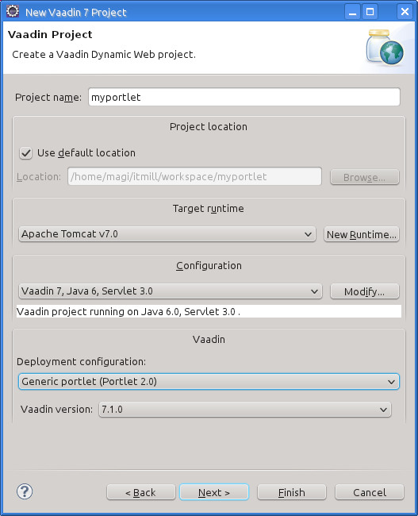
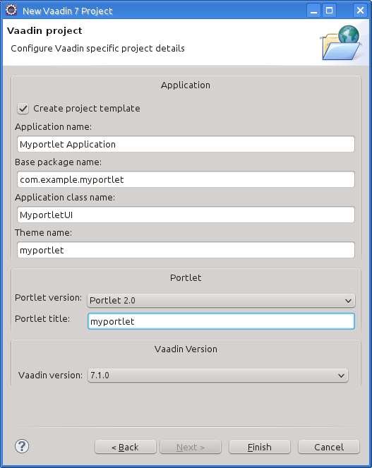
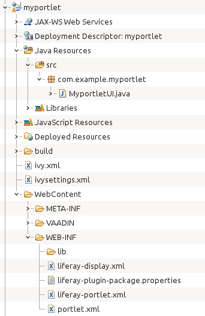
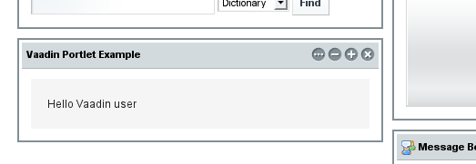

Vaadin supports running UIs as portlets in a portal, as defined in the
JSR-286 (Java Portlet API 2.0) standard. A portlet UI is defined just as
a regular UI, but deploying to a portal is somewhat different from
deployment of regular web applications, requiring special portlet
descriptors, etc. Creating the portlet project with the Vaadin Plugin
for Eclipse or a Maven archetype automatically generates the necessary
descriptors.

In addition to providing user interface through the Vaadin UI, portlets
can integrate with the portal to switch between portlet modes and
process special portal requests, such as actions and events.

While providing generic support for all portals implementing the
standard, Vaadin especially supports the Liferay portal and the needed
portal-specific configuration in this chapter is given for Liferay.
Vaadin also has a special Liferay IPC add-on to enable communication
between portlets.

Creating a Generic Portlet in Eclipse {#portal.eclipse}
=====================================

Here we describe the creation of a generic portlet project in Eclipse.
You can use the Maven archetypes also in other IDEs or without an IDE.

For Liferay portlet development, you may instead want to use the Maven
archetype or Liferay IDE to create the project, as described in ?.

Creating a Project with Vaadin Plugin {#portal.eclipse.vaadin}
-------------------------------------

The Vaadin Plugin for Eclipse has a wizard for easy creation of generic
portlet projects. It creates a UI class and all the necessary descriptor
files.

Creating a portlet project is almost identical to the creation of a
regular Vaadin servlet application project. For a full treatment of the
New Project Wizard and the possible options, please see ?.

1.  Start creating a new project by selecting from the menu
    File
    New
    Project...
2.  In the
    New Project
    window that opens, select
    Web
    Vaadin 7 Project
    and click
    Next
    .
3.  In the Vaadin Project step, you need to set the basic web project
    settings. You need to give at least the project name, the runtime,
    select Generic Portlet for the Deployment configuration; the default
    values should be good for the other settings.

    

    You can click Finish here to use the defaults for the rest of the
    settings, or click Next.

4.  The settings in the Web Module step define the basic servlet-related
    settings and the structure of the web application project. All the
    settings are pre-filled, and you should normally accept them as they
    are and click Next.

5.  The Vaadin project step page has various Vaadin-specific application
    settings. These are largely the same as for regular applications.
    Setting them here is easiest - later some of the changes require
    changes in several different files. The Create portlet template
    option should be automatically selected. You can give another
    portlet title of you want. You can change most of the settings
    afterward.

    

    Create project template

    :   Creates a UI class and all the needed portlet deployment
        descriptors.

    Application name

    :   The application name is used in the title of the browser window,
        which is usually invisible in portlets, and as an identifier,
        either as is or with a suffix, in various deployment
        descriptors.

    Base package name

    :   Java package for the UI class.

    Application class name

    :   Name of the UI class. The default is derived from the project
        name.

    Theme name

    :   Name of the custom portlet theme to use.

    Portlet version

    :   Same as in the project settings.

    Portlet title

    :   The portlet title, defined in `portlet.xml`, can be used as the
        display name of the portlet (at least in Liferay). The default
        value is the project name. The title is also used as a short
        description in `liferay-plugin-package.properties`.

    Vaadin version

    :   Same as in the project settings.

    Finally, click Finish to create the project.

6.  Eclipse may ask you to switch to J2EE perspective. A Dynamic Web
    Project uses an external web server and the J2EE perspective
    provides tools to control the server and manage application
    deployment. Click Yes.

Developing Vaadin Portlets for Liferay {#portal.liferay}
======================================

A Vaadin portlet requires resources such as the server-side Vaadin
libraries, a theme, and a widget set. You have two basic ways to deploy
these: either globally in Liferay, so that the resources are shared
between all Vaadin portlets, or as self-contained WARs, where each
portlet carries their own resources.

The self-contained way is easier and more flexible to start with, as the
different portlets may have different versions of the resources.
Currently, the latest Maven archetypes support the self-contained
portlets, while with portlets created with the Vaadin Plugin for Eclipse
only support globally deployed resources.

Using shared resources is more efficient when you have multiple Vaadin
portlets on the same page, as they can share the common resources.
However, they must use exactly same Vaadin version. This is recommended
for production environments, where you can even serve the theme and
widget set from a front-end server. You can install the shared resources
as described in ?.

At the time of writing, the latest Liferay release 6.2 is bundled with a
version of Vaadin release 6. If you want to use Vaadin 7 portlets with
shared resources, you first need to remove the old ones as described in
?.

Defining Liferay Profile for Maven {#portal.liferay.profile}
----------------------------------

When creating a Liferay portlet project with a Maven archetype or the
Liferay IDE, you need to define a Liferay profile. With the Liferay IDE,
you can create it when you create the project, as described in ?, but
for creating a project from the Maven archetype, you need to define in
manually.

### Defining Profile in `settings.xml` {#portal.liferay.profile.settings}

Liferay profile can be defined either in the user or in the global
`settings.xml` file for Maven. The global settings file is located in
`${MAVEN_HOME}/conf/settings.xml` and the user settings file in
`${USER_HOME}/.m2/settings.xml`. To create a user settings file, copy at
least the relevant headers and root element from the global settings
file.

    ...
    <profile>
      <id>liferay</id>
      <properties>
        <liferayinstall>/opt/liferay-portal-6.2-ce-ga2
        </liferayinstall>
        <plugin.type>portlet</plugin.type>
        <liferay.version>6.2.1</liferay.version>
        <liferay.maven.plugin.version>6.2.1
        </liferay.maven.plugin.version>
        <liferay.auto.deploy.dir>${liferayinstall}/deploy
        </liferay.auto.deploy.dir>

        <!-- Application server version - here for Tomcat -->
        <liferay.tomcat.version>7.0.42</liferay.tomcat.version>
        <liferay.tomcat.dir>
            ${liferayinstall}/tomcat-${liferay.tomcat.version}
        </liferay.tomcat.dir>

        <liferay.app.server.deploy.dir>${liferay.tomcat.dir}/webapps
        </liferay.app.server.deploy.dir>
        <liferay.app.server.lib.global.dir>${liferay.tomcat.dir}/lib/ext
        </liferay.app.server.lib.global.dir>
        <liferay.app.server.portal.dir>${liferay.tomcat.dir}/webapps/ROOT
        </liferay.app.server.portal.dir>
      </properties>     
    </profile>

The parameters are as follows:

`liferayinstall`
:   Full (absolute) path to the Liferay installation directory.

`liferay.version`
:   Liferay version by the Maven version numbering scheme. The first two
    (major and minor) numbers are same as in the installation package.
    The third (maintenance) number starts from 0 with first GA (general
    availability) release.

`liferay.maven.plugin.version`
:   This is usually the same as the Liferay version.

`liferay.auto.deploy.dir`
:   The Liferay auto-deployment directory. It is by default
    deploy
    under the Liferay installation path.

`liferay.tomcat.version` (optional)
:   If using Tomcat, its version number.

`liferay.tomcat.dir`
:   Full (absolute) path to Tomcat installation directory. For Tomcat
    bundled with Liferay, this is under the Liferay installation
    directory.

`liferay.app.server.deploy.dir`
:   Directory where portlets are deployed in the application server used
    for Liferay. This depends on the server - for Tomcat it is the
    webapps
    directory under the Tomcat installation directory.

`liferay.app.server.lib.global.dir`
:   Library path where libraries globally accessible in the application
    server should be installed.

`liferay.app.server.portal.dir`
:   Deployment directory for static resources served by the application
    server, under the root path of the server.

If you modify the settings after the project is created, you need to
touch the POM file in the project to have the settings reloaded.

### Activating the Maven Profile {#portal.liferay.profile.properties}

The Maven 2 Plugin for Eclipse (m2e) must know which Maven profiles you
use in a project. This is configured in the Maven section of the project properties. In
the Active Maven Profiles field, enter the profile ID defined in the
`settings.xml` file, as illustrated in ?.

Creating a Portlet Project with Maven {#portal.liferay.project}
-------------------------------------

Creation of Vaadin a Maven project is described in ?. For a Liferay
project, you should use the `vaadin-archetype-liferay-portlet`.

### Archetype Parameters {#portal.liferay.project.archetype-parameters}

The archetype has a number of parameters. If you use Maven Plugin for
Eclipse (m2e) to create the project, you get to enter the parameters
after selecting the archetype, as shown in ?.

Minimally, you just need to enter the artifact ID. To activate the Maven
profile created as described earlier in ?, you need to specify the
profile in the Profiles field under the Advanced section.

The other parameters are the following:

`vaadinVersion`
:   Vaadin release version for the Maven dependency.

`uiClassName`
:   Class name of the UI class stub to be created.

`theme`
:   Theme to use. You can use either a project theme, which must be
    compiled before deployment, or use the
    liferay
    theme.

`portletTitle`
:   Title shown in the portlet title bar.

`portletShortTitle`
:   Title shown in contexts where a shorter title is preferred.

`portletKeywords`
:   Keywords for finding the portlet in Liferay.

`portletDescription`
:   A description of the portlet.

`portletName`
:   Identifier for the portlet, used for identifying it in the
    configuration files.

`portletDisplayName`
:   Name of the portlet for contexts where it is displayed.

Creating a Portlet Project in Liferay IDE {#portal.liferay.ide}
-----------------------------------------

Liferay IDE, which you install in Eclipse as plugins just like the
Vaadin plugin, enables a development environment for Liferay portlets.
Liferay IDE allows integrated deployment of portlets to Liferay, just
like you would deploy servlets to a server in Eclipse. The project
creation wizard supports creation of Vaadin portlets.

Loading widget sets, themes, and the Vaadin JAR from a portlet is
possible as long as you have a single portlet, but causes a problem if
you have multiple portlets. To solve this, Vaadin portlets need to use a
globally installed widget set, theme, and Vaadin libraries.

*Liferay 6.2, which is the latest Liferay version at the time of
publication of this book, comes bundled with an older Vaadin 6 version.
If you want to use Vaadin 7, you need to remove the bundled version and
install the newer one manually as described in this chapter.*

In these instructions, we assume that you use Liferay bundled with
Apache Tomcat, although you can use almost any other application server
with Liferay just as well. The Tomcat installation is included in the
Liferay installation package, under the `tomcat-x.x.x` directory.

Removing the Bundled Installation {#portal.liferay.remove}
---------------------------------

Before installing a new Vaadin version, you need to remove the version
bundled with Liferay. You need to remove the Vaadin library JAR from the
library directory of the portal and the `VAADIN` directory from under
the root context. For example, with Liferay bundled with Tomcat, they
are usually located as follows:

-   tomcat-x.x.x/webapps/ROOT/html/VAADIN
-   tomcat-x.x.x/webapps/ROOT/WEB-INF/lib/vaadin.jar

Installing Vaadin Resources {#portal.liferay.install}
---------------------------

To use common resources needed by multiple Vaadin portlets, you can
install them globally as shared resources as described in the following.

If you are installing Vaadin in a Liferay version that comes bundled
with an older version of Vaadin, you first need to remove the resources
as described in ?.

In the following, we assume that you use only the built-in "liferay"
theme in Vaadin and the default widget set.

1.  Get the Vaadin installation package from the Vaadin download page
2.  Extract the following Vaadin JARs from the installation package:
    vaadin-server.jar
    and
    vaadin-shared.jar
    , as well as the
    vaadin-shared-deps.jar
    and
    jsoup.jar
    dependencies from the
    lib
    folder
3.  Rename the JAR files as they were listed above, without the version
    number
4.  Put the libraries in
    tomcat-x.x.x/webapps/ROOT/WEB-INF/lib/
5.  Extract the `VAADIN` folders from `vaadin-server.jar`,
    `vaadin-themes.jar`, and `vaadin-client-compiled.jar` and copy their
    contents to `tomcat-x.x.x/webapps/ROOT/html/VAADIN`.

        $ cd tomcat-x.x.x/webapps/ROOT/html

        $ unzip path-to/vaadin-server-7.1.0.jar 'VAADIN/*'

        $ unzip path-to/vaadin-themes-7.1.0.jar 'VAADIN/*'

        $ unzip path-to/vaadin-client-compiled-7.1.0.jar 'VAADIN/*'

You need to define the widget set, the theme, and the JAR in the
`portal-ext.properties` configuration file for Liferay, as described
earlier. The file should normally be placed in the Liferay installation
directory. See Liferay documentation for details on the configuration
file.

Below is an example of a `portal-ext.properties` file:

    # Path under which the VAADIN directory is located.
    # (/html is the default so it is not needed.)
    # vaadin.resources.path=/html

    # Portal-wide widget set
    vaadin.widgetset=com.vaadin.server.DefaultWidgetSet

    # Theme to use
    vaadin.theme=liferay

The allowed parameters are:

`vaadin.resources.path`

:   Specifies the resource root path under the portal context. This is
    `/html` by default. Its actual location depends on the portal and
    the application server; in Liferay with Tomcat it would be located
    at `webapps/ROOT/html` under the Tomcat installation directory.

`vaadin.widgetset`

:   The widget set class to use. Give the full path to the class name in
    the dot notation. If the parameter is not given, the default widget
    set is used.

`vaadin.theme`

:   Name of the theme to use. If the parameter is not given, the default
    theme is used, which is `reindeer` in Vaadin 6.

You will need to restart Liferay after creating or modifying the
`portal-ext.properties` file.

Portlet UI {#portal.ui}
==========

A portlet UI is just like in a regular Vaadin application, a class that
extends `com.vaadin.ui.UI`.

    @Theme("myportlet")
    public class MyportletUI extends UI {
        @Override
        protected void init(VaadinRequest request) {
            final VerticalLayout layout = new VerticalLayout();
            layout.setMargin(true);
            setContent(layout);

            Button button = new Button("Click Me");
            button.addClickListener(new Button.ClickListener() {
                public void buttonClick(ClickEvent event) {
                    layout.addComponent(
                            new Label("Thank you for clicking"));
                }
            });
            layout.addComponent(button);
        }
    }

If you created the project as a Servlet 3.0 project, the generated UI
stub includes a static servlet class annotated with `@WebServlet`, as
described in ?.

        @WebServlet(value = "/*", asyncSupported = true)
        @VaadinServletConfiguration(productionMode = false,
                                    ui = MyportletUI.class)
        public static class Servlet extends VaadinServlet {
        }

This enables running the portlet UI in a servlet container while
developing it, which may be easier than deploying to a portal. For
Servlet 2.4 projects, a `web.xml` is created.

The portlet theme is defined with the `@Theme` annotation as usual. The
theme for the UI must match a theme installed in the portal. You can use
any of the built-in themes in Vaadin. For Liferay theme compatibility,
there is a special `liferay` theme. If you use a custom theme, you need
to compile it to CSS with the theme compiler and install it in the
portal under the `VAADIN/themes` context to be served statically.

In addition to the UI class, you need the portlet descriptor files,
Vaadin libraries, and other files as described later. ? shows the
complete project structure under Eclipse.

Installed as a portlet in Liferay from the Add Application menu, the
application will show as illustrated in ?.

Deploying to a Portal {#portal.deployment}
=====================

To deploy a portlet WAR in a portal, you need to provide a `portlet.xml`
descriptor specified in the Java Portlet API 2.0 standard (JSR-286). In
addition, you may need to include possible portal vendor specific
deployment descriptors. The ones required by Liferay are described
below.

Deploying a Vaadin UI as a portlet is essentially just as easy as
deploying a regular application to an application server. You do not
need to make any changes to the UI itself, but only the following:

-   Application packaged as a WAR

    -   `WEB-INF/portlet.xml` descriptor

    -   `WEB-INF/liferay-portlet.xml` descriptor for Liferay

    -   `WEB-INF/liferay-display.xml` descriptor for Liferay

    -   `WEB-INF/liferay-plugin-package.properties` for Liferay

-   Widget set installed to portal (optional)
-   Themes installed to portal (optional)
-   Vaadin libraries installed to portal (optional)
-   Portal configuration settings (optional)

The Vaadin Plugin for Eclipse creates these files for you, when you
create a portlet project as described in ?.

Installing the widget set and themes to the portal is required for
running two or more Vaadin portlets simultaneously in a single portal
page. As this situation occurs quite easily, we recommend installing
them in any case. Instructions for Liferay are given in ? and the
procedure is similar for other portals.

In addition to the Vaadin libraries, you will need to have the
`portlet.jar` in your project classpath. However, notice that you must
*not* put the `portlet.jar` in the same `WEB-INF/lib` directory as the
Vaadin JAR or otherwise include it in the WAR to be deployed, because it
would create a conflict with the internal portlet library of the portal.
The conflict would cause errors such as "`ClassCastException:
            ...VaadinPortlet cannot be cast to javax.portlet.Portlet`".

Portlet Deployment Descriptor {#portal.deployment.descriptor}
-----------------------------

The portlet WAR must include a portlet descriptor located at
`WEB-INF/portlet.xml`. A portlet definition includes the portlet name,
mapping to a servlet, modes supported by the portlet, and other
configuration. Below is an example of a simple portlet definition in
`portlet.xml` descriptor.

    <?xml version="1.0" encoding="UTF-8" standalone="no"?>
    <portlet-app
      xmlns="http://java.sun.com/xml/ns/portlet/portlet-app_2_0.xsd"
      xmlns:xsi="http://www.w3.org/2001/XMLSchema-instance"
      version="2.0"
      xsi:schemaLocation=
        "http://java.sun.com/xml/ns/portlet/portlet-app_2_0.xsd
         http://java.sun.com/xml/ns/portlet/portlet-app_2_0.xsd">

      <portlet>
        <portlet-name>Portlet Example portlet</portlet-name>
        <display-name>Vaadin Portlet Example</display-name>

        <!-- Map portlet to a servlet. -->
        <portlet-class>
          com.vaadin.server.VaadinPortlet
        </portlet-class>
        <init-param>
          <name>UI</name>

          <!-- The application class with package name. -->
          <value>com.example.myportlet.MyportletUI</value>
        </init-param>

        <!-- Supported portlet modes and content types. -->
        <supports>
          <mime-type>text/html</mime-type>
          <portlet-mode>view</portlet-mode>
          <portlet-mode>edit</portlet-mode>
          <portlet-mode>help</portlet-mode>
        </supports>

        <!-- Not always required but Liferay requires these. -->
        <portlet-info>
          <title>Vaadin Portlet Example</title>
          <short-title>Portlet Example</short-title>
        </portlet-info>
      </portlet>
    </portlet-app>

Listing supported portlet modes in `portlet.xml` enables the
corresponding portlet controls in the portal user interface that allow
changing the mode, as described later.

Liferay Portlet Descriptor {#portal.deployment.liferay}
--------------------------

Liferay
portlet descriptor
Liferay requires a special `liferay-portlet.xml` descriptor file that
defines Liferay-specific parameters. Especially, Vaadin portlets must be
defined as "*instanceable*", but not "*ajaxable*".

Below is an example descriptor for the earlier portlet example:

    <?xml version="1.0" encoding="UTF-8"?>
    <!DOCTYPE liferay-portlet-app PUBLIC
      "-//Liferay//DTD Portlet Application 4.3.0//EN"
      "http://www.liferay.com/dtd/liferay-portlet-app_4_3_0.dtd">

    <liferay-portlet-app>
        <portlet>
            <!-- Matches definition in portlet.xml.          -->
            <!-- Note: Must not be the same as servlet name. -->
            <portlet-name>Portlet Example portlet</portlet-name>

            <instanceable>true</instanceable>
            <ajaxable>false</ajaxable>
        </portlet>
    </liferay-portlet-app>

See Liferay documentation for further details on the
`liferay-portlet.xml` deployment descriptor.

Liferay Display Descriptor {#portal.deployment.liferay-display}
--------------------------

liferay-display.xml
Liferay
display descriptor
The `WEB-INF/liferay-display.xml` file defines the portlet category
under which portlets are located in the Add Application window in
Liferay. Without this definition, portlets will be organized under the
"Undefined" category.

The following display configuration, which is included in the demo WAR,
puts the Vaadin portlets under the "Vaadin" category, as shown in ?.

    <?xml version="1.0"?>
    <!DOCTYPE display PUBLIC
      "-//Liferay//DTD Display 4.0.0//EN"
      "http://www.liferay.com/dtd/liferay-display_4_0_0.dtd">

    <display>
        <category name="Vaadin">
            <portlet id="Portlet Example portlet" />
        </category>
    </display>

See Liferay documentation for further details on how to configure the
categories in the `liferay-display.xml` deployment descriptor.

Liferay Plugin Package Properties {#portal.deployment.liferay-plugin}
---------------------------------

liferay-plugin-package.xml
Liferay
plugin properties
The `liferay-plugin-package.properties` file defines a number of
settings for the portlet, most importantly the Vaadin JAR to be used.

    name=Portlet Example portlet
    short-description=myportlet
    module-group-id=Vaadin
    module-incremental-version=1
    #change-log=
    #page-uri=
    #author=
    license=Proprietary
    portal-dependency-jars=\
        vaadin.jar

`name`

:   The plugin name must match the portlet name.

`short-description`

:   A short description of the plugin. This is by default the project
    name.

`module-group-id`

:   The application group, same as the category id defined in
    `liferay-display.xml`.

`license`

:   The plugin license type; "proprietary" by default.

`portal-dependency-jars`

:   The JAR libraries on which this portlet depends. This should have
    value `vaadin.jar`, unless you need to use a specific version. The
    JAR must be installed in the portal, for example, in Liferay bundled
    with Tomcat to `tomcat-x.x.x/webapps/ROOT/WEB-INF/lib/vaadin.jar`.

Using a Single Widget Set {#portal.deployment.widgetset}
-------------------------

If you have just one Vaadin application that you ever need to run in
your portal, you can just deploy the WAR as described above and that's
it. However, if you have multiple applications, especially ones that use
different custom widget sets, you run into problems, because a portal
window can load only a single Vaadin widget set at a time. You can solve
this problem by combining all the different widget sets in your
different applications into a single widget set using inheritance or
composition.

For example, if using the default widget set for portlets, you should
have the following for all portlets so that they will all use the same
widget set:

    <portlet>
      ...
      <!-- Use the portal default widget set for all portal demos. -->
      <init-param>
        <name>widgetset</name>
        <value>com.vaadin.portal.PortalDefaultWidgetSet</value>
      </init-param>
      ...

The `PortalDefaultWidgetSet` extends `SamplerWidgetSet`, which extends
the `DefaultWidgetSet`. The `DefaultWidgetSet` is therefore essentially
a subset of `PortalDefaultWidgetSet`, which contains also the widgets
required by the Sampler demo. Other applications that would otherwise
require only the regular `DefaultWidgetSet`, and do not define their own
widgets, can just as well use the larger set, making them compatible
with the demos. The `PortalDefaultWidgetSet` will also be the default
Vaadin widgetset bundled in Liferay 5.3 and later.

If your portlets are contained in multiple WARs, which can happen quite
typically, you need to install the widget set and theme portal-wide so
that all the portlets can use them. See ? on configuring the widget sets
in the portal itself.

Building the WAR Package {#portal.deployment.war}
------------------------

To deploy the portlet, you need to build a WAR package. For production
deployment, you probably want to either use Maven or an Ant script to
build the package. In Eclipse, you can right-click on the project and
select Export \> WAR. Choose a name for
the package and a target. If you have installed Vaadin in the portal as
described in ?, you should exclude all the Vaadin libraries, as well as
widget set and themes from the WAR.

Deploying the WAR Package {#portal.deployment.deploy}
-------------------------

How you actually deploy a WAR package depends on the portal. In Liferay,
you simply drop it to the `deploy` subdirectory under the Liferay
installation directory. The deployment depends on the application server
under which Liferay runs; for example, if you use Liferay bundled with
Tomcat, you will find the extracted package in the `webapps` directory
under the Tomcat installation directory included in Liferay.

Vaadin IPC for Liferay {#portal.liferay-ipc}
======================

IPC add-on
Portlets rarely live alone. A page can contain multiple portlets and
when the user interacts with one portlet, you may need to have the other
portlets react to the change immediately. This is not normally possible
with Vaadin portlets, as Vaadin applications need to get an Ajax request
from the client-side to change their user interface. On the other hand,
the regular inter-portlet communication (IPC) mechanism in Portlet 2.0
Specification requires a complete page reload, but that is not
appropriate with Vaadin or in general Ajax applications, which do not
require a page reload. One solution is to communicate between the
portlets on the server-side and then use a server-push mechanism to
update the client-side.

The Vaadin IPC for Liferay Add-on takes another approach by
communicating between the portlets through the client-side. Events
(messages) are sent through the `LiferayIPC` component and the
client-side widget relays them to the other portlets, as illustrated in
?.

Vaadin IPC for Liferay uses the Liferay JavaScript event API for
client-side inter-portlet communication, so you can communicate just as
easily with other Liferay portlets.

Notice that you can use this communication only between portlets on the
same page.

? shows Vaadin IPC for Liferay in action. Entering a new item in one
portlet is updated interactively in the other.

Installing the Add-on {#portal.liferay-ipc.installation}
---------------------

The Vaadin IPC for Liferay add-on is available from the Vaadin Directory
as well as from a Maven repository. To download the installation package
or find out the Maven or Ivy dependency, see the [add-on page at Vaadin
Directory](#), and install the add-on as described in ?.

The contents of the installation package are as follows:

`vaadin-ipc-for-liferay-x.x.x.jar`
:   The add-on JAR in the installation package must be installed in the
    WEB-INF/lib
    directory under the root context. The location depends on the
    server - for example in Liferay running in Tomcat it is located
    under the
    webapps/ROOT
    folder of the server.

`doc`
:   The documentation folder includes a
    README.TXT
    file that describes the contents of the installation package
    briefly, and
    licensing.txt
    and
    license-asl-2.0.txt
    , which describe the licensing under the Apache License 2.0. Under
    the
    doc/api
    folder is included the complete JavaDoc API documentation for the
    add-on.

`vaadin-ipc-for-liferay-x.x.x-demo.war`
:   A WAR containing demo portlets. After installing the add-on library
    and compiling the widget set, as described below, you can deploy the
    WAR to Liferay and add the two demo portlets to a page, as shown in
    . The source of the demo is available at
    dev.vaadin.com/svn/addons/IPCforLiferay/trunk/
    .

The add-on contains a widget set, which you must compile into the Vaadin
widget set installed in the portal.

Basic Communication {#portal.liferay-ipc.communication}
-------------------

`LiferayIPC` is an invisible user interface component that can be used
to send messages between two or more Vaadin portlets. You add it to an
application layout as you would any regular user interface component.

    LiferayIPC liferayipc = new LiferayIPC();
    layout.addComponent(liferayipc);

You should be careful not to remove the invisible component from the
portlet later if you modify the layout of the portlet.

The component can be used both for sending and receiving messages, as
described next.

You can send an event (a message) with the sendEvent() method, which
takes an event ID and the message data as parameters. The event is
broadcast to all listening portlets. The event ID is a string that can
be used to identify the recipient of an event or the event type.

    liferayipc.sendEvent("hello", "This is Data");

If you need to send more complex data, you need to format or serialize
it to a string representation as described in ?.

A portlet wishing to receive events (messages) from other portlets needs
to register a listener in the component with addListener(). The listener
receives the messages in a `LiferayIPCEvent` object. Filtering events by
the ID is built in into the listener handler, you give the listened
event ID as the first parameter for the addListener(). The actual
message data is held in the `data` property, which you can read with
getData().

    liferayipc.addListener("hello", new LiferayIPCEventListener() {
        public void eventReceived(LiferayIPCEvent event) {
            // Do something with the message data
            String data = event.getData();
            Notification.show("Received hello: " + data);
        }
    });

A listener added to a `LiferayIPC` can be removed with removeListener().

Considerations {#portal.liferay-ipc.concerns}
--------------

Both security and efficiency should be considered with inter-portlet
communications when using the Vaadin IPC for Liferay.

### Browser Security {#portal.liferay-ipc.concerns.security}

As the message data is passed through the client-side (browser), any
code running in the browser has access to the data. You should be
careful not to expose any security-critical data in client-side
messaging. Also, malicious code running in the browser could alter or
fake messages. Sanitization can help with the latter problem and
encryption to solve the both issues. You can also share the sensitive
data through session attributes or a database and use the client-side
IPC only to notify that the data is available.

### Efficiency {#portal.liferay-ipc.concerns.efficiency}

Sending data through the browser requires loading and sending it in HTTP
requests. The data is held in the memory space of the browser, and
handling large data in the client-side JavaScript code can take time.
Noticeably large message data can therefore reduce the responsiveness of
the application and could, in extreme cases, go over browser limits for
memory consumption or JavaScript execution time.

Communication Through Session Attributes {#portal.liferay-ipc.attributes}
----------------------------------------

In many cases, such as when considering security or efficiency, it is
better to pass the bulk data on the server-side and use the client-side
IPC only for notifying the other portlet(s) that the data is available.
Session attributes are a conveninent way of sharing data on the
server-side. You can also share objects through them, not just strings.

The session variables have a *scope*, which should be
`APPLICATION_SCOPE`. The "application" refers to the scope of the Java
web application (WAR) that contains the portlets.

If the communicating portlets are in the same Java web application
(WAR), no special configuration is needed. You can also communicate
between portlets in different WARs, in which case you need to disable
the `private-session-attributes` parameter in `liferay-portlet.xml` by
setting it to `false`. Please see Liferay documentation for more
information regarding the configuration.

You can also share Java objects between the portlets in the same WAR,
not just strings. If the portlets are in different WARs, they normally
have different class loaders, which could cause incompatibilities, so
you can only communicate with strings and any object data needs to be
serialized.

Session attributes are accessible through the `PortletSession` object,
which you can access through the portlet context from the Vaadin
`Application` class.

    Person person = new Person(firstname, lastname, age);
    ...

    PortletSession session =
            ((PortletApplicationContext2)getContext()).
                getPortletSession();

    // Share the object
    String key = "IPCDEMO_person";
    session.setAttribute(key, person,
                         PortletSession.APPLICATION_SCOPE);

    // Notify that it's available
    liferayipc.sendEvent("ipc_demodata_available", key);

You can then receive the attribute in a `LiferayIPCEventListener` as
follows:

    public void eventReceived(LiferayIPCEvent event) {
        String key = event.getData();

        PortletSession session =
                ((PortletApplicationContext2)getContext()).
                    getPortletSession();

        // Get the object reference
        Person person = (Person) session.getAttribute(key);

        // We can now use the object in our application
        BeanItem<Person> item = new BeanItem<Person> (person);
        form.setItemDataSource(item);
    }

Notice that changes to a shared object bound to a user interface
component are not updated automatically if it is changed in another
portlet. The issue is the same as with double-binding in general.

Serializing and Encoding Data {#portal.liferay-ipc.serialization}
-----------------------------

The IPC events support transmitting only plain strings, so if you have
object or other non-string data, you need to format or serialize it to a
string representation. For example, the demo application formats the
trivial data model as a semicolon-separated list as follows:

    private void sendPersonViaClient(String firstName,
                                     String lastName, int age) {
        liferayIPC_1.sendEvent("newPerson", firstName + ";" +
                               lastName + ";" + age);
    }

You can use standard Java serialization for any classes that implement
the Serializable interface. The transmitted data may not include any
control characters, so you also need to encode the string, for example
by using Base64 encoding.

    // Some serializable object
    MyBean mybean = new MyBean();
    ...

    // Serialize
    ByteArrayOutputStream baostr = new ByteArrayOutputStream();
    ObjectOutputStream oostr;
    try {
        oostr = new ObjectOutputStream(baostr);
        oostr.writeObject(mybean); // Serialize the object
        oostr.close();
    } catch (IOException e) {
        Notification.show("IO PAN!"); // Complain
    }

    // Encode
    BASE64Encoder encoder = new BASE64Encoder();
    String encoded = encoder.encode(baostr.toByteArray());

    // Send the IPC event to other portlet(s)
    liferayipc.sendEvent("mybeanforyou", encoded);

You can then deserialize such a message at the receiving end as follows:

    public void eventReceived(LiferayIPCEvent event) {
        String encoded = event.getData();

        // Decode and deserialize it    
        BASE64Decoder decoder = new BASE64Decoder();
        try {
            byte[] data = decoder.decodeBuffer(encoded);
            ObjectInputStream ois =
                    new ObjectInputStream( 
                            new ByteArrayInputStream(data));

            // The deserialized bean
            MyBean deserialized = (MyBean) ois.readObject();
            ois.close();

            ... do something with the bean ...

        } catch (IOException e) {
            e.printStackTrace(); // Handle somehow
        } catch (ClassNotFoundException e) {
            e.printStackTrace(); // Handle somehow
        }
    }

Communicating with Non-Vaadin Portlets {#portal.liferay-ipc.nonvaadin}
--------------------------------------

You can use the Vaadin IPC for Liferay to communicate also between a
Vaadin application and other portlets, such as JSP portlets. The add-on
passes the events as regular Liferay JavaScript events. The demo WAR
includes two JSP portlets that demonstrate the communication.

When sending events from non-Vaadin portlet, fire the event using the
JavaScript Liferay.fire() method with an event ID and message. For
example, in JSP you could have:

    <%@ taglib uri="http://java.sun.com/portlet_2_0"
               prefix="portlet" %>
    <portlet:defineObjects />

    

    <input type="button" value="Send message"
           onclick="send_message()" />

You can receive events using a Liferay JavaScript event handler. You
define the handler with the on() method in the Liferay object. It takes
the event ID and a callback function as its parameters. Again in JSP you
could have:

    <%@ taglib uri="http://java.sun.com/portlet_2_0"
               prefix="portlet" %>
    <portlet:defineObjects />

    
