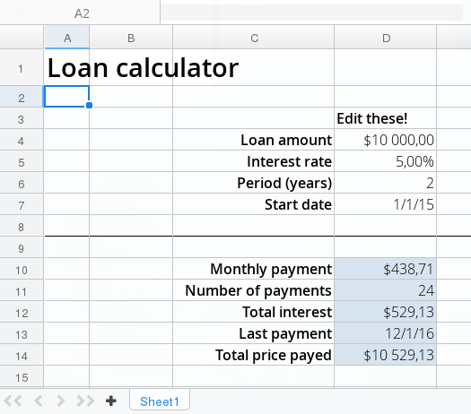
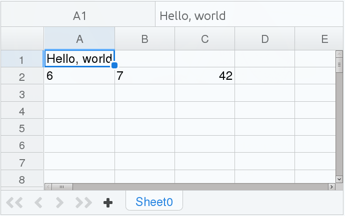

Spreadsheet
This chapter describes how to use Vaadin Spreadsheet, a Vaadin add-on
component for displaying and editing Excel spreadsheets within any
Vaadin application.

Overview {#spreadsheet.overview}
========

Spreadsheet applications have been the sonic screwdriver of business
computation and data collection for decades. In recent years,
spreadsheet web services have become popular with cloud-based services
that offer better collaboration, require no installation, and some are
even free to use. However, both desktop and third-party cloud-based
services are difficult to integrate well with web applications. Being a
Vaadin UI component, Vaadin Spreadsheet allows complete integration with
Vaadin applications and further with the overall system. The ability to
work on Excel spreadsheets allows desktop interoperability and
integration with document management.

By eliminating the dependency on third-party cloud-based services,
Vaadin Spreadsheet also gives control over the privacy of documents.
Growing security concerns over cloud-based information storage have
increased privacy requirements, with lowering trust in global
third-party providers. Vaadin applications can run on private
application servers, and also in the cloud if necessary, allowing you to
prioritize between security and local and global availability.

Vaadin Spreadsheet is a UI component that you use much like any other
component. It has full size by default, to use all the available space
in the containing layout. You can directly modify the cell data in the
active worksheet by entering textual and numerical values, as well as
using Excel formulas for spreadsheet calculations.

    Spreadsheet sheet = new Spreadsheet();
    sheet.setWidth("400px"); // Full size by default
    sheet.setHeight("250px");

    // Put customary greeting in a cell
    sheet.createCell(0, 0, "Hello, world");

    // Have some numerical data
    sheet.createCell(1, 0, 6);
    sheet.createCell(1, 1, 7);

    // Perform a spreadsheet calculation
    sheet.createCell(1, 2, ""); // Set a dummy value
    sheet.getCell(1, 2).setCellFormula("A2*B2");

    // Resize a column to fit the cell data
    sheet.autofitColumn(0);

    layout.addComponent(sheet);
    layout.setSizeFull(); // Typically

The result is shown in ?.

Cell values and formulas can be set, read, and styled through the
server-side API, so you can easily implement custom editing features
through menus or toolbars.

Full integration with a Vaadin application is reached through the
server-side access to the spreadsheet data as well as visual styling.
Changes in cell values can be handled in the Vaadin application and you
can use almost any Vaadin components within a spreadsheet.

Vaadin Spreadsheet uses Apache POI to work on Microsoft Excel documents.
You can access the Apache POI data model to perform low-level tasks,
although you should note that if you make modifications to the data
model, you have the responsibility to notify the spreadsheet to update
itself.

The basic features of Vaadin Spreadsheet are as follows:

-   Support for touch devices
-   Excel XLSX files, limited support for XLS files
-   Support for Excel formulas
-   Excel-like editing with keyboard support
-   Lazy loading of cell data from server to browser in large
    spreadsheets
-   Protected cells and sheets

The following features support integration with Vaadin Framework and
add-ons:

-   Handle changes in cell data
-   Vaadin components in spreadsheet cells
-   Support for Vaadin declarative format
-   Vaadin TestBench element API for UI testing

The Vaadin Spreadsheet Demo showcases the most important Spreadsheet
features. You can try it out at [http://demo.vaadin.com/spreadsheet](#).
See ? for instructions for importing the project in Eclipse. The [source
code is available and browseable at Github](#).

-   Vaadin 7.4 or later
-   Same browser requirements as Vaadin Framework, except Internet
    Explorer 9 or later is required

Vaadin Spreadsheet 1.0 has the following limitations:

-   Vaadin Charts component can not be used inside Spreadsheet
-   No provided toolbars or menus for formatting cells
-   Limited support for the older XSL format
-   Limitations of Apache POI

Vaadin Spreadsheet is a commercial product licensed under a
dual-licensing scheme. The AGPL license allows open-source development,
while the CVAL license needs to be purchased for closed-source use,
including web deployments and internal use. Commercial licenses can be
purchased from Vaadin Directory, where you can also find the license
details and download Vaadin Spreadsheet.

Installing Vaadin Spreadsheet {#spreadsheet.installation}
=============================

You can download and install Spreadsheet from Vaadin Directory at
[vaadin.com/addon/vaadin-spreadsheet](#) as an installation package, or
get it with Maven or Ivy. You can purchase the required CVAL license or
get a free trial key from Vaadin Directory or subscribe to the Pro Tools
at [vaadin.com/pro](#).

Add-on installation is described in detail in ?. The add-on includes
both a widget set and a theme, so you need to compile the widget sets
and themes in your project.

Installing as Ivy Dependency {#spreadsheet.installation.ivy}
----------------------------

If you use the add-on in an Eclipse project created with the Vaadin
Plugin for Eclipse, you can define an Ivy dependency to automatically
download the library. Include the following declaration inside the
`dependencies` section in the `ivy.xml`:

    <dependency org="com.vaadin.addon"
                name="vaadin-spreadsheet"
                rev="latest.release"
                conf="default->default" />

You can use `latest.release` revision tag to always use the latest
release or (preferably) specify a version by its version number. IvyDE
should resolve the dependency immediately as you save the file. See ?
for further details.

Defining the Maven Dependency {#spreadsheet.installation.maven}
-----------------------------

You can install Vaadin Spreadsheet in a Maven project by adding it as a
dependency, you need to include the following dependency in the POM. The
`artifactId` should be `vaadin-spreadsheet`.

    <dependency>
        <groupId>com.vaadin.addon</groupId>
        <artifactId>vaadin-spreadsheet</artifactId>
        <version>LATEST</version>
    </dependency>

You can use the `LATEST` version as shown above or (preferably) a
specific version by its version number.

You also need to define the repository for the Vaadin add-ons under the
`<repositories>` element:

    <repository>
        <id>vaadin-addons</id>
        <url>http://maven.vaadin.com/vaadin-addons</url>
    </repository>

Finally, you need to enable the widget set compilation in the POM, as
described in ?, and compile it.

Installing the Zip Package {#spreadsheet.installation.downloading}
--------------------------

Vaadin Spreadsheet is distributed as a Zip package that contains the
Spreadsheet JAR, a JavaDoc JAR, license texts, and other documentation.
You can download the Zip package from Vaadin Directory.

The `vaadin-spreadsheet-<version>.jar`, as well as all the dependency
libraries in the `lib` folder, should be put in the `WEB-INF/lib` folder
of the web application.

The `vaadin-spreadsheet-<version>-sources.jar` and
`vaadin-spreadsheet-<version>-javadoc.jar` are development libraries
that should not normally be deployed with the web application, so you
should put them to a separate non-deployment folder. In Eclipse
projects, this is usually a `lib` sub-folder in the project folder.

If you intend to use Vaadin TestBench for testing your Spreadsheet, you
will benefit from the Vaadin Spreadsheet TestBench API libraries
included in the `testbench-api` folder. They should be copied to a
non-deployment library folder in the project.

Please see the `README.html` for more information about the package
contents.

Installing License Key {#spreadsheet.installing.license}
----------------------

You need to install a license key before compiling the widget set. The
license key is checked during widget set compilation, so you do not need
it when deploying the application.

You can purchase Vaadin Spreadsheet or obtain a free trial key from the
[Vaadin Spreadsheet download page](#) in Vaadin Directory. You need to
register in Vaadin Directory to obtain the key.

See ? for detailed instructions on obtaining and installing the license
key.

Compiling Widget Set {#spreadsheet.installation.widgetset}
--------------------

Compile the widget set as instructed in ?. Widget set compilation should
automatically update your project widget set to include the Spreadsheet
widget set:

    <inherits name="com.vaadin.addon.spreadsheet.Widgetset"/>

If you have set the widget set to be manually edited, you need to add
the element yourself.

Compiling Theme {#spreadsheet.installation.theme}
---------------

Compile the theme as instructed in ?. If you compile in Eclipse or with
Maven, the `addons.scss` file in your theme should be automatically
updated to include the Spreadsheet theme:

    @import "../../../VAADIN/addons/spreadsheet/spreadsheet.scss";
    @mixin addons {
         @include spreadsheet;
    }

If you are compiling the theme otherwise, or the theme addons are not
automatically updated for some reason, you need to add the statements
yourself.

Importing the Demo {#spreadsheet.installation.demo}
------------------

The Demo, illustrated in ? in the overview, showcases most of the
functionality in Vaadin Spreadsheet. You can try out the demo online at
[demo.vaadin.com/spreadsheet](#).

You can browse the sources on-line or, more conveniently, import the
project in Eclipse (or other IDE). As the project is Maven-based,
Eclipse users need to install the m2e plugin to be able to import Maven
projects, as well as EGit to be able to import Git repositories. Once
they are installed, you should be able to import demo as follows.

1.  Select
    File
    Import
2.  Select
    Maven
    Check out Maven Project from SCM
    , and click
    Next
    .
3.  You may need to install the EGit SCM connector if you have not done
    so previously. If Git is not available in the SCM list, click m2e
    marketplace, select the EGit connector, and click Finish. You need
    to restart Eclipse and redo the earlier steps above.

    Instead of using m2e EGit connector, you can also check out the
    project with another Git tool and then import it in Eclipse as a
    Maven project.

4.  In
    SCM URL
    , select
    git
    and enter the repository URL
    https://github.com/vaadin/spreadsheet-demo
    .
5.  Click
    Finish
    .
6.  Compile the widget set either by clicking
    Compile Widgetset
    in the Eclipse toolbar or by running the
    vaadin:compile
    goal with Maven.
7.  Deploy the application to a server. See
    for instructions for deploying in Eclipse.
8.  Open the URL
    http://localhost:8080/spreadsheet
    with a browser.

Basic Use {#spreadsheet.using}
=========

`Spreadsheet` is a Vaadin component, which you can use as you would any
component. You can create it, or load from an Excel file, create cells
and new sheets, define formulas, and so forth. In the following, we go
through these basic steps.

Creating a Spreadsheet {#spreadsheet.using.creating}
----------------------

The default constructor for `Spreadsheet` creates an empty spreadsheet
with a default sheet. The spreadsheet component has full size by
default, so the containing layout must have defined size in both
dimensions; a spreadsheet may not have undefined size.

In the following example, we create an empty spreadsheet with a fixed
size and add it to a layout.

    Spreadsheet sheet = new Spreadsheet();
    sheet.setWidth("400px");
    sheet.setHeight("300px");

    layout.addComponent(sheet);

An empty spreadsheet automatically gets an initial worksheet with some
default size and settings.

### Loading an Excel Spreadsheet {#spreadsheet.using.creating.loading}

You can load an Excel file from the local filesystem with a `File`
reference or from memory or other source with an `InputStream`.

### Working with an Apache POI Workbook {#spreadsheet.using.creating.poi}

If you have an Apache POI workbook created otherwise, you can wrap it to
`Spreadsheet` with the respective constructor.

You can access the underlying workbook with getWorkbook(). However, if
you make modifications to the workbook, you must allow the spreadsheet
update itself by calling appropriate update methods for the modified
element or elements.

Working with Sheets {#spreadsheet.using.sheets}
-------------------

A "spreadsheet" in reality works on a *workbook*, which contains one or
more *worksheets*. You can create new sheets and delete existing ones
with createNewSheet() and deleteSheet(), respectively.

    // Recreate the initial sheet to configure it
    Spreadsheet sheet = new Spreadsheet();
    sheet.createNewSheet("New Sheet", 10, 5);
    sheet.deleteSheet(0);

When a sheet is deleted, the index of the sheets with a higher index is
decremented by one. When the active worksheet is deleted, the next one
by index is set as active, or if there are none, the previous one.

All operations on the spreadsheet content are done through the currently
active worksheet. You can set an existing sheet as active with
setActiveSheetIndex().
