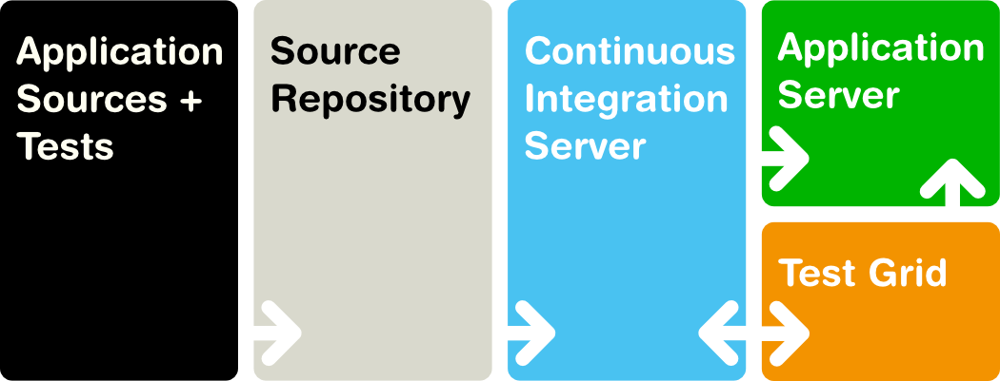

This chapter describes the installation and use of the Vaadin TestBench.

Overview {#testbench.overview}
========

Testing is one of the cornerstones of modern software development.
Extending throughout the development process, testing is the thread that
binds the product to the requirements. In agile and other iterative
development processes, with ever shorter release cycles and continuous
integration, the automation of integration, regression, endurance, and
acceptance testing is paramount. Further, UI automation may be needed
for integration purposes, such as for assistive technologies. The
special nature of web applications creates many unique requirements for
both testing and UI automation.

Vaadin TestBench allows controlling the browser from Java code, as
illustrated in ?. It can open a new browser window to start the
application, interact with the UI components, for example, by clicking
them, and then get the HTML element values.

Before going further into feature details, you may want to try out
Vaadin TestBench yourself. You just need to create a new Vaadin project
either with the Eclipse plugin or the Maven archetype. Both create a
simple application stub that includes TestBench test cases for testing
the UI. You also need to install an evaluation license. For
instructions, jump to ? and, after trying it out, come back.

Vaadin TestBench can work as the centerpiece of the software development
process, for testing the application at all modular levels and in all
the phases of the development cycle:

-   Automated acceptance tests

-   Unit tests

-   End-to-end integration tests

-   Regression tests

Let us look at each of these topics separately.

Any methodological software development, agile or not, is preceded by
specification of requirements, which define what the software should
actually do. *Acceptance tests* ensure that the product conforms to the
requirements. In agile development, their automation allows continuous
tracking of progress towards iteration goals, as well as detecting
regressions. The importance of requirements is emphasized in
*test-driven development* (TDD), where tests are written before actual
code. In ?, we show how to use Vaadin TestBench for *behaviour-driven
development* (BDD), a form of TDD that concentrates on the formal
behavioural specification of requirements.

*Unit testing* is applied to the smallest scale of software components;
in Vaadin applications these are typically individual UI components or
view classes. You may also want to generate many different kinds of
inputs for the application and check that they produce the desired
outputs. For complex composites, such as views, you can use the Page
Object Pattern described in ?. The pattern simplifies and modularizes
testing by separating low-level details from the more abstract UI logic.
In addition to serving the purpose of unit tests, it creates an
abstraction layer for higher-level tests, such as acceptance and
end-to-end tests.

*Integration tests* ensure that software units work together at
different levels of modularization. At the broadest level, *end-to-end
tests* extend through the entire application lifecycle from start to
finish, going through many or all user stories. The aim is not just to
verify the functional requirements for user interaction, but also that
data integrity is maintained. For example, in a messaging application, a
user would log in, both send and receive messages, and finally log out.
Such test workflows could include configuration, registration,
interaction between users, administrative tasks, deletion of user
accounts, and so forth.

In *regression testing*, you want to ensure that only intended changes
occur in the behaviour after modifying the code. There are two lines of
defence against such regressions. The primary source of regression tests
are the acceptance, unit, and integration tests that validate that the
displayed values in the UI's HTML representation are logically correct.
Yet, they are not sufficient for detecting visual regressions, for
example, because of invalid UI rendering or theme problems. Comparing
screenshots to reference images forms a more sensitive layer to detect
regressions, at the expense of losing robustness for changes in layout
and themeing. The costs of the tradeoff can be minimized by careful
application of screenshot comparison only at critical points and by
making the analysis of such regressions as easy as possible. As
described in ?, Vaadin TestBench automatically highlights differences in
screenshots and allows masking irrelevant areas from image comparison.

You can develop such tests along with your application code, for example
with JUnit, which is a widely used Java unit testing framework. You can
run the tests as many times as you want in your workstation or in a
distributed grid setup.

The main features of Vaadin TestBench are:

-   Control a browser from Java

-   Generate component selectors in debug window

-   Validate UI state by assertions and screen capture comparison

-   Screen capture comparison with difference highlighting

-   Distributed test grid for running tests

-   Integration with unit testing

-   Test with browsers on mobile devices

Execution of tests can be distributed over a grid of test nodes, which
speeds up testing. The grid nodes can run different operating systems
and have different browsers installed. In a minimal setup, such as for
developing the tests, you can use Vaadin TestBench on just a single
computer.

Vaadin TestBench is based on the Selenium web browser automation
library, especially Selenium WebDriver, which allows you to control
browsers straight from Java code.

Selenium is augmented with Vaadin-specific extensions, such as:

-   Proper handling of Ajax-based communications of Vaadin
-   A high-level, statically typed element query API for Vaadin
    components
-   Performance testing of Vaadin applications
-   Screen capture comparison
-   Finding HTML elements by a Vaadin selector

The TestBench library includes WebDriver, which provides API to control
a browser like a user would. This API can be used to build tests, for
example, with JUnit. It also includes the grid hub and node servers,
which you can use to run tests in a grid configuration.

Vaadin TestBench Library provides the central control logic for:

-   Executing tests with the WebDriver

-   Additional support for testing Vaadin-based applications

-   Comparing screen captures with reference images

-   Distributed testing with grid node and hub services

Requirements for developing and running tests are:

-   Java JDK 1.6 or newer

-   Browsers installed on test nodes as supported by Selenium WebDriver

    -   Google Chrome
    -   Internet Explorer
    -   Mozilla Firefox (ESR version recommended)
    -   Opera
    -   Mobile browsers: Android, iPhone
-   A build system, such as Ant or Maven, to automate execution of tests
    during build process (recommended)

Note that running tests on an Extended Support Release (ESR) version of
Firefox is recommended because of the frequent release cycle of Firefox,
which often cause tests to fail. Download an ESR release of Firefox from
[http://www.mozilla.org/en-US/firefox/organizations/all.html](#).
Install it alongside your normal Firefox install (do not overwrite).

For Mac OS X, note the issue mentioned in ?.

Continuous integration means automatic compilation and testing of
applications frequently, typically at least daily, but ideally every
time when code changes are committed to the source repository. This
practice allows catching integration problems early and finding the
changes that first caused them to occur.

You can make unit tests with Vaadin TestBench just like you would do any
other Java unit tests, so they work seamlessly with continuous
integration systems. Vaadin TestBench is tested to work with at least
TeamCity and Hudson/Jenkins build management and continuous integration
servers, which all have special support for the JUnit unit testing
framework.

? illustrates a typical development setup. Both changes to application
and test sources are checked in into a source repository, from where the
CIS server checks them out, compiles, and deploys the web application to
a server. Then, it runs the tests and collects the results.

You can download Vaadin TestBench from Vaadin Directory and try it out
for a free 30-day trial period, after which you are required to acquire
the needed licenses. You can purchase licenses from the Directory. A
license for Vaadin TestBench is also included in the Vaadin Pro Account
subscription.

Quick Start {#testbench.quickstart}
===========

In the following, we give instructions for getting Vaadin TestBench
running in minutes. You can create either a new Eclipse project or a
Maven project. Both project types require installing a license key, so
we cover that first.

Installing License Key {#testbench.quickstart.license}
----------------------

Before running tests, you need to install a license key. You can
purchase Vaadin TestBench or obtain a free trial key from the [Vaadin
TestBench download page](#) in Vaadin Directory. You need to register in
Vaadin Directory to obtain the key.

To install the license key on a development workstation, you can copy
and paste it verbatim to a `.vaadin.testbench.developer.license` file in
your home directory. For example, in Linux and OS X:

    $ echo "L1cen5e-c0de" > ~/.vaadin.testbench.developer.license

You can also pass the key as a system property to the Java application
running the tests, usually with a `-D` option on the command-line:

    $ java -Dvaadin.testbench.developer.license=L1cen5e-c0de ...

How you actually pass the parameter to your test runner depends on the
actual test execution environment. Below are listed a few typical
environments:

Eclipse IDE

:   To install the license key for all projects, select Window \> Preferences and navigate to the
    Java \> Installed JREs section.
    Select the JRE version that you use for the application and click
    Edit. In the Default VM arguments, give the `-D` expression as shown
    above.

    For a single project, create a new JUnit launch configuration in
    Run \> Run configurations. Select
    JUnit and click New launch configuration. If you have already ran
    JUnit in the project, the launch configuration already exists.
    Select JUnit 4 if not selected automatically. Go to Arguments tab
    and give the `-D` expression in the VM arguments field. Click Run to
    run the tests immediately or Close to just save the settings.

Apache Ant

:   If running tests with the `<junit>` task in Apache Ant, as described
    in ?, you can pass the key as follows:

        <sysproperty key="vaadin.testbench.developer.license"
                     value="L1cen5e-c0de"/>

    However, you should never store license keys in a source repository,
    so if the Ant script is stored in a source repository, you should
    pass the license key to Ant as a property that you then use in the
    script for the value argument of the `<sysproperty>` as follows:

        <sysproperty key="vaadin.testbench.developer.license"
            value="${vaadin.testbench.developer.license}"/>

    When invoking Ant from the command-line, you can pass the property
    with a `-D` parameter to Ant.

Apache Maven

:   If running tests with Apache Maven, you can pass the license key
    with a `-D` parameter to Maven:

        $ mvn -Dvaadin.testbench.developer.license=L1cen5e-c0de verify

TeamCity

:   In TeamCity, you can pass the license key to build runners as a
    system property in the build configuration. However, this only
    passes it to a runner. As described above, Maven passes the
    parameter as is to JUnit, but Ant does not do so implicitly, so you
    need to forward it explicitly as described earlier.

See [the AGPL license key installation instructions](#) for more
details.

Quick Start with Eclipse {#testbench.quickstart.eclipse}
------------------------

Once you have installed the Vaadin Plugin for Eclipse, you can use it to
create a new Vaadin 7 project with the TestBench test enabled, as
described in ?. In the project settings, you need to have the Create
TestBench test setting enabled.

The test case stub is created under `test` source folder, so that it
will not be deployed with the application. The project and source
folders are illustrated in ?.

You can observe that the UI and the test case are much like in the
illustration in ?. The resulting test case stub is described in detail
in ?.

To run the test, open the `MyprojectTest.java` file in the editor and
press Shift+Alt+X+T. The browser should open
with the application UI and TestBench run the tests. The results are
displayed in the JUnit view in Eclipse, as shown in ?.

Quick Start with Maven {#testbench.quickstart.maven}
----------------------

With Maven, you need to create a new Vaadin project with the
`vaadin-archetype-application` archetype, as described in ?.

The `src` folder under the project contains both the sources for the
application and the tests. The test case stub in the `src/test` folder
is described in detail in ?.

The license needs to be installed or given as parameter for the
following command, as mentioned earlier. Build the project with the
`integration-test` or a later phase in the build lifecycle. For example,
from the command-line:

    $ mvn integration-test

This will execute all required lifecycle phases, including compilation
and packaging the application, launch Jetty web server to host the
application, and run the TestBench tests. Results are reported on the
console. A Maven GUI, such as the one in Eclipse, will provide more
visual results.

Installing Vaadin TestBench {#testbench.installation}
===========================

As with most Vaadin add-ons, you can install Vaadin TestBench as a Maven
or Ivy dependency in your project, or from an installation package. The
installation package contains some extra material, such as
documentation, as well as the standalone library, which you use for
testing in a grid.

The component element classes are Vaadin version specific and they are
packaged in a `vaadin-testbench-api` library JAR, separately from the
`vaadin-testbench-core` runtime library, which is needed for executing
the tests.

Additionally, you may need to install drivers for the browsers you are
using.

Test Development Setup {#testbench.installation.development}
----------------------

In a typical test development setup, you develop tests in a Java project
and run them on the development workstation. You can run the same tests
in a dedicated test server, such as a continuous integration system.

In a test development setup, you do not need a grid hub or nodes.
However, if you develop tests for a grid, you can run the tests, the
grid hub, and one node all in your development workstation. A
distributed setup is described later.

### Maven Dependency {#testbench.installation.development.maven}

The Maven dependency for Vaadin TestBench is as follows:

    <dependency>
        <groupId>com.vaadin</groupId>
        <artifactId>vaadin-testbench</artifactId>
        <version></version>
        <scope>test</scope>
    </dependency>

You also need to define the Vaadin add-ons repository if not already
defined:

    <repository>
       <id>vaadin-addons</id>
       <url>http://maven.vaadin.com/vaadin-addons</url>
    </repository>

The `vaadin-archetype-application` archetype, as mentioned in ?,
includes the declarations.

### Ivy Dependency {#testbench.installation.development.ivy}

The Ivy dependency, to be defined in `ivy.xml`, would be as follows:

    <dependency org="com.vaadin" name="vaadin-testbench-api"
       rev="latest.release" conf="nodeploy->default"/>

The optional `nodeploy->default` configuration mapping requires a
`nodeploy` configuration in the Ivy module; it is automatically created
for new Vaadin projects.

A new Vaadin project created with the Vaadin Plugin for Eclipse, as
described in ?, includes the dependency.

### Code Organization {#testbench.installation.development.organization}

We generally recommend developing tests in a project or module separate
from the web application to be tested to avoid library problems. If the
tests are part of the same project, you should at least arrange the
source code and dependencies so that the test classes, the TestBench
library, and their dependencies would not be deployed unnecessarily with
the web application.

A Distributed Testing Environment {#testbench.installation.distributed}
---------------------------------

Vaadin TestBench supports distributed execution of tests in a grid. A
test grid consists of the following categories of hosts:

-   One or more test servers executing the tests

-   A grid hub

-   Grid nodes

The components of a grid setup are illustrated in ?.

The grid hub is a service that handles communication between the JUnit
test runner and the nodes. The nodes are services that perform the
actual execution of test commands in the browser.

The hub requires very little resources, so you would typically run it
either in the test server or on one of the nodes. You can run the tests,
the hub, and one node all in one host, but in a fully distributed setup,
you install the Vaadin TestBench components on separate hosts.

Controlling browsers over a distributed setup requires using a remote
WebDriver. Grid development and use of the hub and nodes is described in
?.

Installation Package Contents {#testbench.installation.contents}
-----------------------------

The installation package contains the following:

`documentation`

:   The documentation folder contains release notes, a PDF excerpt of
    this chapter of Book of Vaadin, and the license.

`maven`

:   The Maven folder contains the Vaadin TestBench library JARs (you can
    use them in non-Maven projects as well). The folder contains a POM
    file, so that you can install it in your local Maven repository.
    Please follow the instructions in ?.

`vaadin-testbench-standalone-VERSION.TESTBENCH.jar`

:   This is a standalone version of the Vaadin TestBench library that is
    mainly used for running the grid hub and node services, as described
    in ?.

TestBench Demo {#testbench.installation.examples}
--------------

A TestBench demo is available at
[https://github.com/vaadin/testbench-demo](#). You can browse the
sources at the website and clone the repository with a Git client; from
command line with:

    $ git clone https://github.com/vaadin/testbench-demo

The tests can be run from the command line by issuing the following
command:

    $ mvn verify

The source code for the application to be tested, a desktop calculator
application, is given in the `src/main/java` subfolder.

The TestBench tests for the application are located under the
`src/test/java` subfolder, in the `com/vaadin/testbenchexample` package
subfolder. They are as follows:

`SimpleCalculatorITCase.java`

:   Demonstrates the basic use of WebDriver. Interacts with the buttons
    in the user interface by clicking them and checks the resulting
    value. Uses the ElementQuery API to access the elements.

`LoopingCalculatorITCase.java`

:   Otherwise as the simple example, but shows how to use looping to
    produce programmatic repetition to create a complex use case.

`ScreenshotITCase.java`

:   Shows how to compare screenshots, as described in ?. Some of the
    test cases include random input, so they require masked screenshot
    comparison to mask the random areas out.

    The example is ignored by default with an `@Ignore` annotation,
    because the included images were taken with a specific browser on a
    specific platform, so if you use another environment, they will
    fail. If you enable the test, you will need to run the tests, copy
    the error images to the reference screenshot folder, and mask out
    the areas with the alpha channel. Please see the
    `example/Screenshot_Comparison_Tests.pdf` for details about how to
    enable the example and how to create the masked reference images.

`SelectorExamplesITCase.java`

:   This example shows how to find elements in different ways; by using
    the high-level ElementQuery API as well as low-level By.xpath()
    selectors.

`VerifyExecutionTimeITCase.java`

:   Shows how to time the execution of a test case and how to report it.

`AdvancedCommandsITCase.java`

:   Demonstrates how to test context menus (see ?) and tooltips (see ?).
    Also shows how to send keypresses to a component and how to read
    values of table cells.

`pageobjectexample/PageObjectExampleITCase.java`

:   Shows how to create maintanable tests using the *Page Object
    Pattern* that separates the low-level page structure from the
    business logic, as described in ?. The page object classes that
    handle low-level interaction with the application views are in the
    `pageobjects` subpackage.

`bdd/CalculatorSteps.java`, `bdd/SimpleCalculation.java`

:   Shows how to develop tests following the *behaviour-driven
    development* (BDD) model, by using the [JBehave framework](#).
    `SimpleCalculation.java` defines a JUnit-based user story with one
    scenario, which is defined in `CalculatorSteps.java`. The scenario
    reuses the page objects defined in the page object example (see
    above) for low-level application view access and control. The
    example is described in ?.

Installing Browser Drivers {#testbench.installation.browserdrivers}
--------------------------

Whether developing tests with the WebDriver in the workstation or
running tests in a grid, using some browsers requires that a browser
driver is installed.

1.  Download the latest browser driver

    -   Internet Explorer (Windows only) - install `IEDriverServer.exe`
        from under the latest Selenium release:

        [http://selenium-release.storage.googleapis.com/index.html](#)

    -   Chrome - install ChromeDriver (a part of the Chromium project)
        for your platform from under the latest release at:

        [http://chromedriver.storage.googleapis.com/index.html](#)

2.  Add the driver executable to user PATH. In a distributed testing
    environment, give it as a command-line parameter to the grid node
    service, as described in
    .

### Installing ChromeDriver for Ubuntu Chromium {#testbench.installation.browserdrivers.ubuntu}

While you can install Google Chrome in Ubuntu, it also has its own
Chromium Browser, which is based on the Google Chrome. Chromium has its
own version of ChromeDriver, which requires some additional installation
steps to be usable.

Install the ChromeDriver:

    $ sudo apt-get install chromium-chromedriver

Add the driver executable to path, such as:

    $ sudo ln -s /usr/lib/chromium-browser/chromedriver /usr/local/bin/chromedriver

The Chromium libraries need to be included in the system library path:

    $ sudo sh -c 'echo "/usr/lib/chromium-browser/libs" > /etc/ld.so.conf.d/chrome_libs.conf'

    $ sudo ldconfig

Test Node Configuration {#testbench.installation.testnode}
-----------------------

If you are running the tests in a grid environment, you need to make
some configuration to the test nodes to get more stable results.

Further configuration is provided in command-line parameters when
starting the node services, as described in ?.

### Operating system settings {#testbench.installation.testnode.os-settings}

Make any operating system settings that might interfere with the browser
and how it is opened or closed. Typical problems include crash handler
dialogs.

On Windows, disable error reporting in case a browser crashes as
follows:

1.  Open Control Panel \> System

2.  Select the Advanced tab

3.  Select Error reporting

4.  Check that Disable error reporting is selected

5.  Check that But notify me when critical errors occur is not selected

### Settings for Screenshots {#testbench.installation.testnode.screenshot-settings}

The screenshot comparison feature requires that the user interface of
the browser stays constant. The exact features that interfere with
testing depend on the browser and the operating system.

In general:

-   Disable blinking cursor

-   Use identical operating system themeing on every host

-   Turn off any software that may suddenly pop up a new window

-   Turn off screen saver

If using Windows and Internet Explorer, you should give also the
following setting:

-   Turn on Allow active content to run in files on My Computer under
    Security settings

Developing JUnit Tests {#testbench.development}
======================

JUnit is a popular unit testing framework for Java development. Most
Java IDEs, build systems, and continuous integration systems provide
support for JUnit. However, while we concentrate on the development of
JUnit tests in this chapter, Vaadin TestBench and the WebDriver are in
no way specific to JUnit and you can use any test execution framework,
or just regular Java applications, to develop TestBench tests.

You may want to keep your test classes in a separate source tree in your
application project, or in an altogether separate project, so that you
do not have to include them in the web application WAR. Having them in
the same project may be nicer for version control purposes.

Basic Test Case Structure {#testbench.development.basic}
-------------------------

A JUnit test case is defined with annotations for methods in a test case
class. With TestBench, the test case class should extend the
`TestBenchTestCase` class, which provides the WebDriver and ElementQuery
APIs.

    public class MyTestcase extends TestBenchTestCase {

The basic JUnit annotations used in TestBench testing are the following:

`@Rule`

:   You can define certain TestBench parameters and other JUnit rules
    with the `@Rule` annotation.

    For example, to enable taking screenshots on test failures, as
    described in ?, you would define:

        @Rule
        public ScreenshotOnFailureRule screenshotOnFailureRule =
                new ScreenshotOnFailureRule(this, true);

    Note that if you use this rule, you must *not* call driver.quit() in
    your `@After` method, as the method is executed before the
    screenshot is taken, but the driver must be open to take it.

`@Before`

:   The annotated method is executed before each test (annotated with
    `@Test`). Normally, you create and set the driver here.

        @Before
        public void setUp() throws Exception {
            setDriver(new FirefoxDriver());
        }

    The driver class should be one of `FirefoxDriver`, `ChromeDriver`,
    `InternetExplorerDriver`, `SafariDriver`, or `PhantomJSDriver`.
    Please check `RemoteWebDriver` from API documentation for the
    current list of implementations. Notice that some of the drivers
    require installing a browser driver, as described in ?.

    The driver instance is stored in the `driver` property in the test
    case. While you can access the property directly by the member
    variable, you should set it only with the setter.

`@Test`

:   Annotates a test method. You normally first open the page and then
    execute commands and make assertions on the content.

        @Test
        public void testClickButton() throws Exception {
            getDriver().get("http://localhost:8080/myproject");
            
            // Click the button
            ButtonElement button = $(ButtonElement.class).
                    caption("Click Me").first();
            button.click();

            // Check that the label text is correct
            LabelElement label = $(LabelElement.class).first();
            assertEquals("Thanks!", label.getText());
        }

    Normally, you would define the URL with a variable that is common
    for all tests, and possibly concatenate it with a URI fragment to
    get to an application state.

`@After`

:   After each test is finished, you normally need to quit the driver to
    close the browser.

        @After
        public void tearDown() throws Exception {
            driver.quit();
        }

    However, if you enable grabbing screenshots on failure with the
    `ScreenshotOnFailureRule`, as described in ?, the rules are executed
    after `@After`, but the driver needs to be open when the rule to
    take the screenshot is executed. Therefore, you should not quit the
    driver in that case. The rule quits the driver implicitly.

You can use any other JUnit features. Notice, however, that using
TestBench requires that the driver has been created and is still open.

A complete test case could be as follows:

    import com.vaadin.testbench.ScreenshotOnFailureRule;
    import com.vaadin.testbench.TestBenchTestCase;
    import com.vaadin.testbench.elements.ButtonElement;
    import com.vaadin.testbench.elements.LabelElement;

    import org.junit.Before;
    import org.junit.Rule;
    import org.junit.Test;
    import org.openqa.selenium.firefox.FirefoxDriver;

    import java.util.List;

    import static org.junit.Assert.assertEquals;
    import static org.junit.Assert.assertFalse;

    public class MyprojectTest extends TestBenchTestCase {
        @Rule
        public ScreenshotOnFailureRule screenshotOnFailureRule =
                new ScreenshotOnFailureRule(this, true);

        @Before
        public void setUp() throws Exception {
            setDriver(new FirefoxDriver()); // Firefox
        }

        /**
         * Opens the URL where the application is deployed.
         */
        private void openTestUrl() {
            getDriver().get("http://localhost:8080/myproject");
        }

        @Test
        public void testClickButton() throws Exception {
            openTestUrl();

            // At first there should be no labels
            assertFalse($(LabelElement.class).exists());

            // Click the button
            ButtonElement clickMeButton = $(ButtonElement.class).
                    caption("Click Me").first();
            clickMeButton.click();

            // There should now be one label
            assertEquals(1, $(LabelElement.class).all().size());

            // ... with the specified text
            assertEquals("Thank you for clicking",
                    $(LabelElement.class).first().getText());

            // Click the button again
            clickMeButton.click();

            // There should now be two labels
            List<LabelElement> allLabels =
                $(LabelElement.class).all();
            assertEquals(2, allLabels.size());

            // ... and the last label should have the correct text
            LabelElement lastLabel = allLabels.get(1);
            assertEquals("Thank you for clicking",
                         lastLabel.getText());
        }
    }

This test case stub is created by the Vaadin project wizard in Eclipse
and by the Maven archetype, as described in ?.

Running JUnit Tests in Eclipse {#testbench.development.eclipse}
------------------------------

The Eclipse IDE integrates JUnit with nice control features, such as
running the tests in the current test source file. The test results are
reported visually in the JUnit view in Eclipse.

New Vaadin projects created with the Vaadin Plugin for Eclipse contain
the TestBench API dependency, as described in ?, so you can run
TestBench tests right away.

To configure an existing project for TestBench testing, you need to do
the following:

1.  Include the TestBench API dependency in the project.

    1.  If using a project created with the Vaadin Plugin for Eclipse,
        add the TestBench API library dependency in `ivy.xml`. It should
        be as follows:

            <dependency org="com.vaadin"
                        name="vaadin-testbench-api"
                        rev="latest.release"
                        conf="nodeploy->default"/>

        The TestBench API library provides element classes for Vaadin
        components, so its revision number follows the earliest
        supported Vaadin release. For old Vaadin versions, you can try
        using the `latest.release` as given above.

        The project should contain the `nodeploy` configuration, as
        created for new Vaadin projects. See ? for more details.

    2.  Otherwise, add the `vaadin-testbench-api` and
        `vaadin-testbench-core` JARs from the installation package to a
        library folder in the project, such as `lib`. You should not put
        the library in `WEB-INF/lib` as it is not used by the deployed
        Vaadin web application. Refresh the project by selecting it and
        pressing F5.

2.  Right-click the project in Project Explorer and select
    Properties
    , and open the
    Java Build Path
    and the
    Libraries
    tab. Click
    Add JARs
    , navigate to the library folder, select the library, and click
    OK
    .
3.  Switch to the
    Order and Export
    tab in the project properties. Make sure that the TestBench JAR is
    above the
    gwt-dev.jar
    (it may contain an old
    httpclient
    package), by selecting it and moving it with the
    Up
    and
    Down
    buttons.
4.  Click
    OK
    to exit the project properties.
5.  Right-click a test source file and select
    Run As
    JUnit Test
    .

A JUnit view should appear, and it should open the Firefox browser,
launch the application, run the test, and then close the browser window.
If all goes well, you have a passed test case, which is reported in the
JUnit view area in Eclipse, as illustrated in ?.

If you are using some other IDE, it might support JUnit tests as well.
If not, you can run the tests using Ant or Maven.

Creating a Test Case {#testbench.testcase}
====================

Test Setup {#testbench.testcase.setup}
----------

Test configuration is done in a method annotated with `@Before`. The
method is executed before each test case.

The basic configuration tasks are:

-   Set TestBench parameters
-   Create the web driver
-   Do any other initialization

### TestBench Parameters {#testbench.development.setup.parameters}

TestBench parameters are defined with static methods in the
`com.vaadin.testbench.Parameters` class. The parameters are mainly for
screenshots and documented in ?.

Basic Test Case Structure {#testbench.testcase.basic}
-------------------------

A typical test case does the following:

1.  Open the URL
2.  Navigate to desired state
    1.  Find a HTML element (
        WebElement
        ) for interaction
    2.  Use
        click()
        and other commands to interact with the element
    3.  Repeat with different elements until desired state is reached

3.  Find a HTML element (
    WebElement
    ) to check
4.  Get and assert the value of the HTML element
5.  Get a screenshot

The `WebDriver` allows finding HTML elements in a page in various ways,
for example, with XPath expressions. The access methods are defined
statically in the `By` class.

These tasks are realized in the following test code:

    @Test
    public void basic() throws Exception {
        getDriver().get("http://localhost:8080/tobetested");

        // Find an element to interact upon    
        ButtonElement button =
            $(ButtonElement.class).id("mybutton");
     
        // Click the button
        button.click();

        // Check that the label text is correct
        LabelElement label = $(LabelElement.class).first();
        assertEquals("Thanks!", label.getText());
    }

You can also use URI fragments in the URL to open the application at a
specific state. For information about URI fragments, see ?.

You should use the JUnit assertion commands. They are static methods
defined in the org.junit.Assert class, which you can import (for
example) with:

    import static org.junit.Assert.assertEquals;

Please see the [Selenium API documentation](#) for a complete reference
of the element search methods in the `WebDriver` and `By` classes and
for the interaction commands in the `WebElement` class.

TestBench has a collection of its own commands, defined in the
TestBenchCommands interface. You can get a command object that you can
use by calling `testBench(driver)` in a test case.

While you can develop tests simply with test cases as described above,
for the sake of maintainability it is often best to modularize the test
code further, such as to separate testing at the levels of business
logic and the page layout. See ? for information about using page
objects for this purpose.

Creating and Closing a Web Driver {#testbench.testcase.webdriver}
---------------------------------

Vaadin TestBench uses Selenium WebDriver to execute tests in a browser.
The `WebDriver` instance is created with the static createDriver()
method in the `TestBench` class. It takes the driver as the parameter
and returns it after registering it. The test cases must extend the
`TestBenchTestCase` class, which manages the TestBench-specific
features. You need to store the driver in the test case with
setDriver().

The basic way is to create the driver in a method annotated with the
JUnit `@Before` annotation and close it in a method annotated with
`@After`.

    public class AdvancedTest extends TestBenchTestCase {
        @Before
        public void setUp() throws Exception {
            ...
            setDriver(TestBench.createDriver(new FirefoxDriver()));
        }
        ...
        @After
        public void tearDown() throws Exception {
            driver.quit();
        }
    }

This creates the driver for each test you have in the test class,
causing a new browser instance to be opened and closed. If you want to
keep the browser open between the tests, you can use `@BeforeClass` and
`@AfterClass` methods to create and quit the driver. In that case, the
methods as well as the driver instance have to be static and you need to
set the driver in a `@Before` method.

    public class AdvancedTest extends TestBenchTestCase {
        static private WebDriver driver;

        @BeforeClass
        static public void createDriver() throws Exception {
            driver = TestBench.createDriver(new FirefoxDriver());
        }

        @Before
        public void setUp() throws Exception {
            setDriver(driver);
        }
        ...
        @AfterClass
        static public void tearDown() throws Exception {
            driver.quit();
        }
    }

### Browser Drivers {#testbench.development.webdriver.browsers}

Please see the API documentation of the WebDriver interface for a
complete list of supported drivers, that is, classes implementing the
interface.

Both the Internet Explorer and Chrome require a special driver, as was
noted in ?. The driver executable must be included in the operating
system `PATH`, be given with a driver-specific system Java property:

-   Chrome:
    webdriver.chrome.driver
-   IE:
    webdriver.ie.driver

You can set the property in Java with System.setProperty(prop, key)) or
pass it as a command-line parameter to the Java executable with
`-Dwebdriver.chrome.driver=/path/to/driver`.

If you use an ESR version of Firefox, which is recommended for test
stability, you need to the binary when creating the driver as follows:

    FirefoxBinary binary =
        new FirefoxBinary(new File("/path/to/firefox_ESR_10"));
    driver = TestBench.createDriver(
        new FirefoxDriver(binary, new FirefoxProfile()));

Querying Elements {#testbench.elementquery}
=================

The high-level ElementQuery API allows querying Vaadin components in the
browser according to their component class type, hierarchy, caption, and
other properties. Once one or more components are found, they can be
interacted upon. The query API forms an domain-specific language (DSL),
embedded in the `TestBenchTestCase` class.

The basic idea of element queries match elements and return queries,
which can again be queried upon, until terminated by a terminal query
that returns one or more elements.

Consider the following query:

    List<ButtonElement> buttons = $(ButtonElement.class).all();

The query returns a list of HTML elements of all the `Button` components
in the UI. Every Vaadin component has its corresponding element class,
which has methods to interact with the particular component type. We
could control the buttons found by the query, for example, by clicking
them as follows:

    for (ButtonElement b: buttons)
        b.click();

In the following sub-sections, we look into the details of element
queries.

Generating Queries with Debug Window {#testbench.elementquery.debugwindow}
------------------------------------

You can use the debug window to easily generate the element query code
to select a particular element in the UI. This should be especially
useful when starting to use TestBench, to get the idea what the queries
should be like.

First, enable the debug window with the `&debug` parameter for the
application, as described in more detail in ?. You can interact with the
UI in any way you like before generating the query code, but we
recommend that you proceed by following the sequence in which the user
would use the UI in each use case, making the queries at each step.

Switch to the TestBench tab in the debug window, and enable the pick
mode by clicking the small button. Now, when you hover the mouse pointer
on elements, it highlights them, and when you click one, it generates
the TestBench element query to find the element. Use of the debug window
is illustrated in ?.

You can select and copy and paste the code from the debug window to your
editor. To exit the pick mode, click the pick button again.

The debug window feature is available in Vaadin 7.2 and later.

Querying Elements by Component Type (\$) {#testbench.elementquery.create}
----------------------------------------

The \$ method creates an `ElementQuery` that looks for the given element
class. The method is available both in `TestBenchTestcase` and
`ElementQuery`, which defines the context. The search is done
recursively in the context.

    // Find the first OK button in the UI
    ButtonElement button = $(ButtonElement.class)
        .caption("OK").first();

    // A nested query where the context of the latter 
    // component type query is the matching elements
    // - matches the first Label inside the "content" layout.
    LabelElement label = $(VerticalLayoutElement.class)
        .id("content").$(LabelElement.class).first();

Non-Recursive Component Queries (\$\$) {#testbench.elementquery.nonrecursive}
--------------------------------------

The \$\$ method creates a non-recursive `ElementQuery`. It is a
shorthand for first creating a recursive query with \$ and then calling
recursive(false) for the query.

Element Classes {#testbench.elementquery.testbenchelement}
---------------

TestBenchElement
Each Vaadin component has a corresponding element class in TestBench,
which contains methods for interacting with the particular component.
The element classes extend `TestBenchElement`. It implements Selenium
WebElement, so the Selenium element API can be used directly. The
element classes are distributed in a Vaadin library rather than with
TestBench, as they must correspond with the Vaadin version used in the
application.

In addition to components, other Vaadin UI elements such as
notifications (see ?) can have their corresponding element class. Add-on
libraries may also define their custom element classes.

`TestBenchElement` is a TestBench command executor, so you can always
use an element to create query in the sub-tree of the element. For
example, in the following we first find a layout element by its ID and
then do a sub-query to find the first label in it:

    VerticalLayoutElement layout =
        $(VerticalLayoutElement.class).id("content");
    LabelElement label = layout.$(LabelElement.class).first();

`ElementQuery` Objects {#testbench.elementquery.elementquery}
----------------------

You can use an `ElementQuery` object to either make sub-queries to
refine the query, or use a query terminator to finalize the query and
get one or more matching elements.

Query Terminators {#testbench.elementquery.terminators}
-----------------

A query is finalized by a sub-query that returns an element or a
collection of elements.

first()

:   Returns the first found element.

get()

:   Returns the element by index in the collection of matching elements.

all()

:   Returns a List of elements of the query type.

id()

:   Returns the unique element having the given ID. Element IDs must
    always be unique in the web page. It is therefore meaningless to
    make a complex query to match the ID, just matching the element
    class is enough.

### Web Elements {#testbench.elementquery.elements}

A query returns one or more elements extending Selenium `WebElement`.
The particular element-specific class offers methods to manipulate the
associated Vaadin component, while you can also use the lower-level
general-purpose methods defined in `WebElement`.

Element Selectors {#testbench.selectors}
=================

In addition to the high-level ElementQuery API described in the previous
section, Vaadin TestBench includes the lower-level Selenium WebDriver
API, with Vaadin extensions. You can find elements also by a plain XPath
expression, an element ID, CSS style class, and so on. You can use such
selectors together with the element queries. Like the ElementQuery API,
it can be considered a domain-specific language (DSL) that is embedded
in the `TestBenchTestCase` class.

The available selectors are defined as static methods in the
`com.vaadin.testbench.By` class. They create and return a `By` instance,
which you can use for the findElement() method in `WebDriver`.

The ID, CSS class, and Vaadin selectors are described below. For others,
we refer to the [Selenium WebDriver API documentation](#).

Some selectors are not applicable to all elements, for example if an
element does not have an ID or is outside the Vaadin application.

Finding by ID {#testbench.selectors.id}
-------------

Selecting elements by their HTML element `id` attribute is a robust way
to select elements, as noted in ?. It requires that you component IDs
for the UI components with setId().

    Button button = new Button("Push Me!");
    button.setId("pushmebutton");

The button would be rendered as a HTML element: `
...
`. The element would then
be accessible with a low-level WebDriver call:

    findElement(By.id("pushmebutton")).click();

The selector is equivalent to the statically typed element query
`$(ButtonElement.class).id("pushmebutton")`.

Finding by CSS Class {#testbench.selectors.css}
--------------------

An element with a particular CSS style class name can be selected with
the By.className() method. CSS selectors are useful for elements which
have no ID, nor can be found easily from the component hierarchy, but do
have a particular unique CSS style. Tooltips are one example, as they
are floating `div` elements under the root element of the application.
Their `v-tooltip` style makes it possible to select them as follows:

    // Verify that the tooltip contains the expected text
    String tooltipText = findElement(
        By.className("v-tooltip")).getText();

For a complete example, see the `AdvancedCommandsITCase.java` file in
the TestBench demo described in ?.

Special Testing Topics {#testbench.special}
======================

In the following, we go through a number of TestBench features for
handling special cases, such as tooltips, scrolling, notifications,
context menus, and profiling responsiveness. Finally, we look into the
Page Object pattern.

Waiting for Vaadin {#testbench.special.waitforvaadin}
------------------

Selenium, on which Vaadin TestBench is based, is originally intended for
regular web applications that load a page that is immediately rendered
by the browser. In such applications, you can test the page elements
immediately after the page is loaded. In Vaadin and other AJAX
applications, rendering is done by JavaScript code asynchronously, so
you need to wait until the server has given its response to an AJAX
request and the JavaScript code finishes rendering the UI. Selenium
supports AJAX applications by having special wait methods to poll the UI
until the rendering is finished. In pure Selenium, you need to use the
wait methods explicitly, and know what to use and when. Vaadin TestBench
works together with the client-side engine of Vaadin framework to
immediately detect when the rendering is finished. Waiting is implicit,
so you do not normally need to insert any wait commands yourself.

Waiting is automatically enabled, but it may be necessary to disable it
in some cases. You can do that by calling disableWaitForVaadin() in the
TestBenchCommands interface. You can call it in a test case as follows:

    testBench(driver).disableWaitForVaadin();

When disabled, you can wait for the rendering to finish by calling
waitForVaadin() explicitly.

    testBench(driver).waitForVaadin();

You can re-enable the waiting with enableWaitForVaadin() in the same
interface.

Testing Tooltips {#testbench.special.tooltip}
----------------

Component tooltips show when you hover the mouse over a component.
Showing them require special command. Handling them is also special, as
the tooltips are floating overlay element, which are not part of the
normal component hierarchy.

Let us assume that you have set the tooltip as follows:

    // Create a button with a component ID
    Button button = new Button("Push Me!");
    button.setId("main.button");

    // Set the tooltip        
    button.setDescription("This is a tip");

The tooltip of a component is displayed with the showTooltip() method in
the `TestBenchElementCommands` interface. You should wait a little to
make sure it comes up. The floating tooltip element is not under the
element of the component, but you can find it by
`//div[@class='v-tooltip']` XPath expression.

    @Test
    public void testTooltip() throws Exception {
        driver.get(appUrl);
        
        ButtonElement button =
            $(ButtonElement.class).id("main.button");

        button.showTooltip();

        WebElement ttip = findElement(By.className("v-tooltip"));
        assertEquals(ttip.getText(), "This is a tip");
    }

Scrolling {#testbench.special.scrolling}
---------

scrolling
Some Vaadin components, such as `Table` and `Panel` have a scrollbar.
Normally, when you interact with an element within such a scrolling
region, TestBench implicitly tries to scroll to the element to make it
visible. In some cases, you may wish to scroll a scrollbar explicitly.
You can accomplish that with the scroll() (vertical) and scrollLeft()
(horizontal) methods in the respective element classes for the
scrollable components. The scroll position is given in pixels.

    // Scroll to a vertical position
    PanelElement panel = $(PanelElement.class)
            .caption("Scrolling Panel").first();
    panel.scroll(123);

Testing Notifications {#testbench.special.notifications}
---------------------

Notification
testing
You can find notification elements by the `NotificationElement` class in
the element query API. The element class supports getting the caption
with getCaption(), description with getDescription(), and notification
type with getType().

Let us assume that you pop the notifcation up as follows:

    Button button = new Button("Pop It Up", e -> // Java 8
        Notification.show("The caption", "The description",
                          Notification.Type.WARNING_MESSAGE));

You could then check for the notification as follows:

    // Click the button to open the notification
    ButtonElement button =
        $(ButtonElement.class).caption("Pop It Up").first();
    button.click();

    // Verify the notification
    NotificationElement notification =
            $(NotificationElement.class).first();
    assertEquals("The caption", notification.getCaption());
    assertEquals("The description", notification.getDescription());
    assertEquals("warning", notification.getType());
    notification.close();

You need to close the notification box with close() to move forward.

Testing Context Menus {#testbench.special.contextmenu}
---------------------

context menus
Opening context menus requires special handling. First, to open a menu,
you need to "context-click" on a specific sub-element in a component
that supports context menus. You can do that with a contextClick()
action in a `Actions` object.

A context menu is displayed as a floating element, which is under a
special overlays element in the HTML page, not under the component from
which it pops up. You can find it from the page by its CSS class
`v-contextmenu`. The menu items are represented as text, and you can
find the text with an XPath expression as shown in the example below.

In the following example, we open a context menu in a `Table` component,
find an item by its caption text, and click it.

    // Get a table cell to work on
    TableElement table = inExample(TableElement.class).first();
    WebElement cell = table.getCell(3, 0); // A cell in the row

    // Perform context click action to open the context menu
    new Actions(getDriver()).contextClick(cell).perform();

    // Find the opened menu
    WebElement menu = findElement(By.className("v-contextmenu"));

    // Find a specific menu item
    WebElement menuitem = menu.findElement(
        By.xpath("//*[text() = 'Add Comment']"));

    // Select the menu item
    menuitem.click();

Profiling Test Execution Time {#testbench.special.timing}
-----------------------------

It is not just that it works, but also how long it takes. Profiling test
execution times consistently is not trivial, as a test environment can
have different kinds of latency and interference. For example in a
distributed setup, timings taken on the test server would include the
latencies between the test server, the grid hub, a grid node running the
browser, and the web server running the application. In such a setup,
you could also expect interference between multiple test nodes, which
all might make requests to a shared application server and possibly also
share virtual machine resources.

Furthermore, in Vaadin applications, there are two sides which need to
be profiled: the server-side, on which the application logic is
executed, and the client-side, where it is rendered in the browser.
Vaadin TestBench includes methods for measuring execution time both on
the server-side and the client-side.

The TestBenchCommands interface offers the following methods for
profiling test execution time:

totalTimeSpentServicingRequests()

:   Returns the total time (in milliseconds) spent servicing requests in
    the application on the server-side. The timer starts when you first
    navigate to the application and hence start a new session. The time
    passes only when servicing requests for the particular session. The
    timer is shared in the servlet session, so if you have, for example,
    multiple portlets in the same application (session), their execution
    times will be included in the same total.

    Notice that if you are also interested in the client-side
    performance for the last request, you must call the
    timeSpentRenderingLastRequest() before calling this method. This is
    due to the fact that this method makes an extra server request,
    which will cause an empty response to be rendered.

timeSpentServicingLastRequest()

:   Returns the time (in milliseconds) spent servicing the last request
    in the application on the server-side. Notice that not all user
    interaction through the WebDriver cause server requests.

    As with the total above, if you are also interested in the
    client-side performance for the last request, you must call the
    timeSpentRenderingLastRequest() before calling this method.

totalTimeSpentRendering()

:   Returns the total time (in milliseconds) spent rendering the user
    interface of the application on the client-side, that is, in the
    browser. This time only passes when the browser is rendering after
    interacting with it through the WebDriver. The timer is shared in
    the servlet session, so if you have, for example, multiple portlets
    in the same application (session), their execution times will be
    included in the same total.

timeSpentRenderingLastRequest()

:   Returns the time (in milliseconds) spent rendering user interface of
    the application after the last server request. Notice that not all
    user interaction through the WebDriver cause server requests.

    If you also call the timeSpentServicingLastRequest() or
    totalTimeSpentServicingRequests(), you should do so before calling
    this method. The methods cause a server request, which will zero the
    rendering time measured by this method.

Generally, only interaction with fields in the *immediate* mode cause
server requests. This includes button clicks. Some components, such as
`Table`, also cause requests otherwise, such as when loading data while
scrolling. Some interaction could cause multiple requests, such as when
images are loaded from the server as the result of user interaction.

The following example is given in the `VerifyExecutionTimeITCase.java`
file in the TestBench demo.

    @Test
    public void verifyServerExecutionTime() throws Exception {
        // Get start time on the server-side
        long currentSessionTime = testBench(getDriver())
                .totalTimeSpentServicingRequests();

        // Interact with the application
        calculateOnePlusTwo();

        // Calculate the passed processing time on the serve-side
        long timeSpentByServerForSimpleCalculation =
                testBench().totalTimeSpentServicingRequests() -
                currentSessionTime;

        // Report the timing
        System.out.println("Calculating 1+2 took about "
                + timeSpentByServerForSimpleCalculation
                + "ms in servlets service method.");

        // Fail if the processing time was critically long
        if (timeSpentByServerForSimpleCalculation > 30) {
            fail("Simple calculation shouldn't take " +
                 timeSpentByServerForSimpleCalculation + "ms!");
        }

        // Do the same with rendering time
        long totalTimeSpentRendering =
                testBench().totalTimeSpentRendering();
        System.out.println("Rendering UI took "
                + totalTimeSpentRendering + "ms");
        if (totalTimeSpentRendering > 400) {
            fail("Rendering UI shouldn't take "
                   + totalTimeSpentRendering + "ms!");
        }

        // A normal assertion on the UI state
        assertEquals("3.0",
            $(TextFieldElement.class).first()
            .getAttribute("value"));
    }

Creating Maintainable Tests {#testbench.maintainable}
===========================

The first important rule in developing tests is to keep them readable
and maintainable. Otherwise, when the test fail, such as after
refactoring the application code, the developers get impatient in trying
to understand them to fix them, and easily disable them. Readability and
maintainability can be improved with the Page Object Pattern described
below.

The second rule is to run the tests often. It is best to use a
continuous integration server to run them at least once a day, or
preferably on every commit.

Increasing Selector Robustness {#testbench.maintainable.robustness}
------------------------------

Robustness of tests is important for avoiding failures because of
irrelevant changes in the HTML DOM tree. Different selectors have
differences in their robustness and it depends on how they are used.

The ElementQuery API uses the logical widget hierarchy to find the HTML
elements, instead of the exact HTML DOM structure. This makes them
somewhat robust, although still vulnerable to irrelevant changes in the
exact component hierarchy of the UI. Also, if you internationalize the
application, selecting components by their caption is not viable.

The low-level XPath selector can be highly vulnerable to changes in the
DOM path, especially if the path is given down from the body element of
the page. The selector is, however, very flexible, and can be used in
robust ways, for example, by selecting by HTML element and a CSS class
name or an attribute value. You can likewise use a CSS selector to
select specific components by CSS class in a robust way.

### Using Component IDs to Increase Robustness {#testbench.maintainable.robustness.id}

To make UIs more robust for testing, you can set a unique *component ID*
for specific components with setId(), as described in more detail in ?.

Let us consider the following application, in which we set the IDs using
a hierarchical notation to ensure that they are unique; in a more
modular case you could consider a different strategy.

    public class UIToBeTested extends UI {
        @Override
        protected void init(VaadinRequest request) {
            setId("myui");
            
            final VerticalLayout content = new VerticalLayout();
            content.setMargin(true);
            content.setId("myui.content");
            setContent(content);
            
            // Create a button
            Button button = new Button("Push Me!");
            
            // Optional: give the button a unique ID
            button.setId("myui.content.pushmebutton");

            content.addComponent(button);
        }
    }

After preparing the application this way, you can find the element by
the component ID with the id() query terminator.

    // Click the button
    ButtonElement button =
        $(ButtonElement.class).id("myui.content.pushmebutton");
    button.click();

The IDs are HTML element `id` attributes and must be unique in the UI,
as well as in the page in which the UI is running, in case the page has
other content than the particular UI instance. In case there could be
multiple UIs, you can include a UI part in the ID, as we did in the
example above.

### Using CSS Class Names to Increase Robustness {#testbench.maintainable.robustness.css}

As a similar method to using component IDs, you can add CSS class names
to components with addStyleName(). This enables matching them with the
findElement(By.className()) selector, as described in ?. You can use the
selector in element queries. Unlike IDs, CSS class names do not need to
be unique, so an HTML page can have many elements with the same CSS
class.

You can use CSS class names also in XPath selectors.

The Page Object Pattern {#testbench.maintainable.pageobject}
-----------------------

The Page Object Pattern aims to simplify and modularize testing
application views. The pattern follows the design principle of
[separation of concerns](#), to handle different concerns in separate
modules, while hiding information irrelevant to other tests by
encapsulation.

### Defining a Page Object {#testbench.maintainable.pageobject.defining}

A *page object* has methods to interact with a view or a sub-view, and
to retrieve values in the view. You also need a method to open the page
and navigate to the proper view.

For example:

    public class CalculatorPageObject
           extends TestBenchTestCase {
        @FindBy(id = "button_=")
        private WebElement equals;
        ...

        /**
         * Opens the URL where the calculator resides.
         */
        public void open() {
            getDriver().get(
                "http://localhost:8080/?restartApplication");
        }

        /**
         * Pushes buttons on the calculator
         *
         * @param buttons the buttons to push: "123+2", etc.
         * @return The same instance for method chaining.
         */
        public CalculatorPageObject enter(String buttons) {
            for (char numberChar : buttons.toCharArray()) {
                pushButton(numberChar);
            }
            return this;
        }

        /**
         * Pushes the specified button.
         *
         * @param button The character of the button to push.
         */
        private void pushButton(char button) {
            getDriver().findElement(
                By.id("button_" + button)).click();
        }

        /**
         * Pushes the equals button and returns the contents
         * of the calculator "display".
         *
         * @return The string (number) shown in the "display"
         */
        public String getResult() {
            equals.click();
            return display.getText();
        }

        ...
    }

### Finding Member Elements By ID {#testbench.maintainable.pageobject.findby}

If you have `WebElement` members annotated with `@FindBy`, they can be
automatically filled with the HTML element matching the given component
ID, as if done with `driver.findElement(By.id(fieldname))`. To do so,
you need to create the page object with `PageFactory` as is done in the
following test setup:

    public class PageObjectExampleITCase {
        private CalculatorPageObject calculator;

        @Before
        public void setUp() throws Exception {
            driver = TestBench.createDriver(new FirefoxDriver());

            // Use PageFactory to automatically initialize fields
            calculator = PageFactory.initElements(driver,
                             CalculatorPageObject.class);
        }
        ...

The members must be typed dynamically as `WebElement`, but you can wrap
them to a typed element class with the wrap() method:

    ButtonElement equals = equalsElement.wrap(ButtonElement.class);

### Using a Page Object {#testbench.maintainable.pageobject.using}

Test cases can use the page object methods at business logic level,
without knowing about the exact structure of the views.

For example:

    @Test
    public void testAddCommentRowToLog() throws Exception {
        calculator.open();

        // Just do some math first
        calculator.enter("1+2");

        // Verify the result of the calculation
        assertEquals("3.0", calculator.getResult());

        ...
    }

### The Page Object Example {#testbench.maintainable.pageobject.example}

You can find the complete example of the Page Object Pattern in the
`src/test/java/com/vaadin/testbenchexample/pageobjectexample/` folder in
the TestBench Demo. The `PageObjectExampleITCase.java` runs tests on the
Calc UI (also included in the example sources), using the page objects
to interact with the different parts of the UI and to check the results.

The page objects included in the `pageobjects` subfolder are as follows:

-   The `CalculatorPageObject` (as outlined in the example code above)
    has methods to click the buttons in the calculator and the retrieve
    the result shown in the "display".

-   The `LogPageObject` can retrieve the content of the log entries in
    the log table, and right-click them to open the comment sub-window.

-   The `AddComment` can enter a comment string in the comment editor
    sub-window and submit it (click the Add button).

Taking and Comparing Screenshots {#testbench.screenshots}
================================

You can take and compare screenshots with reference screenshots taken
earlier. If there are differences, you can fail the test case.

Screenshot Parameters {#testbench.screenshots.parameters}
---------------------

The screenshot configuration parameters are defined with static methods
in the `com.vaadin.testbench.Parameters` class.

`screenshotErrorDirectory` (default: `null`)
:   Defines the directory where screenshots for failed tests or
    comparisons are stored.

`screenshotReferenceDirectory` (default: `null`)
:   Defines the directory where the reference images for screenshot
    comparison are stored.

`screenshotComparisonTolerance` (default: `0.01`)
:   Screen comparison is usually not done with exact pixel values,
    because rendering in browser often has some tiny inconsistencies.
    Also image compression may cause small artifacts.

`screenshotComparisonCursorDetection` (default: `false`)
:   Some field component get a blinking cursor when they have the focus.
    The cursor can cause unnecessary failures depending on whether the
    blink happens to make the cursor visible or invisible when taking a
    screenshot. This parameter enables cursor detection that tries to
    minimize these failures.

`maxScreenshotRetries` (default: 2)
:   Sometimes a screenshot comparison may fail because the screen
    rendering has not yet finished, or there is a blinking cursor that
    is different from the reference screenshot. For these reasons,
    Vaadin TestBench retries the screenshot comparison for a number of
    times defined with this parameter.

`screenshotRetryDelay` (default: `500`)
:   Delay in milliseconds for making a screenshot retry when a
    comparison fails.

For example:

    @Before
    public void setUp() throws Exception {
        Parameters.setScreenshotErrorDirectory(
            "screenshots/errors");
        Parameters.setScreenshotReferenceDirectory(
            "screenshots/reference");
        Parameters.setMaxScreenshotRetries(2);
        Parameters.setScreenshotComparisonTolerance(1.0);
        Parameters.setScreenshotRetryDelay(10);
        Parameters.setScreenshotComparisonCursorDetection(true);
        Parameters.setCaptureScreenshotOnFailure(true);
    }

Taking Screenshots on Failure {#testbench.screenshots.failure}
-----------------------------

Vaadin TestBench can take screenshots automatically when a test fails.
To enable the feature, you need to include the `ScreenshotOnFailureRule`
JUnit rule with a member variable annotated with `@Rule` in the test
case as follows:

    @Rule
    public ScreenshotOnFailureRule screenshotOnFailureRule =
        new ScreenshotOnFailureRule(this, true);

Notice that you must not call quit() for the driver in the `@After`
method, as that would close the driver before the rule takes the
screenshot.

The screenshots are written to the error directory defined with the
`screenshotErrorDirectory` parameter. You can configure it in the test
case setup as follows:

    @Before
    public void setUp() throws Exception {
        Parameters.setScreenshotErrorDirectory("screenshots/errors");
        ...
    }

Taking Screenshots for Comparison {#testbench.screenshot.comparison}
---------------------------------

Vaadin TestBench allows taking screenshots of the web browser window
with the compareScreen() command in the `TestBenchCommands` interface.
The method has a number of variants.

The compareScreen(`File`) takes a `File` object pointing to the
reference image. In this case, a possible error image is written to the
error directory with the same file name. You can get a file object to a
reference image with the static
ImageFileUtil.getReferenceScreenshotFile() helper method.

    assertTrue("Screenshots differ",
               testBench(driver).compareScreen(
                   ImageFileUtil.getReferenceScreenshotFile(
                       "myshot.png")));

The compareScreen(`String`) takes a base name of the screenshot. It is
appended with browser identifier and the file extension.

    assertTrue(testBench(driver).compareScreen("tooltip"));

The compareScreen(`BufferedImage`, `String`) allows keeping the
reference image in memory. An error image is written to a file with a
name determined from the base name given as the second parameter.

Screenshots taken with the compareScreen() method are compared to a
reference image stored in the reference image folder. If differences are
found (or the reference image is missing), the comparison method returns
`false` and stores the screenshot in the error folder. It also generates
an HTML file that highlights the differing regions.

### Screenshot Comparison Error Images {#testbench.screenshot.comparison.error-images}

Screenshots with errors are written to the error folder, which is
defined with the `screenshotErrorDirectory` parameter described in ?.

For example, the error caused by a missing reference image could be
written to `screenshot/errors/tooltip_firefox_12.0.png`. The image is
shown in ?.

Screenshots cover the visible page area in the browser. The size of the
browser is therefore relevant for screenshot comparison. The browser is
normally sized with a predefined default size. You can set the size of
the browser window in a couple of ways. You can set the size of the
browser window with, for example,
`driver.manage().window().setSize(new Dimension(1024,
                    768));` in the `@Before` method. The size includes
any browser chrome, so the actual screenshot size will be smaller. To
set the actual view area, you can use
`TestBenchCommands.resizeViewPortTo(1024, 768)`.

### Reference Images {#testbench.screenshot.comparison.reference-images}

Reference images are expected to be found in the reference image folder,
as defined with the `screenshotReferenceDirectory` parameter described
in ?. To create a reference image, just copy a screenshot from the
`errors/` directory to the `reference/` directory.

For example:

    $ cp screenshot/errors/tooltip_firefox_12.0.png screenshot/reference/

Now, when the proper reference image exists, rerunning the test outputs
success:

    $ java ...
    JUnit version 4.5
    .
    Time: 18.222

    OK (1 test)

### Masking Screenshots {#testbench.screenshots.comparison.masked}

You can make masked screenshot comparison with reference images that
have non-opaque regions. Non-opaque pixels in the reference image, that
is, ones with less than 1.0 value in the alpha channel, are ignored in
the screenshot comparison.

Please see the `ScreenshotITCase.java` example in the TestBench Demo for
an example of using masked screenshots. The
`example/Screenshot_Comparison_Tests.pdf` document describes how to
enable the example and how to create the screenshot masks in an image
editor.

### Visualization of Differences in Screenshots with Highlighting {#testbench.screenshot.comparison.visualization}

Vaadin TestBench supports advanced difference visualization between a
captured screenshot and the reference image. A difference report is
written to a HTML file that has the same name as the failed screenshot,
but with `.html` suffix. The reports are written to the same `errors/`
folder as the screenshots from the failed tests.

The differences in the images are highlighted with blue rectangles.
Moving the mouse pointer over a square shows the difference area as it
appears in the reference image. Clicking the image switches the entire
view to the reference image and back. Text "Image for this run" is
displayed in the top-left corner of the screenshot to distinguish it
from the reference image.

? shows a difference report with one difference between the visualized
screenshot (bottom) and the reference image (top).

Practices for Handling Screenshots {#testbench.screenshot.comparison.practices}
----------------------------------

Access to the screenshot reference image directory should be arranged so
that a developer who can view the results can copy the valid images to
the reference directory. One possibility is to store the reference
images in a version control system and check-out them to the
`reference/` directory.

A build system or a continuous integration system can be configured to
automatically collect and store the screenshots as build artifacts.

Known Compatibility Problems {#testbench.screenshot.compatibility}
----------------------------

Screenshots when running Internet Explorer 9 in Compatibility Mode

:   Internet Explorer prior to version 9 adds a two-pixel border around
    the content area. Version 9 no longer does this and as a result
    screenshots taken using Internet Explorer 9 running in compatibility
    mode (IE7/IE8) will include the two pixel border, contrary to what
    the older versions of Internet Explorer do.

Running Tests {#testbench.execution}
=============

During test development, you usually run the tests from your IDE. After
that, you want to have them run by a build system, possibly under a
continuous integration system. In the following, we describe how to run
tests by Ant and Maven.

Running Tests with Ant {#testbench.execution.ant}
----------------------

Apache Ant has built-in support for executing JUnit tests; you can use
the `<junit>` task in an Ant script to execute JUnit tests. Note that in
earlier versions, you need to enable the support, you need to have the
JUnit library `junit.jar` and its Ant integration library
`ant-junit.jar` in the Ant classpath, as described in the Ant
documentation.

The following Ant script allows testing a Vaadin application created
with the Vaadin Plugin for Eclipse. It assumes that the test source
files are located under a `test` directory under the current directory
and compiles them to the `classes` directory. The the class path is
defined with the `classpath` reference ID and should contain TestBench
and other necessary libraries.

    <?xml version="1.0" encoding="UTF-8"?>
    <project default="run-tests">
        <path id="classpath">
            <fileset dir="lib">
                <include name="vaadin-testbench-*.jar"/>
                <include name="junit-*.jar"/>
            </fileset>
        </path>
        
        <!-- This target compiles the JUnit tests. -->
        <target name="compile-tests">
            <mkdir dir="classes" />
            <javac srcdir="test" destdir="classes"
                   debug="on" encoding="utf-8"
                   includeantruntime="false">
                <classpath>
                    <path refid="classpath" />
                </classpath>
            </javac>
        </target>

        <!-- This target calls JUnit -->
        <target name="run-tests" depends="compile-tests">
            <junit fork="yes">
                <classpath>
                    <path refid="classpath" />
                    <pathelement path="classes" />
                </classpath>

                <formatter type="brief" usefile="false" />
                                    
                <batchtest>
                    <fileset dir="test">
                        <include name="**/**.java" />
                    </fileset>
                </batchtest>
            </junit>
        </target>
    </project>

You also need to deploy the application to test, and possibly launch a
dedicated server for it.

### Retrieving TestBench with Ivy {#testbench.execution.ant.ivy}

To retrieve TestBench and its dependencies with Ivy in the Ant script,
first install Ivy to your Ant installation, if necessary. In the build
script, you need to enable Ivy with the namespace declaration and
include a target for retrieving the libraries, as follows:

    <project xmlns:ivy="antlib:org.apache.ivy.ant"
             default="run-tests">
    ...
        <!-- Retrieve dependencies with Ivy -->
        <target name="resolve">
            <ivy:retrieve conf="testing" type="jar,bundle"
                pattern="lib/[artifact]-[revision].[ext]"/>
        </target>

        <!-- This target compiles the JUnit tests. -->
        <target name="compile-tests" depends="resolve">
            ...

This requires that you have a "`testing`" configuration in your
`ivy.xml` and that the TestBench dependency are enabled in the
configuration.

    <ivy-module>
        ...
        <configurations>
            ...
            <conf name="testing" />
        </configurations>

        <dependencies>
            ...
            <!-- TestBench 4 -->
            <dependency org="com.vaadin"
                        name="vaadin-testbench-api"
                        rev="latest.release"
                        conf="nodeploy,testing -> default" />
            ...

You also need to build and deploy the application to be tested to the
server and install the TestBench license key.

Running Tests with Maven {#testbench.execution.maven}
------------------------

Executing JUnit tests with Vaadin TestBench under Maven requires
defining it as a dependency in any POM that needs to execute TestBench
tests.

A complete example of a Maven test setup is given in the TestBench demo
project available at [github.com/vaadin/testbench-demo](#). See the
`README` for further instructions.

### Defining TestBench as a Dependency {#testbench.execution.maven.dependency}

You need to define the TestBench library as a dependency in the Maven
POM of your project as follows:

        <dependency>
          <groupId>com.vaadin</groupId>
          <artifactId>vaadin-testbench</artifactId>
          <version>VERSION.TESTBENCH</version>
        </dependency>

For instructions on how to create a new Vaadin project with Maven,
please see ?.

### Running the Tests {#testbench.execution.maven.running}

To compile and run the tests, simply execute the `test` lifecycle phase
with Maven as follows:

    $ mvn test
    ...
    -----------------------------------------------------
     T E S T S
    -----------------------------------------------------
    Running TestBenchExample
    Tests run: 6, Failures: 1, Errors: 0, Skipped: 1, Time elapsed: 36.736 sec <<< FAILURE!

    Results :

    Failed tests: 
      testDemo(TestBenchExample):
          expected:<[5/17/]12> but was:<[17.6.20]12>

    Tests run: 6, Failures: 1, Errors: 0, Skipped: 1
    ...

The example configuration starts Jetty to run the application that is
tested.

If you have screenshot tests enabled, as mentioned in ?, you will get
failures from screenshot comparison. The failed screenshots are written
to the `target/testbench/errors` folder. To enable comparing them to
"expected" screenshots, you need to copy the screenshots to the
`src/test/resources/screenshots/reference/` folder. See ? for more
information regarding screenshots.

Running Tests in a Distributed Environment {#testbench.grid}
==========================================

A distributed test environment consists of a grid hub and a number of
test nodes. The hub listens to calls from test runners and delegates
them to the grid nodes. Different nodes can run on different operating
system platforms and have different browsers installed.

A basic distributed installation was covered in ?.

Running Tests Remotely {#testbench.grid.remote}
----------------------

Remote tests are just like locally executed tests, except instead of
using a browser driver, you use a remote web driver that can connect to
the hub. The hub delegates the connection to a grid node with the
desired capabilities, that is, which browsers are installed in the node.

Instead of creating and handling the remote driver explicitly, as
described in the following, you can use the `ParallelTest` framework
presented in ?.

An example of remote execution of tests is given in the TestBench demo
described in ?. See the `README.md` file for further instructions.

In the following example, we create and use a remote driver that runs
tests in a Selenium cloud at [testingbot.com](testingbot.com). The
desired capabilities of a test node are described with a
`DesiredCapabilities` object.

    public class UsingHubITCase extends TestBenchTestCase {

        private String baseUrl;
        private String clientKey = "INSERT-YOUR-CLIENT-KEY-HERE";
        private String clientSecret = "INSERT-YOUR-CLIENT-KEY-HERE";

        @Before
        public void setUp() throws Exception {
            // Create a RemoteDriver against the hub.
            // In you local setup you don't need key and secret,
            // but if you use service like testingbot.com, they
            // can be used for authentication
            URL testingbotdotcom = new URL("http://" +
                    clientKey + ":" + clientSecret +
                    "@hub.testingbot.com:4444/wd/hub");
            setDriver(new RemoteWebDriver(testingbotdotcom,
                    DesiredCapabilities.iphone()));
            baseUrl = "http://demo.vaadin.com/Calc/";
        }

        @Test
        @Ignore("Requires testingbot.com credientials")
        public void testOnePlusTwo() throws Exception {
            // run the test just as with "local bots"
            openCalculator();
            $(ButtonElement.class).caption("1").first().click();
            $(ButtonElement.class).caption("+").first().click();
            $(ButtonElement.class).caption("2").first().click();
            $(ButtonElement.class).caption("=").first().click();
            assertEquals("3.0", $(TextFieldElement.class)
                                .first().getAttribute("value"));

            // Thats it. Services may provide also some other goodies
            // like the video replay of your test in testingbot.com
        }

        private void openCalculator() {
            getDriver().get(baseUrl);
        }

        @After
        public void tearDown() throws Exception {
            getDriver().quit();
        }
    }

Please see the API documentation of the `DesiredCapabilities` class for
a complete list of supported capabilities.

Running the example requires that the hub service and the nodes are
running. Starting them is described in the subsequent sections. Please
refer to [Selenium documentation](#) for more detailed information.

Starting the Hub {#testbench.grid.hub}
----------------

The TestBench grid hub listens to calls from test runners and delegates
them to the grid nodes. The grid hub service is included in the Vaadin
TestBench JAR and you can start it with the following command:

    $ java -jar vaadin-testbench-standalone-VERSION.TESTBENCH.jar \
           -role hub

You can open the control interface of the hub also with a web browser.
Using the default port, just open URL <http://localhost:4444/>. Once you
have started one or more grid nodes, as instructed in the next section,
the "console" page displays a list of the grid nodes with their browser
capabilities.

Node Service Configuration {#testbench.grid.node-configuration}
--------------------------

Test nodes can be configured with command-line options, as described
later, or in a configuration file in JSON format. If no configuration
file is provided, a default configuration is used.

A node configuration file is specified with the `-nodeConfig` parameter
to the node service, for example as follows:

    $ java -jar vaadin-testbench-standalone-VERSION.TESTBENCH.jar
           -role node -nodeConfig nodeConfig.json

See ? for further details on starting the node service.

### Configuration File Format {#testbench.grid.node-configuration.format}

The test node configuration file follows the JSON format, which defines
nested associative maps. An associative map is defined as a block
enclosed in curly braces (`{}`). A mapping is a key-value pair separated
with a colon (`:`). A key is a string literal quoted with double quotes
(`"key"`). The value can be a string literal, list, or a nested
associative map. A list a comma-separated sequence enclosed within
square brackets (`[]`).

The top-level associative map should have two associations:
`capabilities` (to a list of associative maps) and `configuration` (to a
nested associative map).

    {
      "capabilities":
        [
          {
            "browserName": "firefox",
            ...
          },
          ...
        ],
      "configuration":
      {
        "port": 5555,
        ...
      }
    }

A complete example is given later.

### Browser Capabilities {#testbench.grid.node-configuration.capabilities}

The browser capabilities are defined as a list of associative maps as
the value of the `capabilities` key. The capabilities can also be given
from command-line using the `-browser` parameter, as described in ?.

The keys in the map are the following:

`platform`
:   The operating system platform of the test node:
    WINDOWS
    ,
    XP
    ,
    VISTA
    ,
    LINUX
    , or
    MAC
    .

`browserName`
:   A browser identifier, any of:
    android
    ,
    chrome
    ,
    firefox
    ,
    htmlunit
    ,
    internet explorer
    ,
    iphone
    ,
    opera
    , or
    phantomjs
    (as of TestBench 3.1).

`maxInstances`
:   The maximum number of browser instances of this type open at the
    same time for parallel testing.

`version`
:   The major version number of the browser.

`seleniumProtocol`
:   This should be
    WebDriver
    for WebDriver use.

`firefox_binary`
:   Full path and file name of the Firefox executable. This is typically
    needed if you have Firefox ESR installed in a location that is not
    in the system path.

### Server Configuration {#testbench.grid.node-configuration.server}

The node service configuration is defined as a nested associative map as
the value of the `configuration` key. The configuration parameters can
also be given as command-line parameters to the node service, as
described in ?.

See the following example for a typical server configuration.

### Example Configuration {#testbench.grid.node-configuration.example}

    {
      "capabilities":
        [
          {
            "browserName": "firefox",
            "maxInstances": 5,
            "seleniumProtocol": "WebDriver",
            "version": "10",
            "firefox_binary": "/path/to/firefox10"
          },
          {
            "browserName": "firefox",
            "maxInstances": 5,
            "version": "16",
            "firefox_binary": "/path/to/firefox16"
          },
          {
            "browserName": "chrome",
            "maxInstances": 5,
            "seleniumProtocol": "WebDriver"
          },
          {
            "platform": "WINDOWS",
            "browserName": "internet explorer",
            "maxInstances": 1,
            "seleniumProtocol": "WebDriver"
          }
        ],
      "configuration":
      {
        "proxy": "org.openqa.grid.selenium.proxy.DefaultRemoteProxy",
        "maxSession": 5,
        "port": 5555,
        "host": ip,
        "register": true,
        "registerCycle": 5000,
        "hubPort": 4444
      }
    }

Starting a Grid Node {#testbench.grid.node}
--------------------

A TestBench grid node listens to calls from the hub and is capable of
opening a browser. The grid node service is included in the Vaadin
TestBench JAR and you can start it with the following command:

    $ java -jar \
           vaadin-testbench-standalone-VERSION.TESTBENCH.jar \
           -role node \
           -hub http://localhost:4444/grid/register

The node registers itself in the grid hub. You need to give the address
of the hub either with the `-hub` parameter or in the node configuration
file as described in ?.

You can run one grid node in the same host as the hub, as is done in the
example above with the localhost address.

### Browser Capabilities {#testbench.grid.node.browser-capabilities}

The browsers installed in the node can be defined either with
command-line parameters or with a configuration file in JSON format, as
described in ?.

On command-line, you can issue one or more `-browser` options to define
the browser capabilities. It must be followed by a comma-separated list
of property-value definitions, such as the following:

    -browser "browserName=firefox,version=10,firefox_binary=/path/to/firefox10" \
    -browser "browserName=firefox,version=16,firefox_binary=/path/to/firefox16" \
    -browser "browserName=chrome,maxInstances=5" \
    -browser "browserName=internet explorer,maxInstances=1,platform=WINDOWS"

The configuration properties are described in ?.

### Browser Driver Parameters {#testbench.grid.node.browserdriver}

If you use Chrome or Internet Explorer, their remote driver executables
must be in the system path (in the `PATH` environment variable) or be
given with a command-line parameter to the node service:

Internet Explorer
:   -Dwebdriver.ie.driver=C:\\path\\to\\IEDriverServer.exe

Google Chrome
:   -Dwebdriver.chrome.driver=/path/to/ChromeDriver

Mobile Testing {#testbench.grid.mobile}
--------------

Vaadin TestBench includes an iPhone and an Android driver, with which
you can test on mobile devices. The tests can be run either in a device
or in an emulator/simulator.

The actual testing is just like with any WebDriver, using either the
`IPhoneDriver` or the `AndroidDriver`. The Android driver assumes that
the hub (`android-server`) is installed in the emulator and forwarded to
port 8080 in localhost, while the iPhone driver assumes port 3001. You
can also use the `RemoteWebDriver` with either the iphone() or the
android() capability, and specify the hub URI explicitly.

The mobile testing setup is covered in detail in the Selenium
documentation for both the [iOS driver](#) and the [AndroidDriver](#).

Parallel Execution of Tests {#testbench.parallel}
===========================

The `ParallelTest` class provides an easy way to run tests in parallel
locally, as well as remotely in a test grid.

Local Parallel Execution {#testbench.parallel.local}
------------------------

To enable parallel execution of tests, usually during test development,
you need to extend the `ParallelTest` instead of `TestBenchTestCase` and
annotate the test case class with `@RunLocally`.

    @RunLocally
    public class MyTest extends ParallelTest {
       @Test
       ...
    }

When you run the tests, TestBench launches multiple browser windows to
run each test in parallel.

Parallel execution defaults to Firefox. You can give another browser as
a parameter for the annotation, as enumerated in the `Browser`
enumeration:

    @RunLocally(Browser.CHROME)

For Chrome and IE, you need to have the browser driver installed, as
described in ?.

Multi-Browser Execution in a Grid {#testbench.parallel.grid}
---------------------------------

To run tests in multiple different browsers or remotely, you first need
to set up and launch a grid hub and one or more grid nodes, as described
in ?. This enables remote execution in a test grid, although you can run
the hub and a test node also in your development workstation.

To run a test case class in a grid, you simply need to annotate the test
case classes with the `@RunOnHub` annotation. It takes the host address
of the hub as parameter, with `localhost` as the default host. You need
to define the desired browser capabilities in a method annotated with
`@BrowserConfiguration`. It must return a list of `DesiredCapabilities`.

    @RunOnHub("hub.testgrid.mydomain.com")
    public class MyTest extends ParallelTest {
       @Test
       ...

       @BrowserConfiguration
       public List<DesiredCapabilities> getBrowserConfiguration() {
           List<DesiredCapabilities> browsers =
               new ArrayList<DesiredCapabilities>();
            
           // Add all the browsers you want to test
           browsers.add(BrowserUtil.firefox());
           browsers.add(BrowserUtil.chrome());
           browsers.add(BrowserUtil.ie11());
            
           return browsers;
       }
    }

The actual browsers tested depends on the browser capabilities of the
test node or nodes.

If you have more test classes, you can put the configuration in a common
base class that extends `ParallelTest`.

Headless Testing {#testbench.headless}
================

TestBench (3.1 and later) supports fully-featured headless testing with
PhantomJS ([http://phantomjs.org](#)), a headless browser based on
WebKit. It has fast native support for various web standards:
JavaScript, DOM handling, CSS selector, JSON, Canvas, and SVG.

Headless testing using PhantomJS allows for around 15% faster test
execution without having to start a graphical web browser, even when
performing screenshot-based testing! This also makes it possible to run
full-scale functional tests on the front-end directly on a build server,
without the need to install any web browsers.

It is usually best to use a graphical browser to develop the test cases,
as it is possible to see interactively what happens while the tests are
being executed. Once the tests are working correctly in a graphical
browser, you can migrate them to run on the PhantomJS headless browser.

Basic Setup for Running Headless Tests {#testbench.headless.running}
--------------------------------------

The only set up required is to install the PhantomJS binary. Follow the
instructions for your operating system at [PhantomJS download page](#),
and place the binary in the system path.

The PhantomJSDriver dependency is already included in Vaadin TestBench.

### Creating a Headless WebDriver Instance {#testbench.headless.running.createwebdriver}

Creating an instance of the `PhantomJSDriver` is just as easy as
creating an instance of `FirefoxDriver`.

    setDriver(TestBench.createDriver(
        new PhantomJSDriver()));

Some tests may fail because of the small default window size in
PhantomJS. Such tests are, for example, tests containing elements that
pop up and might go off-screen when the window is small. To make them
work better, specify a size for the window:

    getDriver().manage().window().setSize(
            new Dimension(1024, 768));

Nothing else is needed to run tests headlessly.

Running Headless Tests in a Distributed Environment {#testbench.headless.grid}
---------------------------------------------------

Running PhantomJS in a distributed grid is equally easy. First, install
PhantomJS in the nodes by following the instructions in ?. Then, start
PhantomJS using the following command:

    phantomjs --webdriver=8080 \
              --webdriver-selenium-grid-hub=http://127.0.0.1:4444

The above will start PhantomJS in the WebDriver mode and register it
with a grid hub running at `127.0.0.1:4444`. After this, running tests
in the grid is as easy as passing DesiredCapabilities.phantomjs() to the
`RemoteWebDriver` constructor.

    setDriver(new RemoteWebDriver(
            DesiredCapabilities.phantomjs()));

Behaviour-Driven Development {#testbench.bdd}
============================

Behaviour-driven development (BDD) is a development methodology based on
test-driven development, where development starts from writing tests for
the software-to-be. BDD involves using a *ubiquitous language* to
communicate between business goals - the desired behaviour - and tests
to ensure that the software fulfills those goals.

The BDD process starts by collection of business requirements expressed
as *user stories*, as is typical in agile methodologies. A user with a
*role* requests a *feature* to gain a *benefit*.

Stories can be expressed as number of *scenarios* that describe
different cases of the desired behaviour. Such a scenario can be
formalized with the following three phases:

-   *Given* that I have calculator open

-   *When* I push calculator buttons

-   *Then* the display should show the result

This kind of formalization is realized in the JBehave BDD framework for
Java. The TestBench Demo includes a JBehave example, where the above
scenario is written as the [following test class](#):

    public class CalculatorSteps extends TestBenchTestCase {
        private WebDriver driver;
        private CalculatorPageObject calculator;

        @BeforeScenario
        public void setUpWebDriver() {
            driver = TestBench.createDriver(new FirefoxDriver());
            calculator = PageFactory.initElements(driver,
                    CalculatorPageObject.class);
        }

        @AfterScenario
        public void tearDownWebDriver() {
            driver.quit();
        }

        @Given("I have the calculator open")
        public void theCalculatorIsOpen() {
            calculator.open();
        }

        @When("I push $buttons")
        public void enter(String buttons) {
            calculator.enter(buttons);
        }

        @Then("the display should show $result")
        public void displayShows(String result) {
            assertEquals(result, calculator.getResult());
        }
    }

The demo employs the page object defined for the application UI, as
described in ?.

Such scenarios are included in one or more stories, which need to be
configured in a class extending `JUnitStory` or `JUnitStories`. In the
example, this is done in the [`SimpleCalculation`](#) class. It defines
how story classes can be found dynamically by the class loader and how
stories are reported.

For further documentation, please see JBehave website at
[jbehave.org](#).

Known Issues {#testbench.known-issues}
============

This section provides information and instructions on a few features
that are known to be difficult to use or need modification to work.

Running Firefox Tests on Mac OS X {#testbench.known-issues.firefox-mac}
---------------------------------

Firefox needs to have focus in the main window for any focus events to
be triggered. This sometimes causes problems if something interferes
with the focus. For example, a `TextField` that has an input prompt
relies on the JavaScript onFocus() event to clear the prompt when the
field is focused.

The problem occurs when OS X considers the Java process of an
application using TestBench (or the node service) to have a native user
interface capability, as with AWT or Swing, even when they are not used.
This causes the focus to switch from Firefox to the process using
TestBench, causing tests requiring focus to fail. To remedy this
problem, you need to start the JVM in which the tests are running with
the `-Djava.awt.headless=true` parameter to disable the user interface
capability of the Java process.

Note that the same problem is present also when debugging tests with
Firefox. We therefore recommend using Chrome for debugging tests, unless
Firefox is necessary.
