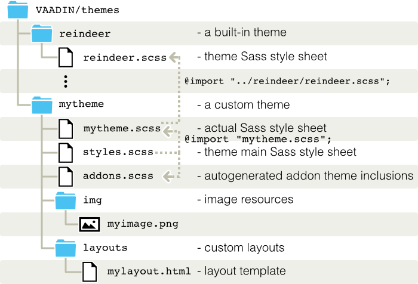
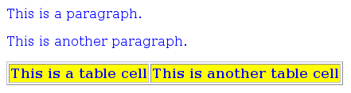
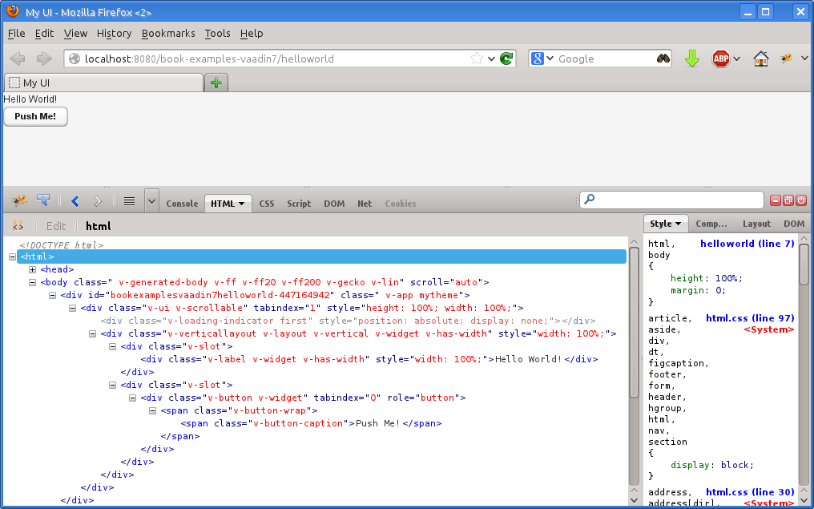
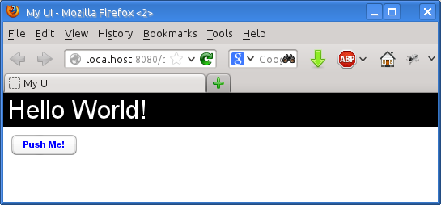
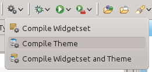
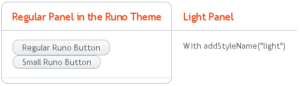
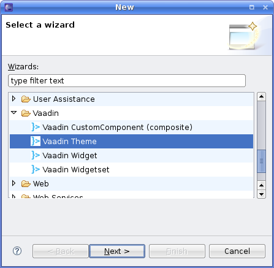
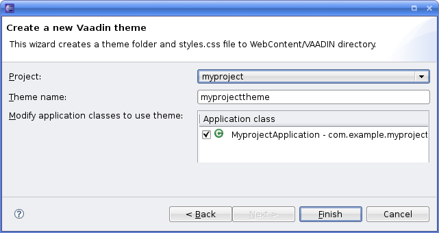
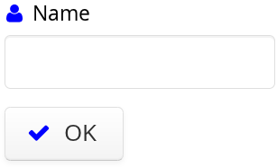
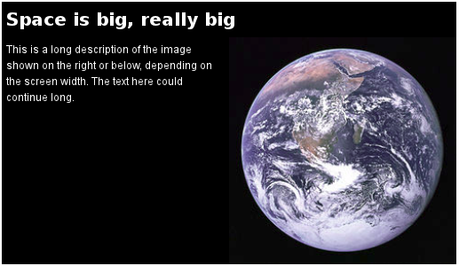

theme
CSS
This chapter provides details about using and creating *themes* that
control the visual look of web applications. Themes are created using
Sass, which is an extension of CSS (Cascading Style Sheets), or with
plain CSS. We provide an introduction to CSS, especially concerning the
styling of HTML by element classes.

Overview {#themes.overview}
========

Vaadin separates the appearance of the user interface from its logic
using *themes*. Themes can include Sass or CSS style sheets, custom HTML
layouts, and any necessary graphics. Theme resources can also be
accessed from application code as `ThemeResource` objects.

Custom themes are placed under the `VAADIN/themes/` folder of the web
application (under `WebContent` in Eclipse or `src/main/webapp` in Maven
projects). This location is fixed -- the `VAADIN` folder contains static
resources that are served by the Vaadin servlet. The servlet augments
the files stored in the folder by resources found from corresponding
`VAADIN` folders contained in JARs in the class path. For example, the
built-in themes are stored in the `vaadin-themes.jar`.

? illustrates the contents of a theme.

The name of a theme folder defines the name of the theme. The name is
used in the `@Theme` annotation that sets the theme. A theme must
contain either a `styles.scss` for Sass themes, or `styles.css`
stylesheet for plain CSS themes, but other contents have free naming. We
recommend that you have the actual theme content in a SCSS file named
after the theme, such as `mytheme.scss`, to make the names more unique.

We also suggest a convention for naming the folders as `img` for images,
`layouts` for custom layouts, and `css` for additional stylesheets.

Custom themes need to extend a base theme, as described in ?. Copying
and modifying an existing theme is also possible, but it is not
recommended, as it may need more work to maintain if the modifications
are small.

You use a theme by specifying it with the `@Theme` annotation for the UI
class of the application as follows:

    @Theme("mytheme")
    public class MyUI extends UI {
        @Override
        protected void init(VaadinRequest request) {
            ...
        }
    }

A theme can contain alternate styles for user interface components,
which can be changed as needed.

In addition to style sheets, a theme can contain HTML templates for
custom layouts used with `CustomLayout`. See ? for details.

Resources provided in a theme can also be accessed using the
`ThemeResource` class, as described in ?. This allows displaying theme
resources in component icons, in the `Image` component, and other such
uses.

Introduction to Cascading Style Sheets {#themes.css}
======================================

CSS
introduction
Cascading Style Sheets or CSS is the basic technique to separate the
appearance of a web page from the content represented in HTML. In this
section, we give an introduction to CSS and look how they are relevant
to software development with Vaadin.

As we can only give a short intruction in this book, we encourage you to
refer to the rich literature on CSS and the many resources available in
the web. You can find the authoratitative specifications of CSS
standards from the [W3C website](#)and other literature, references, and
tutorials from the [Open Directory Project page on CSS](#), as well as
from other sources.

Applying CSS to HTML {#themes.css.basics}
--------------------

Let us consider the following HTML document that contains various markup
elements for formatting text. Vaadin UIs work in essentially similar
documents, even though they use somewhat different elements to draw the
user interface.

    <html>
        <head>
            <title>My Page</title>
            <link rel="stylesheet" type="text/css"
                  href="mystylesheet.css"/>
        </head>
        <body>
            
This is a paragraph

            
This is another paragraph

            <table>
                <tr>
                    <td>This is a table cell</td>
                    <td>This is another table cell</td>
                </tr>
            </table>
        </body>
    </html>

The HTML elements that will be styled later by matching CSS rules are
emphasized above.

The `<link>` element in the HTML header defines the used CSS stylesheet.
The definition is automatically generated by Vaadin in the HTML page
that loads the UI of the application. A stylesheet can also be embedded
in the HTML document itself, as is done when optimizing their loading in
Vaadin TouchKit, for example.

Basic CSS Rules {#themes.css.basics}
---------------

A stylesheet contains a set of *rules* that can match the HTML elements
in the page. Each rule consists of one or more *selectors*, separated
with commas, and a *declaration block* enclosed in curly braces. A
declaration block contains a list of *property* statements. Each
property has a label and a value, separated with a colon. A property
statement ends with a semicolon.

Let us look at an example that matches certain elements in the simple
HTML document given in the previous section:

    p, td { 
      color: blue;
    }

    td { 
      background: yellow;
      font-weight: bold;
    }

The `p` and `td` are element type selectors that match with `
` and
`<td>` elements in HTML, respectively. The first rule matches with both
elements, while the second matches only with `<td>` elements. Let us
assume that you have saved the above style sheet with the name
`mystylesheet.css` and consider the following HTML file located in the
same folder.

### Style Inheritance in CSS {#themes.css.basics.inheritance}

CSS has *inheritance* where contained elements inherit the properties of
their parent elements. For example, let us change the above example and
define it instead as follows:

    table {
        color: blue;
        background: yellow;
    }

All elements contained in the `<table>` element would have the same
properties. For example, the text in the contained `<td>` elements would
be in blue color.

### HTML Element Types {#themes.css.basics.element-types}

HTML has a number of element types, each of which accepts a specific set
of properties. The `
` elements are generic elements that can be
used to create almost any layout and formatting that can be created with
a specific HTML element type. Vaadin uses `
` elements extensively
to draw the UI, especially in layout components.

Google Web Toolkitthemeing Matching elements by their type as shown
above is, however, rarely if ever used in style sheets for Vaadin
applications. We used it above, because it is the normal way in regular
HTML documents that use the various HTML elements for formatting text,
but it is not applicable in Vaadin UIs that consist mostly of `
`
elements. Instead, you need to match by element class, as described
next.

Matching by Element Class {#themes.css.matching-by-class}
-------------------------

Matching HTML elements by the *class* attribute is the most common form
of matching in Vaadin stylesheets. It is also possible to match with the
*identifier* of a unique HTML element.

The class of an HTML element is defined with the `class` attribute as
follows:

    <html>
      <body>
        
This is the first paragraph

        
This is the second paragraph

        <table>
          <tr>
            <td class="normal">This is a table cell</td>
            <td class="another">This is another table cell</td>
          </tr>
        </table>
      </body>
    </html>

The class attributes of HTML elements can be matched in CSS rules with a
selector notation where the class name is written after a period
following the element name. This gives us full control of matching
elements by their type and class.

    p.normal   {color: red;}
    p.another  {color: blue;}
    td.normal  {background: pink;}
    td.another {background: yellow;}

The page would look as shown below:

We can also match solely by the class by using the universal selector
`*` for the element name, for example `*.normal`. The universal selector
can also be left out altogether so that we use just the class name
following the period, for example `.normal`.

    .normal {
        color: red;
    }

    .another {
        blackground: yellow;
    }

In this case, the rule will match with all elements of the same class
regardless of the element type. The result is shown in ?. This example
illustrates a technique to make style sheets compatible regardless of
the exact HTML element used in drawing a component.

To ensure future compatibility, we recommend that you use only matching
based on the classes and *do not* match for specific HTML element types
in CSS rules, because Vaadin may change the exact HTML implementation
how components are drawn in the future. For example, Vaadin earlier used
`
` element to draw `Button` components, but later it was changed to
use the special-purpose `<button>` element in HTML. Because of using the
`v-button` style class in the CSS rules for the button, styling it has
changed only very little.

Matching by Descendant Relationship {#themes.css.matching-by-descendants}
-----------------------------------

CSS allows matching HTML by their containment relationship. For example,
consider the following HTML fragment:

    <body>
      
Here is some text inside a
                        paragraph element

      <table class="mytable">
        <tr>
          <td class="mytext">Here is text inside
                          a table and inside a td element.</td>
        </tr>
      </table>
    </body>

Matching by the class name `.mytext` alone would match both the `
`
and `<td>` elements. If we want to match only the table cell, we could
use the following selector:

    .mytable .mytext {color: blue;}

To match, a class listed in a rule does not have to be an immediate
descendant of the previous class, but just a descendant. For example,
the selector "`.v-panel .v-button`" would match all elements with class
`.v-button` somewhere inside an element with class `.v-panel`.

Importance of Cascading {#themes.css.cascading}
-----------------------

CSS or Cascading Stylesheets are, as the name implies, about *cascading*
stylesheets, which means applying the stylesheet rules according to
their origin, importance, scope, specifity, and order.

For exact rules for cascading in CSS, see the section [Cascading](#) in
the CSS specification.

### Importance {#themes.css.cascading.importance}

Declarations in CSS rules can be made override declarations with
otherwise higher priority by annotating them as `!important`. For
example, an inline style setting made in the `style` attribute of an
HTML element has a higher specificity than any rule in a CSS stylesheet.

    
...

You can override the higher specificity with the `!important` annotation
as follows:

    .v-button {height: 30px !important;}

### Specificity {#themes.css.cascading.specificity}

A rule that specifies an element with selectors more closely overrides
ones that specify it less specifically. With respect to the element
class selectors most commonly used in Vaadin themes, the specificity is
determined by the number of class selectors in the selector.

    .v-button {}
    .v-verticallayout .v-button {}
    .v-app .v-verticallayout .v-button {}

In the above example, the last rule would have the highest specificity
and would match.

As noted earlier, style declarations given in the style attribute of a
HTML element have higher specificity than declarations in a CSS rule,
except if the `!important` annotation is given.

See the CSS3 [selectors module specification](#) for details regarding
how the specificity is computed.

### Order {#themes.css.cascading.order}

CSS rules given later have higher priority than ones given earlier. For
example, in the following, the latter rule overrides the former and the
color will be black:

    .v-button {color: white}
    .v-button {color: black}

As specificity has a higher cascading priority than order, you could
make the first rule have higher priority by adding specificity as
follows:

    .v-app .v-button {color: white}
    .v-button {color: black}

The order is important to notice in certain cases, because Vaadin does
not guarantee the order in which CSS stylesheets are loaded in the
browser, which can in fact be random and result in very unexpected
behavior. This is not relevant for Sass stylesheets, which are compiled
to a single stylesheet. For plain CSS stylesheets, such as add-on or
TouchKit stylesheets, the order can be relevant.

Style Class Hierarchy of a Vaadin UI {#themes.css.hierarchy}
------------------------------------

Let us give a real case in a Vaadin UI by considering a simple Vaadin UI
with a label and a button inside a vertical layout:

    // UI has v-ui style class
    @Theme("mytheme")
    public class HelloWorld extends UI {
        @Override
        protected void init(VaadinRequest request) {
            // VerticalLayout has v-verticallayout style
            VerticalLayout content = new VerticalLayout();
            setContent(content);

            // Label has v-label style
            content.addComponent(new Label("Hello World!"));
            
            // Button has v-button style
            content.addComponent(new Button("Push Me!",
                new Button.ClickListener() {
                @Override
                public void buttonClick(ClickEvent event) {
                    Notification.show("Pushed!");
                }
            }));
        }
    }

The UI will look by default as shown in ?. By using a HTML inspector
such as Firebug, you can view the HTML tree and the element classes and
applied styles for each element.

Now, let us look at the HTML element class structure of the UI, as we
can see it in the HTML inspector:

    <body class="v-generated-body v-ff v-ff20 v-ff200 v-gecko v-lin"
          scroll="auto">
      

        

          

          

            

              
Hello World!

            

            

              

                
                  Push Me!
                
              

            

          

        

      

      ...
    <body>

Now, consider the following theme where we set the colors and margins of
various elements. The theme is actually a Sass theme.

    @import "../reindeer/reindeer.scss";

    @mixin mytheme {
      @include reindeer;

      /* White background for the entire UI */
      .v-ui {
        background: white;
      }
      
      /* All labels have white text on black background */
      .v-label {
        background: black;
        color: white;
        font-size: 24pt;
        line-height: 24pt;
        padding: 5px;
      }

      /* All buttons have blue caption and some margin */
      .v-button {
        margin: 10px;

        /* A nested selector to increase specificity */
        .v-button-caption {
          color: blue;
        }
      }
    }

The look has changed as shown in ?.

An element can have multiple classes separated with a space. With
multiple classes, a CSS rule matches an element if any of the classes
match. This feature is used in many Vaadin components to allow matching
based on the state of the component. For example, when the mouse is over
a `Link` component, `over` class is added to the component. Most of such
styling is a feature of Google Web Toolkit.

Notes on Compatibility {#themes.css.compatibility}
----------------------

CSS
compatibility
compatibility
CSS is a standard continuously under development. It was first proposed
in 1994. The specification of CSS is maintained by the CSS Working Group
of World Wide Web Consortium (W3C). Versioned with backward-compatible
"levels", CSS Level 1 was published in 1996, Level 2 in 1998, and the
ongoing development of CSS Level 3 started in 1998. CSS3 is divided into
a number of separate modules, each developed and progressing separately,
and many of the modules are already Level 4.

While the support for CSS has been universal in all graphical web
browsers since at least 1995, the support has been very incomplete at
times and there still exists an unfortunate number of incompatibilities
between browsers. While we have tried to take these incompatibilities
into account in the built-in themes in Vaadin, you need to consider them
while developing your own themes. Compatibility issues are detailed in
various CSS handbooks.

Syntactically Awesome Stylesheets (Sass) {#themes.sass}
========================================

Vaadin uses Sass for stylesheets. Sass is an extension of CSS3 that adds
nested rules, variables, mixins, selector inheritance, and other
features to CSS. Sass supports two formats for stylesheet: Vaadin themes
are written in SCSS (`.scss`), which is a superset of CSS3, but Sass
also allows a more concise indented format (`.sass`).

Sass can be used in two basic ways in Vaadin applications, either by
compiling SCSS files to CSS or by doing the compilation on the fly. The
latter way is possible if the development mode is enabled for the Vaadin
servlet, as described in ?.

Sass Overview {#themes.sass.overview}
-------------

### Variables {#themes.sass.overview.variables}

Sass allows defining variables that can be used in the rules.

    $textcolor: blue;

    .v-button-caption {
      color: $textcolor;
    }

The above rule would be compiled to CSS as:

    .v-button-caption {
      color: blue;
    }

Also mixins can have variables as parameters, as explained later.

### Nesting {#themes.sass.overview.nesting}

Sass supports nested rules, which are compiled into inside-selectors.
For example:

    .v-app {
      background: yellow;
      
      .mybutton {
        font-style: italic;
        
        .v-button-caption {
          color: blue;
        }
      }
    }

is compiled as:

    .v-app {
      background: yellow;
    }

    .v-app .mybutton {
        font-style: italic;
    }

    .v-app .mybutton .v-button-caption {
      color: blue;
    }

### Mixins {#themes.sass.overview.mixins}

Mixins are rules that can be included in other rules. You define a mixin
rule by prefixing it with the `@mixin` keyword and the name of the
mixin. You can then use `@include` to apply it to another rule. You can
also pass parameters to it, which are handled as local variables in the
mixin.

For example:

    @mixin mymixin {
      background: yellow;
    }

    @mixin othermixin($param) {
      margin: $param;
    }

    .v-button-caption {
      @include mymixin;
      @include othermixin(10px);
    }

The above SCSS would translated to the following CSS:

    .v-button-caption {
      background: yellow;
      margin: 10px;
    }

You can also have nested rules in a mixin, which makes them especially
powerful. Mixing in rules is used when extending Vaadin themes, as
described in ?.

Vaadin themes are defined as mixins to allow for certain uses, such as
different themes for different portlets in a portal.

Sass Basics with Vaadin {#themes.sass.basic}
-----------------------

We are not going to give in-depth documentation of Sass and refer you to
its excellent documentation at [http://sass-lang.com/](#). In the
following, we give just basic introduction to using it with Vaadin.

You can create a new Sass-based theme with the Eclipse plugin, as
described in ?.

Compiling Sass Themes {#themes.compiling}
=====================

Sass themes must be compiled to CSS understood by browsers. Compilation
can be done with the Vaadin Sass Compiler, which you can run in Eclipse,
Maven, or it can be run on-the-fly when the application is loaded in the
browser. You can also use any other Sass compiler.

Compiling On the Fly {#themes.compiling.on-the-fly}
--------------------

The easiest way to use Sass themes during theme development is to let
the Vaadin servlet compile them on the run. In this case, the SCSS
source files are placed in the theme folder. Compilation is done each
time the `styles.css` is requested from the server.

The on-the-fly compilation takes a bit time, so it is only available
when the Vaadin servlet is in the development mode, as described in ?.
Also, it requires the theme compiler and all its dependencies to be in
the class path of the servlet. At least for production, you must compile
the theme to CSS, as described next.

Compiling in Eclipse {#themes.compiling.eclipse}
--------------------

If using Eclipse and the Vaadin Plugin for Eclipse, its project wizard
creates a Sass theme. It includes Compile
Theme command in the toolbar to compile the project theme to CSS.
Another command compiles also the widget set.

The `WebContent/VAADIN/mytheme/styles.scss` and any Sass sources
included by it are compiled to `styles.css`.

Compiling with Maven {#themes.compiling.maven}
--------------------

To compile the themes with Maven, you need to include the built-in
themes as a dependency:

      ...
      <dependencies>
        ...
        <dependency>
            <groupId>com.vaadin</groupId>
            <artifactId>vaadin-themes</artifactId>
            <version>${vaadin.version}</version>
        </dependency>
      </dependencies>
      ...

This is automatically included at least in the
`vaadin-archetype-application` archetype for Vaadin applications. The
actual theme compilation is most conveniently done by the Vaadin Maven
Plugin with `update-theme` and `compile-theme` goals.

      ...
      <plugin>
        <groupId>com.vaadin</groupId>
        <artifactId>vaadin-maven-plugin</artifactId>
        ...
        <executions>
          <execution>
            ...
            <goals>
              <goal>clean</goal>
              <goal>resources</goal>
              <goal>update-theme</goal>
              <goal>update-widgetset</goal>
              <goal>compile-theme</goal>
              <goal>compile</goal>
            </goals>
          </execution>
        </executions>

Once these are in place, the theme is compiled as part of relevant
lifecycle phases, such as `package`.

    mvn package

You can also compile just the theme with the compile-theme goal:

    mvn vaadin:compile-theme

Compiling in Command-line {#themes.compiling.command-line}
-------------------------

You can compile Sass style sheets to CSS either with the Vaadin Sass
compiler or the standard one. The `styles.css` of a custom theme should
be the compilation target. When compiled before deployment, the source
files do not need to be in the theme folder.

You can run the Vaadin Sass compiler in a theme folder as follows:

    java -cp '../../../WEB-INF/lib/*' com.vaadin.sass.SassCompiler styles.scss styles.css

The `-cp` parameter should point to the class path where the Vaadin Sass
Compiler and theme JARs are located. In the above example, they are
assumed to be located in the `WEB-INF/lib` folder of the web
application. If you have loaded the Vaadin libraries using Ivy, as is
the case with projects created with the Vaadin Plugin for Eclipse, the
Vaadin libraries are stored in Ivy's local repository. Its folder
hierarchy is somewhat scattered, so we recommend that you retrieve the
libraries to a single folder. We recommend using an Ant script as is
described next.

Compiling with Ant {#themes.compiling.ant}
------------------

With Apache Ant, you can easily resolve the dependencies with Ivy and
compile the theme with the Theme Compiler included in Vaadin as follows.
This build step can be conveniently included in a WAR build script.

Start with the following configuration:

    <project xmlns:ivy="antlib:org.apache.ivy.ant"
             name="My Project" basedir="../"
             default="package-war">

      <target name="configure">
        <!-- Where project source files are located -->
        <property name="src-location" value="src" />

        ... other project build definitions ...
                
        <!-- Name of the theme -->
        <property name="theme" value="book-examples"/>
            
        <!-- Compilation result directory -->
        <property name="result" value="build/result"/>
      </target>

      <!-- Initialize build -->
      <target name="init" depends="configure">
        <!-- Construct and check classpath -->
        <path id="compile.classpath">
            <!-- Source code to be compiled -->
            <pathelement path="${src-location}" />
                
            <!-- Vaadin libraries and dependencies -->
            <fileset dir="${result}/lib">
                <include name="*.jar"/>
            </fileset>
        </path>

        <mkdir dir="${result}"/>
      </target>

You should first resolve all Vaadin libraries to a single directory,
which you can use for deployment, but also for theme compilation.

      <target name="resolve" depends="init">
        <ivy:retrieve
            pattern="${result}/lib/[module]-[type]-[artifact]-[revision].[ext]"/>
      </target>

Then, you can compile the theme as follows:

      <!-- Compile theme -->
      <target name="compile-theme"
              depends="init, resolve">
        <delete dir="${result}/VAADIN/themes/${theme}"/>
        <mkdir dir="${result}/VAADIN/themes/${theme}"/>
            
        <java classname="com.vaadin.sass.SassCompiler"
              fork="true">
          <classpath>
            <path refid="compile.classpath"/>
          </classpath>
          <arg value="WebContent/VAADIN/themes/${theme}/styles.scss"/>
          <arg value="${result}/VAADIN/themes/${theme}/styles.css"/>
        </java>

            <!-- Copy theme resources -->
        <copy todir="${result}/VAADIN/themes/${theme}">
          <fileset dir="WebContent/VAADIN/themes/${theme}">
            <exclude name="**/*.scss"/>
          </fileset>
        </copy>
      </target>
    </project>

Creating and Using Themes {#themes.creating}
=========================

Custom themes are placed in the `VAADIN/themes` folder of the web
application, in an Eclipse project under the `WebContent` folder or
`src/main/webapp` in Maven projects, as was illustrated in ?. This
location is fixed. You need to have a theme folder for each theme you
use in your application, although applications rarely need more than a
single theme.

Sass Themes {#themes.creating.sass}
-----------

You can use Sass themes in Vaadin in two ways, either by compiling them
to CSS by yourself or by letting the Vaadin servlet compile them for you
on-the-fly when the theme CSS is requested by the browser, as described
in ?.

To define a Sass theme with the name `mytheme`, you must place a file
with name `styles.scss` in the theme folder `VAADIN/themes/mytheme`. If
no `styles.css` exists in the folder, the Sass file is compiled
on-the-fly when the theme is requested by a browser.

We recommend that you organize the theme in at least two SCSS files so
that you import the actual theme from a Sass file that is named more
uniquely than the `styles.scss`, to make it distinquishable in the
editor. This organization is how the Vaadin Plugin for Eclipse creates a
new theme.

If you use Vaadin add-ons that contain themes, Vaadin Plugin for Eclipse
and Maven automatically add them to the `addons.scss` file.

### Theme SCSS {#themes.creating.sass.scss}

We recommend that the rules in a theme should be prefixed with a
selector for the theme name. You can do the prefixing in Sass by
enclosing the rules in a nested rule with a selector for the theme name.

Themes are defined as Sass mixins, so after you import the mixin
definitions, you can `@include` them in the theme rule as follows:

    @import "addons.scss";
    @import "mytheme.scss";

    .mytheme {
      @include addons;
      @include mytheme;
    }

However, this is mainly necessary if you use the UI in portlets, each of
which can have its own theme, or in the special circumstance that the
theme has rules that use empty parent selector `&` to refer to the theme
name.

Otherwise, you can safely leave the nested theme selector out as
follows:

    @import "addons.scss";
    @import "mytheme.scss";

    @include addons;
    @include mytheme;

The actual theme should be defined as follows, as a mixin that includes
the base theme.

    @import "../reindeer/reindeer.scss";

    @mixin mytheme {
      @include reindeer;

      /* An actual theme rule */
      .v-button {
        color: blue;
      }
    }

### Add-on Themes {#themes.creating.sass.addons}

Some Vaadin add-ons include Sass styles that need to be compiled into
the theme. These are managed in the `addons.scss` file in a theme,
included from the `styles.scss`. The `addons.scss` file is automatically
generated by the Vaadin Plugin for Eclipse or Maven.

    /* This file is automatically managed and will be
       overwritten from time to time. */
    /* Do not manually edit this file. */

    /* Provided by vaadin-spreadsheet-1.0.0.beta1.jar */
    @import "../../../VAADIN/addons/spreadsheet/spreadsheet.scss";

    /* Import and include this mixin into your project
       theme to include the addon themes */
    @mixin addons {
      @include spreadsheet;
    }

Plain Old CSS Themes {#themes.creating.css}
--------------------

In addition to Sass themes, you can create plain old CSS themes. CSS
theme are more restricted than Sass styles - an application can only
have one CSS theme while you can have multiple Sass themes.

A CSS theme is defined in a `styles.css` file in the
`VAADIN/themes/mytheme` folder. You need to import the
`legacy-styles.css` of the built-in theme as follows:

    @import "../reindeer/legacy-styles.css";

    .v-app {
        background: yellow;
    }

Styling Standard Components {#themes.creating.standard-components}
---------------------------

Each user interface component in Vaadin has a CSS style class that you
can use to control the appearance of the component. Many components have
additional sub-elements that also allow styling. You can add
context-specific stylenames with addStyleName(). Notice that
getStyleName() returns only the custom stylenames, not the built-in
stylenames for the component.

Please see the section on each component for a description of its
styles. Most of the stylenames are determined in the client-side widget
of each component. The easiest way to find out the styles of the
elements is to use a HTML inspector such as FireBug.

Some client-side components or component styles can be shared by
different server-side components. For example, `v-textfield` style is
used for all text input boxes in components, in addition to `TextField`.

Built-in Themes {#themes.creating.builtin}
---------------

Vaadin currently includes the following built-in themes:

-   valo
    , the primary theme since Vaadin 7.3
-   reindeer
    , the primary theme in Vaadin 6 and 7
-   chameleon
    , an easily customizable theme
-   runo
    , the default theme in IT Mill Toolkit 5
-   liferay
    , for Liferay portlets

In addition, there is the `base` theme, which should not be used
directly, but is extended by the other built-in themes, except valo.

The built-in themes are provided in the respective
`VAADIN/themes/<theme>/styles.scss` stylesheets in the `vaadin-themes`
JAR. Also the precompiled CSS files are included, in case you want to
use the themes directly.

Various constants related to the built-in themes are defined in the
theme classes in com.vaadin.ui.themes package. These are mostly special
style names for specific components.

    @Theme("runo")
    public class MyUI extends UI {
        @Override
        protected void init(VaadinRequest request) {
            ...      
            Panel panel = new Panel("Regular Panel in the Runo Theme");
            panel.addComponent(new Button("Regular Runo Button"));
            
            // A button with the "small" style
            Button smallButton = new Button("Small Runo Button");
            smallButton.addStyleName(Runo.BUTTON_SMALL);

            Panel lightPanel = new Panel("Light Panel");
            lightPanel.addStyleName(Runo.PANEL_LIGHT);
            lightPanel.addComponent(
                new Label("With addStyleName(\"light\")"));
            ...

The example with the Runo theme is shown in ?.

The built-in themes come with a custom icon font, FontAwesome, which is
used for icons in the theme, and which you can use as font icons, as
described in ?.

> **Note**
>
> The built-in themes included in the Vaadin library JAR are served
> dynamically from the JAR by the servlet. Serving themes and widget
> sets statically by the web server is more efficient. To do so, you
> need to extract the `VAADIN/` directories from the JAR to the web
> content directory (`WebContent` in Eclipse or `src/main/webapp` in
> Maven projects).
>
>     $ cd WebContent
>
>     $ unzip path-to/vaadin-server-VERSION.VAADIN.jar 'VAADIN/*'
>
>     $ unzip path-to/vaadin-themes-VERSION.VAADIN.jar 'VAADIN/*'
>
>     $ unzip path-to/vaadin-client-compiled-VERSION.VAADIN.jar 'VAADIN/*'
>
> You can also serve static content from a front-end caching server,
> which reduces the load of the application server. In portals, you
> install the themes globally in the portal as described in ?.
>
> Just make sure to update the static content when you upgrade to a
> newer version of Vaadin.

Creation of a default theme for custom GWT widgets is described in ?.

Add-on Themes {#themes.creating.addon}
-------------

You can find more themes as add-ons from the [Vaadin Directory](#). In
addition, many component add-ons contain a theme for the components they
provide.

The add-on themes need to be included in the project theme. Vaadin
Plugin for Eclipse and Maven automatically include them in the
`addons.scss` file in the project theme folder. It should be included by
the project theme.

Creating a Theme in Eclipse {#themes.eclipse}
===========================

The Eclipse plugin automatically creates a theme stub for new Vaadin
projects. It also includes a wizard for creating new custom themes. Do
the following steps to create a new theme.

1.  Select File \> New \> Other... in
    the main menu or right-click the Project Explorer and select New \> Other.... A window will open.

2.  In the Select a wizard step, select the Vaadin \> Vaadin Theme wizard.

    

    Click Next to proceed to the next step.

3.  In the Create a new Vaadin theme step, you have the following
    settings:

    Project (mandatory)

    :   The project in which the theme should be created.

    Theme name (mandatory)

    :   The theme name is used as the name of the theme folder and in a
        CSS tag (prefixed with "`v-theme-`"), so it must be a proper
        identifier. Only latin alphanumerics, underscore, and minus sign
        are allowed.

    Modify application classes to use theme (optional)

    :   The setting allows the wizard to write a code statement that
        enables the theme in the constructor of the selected application
        (UI) class(es). If you need to control the theme with dynamic
        logic, you can leave the setting unchecked or change the
        generated line later.

    

    Click Finish to create the theme.

The wizard creates the theme folder under the `WebContent/VAADIN/themes`
folder and the actual style sheet as `mytheme.scss` and `styles.scss`
files, as illustrated in ?.

The created theme extends a built-in base theme with an `@import`
statement. See the explanation of theme inheritance in ?. Notice that
the `reindeer` theme is not located in the `widgetsets` folder, but in
the Vaadin JAR. See ? for information for serving the built-in themes.

If you selected a UI class or classes in the Modify application classes
to use theme in the theme wizard, the wizard will add the `@Theme`
annotation to the UI class.

If you later rename the theme in Eclipse, notice that changing the name
of the folder will not automatically change the `@Theme` annotation. You
need to change such references to theme names in the calls manually.

Valo Theme {#themes.valo}
==========

Valo is the word for light in Finnish. The Valo theme incorporates the
use of light in its logic, in how it handles shades and highlights. It
creates lines, borders, highlights, and shadows adaptively according to
a background color, always with contrasts pleasant to human visual
perception. Auxiliary colors are computed using an algorithmic color
theory to blend gently with the background. The static art is
complemented with responsive animations.

The true power of Valo lies in its configurability with parameters,
functions, and Sass mixins. You can use the built-in definitions in your
own themes or override the defaults. Detailed documentation of the
available mixins, functions, and variables can be found in the Valo API
documentation available at [http://vaadin.com/valo](#).

Basic Use {#themes.valo.use}
---------

Valo is used just like other themes. Its optional parameters must be
given before the `@import` statement.

    // Modify the base color of the theme
    $v-background-color: hsl(200, 50%, 50%);

    // Import valo after setting the parameters
    @import "../valo/valo";

    .mythemename {
      @include valo;

      // Your theme's rules go here
    }

If you need to override mixins or function definitions in the valo
theme, you must do that after the import statement, but before including
the valo mixin. Also, with some configuration parameters, you can use
variables defined in the theme. In this case, they need to be overridden
after the import statement.

Common Settings {#themes.valo.variables}
---------------

In the following, we describe the optional parameters that control the
visual appearance of the Valo theme. In addition to the ones given here,
component styles have their own parameters, listed in the sections
describing the components in the other chapters.

### General Settings {#themes.valo.variables.general}

`$v-background-color` (default: `hsl(210, 0%, 98%)`)

:   The background color is the main control parameter for the Valo
    theme and it is used for computing all other colors in the theme. If
    the color is dark (has low luminance), light foreground colors that
    give high contrast with the background are automatically used.

    You can specify the color in any way allowed in CSS: hexadecimal RGB
    color code, RGB/A value specified with rgb() or rgba(), HSL/A value
    specified with hsl() or hsla(). You can also use color names, but it
    should be avoided, as not all CSS color names are currently
    supported.

`$v-app-background-color` (default: `$v-background-color`)

:   Background color of the UI's root element. You can specify the color
    in any way allowed in CSS.

`$v-app-loading-text` (default: `""`)

:   A static text that is shown under the loading spinned while the
    client-side engine is being loaded and started. The text must be
    given in quotes. The text can not be localized currently.

        $v-app-loading-text: "Loading Resources...";

`$v-line-height` (default: `1.55`)

:   Base line height for all widgets. It must be given a unitless
    number.

        $v-line-height: 1.6;

### Font Settings {#themes.valo.variables.fonts}

`$v-font-size` (default: `16px`)

:   Base font size. It should be specified in pixels.

        $v-font-size: 18px;

`$v-font-weight` (default: `300`)

:   Font weight for normal fonts. The size should be given as a numeric
    value, not symbolic.

        $v-font-weight: 400;

`$v-font-color` (default: computed)

:   Foreground text color, specified as any CSS color value. The default
    is computed from the background color so that it gives a high
    contrast with the background.

`$v-font-family` (default: `"Open Sans", sans-serif`)

:   Font family and fallback fonts as a comma-separated list. Font names
    containing spaces must be quoted. The default font Open Sans is a
    web font included in the Valo theme. Other used Valo fonts must be
    specified in the list to enable them. See ?.

        $v-font-family: "Source Sans Pro", sans-serif;

`$v-caption-font-size` (default: `round($v-font-size * 0.9)`)

:   Font size for component captions. The value should be a pixel value.

`$v-caption-font-weight` (default: `max(400, $v-font-weight)`)

:   Font weight for captions. It should be defined with a numeric value
    instead of symbolic.

### Layout Settings {#themes.valo.variables.layout}

`$v-unit-size` (default: `round(2.3 * $v-font-size)`)

:   This is the base size for various layout measures. It is directly
    used in some measures, such as button height and layout margins,
    while other measures are derived from it. The value must be
    specified in pixels, with a suitable range of 18-50.

        $v-unit-size: 40px;

`$v-layout-margin-top`; `$v-layout-margin-right`; `$v-layout-margin-bottom`; `$v-layout-margin-left` (default: `$v-unit-size`)

:   Layout margin sizes for all built-in layout components, when the
    margin is enabled with setMargin(), as described in ?.

`$v-layout-spacing-vertical` and `$v-layout-spacing-horizontal` (default: `round($v-unit-size/3)`)

:   Amount of vertical or horizontal space when spacing is enabled for a
    layout with setSpacing(), as described in ?.

### Component Features {#themes.valo.variables.component}

The following settings apply to various graphical features of some
components.

`$v-border` (default: `1px solid (v-shade 0.7)`)

:   Border specification for the components that have a border. The
    thickness measure must be specified in pixels. For the border color,
    you can specify any CSS color or one of the `v-tint`, `v-shade`, and
    `v-tone` keywords described later in this section.

`$v-border-radius` (default: `4px`)

:   Corner radius for components that have a border. The measure must be
    specified in pixels.

        $v-border-radius: 8px;

`$v-gradient` (default: `v-linear 8%`)

:   Color gradient style for components that have a gradient. The
    gradient style may use the following keywords: `v-linear` and
    `v-linear-reverse`. The opacity must be given as percentage between
    0% and 100%.

        $v-gradient: v-linear 20%;

`$v-bevel` (default: `inset 0 1px 0 v-tint, inset 0 -1px 0 v-shade`)

:   Inset shadow style to define how some components are "raised" from
    the background. The value follows the syntax of CSS box-shadow, and
    should be a list of insets. For the bevel color, you can specify any
    CSS color or one of the `v-tint`, `v-shade`, and `v-tone` keywords
    described later in this section.

`$v-bevel-depth` (default: `30%`)

:   Specifies the "depth" of the bevel shadow, as applied to one of the
    color keywords for the bevel style. The actual amount of tint,
    shade, or tone is computed from the depth.

`$v-shadow` (default: `0 2px 3px v-shade`)

:   Default shadow style for all components. As with `$v-bevel`, the
    value follows the syntax of CSS box-shadow, but without the `inset`.
    For the shadow color, you can specify any CSS color or one of the
    `v-tint` or `v-shade` keywords described later in this section.

`$v-shadow-opacity` (default: `5%`)

:   Specifies the opacity of the shadow, as applied to one of the color
    keywords for the shadow style. The actual amount of tint or shade is
    computed from the depth.

`$v-focus-style` (default: `0 0 0 2px rgba($v-focus-color, .5)`)

:   Box-shadow specification for the field focus indicator. The
    space-separated values are the horizontal shadow position in pixels,
    vertical shadow position in pixels, blur distance in pixels, spread
    distance in pixels, and the color. The color can be any CSS color.
    You can only specify the color, in which case defaults for the
    position are used. rgba() or hsla() can be used to enable
    transparency.

    For example, the following creates a 2 pixels wide orange outline
    around the field:

        $v-focus-style: 0 0 0 2px orange;

`$v-focus-color` (default: `valo-focus-color()`)

:   Color for the field focus indicator. The valo-focus-color() function
    computes a high-contrast color from the context, which is usually
    the background color. The color can be any CSS color.

`$v-animations-enabled` (default: `true`)

:   Specifies whether various CSS animations are used.

`$v-hover-styles-enabled` (default: `true`)

:   Specifies whether various `:hover` styles are used for indicating
    that mouse pointer hovers over an element.

`$v-disabled-opacity` (default: `0.5`)

:   Opacity of disabled components, as described in ?.

`$v-selection-color` (default: `$v-focus-color`)

:   Color for indicating selection in selection components.

`$v-default-field-width` (default: `$v-unit-size * 5`)

:   Default width of certain field components, unless overridden with
    setWidth().

`$v-error-indicator-color` (default: `#ed473b`)

:   Color of the component error indicator, as described in ?.

`$v-required-field-indicator-color` (default: `$v-error-indicator-color`)

:   Color of the required indicator in field components, as described in
    ?.

Color specifications for `$v-border`, `$v-bevel`, and `$v-shadow` may
use, in addition to CSS colors, the following keywords:

`v-tint`

:   Lighter than the background color.

`v-shade`

:   Darker than the background color.

`v-tone`

:   Adaptive color specification: darker on light background and lighter
    on dark background. Not usable in `$v-shadow`.

For example:

    $v-border: 1px solid v-shade;

You can fine-tune the contrast by giving a weight parameter in
parentheses:

    $v-border: 1px solid (v-tint 2);

    $v-border: 1px solid (v-tone 0.5);

### Theme Compilation and Optimization {#themes.valo.variables.optimization}

`$v-relative-paths` (default: `true`)

:   This flags specifies whether relative URL paths are relative to the
    currently parsed SCSS file or to the compilation root file, so that
    paths are correct for different resources. Vaadin theme compiler
    parses URL paths differently from the regular Sass compiler (Vaadin
    modifies relative URL paths). Use `false` for Ruby compiler and
    `true` for Vaadin Sass compiler.

`$v-included-components` (default: component list)

:   Theme optimization parameter to specify the included component
    themes, as described in ?.

`$v-included-additional-styles` (default: `$v-included-components`)

:   Theme optimization parameter that lists the components for which the
    additional component stylenames should be included. See ? for more
    details.

Valo Mixins and Functions {#themes.valo.mixins}
-------------------------

Valo uses Sass mixins and functions heavily to compute various theme
features, such as colors and shades. Also, all component styles are
mixins. You can use the built-in mixins or override them. For detailed
documentation of the mixins and functions, please refer to the Valo API
documentation available at [http://vaadin.com/valo/api](#).

Valo Fonts {#themes.valo.fonts}
----------

Valo includes the following custom fonts:

-   Open Sans
-   Source Sans Pro
-   Roboto
-   Lato
-   Lora

The used fonts must be specified with the `$v-font-family` parameter for
Valo, in a fallback order. A font family is used in decreasing order of
preference, in case a font with higher preference is not available in
the browser. You can specify any font families and generic families that
browsers may support. In addition to the primary font family, you can
use also others in your application. To enable using the fonts included
in Valo, you need to list them in the variable.

    $v-font-family: 'Open Sans', sans-serif, 'Source Sans Pro';

Above, we specify Open Sans as the preferred primary font, with any
sans-serif font that the browser supports as a fallback. In addition, we
include the Source Sans Pro as an auxiliary font that we can use in
custom rules as follows:

    .v-label pre {
      font-family: 'Source Sans Pro', monospace;
    }

This would specify using the font in any `Label` component with the
`PREFORMATTED` content mode.

Component Styles {#themes.valo.component}
----------------

Many components have component-specific styles to make them smaller,
bigger, and so forth. You can specify the component styles with
addStyleName() using the constants defined in the `ValoTheme` enum.

    table.addStyleName(ValoTheme.TABLE_COMPACT);

For a complete up-to-date list of component-specific styles, please
refer to Vaadin API documentation on the `ValoTheme` enum. Some are also
described in the component-specific styling sections.

### Disabling Component Styles {#themes.valo.component.disabling}

Component styles are optional, but all are enabled by default. They can
be enabled on per-component basis with the
`$v-included-additional-styles` parameter. It defaults to
`$v-included-components` and can be customized in the same way, as
described in ?.

### Configuration Parameters {#themes.valo.component.parameters}

The following variables control some common component styles:

`$v-scaling-factor--tiny` (default: `0.75`)

:   A scaling multiplier for `TINY` component styles.

`$v-scaling-factor--small` (default: `0.85`)

:   A scaling multiplier for `SMALL` component styles.

`$v-scaling-factor--large` (default: `1.2`)

:   A scaling multiplier for `LARGE` component styles.

`$v-scaling-factor--huge` (default: `1.6`)

:   A scaling multiplier for `HUGE` component styles.

Theme Optimization {#themes.valo.optimization}
------------------

Valo theme allows optimizing the size of the compiled theme CSS by
including the rules for only the components actually used in the
application. The included component styles can be specified in the
`$v-included-components` variable, which by default includes all
components. The variable should include a comma-separated list of
component names in lower-case letters. Likewise, you can specify which
additional component styles, as described in ?, should be included using
the `$v-included-additional-styles` parameter and the same format. The
list of additional styles defaults to `$v-included-components`.

For example, if your UI contains just `VerticalLayout`, `TextField`, and
`Button` components, you could define the variable as follows:

    $v-included-components:
        verticallayout,
        textfield,
        button;

You can use the remove() function reversely to remove just some
component themes from the standard selection.

For example, with the following you can remove the theme definitions for
the `Calendar` component:

    $v-included-components: remove($v-included-components, calendar);

Note that in this case, you need to give the statement *after* the
`@import` statement for the Valo theme, because it overrides a variable
by using its value that is defined in the theme.

Font Icons {#themes.fonticon}
==========

Font icons are icons included in a font. Fonts have many advantages over
bitmap images. Browsers are usually faster in rendering fonts than
loading image files. Web fonts are vector graphics, so they are
scalable. As font icons are text characters, you can define their color
in CSS by the regular foreground color property.

Loading Icon Fonts {#themes.fonticon.enabling}
------------------

Vaadin currently comes with one custom icon font: FontAwesome. It is
automatically enabled in the Valo theme. For other themes, you need to
include it with the following line in your project theme, after
importing the base theme:

    @include fonticons;

If you use other icon fonts, as described in ?, and the font is not
loaded by a base theme, you need to load it with a `font` mixin in Sass,
as described in ?.

Basic Use {#themes.fonticon.using}
---------

Font icons are resources of type `FontIcon`, which implements the
Resource interface. You can use these special resources for component
icons and such, but not as embedded images, for example.

Each icon has a Unicode codepoint, by which you can use it. Vaadin
includes an awesome icon font, `FontAwesome`, which comes with an
enumeration of all the icons included in the font.

Most typically, you set a component icon as follows:

    TextField name = new TextField("Name");
    name.setIcon(FontAwesome.USER);
    layout.addComponent(name);

    // Button allows specifying icon resource in constructor
    Button ok = new Button("OK", FontAwesome.CHECK);
    layout.addComponent(ok);

The result is illustrated in ?, with the color styling described next.

### Styling the Icons {#themes.fonticon.using.css}

As font icons are regular text, you can specify their color with the
`color` attribute in CSS to specify the foreground text color. All HTML
elements that display icons in Vaadin have the `v-icon` style name.

    .v-icon {
        color: blue;
    }

If you use the font icon resources in other ways, such as in an `Image`
component, the style name will be different.

Using Font icons in HTML {#themes.fonticon.html}
------------------------

You can use font icons in HTML code, such as in a `Label`, by generating
the HTML to display the icon with the getHtml() method.

    Label label = new Label("I " +
        FontAwesome.HEART.getHtml() + " Vaadin",
        ContentMode.HTML);
    label.addStyleName("redicon");
    layout.addComponent(label);

The HTML code has the `v-icon` style, which you can modify in CSS:

    .redicon .v-icon {
        color: red;
    }

The result is illustrated in ?, with the color styling described next.

You could have set the font color in the label's HTML code as well, or
for all icons in the UI.

You can easily use font icons in HTML code in other ways as well. You
just need to use the correct font family and then use the hex-formatted
Unicode codepoint for the icon. See for example the implementation of
the getHtml() method in `FontAwesome`:

    @Override
    public String getHtml() {
        return "&#x" +
               Integer.toHexString(codepoint) + ";";
    }

Using Font Icons in Other Text {#themes.fonticon.anywhere}
------------------------------

You can include a font icon in any text by its Unicode codepoint, which
you can get with the getCodePoint() method. In such case, however, you
need to use the same font for other text in the same string as well. The
FontAwesome provided in Vaadin includes a basic character set.

    TextField amount = new TextField("Amount (in " +
       new String(Character.toChars(
               FontAwesome.BTC.getCodepoint())) +
       ")");
    amount.addStyleName("awesomecaption");
    layout.addComponent(amount);

You need to set the font family in CSS.

    .v-caption-awesomecaption .v-captiontext {
        font-family: FontAwesome;
    }

Custom Font Icons {#themes.fonticon.custom}
-----------------

You can easily use glyphs in existing fonts as icons, or create your
own.

### Creating New Icon Fonts With IcoMoon {#themes.fonticon.custom.creating}

You are free to use any of the many ways to create icons and embed them
into fonts. Here, we give basic instructions for using the [IcoMoon](#)
service, where you can pick icons from a large library of well-designed
icons.

Font Awesome is included in IcoMoon's selection of icon libraries. Note
that the codepoints of the icons are not fixed, so the `FontAwesome`
enum is not compatible with such custom icon fonts.

After you have selected the icons that you want in your font, you can
download them in a ZIP package. The package contains the icons in
multiple formats, including WOFF, TTF, EOT, and SVG. Not all browsers
support any one of them, so all are needed to support all the common
browsers. Extract the `fonts` folder from the package to under your
theme.

See ? for instructions for loading a custom font.

### Implementing FontIcon {#themes.fonticon.custom.implementing}

You can define a font icon for any font available in the browser by
implementing the FontIcon interface. The normal pattern for implementing
it is to implement an enumeration for all the symbols available in the
font. See the implementation of `FontAwesome` for more details.

You need a FontIcon API for the icons. In the following, we define a
font icon using a normal sans-serif font built-in in the browser.

    // Font icon definition with a single symbol
    public enum MyFontIcon implements FontIcon {
        EURO(0x20AC);
        
        private int codepoint;
        
        MyFontIcon(int codepoint) {
            this.codepoint = codepoint;
        }
        
        @Override
        public String getMIMEType() {
            throw new UnsupportedOperationException(
                FontIcon.class.getSimpleName()
                + " should not be used where a MIME type is needed.");
        }
        
        @Override
        public String getFontFamily() {
            return "sans-serif";
        }
        
        @Override
        public int getCodepoint() {
            return codepoint;
        }
        
        @Override
        public String getHtml() {
            return "&#x" +
                    Integer.toHexString(codepoint) + ";";
        }
    }

Then you can use it as usual:

    TextField name = new TextField("Amount");
    name.setIcon(MyFontIcon.EURO);
    layout.addComponent(name);

You could make the implementation a class as well, instead of an
enumeration, to allow other ways to specify the icons.

Custom Fonts {#themes.fonts}
============

In addition to using the built-in fonts of the browser and the web fonts
included in the Vaadin themes, you can use custom web fonts.

Loading Fonts {#themes.fonts.loading}
-------------

You can load web fonts with the `font` mixin as follows:

    @include font(MyFontFamily,
                  '../../mytheme/fonts/myfontfamily');

The statement must be given in the `styles.scss` file *outside* the
`.mytheme {}` block.

The first parameter is the name of the font family, which is used to
identify the font. If the font family name contains spaces, you need to
use single or double quotes around the name.

The second parameter is the base name of the font files without an
extension, including a relative path. Notice that the path is relative
to the base theme, where the mixin is defined, not the used theme. We
recommend placing custom font files under a `fonts` folder in a theme.

Not all browsers support any single font file format, so the base name
is appended with `.ttf`, `.eot`, `.woff`, or `.svg` suffix for the font
file suitable for a user's browser.

Using Custom Fonts {#themes.fonts.using}
------------------

After loaded, you can use a custom font, or actually font family, by its
name in CSS and otherwise.

    .mystyle {
        font-family: MyFontFamily;
    }

Again, if the font family name contains spaces, you need to use single
or double quotes around the name.

Responsive Themes {#themes.responsive}
=================

responsive
extension
CSS selections
extension Vaadin includes support for responsive design which enables
size range conditions in CSS selectors, allowing conditional CSS rules
that respond to size changes in the browser window on the client-side.
See the [Vaadin Blog article on Responsive design](#) for some
additional information.

You can use the `Responsive` extension to extend either a component,
typically a layout, or the entire UI. You specify the component by the
static makeResponsive() method.

    // Have some component with an appropriate style name
    Label c = new Label("Here be text");
    c.addStyleName("myresponsive");
    content.addComponent(c);
            
    // Enable Responsive CSS selectors for the component
    Responsive.makeResponsive(c);

You can now use `width-range` and `height-range` conditions in CSS
selectors as follows:

    /* Basic settings for all sizes */
    .myresponsive {
        padding: 5px;
        line-height: 36pt;
    }
        
    /* Small size */
    .myresponsive[width-range~="0-300px"] {
        background: orange;
        font-size: 16pt;
    }

    /* Medium size */
    .myresponsive[width-range~="301px-600px"] {
        background: azure;
        font-size: 24pt;
    }

    /* Anything bigger */
    .myresponsive[width-range~="601px-"] {
        background: palegreen;
        font-size: 36pt;
    }

You can have overlapping size ranges, in which case all the selectors
matching the current size are enabled.

You can use the `CssLayout` to have automatic wrap-around when the
components in the layout would go off right side of the layout.
Components that wrap must, however, have either undefined or fixed
width, and thereby can not utilize the full area of the screen. With the
`Responsive` extension, you can have more flexible wrap-around that
gives the component tiles maximum width.

In the following, we have a text and image box, which are laid out
horizontally with 50-50 sizing if the screen is wide enough, but wrap to
a vertical layout if the screen is narrow.

    CssLayout layout = new CssLayout();
    layout.setWidth("100%");
    layout.addStyleName("flexwrap");
    content.addComponent(layout);
            
    // Enable Responsive CSS selectors for the layout
    Responsive.makeResponsive(layout);

    Label title = new Label("Space is big, really big");
    title.addStyleName("title");
    layout.addComponent(title);

    Label description = new Label("This is a " +
        "long description of the image shown " +
        "on the right or below, depending on the " +
        "screen width. The text here could continue long.");
    description.addStyleName("itembox");
    description.setSizeUndefined();
    layout.addComponent(description);
            
    Image image = new Image(null,
            new ThemeResource("img/planets/Earth.jpg"));
    image.addStyleName("itembox");
    layout.addComponent(image);

The SCSS could be as follows:

    /* Various general settings */
    .flexwrap {
        background: black;
        color: white;

        .title {
            font-weight: bold;
            font-size: 20px;
            line-height: 30px;
            padding: 5px;
        }
        
        .itembox {
            white-space: normal;
            vertical-align: top;
        }
        
        .itembox.v-label {padding: 5px}
    }
        
    .flexwrap[width-range~="0-499px"] {
        .itembox {width: 100%}
    }
        
    .flexwrap[width-range~="500px-"] {
        .itembox {width: 50%}
    }

The layout in the wide mode is shown in ?.

You could also play with the `display: block` vs `display: inline-block`
properties.

Notice that, while the `Responsive` extension makes it possible to do
various CSS trickery with component sizes, the normal rules for
component and layout sizes apply, as described in ? and elsewhere, and
you should always check the size behaviour of the components. In the
above example, we set the label to have undefined width, which disables
word wrap, so we had to re-enable it.

display (CSS property) The `display` property allows especially powerful
ways to offer radically different UIs for different screen sizes by
enabling and disabling UI elements as needed. For example, you could
disable some parts of the UI when the space gets too small, but bring
forth navigation buttons that, when clicked, add component styles to
switch to the hidden parts.

In the following, we simply show alternative components based on screen
width:

    CssLayout layout = new CssLayout();
    layout.setWidth("100%");
    layout.addStyleName("toggledisplay");
    content.addComponent(layout);
            
    // Enable Responsive CSS selectors for the layout
    Responsive.makeResponsive(layout);

    Label enoughspace =
        new Label("This space is big, mindbogglingly big");
    enoughspace.addStyleName("enoughspace");
    layout.addComponent(enoughspace);
            
    Label notenoughspace = new Label("Quite small space");
    notenoughspace.addStyleName("notenoughspace");
    layout.addComponent(notenoughspace);

The SCSS could be as follows:

    /* Common settings */
    .toggledisplay {
        .enoughspace, .notenoughspace {
            color: white;
            padding: 5px;
        }
        
        .notenoughspace { /* Really small */
            background: red;
            font-weight: normal;
            font-size: 10px;
            line-height: 15px;
        }

        .enoughspace { /* Really big */
            background: darkgreen;
            font-weight: bold;
            font-size: 20px;
            line-height: 30px;
        }
    }
        
    /* Quite little space */
    .toggledisplay[width-range~="0-499px"] {
        .enoughspace    {display: none}
    }
        
    /* Plenty of space */
    .toggledisplay[width-range~="500px-"] {
        .notenoughspace {display: none}
    }

You can find a simple responsive demo at
[demo.vaadin.com/responsive](#). It demonstrates the flexible wrapping
technique described in ?.

The [Book Examples](#) demo provides the examples given in this chapter,
as well as some others.

Parking demo TouchKitParking demo The Parking demo for TouchKit,
mentioned in ?, uses a responsive theme to adapt to mobile devices with
different screen sizes and when the screen orientation changes.
